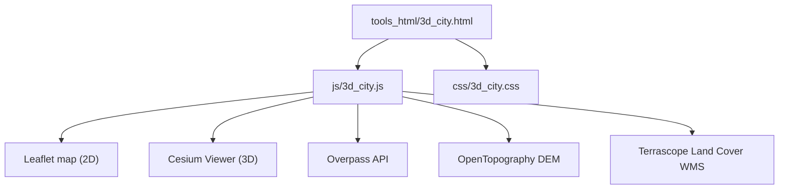
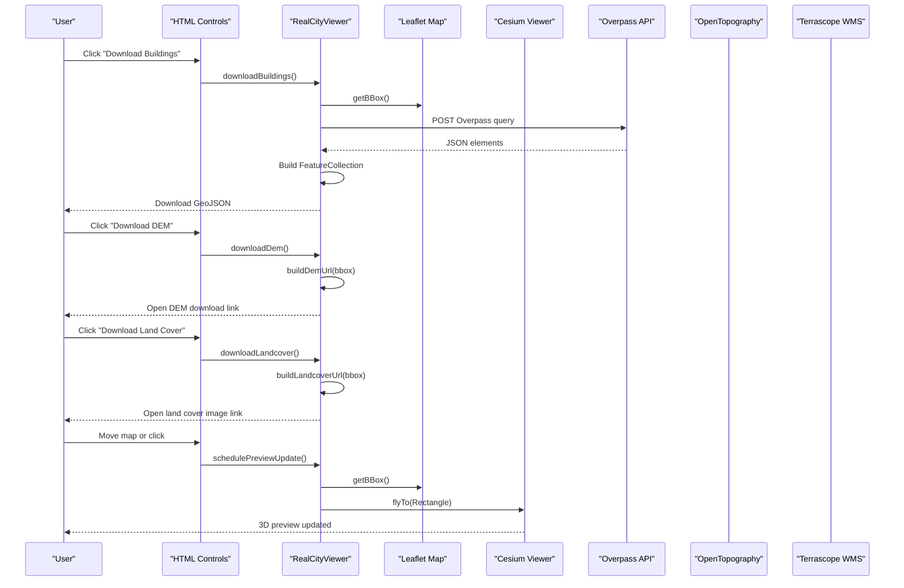
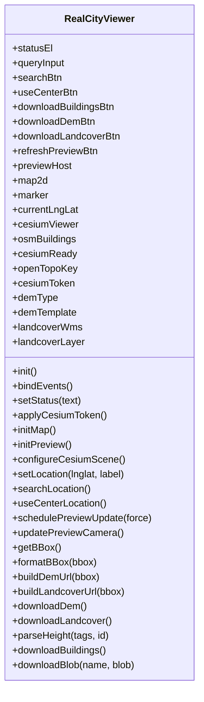
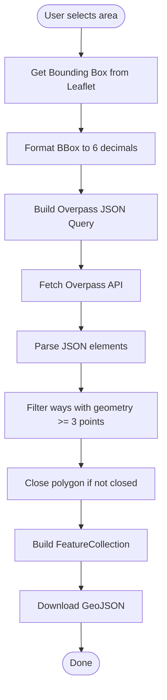
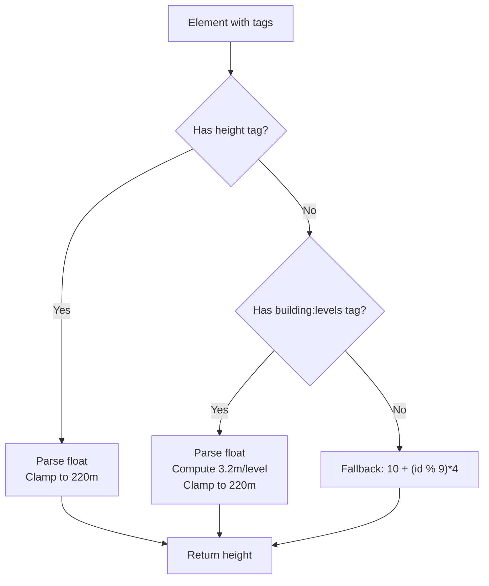
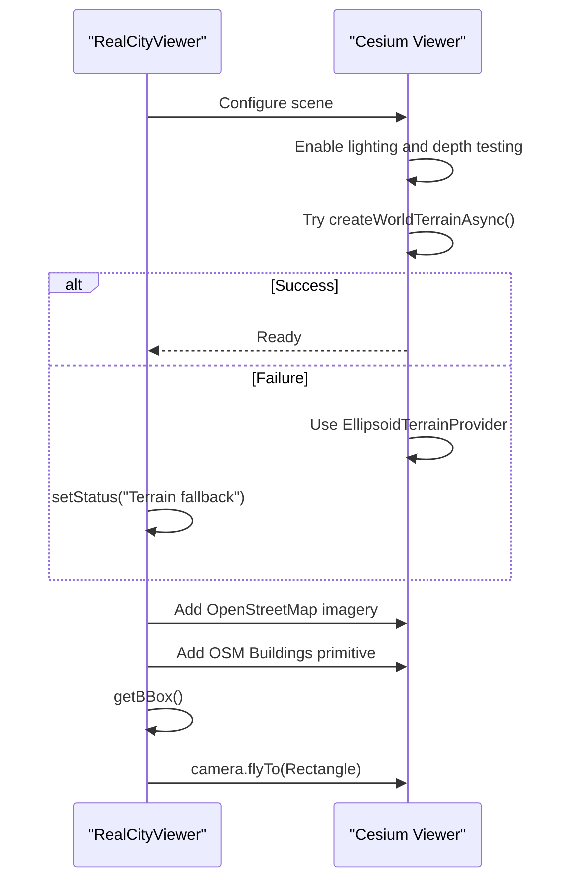
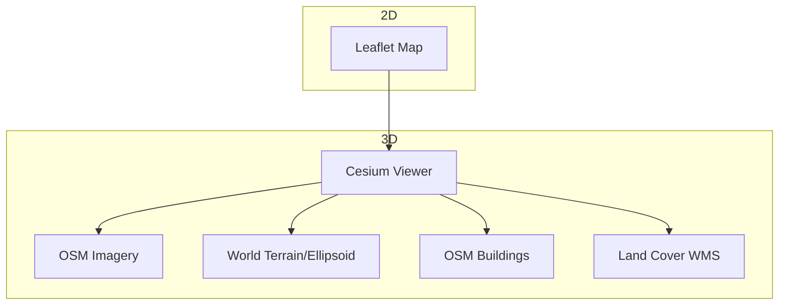
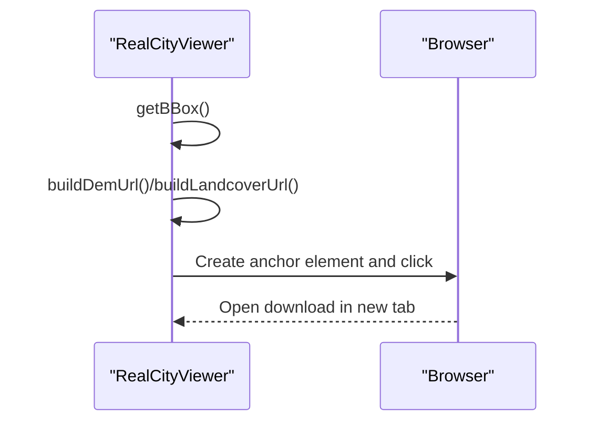
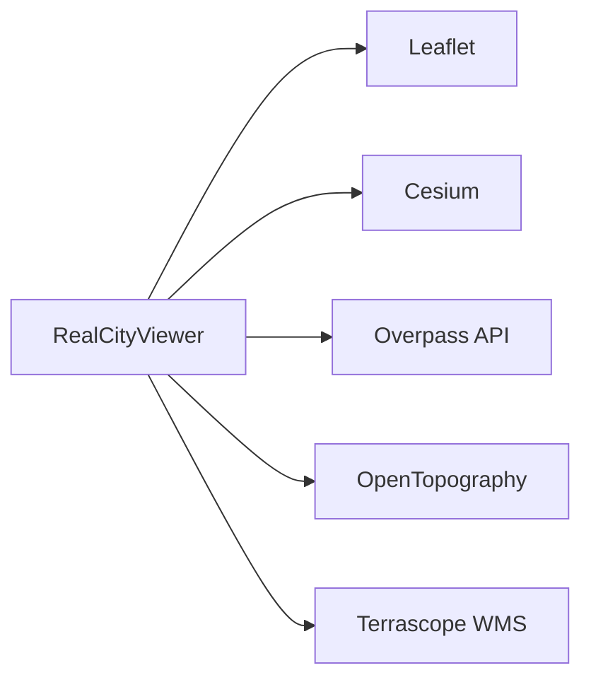

# 3D City/Terrain Generator

<cite>
**Referenced Files in This Document**
- [3d_city.html](file://tools_html/3d_city.html)
- [3d_city.js](file://js/3d_city.js)
- [3d_city.css](file://css/3d_city.css)
</cite>

## Table of Contents
1. [Introduction](#introduction)
2. [Project Structure](#project-structure)
3. [Core Components](#core-components)
4. [Architecture Overview](#architecture-overview)
5. [Detailed Component Analysis](#detailed-component-analysis)
6. [Dependency Analysis](#dependency-analysis)
7. [Performance Considerations](#performance-considerations)
8. [Troubleshooting Guide](#troubleshooting-guide)
9. [Conclusion](#conclusion)
10. [Appendices](#appendices)

## Introduction
This document describes the 3D City/Terrain Generator tool, a browser-based application that integrates OpenStreetMap (OSM) data and Cesium for 3D visualization and export of geographic datasets. It focuses on:
- Geographic data processing pipeline for buildings, terrain, and land cover
- Building extraction from OSM via Overpass API
- Coordinate transformation and bounding box handling
- 3D preview and rendering pipeline using Cesium
- Export workflows for GeoJSON, DEM, and land cover images
- Configuration options and customization guidance
- Limitations of browser-based geospatial processing and alternative data sources

## Project Structure
The tool is organized as a single-page application with a dedicated HTML page, a JavaScript controller, and associated CSS styling.

**Diagram sources**
- [3d_city.html:1-66](file://tools_html/3d_city.html#L1-L66)
- [3d_city.js:1-452](file://js/3d_city.js#L1-L452)
- [3d_city.css:1-204](file://css/3d_city.css#L1-L204)

**Section sources**
- [3d_city.html:1-66](file://tools_html/3d_city.html#L1-L66)
- [3d_city.js:1-452](file://js/3d_city.js#L1-L452)
- [3d_city.css:1-204](file://css/3d_city.css#L1-L204)

## Core Components
- RealCityViewer: Central controller managing UI, map, 3D viewer, and data downloads.
- Leaflet map: 2D map for location selection and bounding box definition.
- Cesium Viewer: 3D globe for terrain, imagery, and OSM building primitives.
- Overpass API: Fetches building polygons within the current bounding box.
- OpenTopography DEM: Downloads elevation data for the selected region.
- Terrascope Land Cover WMS: Retrieves land cover classification imagery.

Key responsibilities:
- UI event binding and status updates
- Location search via Nominatim
- Bounding box computation and formatting
- Download URLs construction for DEM and land cover
- Building extraction and GeoJSON export
- 3D preview camera fly-to and layer configuration

**Section sources**
- [3d_city.js:1-452](file://js/3d_city.js#L1-L452)

## Architecture Overview
The application follows a modular architecture:
- UI layer: HTML controls and status messages
- Controller layer: RealCityViewer orchestrating events and data flows
- Rendering layer: Cesium for 3D visualization
- Data layer: External APIs for OSM, DEM, and land cover

**Diagram sources**
- [3d_city.js:204-276](file://js/3d_city.js#L204-L276)
- [3d_city.js:287-355](file://js/3d_city.js#L287-L355)
- [3d_city.js:374-435](file://js/3d_city.js#L374-L435)

## Detailed Component Analysis

### RealCityViewer Class
Responsibilities:
- Initialize 2D map and 3D viewer
- Apply Cesium Ion token and configure scene
- Manage location search and marker placement
- Compute bounding boxes and format them for external APIs
- Construct download URLs for DEM and land cover
- Download building GeoJSON via Overpass API
- Update 3D preview camera and layers

**Diagram sources**
- [3d_city.js:1-452](file://js/3d_city.js#L1-L452)

**Section sources**
- [3d_city.js:1-452](file://js/3d_city.js#L1-L452)

### Geographic Data Processing Pipeline
- Location search: Uses Nominatim to resolve place names to coordinates.
- Bounding box: Derived from Leaflet map bounds and formatted to six decimals.
- Overpass query: Fetches building ways and parts within the bounding box and returns GeoJSON features with tags.

**Diagram sources**
- [3d_city.js:265-285](file://js/3d_city.js#L265-L285)
- [3d_city.js:382-389](file://js/3d_city.js#L382-L389)
- [3d_city.js:393-435](file://js/3d_city.js#L393-L435)

**Section sources**
- [3d_city.js:204-239](file://js/3d_city.js#L204-L239)
- [3d_city.js:265-285](file://js/3d_city.js#L265-L285)
- [3d_city.js:382-389](file://js/3d_city.js#L382-L389)
- [3d_city.js:393-435](file://js/3d_city.js#L393-L435)

### Building Extraction and Height Parsing
- Extraction: Filters OSM ways with geometry arrays and ensures closed polygons.
- Height parsing: Converts tags to meters with fallback logic when tags are missing or invalid.

**Diagram sources**
- [3d_city.js:357-372](file://js/3d_city.js#L357-L372)

**Section sources**
- [3d_city.js:357-372](file://js/3d_city.js#L357-L372)

### Terrain Generation Workflows
- World Terrain: Configured via Cesium’s asynchronous world terrain provider.
- Fallback: Ellipsoid terrain provider if world terrain fails.
- Imagery: OpenStreetMap imagery provider is set as the base layer.
- Camera: Preview camera flies to a rectangle derived from the bounding box.

**Diagram sources**
- [3d_city.js:137-187](file://js/3d_city.js#L137-L187)
- [3d_city.js:250-263](file://js/3d_city.js#L250-L263)

**Section sources**
- [3d_city.js:137-187](file://js/3d_city.js#L137-L187)
- [3d_city.js:250-263](file://js/3d_city.js#L250-L263)

### Rendering Pipeline
- 2D map: Leaflet tile layer for interactive selection.
- 3D preview: Cesium viewer with configurable imagery and terrain.
- Layers: OSM buildings primitive and land cover WMS layer with transparency.

**Diagram sources**
- [3d_city.js:87-112](file://js/3d_city.js#L87-L112)
- [3d_city.js:137-187](file://js/3d_city.js#L137-L187)

**Section sources**
- [3d_city.js:87-112](file://js/3d_city.js#L87-L112)
- [3d_city.js:137-187](file://js/3d_city.js#L137-L187)

### Configuration Options and Customization
- Tokens and providers:
  - Cesium Ion token applied globally for asset access.
  - OpenTopography API key for DEM downloads.
  - Land cover layer name and WMS endpoint.
- Data types:
  - DEM type selector and template URL.
  - Land cover WMS parameters (layer, format, bbox, resolution).
- UI behavior:
  - Status messages for feedback.
  - Refresh preview button and debounced updates on map move.

Customization examples:
- Change DEM provider: Modify demTemplate and demType.
- Switch land cover layer: Update landcoverLayer and WMS endpoint.
- Adjust preview refresh timing: Tune schedulePreviewUpdate delay.

**Section sources**
- [3d_city.js:21-27](file://js/3d_city.js#L21-L27)
- [3d_city.js:287-317](file://js/3d_city.js#L287-L317)
- [3d_city.js:240-248](file://js/3d_city.js#L240-L248)

### Handling Different Geographic Regions
- Location search: Supports Chinese place names via Nominatim.
- Bounding box: Automatically adapts to the current map view.
- Overpass query: Uses the current bbox to fetch regional buildings.
- DEM and land cover: Construct URLs with the current bbox and configured keys/layers.

Best practices:
- Use “Use view center” to quickly target a region.
- Zoom appropriately to limit Overpass query size.
- Verify API keys and service availability for remote regions.

**Section sources**
- [3d_city.js:204-239](file://js/3d_city.js#L204-L239)
- [3d_city.js:265-285](file://js/3d_city.js#L265-L285)
- [3d_city.js:287-317](file://js/3d_city.js#L287-L317)

### Export Workflows
- Buildings: GeoJSON export of closed polygons with tags.
- DEM: Direct download link to OpenTopography with configured key and type.
- Land cover: WMS GetMap request for land cover classification.

**Diagram sources**
- [3d_city.js:319-355](file://js/3d_city.js#L319-L355)

**Section sources**
- [3d_city.js:319-355](file://js/3d_city.js#L319-L355)

## Dependency Analysis
External dependencies and integrations:
- Leaflet: 2D map rendering and interaction.
- Cesium: 3D globe, terrain, imagery, and OSM buildings.
- Overpass API: OSM building extraction.
- OpenTopography: Global DEM download.
- Terrascope WMS: Land cover imagery.

**Diagram sources**
- [3d_city.js:87-112](file://js/3d_city.js#L87-L112)
- [3d_city.js:137-187](file://js/3d_city.js#L137-L187)
- [3d_city.js:394-398](file://js/3d_city.js#L394-L398)
- [3d_city.js:287-299](file://js/3d_city.js#L287-L299)
- [3d_city.js:301-317](file://js/3d_city.js#L301-L317)

**Section sources**
- [3d_city.js:87-112](file://js/3d_city.js#L87-L112)
- [3d_city.js:137-187](file://js/3d_city.js#L137-L187)
- [3d_city.js:287-317](file://js/3d_city.js#L287-L317)
- [3d_city.js:394-398](file://js/3d_city.js#L394-L398)

## Performance Considerations
- Debounced preview updates: A timer delays camera updates while the user moves the map to reduce frequent requests.
- Overpass query timeouts: The query sets a timeout to prevent long waits.
- Browser constraints: Large GeoJSON exports and high-resolution land cover tiles can impact memory and responsiveness.
- Recommendations:
  - Limit the area for Overpass queries by zooming in.
  - Prefer smaller land cover tile sizes when possible.
  - Use the “Refresh preview” button to trigger updates after major changes.

[No sources needed since this section provides general guidance]

## Troubleshooting Guide
Common issues and resolutions:
- Cesium token missing: The app checks for a token and displays a message if absent.
- Terrain loading failures: Falls back to ellipsoid terrain and informs the user.
- Overpass rate limits: Network errors or throttling may occur; retry later or reduce query size.
- Missing API keys: DEM download requires a valid OpenTopography key.
- Land cover WMS failures: Verify layer name and endpoint availability.

Actions:
- Check status messages for hints.
- Confirm network connectivity and external service availability.
- Re-run preview refresh after adjusting settings.

**Section sources**
- [3d_city.js:75-85](file://js/3d_city.js#L75-L85)
- [3d_city.js:147-151](file://js/3d_city.js#L147-L151)
- [3d_city.js:331-333](file://js/3d_city.js#L331-L333)
- [3d_city.js:432-434](file://js/3d_city.js#L432-L434)

## Conclusion
The 3D City/Terrain Generator provides a streamlined workflow to explore and export geographic data directly in the browser. By integrating OSM via Overpass, Cesium for 3D visualization, and external services for DEM and land cover, it enables quick prototyping and analysis of urban environments. Users can tailor parameters such as DEM type, land cover layer, and preview behavior to fit their needs.

[No sources needed since this section summarizes without analyzing specific files]

## Appendices

### UI Controls Reference
- Location search: Enter a place name and press Enter or click search.
- Use view center: Center the map on the current view.
- Download buttons: Export buildings (GeoJSON), DEM, and land cover.
- Refresh preview: Manually update the 3D preview.

**Section sources**
- [3d_city.html:26-61](file://tools_html/3d_city.html#L26-L61)
- [3d_city.js:39-65](file://js/3d_city.js#L39-L65)

### Styling Notes
- Responsive layout with a sidebar for controls and a two-row preview area.
- Dark theme with gradient backgrounds and subtle borders.
- Status bar for runtime feedback.

**Section sources**
- [3d_city.css:1-204](file://css/3d_city.css#L1-L204)