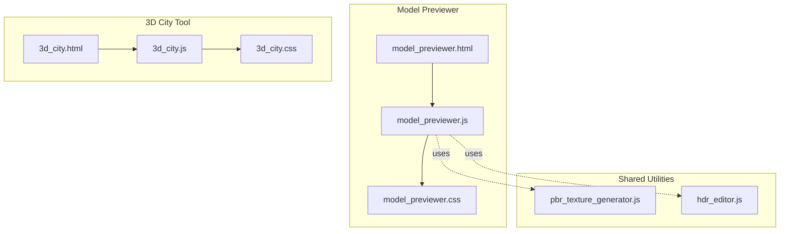
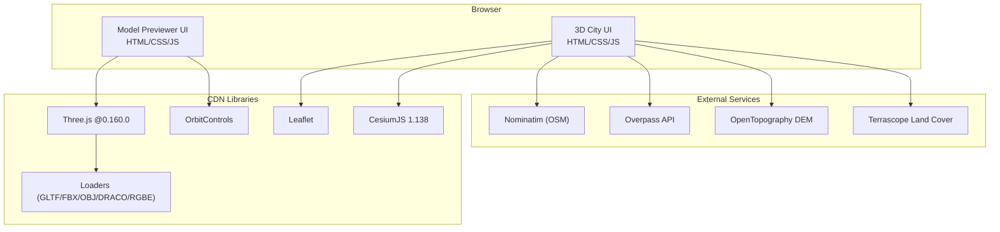
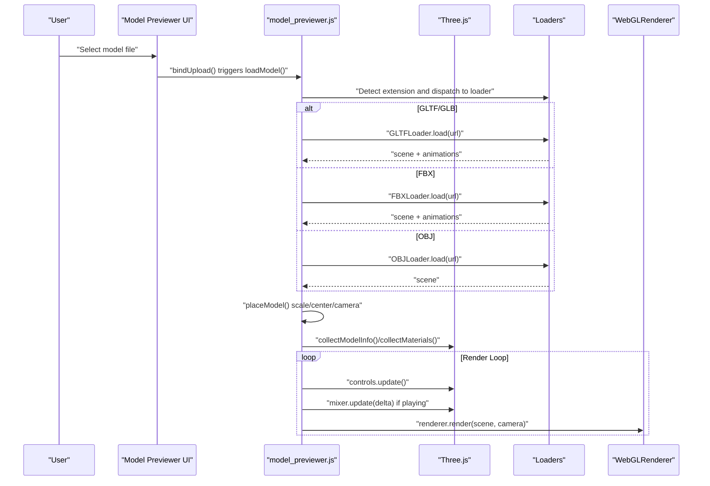
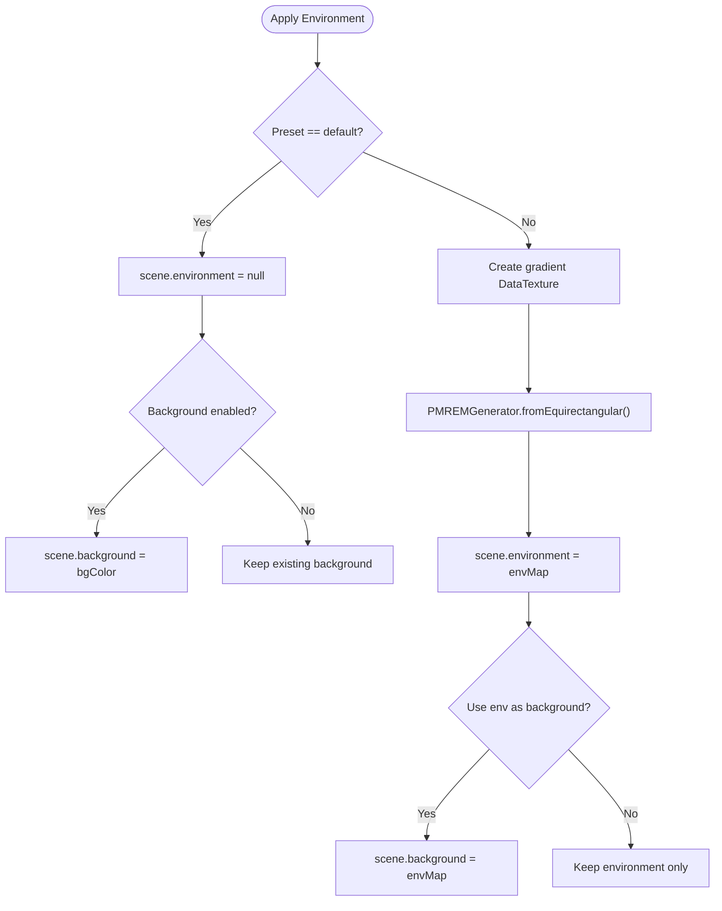
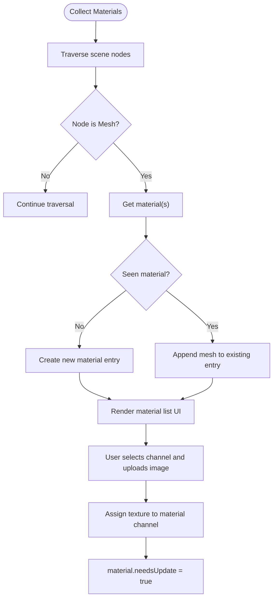
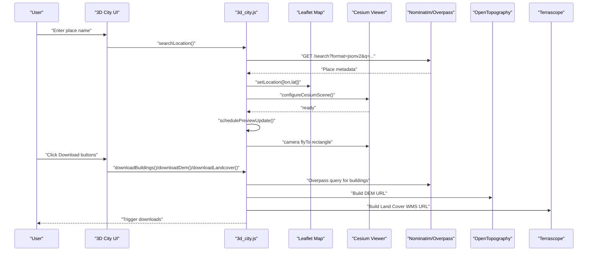
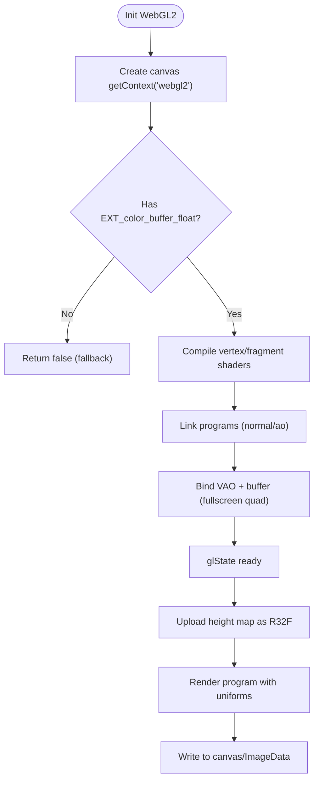
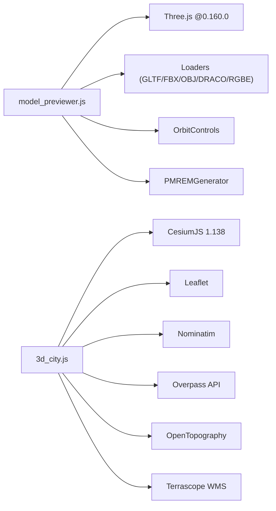

# 3D Tools

<cite>
**Referenced Files in This Document**
- [model_previewer.js](file://js/model_previewer.js)
- [model_previewer.css](file://css/model_previewer.css)
- [model_previewer.html](file://tools_html/model_previewer.html)
- [3d_city.js](file://js/3d_city.js)
- [3d_city.css](file://css/3d_city.css)
- [3d_city.html](file://tools_html/3d_city.html)
- [pbr_texture_generator.js](file://js/pbr_texture_generator.js)
- [hdr_editor.js](file://js/hdr_editor.js)
</cite>

## Table of Contents
1. [Introduction](#introduction)
2. [Project Structure](#project-structure)
3. [Core Components](#core-components)
4. [Architecture Overview](#architecture-overview)
5. [Detailed Component Analysis](#detailed-component-analysis)
6. [Dependency Analysis](#dependency-analysis)
7. [Performance Considerations](#performance-considerations)
8. [Troubleshooting Guide](#troubleshooting-guide)
9. [Conclusion](#conclusion)
10. [Appendices](#appendices)

## Introduction
This document describes the 3D tools suite focused on model previewing and terrain generation. It explains the Three.js integration, WebGL rendering pipeline, environment setup systems, OpenStreetMap integration for city generation, geographic data processing, and building extraction algorithms. It also documents workflows for model import/export, lighting setup, material visualization, terrain generation, supported 3D formats, environment customization, performance optimization, and browser compatibility with fallback strategies.

## Project Structure
The 3D tools are organized into two primary applications:
- Model Previewer: interactive viewer for 3D models with animation, materials inspection, wireframe/skeleton overlays, environment presets, and screenshot export.
- 3D City Tool: real-time city preview using Cesium with OpenStreetMap integration, building extraction, terrain and land cover overlays, and export capabilities.

**Diagram sources**
- [model_previewer.html:1-211](file://tools_html/model_previewer.html#L1-L211)
- [model_previewer.js:1-843](file://js/model_previewer.js#L1-L843)
- [model_previewer.css:1-473](file://css/model_previewer.css#L1-L473)
- [3d_city.html:1-66](file://tools_html/3d_city.html#L1-L66)
- [3d_city.js:1-452](file://js/3d_city.js#L1-L452)
- [3d_city.css:1-204](file://css/3d_city.css#L1-L204)
- [pbr_texture_generator.js:1-763](file://js/pbr_texture_generator.js#L1-L763)
- [hdr_editor.js:1-1697](file://js/hdr_editor.js#L1-L1697)

**Section sources**
- [model_previewer.html:1-211](file://tools_html/model_previewer.html#L1-L211)
- [3d_city.html:1-66](file://tools_html/3d_city.html#L1-L66)

## Core Components
- Three.js Model Previewer
  - Loads GLB/GLTF/FBX/OBJ via loaders with optional Draco compression.
  - Manages scene, camera, renderer, lighting, and controls.
  - Provides material inspection, wireframe toggle, skeleton helper, environment presets, HDR upload, animation playback, comparison mode, and screenshot export.
- 3D City Viewer
  - Integrates Leaflet for 2D map and Cesium for 3D globe.
  - Downloads buildings from Overpass API, terrain from OpenTopography, and land cover from Terrascope WMTS/WMS.
  - Applies OSM buildings and imagery providers, and updates camera view based on map bounds.

**Section sources**
- [model_previewer.js:13-86](file://js/model_previewer.js#L13-L86)
- [3d_city.js:1-30](file://js/3d_city.js#L1-L30)

## Architecture Overview
The system combines a client-side Three.js model previewer with a Cesium-powered 3D city tool. Both rely on modern web APIs and CDN-hosted libraries.

**Diagram sources**
- [model_previewer.js:13-38](file://js/model_previewer.js#L13-L38)
- [3d_city.js:1-30](file://js/3d_city.js#L1-L30)
- [3d_city.html:10-16](file://tools_html/3d_city.html#L10-L16)

## Detailed Component Analysis

### Model Previewer: Three.js Integration and Rendering Pipeline
- Dependency Loading
  - Dynamically imports Three.js and loaders from CDN with fallbacks.
  - Initializes PMREM generator for environment mapping.
- Renderer and Scene Setup
  - WebGLRenderer with antialiasing, sRGB color space, ACES tone mapping, soft shadows.
  - Scene background color and grid helper for spatial orientation.
- Camera and Controls
  - Perspective camera with damping orbit controls; auto-rotate option.
- Lighting
  - Ambient, directional key light, and fill rim light; shadows enabled for directional light.
- Model Loading and Placement
  - Supports GLB/GLTF (with Draco), FBX, OBJ.
  - Auto-scale and center model; adjust camera target accordingly.
- Animation
  - AnimationMixer for clips; play/pause/stop/timeline; adjustable speed.
- Materials and Textures
  - Traverses scene to collect materials and textures; highlights selected material.
  - Replaces PBR textures (albedo, normal, roughness, metalness, AO) with uploaded images.
- Environment and Background
  - Preset environments (studio/outdoor/night) generated from gradient DataTextures.
  - HDR environment via RGBE loader; optional background assignment.
- Comparison Mode
  - Side-by-side or overlay comparison with transparency.
- Export
  - Screenshot export as PNG.

**Diagram sources**
- [model_previewer.js:173-213](file://js/model_previewer.js#L173-L213)
- [model_previewer.js:215-250](file://js/model_previewer.js#L215-L250)
- [model_previewer.js:158-170](file://js/model_previewer.js#L158-L170)

**Section sources**
- [model_previewer.js:13-86](file://js/model_previewer.js#L13-L86)
- [model_previewer.js:173-213](file://js/model_previewer.js#L173-L213)
- [model_previewer.js:215-250](file://js/model_previewer.js#L215-L250)
- [model_previewer.js:304-346](file://js/model_previewer.js#L304-L346)
- [model_previewer.js:349-436](file://js/model_previewer.js#L349-L436)
- [model_previewer.js:476-554](file://js/model_previewer.js#L476-L554)
- [model_previewer.js:557-626](file://js/model_previewer.js#L557-L626)
- [model_previewer.js:659-665](file://js/model_previewer.js#L659-L665)
- [model_previewer.css:1-473](file://css/model_previewer.css#L1-L473)
- [model_previewer.html:1-211](file://tools_html/model_previewer.html#L1-L211)

### Environment and Lighting Systems
- Environment Presets
  - Generates gradient DataTextures and converts to environment maps via PMREM.
  - Can assign environment as scene background or keep custom background color.
- HDR Environment
  - RGBE loader reads .hdr files and generates environment map.
- Lighting
  - Ambient, directional key, and fill lights; configurable intensity and shadow settings.

**Diagram sources**
- [model_previewer.js:476-538](file://js/model_previewer.js#L476-L538)

**Section sources**
- [model_previewer.js:476-554](file://js/model_previewer.js#L476-L554)

### Material Inspection and PBR Texture Replacement
- Material Collection
  - Traverses scene to collect materials and associated meshes; deduplicates by UUID.
- Visualization
  - Renders material cards with color swatch and metallic/roughness indicators.
- Selection and Highlight
  - Highlights selected material with emissive glow.
- Texture Replacement
  - Replaces albedo/normal/roughness/metalness/AO channels with uploaded images; sets color spaces appropriately.

**Diagram sources**
- [model_previewer.js:349-436](file://js/model_previewer.js#L349-L436)
- [model_previewer.js:641-656](file://js/model_previewer.js#L641-L656)

**Section sources**
- [model_previewer.js:349-436](file://js/model_previewer.js#L349-L436)
- [model_previewer.js:641-656](file://js/model_previewer.js#L641-L656)

### 3D City Tool: OpenStreetMap Integration and Terrain Generation
- Map and 3D Globe
  - Leaflet map centered on Beijing; click to set location marker.
  - Cesium Viewer with World Terrain, OSM imagery, and OSM Buildings.
- Location Search
  - Nominatim reverse geocoding to resolve place names to coordinates.
- Building Extraction
  - Overpass API query for building ways and parts within map bounds; exports GeoJSON.
- Terrain and Land Cover
  - DEM download via OpenTopography template.
  - Land cover WMS overlay from Terrascope.
- Camera Preview
  - Fly-to rectangle covering current map bounds; throttled updates.

**Diagram sources**
- [3d_city.js:204-230](file://js/3d_city.js#L204-L230)
- [3d_city.js:374-435](file://js/3d_city.js#L374-L435)
- [3d_city.js:287-299](file://js/3d_city.js#L287-L299)
- [3d_city.js:342-355](file://js/3d_city.js#L342-L355)
- [3d_city.js:301-317](file://js/3d_city.js#L301-L317)

**Section sources**
- [3d_city.js:87-187](file://js/3d_city.js#L87-L187)
- [3d_city.js:204-230](file://js/3d_city.js#L204-L230)
- [3d_city.js:374-435](file://js/3d_city.js#L374-L435)
- [3d_city.js:287-317](file://js/3d_city.js#L287-L317)
- [3d_city.css:1-204](file://css/3d_city.css#L1-L204)
- [3d_city.html:1-66](file://tools_html/3d_city.html#L1-L66)

### PBR Texture Generation (WebGL2 Path)
While primarily used in the PBR Texture Generator tool, the WebGL2 path demonstrates advanced texture synthesis techniques that complement the model previewer’s material visualization:
- GPU-based normal map generation and ambient occlusion computation.
- Float texture support and fullscreen quad rendering.
- CPU fallbacks for reflection/glossiness maps.

**Diagram sources**
- [pbr_texture_generator.js:261-317](file://js/pbr_texture_generator.js#L261-L317)
- [pbr_texture_generator.js:330-426](file://js/pbr_texture_generator.js#L330-L426)

**Section sources**
- [pbr_texture_generator.js:261-317](file://js/pbr_texture_generator.js#L261-L317)
- [pbr_texture_generator.js:330-426](file://js/pbr_texture_generator.js#L330-L426)

## Dependency Analysis
- Three.js Model Previewer depends on:
  - Three.js core and loaders (GLTF/FBX/OBJ/DRACO/RGBE).
  - OrbitControls for camera manipulation.
  - PMREMGenerator for environment mapping.
- 3D City Tool depends on:
  - CesiumJS for 3D globe and terrain.
  - Leaflet for 2D map and markers.
  - External services for geocoding, building data, DEM, and land cover.

**Diagram sources**
- [model_previewer.js:13-38](file://js/model_previewer.js#L13-L38)
- [3d_city.js:1-30](file://js/3d_city.js#L1-L30)
- [3d_city.html:10-16](file://tools_html/3d_city.html#L10-L16)

**Section sources**
- [model_previewer.js:13-38](file://js/model_previewer.js#L13-L38)
- [3d_city.js:1-30](file://js/3d_city.js#L1-L30)

## Performance Considerations
- Three.js Rendering
  - Antialiasing and soft shadows improve quality but reduce FPS; disable or lower quality for complex scenes.
  - Use devicePixelRatio clamping to limit resolution on high-DPI displays.
  - Dispose geometries and materials when replacing models to prevent memory leaks.
  - Prefer Draco-compressed GLB/GLTF to reduce transfer sizes.
- Animation Playback
  - Limit concurrent animations; pause timeline scrubbing while updating mixer manually.
- Environment and Lighting
  - PMREM generation is expensive; reuse environment maps and avoid frequent regeneration.
  - Reduce shadow map resolution for mobile devices.
- 3D City Tool
  - Debounce map move events to avoid frequent Cesium updates.
  - Use smaller tile sizes for building extraction and DEM/Land Cover requests.
- WebGL2 Texture Generation
  - Float textures require extensions; fall back to CPU paths if unavailable.
  - Batch texture operations and avoid frequent re-uploads.

[No sources needed since this section provides general guidance]

## Troubleshooting Guide
- Model Loading Failures
  - Unsupported format: ensure GLB/GLTF/FBX/OBJ.
  - Network errors: verify CDN availability or switch CDN host.
  - Draco decoding: confirm decoder path is set for GLTFLoader.
- Environment Issues
  - HDR load failures: ensure RGBELoader is available and file is valid.
  - Environment not applying: check PMREM generation and assignment steps.
- 3D City Tool
  - Geocoding timeouts: retry Nominatim or use a proxy.
  - Overpass rate limits: throttle requests or cache results.
  - Cesium terrain/image providers: handle fallback to EllipsoidTerrainProvider and default imagery.
- Browser Compatibility
  - WebGL2 required for advanced texture generation; detect support and provide CPU fallback.
  - Some browsers restrict autoplay; initialize user gesture before starting animations.

**Section sources**
- [model_previewer.js:196-212](file://js/model_previewer.js#L196-L212)
- [model_previewer.js:540-554](file://js/model_previewer.js#L540-L554)
- [3d_city.js:137-187](file://js/3d_city.js#L137-L187)
- [3d_city.js:204-230](file://js/3d_city.js#L204-L230)
- [3d_city.js:374-435](file://js/3d_city.js#L374-L435)

## Conclusion
The 3D tools suite integrates Three.js for model previewing and Cesium for city-scale terrain visualization. The model previewer offers robust material inspection, environment customization, and export workflows. The city tool leverages OpenStreetMap and external services to generate realistic 3D scenes with building extraction, terrain, and land cover overlays. By following the documented workflows and performance guidelines, developers can optimize complex scenes and ensure broad browser compatibility.

[No sources needed since this section summarizes without analyzing specific files]

## Appendices

### Supported 3D Formats
- GLB/GLTF: with optional Draco compression.
- FBX: native Three.js loader.
- OBJ: basic geometry loader.

**Section sources**
- [model_previewer.js:196-212](file://js/model_previewer.js#L196-L212)

### Environment Customization Options
- Preset environments: studio, outdoor, night.
- HDR environment via RGBE loader.
- Toggle environment as background.

**Section sources**
- [model_previewer.js:476-554](file://js/model_previewer.js#L476-L554)

### Browser Compatibility and Fallbacks
- Three.js loaders are loaded dynamically from CDNs with fallbacks.
- WebGL2-dependent features (e.g., float textures) should be guarded; provide CPU fallbacks when unsupported.
- Cesium terrain/image provider failures should be handled gracefully with defaults.

**Section sources**
- [model_previewer.js:6-38](file://js/model_previewer.js#L6-L38)
- [pbr_texture_generator.js:261-317](file://js/pbr_texture_generator.js#L261-L317)
- [3d_city.js:137-187](file://js/3d_city.js#L137-L187)