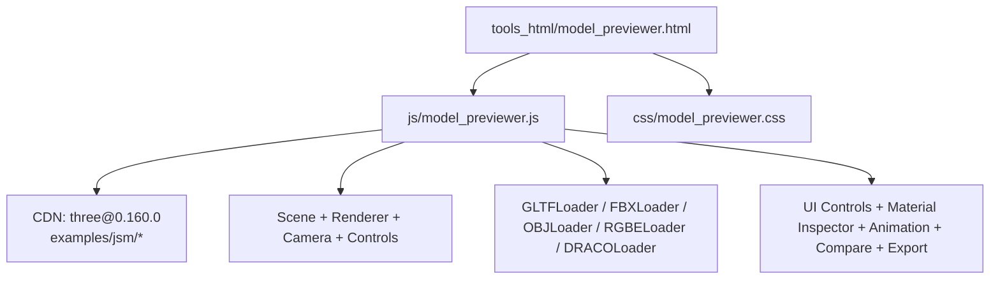
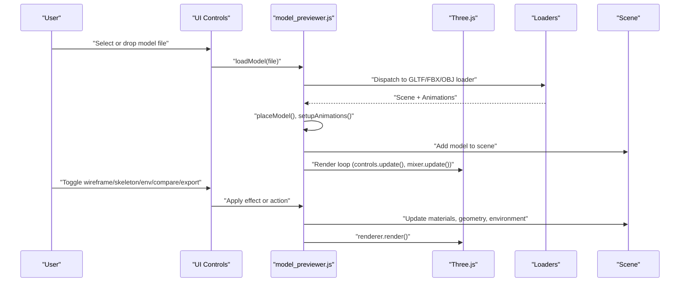
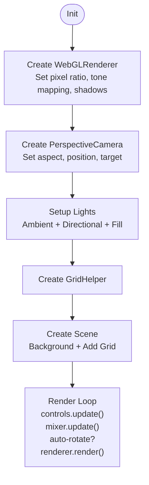
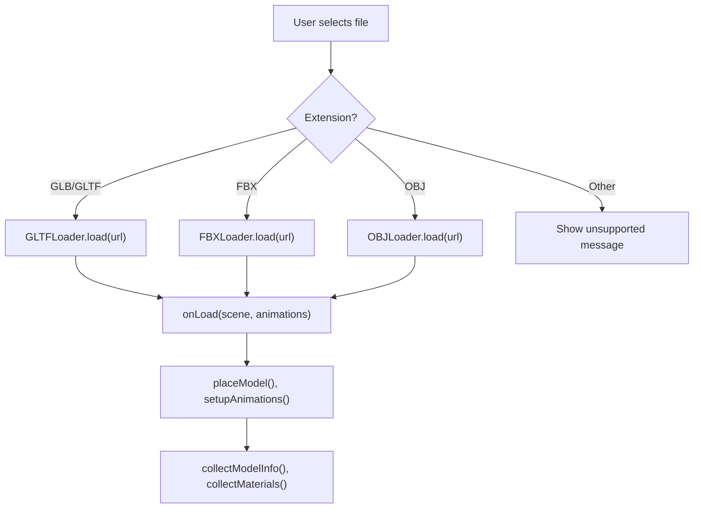
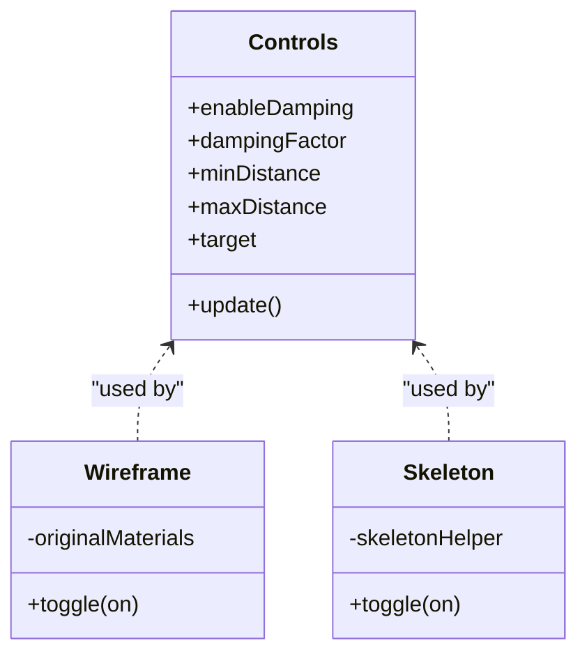
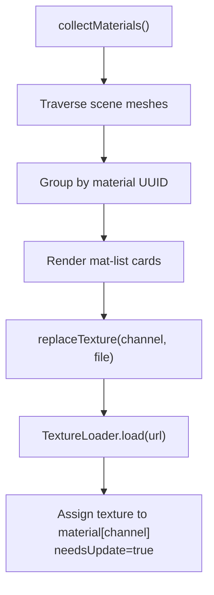
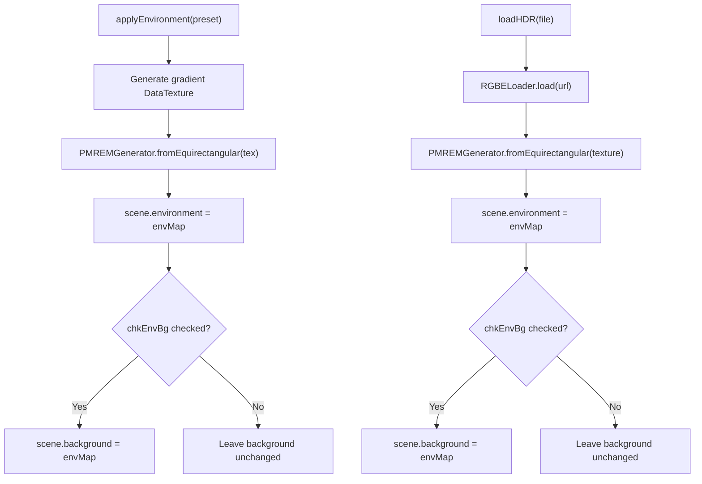
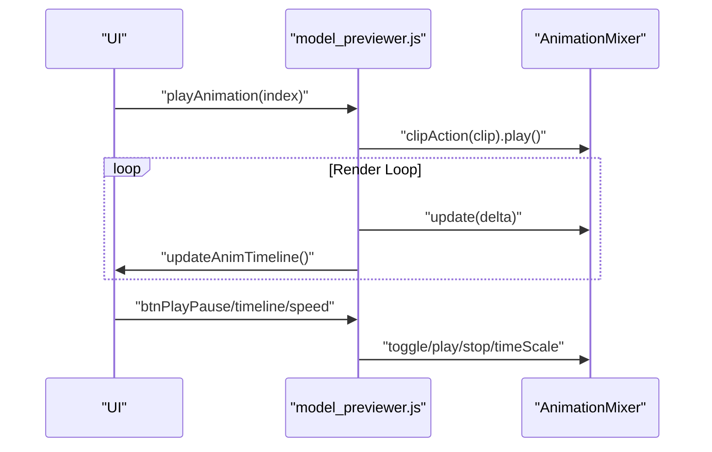
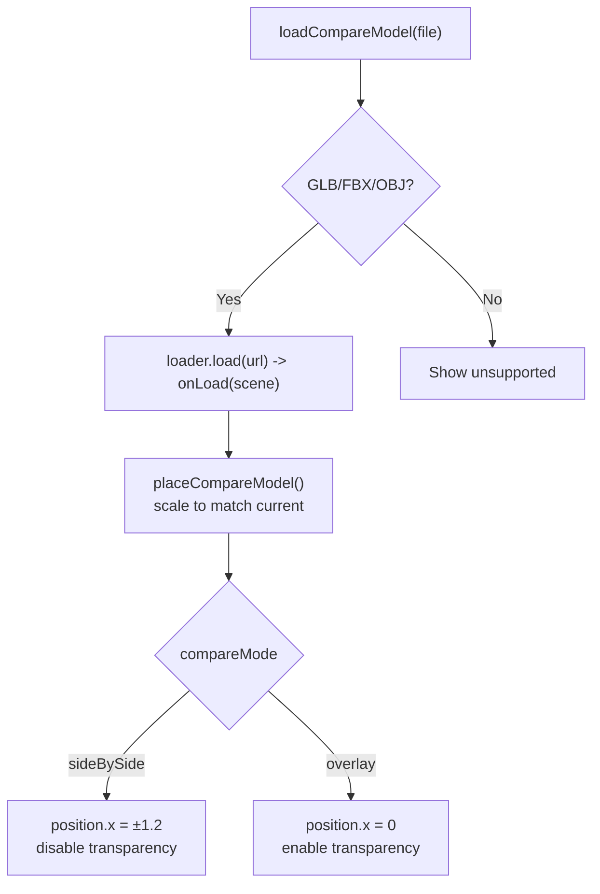
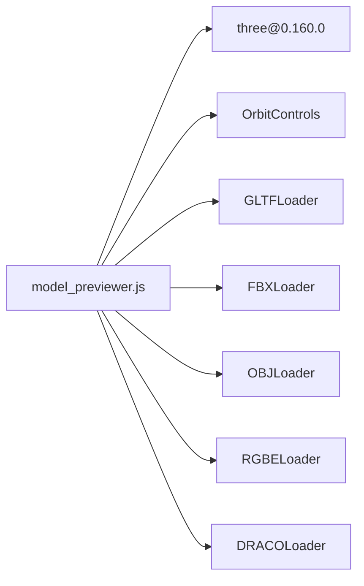

# Model Previewer

<cite>
**Referenced Files in This Document**
- [model_previewer.js](file://js/model_previewer.js)
- [model_previewer.css](file://css/model_previewer.css)
- [model_previewer.html](file://tools_html/model_previewer.html)
</cite>

## Table of Contents
1. [Introduction](#introduction)
2. [Project Structure](#project-structure)
3. [Core Components](#core-components)
4. [Architecture Overview](#architecture-overview)
5. [Detailed Component Analysis](#detailed-component-analysis)
6. [Dependency Analysis](#dependency-analysis)
7. [Performance Considerations](#performance-considerations)
8. [Troubleshooting Guide](#troubleshooting-guide)
9. [Conclusion](#conclusion)
10. [Appendices](#appendices)

## Introduction
This document provides comprehensive documentation for the Model Previewer tool, a Three.js–based 3D model viewer integrated into the TAWEBTOOL ecosystem. It explains the WebGL rendering pipeline, supported 3D formats (GLB, GLTF, FBX, OBJ), model loading workflows, interactive controls (orbit controls, auto-rotation, wireframe mode, skeleton visualization), material inspection and PBR texture replacement, environment mapping, animation playback, model comparison, and screenshot capture. It also includes practical guidance on optimization, performance considerations for large scenes, and troubleshooting common loading issues.

## Project Structure
The Model Previewer is implemented as a self-contained HTML page with associated JavaScript and CSS assets. The runtime integrates Three.js via CDN and uses Three.js loaders and controls to render and manipulate 3D models.

**Diagram sources**
- [model_previewer.html:1-211](file://tools_html/model_previewer.html#L1-L211)
- [model_previewer.js:13-38](file://js/model_previewer.js#L13-L38)
- [model_previewer.css:1-473](file://css/model_previewer.css#L1-L473)

**Section sources**
- [model_previewer.html:1-211](file://tools_html/model_previewer.html#L1-L211)
- [model_previewer.js:13-38](file://js/model_previewer.js#L13-L38)
- [model_previewer.css:1-473](file://css/model_previewer.css#L1-L473)

## Core Components
- Three.js initialization and dependency loading via CDN with fallbacks
- WebGL renderer with tone mapping and shadow configuration
- Scene with lighting and grid helper
- OrbitControls for camera manipulation
- Model loaders for GLB/GLTF, FBX, and OBJ with optional DRACO compression
- Animation mixer and timeline controls
- Material inspector and PBR texture replacement
- Environment presets and HDR environment mapping
- Model comparison (side-by-side and overlay modes)
- Screenshot export

**Section sources**
- [model_previewer.js:56-106](file://js/model_previewer.js#L56-L106)
- [model_previewer.js:172-213](file://js/model_previewer.js#L172-L213)
- [model_previewer.js:303-346](file://js/model_previewer.js#L303-L346)
- [model_previewer.js:348-436](file://js/model_previewer.js#L348-L436)
- [model_previewer.js:475-554](file://js/model_previewer.js#L475-L554)
- [model_previewer.js:556-638](file://js/model_previewer.js#L556-L638)
- [model_previewer.js:658-665](file://js/model_previewer.js#L658-L665)

## Architecture Overview
The application follows a modular architecture:
- Initialization phase loads Three.js and creates renderer, scene, camera, and controls
- UI binds events for model upload, display toggles, environment selection, animation playback, comparison, and export
- Model loading routes to appropriate loaders based on file extension
- Runtime loop updates controls, animations, and renders frames
- Material inspection and texture replacement operate on the current model’s materials

**Diagram sources**
- [model_previewer.js:172-213](file://js/model_previewer.js#L172-L213)
- [model_previewer.js:157-170](file://js/model_previewer.js#L157-L170)
- [model_previewer.js:556-638](file://js/model_previewer.js#L556-L638)

## Detailed Component Analysis

### WebGL Rendering Pipeline
- Renderer: WebGLRenderer configured with antialiasing, sRGB color space, ACES filmic tone mapping, exposure, and PCF soft shadows
- Camera: Perspective camera initialized with aspect ratio and near/far planes
- Lighting: Ambient, directional, and fill lights; shadows enabled for directional light
- Scene: Grid helper for ground plane; background color or environment map
- Render loop: Updates controls and mixer, optionally auto-rotates model, and renders each frame

**Diagram sources**
- [model_previewer.js:93-155](file://js/model_previewer.js#L93-L155)
- [model_previewer.js:157-170](file://js/model_previewer.js#L157-L170)

**Section sources**
- [model_previewer.js:93-155](file://js/model_previewer.js#L93-L155)
- [model_previewer.js:157-170](file://js/model_previewer.js#L157-L170)

### Supported 3D Formats and Loading Workflows
- Formats: GLB/GLTF, FBX, OBJ
- Loaders: Dynamically imported from CDN; GLTF loader optionally configured with DRACO decompressor
- Workflow:
  - Detect file extension
  - Create object URL for streaming
  - Dispatch to loader based on extension
  - On success: place model, setup animations, collect info and materials
  - On error: show status and cleanup

**Diagram sources**
- [model_previewer.js:172-213](file://js/model_previewer.js#L172-L213)
- [model_previewer.js:70-81](file://js/model_previewer.js#L70-L81)

**Section sources**
- [model_previewer.js:172-213](file://js/model_previewer.js#L172-L213)
- [model_previewer.js:70-81](file://js/model_previewer.js#L70-L81)

### Interactive Controls System
- OrbitControls: damping enabled, min/max distance set, target centered
- Auto-rotation: optional rotation around Y-axis during render loop
- Wireframe mode: toggles material.wireframe and restores original state
- Skeleton visualization: adds SkeletonHelper if bones present
- Grid visibility: toggled via UI checkbox
- Background color: updates scene.background unless environment is used as background

**Diagram sources**
- [model_previewer.js:127-137](file://js/model_previewer.js#L127-L137)
- [model_previewer.js:438-454](file://js/model_previewer.js#L438-L454)
- [model_previewer.js:456-473](file://js/model_previewer.js#L456-L473)

**Section sources**
- [model_previewer.js:127-137](file://js/model_previewer.js#L127-L137)
- [model_previewer.js:438-454](file://js/model_previewer.js#L438-L454)
- [model_previewer.js:456-473](file://js/model_previewer.js#L456-L473)

### Material Inspection and PBR Texture Replacement
- Material collection: traverses scene to gather unique materials and associated meshes
- Material list UI: displays swatch, name, and metallic/roughness values; clicking highlights emissive emission
- Texture replacement: allows replacing albedo, normal, roughness, metalness, and AO maps per material
- Color space handling: sRGB for albedo, linear for normal/roughness/metalness/AO

**Diagram sources**
- [model_previewer.js:348-436](file://js/model_previewer.js#L348-L436)
- [model_previewer.js:640-656](file://js/model_previewer.js#L640-L656)

**Section sources**
- [model_previewer.js:348-436](file://js/model_previewer.js#L348-L436)
- [model_previewer.js:640-656](file://js/model_previewer.js#L640-L656)

### Environment Mapping and Presets
- Preset environments: studio, outdoor, night; generated via gradient DataTexture and PMREM
- HDR environment: RGBELoader reads uploaded .hdr and converts to environment/background
- Toggle environment as background: switches scene.background between color and environment map

**Diagram sources**
- [model_previewer.js:475-554](file://js/model_previewer.js#L475-L554)

**Section sources**
- [model_previewer.js:475-554](file://js/model_previewer.js#L475-L554)

### Animation Playback Controls
- Animation setup: creates AnimationMixer and populates clip list from loaded animations
- Playback: play/pause/stop, timeline scrubbing, speed adjustment
- Timeline synchronization: updates slider and time display; pauses render loop when scrubbing

**Diagram sources**
- [model_previewer.js:303-346](file://js/model_previewer.js#L303-L346)

**Section sources**
- [model_previewer.js:303-346](file://js/model_previewer.js#L303-L346)

### Model Comparison Features
- Load second model and scale to match current model’s bounding box
- Side-by-side mode: positions models apart, disables transparency
- Overlay mode: centers models, enables transparency for visual comparison

**Diagram sources**
- [model_previewer.js:556-638](file://js/model_previewer.js#L556-L638)

**Section sources**
- [model_previewer.js:556-638](file://js/model_previewer.js#L556-L638)

### Screenshot Capture
- Renders current frame, creates a download link, and triggers PNG download

**Section sources**
- [model_previewer.js:658-665](file://js/model_previewer.js#L658-L665)

### UI and Layout
- Left panel: upload, model info, display options, environment, animation, comparison, export
- Center viewport: WebGL canvas with drag-and-drop overlays and loading indicator
- Right panel: material inspector and PBR texture replacement slots
- Responsive layout adapts to screen size

**Section sources**
- [model_previewer.html:25-196](file://tools_html/model_previewer.html#L25-L196)
- [model_previewer.css:35-473](file://css/model_previewer.css#L35-L473)

## Dependency Analysis
- Three.js core and examples modules are dynamically imported from CDN with fallbacks
- Optional loaders: GLTFLoader (with DRACO), FBXLoader, OBJLoader, RGBELoader
- Controls: OrbitControls from examples/jsm
- Internal dependencies: renderer, scene, camera, controls, clock, mixer, helpers, environment map generator

**Diagram sources**
- [model_previewer.js:13-38](file://js/model_previewer.js#L13-L38)

**Section sources**
- [model_previewer.js:13-38](file://js/model_previewer.js#L13-L38)

## Performance Considerations
- Rendering
  - Antialiasing enabled; consider disabling on low-end devices
  - Shadow map enabled; reduce shadow resolution or disable for heavy scenes
  - Tone mapping and exposure tuned for realistic lighting
- Memory and disposal
  - Dispose geometries and materials when replacing models or clearing comparisons
  - Revoke object URLs after loading
- Large scenes
  - Prefer GLB/GLTF with DRACO compression to reduce bundle size
  - Use environment maps judiciously; consider disabling background environment for performance
- UI responsiveness
  - Debounce or throttle frequent UI updates (e.g., timeline scrubbing)
  - Avoid excessive re-renders by updating only when necessary

[No sources needed since this section provides general guidance]

## Troubleshooting Guide
- Unsupported format
  - Ensure file extension is GLB/GLTF/FBX/OBJ; otherwise, show “unsupported” status
- Loader availability
  - If loaders fail to import, the app falls back to null loaders; verify network connectivity to CDN
- DRACO compression
  - DRACO loader requires decoder path; ensure CDN path is reachable
- HDR environment
  - RGBELoader must be available; upload .hdr files only
- Model scaling and placement
  - Models are auto-scaled and centered; if clipping occurs, adjust camera or reduce auto-scale threshold
- Animation playback
  - If animations do not play, confirm the model contains animation clips and mixer is created
- Screenshot quality
  - Preserve drawing buffer is enabled; ensure renderer DOM element is visible when capturing

**Section sources**
- [model_previewer.js:196-212](file://js/model_previewer.js#L196-L212)
- [model_previewer.js:73-81](file://js/model_previewer.js#L73-L81)
- [model_previewer.js:540-554](file://js/model_previewer.js#L540-L554)
- [model_previewer.js:215-250](file://js/model_previewer.js#L215-L250)
- [model_previewer.js:303-346](file://js/model_previewer.js#L303-L346)
- [model_previewer.js:658-665](file://js/model_previewer.js#L658-L665)

## Conclusion
The Model Previewer provides a robust, Three.js–based solution for 3D model visualization with strong support for modern formats, interactive controls, material inspection, environment mapping, animation playback, and comparison. By leveraging CDN-based loaders and a clean separation of concerns, it offers a scalable foundation for 3D asset exploration and inspection in the browser.

[No sources needed since this section summarizes without analyzing specific files]

## Appendices

### Browser Compatibility and Feature Detection
- Three.js version 0.160.0 is loaded from CDN; ensure device supports ES modules and WebGL
- Shadow mapping and tone mapping require WebGL 2-capable contexts
- For environments requiring advanced WebGL features, consider detecting WebGL capability and providing fallbacks

[No sources needed since this section provides general guidance]