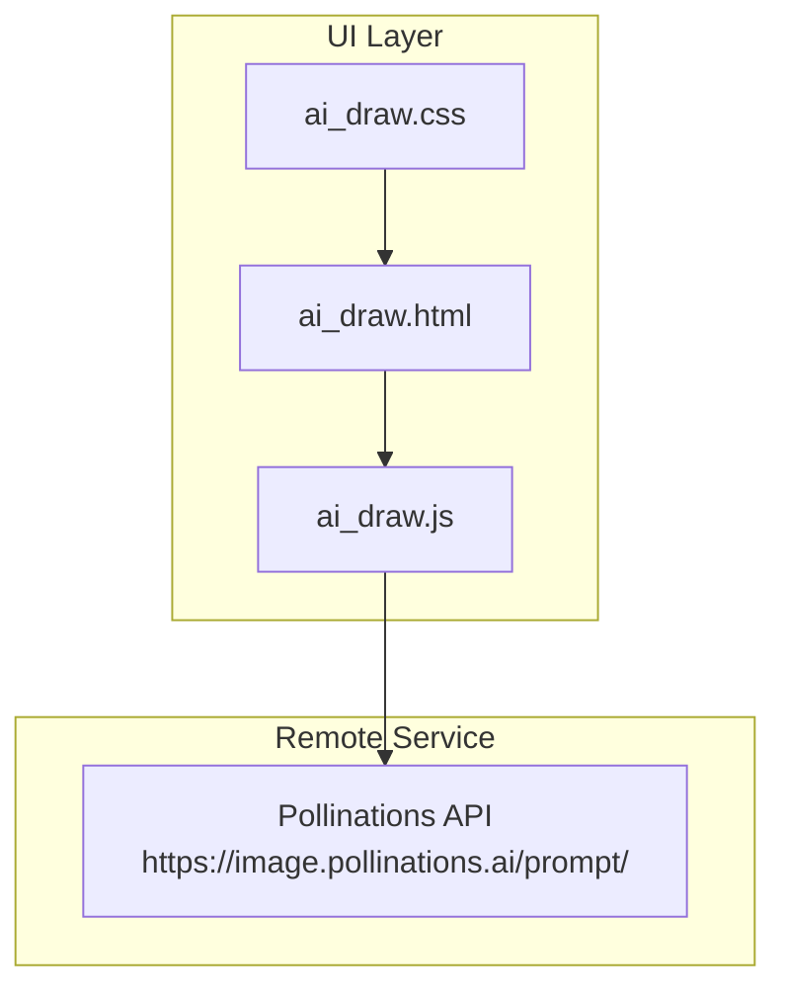
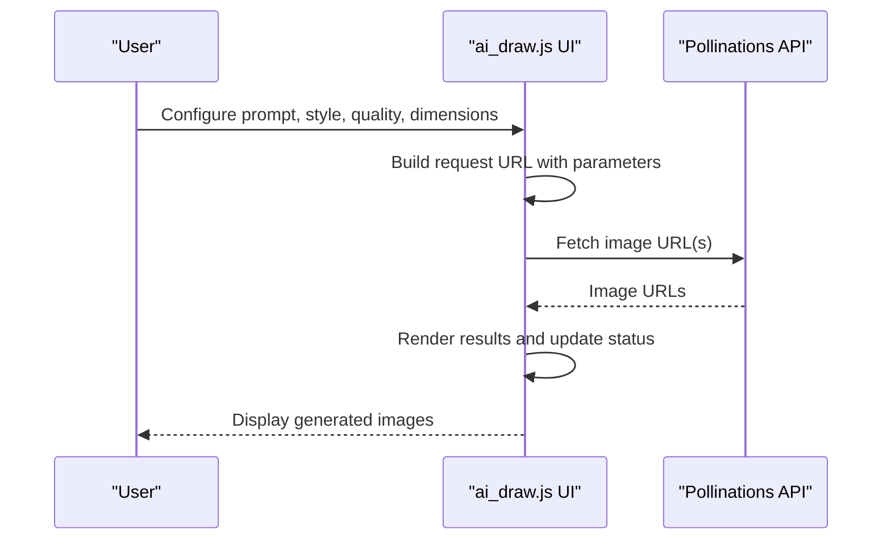
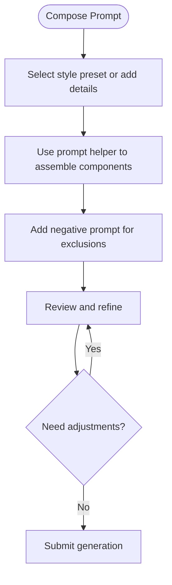
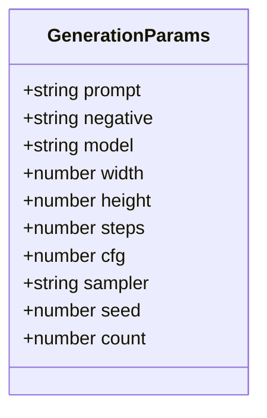
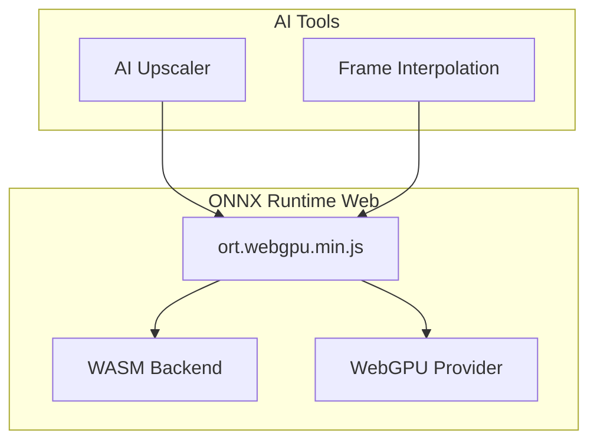
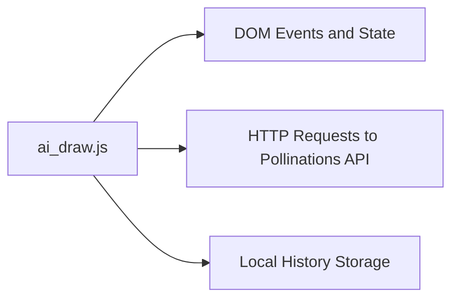

# AI Drawing Generation

<cite>
**Referenced Files in This Document**
- [ai_draw.js](file://js/ai_draw.js)
- [ai_draw.html](file://tools_html/ai_draw.html)
- [ai_draw.css](file://css/ai_draw.css)
- [ai_upscale.js](file://js/ai_upscale.js)
- [ai_frame_interpolation.js](file://js/ai_frame_interpolation.js)
- [AI图片超分辨率技术实现文档.md](file://doc/AI图片超分辨率技术实现文档.md)
- [models/README.md](file://models/README.md)
- [ort.webgpu.min.js](file://third_part/onnxruntime-web/1.17.1/ort.webgpu.min.js)
</cite>

## Table of Contents
1. [Introduction](#introduction)
2. [Project Structure](#project-structure)
3. [Core Components](#core-components)
4. [Architecture Overview](#architecture-overview)
5. [Detailed Component Analysis](#detailed-component-analysis)
6. [Dependency Analysis](#dependency-analysis)
7. [Performance Considerations](#performance-considerations)
8. [Troubleshooting Guide](#troubleshooting-guide)
9. [Conclusion](#conclusion)
10. [Appendices](#appendices)

## Introduction
This document explains the AI drawing generation tool integrated into the web application. It covers the text-to-image generation pipeline, prompt engineering techniques, model selection criteria, and inference parameters. It also documents the integration with ONNX Runtime Web for browser-based AI inference, supported image dimensions and quality settings, artistic style controls, and practical examples for effective prompts and iterative refinement. Guidance is included for troubleshooting common generation issues, assessing quality, and understanding browser compatibility and performance considerations.

## Project Structure
The AI drawing tool is implemented as a self-contained module with a dedicated HTML page, CSS styling, and JavaScript logic. It integrates with a remote image generation service via HTTP requests and supports optional local caching and batch operations.

**Diagram sources**
- [ai_draw.html:1-31](file://tools_html/ai_draw.html#L1-L31)
- [ai_draw.css:1-212](file://css/ai_draw.css#L1-L212)
- [ai_draw.js:1-438](file://js/ai_draw.js#L1-L438)

**Section sources**
- [ai_draw.html:1-31](file://tools_html/ai_draw.html#L1-L31)
- [ai_draw.css:1-212](file://css/ai_draw.css#L1-L212)
- [ai_draw.js:1-438](file://js/ai_draw.js#L1-L438)

## Core Components
- Prompt engine and style presets: Built-in style chips and a prompt helper assist in composing coherent prompts.
- Negative prompting: Dedicated field to exclude undesired artifacts.
- Quality presets: Predefined combinations of sampling steps, CFG scale, and sampler optimized for speed, balance, or detail.
- Aspect ratio presets: Common canvas ratios for quick composition.
- Dimension controls: Adjustable width and height with constrained ranges.
- Sampling parameters: Steps, CFG scale, sampler selection, and seed management with optional seed locking.
- Batch generation: Generate multiple images with a single prompt.
- Remote generation: Uses Pollinations API endpoints to produce images.
- History and configuration export: Stores recent generations locally and allows copying parameters.

**Section sources**
- [ai_draw.js:4-16](file://js/ai_draw.js#L4-L16)
- [ai_draw.js:52-114](file://js/ai_draw.js#L52-L114)
- [ai_draw.js:18-21](file://js/ai_draw.js#L18-L21)
- [ai_draw.js:312-352](file://js/ai_draw.js#L312-L352)

## Architecture Overview
The AI drawing tool runs entirely in the browser. Users configure generation parameters in the UI, which constructs a request URL to the remote image generation service. The service returns generated images that are rendered in the results area. Optional local storage persists recent parameters for reuse.

**Diagram sources**
- [ai_draw.js:224-231](file://js/ai_draw.js#L224-L231)
- [ai_draw.js:312-352](file://js/ai_draw.js#L312-L352)

## Detailed Component Analysis

### Prompt Engineering and Style Controls
- Style presets: Predefined style phrases are appended to the main prompt to guide artistic direction.
- Prompt helper: Allows assembling subject, scene, lighting, and camera details into a cohesive prompt.
- Negative prompt: Explicitly instructs the generator to avoid low quality, blurriness, watermarks, deformities, and similar artifacts.
- Iterative refinement: Use the history panel to recall previous parameter sets and adjust incrementally.

**Section sources**
- [ai_draw.js:4-10](file://js/ai_draw.js#L4-L10)
- [ai_draw.js:39-50](file://js/ai_draw.js#L39-L50)
- [ai_draw.js:36-37](file://js/ai_draw.js#L36-L37)
- [ai_draw.js:201-222](file://js/ai_draw.js#L201-L222)

### Model Selection Criteria
- Available models: FLUX and Turbo are selectable in the UI.
- Guidance: Choose FLUX for higher fidelity and detail; choose Turbo for faster generation when speed is prioritized.
- Parameter alignment: Adjust steps, CFG, and sampler according to the chosen model’s characteristics and desired output quality.

**Section sources**
- [ai_draw.js:54-58](file://js/ai_draw.js#L54-L58)
- [ai_draw.js:12-16](file://js/ai_draw.js#L12-L16)

### Inference Parameters and Output Customization
- Steps: Controls generation resolution and detail; higher values increase quality but cost more time.
- CFG Scale: Strengthens or weakens adherence to the prompt; too high may cause artifacts, too low may drift off-topic.
- Sampler: Euler, DPM++, DPM++ 2M; different samplers trade off speed and stability.
- Seed: Fixed or randomized; locking seed ensures reproducible results.
- Count: Generate multiple variants with the same prompt.
- Dimensions: Width and height constrained to a practical range; aspect presets simplify composition.
- Aspect presets: Square, landscape, portrait, and 3:2 ratios.

**Section sources**
- [ai_draw.js:316-325](file://js/ai_draw.js#L316-L325)
- [ai_draw.js:97-114](file://js/ai_draw.js#L97-L114)
- [ai_draw.js:70-84](file://js/ai_draw.js#L70-L84)

### ONNX Runtime Web Integration (Related Tools)
While the drawing tool uses a remote API, the repository includes other AI tools that demonstrate ONNX Runtime Web integration for browser-based inference. These tools showcase:
- WebGPU acceleration for GPU-backed inference.
- WebAssembly fallback for CPU execution.
- Model caching and robust error handling.
- Progressive degradation strategies and logging.

**Diagram sources**
- [ort.webgpu.min.js:1-12](file://third_part/onnxruntime-web/1.17.1/ort.webgpu.min.js#L1-L12)
- [ai_upscale.js:83-101](file://js/ai_upscale.js#L83-L101)
- [ai_frame_interpolation.js:315-336](file://js/ai_frame_interpolation.js#L315-L336)

**Section sources**
- [AI图片超分辨率技术实现文档.md:1-506](file://doc/AI图片超分辨率技术实现文档.md#L1-L506)
- [AI图片超分辨率技术实现文档.md:486-506](file://doc/AI图片超分辨率技术实现文档.md#L486-L506)
- [ai_upscale.js:83-101](file://js/ai_upscale.js#L83-L101)
- [ai_frame_interpolation.js:315-336](file://js/ai_frame_interpolation.js#L315-L336)

### Practical Examples and Iterative Refinement
- Effective prompts: Combine subject, setting, lighting, and style descriptors; use the style chip “电影感” or “写实摄影” to anchor tone and quality.
- Negative prompts: Include “low quality,” “blurry,” “watermark,” “deformed,” “nsfw,” and “text” to reduce artifacts.
- Iterative refinement: Start with a balanced quality preset, review results, adjust CFG or steps slightly, and lock the seed to reproduce promising outcomes.
- Composition: Use aspect presets to enforce framing; adjust width/height for specific print or screen formats.

**Section sources**
- [ai_draw.js:4-10](file://js/ai_draw.js#L4-L10)
- [ai_draw.js:36-37](file://js/ai_draw.js#L36-L37)
- [ai_draw.js:12-16](file://js/ai_draw.js#L12-L16)

## Dependency Analysis
- UI dependencies: HTML page loads the drawing script and applies styles; the script manages DOM events and state.
- Network dependencies: Requests are sent to Pollinations API endpoints; the tool probes available endpoints and selects a working base.
- Local persistence: Recent generation parameters are stored in browser local storage for quick reuse.

**Diagram sources**
- [ai_draw.js:154-177](file://js/ai_draw.js#L154-L177)
- [ai_draw.js:254-272](file://js/ai_draw.js#L254-L272)
- [ai_draw.js:201-222](file://js/ai_draw.js#L201-L222)

**Section sources**
- [ai_draw.js:154-177](file://js/ai_draw.js#L154-L177)
- [ai_draw.js:254-272](file://js/ai_draw.js#L254-L272)
- [ai_draw.js:201-222](file://js/ai_draw.js#L201-L222)

## Performance Considerations
- Remote generation latency: Expect network delays; the tool preloads images to provide early feedback.
- Parameter tuning: Lower steps and CFG can reduce wait time; use the “快速预览” preset for rapid iteration.
- Batch size: Generating multiple images increases total time; use count judiciously.
- Browser stability: Keep the tab active during generation; long-running tasks may be throttled by background policies.

[No sources needed since this section provides general guidance]

## Troubleshooting Guide
- No prompt entered: The tool prevents generation without a prompt and displays an error status.
- Network failures: If the selected endpoint fails, the tool probes alternatives and updates the working base; retry after a short delay.
- Timeout or loading errors: The image preloading mechanism surfaces timeouts and load failures; refresh or try again.
- Parameter validation: Inputs are clamped to safe ranges; ensure values fall within the configured min/max bounds.

**Section sources**
- [ai_draw.js:313-314](file://js/ai_draw.js#L313-L314)
- [ai_draw.js:254-272](file://js/ai_draw.js#L254-L272)
- [ai_draw.js:233-252](file://js/ai_draw.js#L233-L252)
- [ai_draw.js:183-193](file://js/ai_draw.js#L183-L193)

## Conclusion
The AI drawing tool provides a streamlined interface for text-to-image generation using a remote service. With built-in style presets, negative prompting, quality presets, and flexible dimensions, users can quickly iterate toward desired outputs. While the drawing tool itself delegates inference to the cloud, the broader repository demonstrates robust ONNX Runtime Web integration for local AI processing in other tools, offering insights into acceleration, caching, and fallback strategies.

[No sources needed since this section summarizes without analyzing specific files]

## Appendices

### Supported Image Dimensions and Quality Settings
- Dimensions: Width and height are constrained to a practical range; use presets for common ratios or customize within limits.
- Quality presets: Fast preview, balanced, and detail presets tune steps, CFG, and sampler for different priorities.
- Aspect presets: Square, 16:9, 9:16, and 3:2 ratios.

**Section sources**
- [ai_draw.js:86-95](file://js/ai_draw.js#L86-L95)
- [ai_draw.js:12-16](file://js/ai_draw.js#L12-L16)
- [ai_draw.js:70-84](file://js/ai_draw.js#L70-L84)

### Browser Compatibility and Environment Notes
- The drawing tool relies on standard web APIs and remote services; ensure modern browser support for media and fetch APIs.
- For ONNX Runtime Web-based tools in the same repository, WebGPU requires appropriate browser support and environment configuration. The tools demonstrate fallback to WASM and include guidance for CDN availability and runtime initialization.

**Section sources**
- [ai_upscale.js:83-101](file://js/ai_upscale.js#L83-L101)
- [ai_frame_interpolation.js:315-336](file://js/ai_frame_interpolation.js#L315-L336)
- [AI图片超分辨率技术实现文档.md:1-506](file://doc/AI图片超分辨率技术实现文档.md#L1-L506)