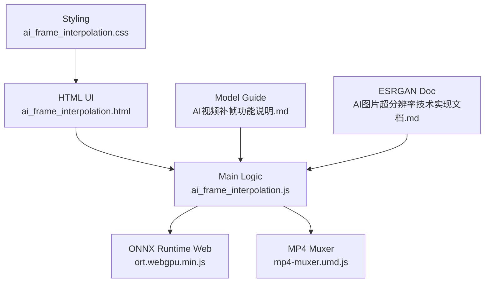
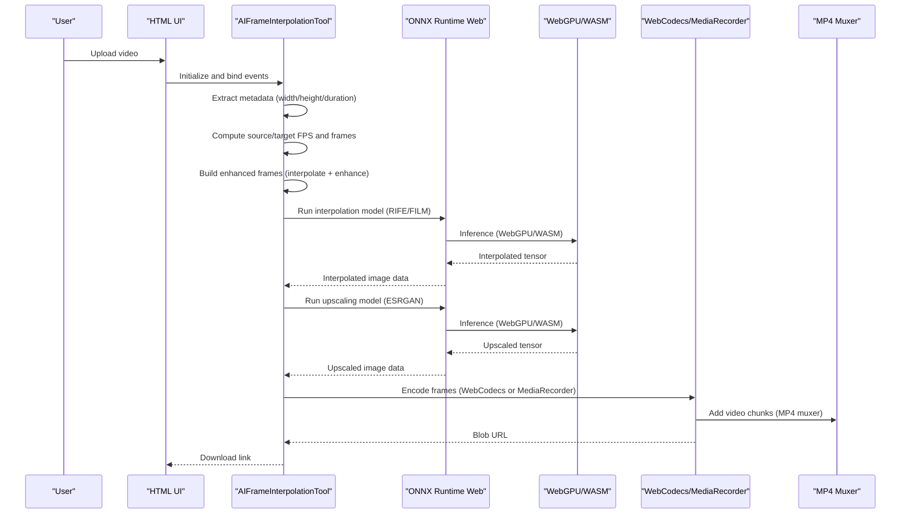
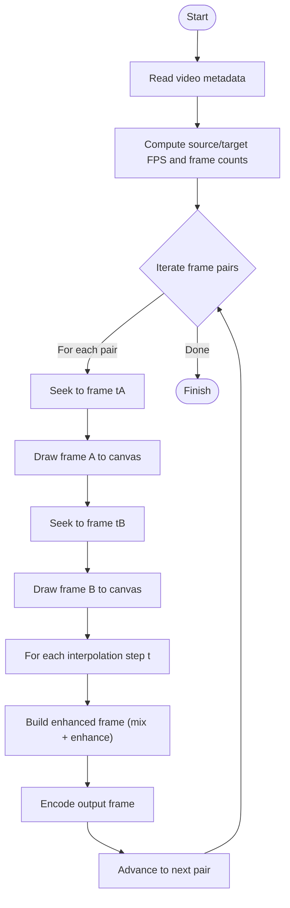
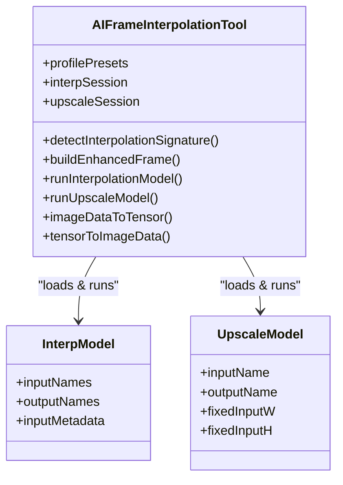
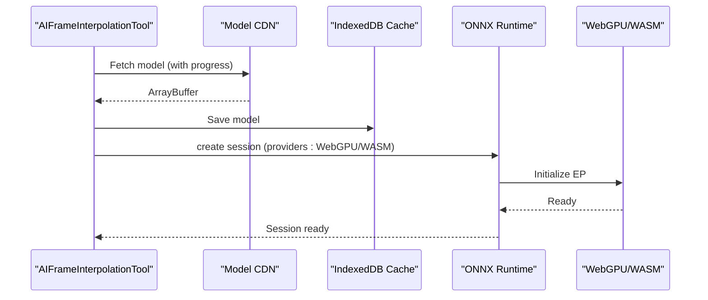
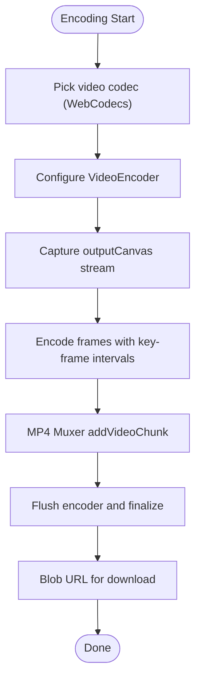
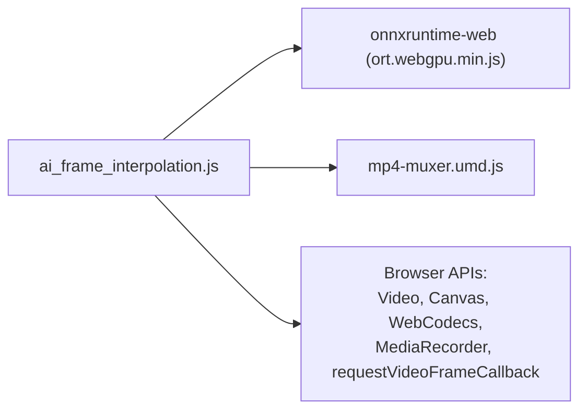

# AI Frame Interpolation (RIFE)

<cite>
**Referenced Files in This Document**
- [ai_frame_interpolation.js](file://js/ai_frame_interpolation.js)
- [ai_frame_interpolation.html](file://tools_html/ai_frame_interpolation.html)
- [ai_frame_interpolation.css](file://css/ai_frame_interpolation.css)
- [AI视频补帧功能说明.md](file://doc/AI视频补帧功能说明.md)
- [AI图片超分辨率技术实现文档.md](file://doc/AI图片超分辨率技术实现文档.md)
- [mp4-muxer.umd.js](file://third_part/mp4-muxer.umd.js)
- [ort.webgpu.min.js](file://third_part/onnxruntime-web/1.17.1/ort.webgpu.min.js)
</cite>

## Table of Contents
1. [Introduction](#introduction)
2. [Project Structure](#project-structure)
3. [Core Components](#core-components)
4. [Architecture Overview](#architecture-overview)
5. [Detailed Component Analysis](#detailed-component-analysis)
6. [Dependency Analysis](#dependency-analysis)
7. [Performance Considerations](#performance-considerations)
8. [Troubleshooting Guide](#troubleshooting-guide)
9. [Conclusion](#conclusion)
10. [Appendices](#appendices)

## Introduction
This document explains the AI frame interpolation tool leveraging RIFE-like technologies in a browser-based pipeline. It covers the video processing workflow, temporal interpolation algorithms, ONNX model integration, WebGPU acceleration, quality-speed trade-offs, supported formats, frame rate targets, output encoding, usage examples, parameter tuning, benchmarking, memory management, and troubleshooting.

## Project Structure
The tool is organized as a self-contained web application with:
- HTML UI for upload, preview, and controls
- CSS for layout and theming
- JavaScript orchestrating video processing, ONNX inference, and encoding
- Documentation for model conversion and usage guidance
- Third-party libraries for ONNX Runtime Web and MP4 muxing

**Diagram sources**
- [ai_frame_interpolation.html](file://tools_html/ai_frame_interpolation.html)
- [ai_frame_interpolation.js](file://js/ai_frame_interpolation.js)
- [ai_frame_interpolation.css](file://css/ai_frame_interpolation.css)
- [AI视频补帧功能说明.md](file://doc/AI视频补帧功能说明.md)
- [AI图片超分辨率技术实现文档.md](file://doc/AI图片超分辨率技术实现文档.md)
- [mp4-muxer.umd.js](file://third_part/mp4-muxer.umd.js)
- [ort.webgpu.min.js](file://third_part/onnxruntime-web/1.17.1/ort.webgpu.min.js)

**Section sources**
- [ai_frame_interpolation.html](file://tools_html/ai_frame_interpolation.html)
- [ai_frame_interpolation.css](file://css/ai_frame_interpolation.css)
- [ai_frame_interpolation.js](file://js/ai_frame_interpolation.js)

## Core Components
- AIFrameInterpolationTool class encapsulates:
  - Model loading and caching (IndexedDB)
  - Video metadata extraction and frame sequencing
  - Interpolation via ONNX Runtime (RIFE/FILM signature detection)
  - Upscaling via ESRGAN
  - Encoding with WebCodecs (MP4/H264/VP9/AV1) or fallback MediaRecorder/WebM
  - Preview comparison and progress tracking

Key capabilities:
- Dynamic frame rate enhancement (e.g., 30→60/90/120 fps)
- Resolution scaling (1K/2K/4K)
- Quality presets (Fast/Balanced/Detail) controlling denoise/sharpen/detail multipliers
- Strict GPU mode (WebGPU) with fallback to WASM

**Section sources**
- [ai_frame_interpolation.js](file://js/ai_frame_interpolation.js)
- [AI视频补帧功能说明.md](file://doc/AI视频补帧功能说明.md)

## Architecture Overview
The system follows a pipeline: upload → metadata → frame extraction → interpolation + enhancement → upscaling → encoding → download.

**Diagram sources**
- [ai_frame_interpolation.js](file://js/ai_frame_interpolation.js)
- [mp4-muxer.umd.js](file://third_part/mp4-muxer.umd.js)
- [AI视频补帧功能说明.md](file://doc/AI视频补帧功能说明.md)

## Detailed Component Analysis

### Video Processing Pipeline
- Frame extraction: Uses HTMLVideoElement with precise seeking to capture adjacent frames per pair.
- Frame sequencing: Computes total output frames based on source FPS and multiplier; iterates frame pairs to generate intermediate frames.
- Real-time mode: Optional requestVideoFrameCallback-based pipeline for live decoding (when supported).

**Diagram sources**
- [ai_frame_interpolation.js](file://js/ai_frame_interpolation.js)

**Section sources**
- [ai_frame_interpolation.js](file://js/ai_frame_interpolation.js)

### Temporal Interpolation and Enhancement
- Interpolation: Runs RIFE/FILM model between adjacent frames using a time parameter t ∈ [0,1].
- Enhancement: Applies optional denoise/sharpen/detail adjustments scaled by preset multipliers.
- Signature detection: Automatically detects model signature (RIFE vs FILM) by input names.

**Diagram sources**
- [ai_frame_interpolation.js](file://js/ai_frame_interpolation.js)

**Section sources**
- [ai_frame_interpolation.js](file://js/ai_frame_interpolation.js)

### ONNX Model Integration and Execution Providers
- Loading: Supports verified URLs for RIFE and ESRGAN models with automatic fallback and IndexedDB caching.
- Execution providers: WebGPU (preferred), with WASM fallback; strict GPU mode enforced.
- Environment: Single-threaded WASM helpers for compatibility; SIMD enabled.

**Diagram sources**
- [ai_frame_interpolation.js](file://js/ai_frame_interpolation.js)

**Section sources**
- [ai_frame_interpolation.js](file://js/ai_frame_interpolation.js)
- [AI视频补帧功能说明.md](file://doc/AI视频补帧功能说明.md)

### Encoding and Output Formats
- WebCodecs path: Dynamically selects H264/VP9/AV1 based on capability; uses MP4 muxer for containerization.
- Fallback path: MediaRecorder/WebM with VP9/VP8 depending on browser support.
- Output metrics: Stores output width/height/fps and source fps for preview.

**Diagram sources**
- [ai_frame_interpolation.js](file://js/ai_frame_interpolation.js)
- [mp4-muxer.umd.js](file://third_part/mp4-muxer.umd.js)

**Section sources**
- [ai_frame_interpolation.js](file://js/ai_frame_interpolation.js)
- [mp4-muxer.umd.js](file://third_part/mp4-muxer.umd.js)

### Quality vs Speed Trade-offs
- Presets:
  - Fast: Lower denoise/sharpen/detail multipliers for speed
  - Balanced: Default multipliers
  - Detail: Higher multipliers for richer detail
- Frame multiplier: Controls target FPS (e.g., 30→60/90/120)
- GPU acceleration: WebGPU preferred; strict mode ensures stability
- Memory: Tiled upscaling for fixed-input models; canvas reuse minimizes allocations

**Section sources**
- [ai_frame_interpolation.js](file://js/ai_frame_interpolation.js)

### Supported Formats and Targets
- Input: Browser-decodable video containers (MP4/MOV/WEBM/MKV)
- Output: MP4 (WebCodecs) or WebM (fallback); auto-selection based on availability
- Frame rates: 30/60/90/120 fps targets selectable
- Resolution: Keep original or scale to 1K/2K/4K (even-sized)

**Section sources**
- [ai_frame_interpolation.html](file://tools_html/ai_frame_interpolation.html)
- [ai_frame_interpolation.js](file://js/ai_frame_interpolation.js)

### Usage Examples
- Slow motion effects:
  - Set source FPS to perceived playback rate (e.g., 24 fps)
  - Choose multiplier to achieve desired output FPS (e.g., 120 fps)
  - Keep resolution unchanged for natural motion
- Smooth playback:
  - Use Balanced preset
  - Multiplier 2x–4x depending on motion complexity
- Animation enhancement:
  - Detail preset with moderate multiplier
  - Scale to 2K/4K for crispness

[No sources needed since this section provides usage guidance derived from documented parameters]

### Parameter Tuning Guidelines
- Source FPS estimation: Adjust to match actual footage for accurate interpolation
- Multiplier: Start with 2x; increase cautiously for complex motion
- Preset: Fast for previews, Detail for final output
- Upscale factor: 2K/4K for broadcast/HD displays; 1K for quick tests
- Execution mode: Prefer WebGPU; switch to WASM if unsupported

**Section sources**
- [ai_frame_interpolation.html](file://tools_html/ai_frame_interpolation.html)
- [ai_frame_interpolation.js](file://js/ai_frame_interpolation.js)

### Performance Benchmarking and Memory Management
- Benchmarking:
  - Measure processing time per video segment
  - Compare WebGPU vs WASM performance on target devices
- Memory management:
  - Reuse canvases and tensors
  - Release object URLs after download
  - Limit concurrent processing; process queue items sequentially
  - Use tiled upscaling for fixed-input models to avoid oversized tensors

**Section sources**
- [ai_frame_interpolation.js](file://js/ai_frame_interpolation.js)

## Dependency Analysis
External dependencies and integrations:
- ONNX Runtime Web (WebGPU/WASM)
- MP4 Muxer for WebCodecs-based MP4
- Browser APIs: VideoElement, Canvas 2D, WebCodecs, MediaRecorder, requestVideoFrameCallback

**Diagram sources**
- [ai_frame_interpolation.js](file://js/ai_frame_interpolation.js)
- [ort.webgpu.min.js](file://third_part/onnxruntime-web/1.17.1/ort.webgpu.min.js)
- [mp4-muxer.umd.js](file://third_part/mp4-muxer.umd.js)

**Section sources**
- [ai_frame_interpolation.js](file://js/ai_frame_interpolation.js)
- [AI视频补帧功能说明.md](file://doc/AI视频补帧功能说明.md)

## Performance Considerations
- Prefer WebGPU for acceleration; ensure HTTPS and compatible browsers
- Reduce resolution or multiplier for long/complex videos
- Use “Debug: 3s quick run” for rapid iteration
- Close unused tabs and avoid multitasking during processing

[No sources needed since this section provides general guidance]

## Troubleshooting Guide
Common issues and resolutions:
- ORT runtime fails to load:
  - Ensure page is served over HTTPS (not file://)
  - Verify CDN accessibility; fallback URLs are used automatically
- WebGPU unavailable:
  - Switch to WASM provider; expect slower performance
- Model loading errors:
  - Confirm model URLs are reachable
  - Clear cache and retry
- Interpolation artifacts:
  - Lower multiplier or switch to a model with time input
  - Adjust quality preset to Balanced/Detail
- Codec compatibility:
  - If MP4 fails, rely on WebM fallback
- Long videos stall:
  - Reduce resolution/multiplier or split the video

**Section sources**
- [ai_frame_interpolation.js](file://js/ai_frame_interpolation.js)
- [AI视频补帧功能说明.md](file://doc/AI视频补帧功能说明.md)

## Conclusion
The AI frame interpolation tool delivers a robust browser-based pipeline for temporal interpolation and enhancement using ONNX Runtime Web with WebGPU acceleration. It supports flexible quality-speed trade-offs, multiple output formats, and practical presets for common use cases. For best results, align source FPS estimation, choose appropriate multipliers, and leverage WebGPU when available.

[No sources needed since this section summarizes without analyzing specific files]

## Appendices

### A. Model Conversion Guidance
- Convert RIFE PyTorch to ONNX with proper input names and dynamic axes
- Host ONNX models on same-origin or trusted mirrors for reliable loading
- Validate model signatures (RIFE vs FILM) before use

**Section sources**
- [AI视频补帧功能说明.md](file://doc/AI视频补帧功能说明.md)

### B. UI and Controls Reference
- Queue management, preview comparison, and progress indicators
- Settings panels for interpolation/upscaling parameters
- Output format selection and download actions

**Section sources**
- [ai_frame_interpolation.html](file://tools_html/ai_frame_interpolation.html)
- [ai_frame_interpolation.css](file://css/ai_frame_interpolation.css)