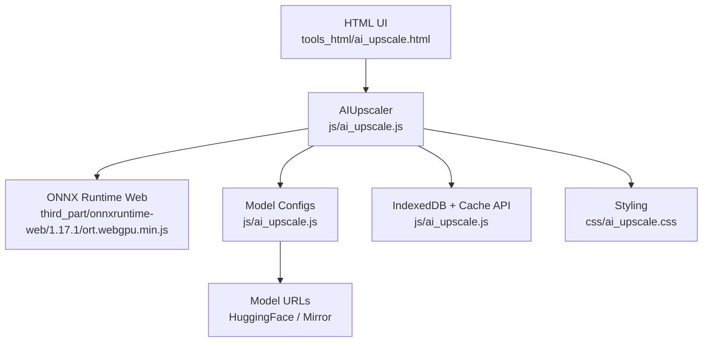
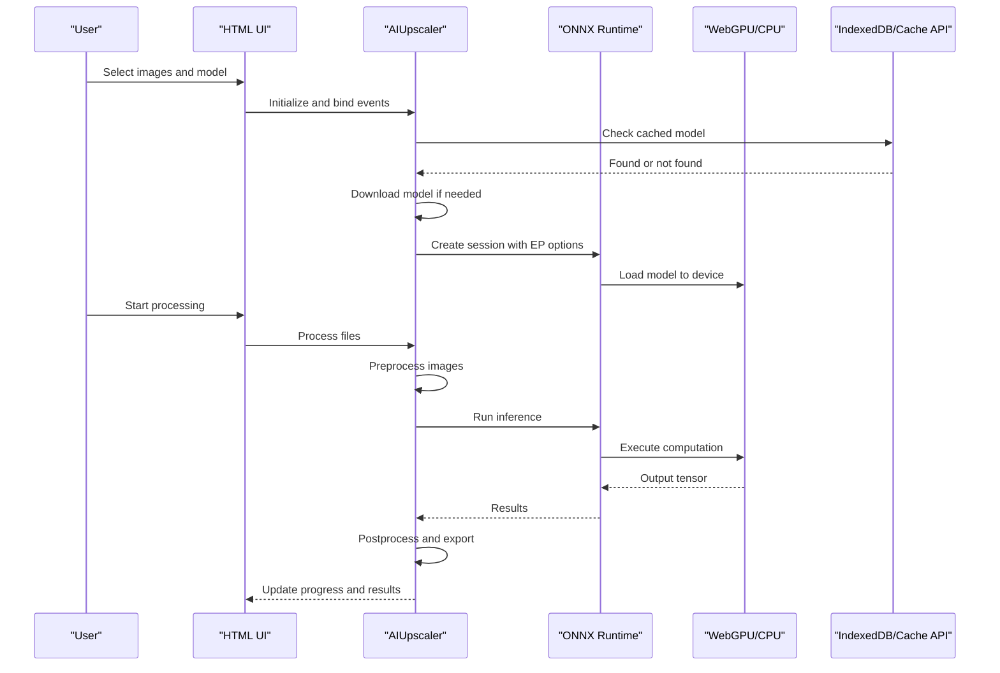
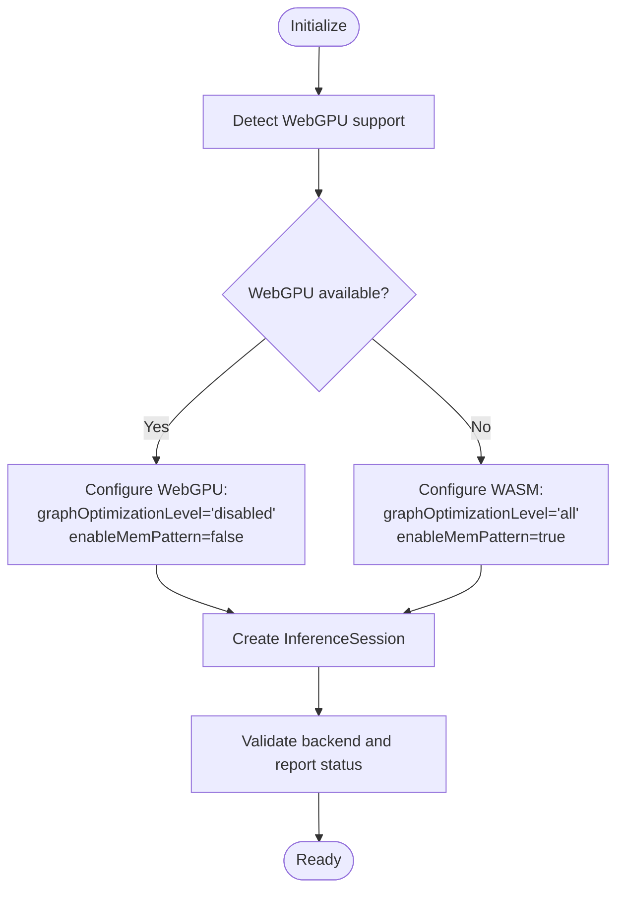
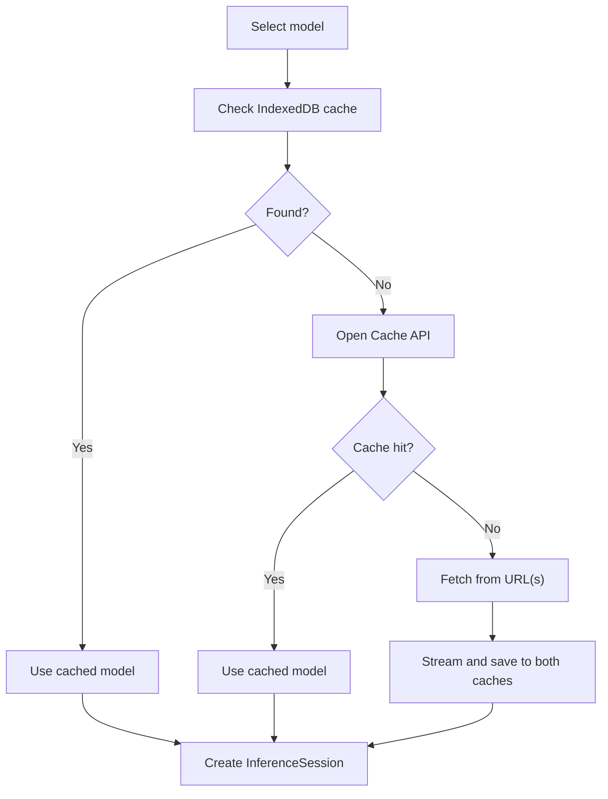
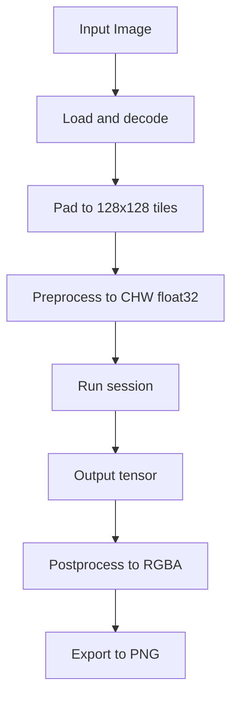
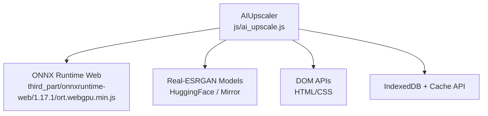

# AI Image Upscaling (Real-ESRGAN)

<cite>
**Referenced Files in This Document**
- [ai_upscale.js](file://js/ai_upscale.js)
- [ai_upscale.html](file://tools_html/ai_upscale.html)
- [ai_upscale.css](file://css/ai_upscale.css)
- [ort.webgpu.min.js](file://third_part/onnxruntime-web/1.17.1/ort.webgpu.min.js)
- [README.md](file://models/README.md)
- [fetch_models.sh](file://scripts/fetch_models.sh)
- [AI图片超分辨率技术实现文档.md](file://doc/AI图片超分辨率技术实现文档.md)
</cite>

## Table of Contents
1. [Introduction](#introduction)
2. [Project Structure](#project-structure)
3. [Core Components](#core-components)
4. [Architecture Overview](#architecture-overview)
5. [Detailed Component Analysis](#detailed-component-analysis)
6. [Dependency Analysis](#dependency-analysis)
7. [Performance Considerations](#performance-considerations)
8. [Troubleshooting Guide](#troubleshooting-guide)
9. [Conclusion](#conclusion)
10. [Appendices](#appendices)

## Introduction
This document explains the AI image upscaling tool powered by Real-ESRGAN, built with ONNX Runtime Web and WebGPU acceleration. It covers the complete pipeline from model loading and caching to inference, post-processing, and output generation. The tool supports both GPU acceleration via WebGPU and CPU fallback via WebAssembly, with robust error handling, progress reporting, and batch processing capabilities.

## Project Structure
The AI upscaling tool is organized into modular frontend components:
- HTML page defines UI controls and layout
- CSS provides responsive styling and visual feedback
- JavaScript implements the AI pipeline, model management, and user interactions
- ONNX Runtime Web library enables inference in the browser
- Model storage and caching utilities ensure offline availability

**Diagram sources**
- [ai_upscale.html:1-167](file://tools_html/ai_upscale.html#L1-L167)
- [ai_upscale.js:1-1739](file://js/ai_upscale.js#L1-L1739)
- [ort.webgpu.min.js:1-2157](file://third_part/onnxruntime-web/1.17.1/ort.webgpu.min.js#L1-L2157)

**Section sources**
- [ai_upscale.html:1-167](file://tools_html/ai_upscale.html#L1-L167)
- [ai_upscale.js:1-1739](file://js/ai_upscale.js#L1-L1739)
- [ai_upscale.css:1-964](file://css/ai_upscale.css#L1-L964)

## Core Components
- AIUpscaler class orchestrates model loading, inference, and UI updates
- ONNX Runtime Web integration for GPU/WebGPU and CPU/WebAssembly execution
- Dual-layer caching (IndexedDB + Cache API) for model persistence
- Batch processing with progress tracking and output modes (download, ZIP, folder)
- Real-ESRGAN model configurations with multiple variants

Key implementation highlights:
- Automatic model detection and loading with fallback to CPU
- Tile-based processing for arbitrary image sizes
- Robust tensor data access for both WebGPU and CPU modes
- Comprehensive error handling and user feedback

**Section sources**
- [ai_upscale.js:1-1739](file://js/ai_upscale.js#L1-L1739)
- [AI图片超分辨率技术实现文档.md:1-538](file://doc/AI图片超分辨率技术实现文档.md#L1-L538)

## Architecture Overview
The system follows a client-side AI inference pipeline:
1. User selects images and model
2. Model is fetched from cache or network, then loaded into ONNX Runtime
3. Images are preprocessed and fed into the model
4. Inference runs on GPU (WebGPU) or CPU (WebAssembly)
5. Output tensors are post-processed and exported

**Diagram sources**
- [ai_upscale.js:380-517](file://js/ai_upscale.js#L380-L517)
- [ai_upscale.js:826-971](file://js/ai_upscale.js#L826-L971)
- [ai_upscale.js:1103-1295](file://js/ai_upscale.js#L1103-L1295)

## Detailed Component Analysis

### ONNX Runtime Web Integration and Execution Providers
- Environment configuration sets WASM parameters for CPU mode
- Automatic detection of WebGPU support
- Execution provider selection:
  - WebGPU with graph optimization disabled for correctness
  - WASM (CPU) with full optimization for performance
- Session creation validates actual backend used and reports status

**Diagram sources**
- [ai_upscale.js:420-497](file://js/ai_upscale.js#L420-L497)

**Section sources**
- [ai_upscale.js:83-101](file://js/ai_upscale.js#L83-L101)
- [ai_upscale.js:420-497](file://js/ai_upscale.js#L420-L497)
- [AI图片超分辨率技术实现文档.md:84-108](file://doc/AI图片超分辨率技术实现文档.md#L84-L108)

### WebGPU Acceleration Setup and CPU Fallback
- WebGPU mode requires disabling graph optimization to avoid zero-output issues
- CPU mode uses full optimization for speed
- Automatic fallback when WebGPU fails
- Cross-origin isolation considerations for threading

**Section sources**
- [ai_upscale.js:427-497](file://js/ai_upscale.js#L427-L497)
- [AI图片超分辨率技术实现文档.md:227-271](file://doc/AI图片超分辨率技术实现文档.md#L227-L271)

### Model Loading, Cache Management, and Session Creation
- Model configs define multiple Real-ESRGAN variants with URLs and metadata
- Dual-cache strategy: IndexedDB primary, Cache API secondary
- Progressive model download with content-length-aware streaming
- Session reuse to minimize overhead

**Diagram sources**
- [ai_upscale.js:190-293](file://js/ai_upscale.js#L190-L293)
- [ai_upscale.js:295-378](file://js/ai_upscale.js#L295-L378)
- [ai_upscale.js:380-517](file://js/ai_upscale.js#L380-L517)

**Section sources**
- [ai_upscale.js:15-50](file://js/ai_upscale.js#L15-L50)
- [ai_upscale.js:190-293](file://js/ai_upscale.js#L190-L293)
- [ai_upscale.js:295-378](file://js/ai_upscale.js#L295-L378)
- [ai_upscale.js:380-517](file://js/ai_upscale.js#L380-L517)

### Image Preprocessing, Inference, and Postprocessing
- Preprocessing converts RGBA to CHW float32 tensors and normalizes to [0,1]
- Padding ensures input dimensions are multiples of 128
- Tile-based processing for large images with overlap
- Postprocessing handles tensor data access differences between WebGPU and CPU
- Immediate validation prevents silent failures

**Diagram sources**
- [ai_upscale.js:1103-1295](file://js/ai_upscale.js#L1103-L1295)
- [ai_upscale.js:1321-1375](file://js/ai_upscale.js#L1321-L1375)
- [ai_upscale.js:1377-1499](file://js/ai_upscale.js#L1377-L1499)

**Section sources**
- [ai_upscale.js:1103-1295](file://js/ai_upscale.js#L1103-L1295)
- [ai_upscale.js:1321-1375](file://js/ai_upscale.js#L1321-L1375)
- [ai_upscale.js:1377-1499](file://js/ai_upscale.js#L1377-L1499)

### Supported Input Formats, Quality Settings, and Output Resolution
- Input formats: JPG, PNG, JPEG, WEBP (via accept attributes)
- Quality settings: PNG export preserves quality
- Output resolution: 4x scaling for Real-ESRGAN models; configurable via UI
- Naming modes: suffix-based or automatic scale-based naming

**Section sources**
- [ai_upscale.html:43-102](file://tools_html/ai_upscale.html#L43-L102)
- [ai_upscale.js:1508-1520](file://js/ai_upscale.js#L1508-L1520)

### Batch Processing and Output Modes
- Queue-based processing with progress tracking
- Output modes: download individual files, ZIP archive, or save to folder
- Folder saving requires modern browsers with File System Access API

**Section sources**
- [ai_upscale.js:826-971](file://js/ai_upscale.js#L826-L971)
- [ai_upscale.js:1528-1541](file://js/ai_upscale.js#L1528-L1541)
- [ai_upscale.js:1557-1590](file://js/ai_upscale.js#L1557-L1590)

## Dependency Analysis
The AIUpscaler depends on:
- ONNX Runtime Web for inference
- Browser APIs for file handling, canvas, and storage
- Real-ESRGAN ONNX models hosted on HuggingFace mirrors

**Diagram sources**
- [ai_upscale.js:1-1739](file://js/ai_upscale.js#L1-L1739)
- [ai_upscale.html:1-167](file://tools_html/ai_upscale.html#L1-L167)

**Section sources**
- [ai_upscale.js:1-1739](file://js/ai_upscale.js#L1-L1739)
- [ai_upscale.html:1-167](file://tools_html/ai_upscale.html#L1-L167)

## Performance Considerations
- WebGPU vs CPU performance:
  - WebGPU: ~0.8s for 128x128 tiles, ~3.1x faster than CPU
  - CPU: ~2.5s for 128x128 tiles
- Memory usage:
  - CPU: ~300MB
  - GPU: ~500MB
- Optimization tips:
  - Disable graph optimization for WebGPU correctness
  - Use tile-based processing for large images
  - Let out of main thread between tiles for UI responsiveness
  - Reuse sessions to avoid reload overhead

**Section sources**
- [AI图片超分辨率技术实现文档.md:372-381](file://doc/AI图片超分辨率技术实现文档.md#L372-L381)
- [AI图片超分辨率技术实现文档.md:333-369](file://doc/AI图片超分辨率技术实现文档.md#L333-L369)

## Troubleshooting Guide
Common issues and resolutions:
- WebGPU output all zeros:
  - Cause: Graph optimization incompatible with WebGPU
  - Fix: Set graph optimization to disabled
- Cannot access tensor data:
  - Cause: Direct access to GPU tensor data
  - Fix: Use getData() for WebGPU tensors, direct access for CPU tensors
- Browser compatibility:
  - Chrome/Edge 113+ recommended for WebGPU
  - CPU mode works on all modern browsers
- Model loading failures:
  - Check network connectivity and mirror URLs
  - Clear cache and retry
- Large image processing:
  - Use tile-based processing automatically handled by the tool

**Section sources**
- [AI图片超分辨率技术实现文档.md:227-271](file://doc/AI图片超分辨率技术实现文档.md#L227-L271)
- [AI图片超分辨率技术实现文档.md:272-294](file://doc/AI图片超分辨率技术实现文档.md#L272-L294)
- [AI图片超分辨率技术实现文档.md:443-452](file://doc/AI图片超分辨率技术实现文档.md#L443-L452)

## Conclusion
The AI image upscaling tool demonstrates a production-ready implementation of Real-ESRGAN inference in the browser using ONNX Runtime Web. By combining WebGPU acceleration with robust CPU fallback, dual-layer caching, and careful tensor handling, it delivers reliable, high-quality image upscaling with excellent user experience. The documented patterns and troubleshooting steps provide a solid foundation for extending and maintaining the system.

## Appendices

### Step-by-Step Usage Example
1. Open the AI upscaling page
2. Choose execution mode: GPU (WebGPU) or CPU
3. Select a Real-ESRGAN model variant
4. Click "Load model" to initialize the session
5. Drag-and-drop or select images to process
6. Start processing; monitor progress
7. Download results individually or as a ZIP

**Section sources**
- [ai_upscale.html:1-167](file://tools_html/ai_upscale.html#L1-L167)
- [ai_upscale.js:601-658](file://js/ai_upscale.js#L601-L658)

### Parameter Tuning Guidelines
- Prefer WebGPU for speed; fallback to CPU if unavailable
- Keep graph optimization disabled for WebGPU
- Use PNG export for quality preservation
- For large images, rely on automatic tiling; adjust naming convention as needed

**Section sources**
- [ai_upscale.js:420-497](file://js/ai_upscale.js#L420-L497)
- [ai_upscale.js:1508-1520](file://js/ai_upscale.js#L1508-L1520)

### Quality Assessment Methods
- Visual inspection of before/after comparison slider
- Verify tensor data validity (non-zero values)
- Compare with known baseline outputs for identical inputs

**Section sources**
- [ai_upscale.js:1666-1733](file://js/ai_upscale.js#L1666-L1733)
- [AI图片超分辨率技术实现文档.md:419-439](file://doc/AI图片超分辨率技术实现文档.md#L419-L439)

### Browser Compatibility Notes
- Chrome/Edge 113+: Full WebGPU support
- Firefox/Safari: Experimental support; prefer CPU mode
- All modern browsers: CPU mode guaranteed

**Section sources**
- [AI图片超分辨率技术实现文档.md:443-452](file://doc/AI图片超分辨率技术实现文档.md#L443-L452)

### Model Download Strategies
- Local hosting: Place models under the site root for direct access
- Remote mirrors: Automatic fallback to mirrors if local models unavailable
- Offline usage: IndexedDB and Cache API ensure offline availability

**Section sources**
- [README.md:16-24](file://models/README.md#L16-L24)
- [fetch_models.sh:1-18](file://scripts/fetch_models.sh#L1-L18)