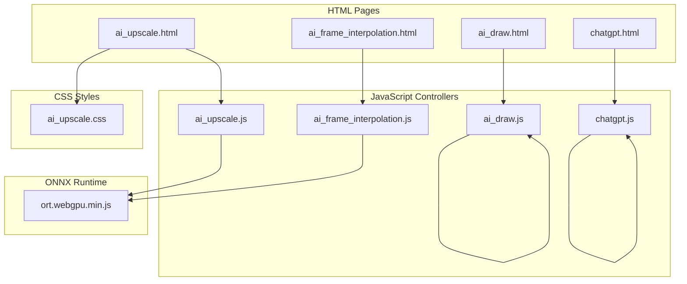
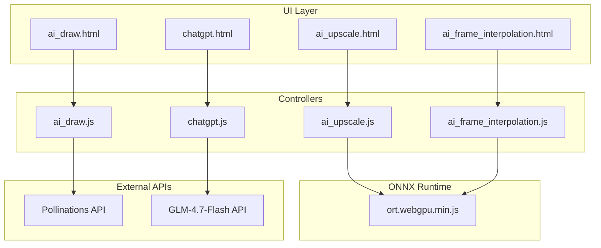
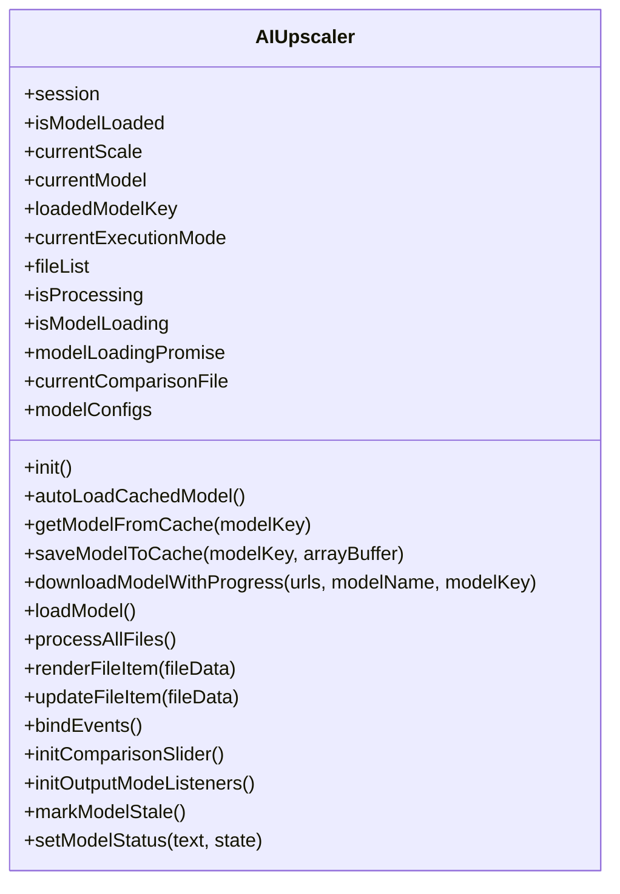
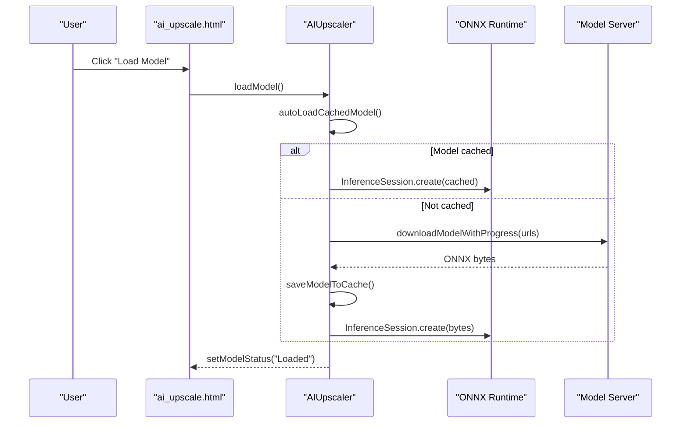
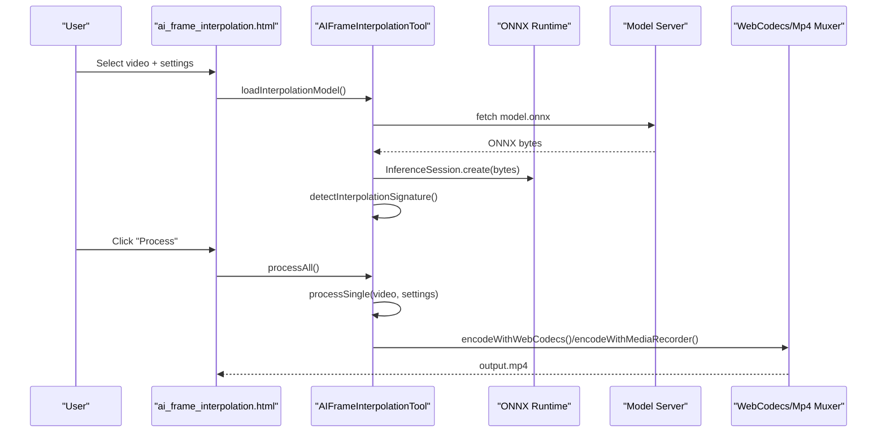
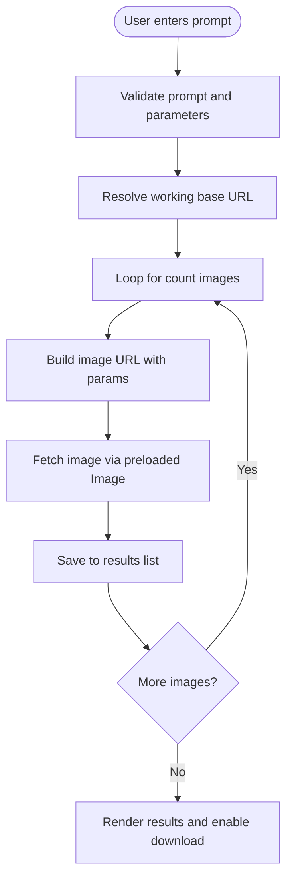
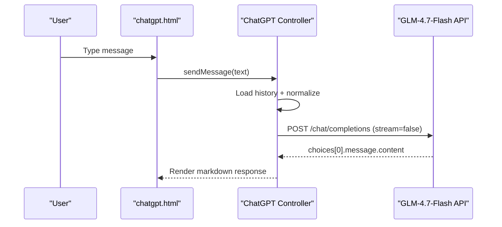
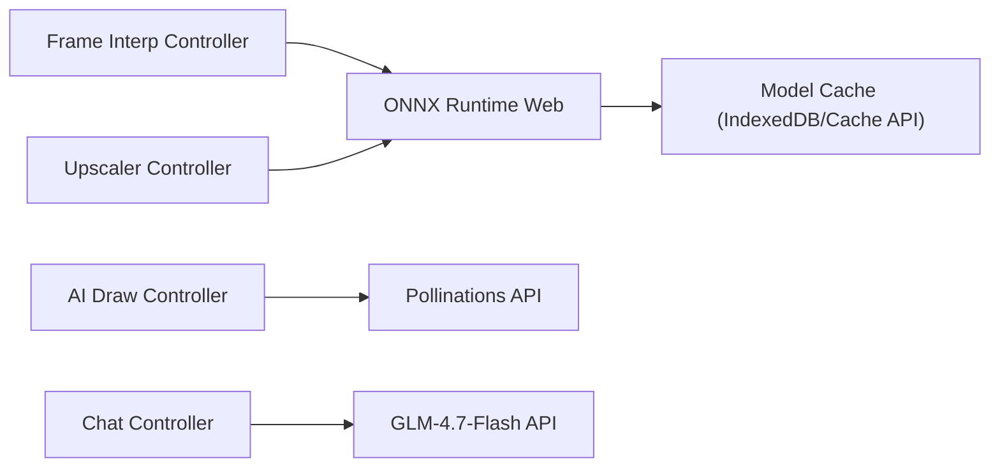

# AI Tools Suite

<cite>
**Referenced Files in This Document**
- [ai_upscale.js](file://js/ai_upscale.js)
- [ai_frame_interpolation.js](file://js/ai_frame_interpolation.js)
- [ai_draw.js](file://js/ai_draw.js)
- [chatgpt.js](file://js/chatgpt.js)
- [ai_upscale.html](file://tools_html/ai_upscale.html)
- [ai_frame_interpolation.html](file://tools_html/ai_frame_interpolation.html)
- [ai_draw.html](file://tools_html/ai_draw.html)
- [chatgpt.html](file://tools_html/chatgpt.html)
- [ai_upscale.css](file://css/ai_upscale.css)
- [ort.webgpu.min.js](file://third_part/onnxruntime-web/1.17.1/ort.webgpu.min.js)
</cite>

## Table of Contents
1. [Introduction](#introduction)
2. [Project Structure](#project-structure)
3. [Core Components](#core-components)
4. [Architecture Overview](#architecture-overview)
5. [Detailed Component Analysis](#detailed-component-analysis)
6. [Dependency Analysis](#dependency-analysis)
7. [Performance Considerations](#performance-considerations)
8. [Troubleshooting Guide](#troubleshooting-guide)
9. [Conclusion](#conclusion)
10. [Appendices](#appendices)

## Introduction
This document provides comprehensive documentation for the AI tools suite, covering machine learning-powered features implemented in the browser. The suite includes:
- Real-ESRGAN image upscaling with ONNX Runtime Web and WebGPU acceleration
- RIFE-based video frame interpolation with optional ESRGAN upscaling
- AI drawing generation via Pollinations API
- ChatGPT-like conversational interface powered by GLM-4.7-Flash

The documentation explains ONNX Runtime Web integration, WebGPU acceleration capabilities, fallback mechanisms, model loading strategies, performance optimization, memory management, browser compatibility, and practical usage guidance.

## Project Structure
The AI tools suite is organized as modular HTML pages with dedicated JavaScript controllers and CSS styling. Each tool is encapsulated in its own HTML page and associated JS/CSS resources.

**Diagram sources**
- [ai_upscale.html](file://tools_html/ai_upscale.html)
- [ai_frame_interpolation.html](file://tools_html/ai_frame_interpolation.html)
- [ai_draw.html](file://tools_html/ai_draw.html)
- [chatgpt.html](file://tools_html/chatgpt.html)
- [ai_upscale.js](file://js/ai_upscale.js)
- [ai_frame_interpolation.js](file://js/ai_frame_interpolation.js)
- [ai_draw.js](file://js/ai_draw.js)
- [chatgpt.js](file://js/chatgpt.js)
- [ai_upscale.css](file://css/ai_upscale.css)
- [ort.webgpu.min.js](file://third_part/onnxruntime-web/1.17.1/ort.webgpu.min.js)

**Section sources**
- [ai_upscale.html](file://tools_html/ai_upscale.html)
- [ai_frame_interpolation.html](file://tools_html/ai_frame_interpolation.html)
- [ai_draw.html](file://tools_html/ai_draw.html)
- [chatgpt.html](file://tools_html/chatgpt.html)

## Core Components
- Real-ESRGAN Image Upscaler: Loads ONNX models, supports GPU/WebGPU and CPU/WASM fallback, provides batch processing, and includes a live comparison view.
- RIFE Video Frame Interpolation: Loads interpolation and optional upscaling models, performs frame rate conversion and resolution scaling, and outputs videos with WebCodecs/Mp4 muxing.
- AI Drawing Generator: Integrates with Pollinations API to generate images from prompts with configurable styles, sizes, and sampling parameters.
- ChatGPT Interface: Provides a conversational UI backed by GLM-4.7-Flash, with markdown rendering and DOMPurify sanitization.

**Section sources**
- [ai_upscale.js](file://js/ai_upscale.js)
- [ai_frame_interpolation.js](file://js/ai_frame_interpolation.js)
- [ai_draw.js](file://js/ai_draw.js)
- [chatgpt.js](file://js/chatgpt.js)

## Architecture Overview
The system leverages ONNX Runtime Web for model inference with automatic execution provider selection. Real-time video processing uses HTML5 Canvas and WebCodecs/Mp4 Muxer for encoding. Drawing generation relies on external APIs, while chat functionality uses a hosted model endpoint.

**Diagram sources**
- [ai_upscale.html](file://tools_html/ai_upscale.html)
- [ai_frame_interpolation.html](file://tools_html/ai_frame_interpolation.html)
- [ai_draw.html](file://tools_html/ai_draw.html)
- [chatgpt.html](file://tools_html/chatgpt.html)
- [ai_upscale.js](file://js/ai_upscale.js)
- [ai_frame_interpolation.js](file://js/ai_frame_interpolation.js)
- [ai_draw.js](file://js/ai_draw.js)
- [chatgpt.js](file://js/chatgpt.js)
- [ort.webgpu.min.js](file://third_part/onnxruntime-web/1.17.1/ort.webgpu.min.js)

## Detailed Component Analysis

### Real-ESRGAN Image Upscaler
- Model Management: Supports three models with authoritative URLs and mirrors. Automatically checks IndexedDB and Cache API for cached models.
- Execution Providers: Prefers WebGPU with strict graph optimization disabled for stability; falls back to WASM CPU when necessary.
- UI Features: Drag-and-drop upload, queue management, per-file actions, batch processing, and a comparison slider modal.
- Output Modes: Download per file, ZIP archive, or direct folder write (requires modern browsers).

**Diagram sources**
- [ai_upscale.js](file://js/ai_upscale.js)

**Diagram sources**
- [ai_upscale.js](file://js/ai_upscale.js)

**Section sources**
- [ai_upscale.js](file://js/ai_upscale.js)
- [ai_upscale.html](file://tools_html/ai_upscale.html)
- [ai_upscale.css](file://css/ai_upscale.css)

### RIFE Video Frame Interpolation
- Dual Model Pipeline: Loads interpolation and optional upscaling models from verified URLs with mirrors. Detects model signatures automatically.
- Execution Provider: Uses WebGPU when available; otherwise falls back to WASM CPU.
- Processing Pipeline: Extracts frames, applies interpolation/upscaling, and encodes with WebCodecs or Mp4 Muxer.
- Preview: Side-by-side video comparison with draggable divider.

**Diagram sources**
- [ai_frame_interpolation.js](file://js/ai_frame_interpolation.js)
- [ai_frame_interpolation.html](file://tools_html/ai_frame_interpolation.html)

**Section sources**
- [ai_frame_interpolation.js](file://js/ai_frame_interpolation.js)
- [ai_frame_interpolation.html](file://tools_html/ai_frame_interpolation.html)

### AI Drawing Generation
- Prompt Engineering: Predefined style presets and manual prompt building with aspect ratio presets.
- API Integration: Uses Pollinations API endpoints with automatic failover between candidates.
- Quality Controls: Steps, CFG, sampler, and seed management with history persistence.

**Diagram sources**
- [ai_draw.js](file://js/ai_draw.js)
- [ai_draw.html](file://tools_html/ai_draw.html)

**Section sources**
- [ai_draw.js](file://js/ai_draw.js)
- [ai_draw.html](file://tools_html/ai_draw.html)

### ChatGPT Interface
- Conversation Management: Maintains history in localStorage with continuous context.
- Streaming and Retry: Implements request timeout with retry logic and graceful error messaging.
- Rendering: Markdown parsing with DOMPurify sanitization for safety.

**Diagram sources**
- [chatgpt.js](file://js/chatgpt.js)
- [chatgpt.html](file://tools_html/chatgpt.html)

**Section sources**
- [chatgpt.js](file://js/chatgpt.js)
- [chatgpt.html](file://tools_html/chatgpt.html)

## Dependency Analysis
- ONNX Runtime Web: Loaded via CDN with fallbacks; configured for single-threaded WASM and WebGPU providers.
- Model Storage: IndexedDB primary cache with secondary Cache API backup for models.
- External APIs: Pollinations for AI drawing and GLM-4.7-Flash for chat.
- Encoding: WebCodecs for MP4/H264/VP9 when available; falls back to MediaRecorder/Mp4 Muxer.

**Diagram sources**
- [ai_upscale.js](file://js/ai_upscale.js)
- [ai_frame_interpolation.js](file://js/ai_frame_interpolation.js)
- [ai_draw.js](file://js/ai_draw.js)
- [chatgpt.js](file://js/chatgpt.js)
- [ort.webgpu.min.js](file://third_part/onnxruntime-web/1.17.1/ort.webgpu.min.js)

**Section sources**
- [ai_upscale.js](file://js/ai_upscale.js)
- [ai_frame_interpolation.js](file://js/ai_frame_interpolation.js)
- [ai_draw.js](file://js/ai_draw.js)
- [chatgpt.js](file://js/chatgpt.js)

## Performance Considerations
- Execution Provider Selection: WebGPU is prioritized for speed; WASM CPU is used as a reliable fallback. Graph optimization is disabled for WebGPU stability.
- Model Caching: IndexedDB is the primary cache; Cache API is used as a secondary layer. This reduces repeated downloads and accelerates subsequent loads.
- Memory Management: Controllers avoid retaining large intermediate buffers unnecessarily; canvases are reused where possible. Video encoding uses streaming APIs to minimize memory footprint.
- Browser Compatibility: Requires modern browsers for WebGPU; provides clear guidance and fallbacks for unsupported environments.
- Batch Processing: Queuing and incremental updates reduce UI blocking during long operations.

[No sources needed since this section provides general guidance]

## Troubleshooting Guide
- ONNX Runtime Not Found: Ensure the ort.webgpu.min.js script is loaded. The tools check for global ort availability and configure WASM settings accordingly.
- WebGPU Unavailable: The system detects lack of WebGPU and suggests switching to CPU mode or updating the browser. Verify cross-origin isolation if applicable.
- Model Loading Failures: Network errors or blocked mirrors cause fallback attempts. Check console logs for detailed failure reasons.
- File Output Issues: Folder writing requires modern browsers with showDirectoryPicker. Otherwise, use download or ZIP modes.
- Chat API Errors: Timeout and network failures are retried once. Review error messages and ensure proper API key configuration.

**Section sources**
- [ai_upscale.js](file://js/ai_upscale.js)
- [ai_frame_interpolation.js](file://js/ai_frame_interpolation.js)
- [chatgpt.js](file://js/chatgpt.js)

## Conclusion
The AI tools suite delivers powerful, privacy-preserving machine learning features directly in the browser. By combining ONNX Runtime Web with WebGPU acceleration and robust fallbacks, it achieves high performance while maintaining broad compatibility. The modular architecture ensures maintainability and extensibility for future enhancements.

[No sources needed since this section summarizes without analyzing specific files]

## Appendices

### Usage Examples and Parameter Configuration

- Real-ESRGAN Image Upscaling
  - Upload images via drag-and-drop or file picker.
  - Choose model: Real-ESRGAN x4plus, x4 (AXERA), or x2.
  - Execution mode: GPU (WebGPU) or CPU (WASM).
  - Output mode: Download per file, ZIP, or folder (modern browsers).
  - Naming suffix: Customizable or auto-generated scale suffix.

- RIFE Video Interpolation
  - Upload supported video formats.
  - Select interpolation model (Auto/RIFE/FILM) and upscaling model (ESRGAN).
  - Configure target frame multiplier (30–120 fps), source FPS estimate, and output resolution (1K/2K/4K).
  - Adjust denoise/sharpen/detail sliders; choose output container (MP4/WebM/Auto).
  - Use preview comparison to evaluate results.

- AI Drawing Generation
  - Enter a prompt; optionally use style presets or assemble from subject/scenery/lighting/camera inputs.
  - Set model (FLUX/Turbo), quality preset (Fast/Balanced/Detail), and dimensions.
  - Control steps, CFG, sampler, and seed; generate multiple images and download results.

- ChatGPT Interface
  - Type messages; quick prompts assist with common tasks.
  - Conversations persist locally; use clear to reset.

**Section sources**
- [ai_upscale.html](file://tools_html/ai_upscale.html)
- [ai_frame_interpolation.html](file://tools_html/ai_frame_interpolation.html)
- [ai_draw.html](file://tools_html/ai_draw.html)
- [chatgpt.html](file://tools_html/chatgpt.html)

### Quality Assessment Guidelines
- Real-ESRGAN: Compare original vs. upscaled using the built-in slider; prefer higher-quality models for detailed textures.
- RIFE Interpolation: Evaluate motion smoothness and artifact presence; adjust denoise/sharpen/detail sliders for optimal balance.
- AI Drawing: Use higher steps and CFG for detail; adjust sampler for stylistic preferences.
- ChatGPT: Provide clear, specific prompts; iterate with slight variations to refine answers.

[No sources needed since this section provides general guidance]