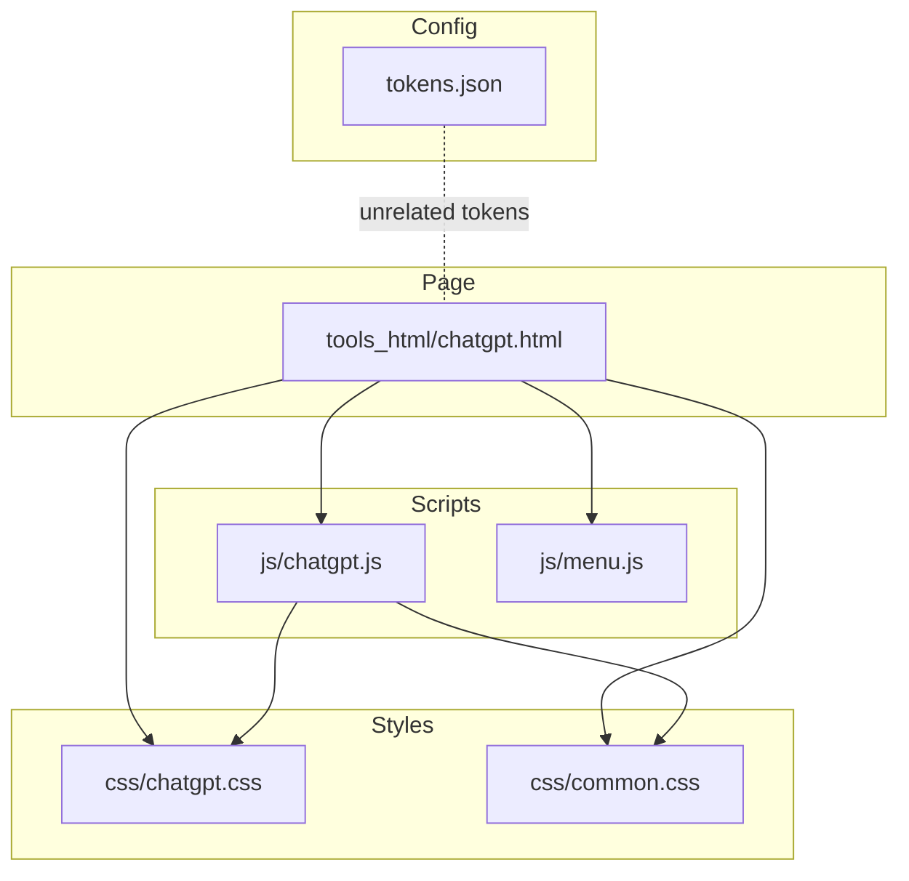
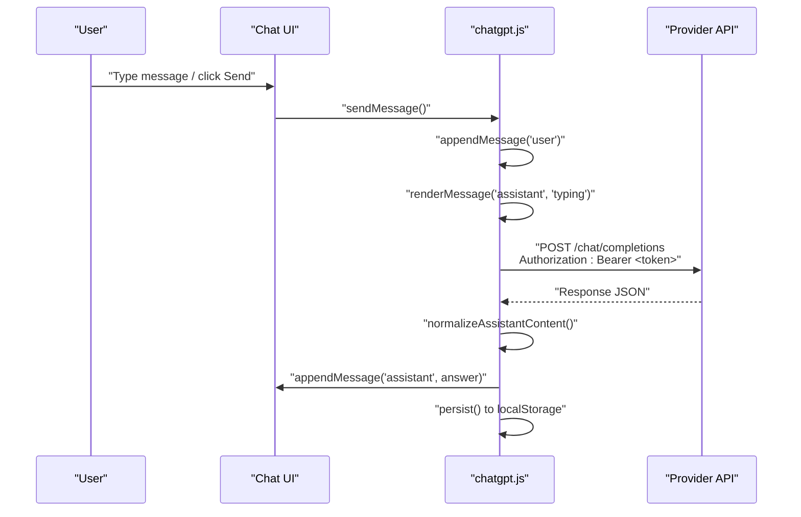
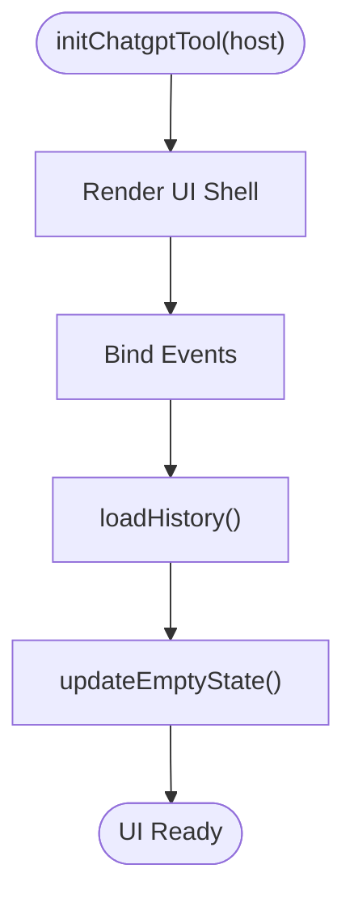
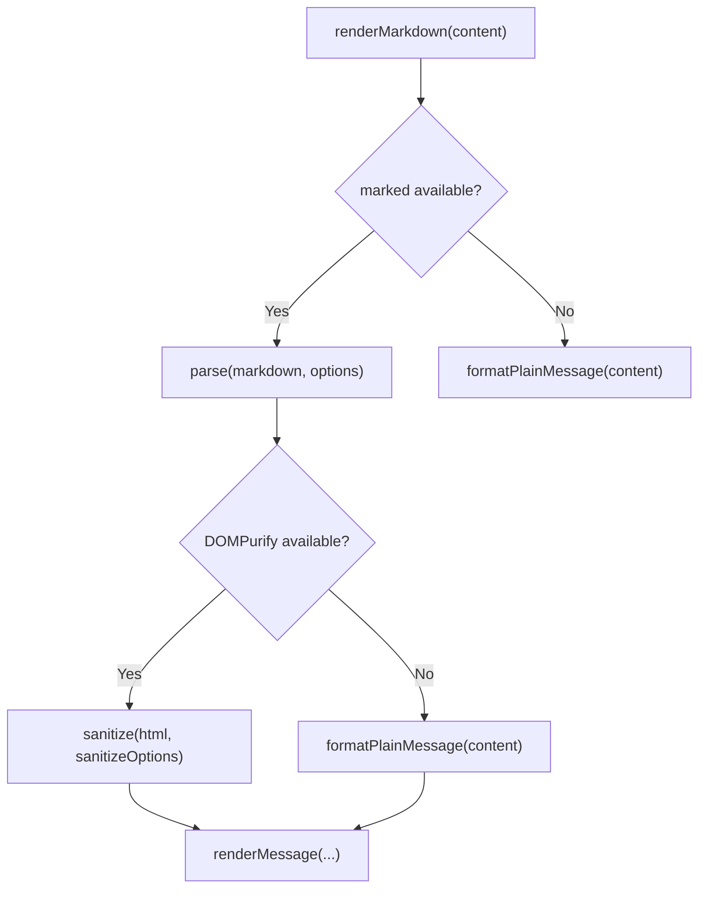
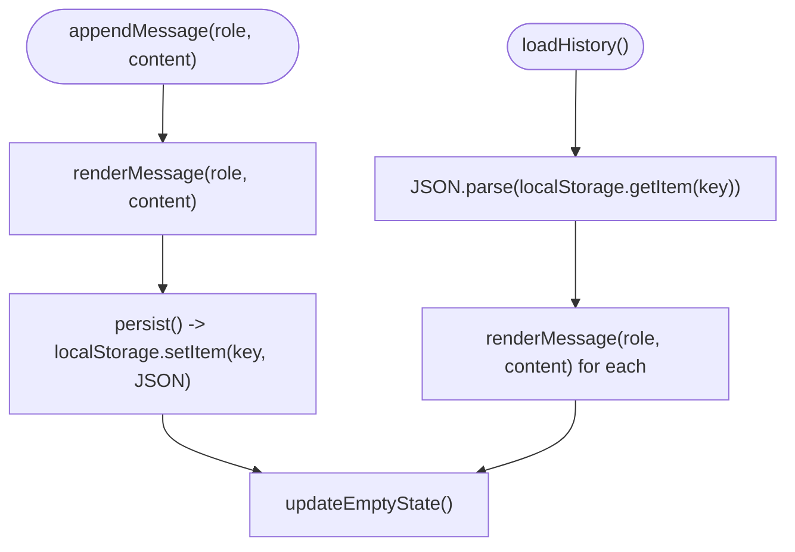
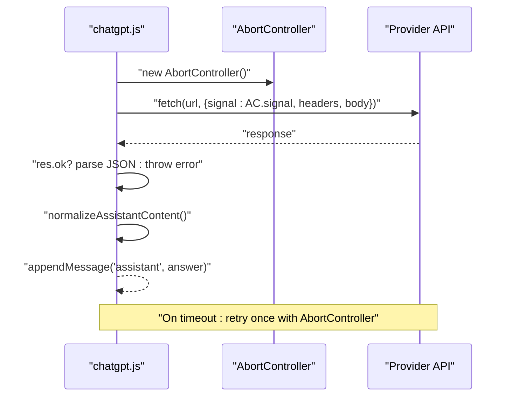
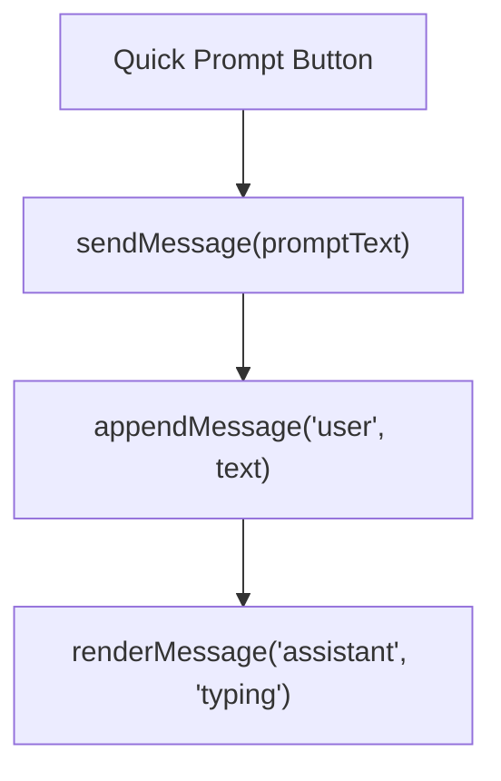
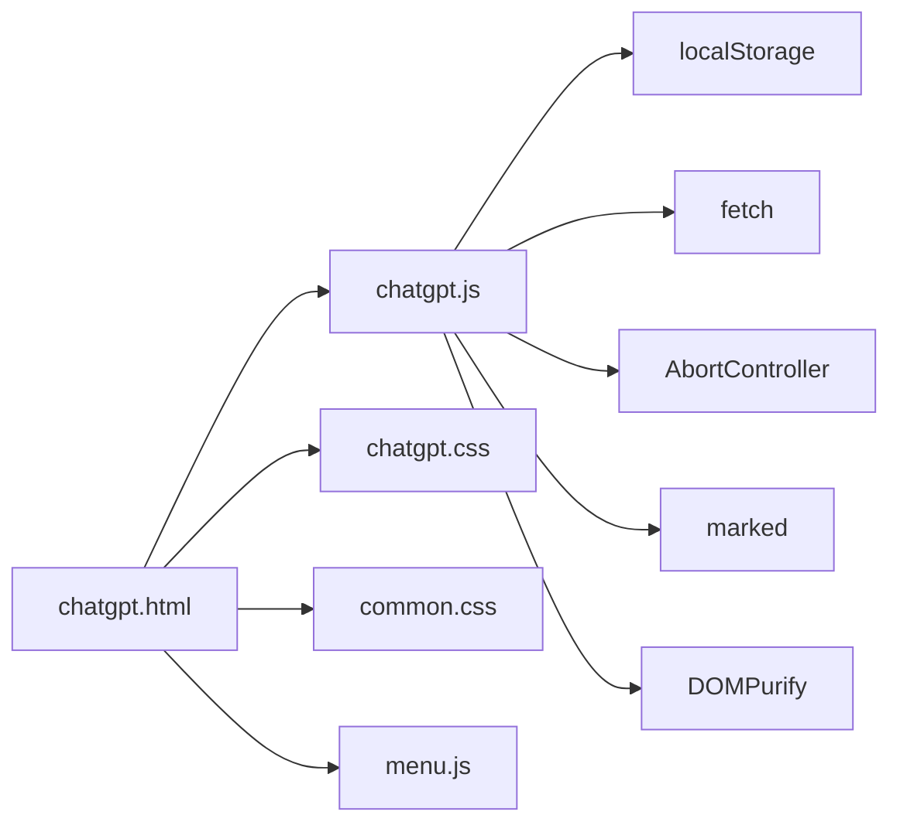

# ChatGPT Integration

<cite>
**Referenced Files in This Document**
- [chatgpt.html](file://tools_html/chatgpt.html)
- [chatgpt.js](file://js/chatgpt.js)
- [chatgpt.css](file://css/chatgpt.css)
- [common.css](file://css/common.css)
- [menu.js](file://js/menu.js)
- [tokens.json](file://tokens.json)
</cite>

## Table of Contents
1. [Introduction](#introduction)
2. [Project Structure](#project-structure)
3. [Core Components](#core-components)
4. [Architecture Overview](#architecture-overview)
5. [Detailed Component Analysis](#detailed-component-analysis)
6. [Dependency Analysis](#dependency-analysis)
7. [Performance Considerations](#performance-considerations)
8. [Troubleshooting Guide](#troubleshooting-guide)
9. [Conclusion](#conclusion)
10. [Appendices](#appendices)

## Introduction
This document explains the ChatGPT integration tool built into the TAWEBTOOL project. It covers how the tool is configured and launched, how conversations are handled, how messages are rendered and persisted, and how authentication and API requests are performed. It also provides practical guidance on prompt engineering, conversation flow optimization, context preservation, rate limiting, error handling, retries, security considerations, and troubleshooting.

## Project Structure
The ChatGPT tool is a self-contained module composed of:
- A dedicated HTML page that loads the tool’s JavaScript and styles.
- A JavaScript module that initializes the UI, manages conversation state, renders messages, and performs API requests.
- CSS files that define the UI theme and layout.
- A small tokens configuration file for unrelated services (not used by ChatGPT).

**Diagram sources**
- [chatgpt.html:1-31](file://tools_html/chatgpt.html#L1-L31)
- [chatgpt.js:1-304](file://js/chatgpt.js#L1-L304)
- [chatgpt.css:1-399](file://css/chatgpt.css#L1-L399)
- [common.css:1-386](file://css/common.css#L1-L386)
- [menu.js:1-273](file://js/menu.js#L1-L273)
- [tokens.json:1-5](file://tokens.json#L1-L5)

**Section sources**
- [chatgpt.html:1-31](file://tools_html/chatgpt.html#L1-L31)
- [chatgpt.js:1-304](file://js/chatgpt.js#L1-L304)
- [chatgpt.css:1-399](file://css/chatgpt.css#L1-L399)
- [common.css:1-386](file://css/common.css#L1-L386)
- [menu.js:1-273](file://js/menu.js#L1-L273)
- [tokens.json:1-5](file://tokens.json#L1-L5)

## Core Components
- Conversation UI shell: renders the message area, quick prompts, input field, and send/clear controls.
- Message rendering engine: converts Markdown to sanitized HTML and displays typing indicators.
- History manager: persists conversation history to local storage and restores it on load.
- API client: sends requests to the provider endpoint with authentication and handles timeouts and errors.
- Quick prompts: pre-defined prompts to accelerate common tasks.

Key behaviors:
- Messages are stored as role/content pairs and persisted to local storage.
- The last N messages (with a system prompt) are sent to the API for context.
- Markdown is parsed and sanitized to prevent XSS.
- A typing indicator is shown while waiting for the server response.

**Section sources**
- [chatgpt.js:45-300](file://js/chatgpt.js#L45-L300)
- [chatgpt.css:68-399](file://css/chatgpt.css#L68-L399)

## Architecture Overview
The ChatGPT tool is a single-page application module that initializes itself inside a designated container element. It composes UI elements, binds events, and communicates with a remote API.

**Diagram sources**
- [chatgpt.js:205-267](file://js/chatgpt.js#L205-L267)

## Detailed Component Analysis

### Initialization and UI Composition
- The initialization function creates the chat shell, message area, quick prompts, input, and buttons.
- It wires up event listeners for sending messages, clearing chat, resizing textarea, and quick prompts.
- It restores previous conversation history from local storage and updates the empty state.

**Diagram sources**
- [chatgpt.js:45-300](file://js/chatgpt.js#L45-L300)

**Section sources**
- [chatgpt.js:45-122](file://js/chatgpt.js#L45-L122)

### Message Rendering and Markdown Processing
- Markdown is parsed using a marked library if available; otherwise plain text is escaped and rendered.
- DOMPurify sanitizes the resulting HTML to allow a controlled set of tags and attributes.
- Links are opened in new tabs with safe attributes; images are lazy-loaded and trigger scroll-to-bottom on load.

**Diagram sources**
- [chatgpt.js:32-43](file://js/chatgpt.js#L32-L43)

**Section sources**
- [chatgpt.js:32-43](file://js/chatgpt.js#L32-L43)

### Conversation Management and Persistence
- Messages are appended to an in-memory history array and persisted to local storage under a specific key.
- On load, the tool reads the stored history and re-renders messages.
- Clearing the chat removes the stored history and resets the UI.

**Diagram sources**
- [chatgpt.js:115-194](file://js/chatgpt.js#L115-L194)

**Section sources**
- [chatgpt.js:115-194](file://js/chatgpt.js#L115-L194)

### Authentication and API Request Flow
- The tool uses a static API key embedded in the script for authentication.
- Requests target a provider endpoint with a specific model and temperature setting.
- A timeout is enforced via AbortController; the tool retries once on timeout.
- Non-OK responses are parsed for error messages; otherwise a default message is shown.

**Diagram sources**
- [chatgpt.js:205-267](file://js/chatgpt.js#L205-L267)

**Section sources**
- [chatgpt.js:205-267](file://js/chatgpt.js#L205-L267)

### Quick Prompts and Conversation Flow Optimization
- Quick prompts are provided to guide common tasks and reduce friction.
- These can be used to prime the conversation with structured inputs, improving consistency and reducing ambiguity.

**Diagram sources**
- [chatgpt.js:292-294](file://js/chatgpt.js#L292-L294)

**Section sources**
- [chatgpt.js:56-81](file://js/chatgpt.js#L56-L81)
- [chatgpt.js:292-294](file://js/chatgpt.js#L292-L294)

## Dependency Analysis
- The HTML page loads the ChatGPT tool script and external libraries for Markdown and sanitization.
- The tool depends on browser APIs (fetch, localStorage, AbortController) and third-party libraries (marked, DOMPurify).
- The menu system integrates the ChatGPT tool into the main navigation.

**Diagram sources**
- [chatgpt.html:11-12](file://tools_html/chatgpt.html#L11-L12)
- [chatgpt.js:1-304](file://js/chatgpt.js#L1-L304)
- [menu.js:1-273](file://js/menu.js#L1-L273)

**Section sources**
- [chatgpt.html:11-12](file://tools_html/chatgpt.html#L11-L12)
- [chatgpt.js:1-304](file://js/chatgpt.js#L1-L304)
- [menu.js:1-273](file://js/menu.js#L1-L273)

## Performance Considerations
- Rendering: Markdown parsing and sanitization occur per message; keep messages concise to minimize overhead.
- DOM updates: The UI scrolls to the bottom after each message; batching updates can help for long histories.
- Storage: Persisting to local storage is synchronous; very large histories may cause noticeable delays on save/load.
- Network: The tool enforces a single retry on timeout; consider adding exponential backoff for production deployments.

[No sources needed since this section provides general guidance]

## Troubleshooting Guide

Common issues and resolutions:
- Authentication failures
  - Symptom: Error indicating invalid or missing credentials.
  - Resolution: Verify the API key is valid and not expired. The current implementation embeds a key directly in the script; for production, replace with a secure backend proxy.
- Timeout errors
  - Symptom: “Request timeout” message.
  - Resolution: The tool retries once automatically. If persistent, check network connectivity or consider increasing the timeout limit.
- Non-OK HTTP responses
  - Symptom: Generic HTTP error message.
  - Resolution: Inspect the provider’s error payload and adjust request parameters (model, temperature).
- Markdown rendering anomalies
  - Symptom: Unexpected HTML or missing formatting.
  - Resolution: Ensure marked and DOMPurify are loaded; confirm allowed tags and attributes are sufficient for your content.
- XSS or unsafe content
  - Symptom: Scripts or unexpected markup appearing in messages.
  - Resolution: Confirm DOMPurify is active and configured with allowed tags/attributes.
- Local storage corruption
  - Symptom: Chat fails to load or shows blank history.
  - Resolution: Clear the stored key or remove the corrupted entry from browser developer tools.

**Section sources**
- [chatgpt.js:249-266](file://js/chatgpt.js#L249-L266)

## Conclusion
The ChatGPT integration tool provides a lightweight, client-side chat interface that connects to a provider API, persists conversations locally, and renders Markdown safely. It is easy to launch from the main menu and offers quick prompts to streamline common tasks. For production use, consider moving the API key to a backend proxy, implementing robust retry/backoff policies, and enhancing security around token storage and CORS.

[No sources needed since this section summarizes without analyzing specific files]

## Appendices

### API Configuration and Authentication Setup
- Endpoint: The tool targets a provider endpoint for chat completions.
- Authentication: Uses a static bearer token included in the script.
- Model and parameters: The tool specifies a model and temperature; adjust as needed.

Security note: Embedding secrets in client-side code exposes them to users. Prefer a backend proxy that authenticates requests and forwards them to the provider.

**Section sources**
- [chatgpt.js:225-236](file://js/chatgpt.js#L225-L236)

### Token Management
- The project includes a tokens configuration file for unrelated services; it is not used by the ChatGPT tool.
- For the ChatGPT tool, avoid storing sensitive tokens in local storage or embedded scripts.

**Section sources**
- [tokens.json:1-5](file://tokens.json#L1-L5)

### Conversation Context and History
- Context window: The tool sends the latest N messages plus a system prompt to the API.
- Persistence: Conversations are saved to local storage and restored on page load.
- Clearing: The clear action removes stored history and resets the UI.

**Section sources**
- [chatgpt.js:219-219](file://js/chatgpt.js#L219-L219)
- [chatgpt.js:115-194](file://js/chatgpt.js#L115-L194)

### Message Handling and Response Processing
- Message normalization: Handles both string and array content from the API.
- Typing indicator: Shown during request processing.
- Error handling: Displays user-friendly messages for timeouts and non-OK responses.

**Section sources**
- [chatgpt.js:124-133](file://js/chatgpt.js#L124-L133)
- [chatgpt.js:216-266](file://js/chatgpt.js#L216-L266)

### Practical Prompt Engineering and Conversation Optimization
- Use quick prompts to establish roles and desired output formats.
- Keep prompts concise and specific to reduce ambiguity.
- Use the conversation history to maintain continuity across turns.

**Section sources**
- [chatgpt.js:56-81](file://js/chatgpt.js#L56-L81)
- [chatgpt.js:219-219](file://js/chatgpt.js#L219-L219)

### Rate Limiting, Retries, and Backoff
- Current behavior: Single retry on timeout with a fixed timeout.
- Recommended enhancements: Implement exponential backoff and jitter; add circuit breaker logic for repeated failures.

**Section sources**
- [chatgpt.js:221-247](file://js/chatgpt.js#L221-L247)

### Security Considerations
- Token storage: Avoid embedding secrets in client-side code; use a backend proxy.
- CORS: Ensure the provider allows requests from your origin; configure CORS appropriately on the backend.
- Privacy: Advise users not to share sensitive information; the UI warns against entering sensitive data.

**Section sources**
- [chatgpt.js:94-94](file://js/chatgpt.js#L94-L94)

### UI and Styling
- The tool uses a dark-themed, glass-morphism style with responsive adjustments.
- Scroll behavior and lazy-loading improve UX for media-heavy content.

**Section sources**
- [chatgpt.css:13-399](file://css/chatgpt.css#L13-L399)
- [common.css:1-386](file://css/common.css#L1-L386)

### Launch and Navigation
- The ChatGPT tool is accessible from the main menu under the AI tools category.

**Section sources**
- [menu.js:2-8](file://js/menu.js#L2-L8)