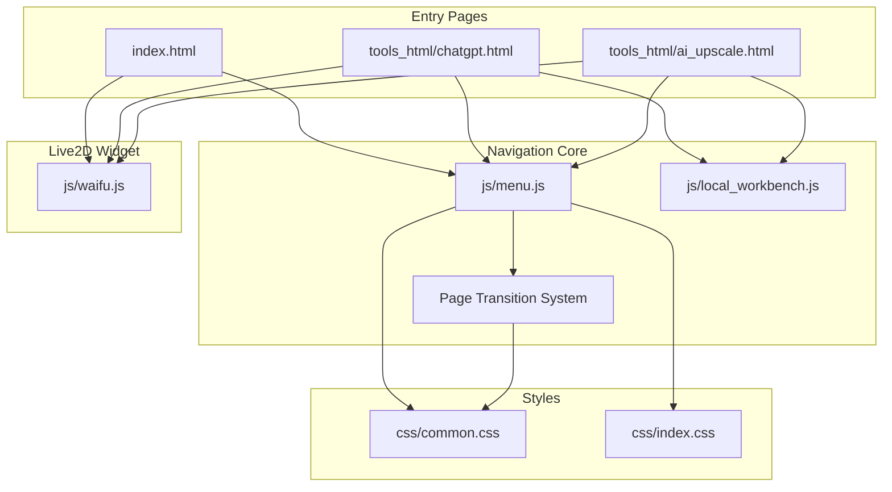
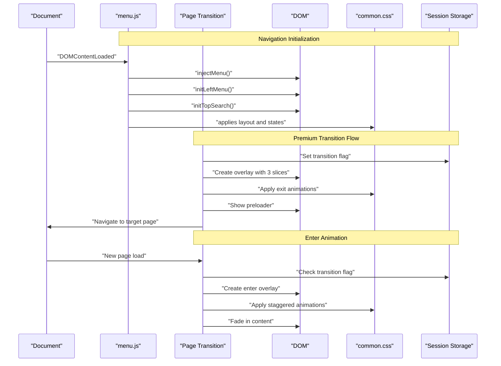
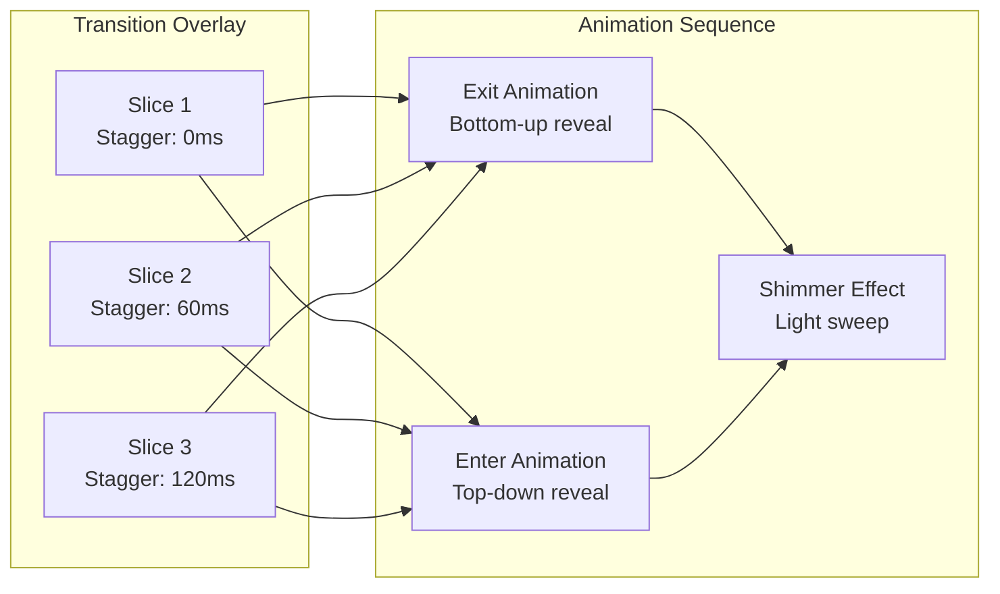
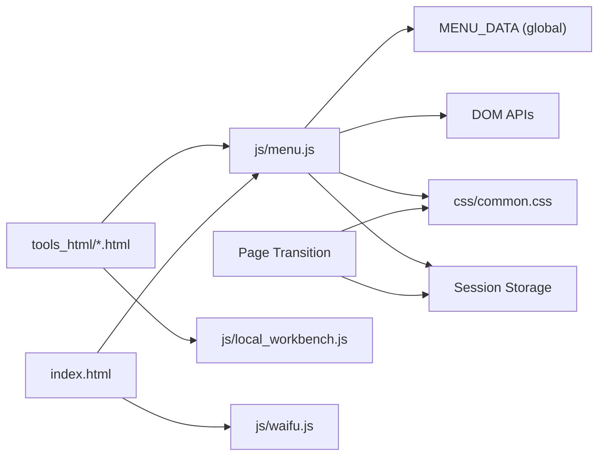

# Core Navigation System

<cite>
**Referenced Files in This Document**
- [menu.js](file://js/menu.js)
- [common.css](file://css/common.css)
- [index.css](file://css/index.css)
- [index.html](file://index.html)
- [local_workbench.js](file://js/local_workbench.js)
- [chatgpt.html](file://tools_html/chatgpt.html)
- [ai_upscale.html](file://tools_html/ai_upscale.html)
- [waifu.js](file://js/waifu.js)
</cite>

## Update Summary
**Changes Made**
- Added comprehensive premium page transition system with glass morphism effects
- Implemented three-slice vertical panel design with staggered reveal animations
- Enhanced navigation experience with intelligent preloading and session-based state management
- Added content fade-out/in effects for smooth app-like transitions
- Updated search integration to support transition triggers

## Table of Contents
1. [Introduction](#introduction)
2. [Project Structure](#project-structure)
3. [Core Components](#core-components)
4. [Architecture Overview](#architecture-overview)
5. [Detailed Component Analysis](#detailed-component-analysis)
6. [Premium Page Transition System](#premium-page-transition-system)
7. [Dependency Analysis](#dependency-analysis)
8. [Performance Considerations](#performance-considerations)
9. [Troubleshooting Guide](#troubleshooting-guide)
10. [Conclusion](#conclusion)

## Introduction
This document describes the core navigation system that powers the application's menu architecture, global search, and UI layout. It explains how the menu data is structured, how the sidebar and search are built and rendered, and how the system integrates with tool pages via the workbench framework. The system now includes a premium page transition system with glass morphism effects, providing an app-like smooth navigation experience. It also covers event handling, responsive design, and practical guidance for extending the menu with new tools.

## Project Structure
The navigation system spans a small set of JavaScript and CSS assets, plus HTML entry points for tools. The central JavaScript module defines the menu data and implements rendering, accordion behavior, global search, and premium page transitions. CSS files define the responsive layout, visual states, and sophisticated transition animations. Tool pages embed the navigation and delegate tool-specific UI to the workbench.

**Diagram sources**
- [index.html:12-22](file://index.html#L12-L22)
- [chatgpt.html:15-25](file://tools_html/chatgpt.html#L15-L25)
- [ai_upscale.html:12-162](file://tools_html/ai_upscale.html#L12-L162)
- [menu.js:268-272](file://js/menu.js#L268-L272)
- [menu.js:273-456](file://js/menu.js#L273-L456)
- [common.css:7-58](file://css/common.css#L7-L58)
- [common.css:387-527](file://css/common.css#L387-L527)
- [index.css:14-41](file://css/index.css#L14-L41)
- [local_workbench.js:170-189](file://js/local_workbench.js#L170-L189)
- [waifu.js:3-17](file://js/waifu.js#L3-L17)

**Section sources**
- [index.html:12-22](file://index.html#L12-L22)
- [chatgpt.html:15-25](file://tools_html/chatgpt.html#L15-L25)
- [ai_upscale.html:12-162](file://tools_html/ai_upscale.html#L12-L162)
- [menu.js:268-272](file://js/menu.js#L268-L272)
- [menu.js:273-456](file://js/menu.js#L273-L456)
- [common.css:7-58](file://css/common.css#L7-L58)
- [common.css:387-527](file://css/common.css#L387-L527)
- [index.css:14-41](file://css/index.css#L14-L41)
- [local_workbench.js:170-189](file://js/local_workbench.js#L170-L189)
- [waifu.js:3-17](file://js/waifu.js#L3-L17)

## Core Components
- Menu data and rendering: Centralized menu definition drives the sidebar and search indexing.
- Sidebar accordion: Click-to-expand categories with single-open behavior.
- Global search: Live filtering of categories and items with keyboard shortcuts and dropdown results.
- Premium page transitions: Sophisticated glass morphism effects with three-slice vertical panels and staggered animations.
- Workbench integration: Tool pages embed the navigation and delegate UI to the workbench.
- Responsive layout: Fixed-position panels with percentage-based widths and media queries in tool-specific styles.

Key responsibilities:
- Single source of truth for menu items and categories.
- Lightweight DOM manipulation for menu and search UI.
- Intelligent preloading and session-based state management for smooth transitions.
- Minimal coupling to tool pages; tools only declare intent via dataset attributes.

**Section sources**
- [menu.js:2-43](file://js/menu.js#L2-L43)
- [menu.js:46-68](file://js/menu.js#L46-L68)
- [menu.js:80-103](file://js/menu.js#L80-L103)
- [menu.js:107-272](file://js/menu.js#L107-L272)
- [menu.js:273-456](file://js/menu.js#L273-L456)
- [common.css:7-58](file://css/common.css#L7-L58)
- [common.css:387-527](file://css/common.css#L387-L527)
- [local_workbench.js:170-189](file://js/local_workbench.js#L170-L189)

## Architecture Overview
The navigation system initializes on DOMContentLoaded, injecting the menu into the left sidebar and setting up the top search bar. The premium page transition system intercepts internal link clicks, performs intelligent preloading, and plays sophisticated glass morphism animations. Tool pages include the same navigation script and rely on the workbench to render tool-specific UI inside a dedicated panel element.

**Diagram sources**
- [menu.js:268-272](file://js/menu.js#L268-L272)
- [menu.js:273-456](file://js/menu.js#L273-L456)
- [common.css:387-527](file://css/common.css#L387-L527)

## Detailed Component Analysis

### Menu Data and Rendering
- Menu data is a flat array of categories, each containing items with label, href, and optional keywords. This serves as the single source of truth for both the sidebar and search indexing.
- The renderer builds nested HTML lists, adding a data attribute used for client-side search matching.
- Path prefixing ensures correct linking whether the app runs from the root or a subdirectory.

Implementation highlights:
- Building HTML from MENU_DATA and injecting into the left sidebar container.
- Using a data attribute to precompute searchable terms for fast filtering.

**Section sources**
- [menu.js:2-43](file://js/menu.js#L2-L43)
- [menu.js:46-68](file://js/menu.js#L46-L68)
- [menu.js:112-115](file://js/menu.js#L112-L115)
- [menu.js:117-135](file://js/menu.js#L117-L135)

### Sidebar Accordion Behavior
- Clicking a category toggles its submenu open/closed.
- Only one category remains open at a time; others are automatically closed.
- Visual feedback via CSS classes toggled on the clicked item and its siblings.

Event handling:
- Delegated click listener on the root menu element.
- Conditional handling to avoid toggling when clicking inner links.

**Section sources**
- [menu.js:80-103](file://js/menu.js#L80-L103)
- [common.css:154-162](file://css/common.css#L154-L162)
- [common.css:178-181](file://css/common.css#L178-L181)

### Global Search Implementation
- Search indexing:
  - Precomputes a flat list of items with normalized keywords combining label, category, href basename, and configured keywords.
  - Prefixes hrefs based on deployment context.
- Live filtering:
  - Listens to input and focus events.
  - Filters the precomputed list and renders a dropdown with up to a fixed number of results.
  - Highlights matches in the title and updates the sidebar to show only matching categories/items.
- Keyboard support:
  - Enter selects the first match and triggers premium page transition if available.
  - Escape clears the input and closes the dropdown.

Rendering and UX:
- Dropdown appended to the search wrapper with accessibility attributes.
- Results include title and metadata; selection navigates using the transition system.

**Section sources**
- [menu.js:107-164](file://js/menu.js#L107-L164)
- [menu.js:165-185](file://js/menu.js#L165-L185)
- [menu.js:187-221](file://js/menu.js#L187-L221)
- [menu.js:223-266](file://js/menu.js#L223-L266)
- [menu.js:252-257](file://js/menu.js#L252-L257)
- [common.css:317-376](file://css/common.css#L317-L376)

### Workbench Integration and Tool Pages
- Tool pages include the navigation script and a panel element with a dataset indicating the tool key.
- The workbench initializes the panel, builds a base shell, and dispatches to a tool-specific initializer based on the key.
- Some tools are fully local; others may fall back to external resources if local scripts are missing.

Integration points:
- Tool pages embed the same navigation and styles.
- Workbench determines whether to initialize a local tool or render a fallback.

**Section sources**
- [chatgpt.html:15-25](file://tools_html/chatgpt.html#L15-25)
- [ai_upscale.html:12-162](file://tools_html/ai_upscale.html#L12-L162)
- [local_workbench.js:170-189](file://js/local_workbench.js#L170-L189)

### Responsive Design and Layout
- Left sidebar and top search use fixed positioning and percentage-based widths to adapt to viewport size.
- Tool-specific CSS often includes media queries to adjust layouts for smaller screens.
- Scrollbars and backdrop effects are styled consistently across components.

Layout anchors:
- Left menu positioned at the left edge with full height.
- Top search fixed near the top center.
- Panel content area occupies the remaining space.

**Section sources**
- [common.css:7-58](file://css/common.css#L7-L58)
- [common.css:317-376](file://css/common.css#L317-L376)
- [index.css:14-41](file://css/index.css#L14-L41)

### Singleton Pattern for Menu Management
- The menu system does not implement a traditional singleton class. Instead, it relies on a single global data array and a set of functions operating on the DOM.
- Initialization occurs once on DOMContentLoaded, ensuring the menu is injected and event listeners attached exactly once per page load.
- There is no explicit module export or private scope enforcing uniqueness; the pattern emerges from the single-use lifecycle and shared global state.

Implications:
- Easy to extend by adding new items to the global data array.
- No runtime instantiation or disposal concerns.

**Section sources**
- [menu.js:2-43](file://js/menu.js#L2-L43)
- [menu.js:268-272](file://js/menu.js#L268-L272)

### Event Handling Mechanisms
- DOMContentLoaded triggers initialization of menu injection, accordion, search, and page transitions.
- Click events on the menu root toggle category state.
- Input/focus/keydown handlers manage search behavior and keyboard navigation.
- Document-level click handler hides the dropdown when clicking outside the search area.
- Link click interception enables premium page transitions for internal navigation.

Error resilience:
- Guard checks ensure functions return early if required DOM nodes are missing.

**Section sources**
- [menu.js:268-272](file://js/menu.js#L268-L272)
- [menu.js:80-103](file://js/menu.js#L80-L103)
- [menu.js:223-266](file://js/menu.js#L223-L266)
- [menu.js:404-415](file://js/menu.js#L404-L415)

### User Interface Components
- Left sidebar: Grid-based layout with category tiles, icons, and collapsible submenus.
- Top search: Input field with dropdown results list and highlighted matches.
- Panel area: Dedicated content region for tool UI, managed by the workbench.
- Premium overlays: Glass morphism transition overlays with three vertical slices and shimmer effects.

Accessibility and UX:
- Role attributes on search results and listbox semantics.
- Focus and hover states for interactive elements.
- Smooth transitions for open/close states and page navigation.

**Section sources**
- [common.css:60-199](file://css/common.css#L60-L199)
- [common.css:317-376](file://css/common.css#L317-L376)
- [common.css:387-527](file://css/common.css#L387-L527)
- [local_workbench.js:32-40](file://js/local_workbench.js#L32-L40)

### Configuration Options for Menu Items
- Categories: name, icon class.
- Items: label, href, keywords array.
- Keywords are concatenated with label, category, and href-derived tokens during indexing.

Extending the menu:
- Add a new category or item to the global data array.
- Provide localized label and optional keywords for discoverability.

**Section sources**
- [menu.js:2-43](file://js/menu.js#L2-L43)
- [menu.js:117-135](file://js/menu.js#L117-L135)

### Search Indexing and Matching
- Indexing combines label, category, href basename (underscore/dash converted to spaces), and keywords.
- Matching is performed against a normalized, trimmed, single-spaced string.
- Results are capped to a small number and rendered with highlighting.

Optimization note:
- Precomputation avoids repeated DOM traversal during search.
- Normalization reduces case sensitivity and whitespace issues.

**Section sources**
- [menu.js:108-110](file://js/menu.js#L108-L110)
- [menu.js:117-135](file://js/menu.js#L117-L135)
- [menu.js:240-244](file://js/menu.js#L240-L244)
- [menu.js:143-151](file://js/menu.js#L143-L151)

### User Preference Management
- The system does not persist user preferences (e.g., last opened category) in this component.
- Live2D widget integration demonstrates preference persistence via localStorage for model selection.
- Session-based state management for page transitions using sessionStorage.

**Section sources**
- [waifu.js:8-9](file://js/waifu.js#L8-L9)
- [menu.js:276-282](file://js/menu.js#L276-L282)

## Premium Page Transition System

### Overview
The premium page transition system provides an app-like smooth navigation experience through sophisticated glass morphism effects, intelligent preloading, and session-based state management. The system intercepts internal link clicks, performs background resource preloading, and plays coordinated animations for seamless page transitions.

### Three-Slice Vertical Panel Design
The transition overlay consists of three vertical slices that animate with staggered timing to create a dynamic reveal effect. Each slice uses glass morphism styling with backdrop blur and gradient backgrounds.

**Diagram sources**
- [menu.js:300-309](file://js/menu.js#L300-L309)
- [common.css:400-425](file://css/common.css#L400-L425)
- [common.css:440-454](file://css/common.css#L440-L454)
- [common.css:477-503](file://css/common.css#L477-L503)

### Staggered Reveal Animations
Each of the three vertical slices animates with precise timing delays to create a cascading reveal effect. The animations use cubic-bezier easing curves for smooth, natural motion.

**Exit Animation Flow:**
1. Slices scale from bottom (scaleY: 0 → 1)
2. Opacity fades in with staggered timing
3. Content simultaneously fades out with blur effects

**Enter Animation Flow:**
1. Slices start fully visible (scaleY: 1)
2. Content fades in with upward movement
3. Slices scale down to top (scaleY: 1 → 0)
4. Background image scales and fades in

### Content Fade-Out/In Effects
During transitions, the main content elements (#panel, #welcome_title, #main_bg) undergo coordinated animations:

- **Content Out**: Scale down slightly (0.97), translate downward (12px), apply blur filter (6px), fade to opacity 0
- **Content In**: Start with scale up (1.02), translate upward (-16px), apply blur filter (8px), fade from opacity 0
- **Background**: Separate animation with scale transformation and delayed fade-in

### Intelligent Preloading System
The system performs background preloading to minimize perceived loading times:

1. **HTML Fetching**: XMLHttpRequest fetches target page HTML
2. **Image Extraction**: Parses DOM to extract all img[src] URLs
3. **CSS Background Detection**: Scans inline styles for url() patterns
4. **Parallel Prefetching**: Creates Image objects to prefetch resources
5. **Timing Coordination**: Ensures minimum animation duration while optimizing for speed

### Session-Based State Management
The transition system uses sessionStorage for cross-page state coordination:

- **Transition Flag**: `pt_transition` key indicates incoming transition
- **Flash Prevention**: Early style injection prevents content flash during transitions
- **Cleanup**: Automatic removal of transition flags after completion

### Glass Morphism Visual Effects
The transition overlay employs advanced CSS techniques for premium visual quality:

- **Backdrop Filter**: `blur(24px) saturate(1.4)` for frosted glass appearance
- **Gradient Backgrounds**: Multi-stop linear gradients with transparency
- **Shimmer Accent**: Animated pseudo-element creates light sweep effect
- **Webkit Compatibility**: Vendor prefixes for broader browser support

### Preloader Implementation
A subtle dot-pulse loader provides visual feedback during transitions:

- Three animated dots with staggered timing
- Scale and opacity animations
- Centered positioning with high z-index
- Brand color theming (rgba(55, 177, 140, 0.7))

**Section sources**
- [menu.js:273-456](file://js/menu.js#L273-L456)
- [menu.js:300-355](file://js/menu.js#L300-L355)
- [menu.js:372-398](file://js/menu.js#L372-L398)
- [menu.js:417-444](file://js/menu.js#L417-L444)
- [common.css:387-527](file://css/common.css#L387-L527)
- [common.css:400-425](file://css/common.css#L400-L425)
- [common.css:427-438](file://css/common.css#L427-L438)
- [common.css:440-475](file://css/common.css#L440-L475)
- [common.css:477-527](file://css/common.css#L477-L527)

## Dependency Analysis
The navigation system depends on:
- Global menu data array for content.
- DOM APIs for injection and event handling.
- CSS for layout, visual states, and transition animations.
- Tool pages for embedding and workbench for content rendering.
- Session storage for cross-page state management.

**Diagram sources**
- [menu.js:2-43](file://js/menu.js#L2-L43)
- [menu.js:273-456](file://js/menu.js#L273-L456)
- [common.css:7-58](file://css/common.css#L7-L58)
- [common.css:387-527](file://css/common.css#L387-L527)
- [chatgpt.html:15-25](file://tools_html/chatgpt.html#L15-L25)
- [ai_upscale.html:12-162](file://tools_html/ai_upscale.html#L12-L162)
- [index.html:12-22](file://index.html#L12-L22)
- [local_workbench.js:170-189](file://js/local_workbench.js#L170-L189)
- [waifu.js:3-17](file://js/waifu.js#L3-L17)

**Section sources**
- [menu.js:2-43](file://js/menu.js#L2-L43)
- [menu.js:273-456](file://js/menu.js#L273-L456)
- [common.css:7-58](file://css/common.css#L7-L58)
- [common.css:387-527](file://css/common.css#L387-L527)
- [chatgpt.html:15-25](file://tools_html/chatgpt.html#L15-L25)
- [ai_upscale.html:12-162](file://tools_html/ai_upscale.html#L12-L162)
- [index.html:12-22](file://index.html#L12-L22)
- [local_workbench.js:170-189](file://js/local_workbench.js#L170-L189)
- [waifu.js:3-17](file://js/waifu.js#L3-L17)

## Performance Considerations
- Search performance:
  - Precompute the search index once per page load to avoid repeated DOM scans.
  - Limit the number of displayed results to keep the dropdown lightweight.
  - Normalize and trim input to reduce matching overhead.
- DOM operations:
  - Batch class toggles and minimal reflows by updating only affected elements.
  - Avoid unnecessary repaints by toggling visibility and opacity rather than removing elements.
  - Use requestAnimationFrame for smooth animation timing.
- CSS transitions:
  - Keep transition durations reasonable to prevent jank on slower devices.
  - Leverage GPU acceleration with transform and opacity properties.
  - Use backdrop-filter judiciously due to performance impact.
- Page transitions:
  - Intelligent preloading minimizes perceived loading time.
  - Session-based state prevents redundant processing.
  - Staggered animations distribute rendering load.
  - Resource prefetching improves subsequent navigation speed.

## Troubleshooting Guide
Common issues and resolutions:
- Menu not appearing:
  - Ensure the left sidebar container exists and the script runs after DOMContentLoaded.
  - Verify the container selector matches the expected class.
- Search not filtering:
  - Confirm the search wrapper and input exist.
  - Check that keywords are present in items and that the data attribute is populated.
- Accordion not working:
  - Ensure the menu root element exists and the click handler is attached.
  - Verify that category items contain submenus when applicable.
- Tool UI not loading:
  - Confirm the panel element has the correct dataset and the workbench initializer is included.
  - Check for missing tool scripts and fallback behavior.
- Page transitions not working:
  - Verify that triggerExitTransition function is available before calling.
  - Check sessionStorage permissions and availability.
  - Ensure CSS transition classes are properly applied.
- Glass morphism effects not displaying:
  - Check browser compatibility for backdrop-filter property.
  - Verify vendor prefixes are present for older browsers.
  - Ensure proper z-index layering for overlay elements.

**Section sources**
- [menu.js:71-77](file://js/menu.js#L71-L77)
- [menu.js:223-227](file://js/menu.js#L223-L227)
- [menu.js:80-84](file://js/menu.js#L80-L84)
- [menu.js:252-257](file://js/menu.js#L252-L257)
- [menu.js:282-297](file://js/menu.js#L282-L297)
- [local_workbench.js:170-172](file://js/local_workbench.js#L170-L172)

## Conclusion
The navigation system is intentionally compact and focused: a single data source, straightforward rendering, efficient search indexing, and sophisticated premium page transitions. The addition of glass morphism effects, three-slice vertical panels, staggered animations, and intelligent preloading creates an app-like smooth navigation experience. It integrates cleanly with tool pages through the workbench, enabling a consistent UI while allowing tools to manage their own content. By following the documented extension points and performance tips, teams can reliably add new tools and maintain responsiveness across devices while delivering a premium user experience.