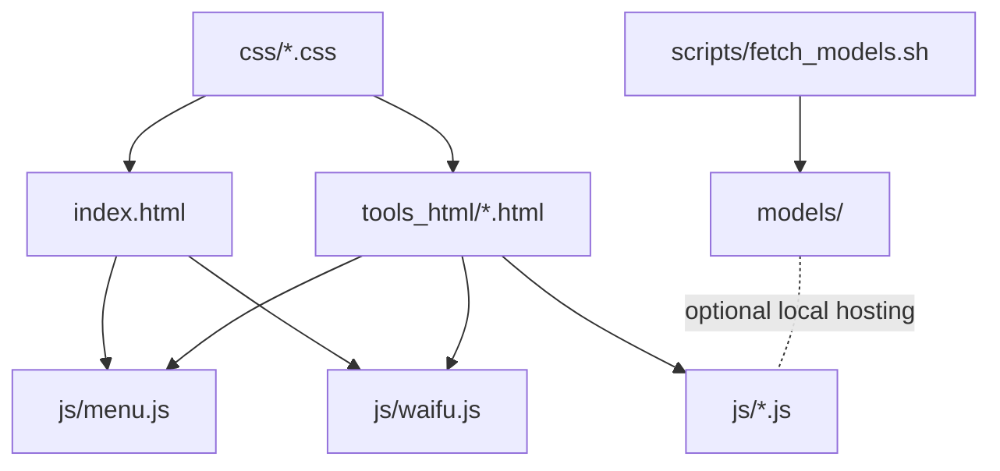
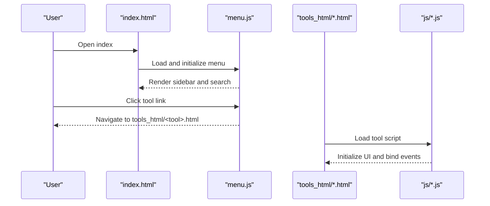
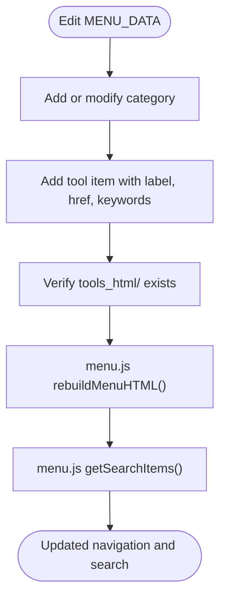
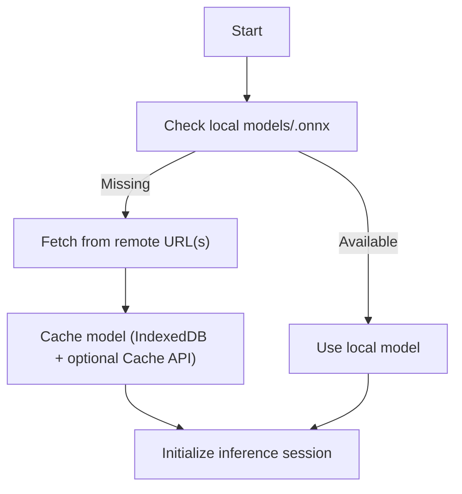
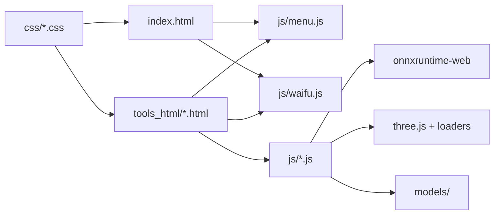

# Development and Maintenance

<cite>
**Referenced Files in This Document**
- [index.html](file://index.html)
- [menu.js](file://js/menu.js)
- [common.css](file://css/common.css)
- [ai_upscale.html](file://tools_html/ai_upscale.html)
- [ai_upscale.js](file://js/ai_upscale.js)
- [chatgpt.html](file://tools_html/chatgpt.html)
- [chatgpt.js](file://js/chatgpt.js)
- [README.md](file://models/README.md)
- [fetch_models.sh](file://scripts/fetch_models.sh)
- [waifu.js](file://js/waifu.js)
- [tokens.json](file://tokens.json)
- [model_previewer.js](file://js/model_previewer.js)
</cite>

## Table of Contents
1. [Introduction](#introduction)
2. [Project Structure](#project-structure)
3. [Core Components](#core-components)
4. [Architecture Overview](#architecture-overview)
5. [Detailed Component Analysis](#detailed-component-analysis)
6. [Dependency Analysis](#dependency-analysis)
7. [Performance Considerations](#performance-considerations)
8. [Troubleshooting Guide](#troubleshooting-guide)
9. [Conclusion](#conclusion)
10. [Appendices](#appendices)

## Introduction
This document explains how to develop, extend, maintain, and deploy updates for TAWEBTOOL. It focuses on:
- Extending the tool catalog via MENU_DATA
- Template structure requirements for new tools
- Integration guidelines for frontend and runtime dependencies
- Model update workflow and CDN configuration
- Version management strategies
- Deployment requirements, CORS considerations, and performance optimization
- Examples for adding new tools, updating models, and maintaining backward compatibility
- Testing strategies, debugging workflows, and community contribution guidelines

## Project Structure
TAWEBTOOL is a static single-page application composed of:
- A central index page that loads shared UI and tool navigation
- A menu system driven by a single source of truth (MENU_DATA)
- Per-tool HTML pages under tools_html/
- Tool-specific JavaScript under js/
- Shared styles under css/
- Optional third-party libraries under third_part/
- Model hosting under models/ and automated fetching via scripts/

**Diagram sources**
- [index.html](file://index.html)
- [menu.js](file://js/menu.js)
- [common.css](file://css/common.css)
- [ai_upscale.html](file://tools_html/ai_upscale.html)
- [ai_upscale.js](file://js/ai_upscale.js)
- [chatgpt.html](file://tools_html/chatgpt.html)
- [chatgpt.js](file://js/chatgpt.js)
- [README.md](file://models/README.md)
- [fetch_models.sh](file://scripts/fetch_models.sh)
- [waifu.js](file://js/waifu.js)

**Section sources**
- [index.html](file://index.html)
- [menu.js](file://js/menu.js)
- [common.css](file://css/common.css)

## Core Components
- Single source of truth for menus: MENU_DATA defines categories, icons, and tool entries. Changes propagate automatically to the sidebar and global search.
- Menu builder: Generates sidebar HTML, supports accordion toggles, and global search indexing.
- Tool templates: Each tool page includes the shared menu and waifu widgets, and imports its own JS.
- Tool logic: Tools initialize themselves after DOMContentLoaded, bind events, and manage their UI state.
- CDN and third-party dependencies: Tools may import libraries from CDNs or local bundles depending on availability and stability.

**Section sources**
- [menu.js](file://js/menu.js)
- [ai_upscale.html](file://tools_html/ai_upscale.html)
- [ai_upscale.js](file://js/ai_upscale.js)
- [chatgpt.html](file://tools_html/chatgpt.html)
- [chatgpt.js](file://js/chatgpt.js)
- [common.css](file://css/common.css)
- [waifu.js](file://js/waifu.js)

## Architecture Overview
The application architecture is client-side-centric:
- Navigation and search are handled by menu.js
- Each tool page embeds its own logic and styles
- Optional models can be served locally or fetched from remote sources
- Third-party libraries are loaded via CDNs with fallback strategies

**Diagram sources**
- [index.html](file://index.html)
- [menu.js](file://js/menu.js)
- [ai_upscale.html](file://tools_html/ai_upscale.html)
- [ai_upscale.js](file://js/ai_upscale.js)
- [chatgpt.html](file://tools_html/chatgpt.html)
- [chatgpt.js](file://js/chatgpt.js)

## Detailed Component Analysis

### Tool Registration via MENU_DATA
- Location: Single-source menu definition in menu.js
- Structure: An array of categories, each containing an icon and items with label, href, and keywords
- Behavior: Sidebar generation, global search indexing, and path prefix resolution for nested deployments

**Diagram sources**
- [menu.js](file://js/menu.js)

**Section sources**
- [menu.js](file://js/menu.js)

### Template Structure Requirements
- Base layout: tools_html/<tool>.html must include the shared menu and waifu widgets, and import its own JS
- Example: ai_upscale.html demonstrates a typical structure with upload area, settings panel, queue, progress, and comparison modal
- Styling: Link to shared common.css and tool-specific CSS under css/

**Section sources**
- [ai_upscale.html](file://tools_html/ai_upscale.html)
- [common.css](file://css/common.css)

### Integration Guidelines
- Tool initialization: Tools listen for DOMContentLoaded, then initialize their UI and bind events
- Example: ai_upscale.js initializes ONNX Runtime, manages model caching, and orchestrates processing
- CDN dependencies: Tools may import libraries from CDNs; fallbacks and error handling should be considered

**Section sources**
- [ai_upscale.js](file://js/ai_upscale.js)
- [model_previewer.js](file://js/model_previewer.js)

### Model Update Workflow
- Local hosting: Place ONNX models under models/ and serve them from your web server
- Fallback behavior: Tools can fall back to remote URLs if local models are unavailable
- Automated fetching: scripts/fetch_models.sh downloads recommended models into models/
- Notes: Ensure correct MIME types and large file support when hosting models

**Diagram sources**
- [README.md](file://models/README.md)
- [fetch_models.sh](file://scripts/fetch_models.sh)
- [ai_upscale.js](file://js/ai_upscale.js)

**Section sources**
- [README.md](file://models/README.md)
- [fetch_models.sh](file://scripts/fetch_models.sh)
- [ai_upscale.js](file://js/ai_upscale.js)

### CDN Configuration and Version Management
- CDN imports: Tools may import libraries from CDNs with version pinning
- Fallback strategy: Try multiple candidate URLs and report failures
- Version pinning: Pin major/minor versions to ensure stability across browsers and environments
- Token management: tokens.json stores service tokens; keep sensitive keys out of public repositories

**Section sources**
- [model_previewer.js](file://js/model_previewer.js)
- [tokens.json](file://tokens.json)

### Adding a New Tool: Step-by-Step
- Create tools_html/newtool.html with shared menu and waifu widgets, link to common.css and tool-specific CSS, and import newtool.js
- Implement newtool.js to initialize UI, bind events, and manage state
- Register the tool in MENU_DATA with label, href, and keywords
- Verify the tool appears in the sidebar and global search
- Test model loading if applicable, ensuring proper caching and fallback behavior

**Section sources**
- [menu.js](file://js/menu.js)
- [ai_upscale.html](file://tools_html/ai_upscale.html)
- [ai_upscale.js](file://js/ai_upscale.js)

### Updating Models: Best Practices
- Prefer local hosting for reliability and offline usage
- Keep models in models/ and ensure web server serves binary MIME types
- Use scripts/fetch_models.sh to populate models/ during development
- Implement robust error handling and user feedback for model loading failures

**Section sources**
- [README.md](file://models/README.md)
- [fetch_models.sh](file://scripts/fetch_models.sh)
- [ai_upscale.js](file://js/ai_upscale.js)

### Maintaining Backward Compatibility
- Keep tool HTML structure consistent with shared menu and waifu widgets
- Avoid breaking changes to tool APIs; introduce new options and deprecate gradually
- Preserve MENU_DATA schema and icon naming conventions
- Validate CDN fallbacks and version pinning to prevent runtime regressions

**Section sources**
- [menu.js](file://js/menu.js)
- [common.css](file://css/common.css)
- [model_previewer.js](file://js/model_previewer.js)

## Dependency Analysis
- Frontend dependencies:
  - Shared: menu.js, common.css, waifu.js
  - Tool-specific: individual js files per tool
- Third-party libraries:
  - ONNX Runtime for inference
  - Three.js loaders for model previewing
  - Markdown and sanitization libraries for chat tools
- Models:
  - Optional local hosting under models/
  - Remote fallback URLs

**Diagram sources**
- [index.html](file://index.html)
- [menu.js](file://js/menu.js)
- [common.css](file://css/common.css)
- [ai_upscale.js](file://js/ai_upscale.js)
- [model_previewer.js](file://js/model_previewer.js)
- [README.md](file://models/README.md)

**Section sources**
- [ai_upscale.js](file://js/ai_upscale.js)
- [model_previewer.js](file://js/model_previewer.js)
- [README.md](file://models/README.md)

## Performance Considerations
- Minimize DOM operations and batch UI updates
- Use efficient image handling and avoid unnecessary reflows
- Cache models and assets using IndexedDB and Cache API where appropriate
- Prefer WebGPU acceleration when available; gracefully fall back to WASM
- Defer non-critical scripts and lazy-load heavy resources
- Optimize CSS selectors and reduce repaints

[No sources needed since this section provides general guidance]

## Troubleshooting Guide
- Menu and search not working:
  - Verify MENU_DATA entries and ensure hrefs match tools_html filenames
  - Confirm menu.js is loaded before DOMContentLoaded
- Tool page blank or missing UI:
  - Ensure tools_html/<tool>.html includes shared menu and waifu widgets
  - Check that tool-specific JS initializes after DOMContentLoaded
- Model loading failures:
  - Confirm models/ is served with correct MIME types and large file support
  - Use scripts/fetch_models.sh to populate models/
  - Inspect browser console for network errors and CORS issues
- CDN import failures:
  - Verify pinned versions and fallback URLs
  - Check network connectivity and CDN availability
- Live2D widget not appearing:
  - Ensure waifu.js loads and no script errors occur

**Section sources**
- [menu.js](file://js/menu.js)
- [ai_upscale.js](file://js/ai_upscale.js)
- [README.md](file://models/README.md)
- [fetch_models.sh](file://scripts/fetch_models.sh)
- [waifu.js](file://js/waifu.js)

## Conclusion
TAWEBTOOL’s architecture centers on a single, maintainable menu definition and reusable tool templates. By following the registration and integration guidelines, leveraging local model hosting with robust fallbacks, and adhering to CDN versioning and caching best practices, teams can reliably extend functionality, update models, and deploy updates while preserving backward compatibility and performance.

[No sources needed since this section summarizes without analyzing specific files]

## Appendices

### Deployment Requirements
- Static hosting: Serve index.html and all assets from a static web server
- Models: Host models/ under the site root so /models/*.onnx is accessible
- MIME types: Ensure binary MIME types for ONNX models and large file downloads
- CORS: Configure cross-origin policies for remote model and CDN resources as needed

**Section sources**
- [README.md](file://models/README.md)

### CORS Configuration Notes
- When loading models or assets from external origins, configure CORS headers appropriately
- Prefer local hosting (/models/) to minimize CORS complexity
- Validate CDN endpoints and handle fallbacks gracefully

**Section sources**
- [README.md](file://models/README.md)

### Testing Strategies
- Unit-like checks: Validate menu rendering and search indexing
- Integration tests: Verify tool initialization and event binding
- Model tests: Confirm model loading, caching, and inference sessions
- Cross-browser tests: Validate WebGPU vs WASM behavior differences

[No sources needed since this section provides general guidance]

### Debugging Workflows
- Use browser DevTools to inspect network requests, console logs, and performance metrics
- Enable verbose logging in tool scripts for model loading and processing steps
- Validate asset paths and MIME types for models and third-party libraries

[No sources needed since this section provides general guidance]

### Community Contribution Guidelines
- Keep changes scoped to menu registration, tool templates, or tool logic
- Pin CDN versions and document rationale for changes
- Update models/ and scripts/fetch_models.sh when adding/removing models
- Avoid committing sensitive tokens; use tokens.json locally or environment-specific mechanisms

**Section sources**
- [tokens.json](file://tokens.json)
- [README.md](file://models/README.md)
- [fetch_models.sh](file://scripts/fetch_models.sh)