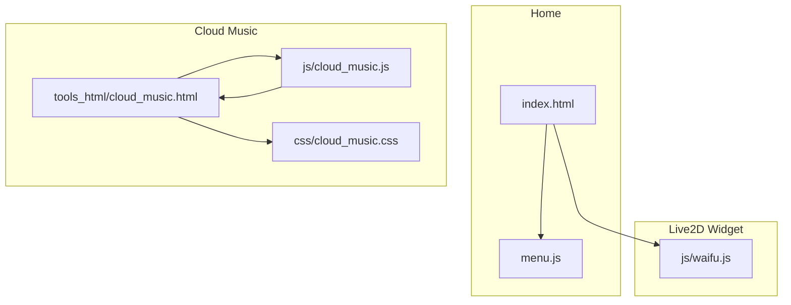
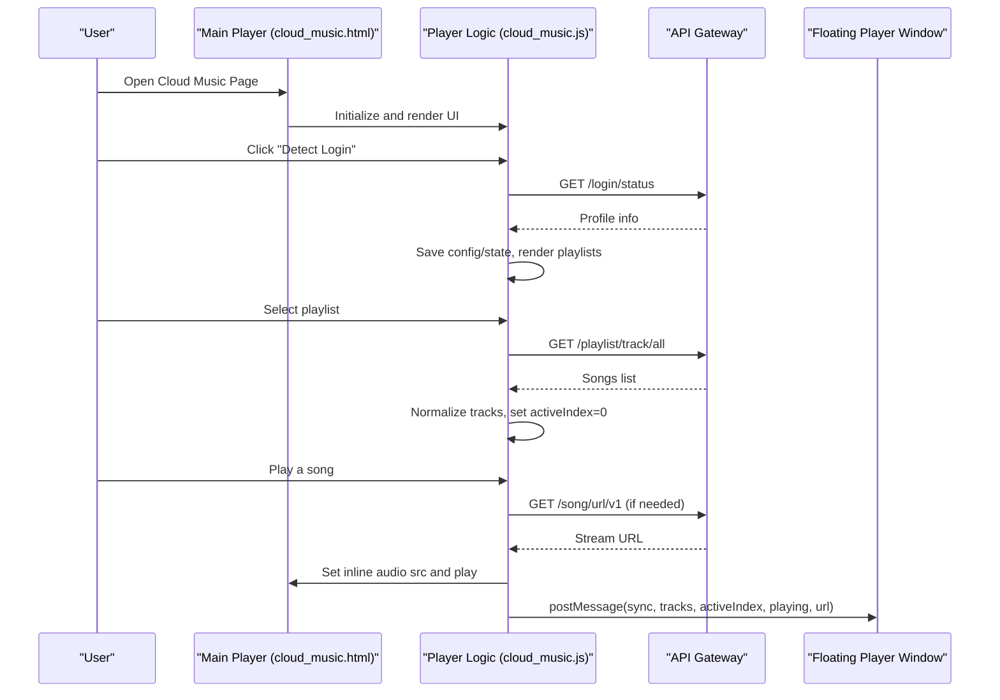
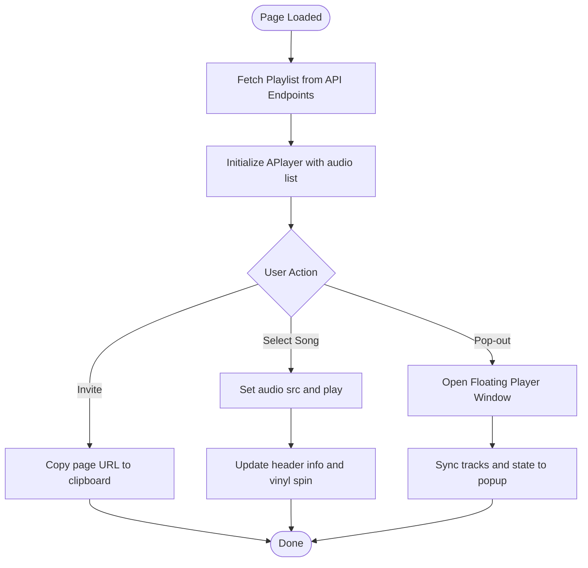
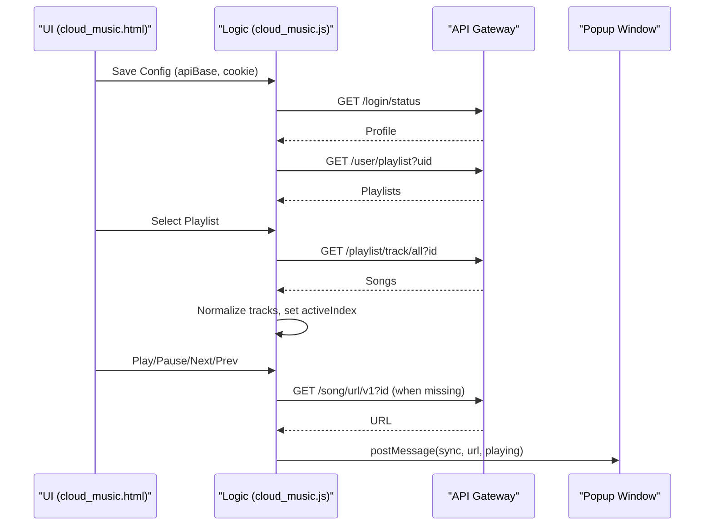
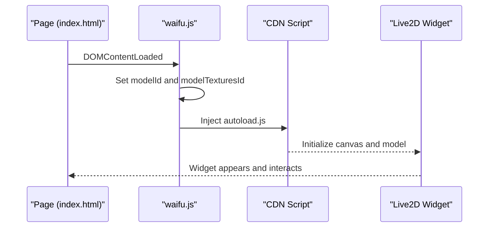
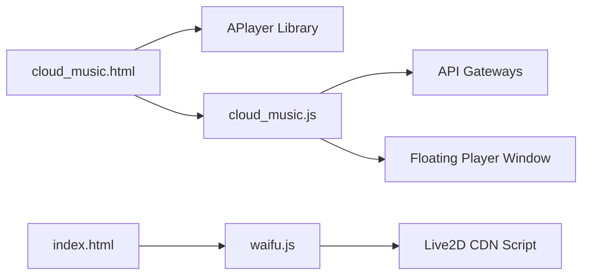

# Entertainment Features

<cite>
**Referenced Files in This Document**
- [cloud_music.html](file://tools_html/cloud_music.html)
- [cloud_music.js](file://js/cloud_music.js)
- [cloud_music.css](file://css/cloud_music.css)
- [waifu.js](file://js/waifu.js)
- [index.html](file://index.html)
- [menu.js](file://js/menu.js)
</cite>

## Table of Contents
1. [Introduction](#introduction)
2. [Project Structure](#project-structure)
3. [Core Components](#core-components)
4. [Architecture Overview](#architecture-overview)
5. [Detailed Component Analysis](#detailed-component-analysis)
6. [Dependency Analysis](#dependency-analysis)
7. [Performance Considerations](#performance-considerations)
8. [Troubleshooting Guide](#troubleshooting-guide)
9. [Conclusion](#conclusion)

## Introduction
This document explains the entertainment features of the project, focusing on:
- Cloud music player with playlist management and optional floating player
- Interactive Live2D waifu widget

It covers music streaming integration, playlist management, audio quality settings, Live2D widget implementation, character interaction mechanics, customization options, browser compatibility, performance considerations, and privacy considerations for external service integrations.

## Project Structure
The entertainment features span two primary areas:
- Cloud Music Player: A dual-interface solution with a main page player and an optional floating player window
- Waifu Widget: An interactive Live2D character loaded via CDN

**Diagram sources**
- [index.html:1-25](file://index.html#L1-L25)
- [menu.js:1-273](file://js/menu.js#L1-L273)
- [cloud_music.html:1-260](file://tools_html/cloud_music.html#L1-L260)
- [cloud_music.js:1-494](file://js/cloud_music.js#L1-L494)
- [cloud_music.css:1-309](file://css/cloud_music.css#L1-L309)
- [waifu.js:1-24](file://js/waifu.js#L1-L24)

**Section sources**
- [index.html:1-25](file://index.html#L1-L25)
- [menu.js:39-41](file://js/menu.js#L39-L41)
- [cloud_music.html:1-260](file://tools_html/cloud_music.html#L1-L260)
- [cloud_music.js:1-494](file://js/cloud_music.js#L1-L494)
- [cloud_music.css:1-309](file://css/cloud_music.css#L1-L309)
- [waifu.js:1-24](file://js/waifu.js#L1-L24)

## Core Components
- Cloud Music Player
  - Main page player built with APlayer for playlist playback and UI
  - Optional floating player window synchronized via postMessage
  - Playlist management via external API gateways
  - Local persistence of configuration and playback state
- Live2D Waifu Widget
  - Dynamically loads a Live2D widget from CDN
  - Randomizes model selection per session
  - Minimal customization exposed via CDN defaults

Key capabilities:
- Supported music services: NetEase Cloud Music via community API gateways
- Playback controls: Play/Pause, Next, Previous, List navigation, Pop-out mini-player
- User engagement: Invite-link sharing, recent-play list, and synchronized floating player
- Privacy: Cookie-based authentication stored locally; external API gateways handle streaming URLs

**Section sources**
- [cloud_music.html:60-255](file://tools_html/cloud_music.html#L60-L255)
- [cloud_music.js:12-494](file://js/cloud_music.js#L12-L494)
- [cloud_music.css:1-309](file://css/cloud_music.css#L1-L309)
- [waifu.js:1-24](file://js/waifu.js#L1-L24)

## Architecture Overview
The cloud music feature integrates three layers:
- Presentation Layer (HTML/CSS): Provides the UI and styling for the player and lists
- Interaction Layer (JavaScript): Handles user actions, API communication, and synchronization
- External Services: Community API gateways for playlist and song metadata, CDN-hosted floating player

**Diagram sources**
- [cloud_music.html:60-255](file://tools_html/cloud_music.html#L60-L255)
- [cloud_music.js:59-256](file://js/cloud_music.js#L59-L256)

## Detailed Component Analysis

### Cloud Music Player (Main Page)
- Integration
  - Uses APlayer for playlist rendering and playback
  - Supports multiple API endpoints with automatic failover
  - Loads a predefined playlist ID by default
- Controls
  - Play/Pause, Next, Previous, List navigation
  - Copy invite link via Clipboard API when secure contexts are available
  - Open external NetEase client link
- UI Elements
  - Vinyl record animation during playback
  - Loading and error states
  - Status bar with operation hints

**Diagram sources**
- [cloud_music.html:123-255](file://tools_html/cloud_music.html#L123-L255)

**Section sources**
- [cloud_music.html:60-255](file://tools_html/cloud_music.html#L60-L255)
- [cloud_music.css:28-105](file://css/cloud_music.css#L28-L105)

### Cloud Music Player (Library/Playlist Manager)
- Integration
  - Connects to a configurable API base and optional cookie
  - Reads user playlists and recent played songs
  - Resolves stream URLs on-demand for playable tracks
- Controls
  - Save configuration, detect login, load recent played
  - Playlist selection and track filtering
  - Inline audio playback with synchronized floating window
- Persistence
  - Stores API base, cookie, active index, and playing state in localStorage

**Diagram sources**
- [cloud_music.js:59-256](file://js/cloud_music.js#L59-L256)

**Section sources**
- [cloud_music.js:12-494](file://js/cloud_music.js#L12-L494)

### Live2D Waifu Widget
- Implementation
  - Dynamically injects the Live2D autoload script from CDN
  - Sets random model and texture IDs in localStorage to vary appearance
  - No custom DOM creation; widget manages its own canvas and interactions
- Interaction Mechanics
  - Widget responds to clicks and hover interactions typical of Live2D
  - Model selection randomized per page load
- Customization Options
  - Limited to CDN-provided model sets and textures
  - No in-page configuration exposed

**Diagram sources**
- [waifu.js:1-24](file://js/waifu.js#L1-L24)

**Section sources**
- [waifu.js:1-24](file://js/waifu.js#L1-L24)
- [index.html:13-16](file://index.html#L13-L16)

## Dependency Analysis
- Cloud Music Player depends on:
  - APlayer library for playback and list rendering
  - External API gateways for playlist and song metadata
  - Optional floating player window for extended playback
- Live2D Widget depends on:
  - CDN-hosted autoload script for initialization and rendering

**Diagram sources**
- [cloud_music.html:10-11](file://tools_html/cloud_music.html#L10-L11)
- [cloud_music.js:59-256](file://js/cloud_music.js#L59-L256)
- [waifu.js:11-16](file://js/waifu.js#L11-L16)

**Section sources**
- [cloud_music.html:10-11](file://tools_html/cloud_music.html#L10-L11)
- [cloud_music.js:59-256](file://js/cloud_music.js#L59-L256)
- [waifu.js:11-16](file://js/waifu.js#L11-L16)

## Performance Considerations
- Cloud Music Player
  - Preload setting is configured to improve perceived responsiveness
  - Floating player minimizes UI overhead by delegating playback to a separate window
  - Track URL resolution occurs only when necessary to reduce network calls
- Live2D Widget
  - Canvas-based rendering; performance depends on device capabilities
  - Randomized model selection avoids repetitive appearances but does not alter performance characteristics significantly
- General Recommendations
  - Prefer modern browsers with strong Web Audio and Canvas support
  - Close unnecessary tabs to free memory when handling large playlists
  - Use the floating player to keep playback running while navigating other pages

[No sources needed since this section provides general guidance]

## Troubleshooting Guide
- Cloud Music Player
  - Login detection fails: Verify API base URL and cookie values; ensure cookie includes required identifiers
  - Playlist empty or not loading: Confirm account has playlists and API gateway availability
  - Song URL unavailable: Some tracks may require premium or are region-locked; the system surfaces a descriptive error
  - Floating player not opening: Allow pop-ups; the system detects closed windows and updates UI accordingly
  - Invite link copy fails: Occurs when Clipboard API is unavailable or not in a secure context; falls back to a manual method
- Live2D Widget
  - Widget fails to load: CDN script error is logged; retry after ensuring network connectivity

**Section sources**
- [cloud_music.js:95-116](file://js/cloud_music.js#L95-L116)
- [cloud_music.js:118-126](file://js/cloud_music.js#L118-L126)
- [cloud_music.js:178-185](file://js/cloud_music.js#L178-L185)
- [cloud_music.js:196-227](file://js/cloud_music.js#L196-L227)
- [cloud_music.js:229-256](file://js/cloud_music.js#L229-L256)
- [cloud_music.js:230-236](file://js/cloud_music.js#L230-L236)
- [cloud_music.html:228-248](file://tools_html/cloud_music.html#L228-L248)
- [waifu.js:13-16](file://js/waifu.js#L13-L16)

## Conclusion
The entertainment features combine a robust cloud music player with flexible playlist management and a lightweight Live2D waifu widget. The cloud music player integrates with community API gateways to deliver playlist and playback functionality, supports a floating player window, and offers user-friendly controls and sharing features. The Live2D widget enhances the user experience with minimal configuration. Both components emphasize simplicity, extensibility, and compatibility across modern browsers.

[No sources needed since this section summarizes without analyzing specific files]