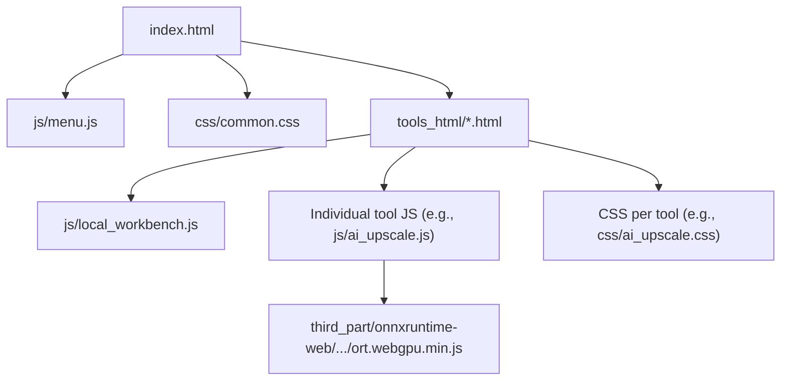
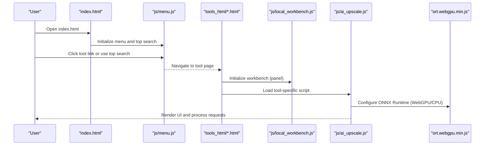
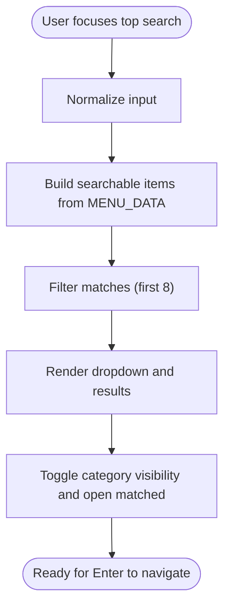
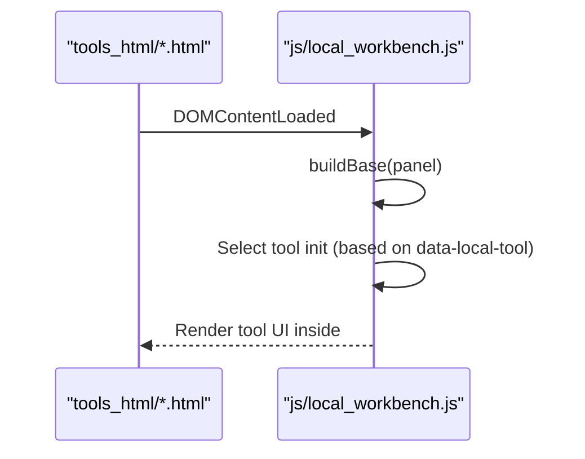
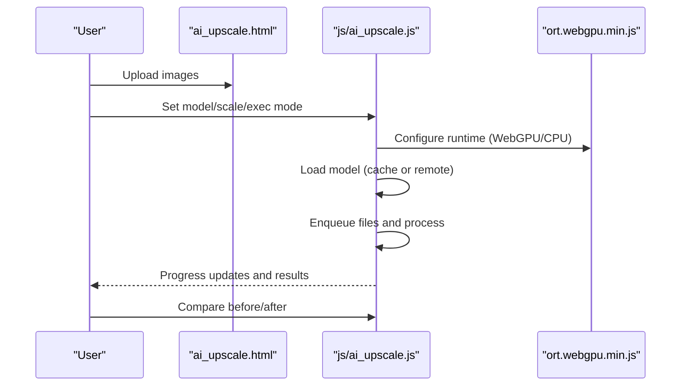
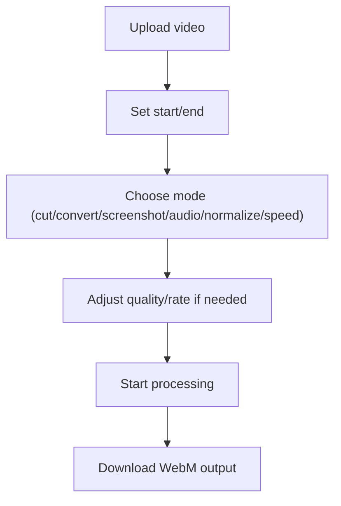
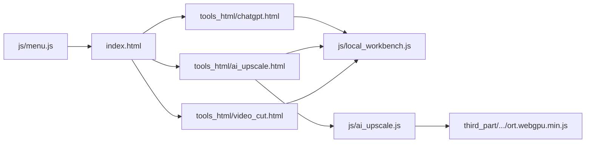

# Getting Started

<cite>
**Referenced Files in This Document**
- [index.html](file://index.html)
- [menu.js](file://js/menu.js)
- [common.css](file://css/common.css)
- [tokens.json](file://tokens.json)
- [chatgpt.html](file://tools_html/chatgpt.html)
- [ai_upscale.html](file://tools_html/ai_upscale.html)
- [video_cut.html](file://tools_html/video_cut.html)
- [local_workbench.js](file://js/local_workbench.js)
- [ai_upscale.js](file://js/ai_upscale.js)
- [README.md](file://models/README.md)
- [视频剪辑工具使用说明.md](file://doc/视频剪辑工具使用说明.md)
- [ort.webgpu.min.js](file://third_part/onnxruntime-web/1.17.1/ort.webgpu.min.js)
</cite>

## Table of Contents
1. [Introduction](#introduction)
2. [Project Structure](#project-structure)
3. [Core Components](#core-components)
4. [Architecture Overview](#architecture-overview)
5. [Detailed Component Analysis](#detailed-component-analysis)
6. [Dependency Analysis](#dependency-analysis)
7. [Performance Considerations](#performance-considerations)
8. [Troubleshooting Guide](#troubleshooting-guide)
9. [Conclusion](#conclusion)
10. [Appendices](#appendices)

## Introduction
Welcome to TAWEBTOOL, a collection of browser-native creative and productivity utilities. This guide helps you quickly install locally, navigate the interface, search for tools, upload files, configure AI tools, export results, and troubleshoot common issues. It also covers security considerations for API tokens and local file handling.

## Project Structure
At a high level, TAWEBTOOL consists of:
- A central index page that loads the global menu and top search bar
- A left sidebar menu that organizes tools by category
- A top search bar that filters tools and categories
- Tool pages under tools_html/ that embed their own scripts and styles
- Shared JavaScript for menu/search and local workbench integration
- CSS for layout and styling
- Optional AI model cache and third-party libraries for AI acceleration

**Diagram sources**
- [index.html:1-25](file://index.html#L1-L25)
- [menu.js:1-273](file://js/menu.js#L1-L273)
- [common.css:1-386](file://css/common.css#L1-L386)
- [ai_upscale.html:1-167](file://tools_html/ai_upscale.html#L1-L167)
- [local_workbench.js:1-197](file://js/local_workbench.js#L1-L197)
- [ai_upscale.js:1-200](file://js/ai_upscale.js#L1-L200)
- [ort.webgpu.min.js:1-12](file://third_part/onnxruntime-web/1.17.1/ort.webgpu.min.js#L1-L12)

**Section sources**
- [index.html:1-25](file://index.html#L1-L25)
- [menu.js:1-273](file://js/menu.js#L1-L273)
- [common.css:1-386](file://css/common.css#L1-L386)

## Core Components
- Global menu and search
  - The left sidebar menu is built from a single source of truth and supports filtering and accordion behavior.
  - The top search bar searches both categories and tool names/keywords and opens results on Enter.
- Local workbench integration
  - Tools under tools_html/ use a shared workbench loader that mounts tool-specific UI inside a panel element.
- AI tools
  - Tools like AI upscale rely on ONNX Runtime with WebGPU/CPU fallback and optional model caching.

**Section sources**
- [menu.js:1-273](file://js/menu.js#L1-L273)
- [local_workbench.js:1-197](file://js/local_workbench.js#L1-L197)

## Architecture Overview
The runtime architecture connects the index page, menu/search, tool pages, and AI acceleration library.

**Diagram sources**
- [index.html:1-25](file://index.html#L1-L25)
- [menu.js:1-273](file://js/menu.js#L1-L273)
- [local_workbench.js:1-197](file://js/local_workbench.js#L1-L197)
- [ai_upscale.js:1-200](file://js/ai_upscale.js#L1-L200)
- [ort.webgpu.min.js:1-12](file://third_part/onnxruntime-web/1.17.1/ort.webgpu.min.js#L1-L12)

## Detailed Component Analysis

### Navigation and Search
- Left sidebar menu
  - Built from a centralized data structure with categories and items.
  - Supports opening/closing categories and filtering items via the top search.
- Top search
  - Normalizes input, builds a searchable dataset, renders suggestions, and toggles category visibility.

**Diagram sources**
- [menu.js:107-266](file://js/menu.js#L107-L266)

**Section sources**
- [menu.js:1-273](file://js/menu.js#L1-L273)
- [common.css:316-386](file://css/common.css#L316-L386)

### Local Workbench and Tool Pages
- Tool pages embed a panel element and rely on the local workbench to mount tool UI.
- The workbench initializes the tool shell and delegates to tool-specific initialization functions.

**Diagram sources**
- [chatgpt.html:1-31](file://tools_html/chatgpt.html#L1-L31)
- [video_cut.html:1-28](file://tools_html/video_cut.html#L1-L28)
- [local_workbench.js:1-197](file://js/local_workbench.js#L1-L197)

**Section sources**
- [chatgpt.html:1-31](file://tools_html/chatgpt.html#L1-L31)
- [video_cut.html:1-28](file://tools_html/video_cut.html#L1-L28)
- [local_workbench.js:1-197](file://js/local_workbench.js#L1-L197)

### AI Upscaling Workflow
- Upload images via drag-and-drop or file picker
- Choose model, scale, execution mode (WebGPU/CPU), output mode (download/ZIP/folder)
- Optionally select a folder for saving (requires modern browsers)
- Process queue and compare results with slider

**Diagram sources**
- [ai_upscale.html:1-167](file://tools_html/ai_upscale.html#L1-L167)
- [ai_upscale.js:1-200](file://js/ai_upscale.js#L1-L200)
- [ort.webgpu.min.js:1-12](file://third_part/onnxruntime-web/1.17.1/ort.webgpu.min.js#L1-L12)

**Section sources**
- [ai_upscale.html:1-167](file://tools_html/ai_upscale.html#L1-L167)
- [ai_upscale.js:1-200](file://js/ai_upscale.js#L1-L200)
- [README.md:1-24](file://models/README.md#L1-L24)

### Video Cutting Workflow
- Upload a video, set start/end times, choose processing mode (cut/convert/screenshot/audio/normalize/speed)
- Uses browser-native APIs (MediaRecorder, Canvas, WebAudio) for local processing
- Outputs WebM by default; performance varies by device and browser

**Diagram sources**
- [video_cut.html:1-28](file://tools_html/video_cut.html#L1-L28)
- [视频剪辑工具使用说明.md:1-299](file://doc/视频剪辑工具使用说明.md#L1-L299)

**Section sources**
- [video_cut.html:1-28](file://tools_html/video_cut.html#L1-L28)
- [视频剪辑工具使用说明.md:1-299](file://doc/视频剪辑工具使用说明.md#L1-L299)

## Dependency Analysis
- Menu and search depend on a single data source and DOM manipulation
- Tool pages depend on the local workbench for mounting UI
- AI tools depend on ONNX Runtime and optionally model caches
- Video tools depend on browser-native APIs

**Diagram sources**
- [menu.js:1-273](file://js/menu.js#L1-L273)
- [index.html:1-25](file://index.html#L1-L25)
- [chatgpt.html:1-31](file://tools_html/chatgpt.html#L1-L31)
- [ai_upscale.html:1-167](file://tools_html/ai_upscale.html#L1-L167)
- [video_cut.html:1-28](file://tools_html/video_cut.html#L1-L28)
- [local_workbench.js:1-197](file://js/local_workbench.js#L1-L197)
- [ai_upscale.js:1-200](file://js/ai_upscale.js#L1-L200)
- [ort.webgpu.min.js:1-12](file://third_part/onnxruntime-web/1.17.1/ort.webgpu.min.js#L1-L12)

**Section sources**
- [menu.js:1-273](file://js/menu.js#L1-L273)
- [local_workbench.js:1-197](file://js/local_workbench.js#L1-L197)

## Performance Considerations
- AI upscaling
  - Prefer WebGPU when available; otherwise CPU mode will be used automatically
  - Disable graph optimizations for WebGPU to avoid compatibility issues
  - Use appropriate model scale and output modes to balance speed and quality
- Video cutting
  - Processing speed equals real-time playback; reduce time ranges and adjust bitrate for faster results
  - Use modern browsers for best performance

[No sources needed since this section provides general guidance]

## Troubleshooting Guide
- Browser compatibility
  - AI upscaling requires WebGPU-capable browsers; if unavailable, CPU mode is used automatically
  - Video cutting relies on MediaRecorder, Canvas, and WebAudio APIs; ensure modern browsers
- Model loading
  - AI tools may fail to load models from remote URLs; place models under the models/ directory and serve them from your web server
- File saving
  - Folder output requires showDirectoryPicker; use Chrome/Edge for this feature
- API tokens
  - Tokens.json contains service tokens; treat them as secrets and restrict access to your local environment

**Section sources**
- [ai_upscale.js:422-446](file://js/ai_upscale.js#L422-L446)
- [README.md:1-24](file://models/README.md#L1-L24)
- [视频剪辑工具使用说明.md:170-189](file://doc/视频剪辑工具使用说明.md#L170-L189)
- [tokens.json:1-5](file://tokens.json#L1-L5)

## Conclusion
You now have the essentials to install TAWEBTOOL locally, navigate the menu and search, upload files, configure AI tools, and export results. Use the troubleshooting tips to address common issues and follow security best practices for tokens and local files.

## Appendices

### Prerequisites
- Modern browser with WebGPU support for AI tools; CPU fallback available
- Optional: Place AI models under models/ and serve them from your web server for offline use

**Section sources**
- [README.md:1-24](file://models/README.md#L1-L24)

### Installation and Setup
- Clone or download the repository
- Open index.html in your browser
- Optional: Host the models/ directory on your web server for reliable model loading

**Section sources**
- [index.html:1-25](file://index.html#L1-L25)
- [README.md:16-24](file://models/README.md#L16-L24)

### Basic Usage Patterns
- Use the top search bar to filter tools by name or category
- Click a tool link in the left sidebar to open its page
- For AI tools, choose model, scale, and execution mode; upload images and process
- For video tools, upload a video, set time range, and start processing

**Section sources**
- [menu.js:107-266](file://js/menu.js#L107-L266)
- [ai_upscale.html:1-167](file://tools_html/ai_upscale.html#L1-L167)
- [video_cut.html:1-28](file://tools_html/video_cut.html#L1-L28)

### Step-by-Step Workflows

#### Upload and Process Images with AI Upscaling
1. Open the AI upscale tool page
2. Drag or select images to upload
3. Choose model and scale
4. Select execution mode (WebGPU recommended)
5. Choose output mode (download/ZIP/folder)
6. Start processing and compare results

**Section sources**
- [ai_upscale.html:1-167](file://tools_html/ai_upscale.html#L1-L167)
- [ai_upscale.js:422-446](file://js/ai_upscale.js#L422-L446)

#### Configure and Use ChatGPT Assistant
1. Open the ChatGPT tool page
2. Use quick prompts or type your message
3. Send and review responses; history persists locally

**Section sources**
- [chatgpt.html:1-31](file://tools_html/chatgpt.html#L1-L31)
- [local_workbench.js:147-161](file://js/local_workbench.js#L147-L161)

#### Cut or Convert Videos
1. Open the video cutting tool page
2. Upload a video
3. Set start and end times
4. Choose processing mode (cut/convert/screenshot/audio/normalize/speed)
5. Adjust quality/rate if needed
6. Start processing and download the WebM output

**Section sources**
- [video_cut.html:1-28](file://tools_html/video_cut.html#L1-L28)
- [视频剪辑工具使用说明.md:23-167](file://doc/视频剪辑工具使用说明.md#L23-L167)

### Security Considerations
- Treat tokens.json as sensitive; restrict file system access to your local environment
- Keep models/ private and served from trusted locations
- Avoid exposing local ports or directories publicly

**Section sources**
- [tokens.json:1-5](file://tokens.json#L1-L5)
- [README.md:16-24](file://models/README.md#L16-L24)