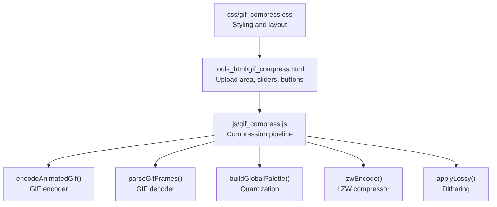
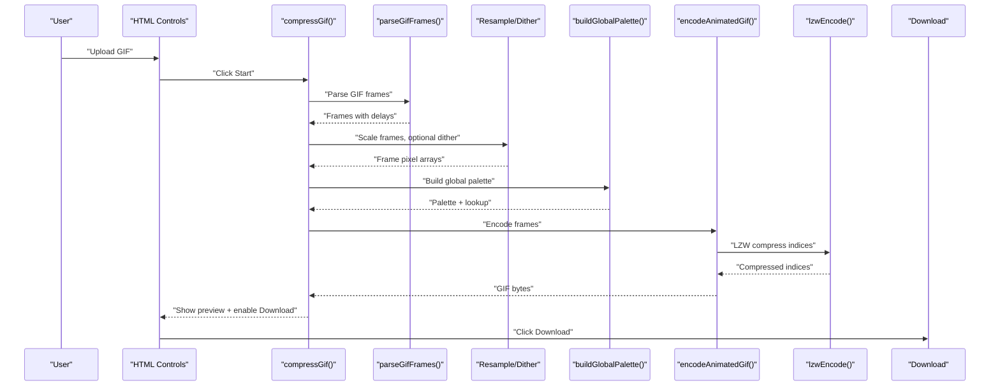
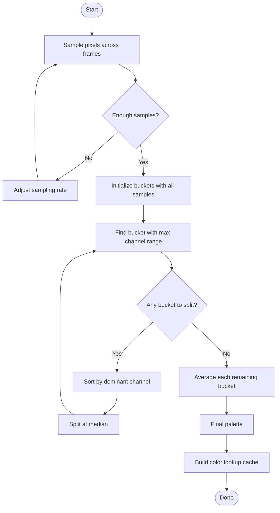
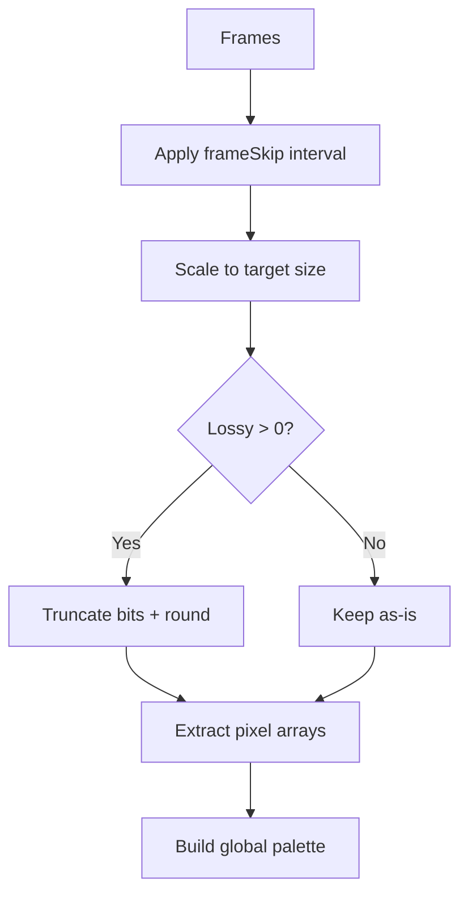
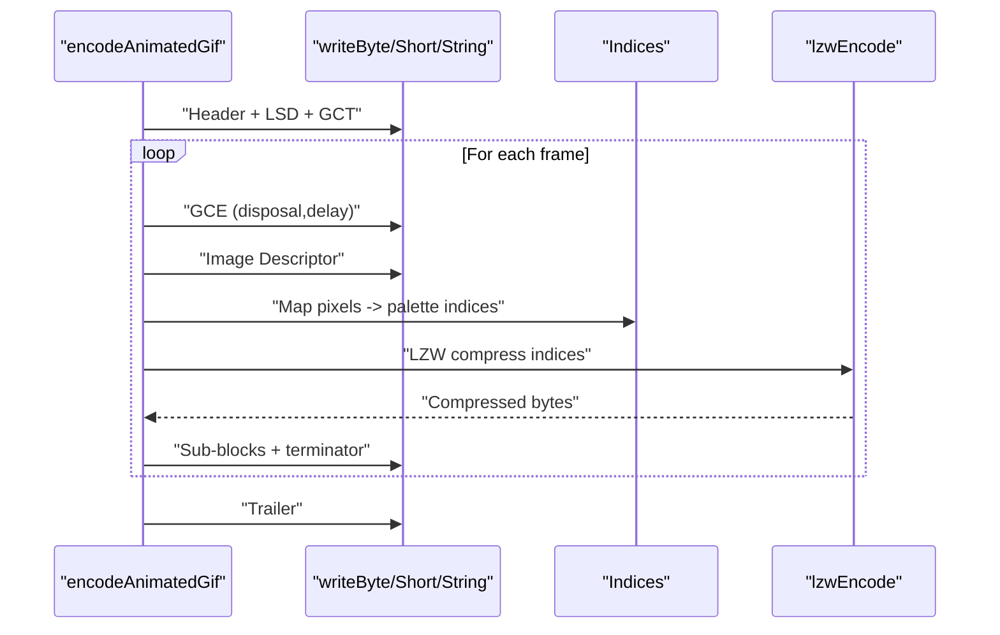
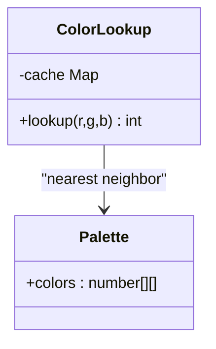
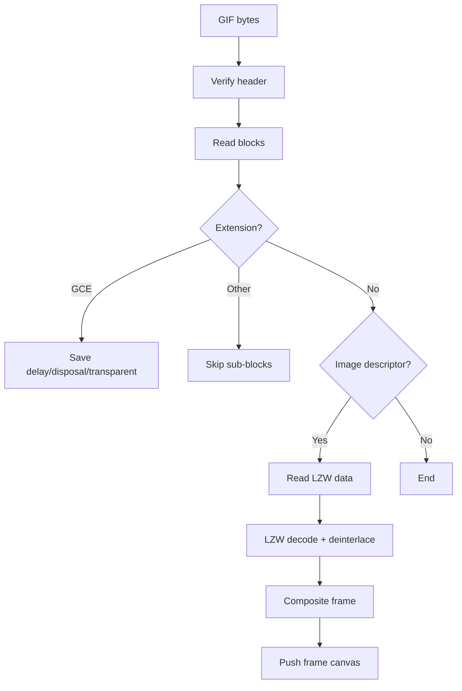
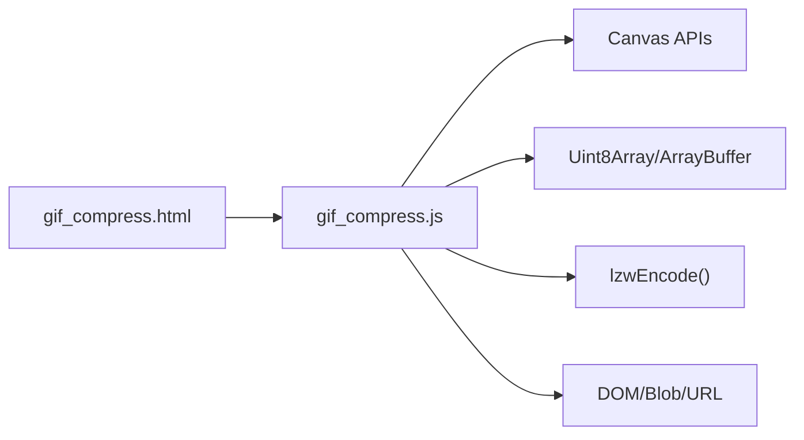

# GIF Compression

<cite>
**Referenced Files in This Document**
- [gif_compress.js](file://js/gif_compress.js)
- [gif_compress.html](file://tools_html/gif_compress.html)
- [gif_compress.css](file://css/gif_compress.css)
</cite>

## Table of Contents
1. [Introduction](#introduction)
2. [Project Structure](#project-structure)
3. [Core Components](#core-components)
4. [Architecture Overview](#architecture-overview)
5. [Detailed Component Analysis](#detailed-component-analysis)
6. [Dependency Analysis](#dependency-analysis)
7. [Performance Considerations](#performance-considerations)
8. [Troubleshooting Guide](#troubleshooting-guide)
9. [Conclusion](#conclusion)
10. [Appendices](#appendices)

## Introduction
This document explains the GIF compression tool’s animation optimization techniques implemented in JavaScript. It focuses on palette reduction, frame sampling/skipping, and temporal compression strategies used to reduce file size while preserving visual quality. It also documents the quantization process, dithering options, and color mapping techniques. Practical workflows and parameter selection guidelines are provided for different animation types, along with performance considerations for large animated sequences and export settings for web optimization.

## Project Structure
The GIF compression tool is organized into a small set of cohesive modules:
- HTML interface for user controls and previews
- CSS for styling and responsive layout
- JavaScript core that performs parsing, quantization, encoding, and export

**Diagram sources**
- [gif_compress.html:21-104](file://tools_html/gif_compress.html#L21-L104)
- [gif_compress.js:100-198](file://js/gif_compress.js#L100-L198)
- [gif_compress.js:202-292](file://js/gif_compress.js#L202-L292)
- [gif_compress.js:473-621](file://js/gif_compress.js#L473-L621)
- [gif_compress.js:368-426](file://js/gif_compress.js#L368-L426)
- [gif_compress.js:296-364](file://js/gif_compress.js#L296-L364)
- [gif_compress.js:726-737](file://js/gif_compress.js#L726-L737)

**Section sources**
- [gif_compress.html:1-111](file://tools_html/gif_compress.html#L1-L111)
- [gif_compress.css:1-328](file://css/gif_compress.css#L1-L328)

## Core Components
- User interface and controls: scaling, color count, frame skip, and lossy compression level
- GIF parser: extracts frames, delays, disposal, and color tables
- Frame preprocessing: resampling, optional dithering
- Palette reduction: global color palette built from sampled pixels
- GIF encoder: writes logical screen descriptor, global color table, frames, and LZW-compressed indices
- LZW encoder: variable-length code compression with dynamic code size growth
- Export: downloads the resulting GIF blob

Key implementation references:
- Compression flow and controls: [compressGif:100-198](file://js/gif_compress.js#L100-L198)
- GIF encoder: [encodeAnimatedGif:202-292](file://js/gif_compress.js#L202-L292)
- GIF parser: [parseGifFrames:473-621](file://js/gif_compress.js#L473-L621)
- Palette reduction: [buildGlobalPalette:368-388](file://js/gif_compress.js#L368-L388), [medianCut:390-426](file://js/gif_compress.js#L390-L426)
- Color lookup: [buildColorLookup:451-469](file://js/gif_compress.js#L451-L469)
- LZW encoder: [lzwEncode:296-364](file://js/gif_compress.js#L296-L364)
- Dithering: [applyLossy:726-737](file://js/gif_compress.js#L726-L737)

**Section sources**
- [gif_compress.js:100-198](file://js/gif_compress.js#L100-L198)
- [gif_compress.js:202-292](file://js/gif_compress.js#L202-L292)
- [gif_compress.js:368-469](file://js/gif_compress.js#L368-L469)
- [gif_compress.js:296-364](file://js/gif_compress.js#L296-L364)
- [gif_compress.js:726-737](file://js/gif_compress.js#L726-L737)

## Architecture Overview
The tool follows a pipeline:
1. Load and parse the input GIF into frames
2. Optionally downscale frames and apply dithering
3. Sample pixels across frames to build a global palette
4. Map each pixel to the nearest palette index
5. Encode frames with LZW and write GIF blocks
6. Provide preview and download

**Diagram sources**
- [gif_compress.js:100-198](file://js/gif_compress.js#L100-L198)
- [gif_compress.js:473-621](file://js/gif_compress.js#L473-L621)
- [gif_compress.js:368-426](file://js/gif_compress.js#L368-L426)
- [gif_compress.js:202-292](file://js/gif_compress.js#L202-L292)
- [gif_compress.js:296-364](file://js/gif_compress.js#L296-L364)

## Detailed Component Analysis

### Palette Reduction and Quantization
- Sampling strategy: To keep memory and compute bounded, the tool samples pixels across all frames at a controlled rate proportional to total pixel count. This reduces the dataset for palette building while capturing color distribution across the animation.
- Median cut algorithm: The palette is computed by recursively splitting color buckets along the dominant channel until the target size is reached. Each bucket’s representative color is the mean of its members.
- Lookup optimization: A fast color lookup function caches 15-bit keys (quantized by 3-bit steps per channel) to quickly find the nearest palette index using Euclidean distance.

**Diagram sources**
- [gif_compress.js:368-426](file://js/gif_compress.js#L368-L426)
- [gif_compress.js:451-469](file://js/gif_compress.js#L451-L469)

**Section sources**
- [gif_compress.js:368-426](file://js/gif_compress.js#L368-L426)
- [gif_compress.js:451-469](file://js/gif_compress.js#L451-L469)

### Frame Preprocessing and Temporal Compression
- Downscaling: Frames are scaled to a target resolution determined by the user’s scale percentage. This reduces pixel count and palette entropy, aiding compression.
- Dithering: Optional “lossy” mode applies a bit-plane truncation with rounding to reduce color precision. This acts as a mild form of dithering that can reduce color banding while keeping artifacts minimal.
- Frame skipping: Frames are retained at a configurable interval, and their delays are proportionally adjusted to preserve perceived timing.

**Diagram sources**
- [gif_compress.js:119-152](file://js/gif_compress.js#L119-L152)
- [gif_compress.js:133-152](file://js/gif_compress.js#L133-L152)
- [gif_compress.js:726-737](file://js/gif_compress.js#L726-L737)

**Section sources**
- [gif_compress.js:119-152](file://js/gif_compress.js#L119-L152)
- [gif_compress.js:726-737](file://js/gif_compress.js#L726-L737)

### GIF Encoding and LZW Compression
- Header and logical screen descriptor: Writes GIF89a signature, screen dimensions, and global color table size derived from palette length.
- Global color table: Pads palette to a power-of-two size and writes RGB triples.
- Looping extension: Adds a Netscape application extension to loop infinitely.
- Per-frame encoding:
  - Graphic control extension sets disposal and delay.
  - Image descriptor defines frame bounds.
  - Pixel-to-palette mapping produces an index stream.
  - LZW compression encodes indices with dynamic code size growth up to 12 bits.
  - Sub-blocked data is written with 255-byte chunks and a terminator.
- Trailer: Writes GIF terminator byte.

**Diagram sources**
- [gif_compress.js:202-292](file://js/gif_compress.js#L202-L292)
- [gif_compress.js:296-364](file://js/gif_compress.js#L296-L364)

**Section sources**
- [gif_compress.js:202-292](file://js/gif_compress.js#L202-L292)
- [gif_compress.js:296-364](file://js/gif_compress.js#L296-L364)

### Color Mapping and Lookup
- Color lookup uses a 15-bit key cache to accelerate nearest-neighbor assignment. The key bins colors by shifting right by 3 bits per channel, reducing search space while maintaining good accuracy.
- Distance metric is squared Euclidean distance; the first match is selected when distances tie.

**Diagram sources**
- [gif_compress.js:451-469](file://js/gif_compress.js#L451-L469)

**Section sources**
- [gif_compress.js:451-469](file://js/gif_compress.js#L451-L469)

### GIF Parsing and Decompression
- The parser reads GIF blocks, reconstructs frames, and handles disposal methods and transparency.
- It decodes LZW streams, deinterlaces frames if needed, and builds composite canvases for frame extraction.

**Diagram sources**
- [gif_compress.js:473-621](file://js/gif_compress.js#L473-L621)
- [gif_compress.js:623-700](file://js/gif_compress.js#L623-L700)
- [gif_compress.js:702-722](file://js/gif_compress.js#L702-L722)

**Section sources**
- [gif_compress.js:473-621](file://js/gif_compress.js#L473-L621)
- [gif_compress.js:623-700](file://js/gif_compress.js#L623-L700)
- [gif_compress.js:702-722](file://js/gif_compress.js#L702-L722)

## Dependency Analysis
- The compression pipeline depends on:
  - Canvas APIs for resampling and pixel extraction
  - Uint8Array and ArrayBuffer for binary manipulation
  - LZW encoder for variable-length code compression
  - DOM APIs for UI updates and file download

**Diagram sources**
- [gif_compress.html:21-104](file://tools_html/gif_compress.html#L21-L104)
- [gif_compress.js:100-198](file://js/gif_compress.js#L100-L198)
- [gif_compress.js:202-292](file://js/gif_compress.js#L202-L292)

**Section sources**
- [gif_compress.js:100-198](file://js/gif_compress.js#L100-L198)
- [gif_compress.js:202-292](file://js/gif_compress.js#L202-L292)

## Performance Considerations
- Memory usage:
  - Frame pixel arrays grow with width × height × number of frames. Large animations can consume significant memory.
  - Downsampling reduces memory footprint and speeds up palette computation.
  - Sampling rate for palette building scales with total pixels; lowering sampling reduces memory/time but may miss rare colors.
- CPU and responsiveness:
  - The pipeline yields to the UI periodically to prevent blocking. Long operations (parsing, encoding) are segmented with progress updates.
  - LZW encoding and palette building are the heaviest steps; tuning parameters (colors, skip, scale) helps balance speed and quality.
- Web optimization:
  - Use lower color counts and moderate downsampling for web delivery.
  - Prefer frame skipping for low-motion content to reduce file size.
  - Avoid excessive dithering for static or low-motion GIFs to preserve crisp edges.

[No sources needed since this section provides general guidance]

## Troubleshooting Guide
- Invalid GIF file:
  - The parser checks the header and throws an error if it is not a valid GIF.
- Missing color table:
  - If neither local nor global color table is present, decoding fails.
- No frames extracted:
  - If parsing fails to produce frames, an error is thrown.
- Compression failures:
  - Errors during parsing, quantization, or encoding are caught and displayed in the progress UI.

Common remedies:
- Verify the uploaded file is a valid GIF.
- Reduce color count or increase sampling rate if palette looks poor.
- Lower scale or disable dithering if memory pressure occurs.
- Use fewer frames (higher frame skip) for large sequences.

**Section sources**
- [gif_compress.js:477-480](file://js/gif_compress.js#L477-L480)
- [gif_compress.js:552-554](file://js/gif_compress.js#L552-L554)
- [gif_compress.js:619-620](file://js/gif_compress.js#L619-L620)
- [gif_compress.js:192-197](file://js/gif_compress.js#L192-L197)

## Conclusion
The GIF compression tool implements a practical, client-side pipeline that combines frame resampling, optional dithering, global palette quantization, and LZW compression. By tuning scale, color count, frame skip, and dithering, users can achieve substantial size reductions with acceptable visual fidelity. The modular design and progress feedback make it suitable for both simple logos and moderately complex motion graphics.

[No sources needed since this section summarizes without analyzing specific files]

## Appendices

### Parameter Selection Guidelines
- Simple logos and flat designs:
  - Low color count (64–128), moderate downsampling (50–75%), minimal dithering (0–30), frame skip 1–2
- Animated icons and UI elements:
  - Medium colors (128–192), downsampling 50–75%, light dithering (30–60), frame skip 2–3
- Low-motion illustrations:
  - Higher colors (192–256), downsampling 75–100%, moderate dithering (60–120), frame skip 2–4
- Complex motion graphics:
  - Highest colors (200–256), minimal downsampling (75–100%), higher dithering (120–200), frame skip 3–4

[No sources needed since this section provides general guidance]

### Export Settings for Web Optimization
- Prefer GIF89a with looping extension for broad browser support.
- Keep palette size a power of two for efficient LZW encoding.
- Avoid transparency unless necessary; it increases complexity.
- For autoplay on websites, ensure the page does not auto-play media automatically to comply with policies.

[No sources needed since this section provides general guidance]