# HDR Editor

<cite>
**Referenced Files in This Document**
- [hdr_editor.js](file://js/hdr_editor.js)
- [hdr_editor.css](file://css/hdr_editor.css)
- [hdr_editor.html](file://tools_html/hdr_editor.html)
</cite>

## Table of Contents
1. [Introduction](#introduction)
2. [Project Structure](#project-structure)
3. [Core Components](#core-components)
4. [Architecture Overview](#architecture-overview)
5. [Detailed Component Analysis](#detailed-component-analysis)
6. [Dependency Analysis](#dependency-analysis)
7. [Performance Considerations](#performance-considerations)
8. [Troubleshooting Guide](#troubleshooting-guide)
9. [Conclusion](#conclusion)
10. [Appendices](#appendices)

## Introduction
This document describes the high dynamic range (HDR) image editing tool built as a browser-based application. It focuses on the implementation of tone mapping algorithms, HDR-to-LDR conversion techniques, exposure adjustment workflows, the canvas-based HDR processing pipeline, color space transformations, and dynamic range optimization methods. It also covers environment map processing, lighting setup, performance considerations for large HDR files, memory management, export optimization for different display technologies, and professional HDR workflow standards.

## Project Structure
The HDR editor is organized around a modular HTML page, a CSS stylesheet for theming and layout, and a JavaScript module that implements the interactive HDR editing pipeline. The tool integrates Three.js for 3D preview and PMREM generation, and provides real-time canvas-based HDR composition with export capabilities.

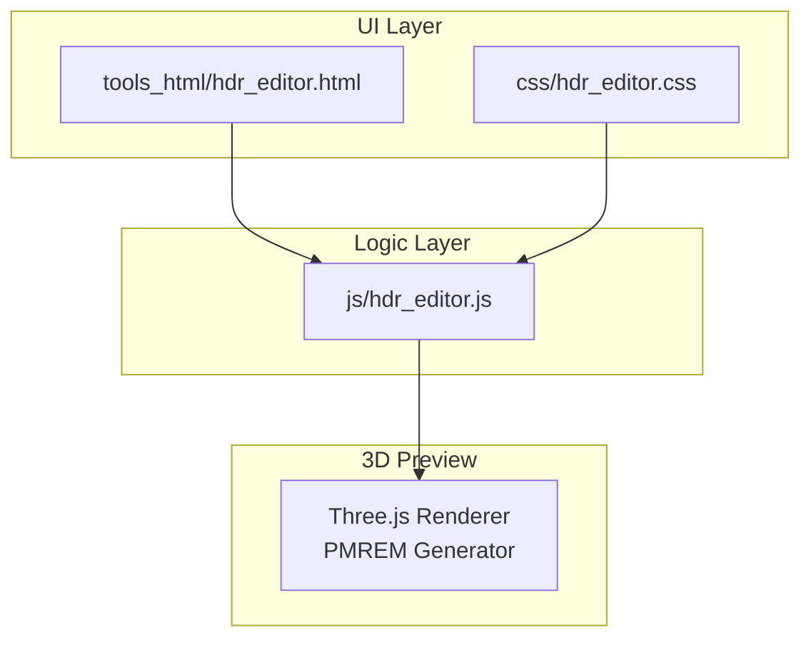

**Diagram sources**
- [hdr_editor.html:1-65](file://tools_html/hdr_editor.html#L1-L65)
- [hdr_editor.css:1-800](file://css/hdr_editor.css#L1-L800)
- [hdr_editor.js:401-430](file://js/hdr_editor.js#L401-L430)

**Section sources**
- [hdr_editor.html:1-65](file://tools_html/hdr_editor.html#L1-L65)
- [hdr_editor.css:1-800](file://css/hdr_editor.css#L1-L800)
- [hdr_editor.js:84-120](file://js/hdr_editor.js#L84-L120)

## Core Components
- Environment modes: Solid color, gradient, background image, and HDR file.
- Canvas-based HDR composition with floating-point buffers and range remapping.
- Real-time HDR adjustments: brightness, contrast, saturation, hue shift, background blur.
- Light sources: circles, rectangles, octagons, rings with configurable falloff and softness.
- Tone mapping controls: ACES, Reinhard, Cineon, neutral, and disabled mapping.
- Exposure control and environment intensity.
- Export pipeline: OpenEXR (float32) and Radiance HDR (RGBE).
- Interactive inspection: pixel inspector and context menu for HDR values.

**Section sources**
- [hdr_editor.js:92-166](file://js/hdr_editor.js#L92-L166)
- [hdr_editor.js:456-471](file://js/hdr_editor.js#L456-L471)
- [hdr_editor.js:1121-1167](file://js/hdr_editor.js#L1121-L1167)
- [hdr_editor.js:1555-1802](file://js/hdr_editor.js#L1555-L1802)

## Architecture Overview
The HDR editor combines a 2D canvas for HDR composition with a 3D preview rendered via Three.js. The canvas maintains a floating-point buffer representing HDR intensities, while the 3D scene uses PMREM-generated environment maps derived from the canvas.

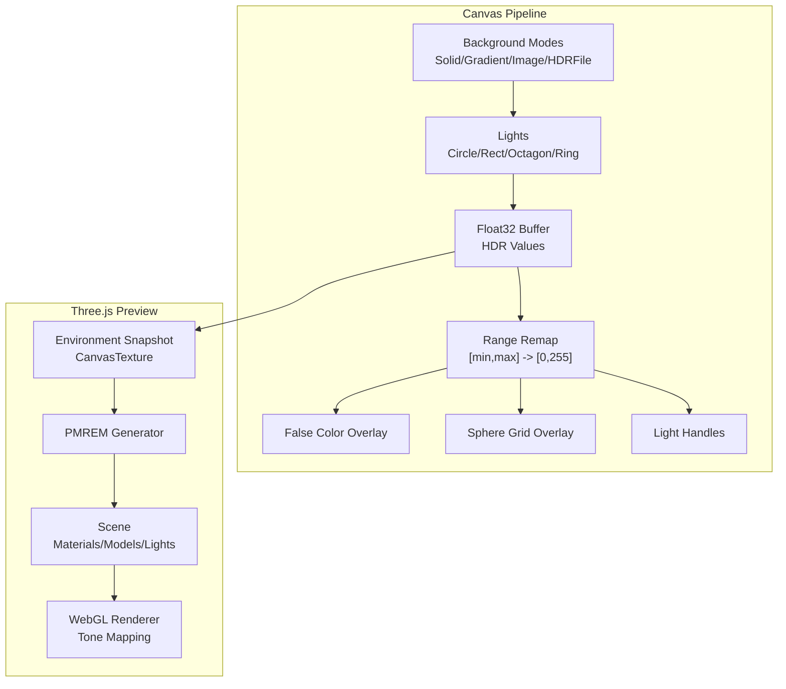

**Diagram sources**
- [hdr_editor.js:1121-1167](file://js/hdr_editor.js#L1121-L1167)
- [hdr_editor.js:1169-1174](file://js/hdr_editor.js#L1169-L1174)
- [hdr_editor.js:424-427](file://js/hdr_editor.js#L424-L427)
- [hdr_editor.js:412-416](file://js/hdr_editor.js#L412-L416)

## Detailed Component Analysis

### Canvas HDR Composition and Range Remapping
The canvas renders environment backgrounds and light shapes into a floating-point buffer. A range remapping pass maps the HDR values to 8-bit for display, enabling visualization of values exceeding 1.0 without clipping.

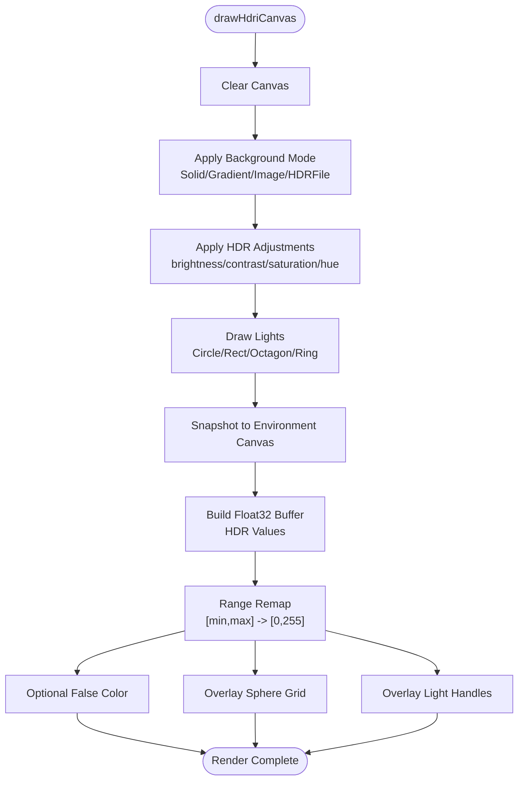

**Diagram sources**
- [hdr_editor.js:1121-1167](file://js/hdr_editor.js#L1121-L1167)
- [hdr_editor.js:1103-1119](file://js/hdr_editor.js#L1103-L1119)

**Section sources**
- [hdr_editor.js:1121-1167](file://js/hdr_editor.js#L1121-L1167)
- [hdr_editor.js:1103-1119](file://js/hdr_editor.js#L1103-L1119)

### Light Shape Rendering and Spherical Projection
Lights are drawn using exact spherical-cap equirectangular projection. The implementation computes angular distances and applies falloff profiles per shape type, supporting wrap-around and precise blending.

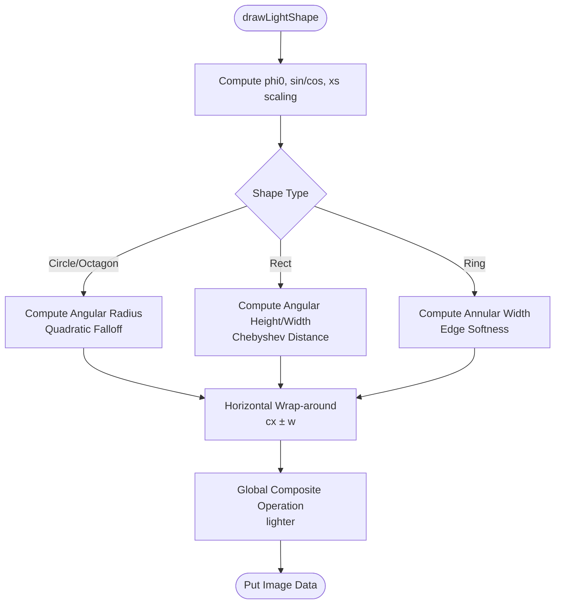

**Diagram sources**
- [hdr_editor.js:599-846](file://js/hdr_editor.js#L599-L846)

**Section sources**
- [hdr_editor.js:599-846](file://js/hdr_editor.js#L599-L846)

### Tone Mapping and Exposure Control
The renderer’s tone mapping and exposure are controlled via parameters. Supported mappings include ACES, Reinhard, Cineon, and neutral/no mapping. Exposure is applied as a power-of-two multiplier.

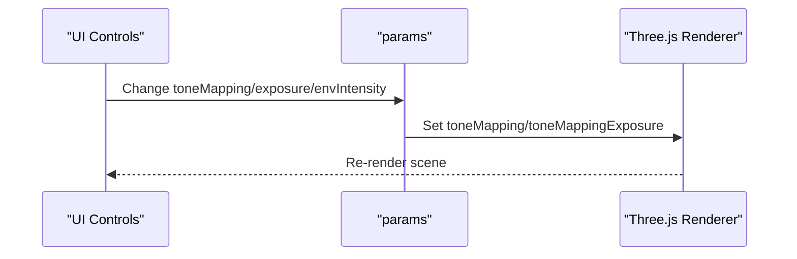

**Diagram sources**
- [hdr_editor.js:1176-1182](file://js/hdr_editor.js#L1176-L1182)
- [hdr_editor.js:450-453](file://js/hdr_editor.js#L450-L453)
- [hdr_editor.js:413-415](file://js/hdr_editor.js#L413-L415)

**Section sources**
- [hdr_editor.js:1176-1182](file://js/hdr_editor.js#L1176-L1182)
- [hdr_editor.js:450-453](file://js/hdr_editor.js#L450-L453)

### HDR-to-LDR Conversion and False Color Visualization
False color overlay maps luminance ranges to distinct colors for quick HDR inspection. Range remapping ensures that values outside [0,1] are still visible by mapping a user-defined range to the display.

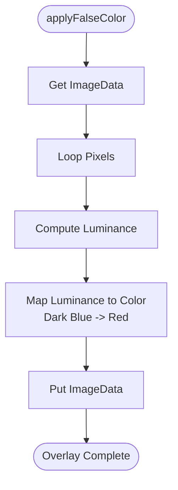

**Diagram sources**
- [hdr_editor.js:943-949](file://js/hdr_editor.js#L943-L949)

**Section sources**
- [hdr_editor.js:943-949](file://js/hdr_editor.js#L943-L949)
- [hdr_editor.js:1103-1119](file://js/hdr_editor.js#L1103-L1119)

### Export Pipeline: OpenEXR and Radiance HDR
The export pipeline constructs a linear HDR buffer from environment and lights, then writes either OpenEXR (float32) or Radiance HDR (RGBE). Exports bypass 8-bit canvas limitations and preserve high dynamic range.

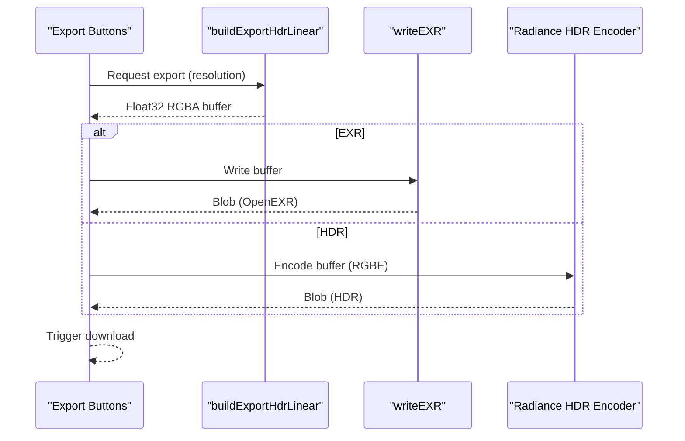

**Diagram sources**
- [hdr_editor.js:1568-1686](file://js/hdr_editor.js#L1568-L1686)
- [hdr_editor.js:1692-1757](file://js/hdr_editor.js#L1692-L1757)
- [hdr_editor.js:1774-1799](file://js/hdr_editor.js#L1774-L1799)

**Section sources**
- [hdr_editor.js:1568-1686](file://js/hdr_editor.js#L1568-L1686)
- [hdr_editor.js:1692-1757](file://js/hdr_editor.js#L1692-L1757)
- [hdr_editor.js:1774-1799](file://js/hdr_editor.js#L1774-L1799)

### Environment Map Processing and PMREM Generation
The environment snapshot is captured from the canvas and converted to an environment map using PMREM. This enables realistic material rendering in the 3D preview.

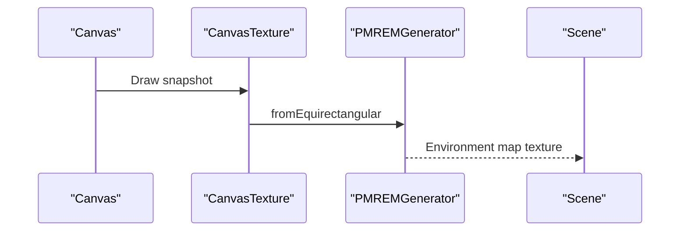

**Diagram sources**
- [hdr_editor.js:1169-1174](file://js/hdr_editor.js#L1169-L1174)
- [hdr_editor.js:424-427](file://js/hdr_editor.js#L424-L427)

**Section sources**
- [hdr_editor.js:1169-1174](file://js/hdr_editor.js#L1169-L1174)
- [hdr_editor.js:424-427](file://js/hdr_editor.js#L424-L427)

### Lighting Setup and Interaction
Lights can be added, duplicated, removed, and edited. They support color or Kelvin temperature, intensity, falloff, and softness. Drag-and-drop and wheel controls adjust position and size. The active light metadata updates in real time.

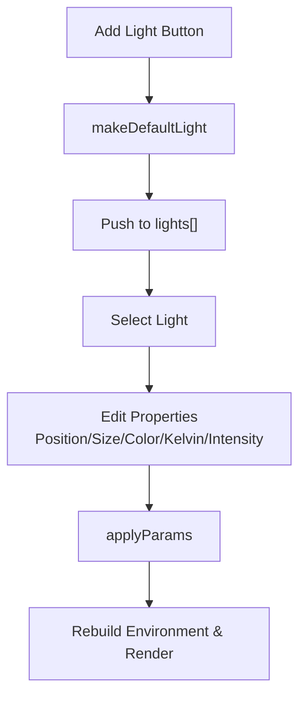

**Diagram sources**
- [hdr_editor.js:1358-1377](file://js/hdr_editor.js#L1358-L1377)
- [hdr_editor.js:1380-1451](file://js/hdr_editor.js#L1380-L1451)
- [hdr_editor.js:1176-1203](file://js/hdr_editor.js#L1176-L1203)

**Section sources**
- [hdr_editor.js:1358-1377](file://js/hdr_editor.js#L1358-L1377)
- [hdr_editor.js:1380-1451](file://js/hdr_editor.js#L1380-L1451)
- [hdr_editor.js:1176-1203](file://js/hdr_editor.js#L1176-L1203)

### Pixel Inspection and HDR Sampling
The pixel inspector reads the current canvas pixel, converts to linear sRGB, and computes the true HDR contribution from all lights at that position. Right-click opens a context menu with detailed values and a copy action.

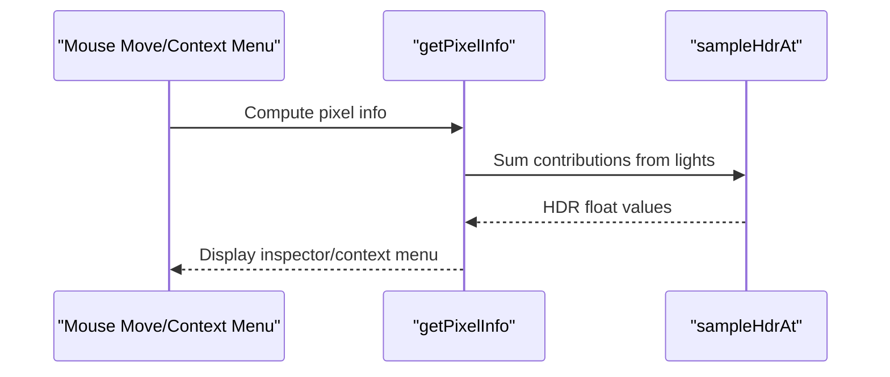

**Diagram sources**
- [hdr_editor.js:1955-1971](file://js/hdr_editor.js#L1955-L1971)
- [hdr_editor.js:1884-1950](file://js/hdr_editor.js#L1884-L1950)
- [hdr_editor.js:1997-2028](file://js/hdr_editor.js#L1997-L2028)

**Section sources**
- [hdr_editor.js:1955-1971](file://js/hdr_editor.js#L1955-L1971)
- [hdr_editor.js:1884-1950](file://js/hdr_editor.js#L1884-L1950)
- [hdr_editor.js:1997-2028](file://js/hdr_editor.js#L1997-L2028)

## Dependency Analysis
The HDR editor depends on Three.js for rendering and PMREM generation, and on browser APIs for canvas manipulation, file loading, and exports. The UI is structured with a left panel for controls and a right-side canvas area for 2D composition and 3D preview.

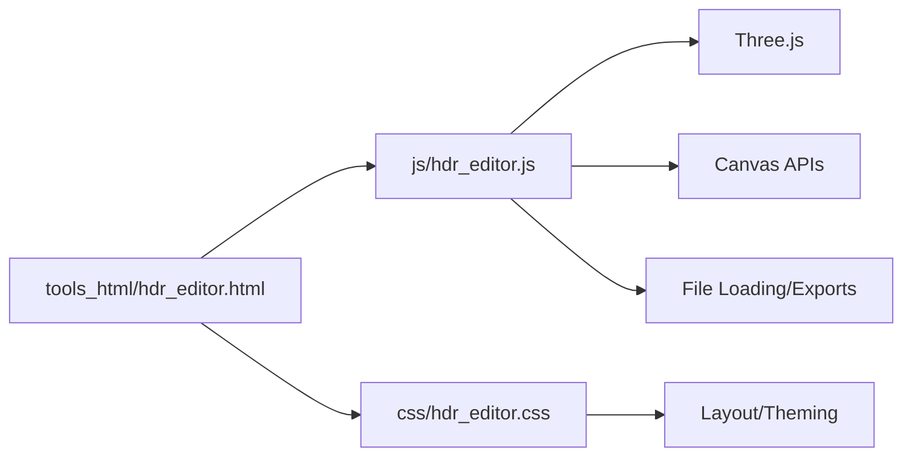

**Diagram sources**
- [hdr_editor.js:37-63](file://js/hdr_editor.js#L37-L63)
- [hdr_editor.html:33-40](file://tools_html/hdr_editor.html#L33-L40)

**Section sources**
- [hdr_editor.js:37-63](file://js/hdr_editor.js#L37-L63)
- [hdr_editor.html:33-40](file://tools_html/hdr_editor.html#L33-L40)

## Performance Considerations
- Floating-point buffer sizing: The HDR float buffer is sized to match the canvas’s physical pixel resolution to avoid interpolation artifacts and maintain sharpness.
- Device pixel ratio handling: The canvas resolution is scaled by device pixel ratio to prevent blurry previews on high-DPI displays.
- Range remapping: Using a dedicated float buffer and applying range remapping avoids repeated conversions and reduces overhead.
- PMREM caching: Environment textures are disposed and regenerated only when needed to manage GPU memory.
- Export pipeline: Exports bypass 8-bit canvas and write directly from float buffers to minimize precision loss.
- Real-time updates: UI changes trigger targeted redraws and re-renders, minimizing unnecessary computations.

[No sources needed since this section provides general guidance]

## Troubleshooting Guide
- Dependency loading failures: If Three.js or loaders fail to load, the tool displays an error message and stops initialization.
- HDR file loading errors: On failure, the tool reports “HDR load failed” and remains functional with other modes.
- Export failures: Try reducing resolution or simplifying lighting setups; ensure sufficient memory for large exports.
- Canvas not updating: Verify that environment mode and canvas size are set appropriately; force a redraw by toggling overlays.
- 3D preview not updating: Confirm that environment snapshot is refreshed and PMREM is rebuilt after changes.

**Section sources**
- [hdr_editor.js:390-399](file://js/hdr_editor.js#L390-L399)
- [hdr_editor.js:1458-1473](file://js/hdr_editor.js#L1458-L1473)
- [hdr_editor.js:1760-1771](file://js/hdr_editor.js#L1760-L1771)

## Conclusion
The HDR editor provides a comprehensive, canvas-centric pipeline for creating and editing HDR environments with precise control over lighting, tone mapping, and exposure. Its export capabilities preserve HDR precision for downstream workflows, while the 3D preview ensures realistic material representation. The modular design and responsive UI enable efficient iteration on professional-grade HDR content.

[No sources needed since this section summarizes without analyzing specific files]

## Appendices

### HDR Workflow Standards and Best Practices
- Use calibrated color spaces (linear sRGB) for intermediate computations.
- Preserve HDR values during editing; convert to LDR only for final output.
- Employ ACES tone mapping for cinematic realism; Reinhard for artistic control.
- Manage dynamic range carefully; use range remapping to visualize high-intensity areas.
- Export in OpenEXR for professional pipelines requiring float precision; use Radiance HDR for legacy compatibility.

[No sources needed since this section provides general guidance]

### Quality Assurance Methods
- Validate HDR values via the pixel inspector and context menu.
- Compare tone-mapped previews under different exposure settings.
- Test with extreme lighting setups to ensure robustness of range remapping.
- Verify environment map generation by inspecting PMREM output in the 3D preview.

[No sources needed since this section provides general guidance]