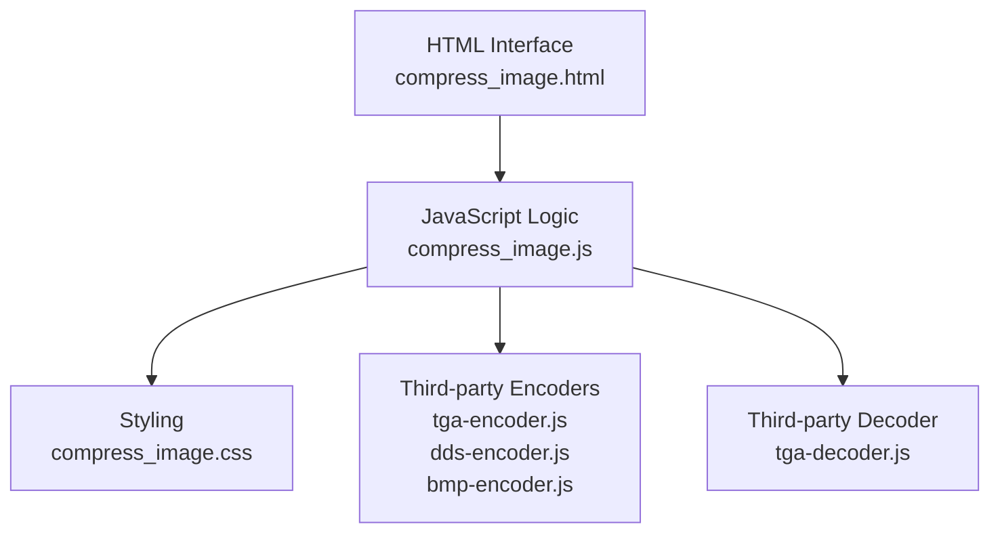
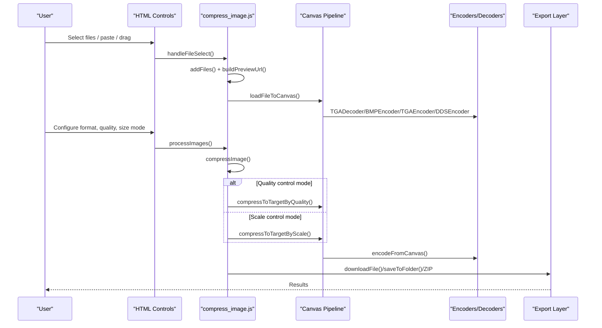
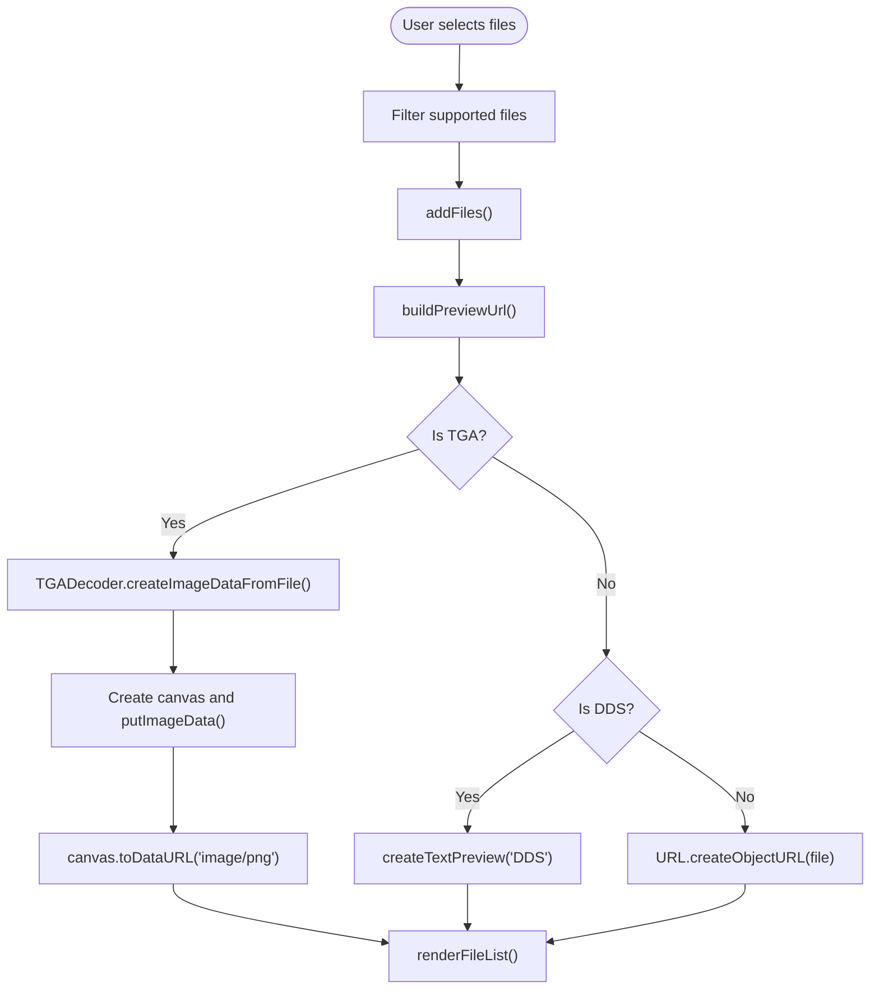
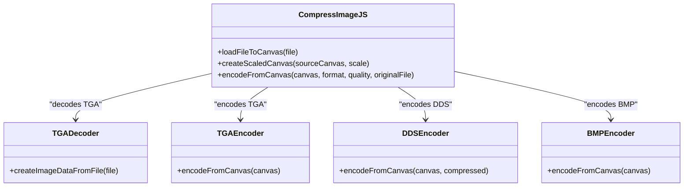
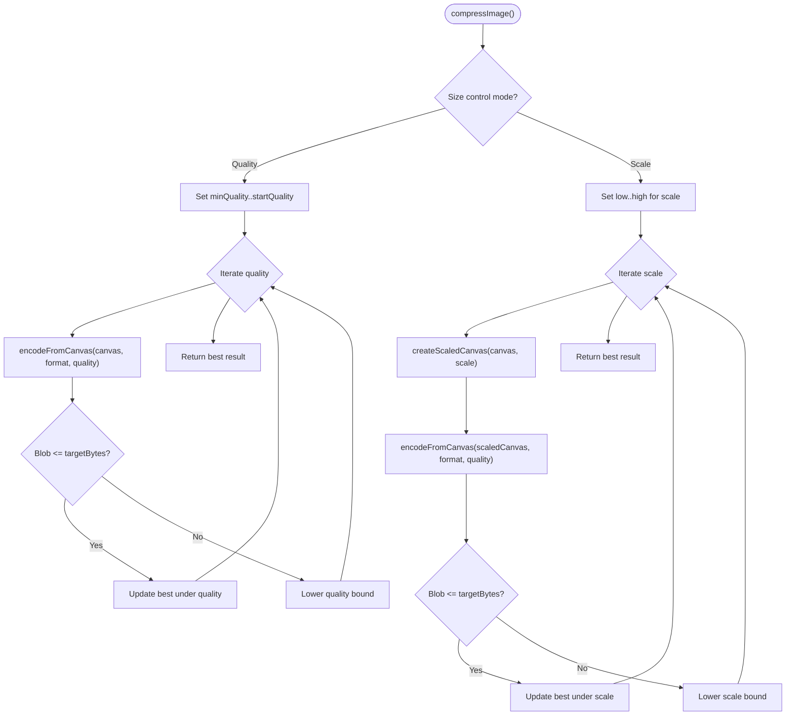
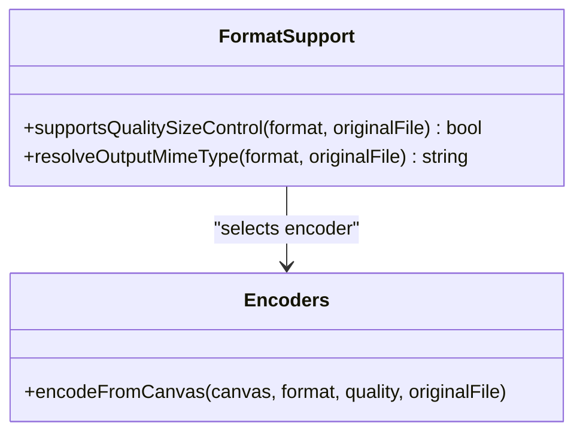
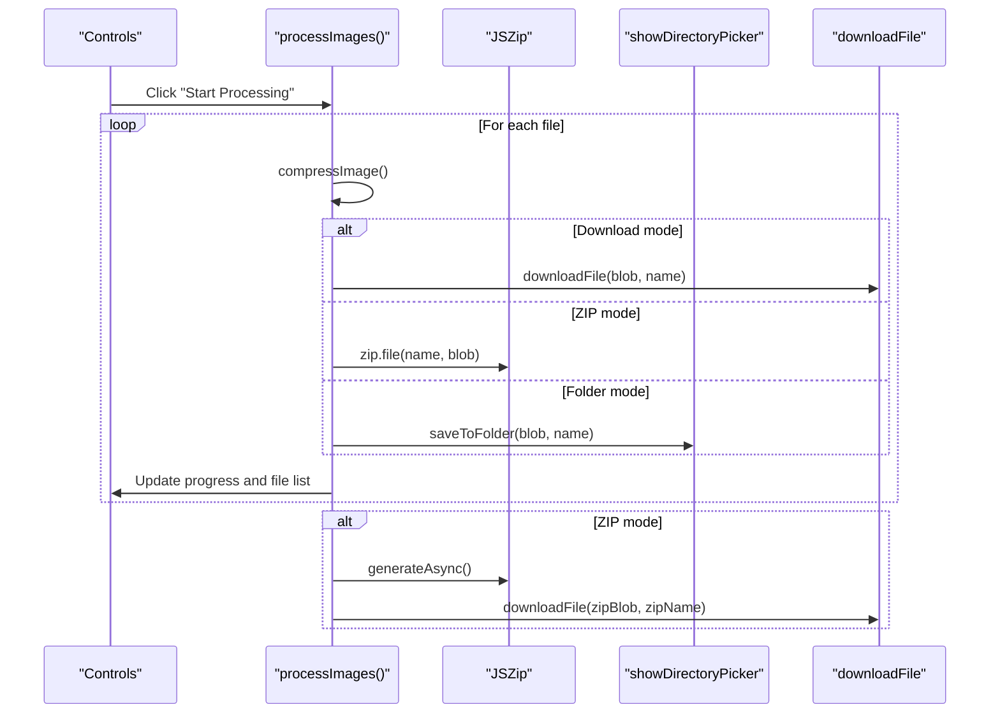
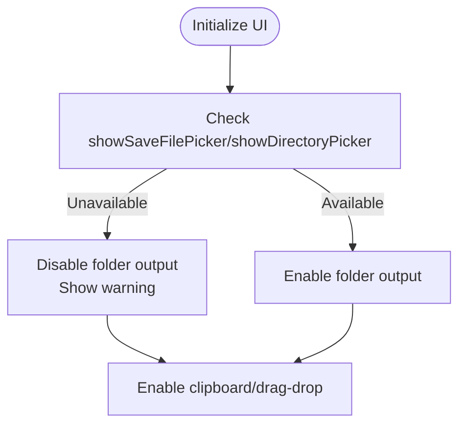
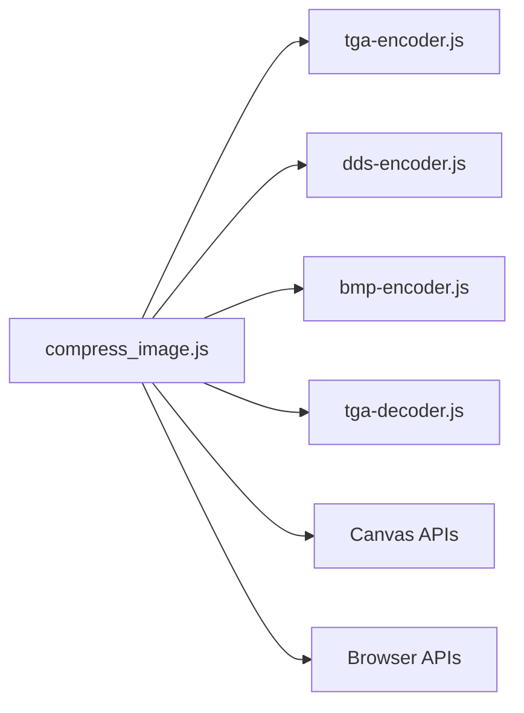

# Image Compression and Format Conversion

<cite>
**Referenced Files in This Document**
- [compress_image.js](file://js/compress_image.js)
- [compress_image.css](file://css/compress_image.css)
- [compress_image.html](file://tools_html/compress_image.html)
- [tga-encoder.js](file://third_part/tga-encoder.js)
- [dds-encoder.js](file://third_part/dds-encoder.js)
- [tga-decoder.js](file://third_part/tga-decoder.js)
- [bmp-encoder.js](file://third_part/bmp-encoder.js)
</cite>

## Table of Contents
1. [Introduction](#introduction)
2. [Project Structure](#project-structure)
3. [Core Components](#core-components)
4. [Architecture Overview](#architecture-overview)
5. [Detailed Component Analysis](#detailed-component-analysis)
6. [Dependency Analysis](#dependency-analysis)
7. [Performance Considerations](#performance-considerations)
8. [Troubleshooting Guide](#troubleshooting-guide)
9. [Conclusion](#conclusion)
10. [Appendices](#appendices)

## Introduction
This document describes the image compression and format conversion tool built as part of the TAWEBTOOL suite. It focuses on the implementation of lossless and lossy compression strategies, supported file formats (JPEG, PNG, WebP, AVIF equivalents via WebP, BMP, TGA, DDS), quality adjustment mechanisms, and the canvas-based image processing pipeline. It also covers progressive loading techniques, memory optimization strategies, batch processing workflows, preset configurations, and export optimization settings. Practical examples illustrate before/after comparisons, quality vs file size trade-offs, and format selection guidelines for different use cases. Browser compatibility considerations and fallback mechanisms for unsupported formats are documented.

## Project Structure
The image compression tool is organized into three primary parts:
- HTML interface for user interaction and controls
- CSS for styling and responsive layout
- JavaScript for core logic, canvas manipulation, and third-party encoder integration

**Diagram sources**
- [compress_image.html:12-134](file://tools_html/compress_image.html#L12-L134)
- [compress_image.js:1-694](file://js/compress_image.js#L1-L694)
- [tga-encoder.js:1-51](file://third_part/tga-encoder.js#L1-L51)
- [dds-encoder.js:1-201](file://third_part/dds-encoder.js#L1-L201)
- [tga-decoder.js:1-132](file://third_part/tga-decoder.js#L1-L132)
- [bmp-encoder.js:1-38](file://third_part/bmp-encoder.js#L1-L38)

**Section sources**
- [compress_image.html:12-134](file://tools_html/compress_image.html#L12-L134)
- [compress_image.css:1-520](file://css/compress_image.css#L1-L520)
- [compress_image.js:1-694](file://js/compress_image.js#L1-L694)

## Core Components
- File selection and drag-and-drop handling
- Preview generation for supported formats
- Canvas-based image processing pipeline
- Quality and target size control modes
- Batch processing with progress feedback
- Output modes: download, ZIP archive, and filesystem folder write-back
- Third-party encoders for TGA, DDS, and BMP
- Browser compatibility checks and fallbacks

Key capabilities:
- Lossless and lossy compression paths depending on output format and control mode
- Target volume enforcement via iterative quality or scaling adjustments
- Progressive rendering of processing progress
- Memory-safe handling of previews and blobs

**Section sources**
- [compress_image.js:26-112](file://js/compress_image.js#L26-L112)
- [compress_image.js:280-368](file://js/compress_image.js#L280-L368)
- [compress_image.js:370-401](file://js/compress_image.js#L370-L401)
- [compress_image.js:447-560](file://js/compress_image.js#L447-L560)
- [compress_image.js:606-644](file://js/compress_image.js#L606-L644)

## Architecture Overview
The tool follows a modular architecture:
- UI layer handles user interactions and displays progress
- Logic layer orchestrates file ingestion, canvas transformations, and encoding
- Encoder/decoder modules encapsulate format-specific compression logic
- Export layer manages downloads, ZIP packaging, and filesystem writes

**Diagram sources**
- [compress_image.js:119-125](file://js/compress_image.js#L119-L125)
- [compress_image.js:156-179](file://js/compress_image.js#L156-L179)
- [compress_image.js:181-205](file://js/compress_image.js#L181-L205)
- [compress_image.js:403-444](file://js/compress_image.js#L403-L444)
- [compress_image.js:280-368](file://js/compress_image.js#L280-L368)
- [compress_image.js:370-401](file://js/compress_image.js#L370-L401)
- [compress_image.js:447-560](file://js/compress_image.js#L447-L560)
- [compress_image.js:606-644](file://js/compress_image.js#L606-L644)

## Detailed Component Analysis

### File Selection and Preview Pipeline
- Supports multiple file inputs, folder uploads, drag-and-drop, and clipboard paste
- Validates supported image types and builds previews for TGA, DDS, and other formats
- Generates previews using canvas for TGA decoding and text placeholders for DDS

**Diagram sources**
- [compress_image.js:119-125](file://js/compress_image.js#L119-L125)
- [compress_image.js:156-179](file://js/compress_image.js#L156-L179)
- [compress_image.js:181-205](file://js/compress_image.js#L181-L205)
- [compress_image.js:230-264](file://js/compress_image.js#L230-L264)
- [tga-decoder.js:112-126](file://third_part/tga-decoder.js#L112-L126)

**Section sources**
- [compress_image.js:26-112](file://js/compress_image.js#L26-L112)
- [compress_image.js:119-179](file://js/compress_image.js#L119-L179)
- [compress_image.js:181-222](file://js/compress_image.js#L181-L222)
- [tga-decoder.js:112-126](file://third_part/tga-decoder.js#L112-L126)

### Canvas-Based Image Processing Pipeline
- Loads images into a canvas for uniform processing
- Applies scaling with high-quality smoothing for downscaling
- Uses format-specific encoders for output

**Diagram sources**
- [compress_image.js:403-444](file://js/compress_image.js#L403-L444)
- [compress_image.js:562-572](file://js/compress_image.js#L562-L572)
- [compress_image.js:606-644](file://js/compress_image.js#L606-L644)
- [tga-decoder.js:112-126](file://third_part/tga-decoder.js#L112-L126)
- [tga-encoder.js:41-45](file://third_part/tga-encoder.js#L41-L45)
- [dds-encoder.js:191-195](file://third_part/dds-encoder.js#L191-L195)
- [bmp-encoder.js:1-38](file://third_part/bmp-encoder.js#L1-L38)

**Section sources**
- [compress_image.js:403-444](file://js/compress_image.js#L403-L444)
- [compress_image.js:562-572](file://js/compress_image.js#L562-L572)
- [compress_image.js:606-644](file://js/compress_image.js#L606-L644)
- [tga-encoder.js:41-45](file://third_part/tga-encoder.js#L41-L45)
- [dds-encoder.js:191-195](file://third_part/dds-encoder.js#L191-L195)
- [bmp-encoder.js:1-38](file://third_part/bmp-encoder.js#L1-L38)

### Quality Adjustment Mechanisms and Target Volume Control
- Two control modes:
  - Quality mode: iteratively adjusts quality until target size is met or minimal quality is reached
  - Scale mode: iteratively scales down until target size is met or minimal scale is reached
- Uses binary search-like refinement for efficient convergence

**Diagram sources**
- [compress_image.js:370-401](file://js/compress_image.js#L370-L401)
- [compress_image.js:447-494](file://js/compress_image.js#L447-L494)
- [compress_image.js:496-560](file://js/compress_image.js#L496-L560)
- [compress_image.js:606-644](file://js/compress_image.js#L606-L644)

**Section sources**
- [compress_image.js:280-368](file://js/compress_image.js#L280-L368)
- [compress_image.js:370-401](file://js/compress_image.js#L370-L401)
- [compress_image.js:447-560](file://js/compress_image.js#L447-L560)

### Supported Formats and Compression Strategies
- Output formats include keep, JPEG, PNG, WebP, BMP, TGA, DDS
- Quality control is supported for JPEG and WebP
- For formats without native quality control, the tool uses iterative scaling to meet target size
- DDS supports a compressed variant using DXT5 compression

**Diagram sources**
- [compress_image.js:574-604](file://js/compress_image.js#L574-L604)
- [compress_image.js:606-644](file://js/compress_image.js#L606-L644)

**Section sources**
- [compress_image.js:574-604](file://js/compress_image.js#L574-L604)
- [compress_image.js:606-644](file://js/compress_image.js#L606-L644)

### Batch Processing and Export Optimization
- Processes multiple files sequentially with progress updates
- Supports three output modes:
  - Download individual files
  - Package all results into a ZIP archive
  - Write directly to a selected folder (requires modern browsers)
- Memory optimization includes revoking object URLs and reusing canvases

**Diagram sources**
- [compress_image.js:280-368](file://js/compress_image.js#L280-L368)
- [compress_image.js:344-356](file://js/compress_image.js#L344-L356)
- [compress_image.js:669-693](file://js/compress_image.js#L669-L693)

**Section sources**
- [compress_image.js:280-368](file://js/compress_image.js#L280-L368)
- [compress_image.js:344-356](file://js/compress_image.js#L344-L356)
- [compress_image.js:669-693](file://js/compress_image.js#L669-L693)

### Browser Compatibility and Fallbacks
- Filesystem folder write-back requires showDirectoryPicker and showSaveFilePicker
- If unavailable, the folder output option is disabled with a user-friendly message
- Clipboard and drag-and-drop are broadly supported; TGA decoding relies on TGADecoder

**Diagram sources**
- [compress_image.js:80-87](file://js/compress_image.js#L80-L87)
- [compress_image.js:89-103](file://js/compress_image.js#L89-L103)

**Section sources**
- [compress_image.js:80-87](file://js/compress_image.js#L80-L87)
- [compress_image.js:89-103](file://js/compress_image.js#L89-L103)

## Dependency Analysis
The core logic depends on:
- Third-party encoders/decoders for TGA, DDS, and BMP
- Canvas APIs for image manipulation and encoding
- Browser APIs for filesystem access and ZIP generation

**Diagram sources**
- [compress_image.js:16-21](file://js/compress_image.js#L16-L21)
- [compress_image.js:10-21](file://js/compress_image.js#L10-L21)
- [tga-encoder.js:1-51](file://third_part/tga-encoder.js#L1-L51)
- [dds-encoder.js:1-201](file://third_part/dds-encoder.js#L1-L201)
- [bmp-encoder.js:1-38](file://third_part/bmp-encoder.js#L1-L38)
- [tga-decoder.js:1-132](file://third_part/tga-decoder.js#L1-L132)

**Section sources**
- [compress_image.js:16-21](file://js/compress_image.js#L16-L21)
- [compress_image.js:10-21](file://js/compress_image.js#L10-L21)

## Performance Considerations
- Canvas scaling uses high-quality smoothing to reduce artifacts during downsampling
- Binary search refinement minimizes the number of encode attempts
- Memory optimization:
  - Revoke object URLs after preview usage
  - Revoke URLs after download completion
  - Avoid retaining large intermediate buffers unnecessarily
- Large images may require significant memory; consider reducing initial resolution or using target size mode

[No sources needed since this section provides general guidance]

## Troubleshooting Guide
Common issues and resolutions:
- TGA preview failures: The tool falls back to a text preview when decoding fails
- DDS input not supported: DDS is not accepted as an input file; convert to a supported format first
- Target size not achievable: The tool reports the smallest achievable size and notes the closest quality/scale used
- Folder write permissions: If permission is denied, the tool throws a clear error; request permission again
- Browser limitations: Folder output requires modern browsers; otherwise, use download or ZIP modes

**Section sources**
- [compress_image.js:195-197](file://js/compress_image.js#L195-L197)
- [compress_image.js:423-426](file://js/compress_image.js#L423-L426)
- [compress_image.js:386-400](file://js/compress_image.js#L386-L400)
- [compress_image.js:688-692](file://js/compress_image.js#L688-L692)
- [compress_image.js:80-87](file://js/compress_image.js#L80-L87)

## Conclusion
The image compression and format conversion tool provides a robust, canvas-based solution for lossless and lossy compression across multiple formats. Its dual control modes—quality and target size—enable precise tuning for quality vs file size trade-offs. The modular architecture, third-party encoder integrations, and progressive UI updates deliver a smooth user experience with strong browser compatibility and memory-conscious design.

[No sources needed since this section summarizes without analyzing specific files]

## Appendices

### Practical Examples and Guidelines
- Before/After Comparison:
  - Upload a high-resolution PNG or WebP
  - Switch to JPEG or WebP with moderate quality (e.g., 70–85%)
  - Observe the file size reduction and visual fidelity
- Quality vs File Size Trade-offs:
  - JPEG/WebP: Lower quality yields smaller files but may introduce artifacts
  - PNG: Lossless but larger; ideal for graphics with sharp edges
  - DDS: Use compressed DDS for GPU textures; uncompressed DDS preserves full precision
- Format Selection Guidelines:
  - WebP: Best balance of quality and size for web delivery
  - JPEG: Ideal for photographic images
  - PNG: Preferred for logos, icons, and graphics requiring transparency
  - BMP: Uncompressed; useful for intermediate processing steps
  - TGA: Common in professional pipelines; supports alpha channels
  - DDS: GPU-ready; choose compressed variant for runtime efficiency

[No sources needed since this section provides general guidance]