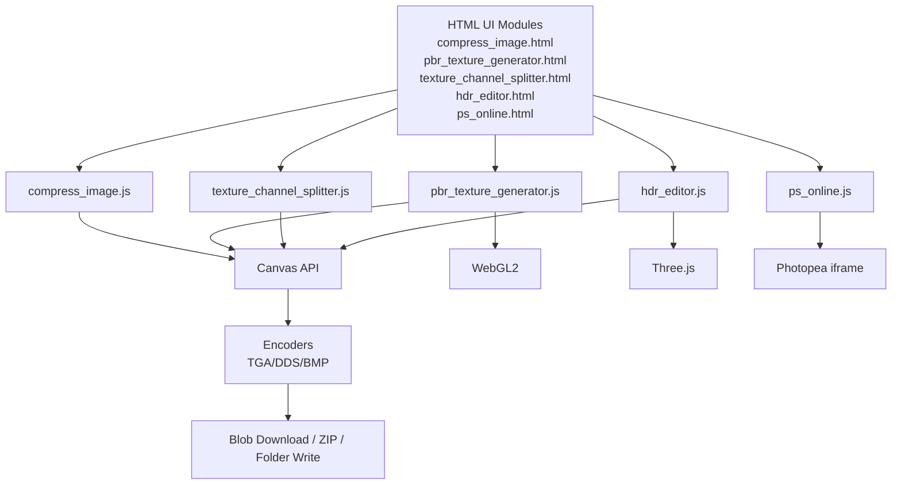
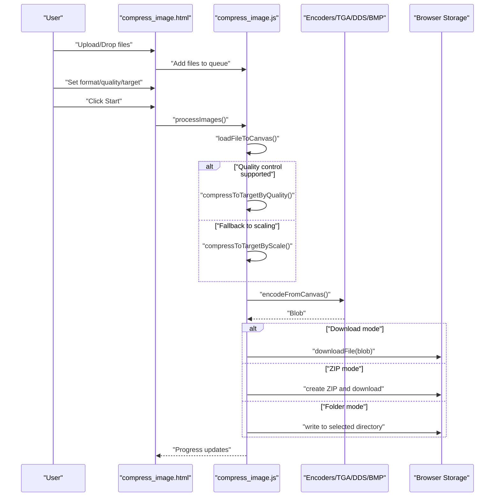
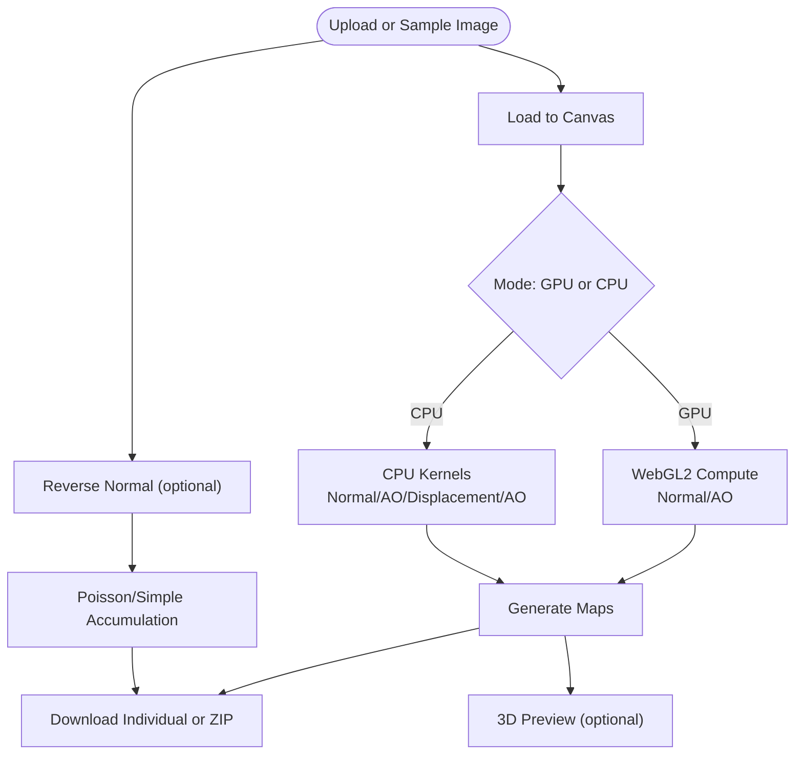
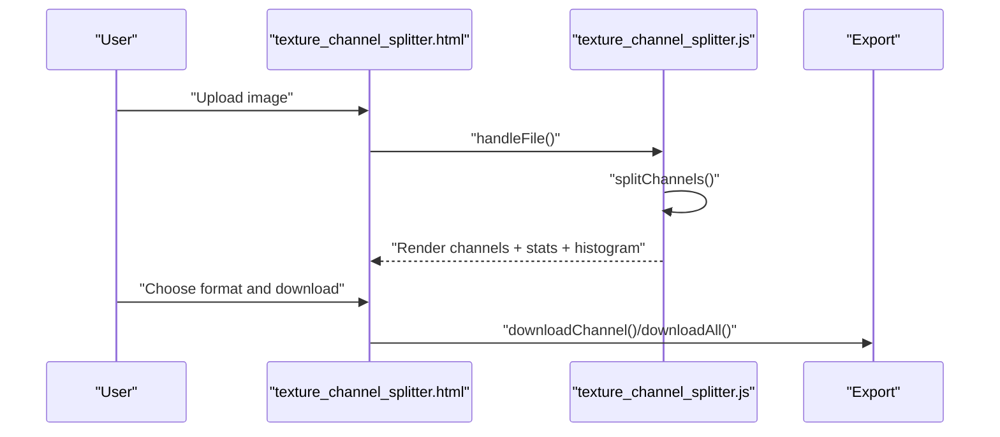
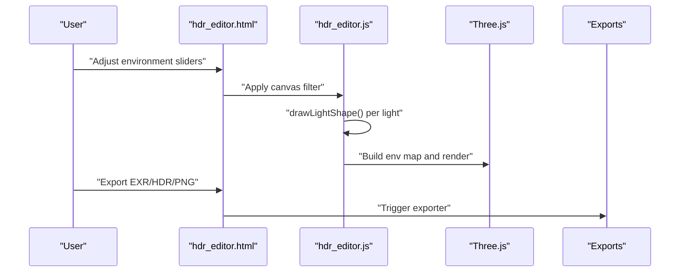
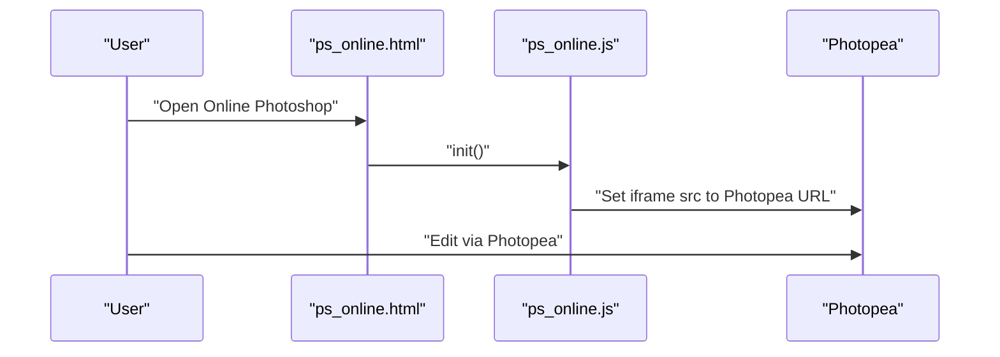
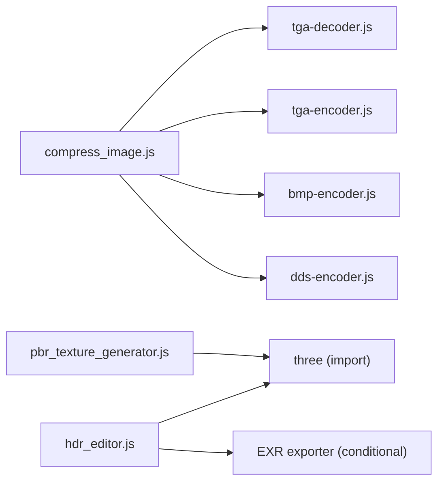

# Image Processing Tools

<cite>
**Referenced Files in This Document**
- [compress_image.js](file://js/compress_image.js)
- [compress_image.html](file://tools_html/compress_image.html)
- [compress_image.css](file://css/compress_image.css)
- [pbr_texture_generator.js](file://js/pbr_texture_generator.js)
- [pbr_texture_generator.html](file://tools_html/pbr_texture_generator.html)
- [pbr_texture_generator.css](file://css/pbr_texture_generator.css)
- [texture_channel_splitter.js](file://js/texture_channel_splitter.js)
- [texture_channel_splitter.html](file://tools_html/texture_channel_splitter.html)
- [texture_channel_splitter.css](file://css/texture_channel_splitter.css)
- [hdr_editor.js](file://js/hdr_editor.js)
- [hdr_editor.html](file://tools_html/hdr_editor.html)
- [hdr_editor.css](file://css/hdr_editor.css)
- [ps_online.js](file://js/ps_online.js)
- [ps_online.html](file://tools_html/ps_online.html)
- [ps_online.css](file://css/ps_online.css)
</cite>

## Table of Contents
1. [Introduction](#introduction)
2. [Project Structure](#project-structure)
3. [Core Components](#core-components)
4. [Architecture Overview](#architecture-overview)
5. [Detailed Component Analysis](#detailed-component-analysis)
6. [Dependency Analysis](#dependency-analysis)
7. [Performance Considerations](#performance-considerations)
8. [Troubleshooting Guide](#troubleshooting-guide)
9. [Conclusion](#conclusion)
10. [Appendices](#appendices)

## Introduction
This document describes the comprehensive image processing tools suite built with browser-native APIs and a canvas-based architecture. It covers compression algorithms, format conversion pipelines, channel manipulation operations, and PBR texture generation workflows. It also explains the integration of WebAssembly-like performance pathways via browser APIs, the use of WebGL for accelerated processing, and browser-native file handling. Practical workflows for texture preparation, HDR editing, and online Photoshop integration are documented alongside supported formats, quality settings, batch processing, and export optimization strategies.

## Project Structure
The suite is organized around modular HTML pages, each backed by a dedicated JavaScript module and associated CSS styling. The modules share a common UI framework and rely on the HTML5 Canvas API for pixel manipulation, browser file APIs for uploads and downloads, and optional third-party libraries for specialized encoders and 3D previews.

**Diagram sources**
- [compress_image.html:1-134](file://tools_html/compress_image.html#L1-L134)
- [compress_image.js:1-694](file://js/compress_image.js#L1-L694)
- [compress_image.css:1-520](file://css/compress_image.css#L1-L520)
- [pbr_texture_generator.html:1-226](file://tools_html/pbr_texture_generator.html#L1-L226)
- [pbr_texture_generator.js:1-1047](file://js/pbr_texture_generator.js#L1-L1047)
- [pbr_texture_generator.css:1-488](file://css/pbr_texture_generator.css#L1-L488)
- [texture_channel_splitter.html:1-116](file://tools_html/texture_channel_splitter.html#L1-L116)
- [texture_channel_splitter.js:1-159](file://js/texture_channel_splitter.js#L1-L159)
- [texture_channel_splitter.css:1-271](file://css/texture_channel_splitter.css#L1-L271)
- [hdr_editor.html:1-65](file://tools_html/hdr_editor.html#L1-L65)
- [hdr_editor.js:1-2242](file://js/hdr_editor.js#L1-L2242)
- [hdr_editor.css:1-1722](file://css/hdr_editor.css#L1-L1722)
- [ps_online.html:1-36](file://tools_html/ps_online.html#L1-L36)
- [ps_online.js:1-32](file://js/ps_online.js#L1-L32)
- [ps_online.css:1-29](file://css/ps_online.css#L1-L29)

**Section sources**
- [compress_image.html:1-134](file://tools_html/compress_image.html#L1-L134)
- [pbr_texture_generator.html:1-226](file://tools_html/pbr_texture_generator.html#L1-L226)
- [texture_channel_splitter.html:1-116](file://tools_html/texture_channel_splitter.html#L1-L116)
- [hdr_editor.html:1-65](file://tools_html/hdr_editor.html#L1-L65)
- [ps_online.html:1-36](file://tools_html/ps_online.html#L1-L36)

## Core Components
- Compression and Format Conversion Pipeline: Drag-and-drop upload, paste from clipboard, batch queue, quality/size control, and output modes (download, ZIP, folder). Uses canvas encoding and specialized encoders for TGA, DDS, BMP.
- PBR Texture Generation: CPU/GPU pipeline for grayscale-to-normal, displacement, AO, reflection, and glossiness maps; optional 3D preview with Three.js; reverse normal reconstruction.
- Channel Manipulation: Split RGBA channels into independent images, with statistics and histograms; export formats configurable.
- HDR Editor: Interactive HDR environment editor with real-time adjustments, lighting presets, and export to EXR/HDR/PNG; integrates Three.js for 3D preview.
- Online Photoshop Integration: Embedded Photopea editor with preconfigured defaults and fallback link.

**Section sources**
- [compress_image.js:1-694](file://js/compress_image.js#L1-L694)
- [pbr_texture_generator.js:1-1047](file://js/pbr_texture_generator.js#L1-L1047)
- [texture_channel_splitter.js:1-159](file://js/texture_channel_splitter.js#L1-L159)
- [hdr_editor.js:1-2242](file://js/hdr_editor.js#L1-L2242)
- [ps_online.js:1-32](file://js/ps_online.js#L1-L32)

## Architecture Overview
The tools follow a canvas-first architecture:
- Input: FileReader, drag-and-drop, clipboard, and directory picker APIs.
- Processing: Canvas-based pixel manipulation, WebGL for GPU-accelerated filters, and custom CPU kernels for PBR operations.
- Encoding: canvas.toBlob for standard formats; specialized encoders for TGA, DDS, BMP.
- Output: Blob downloads, ZIP packaging, and Web File System for folder writes.

**Diagram sources**
- [compress_image.js:370-644](file://js/compress_image.js#L370-L644)
- [pbr_texture_generator.js:200-372](file://js/pbr_texture_generator.js#L200-L372)
- [texture_channel_splitter.js:55-107](file://js/texture_channel_splitter.js#L55-L107)
- [hdr_editor.js:401-453](file://js/hdr_editor.js#L401-L453)
- [ps_online.js:1-32](file://js/ps_online.js#L1-L32)

## Detailed Component Analysis

### Compression and Format Conversion Pipeline
- Supported inputs include common raster formats plus TGA and DDS. TGA decoding uses a dedicated decoder; DDS is rejected as input but supported for output via encoder.
- Quality-driven compression targets JPEG/WebP; otherwise, iterative binary search adjusts either quality or scale to meet a target size.
- Output modes: download per file, ZIP archive, or write to a selected folder using the File System Access API.
- Batch processing with progress tracking and per-file notes for achieved compression metrics.

**Diagram sources**
- [compress_image.js:280-368](file://js/compress_image.js#L280-L368)
- [compress_image.js:370-401](file://js/compress_image.js#L370-L401)
- [compress_image.js:447-560](file://js/compress_image.js#L447-L560)
- [compress_image.js:606-644](file://js/compress_image.js#L606-L644)

**Section sources**
- [compress_image.js:1-694](file://js/compress_image.js#L1-L694)
- [compress_image.html:1-134](file://tools_html/compress_image.html#L1-L134)
- [compress_image.css:1-520](file://css/compress_image.css#L1-L520)

### PBR Texture Generation Workflow
- Input: Gray or color image uploaded or generated procedurally.
- Processing modes: CPU (accurate) and GPU (fast). GPU uses WebGL2 shaders for normal and AO computation; CPU path mirrors algorithms for portability.
- Outputs: grayscale, normal, displacement, AO, reflection, and glossiness maps; optional 3D preview with Three.js materials.
- Reverse normal reconstruction: Poisson solver or simple accumulation with adjustable iterations.

**Diagram sources**
- [pbr_texture_generator.js:383-426](file://js/pbr_texture_generator.js#L383-L426)
- [pbr_texture_generator.js:200-372](file://js/pbr_texture_generator.js#L200-L372)
- [pbr_texture_generator.js:429-502](file://js/pbr_texture_generator.js#L429-L502)

**Section sources**
- [pbr_texture_generator.js:1-1047](file://js/pbr_texture_generator.js#L1-L1047)
- [pbr_texture_generator.html:1-226](file://tools_html/pbr_texture_generator.html#L1-L226)
- [pbr_texture_generator.css:1-488](file://css/pbr_texture_generator.css#L1-L488)

### Channel Manipulation Operations
- Splits RGBA channels into separate canvases with two output modes: grayscale per channel or colored channel visualization.
- Computes per-channel statistics (min/max/avg) and renders histograms.
- Exports each channel independently or all at once.

**Diagram sources**
- [texture_channel_splitter.js:26-107](file://js/texture_channel_splitter.js#L26-L107)
- [texture_channel_splitter.js:132-146](file://js/texture_channel_splitter.js#L132-L146)

**Section sources**
- [texture_channel_splitter.js:1-159](file://js/texture_channel_splitter.js#L1-L159)
- [texture_channel_splitter.html:1-116](file://tools_html/texture_channel_splitter.html#L1-L116)
- [texture_channel_splitter.css:1-271](file://css/texture_channel_splitter.css#L1-L271)

### HDR Editing Techniques
- Real-time environment editing with brightness, contrast, saturation, hue shift, and background blur applied via canvas filters.
- Interactive light sources with multiple shapes (circle, rect, octagon, ring), color/temperature controls, and falloff/softness parameters.
- 3D preview with Three.js using PMREM environment mapping and configurable materials.
- Export to EXR, HDR, and PNG; optional resource import for 3D models.

**Diagram sources**
- [hdr_editor.js:508-515](file://js/hdr_editor.js#L508-L515)
- [hdr_editor.js:599-800](file://js/hdr_editor.js#L599-L800)
- [hdr_editor.js:401-453](file://js/hdr_editor.js#L401-L453)

**Section sources**
- [hdr_editor.js:1-2242](file://js/hdr_editor.js#L1-L2242)
- [hdr_editor.html:1-65](file://tools_html/hdr_editor.html#L1-L65)
- [hdr_editor.css:1-1722](file://css/hdr_editor.css#L1-L1722)

### Online Photoshop Integration
- Embeds Photopea in an iframe with preconfigured defaults and a fallback link for direct access.
- Uses referrer policy and clipboard permissions for seamless integration.

**Diagram sources**
- [ps_online.js:1-32](file://js/ps_online.js#L1-L32)
- [ps_online.html:1-36](file://tools_html/ps_online.html#L1-L36)

**Section sources**
- [ps_online.js:1-32](file://js/ps_online.js#L1-L32)
- [ps_online.html:1-36](file://tools_html/ps_online.html#L1-L36)
- [ps_online.css:1-29](file://css/ps_online.css#L1-L29)

## Dependency Analysis
- Encoders/Decoders: TGA decode/encode, DDS encode, BMP encode are loaded via script tags in the compression tool’s HTML.
- 3D Rendering: Three.js is dynamically imported in HDR editor and PBR generator; PBR generator uses an import map.
- File System Access: Directory picker and file writing require modern browsers (Chrome/Edge).
- Clipboard API: Paste-to-upload for images.

**Diagram sources**
- [compress_image.html:13-20](file://tools_html/compress_image.html#L13-L20)
- [pbr_texture_generator.html:214-222](file://tools_html/pbr_texture_generator.html#L214-L222)
- [hdr_editor.js:37-63](file://js/hdr_editor.js#L37-L63)

**Section sources**
- [compress_image.html:13-20](file://tools_html/compress_image.html#L13-L20)
- [pbr_texture_generator.html:214-222](file://tools_html/pbr_texture_generator.html#L214-L222)
- [hdr_editor.js:37-63](file://js/hdr_editor.js#L37-L63)

## Performance Considerations
- Canvas sizing: Downscale aggressively for very large images before processing to reduce memory pressure.
- GPU acceleration: Prefer GPU mode for PBR normal/AO generation when available; fallback to CPU for accuracy.
- Binary search loops: Limit iterations for target size control; cache intermediate results where possible.
- Memory management: Revoke object URLs, dispose textures and canvases after use, and avoid retaining large typed arrays unnecessarily.
- Browser-native APIs: Use FileReader for small to medium files; for large files, consider streaming approaches and worker threads to keep UI responsive.
- Export optimization: Batch ZIP creation client-side; avoid re-encoding when possible by reusing blobs.

[No sources needed since this section provides general guidance]

## Troubleshooting Guide
- Target size not met: The tool reports the closest achievable size and whether the target was reached. Adjust quality/scale sliders accordingly.
- DDS input not supported: DDS is not accepted as input; convert to a supported raster format first.
- Folder write permission denied: Ensure the browser supports the File System Access API and the user grants write permission to the selected directory.
- WebGL unsupported: GPU mode falls back to CPU automatically; enable WebGL2 support in your browser for optimal performance.
- Photopea iframe issues: Use the fallback link to open Photopea directly if the embedded iframe fails to load.

**Section sources**
- [compress_image.js:386-401](file://js/compress_image.js#L386-L401)
- [compress_image.js:423-426](file://js/compress_image.js#L423-L426)
- [compress_image.js:669-693](file://js/compress_image.js#L669-L693)
- [pbr_texture_generator.js:261-317](file://js/pbr_texture_generator.js#L261-L317)
- [ps_online.js:1-32](file://js/ps_online.js#L1-L32)

## Conclusion
This suite delivers a robust, browser-based image processing toolkit with strong canvas-centric workflows, optional GPU acceleration, and practical export strategies. It supports common and advanced tasks—from compression and format conversion to PBR generation and HDR editing—while leveraging modern browser APIs for performance and usability.

[No sources needed since this section summarizes without analyzing specific files]

## Appendices

### Supported Formats and Settings
- Compression tool:
  - Inputs: JPG, PNG, WEBP, GIF, BMP, TGA, DDS; clipboard paste; folder upload.
  - Outputs: keep, JPEG, PNG, WebP, BMP, TGA, DDS; naming suffixes; target size mode.
  - Modes: download, ZIP, folder write.
- PBR generator:
  - Inputs: JPG, PNG, BMP, TIFF, WebP; procedural samples.
  - Outputs: grayscale, normal, displacement, AO, reflection, glossiness; ZIP bundle.
  - Modes: CPU/GPU; 3D preview toggle.
- Channel splitter:
  - Inputs: JPG, PNG, BMP, WebP, TGA.
  - Outputs: R/G/B/A channels; PNG/JPG/WEBP export.
- HDR editor:
  - Environment: Solid, Gradient, Background image, HDR file.
  - Adjustments: Brightness, Contrast, Saturation, Hue shift, Background blur.
  - Exports: EXR, HDR, PNG; optional 3D model import.
- Online Photoshop:
  - Integration: Photopea iframe with preconfigured defaults.

**Section sources**
- [compress_image.html:56-65](file://tools_html/compress_image.html#L56-L65)
- [pbr_texture_generator.html:43-58](file://tools_html/pbr_texture_generator.html#L43-L58)
- [texture_channel_splitter.html:30-33](file://tools_html/texture_channel_splitter.html#L30-L33)
- [hdr_editor.html:89-137](file://tools_html/hdr_editor.html#L89-L137)

### Example Workflows
- Texture preparation:
  - Upload grayscale/albedo image; choose GPU mode; adjust normal strength and AO parameters; export maps as PNG or download as ZIP.
- HDR editing:
  - Import HDR or set gradient background; tweak brightness/contrast/saturation; add/edit lights; export EXR/HDR/PNG.
- Online Photoshop integration:
  - Open the Online Photoshop page; edit images via Photopea; use fallback link if embedding fails.

**Section sources**
- [pbr_texture_generator.html:139-151](file://tools_html/pbr_texture_generator.html#L139-L151)
- [hdr_editor.html:135-141](file://tools_html/hdr_editor.html#L135-L141)
- [ps_online.html:22-31](file://tools_html/ps_online.html#L22-L31)