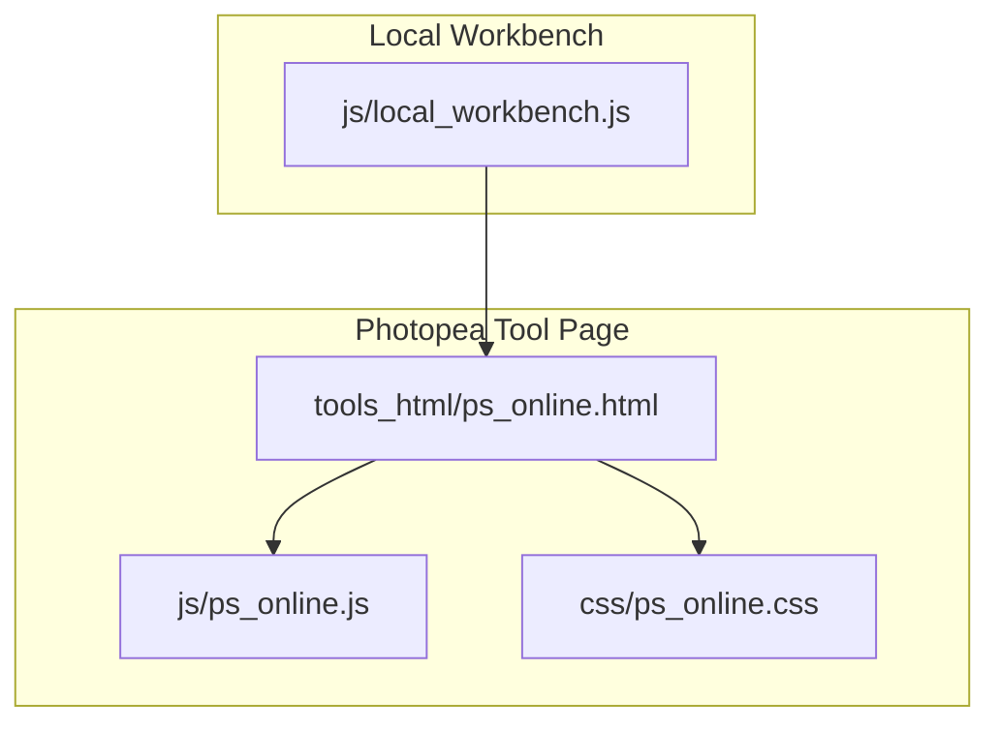
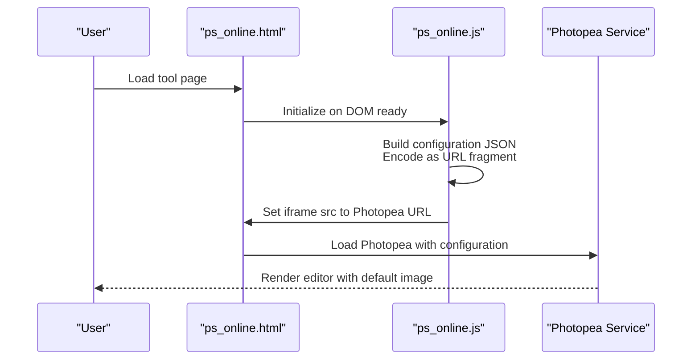
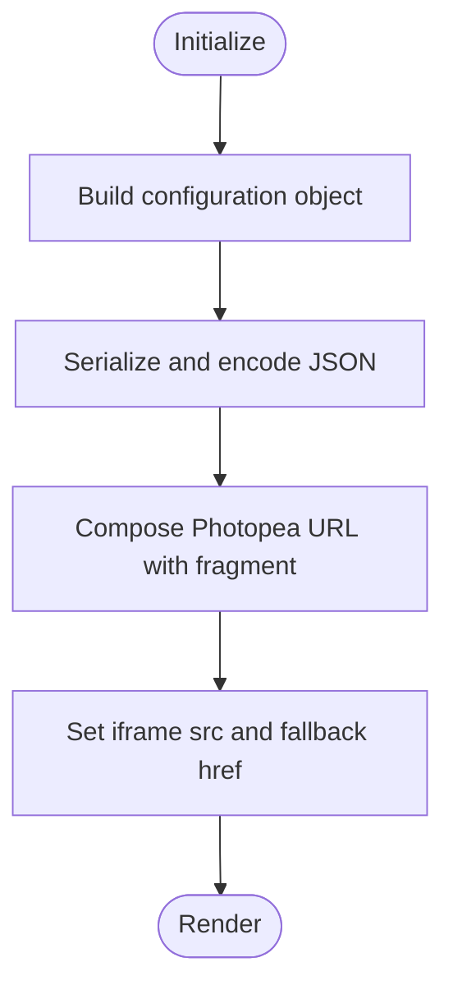
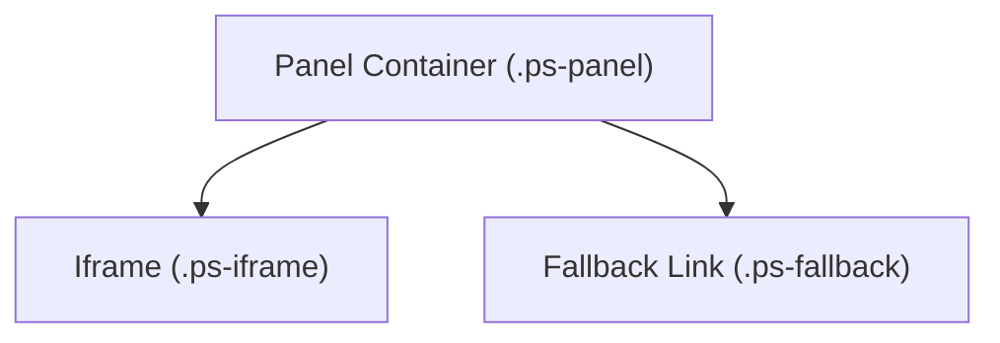
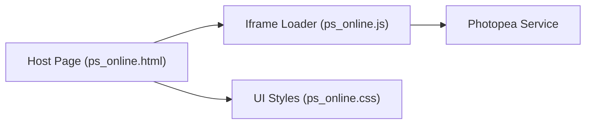

# Online Photoshop (Photopea)

<cite>
**Referenced Files in This Document**
- [ps_online.html](file://tools_html/ps_online.html)
- [ps_online.js](file://js/ps_online.js)
- [ps_online.css](file://css/ps_online.css)
- [local_workbench.js](file://js/local_workbench.js)
</cite>

## Table of Contents
1. [Introduction](#introduction)
2. [Project Structure](#project-structure)
3. [Core Components](#core-components)
4. [Architecture Overview](#architecture-overview)
5. [Detailed Component Analysis](#detailed-component-analysis)
6. [Dependency Analysis](#dependency-analysis)
7. [Performance Considerations](#performance-considerations)
8. [Troubleshooting Guide](#troubleshooting-guide)
9. [Conclusion](#conclusion)
10. [Appendices](#appendices)

## Introduction
This document explains the online Photoshop integration powered by Photopea. It focuses on the iframe-based embedding architecture, cross-origin communication via URL configuration, and the file transfer mechanism that initializes Photopea with a default image. It also documents the user interface integration, toolbar synchronization behavior, and workflow optimization techniques. Practical examples illustrate photo editing workflows, layer management, and export optimization procedures. Browser compatibility considerations, security implications of third-party service integration, and fallback mechanisms for offline operation are addressed alongside guidelines for managing large files and maintaining workflow continuity between local and online tools.

## Project Structure
The Photopea integration is implemented as a self-contained tool page with a dedicated JavaScript initializer and CSS styling. The HTML page embeds an iframe pointing to the Photopea service, while the JavaScript constructs a configuration payload embedded in the URL fragment to pre-load a default image and initialize basic scripting.

**Diagram sources**
- [ps_online.html:1-36](file://tools_html/ps_online.html#L1-L36)
- [ps_online.js:1-32](file://js/ps_online.js#L1-L32)
- [ps_online.css:1-29](file://css/ps_online.css#L1-L29)
- [local_workbench.js:123-125](file://js/local_workbench.js#L123-L125)

**Section sources**
- [ps_online.html:1-36](file://tools_html/ps_online.html#L1-L36)
- [ps_online.js:1-32](file://js/ps_online.js#L1-L32)
- [ps_online.css:1-29](file://css/ps_online.css#L1-L29)
- [local_workbench.js:123-125](file://js/local_workbench.js#L123-L125)

## Core Components
- Photopea iframe container: An iframe element configured with referrerpolicy, loading behavior, and permissions to enable clipboard operations.
- Configuration generator: A function that builds a JSON configuration object containing file sources, environment flags, and a minimal initialization script.
- Initialization routine: A DOM-ready handler that sets the iframe’s src to the Photopea URL and updates a fallback link.
- Styling: CSS classes that control layout, iframe sizing, and fallback link presentation.
- Local workbench integration: A separate initializer that embeds Photopea via an iframe inside the local workbench shell.

Key implementation references:
- [ps_online.html:22-31](file://tools_html/ps_online.html#L22-L31)
- [ps_online.js:2-14](file://js/ps_online.js#L2-L14)
- [ps_online.js:16-24](file://js/ps_online.js#L16-L24)
- [ps_online.css:1-29](file://css/ps_online.css#L1-L29)
- [local_workbench.js:123-125](file://js/local_workbench.js#L123-L125)

**Section sources**
- [ps_online.html:22-31](file://tools_html/ps_online.html#L22-L31)
- [ps_online.js:2-14](file://js/ps_online.js#L2-L14)
- [ps_online.js:16-24](file://js/ps_online.js#L16-L24)
- [ps_online.css:1-29](file://css/ps_online.css#L1-L29)
- [local_workbench.js:123-125](file://js/local_workbench.js#L123-L125)

## Architecture Overview
The integration uses a straightforward iframe embedding pattern. The configuration object is serialized to JSON, encoded as a URL fragment, and appended to the Photopea base URL. This allows Photopea to receive initial parameters without requiring explicit postMessage orchestration in this implementation.

**Diagram sources**
- [ps_online.js:2-14](file://js/ps_online.js#L2-L14)
- [ps_online.js:16-24](file://js/ps_online.js#L16-L24)
- [ps_online.html:22-31](file://tools_html/ps_online.html#L22-L31)

## Detailed Component Analysis

### Configuration and Initialization
- Configuration payload: Includes an array of file sources, environment flags, and a script to manipulate the active document’s layers.
- URL construction: The configuration is JSON-stringified, percent-encoded, and attached to the Photopea URL as a fragment.
- Initialization: On DOM ready, the script selects the iframe and fallback anchor elements, computes the Photopea URL, and assigns it to the iframe src and fallback href.

Implementation references:
- [ps_online.js:2-14](file://js/ps_online.js#L2-L14)
- [ps_online.js:16-24](file://js/ps_online.js#L16-L24)

**Diagram sources**
- [ps_online.js:2-14](file://js/ps_online.js#L2-L14)
- [ps_online.js:16-24](file://js/ps_online.js#L16-L24)

**Section sources**
- [ps_online.js:2-14](file://js/ps_online.js#L2-L14)
- [ps_online.js:16-24](file://js/ps_online.js#L16-L24)

### User Interface Integration
- Layout: The page defines a panel container and an iframe with specific CSS classes for sizing and background.
- Fallback link: A persistent link below the iframe directs users to the Photopea service in case of loading issues.
- Permissions: The iframe is configured with clipboard permissions to support copy/paste operations within the editor.

Implementation references:
- [ps_online.html:21-31](file://tools_html/ps_online.html#L21-L31)
- [ps_online.css:1-29](file://css/ps_online.css#L1-L29)

**Diagram sources**
- [ps_online.html:21-31](file://tools_html/ps_online.html#L21-L31)
- [ps_online.css:1-29](file://css/ps_online.css#L1-L29)

**Section sources**
- [ps_online.html:21-31](file://tools_html/ps_online.html#L21-L31)
- [ps_online.css:1-29](file://css/ps_online.css#L1-L29)

### Toolbar Synchronization
- The configuration includes a script that manipulates the active document’s layers. While this does not synchronize external toolbars, it demonstrates how Photopea can be primed with initial state upon load.
- For advanced synchronization (e.g., external UI controls), a postMessage bridge would be required. This implementation does not establish such a bridge.

Implementation references:
- [ps_online.js](file://js/ps_online.js#L10)

**Section sources**
- [ps_online.js](file://js/ps_online.js#L10)

### Cross-Origin Communication and File Transfer
- Cross-origin: The iframe loads Photopea from a different origin. The implementation relies on the fragment-based configuration mechanism rather than postMessage.
- Clipboard permissions: The iframe is granted clipboard-read and clipboard-write capabilities to facilitate image exchange workflows.
- File transfer: The configuration supplies a default image via a data URL, enabling immediate editing without requiring explicit uploads from the host page.

Implementation references:
- [ps_online.html:26-28](file://tools_html/ps_online.html#L26-L28)
- [ps_online.js:3-13](file://js/ps_online.js#L3-L13)

**Section sources**
- [ps_online.html:26-28](file://tools_html/ps_online.html#L26-L28)
- [ps_online.js:3-13](file://js/ps_online.js#L3-L13)

### Batch Operations and Workflow Optimization
- The current implementation initializes Photopea with a single default image. There is no built-in batch processing pipeline in this module.
- For batch operations, consider extending the configuration to include multiple files or integrating a postMessage-based workflow to push files programmatically after initialization.

[No sources needed since this section provides general guidance]

### Practical Examples

#### Photo Editing Workflow
- Open the Photopea tool page.
- The editor loads with the default image pre-populated.
- Perform edits within Photopea; use the fallback link to open Photopea directly if needed.

References:
- [ps_online.html](file://tools_html/ps_online.html#L30)
- [ps_online.js:21-23](file://js/ps_online.js#L21-L23)

#### Layer Management
- The configuration includes a script that accesses the active document’s layers and renames the first layer. This illustrates how the editor can be primed with initial layer metadata.

References:
- [ps_online.js](file://js/ps_online.js#L10)

#### Export Optimization Procedures
- After editing, export the result from Photopea. The fallback link ensures access to the editor even if the page experiences loading anomalies.

References:
- [ps_online.html](file://tools_html/ps_online.html#L30)

### Local Workbench Integration
- The local workbench provides an alternate embedding method for Photopea using a dedicated iframe initializer.
- This enables integration within the broader tool ecosystem while maintaining a consistent iframe-based approach.

References:
- [local_workbench.js:123-125](file://js/local_workbench.js#L123-L125)

**Section sources**
- [local_workbench.js:123-125](file://js/local_workbench.js#L123-L125)

## Dependency Analysis
The Photopea integration depends on:
- The Photopea service endpoint.
- The browser’s ability to load iframes with appropriate permissions.
- The availability of the default image data URL for pre-seeding the editor.

**Diagram sources**
- [ps_online.html:22-31](file://tools_html/ps_online.html#L22-L31)
- [ps_online.js:16-24](file://js/ps_online.js#L16-L24)
- [ps_online.css:1-29](file://css/ps_online.css#L1-L29)

**Section sources**
- [ps_online.html:22-31](file://tools_html/ps_online.html#L22-L31)
- [ps_online.js:16-24](file://js/ps_online.js#L16-L24)
- [ps_online.css:1-29](file://css/ps_online.css#L1-L29)

## Performance Considerations
- Initial load: Pre-loading a small default image reduces perceived latency by seeding the editor immediately.
- Clipboard operations: Enabling clipboard permissions avoids extra steps for copying images in and out of the editor.
- Fallback access: Providing a direct link to Photopea ensures uninterrupted access when the page fails to render the iframe correctly.

[No sources needed since this section provides general guidance]

## Troubleshooting Guide
- Iframe not loading:
  - Verify the iframe src assignment and ensure the page is not blocked by content policies.
  - Use the fallback link to open Photopea directly in a new tab.
- Configuration not applied:
  - Confirm the configuration JSON is properly serialized and encoded.
  - Check that the fragment is appended to the Photopea URL.
- Clipboard restrictions:
  - Ensure the iframe includes the clipboard permissions attribute.

References:
- [ps_online.html:26-28](file://tools_html/ps_online.html#L26-L28)
- [ps_online.js:21-23](file://js/ps_online.js#L21-L23)

**Section sources**
- [ps_online.html:26-28](file://tools_html/ps_online.html#L26-L28)
- [ps_online.js:21-23](file://js/ps_online.js#L21-L23)

## Conclusion
The Photopea integration leverages a simple, robust iframe-based architecture with fragment-based configuration to preload a default image and prime the editor. It provides a clean fallback mechanism and appropriate permissions for clipboard operations. While advanced synchronization and batch processing are not implemented here, the foundation supports extension for richer workflows and improved interoperability.

[No sources needed since this section summarizes without analyzing specific files]

## Appendices

### Security Implications of Third-Party Integration
- Trust boundaries: Loading Photopea introduces a third-party origin. Limit sensitive operations to trusted contexts.
- Permissions: Clipboard permissions are explicitly granted; review and minimize usage to reduce risk.
- Referrer policy: The iframe uses a no-referrer policy to limit leakage of navigation context.

References:
- [ps_online.html:26-28](file://tools_html/ps_online.html#L26-L28)

**Section sources**
- [ps_online.html:26-28](file://tools_html/ps_online.html#L26-L28)

### Browser Compatibility Considerations
- Iframe loading: The implementation uses eager loading and a no-referrer policy to improve reliability.
- Clipboard: Clipboard permissions are declared; ensure the hosting environment supports these features.
- Fragment encoding: The configuration is URL-encoded; confirm compatibility across browsers.

References:
- [ps_online.html:27-28](file://tools_html/ps_online.html#L27-L28)
- [ps_online.js](file://js/ps_online.js#L13)

**Section sources**
- [ps_online.html:27-28](file://tools_html/ps_online.html#L27-L28)
- [ps_online.js](file://js/ps_online.js#L13)

### Managing Large Files and Workflow Continuity
- Large files: Prefer fragment-based initialization for small seed assets. For larger files, consider external upload flows or postMessage-based transfers after initialization.
- Offline continuity: The fallback link ensures access to Photopea even if the page fails to load the iframe. Maintain a stable default image for quick resumption of work.

References:
- [ps_online.js:3-13](file://js/ps_online.js#L3-L13)
- [ps_online.html](file://tools_html/ps_online.html#L30)

**Section sources**
- [ps_online.js:3-13](file://js/ps_online.js#L3-L13)
- [ps_online.html](file://tools_html/ps_online.html#L30)