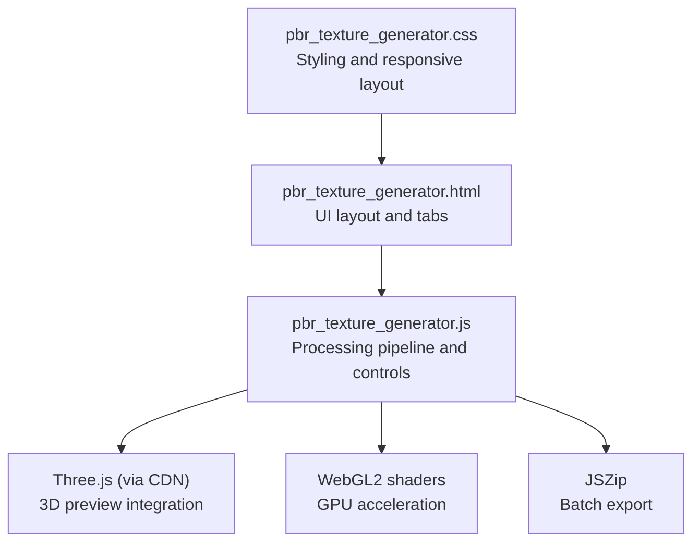
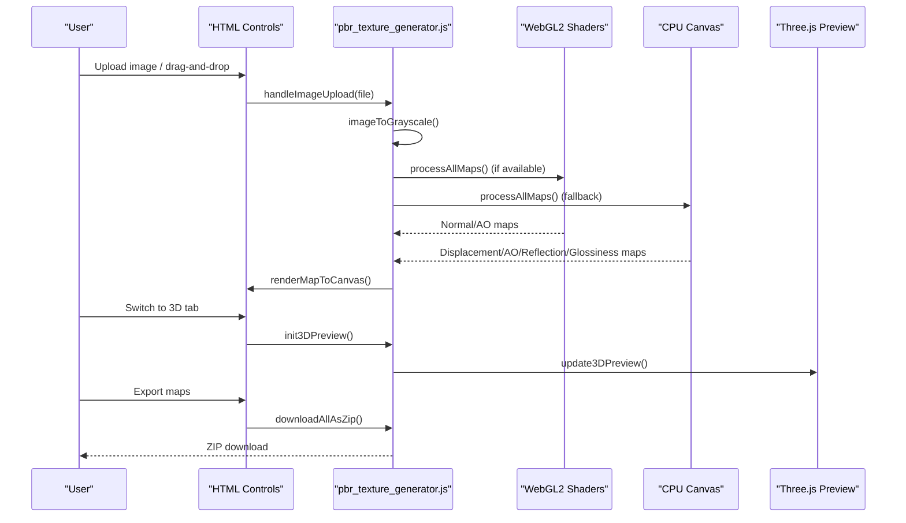
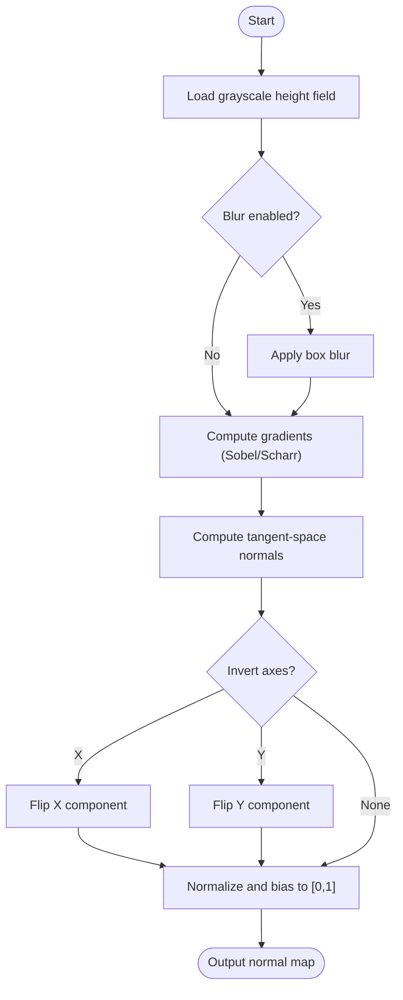
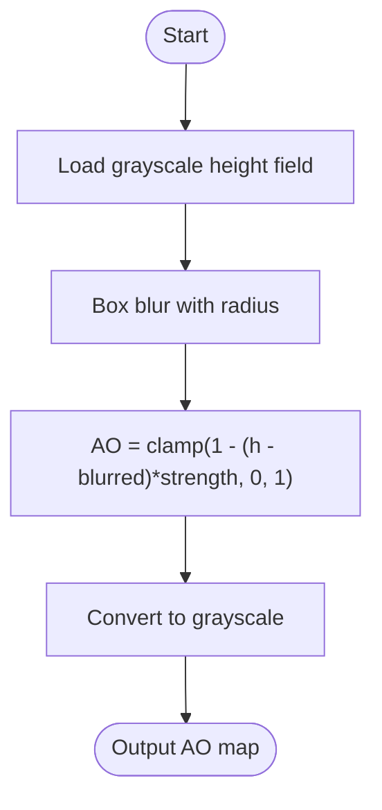
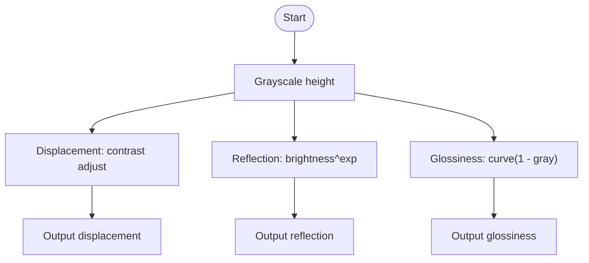
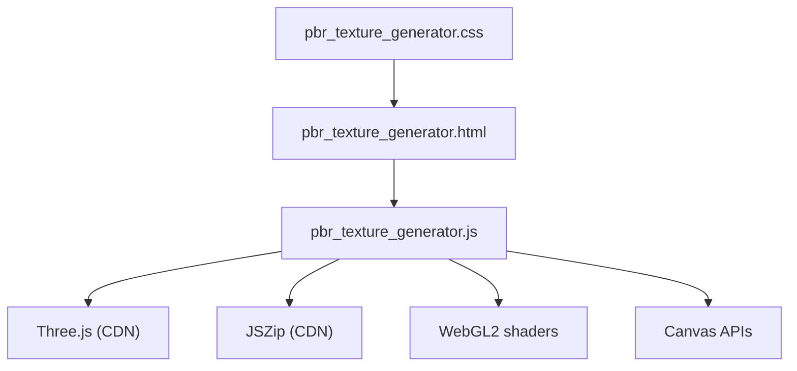

# PBR Texture Generation

<cite>
**Referenced Files in This Document**
- [pbr_texture_generator.js](file://js/pbr_texture_generator.js)
- [pbr_texture_generator.css](file://css/pbr_texture_generator.css)
- [pbr_texture_generator.html](file://tools_html/pbr_texture_generator.html)
</cite>

## Table of Contents
1. [Introduction](#introduction)
2. [Project Structure](#project-structure)
3. [Core Components](#core-components)
4. [Architecture Overview](#architecture-overview)
5. [Detailed Component Analysis](#detailed-component-analysis)
6. [Dependency Analysis](#dependency-analysis)
7. [Performance Considerations](#performance-considerations)
8. [Troubleshooting Guide](#troubleshooting-guide)
9. [Conclusion](#conclusion)
10. [Appendices](#appendices)

## Introduction
This document explains the Physically-Based Rendering (PBR) texture generation tool implemented in the repository. It covers the PBR workflow, including metallic-roughness and specular-glossiness mappings, texture resolution handling, normal map generation, procedural synthesis, and surface property mapping. It also provides practical guidance for material setup, texture atlas generation, game engine integration, performance optimization, and quality assurance for professional workflows.

## Project Structure
The PBR tool is a self-contained web application with HTML, CSS, and JavaScript. The UI is organized into:
- Left panel: Controls for mode selection, input image handling, parameter sliders, and export options
- Right panel: 2D map previews and a 3D preview integrated with Three.js

**Diagram sources**
- [pbr_texture_generator.html:20-226](file://tools_html/pbr_texture_generator.html#L20-L226)
- [pbr_texture_generator.js:1-1047](file://js/pbr_texture_generator.js#L1-L1047)
- [pbr_texture_generator.css:1-488](file://css/pbr_texture_generator.css#L1-L488)

**Section sources**
- [pbr_texture_generator.html:20-226](file://tools_html/pbr_texture_generator.html#L20-L226)
- [pbr_texture_generator.css:1-488](file://css/pbr_texture_generator.css#L1-L488)

## Core Components
- Input handling: Drag-and-drop or file selection for grayscale or color images; sample procedural textures
- Processing pipeline: CPU and GPU modes for grayscale conversion and map generation
- Map generation:
  - Normal map (with Sobel/Scharr operators and optional blur)
  - Displacement map (contrast adjustment)
  - Ambient Occlusion (AO) map (box blur-based)
  - Reflection/specular map (brightness-based)
  - Glossiness map (inverse-roughness mapping)
- 3D preview: Real-time preview using Three.js with displacement mapping
- Export: Individual downloads and batch ZIP packaging

**Section sources**
- [pbr_texture_generator.js:383-426](file://js/pbr_texture_generator.js#L383-L426)
- [pbr_texture_generator.js:805-848](file://js/pbr_texture_generator.js#L805-L848)
- [pbr_texture_generator.js:657-696](file://js/pbr_texture_generator.js#L657-L696)

## Architecture Overview
The tool follows a modular architecture:
- UI layer: HTML/CSS for controls and previews
- Logic layer: JavaScript orchestrating image loading, grayscale conversion, map generation, and exports
- Rendering layer: Canvas-based CPU rendering and optional WebGL2 GPU rendering
- Preview layer: Three.js integration for real-time material preview

**Diagram sources**
- [pbr_texture_generator.js:805-848](file://js/pbr_texture_generator.js#L805-L848)
- [pbr_texture_generator.js:383-426](file://js/pbr_texture_generator.js#L383-L426)
- [pbr_texture_generator.js:504-655](file://js/pbr_texture_generator.js#L504-L655)
- [pbr_texture_generator.js:670-696](file://js/pbr_texture_generator.js#L670-L696)

## Detailed Component Analysis

### PBR Workflow Overview
- Input: Grayscale or color image converted to grayscale
- Outputs: Grayscale, Normal, Displacement, AO, Reflection, Glossiness
- Workflows supported:
  - Metallic-Roughness: Use grayscale as base color, reflection map as metallic, glossiness map as inverse roughness
  - Specular-Glossiness: Use grayscale as base color, reflection map as specular intensity, glossiness map as shininess

Implementation highlights:
- Grayscale conversion uses luminance weights
- Normal map generation supports Sobel/Scharr operators and blur
- AO computed via box blur difference
- Reflection and glossiness derived from grayscale brightness/power transforms

**Section sources**
- [pbr_texture_generator.js:44-56](file://js/pbr_texture_generator.js#L44-L56)
- [pbr_texture_generator.js:101-140](file://js/pbr_texture_generator.js#L101-L140)
- [pbr_texture_generator.js:156-169](file://js/pbr_texture_generator.js#L156-L169)
- [pbr_texture_generator.js:171-198](file://js/pbr_texture_generator.js#L171-L198)

### Normal Map Generation
- Operators:
  - Sobel operator (default)
  - Scharr operator (HQ mode)
- Parameters:
  - Strength: amplifies gradient magnitude
  - Blur: pre-blur kernel radius
  - Invert X/Y: flips tangent-space directions
- GPU path uses a fullscreen quad with a fragment shader computing central differences across a 3x3 neighborhood

**Diagram sources**
- [pbr_texture_generator.js:101-140](file://js/pbr_texture_generator.js#L101-L140)
- [pbr_texture_generator.js:209-233](file://js/pbr_texture_generator.js#L209-L233)
- [pbr_texture_generator.js:361-371](file://js/pbr_texture_generator.js#L361-L371)

**Section sources**
- [pbr_texture_generator.js:101-140](file://js/pbr_texture_generator.js#L101-L140)
- [pbr_texture_generator.js:209-233](file://js/pbr_texture_generator.js#L209-L233)
- [pbr_texture_generator.js:361-371](file://js/pbr_texture_generator.js#L361-L371)

### Ambient Occlusion (AO) Map Generation
- Method: Box blur around each pixel; AO = 1 - (height - blurred) × strength
- Parameters:
  - Strength: global AO intensity
  - Radius: blur kernel size

**Diagram sources**
- [pbr_texture_generator.js:156-169](file://js/pbr_texture_generator.js#L156-L169)
- [pbr_texture_generator.js:235-259](file://js/pbr_texture_generator.js#L235-L259)
- [pbr_texture_generator.js:367-371](file://js/pbr_texture_generator.js#L367-L371)

**Section sources**
- [pbr_texture_generator.js:156-169](file://js/pbr_texture_generator.js#L156-L169)
- [pbr_texture_generator.js:235-259](file://js/pbr_texture_generator.js#L235-L259)
- [pbr_texture_generator.js:367-371](file://js/pbr_texture_generator.js#L367-L371)

### Displacement and Surface Property Maps
- Displacement map: Gamma/expanded contrast applied to grayscale
- Reflection map: Brightness raised to power to emphasize reflective areas
- Glossiness map: Inverted and slightly curved mapping from grayscale to reflect sharpness

**Diagram sources**
- [pbr_texture_generator.js:142-154](file://js/pbr_texture_generator.js#L142-L154)
- [pbr_texture_generator.js:171-198](file://js/pbr_texture_generator.js#L171-L198)

**Section sources**
- [pbr_texture_generator.js:142-154](file://js/pbr_texture_generator.js#L142-L154)
- [pbr_texture_generator.js:171-198](file://js/pbr_texture_generator.js#L171-L198)

### Procedural Texture Synthesis
The tool includes four procedural sample generators:
- Bricks: periodic pattern with mortar gaps
- Cobblestone: Voronoi-like cells with edges
- Metal: sine/cosine waves plus scratch overlays
- Rock: multi-octave noise approximation

These are useful for testing and validating the PBR pipeline.

**Section sources**
- [pbr_texture_generator.js:699-803](file://js/pbr_texture_generator.js#L699-L803)

### Reverse Normal Map Reconstruction
Two algorithms reconstruct a height field from a normal map:
- Poisson reconstruction: iterative solver minimizing Laplacian error
- Simple accumulation: row/column integration approximations

Parameters:
- Algorithm selection
- Iterations (Poisson)

**Section sources**
- [pbr_texture_generator.js:429-464](file://js/pbr_texture_generator.js#L429-L464)
- [pbr_texture_generator.js:466-502](file://js/pbr_texture_generator.js#L466-L502)

### 3D Preview Integration
- Three.js MeshStandardMaterial with:
  - map: grayscale diffuse
  - normalMap: normal map
  - displacementMap/displacementScale: displacement
  - aoMap/aoMapIntensity: ambient occlusion
- Controls:
  - Model selection (plane/sphere/cube)
  - Displacement scale slider

**Section sources**
- [pbr_texture_generator.js:504-655](file://js/pbr_texture_generator.js#L504-L655)

### Export and Packaging
- Individual downloads per map
- Batch ZIP export containing all generated maps

**Section sources**
- [pbr_texture_generator.js:657-696](file://js/pbr_texture_generator.js#L657-L696)
- [pbr_texture_generator.html:138-151](file://tools_html/pbr_texture_generator.html#L138-L151)

## Dependency Analysis
- External libraries:
  - Three.js (CDN import) for 3D preview
  - JSZip (CDN) for batch export
- Internal dependencies:
  - WebGL2 shaders for GPU normal/AO computation
  - Canvas APIs for CPU fallback and rendering

**Diagram sources**
- [pbr_texture_generator.html:214-222](file://tools_html/pbr_texture_generator.html#L214-L222)
- [pbr_texture_generator.js:1-1047](file://js/pbr_texture_generator.js#L1-L1047)

**Section sources**
- [pbr_texture_generator.html:214-222](file://tools_html/pbr_texture_generator.html#L214-L222)
- [pbr_texture_generator.js:261-317](file://js/pbr_texture_generator.js#L261-L317)

## Performance Considerations
- GPU vs CPU:
  - GPU mode uses WebGL2 shaders for normal and AO computation; requires float-texture support
  - CPU mode uses box blur and direct convolution kernels; suitable for smaller images or unsupported devices
- Memory:
  - Float32 arrays store grayscale height fields; ImageData for intermediate maps
  - Canvas textures are disposed and recreated during 3D updates
- Resolution:
  - The UI defaults to 512×512 canvases for previews; larger images increase processing time
- Recommendations:
  - Prefer GPU mode for large textures
  - Use moderate blur radii to balance quality and speed
  - Limit AO radius to reduce per-pixel work
  - For export, consider platform-specific compression and channel packing

[No sources needed since this section provides general guidance]

## Troubleshooting Guide
- GPU unavailable:
  - The tool automatically falls back to CPU mode and disables GPU button
- Unexpected artifacts:
  - Adjust normal strength and blur; verify invert X/Y settings
  - For AO, tune strength and radius
- 3D preview not updating:
  - Ensure maps are generated and 3D tab is active
  - Reinitialize preview if needed
- Export issues:
  - Ensure JSZip is loaded; try downloading individual maps first

**Section sources**
- [pbr_texture_generator.js:1025-1039](file://js/pbr_texture_generator.js#L1025-L1039)
- [pbr_texture_generator.js:504-655](file://js/pbr_texture_generator.js#L504-L655)
- [pbr_texture_generator.js:670-696](file://js/pbr_texture_generator.js#L670-L696)

## Conclusion
The PBR texture generator provides a complete, web-based pipeline for deriving PBR maps from grayscale inputs, with optional GPU acceleration, procedural samples, and a live 3D preview. It supports both metallic-roughness and specular-glossiness workflows and offers robust export capabilities for production asset pipelines.

[No sources needed since this section summarizes without analyzing specific files]

## Appendices

### PBR Material Setup Workflows
- Metallic-Roughness:
  - Base Color: grayscale map
  - Normal: normal map
  - Occlusion: AO map
  - Metallic: reflection map
  - Roughness: 1 - glossiness map
- Specular-Glossiness:
  - Base Color: grayscale map
  - Normal: normal map
  - Occlusion: AO map
  - Specular: reflection map
  - Glossiness: glossiness map

**Section sources**
- [pbr_texture_generator.html:142-151](file://tools_html/pbr_texture_generator.html#L142-L151)

### Texture Atlas Generation Patterns
- Pack maps into a single atlas with consistent resolution
- Use separate channels for metallic/roughness or specular/glossiness depending on workflow
- Maintain UV alignment and edge bleeding for seamless tiling

[No sources needed since this section provides general guidance]

### Game Engine Integration Notes
- Unity:
  - Metallic-Roughness: Standard Shader; map assignments as described above
  - Specular-Glossiness: Standard Shader with GI; map assignments as described above
- Unreal Engine:
  - Use Base Color, Normal, Metallic, Roughness, Ambient Occlusion, Emissive
  - Displacement can be enabled in materials with appropriate tessellation
- Godot:
  - Standard Shader supports metallic/roughness and specular/glossiness variants
  - Assign maps accordingly and enable normal/bump mapping

[No sources needed since this section provides general guidance]

### Performance and Export Optimization
- High-resolution textures:
  - Use GPU mode; consider mipmapping and compressed formats
- Memory optimization:
  - Dispose old textures; reuse canvases where possible
- Platform export:
  - Choose appropriate formats (PNG, ASTC, ETC2, BC7) and compression levels
  - Validate normal map orientation and AO channel assignment

[No sources needed since this section provides general guidance]

### Texture Preparation Standards, Naming, and QA
- Standards:
  - sRGB for color maps; linear for normal/displacement/AO
  - Proper UV layout and seam alignment
- Naming conventions:
  - BaseColor/Diffuse, Normal, Height/Displacement, Occlusion/AO, Metallic/Roughness, Specular/Glossiness
- QA checklist:
  - Verify normal map directionality and compression artifacts
  - Confirm AO edges and seams
  - Validate displacement scale against geometry
  - Test in target engine with realistic lighting

[No sources needed since this section provides general guidance]