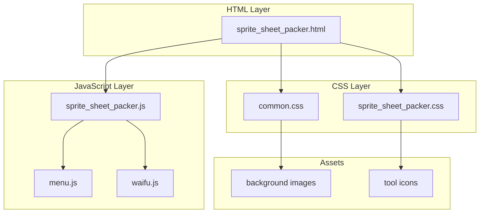
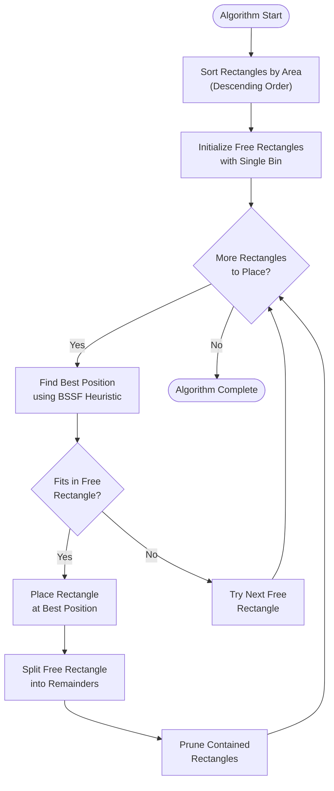
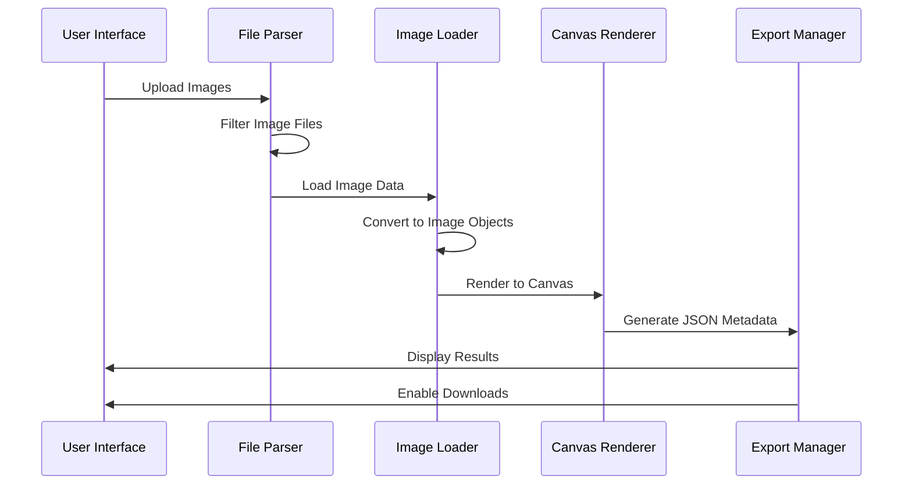
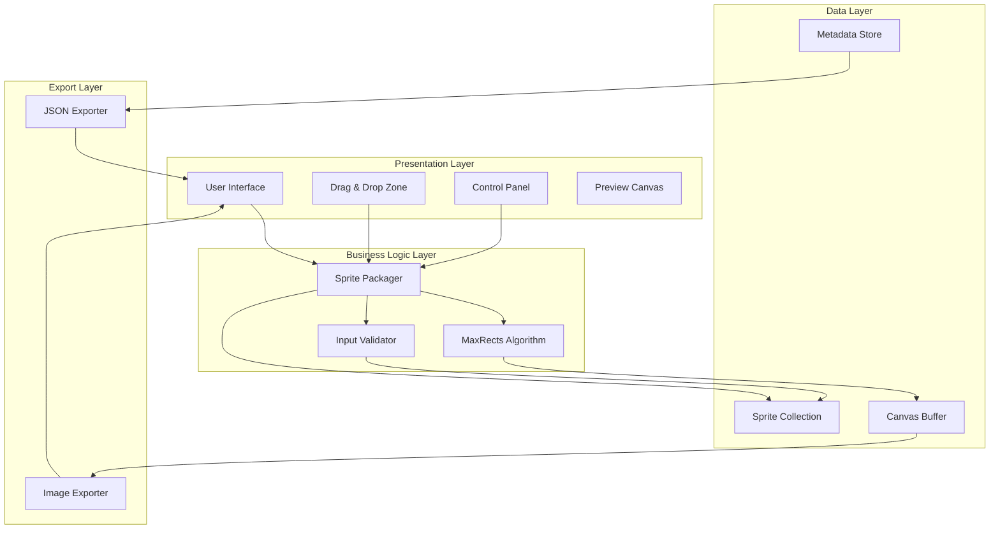
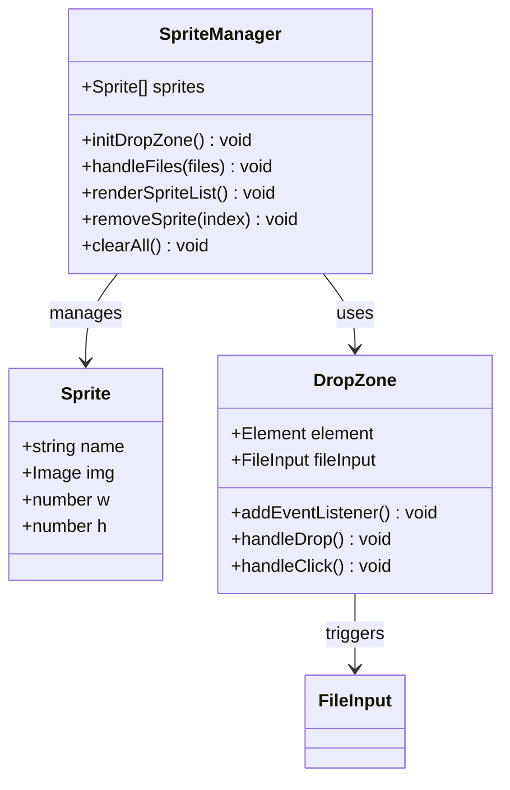
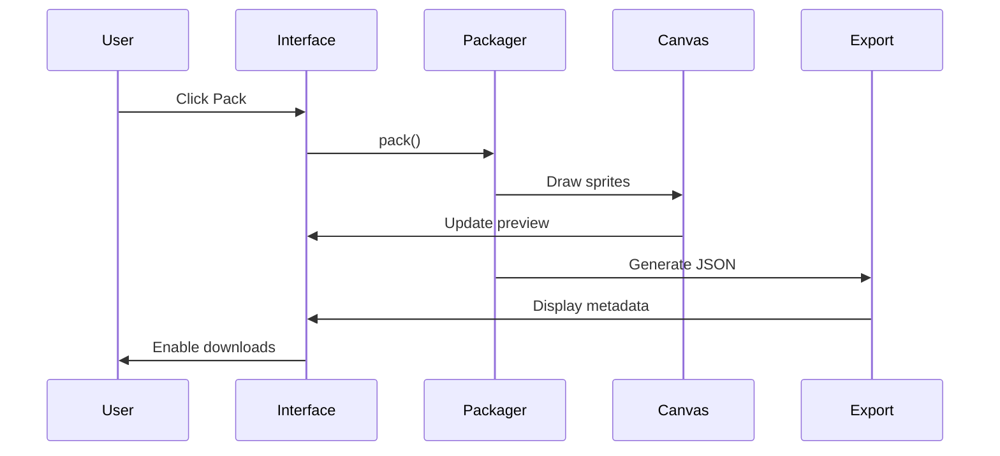
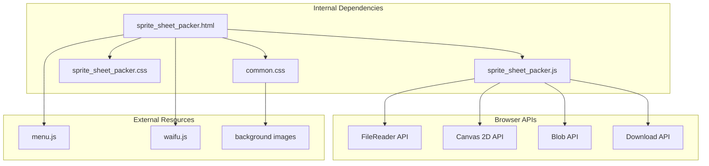

# Sprite Sheet Packer

<cite>
**Referenced Files in This Document**
- [sprite_sheet_packer.js](file://js/sprite_sheet_packer.js)
- [sprite_sheet_packer.css](file://css/sprite_sheet_packer.css)
- [sprite_sheet_packer.html](file://tools_html/sprite_sheet_packer.html)
- [common.css](file://css/common.css)
</cite>

## Table of Contents
1. [Introduction](#introduction)
2. [Project Structure](#project-structure)
3. [Core Components](#core-components)
4. [Architecture Overview](#architecture-overview)
5. [Detailed Component Analysis](#detailed-component-analysis)
6. [Dependency Analysis](#dependency-analysis)
7. [Performance Considerations](#performance-considerations)
8. [Troubleshooting Guide](#troubleshooting-guide)
9. [Conclusion](#conclusion)

## Introduction

The Sprite Sheet Packer is a web-based tool designed to efficiently organize individual sprite images into optimized sprite sheets (texture atlases). This utility automates the complex process of image arrangement, applying advanced bin packing algorithms to minimize wasted space while maintaining optimal rendering performance for game development and web applications.

The tool accepts multiple image files, automatically calculates the most efficient layout using the MaxRects bin packing algorithm, and generates both a high-quality sprite sheet image and a JSON metadata file containing precise positioning coordinates for each sprite. This dual-output approach ensures seamless integration with game engines, animation frameworks, and web applications that require structured sprite data.

## Project Structure

The Sprite Sheet Packer follows a clean separation of concerns architecture with distinct layers for presentation, logic, and styling:

**Diagram sources**
- [sprite_sheet_packer.html:1-100](file://tools_html/sprite_sheet_packer.html#L1-L100)
- [sprite_sheet_packer.js:1-244](file://js/sprite_sheet_packer.js#L1-L244)
- [common.css:1-386](file://css/common.css#L1-L386)

The project utilizes a responsive grid-based layout system that adapts seamlessly to different screen sizes, featuring a modern glass-morphism design aesthetic with subtle animations and transitions.

**Section sources**
- [sprite_sheet_packer.html:1-100](file://tools_html/sprite_sheet_packer.html#L1-L100)
- [sprite_sheet_packer.js:1-244](file://js/sprite_sheet_packer.js#L1-L244)
- [sprite_sheet_packer.css:1-263](file://css/sprite_sheet_packer.css#L1-L263)

## Core Components

### MaxRects Bin Packing Algorithm

The heart of the Sprite Sheet Packer lies in its sophisticated implementation of the MaxRects bin packing algorithm, specifically utilizing the Best Short Side Fit (BSSF) heuristic combined with area-based sorting for optimal space utilization.

**Diagram sources**
- [sprite_sheet_packer.js:10-48](file://js/sprite_sheet_packer.js#L10-L48)

The algorithm employs several optimization strategies:
- **Area-based Sorting**: Larger sprites are prioritized to reduce fragmentation
- **BSSF Heuristic**: Minimizes wasted space by selecting positions that leave the smallest remaining rectangle
- **Free Rectangle Management**: Efficiently tracks and updates available placement areas
- **Automatic Size Scaling**: Dynamically increases canvas size when initial attempts fail

### Image Processing Pipeline

The tool processes uploaded images through a multi-stage pipeline that ensures optimal quality and compatibility:

**Diagram sources**
- [sprite_sheet_packer.js:101-117](file://js/sprite_sheet_packer.js#L101-L117)
- [sprite_sheet_packer.js:141-205](file://js/sprite_sheet_packer.js#L141-L205)

**Section sources**
- [sprite_sheet_packer.js:10-48](file://js/sprite_sheet_packer.js#L10-L48)
- [sprite_sheet_packer.js:101-117](file://js/sprite_sheet_packer.js#L101-L117)
- [sprite_sheet_packer.js:141-205](file://js/sprite_sheet_packer.js#L141-L205)

## Architecture Overview

The Sprite Sheet Packer implements a modular architecture with clear separation between presentation, business logic, and data management:

**Diagram sources**
- [sprite_sheet_packer.js:1-244](file://js/sprite_sheet_packer.js#L1-L244)

The architecture emphasizes:
- **Event-driven Design**: Responsive user interactions trigger immediate processing
- **Modular Functions**: Clear separation of concerns for maintainability
- **State Management**: Centralized sprite collection and result storage
- **Asynchronous Processing**: Non-blocking image loading and canvas operations

**Section sources**
- [sprite_sheet_packer.js:1-244](file://js/sprite_sheet_packer.js#L1-L244)

## Detailed Component Analysis

### User Interface Components

The interface consists of three primary sections: sprite management, configuration controls, and output display.

#### Sprite Management Interface

The sprite management system provides intuitive drag-and-drop functionality with real-time feedback:

**Diagram sources**
- [sprite_sheet_packer.js:88-139](file://js/sprite_sheet_packer.js#L88-L139)

#### Configuration Panel

The configuration system offers flexible options for controlling the packing process:

| Setting | Options | Default | Purpose |
|---------|---------|---------|---------|
| Size Mode | Auto, 512x512, 1024x1024, 2048x2048, 4096x4096 | Auto | Canvas dimensions |
| Padding | 0-32 pixels | 2 | Spacing between sprites |
| Background | Transparent, Black, White | Transparent | Canvas background |
| Output Format | PNG, WebP | PNG | Export image format |

#### Output Display System

The output system provides comprehensive visual feedback and export capabilities:

**Diagram sources**
- [sprite_sheet_packer.js:141-205](file://js/sprite_sheet_packer.js#L141-L205)

**Section sources**
- [sprite_sheet_packer.html:25-93](file://tools_html/sprite_sheet_packer.html#L25-L93)
- [sprite_sheet_packer.css:66-263](file://css/sprite_sheet_packer.css#L66-L263)

### Algorithm Implementation Details

The MaxRects algorithm implementation demonstrates sophisticated spatial optimization techniques:

#### Rectangle Placement Strategy

The placement algorithm uses a multi-criteria evaluation system:

**Diagram sources**
- [sprite_sheet_packer.js:19-44](file://js/sprite_sheet_packer.js#L19-L44)

#### Free Rectangle Management

The system maintains an efficient free rectangle pool with intelligent pruning:

| Operation | Complexity | Description |
|-----------|------------|-------------|
| Find Best Position | O(n) | Scan free rectangles for optimal fit |
| Split Rectangle | O(1) | Divide rectangle into four remainders |
| Prune Contained | O(n²) | Remove redundant rectangles |
| Next Power of Two | O(1) | Fast bit manipulation calculation |

**Section sources**
- [sprite_sheet_packer.js:10-85](file://js/sprite_sheet_packer.js#L10-L85)

## Dependency Analysis

The Sprite Sheet Packer maintains minimal external dependencies while leveraging modern browser APIs effectively:

**Diagram sources**
- [sprite_sheet_packer.html:13-16](file://tools_html/sprite_sheet_packer.html#L13-L16)
- [sprite_sheet_packer.js:1-244](file://js/sprite_sheet_packer.js#L1-L244)

Key dependency characteristics:
- **Zero External Libraries**: Pure JavaScript implementation
- **Modern Browser Support**: Leverages ES6+ features
- **Progressive Enhancement**: Graceful degradation for older browsers
- **Self-contained**: No server-side dependencies

**Section sources**
- [sprite_sheet_packer.html:13-16](file://tools_html/sprite_sheet_packer.html#L13-L16)
- [sprite_sheet_packer.js:1-244](file://js/sprite_sheet_packer.js#L1-L244)

## Performance Considerations

### Algorithmic Efficiency

The MaxRects implementation achieves optimal performance through strategic optimizations:

- **Time Complexity**: O(n² log n) due to sorting and placement operations
- **Space Complexity**: O(n) for storing sprite data and free rectangles
- **Memory Usage**: Minimal overhead proportional to sprite count
- **Scalability**: Handles up to hundreds of sprites efficiently

### Canvas Optimization

The rendering system incorporates several performance enhancements:

- **Hardware Acceleration**: Canvas operations utilize GPU acceleration
- **Pixel Art Rendering**: Maintains crisp edges for pixel art sprites
- **Efficient Blitting**: Direct canvas drawing minimizes intermediate operations
- **Background Optimization**: Transparent backgrounds reduce unnecessary operations

### Memory Management

The application implements careful memory management strategies:

- **Image Cleanup**: Automatic URL revocation prevents memory leaks
- **Event Listener Management**: Proper cleanup of DOM event handlers
- **Canvas Recycling**: Reuse of canvas elements reduces allocation overhead
- **Blob Management**: Temporary objects are promptly garbage collected

## Troubleshooting Guide

### Common Issues and Solutions

#### Large Image Handling

**Problem**: Images larger than 4096×4096 pixels cause performance issues
**Solution**: The algorithm automatically scales up to 8192×8192 limit with exponential growth

#### Memory Constraints

**Problem**: Excessive memory usage with many large sprites
**Solution**: Monitor sprite count and consider reducing padding or using smaller canvas sizes

#### Browser Compatibility

**Problem**: Older browsers lack required API support
**Solution**: Modern browsers with Canvas and FileReader support are required

#### Performance Optimization Tips

- Limit concurrent sprite uploads to prevent UI blocking
- Use appropriate canvas sizes for your sprite collection
- Consider sprite compression before upload for large collections
- Close unused browser tabs to free system resources

**Section sources**
- [sprite_sheet_packer.js:152-173](file://js/sprite_sheet_packer.js#L152-L173)
- [sprite_sheet_packer.js:213-231](file://js/sprite_sheet_packer.js#L213-L231)

## Conclusion

The Sprite Sheet Packer represents a sophisticated yet accessible solution for sprite organization challenges. Its implementation of the MaxRects bin packing algorithm, combined with a user-friendly interface and modern web technologies, creates an efficient workflow for game developers and digital artists.

The tool's strength lies in its balance between algorithmic sophistication and practical usability. The BSSF heuristic ensures near-optimal space utilization while maintaining reasonable computational complexity. The responsive design and intuitive controls make professional-grade sprite sheet creation accessible to creators of all skill levels.

Future enhancements could include support for batch processing, advanced export formats, and collaborative features for team-based sprite management workflows.