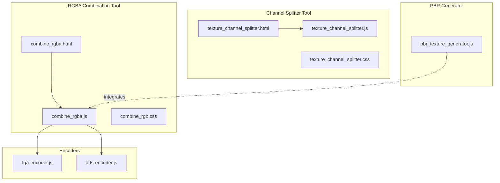
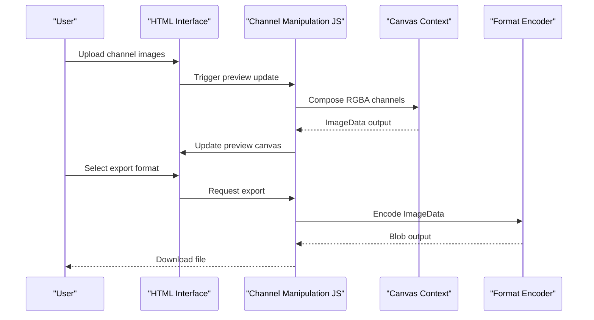
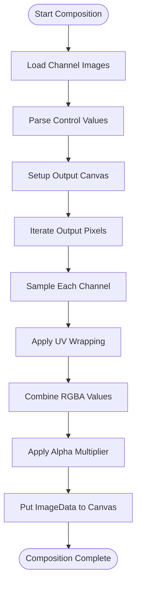
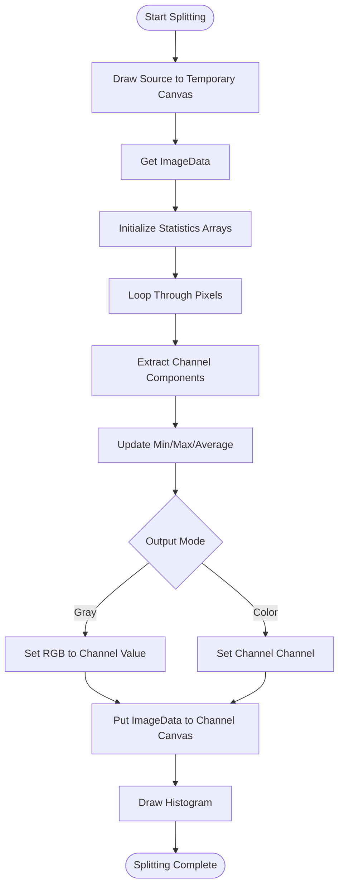
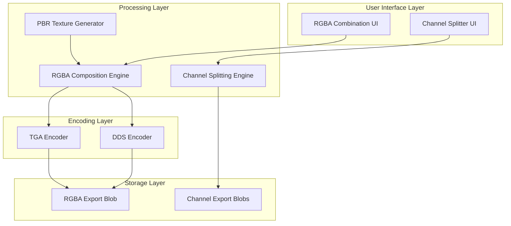
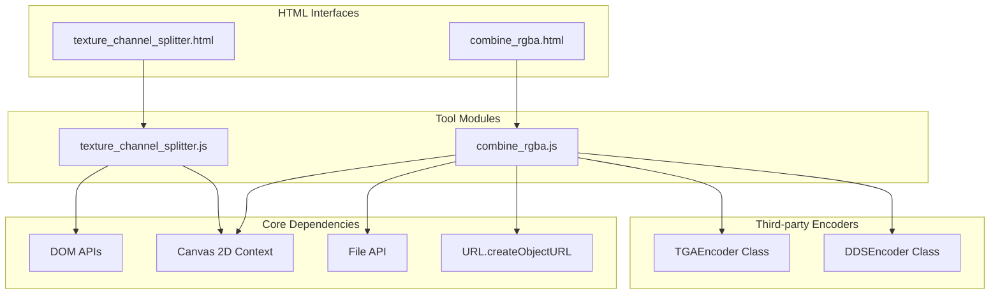

# Texture Channel Operations

<cite>
**Referenced Files in This Document**
- [combine_rgba.js](file://js/combine_rgba.js)
- [texture_channel_splitter.js](file://js/texture_channel_splitter.js)
- [combine_rgba.html](file://tools_html/combine_rgba.html)
- [texture_channel_splitter.html](file://tools_html/texture_channel_splitter.html)
- [combine_rgb.css](file://css/combine_rgb.css)
- [texture_channel_splitter.css](file://css/texture_channel_splitter.css)
- [tga-encoder.js](file://third_part/tga-encoder.js)
- [dds-encoder.js](file://third_part/dds-encoder.js)
- [pbr_texture_generator.js](file://js/pbr_texture_generator.js)
</cite>

## Table of Contents
1. [Introduction](#introduction)
2. [Project Structure](#project-structure)
3. [Core Components](#core-components)
4. [Architecture Overview](#architecture-overview)
5. [Detailed Component Analysis](#detailed-component-analysis)
6. [Dependency Analysis](#dependency-analysis)
7. [Performance Considerations](#performance-considerations)
8. [Troubleshooting Guide](#troubleshooting-guide)
9. [Conclusion](#conclusion)

## Introduction
This document provides comprehensive documentation for texture channel manipulation tools focused on RGBA combination and channel splitting operations. It covers the implementation of channel extraction algorithms, alpha blending techniques, and color channel manipulation workflows. The documentation explains canvas-based pixel manipulation processes, channel mapping procedures, and texture preparation techniques for game development. It also documents supported channel combinations (RGB, RGBA, separate channels), custom channel assignment options, and seamless texture creation methods. Practical examples demonstrate PBR workflow integration, normal map generation, and environment map processing. Performance optimization strategies for large texture files, memory management during complex channel operations, and export format considerations for different game engines are addressed.

## Project Structure
The texture channel operations are implemented through two primary JavaScript modules and their associated HTML/CSS interfaces:

- **RGBA Combination Tool**: Provides drag-and-drop interface for combining separate channel images (R, G, B, A) into a single RGBA texture with tiling, wrapping modes, and alpha blending controls.
- **Channel Splitter Tool**: Enables splitting a source image into individual R, G, B, and A channels with gray-scale or colorized output modes and statistical analysis including histograms.

**Diagram sources**
- [combine_rgba.html:1-107](file://tools_html/combine_rgba.html#L1-L107)
- [combine_rgba.js:1-335](file://js/combine_rgba.js#L1-L335)
- [combine_rgb.css:1-320](file://css/combine_rgb.css#L1-L320)
- [texture_channel_splitter.html:1-116](file://tools_html/texture_channel_splitter.html#L1-L116)
- [texture_channel_splitter.js:1-159](file://js/texture_channel_splitter.js#L1-L159)
- [texture_channel_splitter.css:1-272](file://css/texture_channel_splitter.css#L1-L272)
- [tga-encoder.js:1-51](file://third_part/tga-encoder.js#L1-L51)
- [dds-encoder.js:1-201](file://third_part/dds-encoder.js#L1-L201)
- [pbr_texture_generator.js:1-200](file://js/pbr_texture_generator.js#L1-L200)

**Section sources**
- [combine_rgba.html:1-107](file://tools_html/combine_rgba.html#L1-L107)
- [texture_channel_splitter.html:1-116](file://tools_html/texture_channel_splitter.html#L1-L116)

## Core Components
This section outlines the core components responsible for texture channel manipulation:

- **RGBA Combination Engine**: Implements channel extraction, sampling with UV wrapping modes, and canvas-based composition with alpha blending.
- **Channel Splitter Engine**: Performs pixel-wise channel separation, optional gray-scale conversion, and statistical analysis with histogram visualization.
- **Export Encoders**: Provide specialized encoders for TGA and DDS formats, enabling high-quality texture exports suitable for game engines.
- **UI Integration**: HTML pages and CSS styles provide intuitive drag-and-drop interfaces, real-time previews, and control panels for both tools.

Key capabilities include:
- Drag-and-drop file uploads with preview updates
- Real-time canvas composition with configurable tiling and wrapping
- Alpha multiplier control for fine-tuning transparency
- Export to multiple formats (PNG, JPG, WEBP, TGA, DDS)
- Statistical analysis and histogram visualization for channel splitting

**Section sources**
- [combine_rgba.js:1-335](file://js/combine_rgba.js#L1-L335)
- [texture_channel_splitter.js:1-159](file://js/texture_channel_splitter.js#L1-L159)
- [tga-encoder.js:1-51](file://third_part/tga-encoder.js#L1-L51)
- [dds-encoder.js:1-201](file://third_part/dds-encoder.js#L1-L201)

## Architecture Overview
The architecture combines modular JavaScript components with HTML/CSS interfaces and specialized encoders:

**Diagram sources**
- [combine_rgba.js:177-237](file://js/combine_rgba.js#L177-L237)
- [tga-encoder.js:41-45](file://third_part/tga-encoder.js#L41-L45)
- [dds-encoder.js:191-195](file://third_part/dds-encoder.js#L191-L195)

## Detailed Component Analysis

### RGBA Combination Tool
The RGBA combination tool enables constructing RGBA textures from separate channel sources with advanced control over sampling and blending:

#### Implementation Details
- **Channel Management**: Supports four channels (R, G, B, A) with independent file inputs and drag-and-drop zones.
- **Sampling Algorithm**: Implements UV coordinate wrapping with support for repeat, mirror, and clamp modes.
- **Luminance Extraction**: Provides luminance-based channel assignment using standard luminance coefficients.
- **Tiling Controls**: Per-channel tiling controls with numeric and slider synchronization.
- **Alpha Blending**: Global alpha multiplier for adjusting transparency across the composite.

#### Canvas Composition Workflow

**Diagram sources**
- [combine_rgba.js:240-268](file://js/combine_rgba.js#L240-L268)
- [combine_rgba.js:74-87](file://js/combine_rgba.js#L74-L87)

#### Export Formats and Quality
- **TGA Export**: Uses dedicated TGA encoder with RGBA pixel ordering.
- **DDS Export**: Provides uncompressed and compressed (DXT5) DDS encoding for game engine compatibility.
- **Standard Formats**: PNG, JPG, and WEBP exports with configurable quality settings.

**Section sources**
- [combine_rgba.js:1-335](file://js/combine_rgba.js#L1-L335)
- [combine_rgba.html:1-107](file://tools_html/combine_rgba.html#L1-L107)
- [combine_rgb.css:1-320](file://css/combine_rgb.css#L1-L320)
- [tga-encoder.js:1-51](file://third_part/tga-encoder.js#L1-L51)
- [dds-encoder.js:1-201](file://third_part/dds-encoder.js#L1-L201)

### Channel Splitter Tool
The channel splitter tool decomposes source images into individual channels with statistical analysis:

#### Implementation Details
- **Channel Separation**: Processes each pixel to extract R, G, B, and A components.
- **Output Modes**: Gray-scale mode produces monochrome channel images; colorized mode preserves original channel colors.
- **Statistics Collection**: Computes minimum, maximum, and average values for each channel.
- **Histogram Generation**: Creates visual histograms for distribution analysis.

#### Pixel Processing Algorithm

**Diagram sources**
- [texture_channel_splitter.js:55-107](file://js/texture_channel_splitter.js#L55-L107)
- [texture_channel_splitter.js:109-130](file://js/texture_channel_splitter.js#L109-L130)

**Section sources**
- [texture_channel_splitter.js:1-159](file://js/texture_channel_splitter.js#L1-L159)
- [texture_channel_splitter.html:1-116](file://tools_html/texture_channel_splitter.html#L1-L116)
- [texture_channel_splitter.css:1-272](file://css/texture_channel_splitter.css#L1-L272)

### Export Encoders
Specialized encoders enable high-quality texture exports for game development workflows:

#### TGA Encoder
- **Pixel Ordering**: Converts RGBA to BGRA format as required by TGA specification.
- **Header Construction**: Creates standard TGA headers with width, height, and pixel depth.
- **Scanline Processing**: Writes pixel data in bottom-to-top order for TGA compliance.

#### DDS Encoder
- **Header Structure**: Constructs DDS headers with appropriate flags and pixel formats.
- **Compression Options**: Supports both uncompressed RGBA and compressed DXT5 formats.
- **Block Compression**: Implements DXT5 compression algorithm for alpha gradients.

**Section sources**
- [tga-encoder.js:1-51](file://third_part/tga-encoder.js#L1-L51)
- [dds-encoder.js:1-201](file://third_part/dds-encoder.js#L1-L201)

## Architecture Overview
The tools integrate through a cohesive architecture that separates concerns between UI presentation, data processing, and format-specific encoding:

**Diagram sources**
- [combine_rgba.js:177-237](file://js/combine_rgba.js#L177-L237)
- [texture_channel_splitter.js:132-146](file://js/texture_channel_splitter.js#L132-L146)
- [tga-encoder.js:41-45](file://third_part/tga-encoder.js#L41-L45)
- [dds-encoder.js:191-195](file://third_part/dds-encoder.js#L191-L195)

## Detailed Component Analysis

### RGBA Combination Engine
The combination engine implements sophisticated channel manipulation with the following key features:

#### Sampling and Wrapping
- **UV Coordinate System**: Maps normalized coordinates to pixel indices with boundary handling.
- **Wrapping Modes**: Supports repeat, mirror, and clamp wrapping for seamless texture creation.
- **Interpolation**: Uses nearest-neighbor sampling for precise control over channel extraction.

#### Channel Assignment and Processing
- **Custom Source Channels**: Each channel can source from R, G, B, A, or luminance of the source image.
- **Per-Channel Controls**: Independent tiling, wrapping, and source selection for each channel.
- **Alpha Management**: Separate alpha channel with global multiplier for transparency control.

#### Canvas-Based Processing
- **ImageData Manipulation**: Direct pixel manipulation for optimal performance.
- **Real-time Preview**: Immediate feedback through canvas rendering.
- **Memory Efficiency**: Temporary canvases are managed to minimize memory footprint.

**Section sources**
- [combine_rgba.js:74-87](file://js/combine_rgba.js#L74-L87)
- [combine_rgba.js:240-268](file://js/combine_rgba.js#L240-L268)
- [combine_rgba.js:54-61](file://js/combine_rgba.js#L54-L61)

### Channel Splitting Engine
The splitting engine provides comprehensive channel decomposition with analytical capabilities:

#### Statistical Analysis
- **Range Analysis**: Tracks minimum and maximum values across each channel.
- **Average Calculation**: Computes mean intensity for each channel.
- **Distribution Analysis**: Generates histograms for visualizing channel distributions.

#### Output Generation
- **Gray-scale Mode**: Produces monochrome channel images for clean separation.
- **Colorized Mode**: Preserves channel identity through color coding.
- **Consistent Formatting**: Ensures uniform output dimensions and pixel formats.

**Section sources**
- [texture_channel_splitter.js:55-107](file://js/texture_channel_splitter.js#L55-L107)
- [texture_channel_splitter.js:109-130](file://js/texture_channel_splitter.js#L109-L130)

### PBR Workflow Integration
The channel manipulation tools integrate seamlessly with broader PBR texture generation workflows:

#### Normal Map Generation
- **Height Field Processing**: Utilizes grayscale height maps for normal map computation.
- **Gradient Calculation**: Implements Sobel and Scharr operators for gradient estimation.
- **Direction Vector Normalization**: Produces normalized tangent-space normal vectors.

#### Environment Map Processing
- **HDR Texture Handling**: Supports high dynamic range environment textures.
- **Bilinear Sampling**: Enables smooth sampling across environment maps.
- **Background Rendering**: Integrates environment lighting into material systems.

**Section sources**
- [pbr_texture_generator.js:101-140](file://js/pbr_texture_generator.js#L101-L140)
- [pbr_texture_generator.js:383-426](file://js/pbr_texture_generator.js#L383-L426)

## Dependency Analysis
The tools exhibit well-defined dependencies that support modularity and maintainability:

**Diagram sources**
- [combine_rgba.js:1-335](file://js/combine_rgba.js#L1-L335)
- [texture_channel_splitter.js:1-159](file://js/texture_channel_splitter.js#L1-L159)
- [tga-encoder.js:1-51](file://third_part/tga-encoder.js#L1-L51)
- [dds-encoder.js:1-201](file://third_part/dds-encoder.js#L1-L201)

**Section sources**
- [combine_rgba.js:1-335](file://js/combine_rgba.js#L1-L335)
- [texture_channel_splitter.js:1-159](file://js/texture_channel_splitter.js#L1-L159)

## Performance Considerations
The tools implement several performance optimization strategies for handling large texture files:

### Memory Management
- **Temporary Canvas Isolation**: Separate canvases for intermediate processing prevent memory accumulation.
- **Object URL Cleanup**: Automatic revocation of temporary URLs prevents memory leaks.
- **ImageData Reuse**: Efficient pixel data manipulation minimizes memory allocations.

### Processing Optimizations
- **Direct Pixel Access**: ImageData manipulation provides low-level control over pixel operations.
- **Efficient Loops**: Single-pass pixel processing reduces computational overhead.
- **Early Termination**: Validation checks prevent unnecessary processing of invalid inputs.

### Large Texture Handling
- **Resolution Limits**: Input validation ensures reasonable canvas sizes for browser performance.
- **Quality Scaling**: Export quality controls balance file size with visual fidelity.
- **Format Selection**: DDS compression reduces storage requirements for game engines.

**Section sources**
- [combine_rgba.js:26-52](file://js/combine_rgba.js#L26-L52)
- [combine_rgba.js:89-93](file://js/combine_rgba.js#L89-L93)
- [dds-encoder.js:30-42](file://third_part/dds-encoder.js#L30-L42)

## Troubleshooting Guide
Common issues and their solutions:

### File Loading Issues
- **Unsupported Formats**: Verify image formats are supported (JPG, PNG, BMP, WEBP, TGA).
- **Corrupted Files**: Check file integrity and re-upload problematic images.
- **Large File Sizes**: Consider reducing resolution or using compressed formats.

### Canvas Rendering Problems
- **Cross-origin Issues**: Ensure images are served with proper CORS headers.
- **Memory Constraints**: Close unused tabs and reduce canvas dimensions.
- **Performance Degradation**: Use lower resolutions for testing and higher for final exports.

### Export Failures
- **Format Compatibility**: Verify target game engine supports chosen export format.
- **Quality Settings**: Adjust quality parameters for optimal file size vs. quality balance.
- **Browser Limitations**: Some browsers may have restrictions on large file downloads.

**Section sources**
- [combine_rgba.js:105-112](file://js/combine_rgba.js#L105-L112)
- [combine_rgba.js:225-236](file://js/combine_rgba.js#L225-L236)

## Conclusion
The texture channel manipulation tools provide a comprehensive solution for game development workflows requiring precise control over texture channels. The RGBA combination tool offers advanced sampling, wrapping, and blending capabilities with real-time preview and multiple export formats. The channel splitter tool delivers detailed statistical analysis and visualization for texture inspection and optimization. Together with specialized encoders for TGA and DDS formats, these tools support efficient texture preparation for modern game engines. The modular architecture, performance optimizations, and extensive customization options make them valuable additions to any texture processing pipeline.