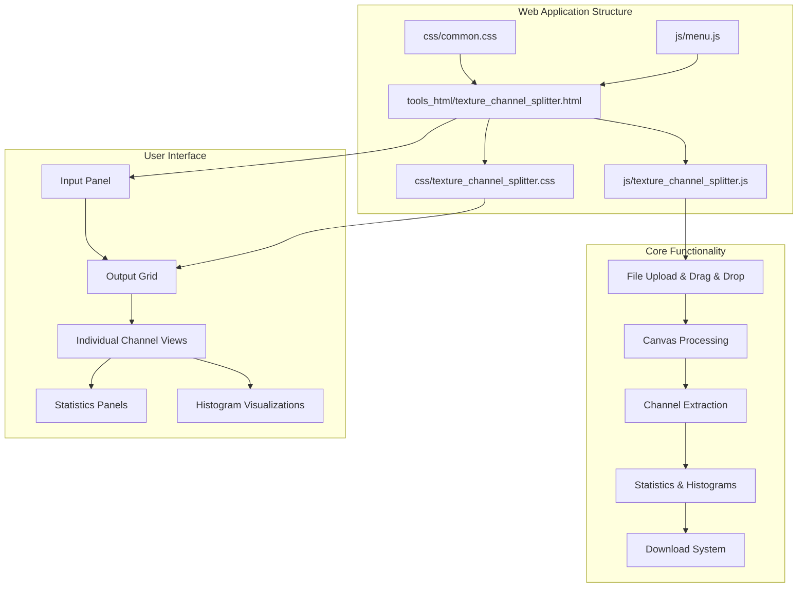
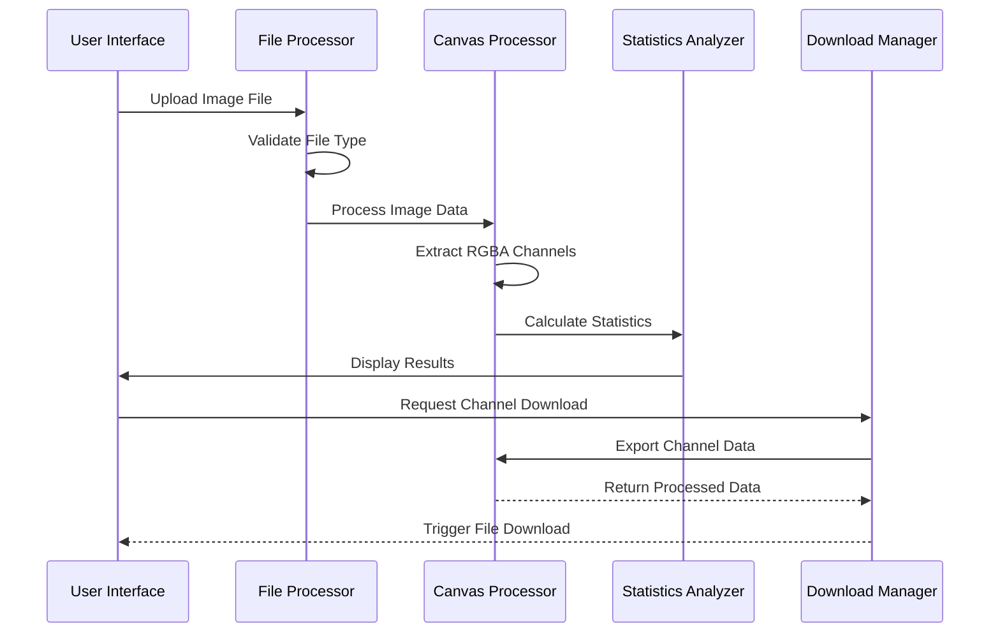
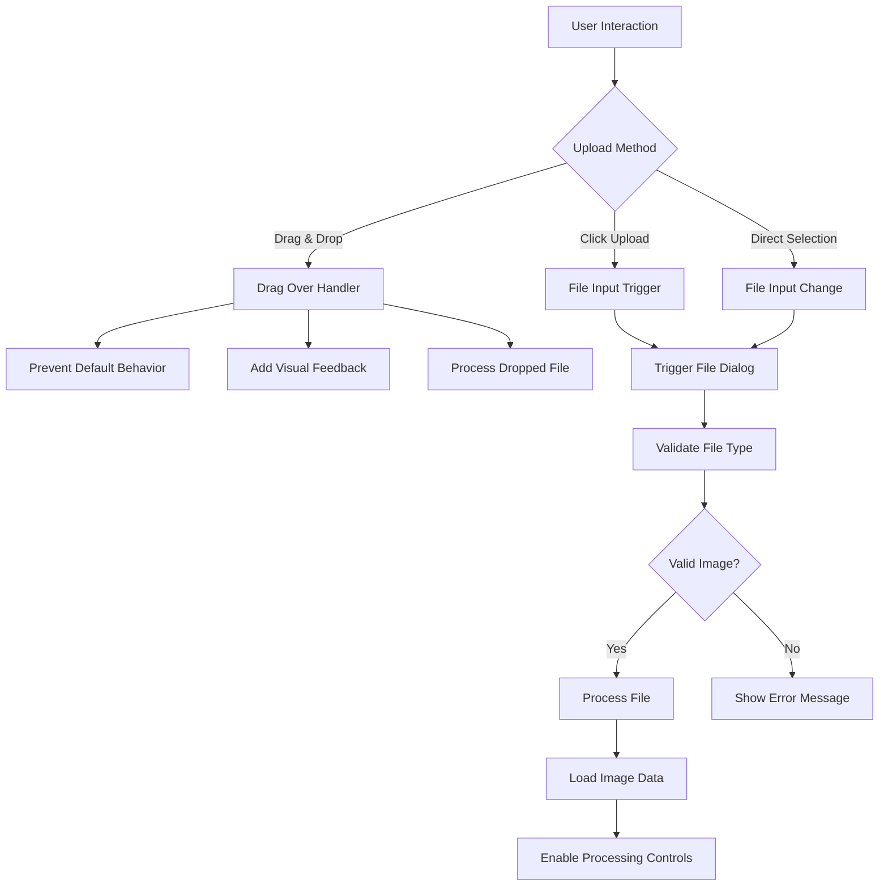
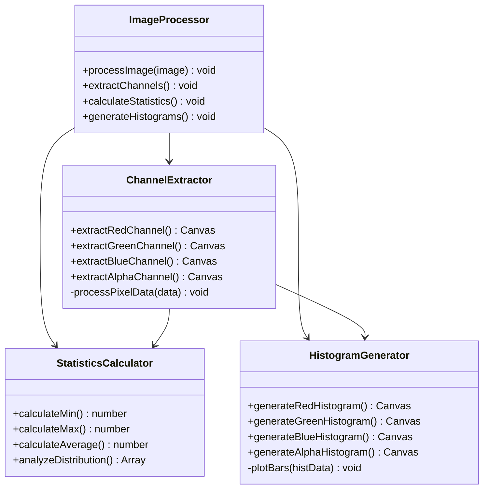
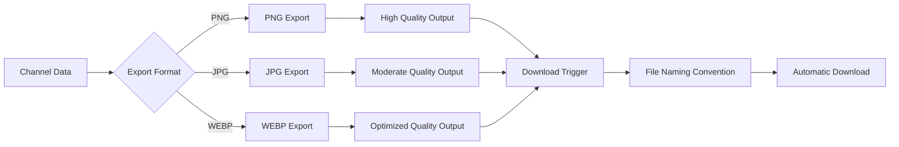
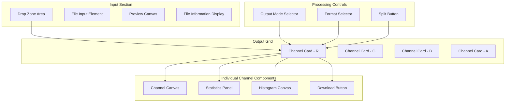
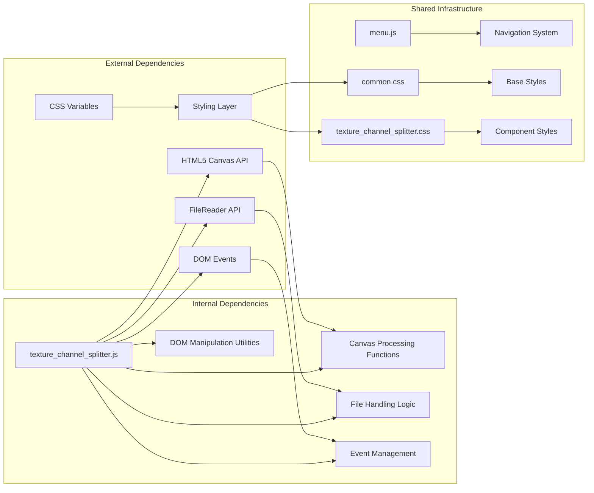

# Texture Channel Splitter

<cite>
**Referenced Files in This Document**
- [texture_channel_splitter.js](file://js/texture_channel_splitter.js)
- [texture_channel_splitter.html](file://tools_html/texture_channel_splitter.html)
- [texture_channel_splitter.css](file://css/texture_channel_splitter.css)
- [common.css](file://css/common.css)
- [menu.js](file://js/menu.js)
</cite>

## Table of Contents
1. [Introduction](#introduction)
2. [Project Structure](#project-structure)
3. [Core Components](#core-components)
4. [Architecture Overview](#architecture-overview)
5. [Detailed Component Analysis](#detailed-component-analysis)
6. [Dependency Analysis](#dependency-analysis)
7. [Performance Considerations](#performance-considerations)
8. [Troubleshooting Guide](#troubleshooting-guide)
9. [Conclusion](#conclusion)

## Introduction

The Texture Channel Splitter is a specialized web-based tool designed for game developers, artists, and technical artists who need to analyze and extract individual color channels from texture images. This utility enables users to separate RGBA textures into their constituent Red (R), Green (G), Blue (B), and Alpha (A) channels, providing valuable insights into texture composition and facilitating advanced material creation workflows.

The tool operates entirely in the browser using modern web technologies, specifically leveraging the Canvas API for pixel manipulation and the File API for local file processing. It provides both grayscale and colored output modes, along with comprehensive statistical analysis and visual histograms for each extracted channel.

## Project Structure

The Texture Channel Splitter follows a modular architecture typical of web applications, with clear separation between presentation, logic, and styling:

**Diagram sources**
- [texture_channel_splitter.html:1-116](file://tools_html/texture_channel_splitter.html#L1-L116)
- [texture_channel_splitter.js:1-159](file://js/texture_channel_splitter.js#L1-L159)

**Section sources**
- [texture_channel_splitter.html:1-116](file://tools_html/texture_channel_splitter.html#L1-L116)
- [texture_channel_splitter.css:1-273](file://css/texture_channel_splitter.css#L1-L273)

## Core Components

### File Processing Engine

The core file processing functionality handles image upload through multiple methods including drag-and-drop, click-to-upload, and traditional file input selection. The system supports a wide range of image formats including JPEG, PNG, BMP, WebP, and TGA.

### Canvas-Based Channel Extraction

The extraction process utilizes the HTML5 Canvas API to manipulate pixel data directly. The system creates temporary canvases for processing and employs ImageData objects to access individual pixel components. This approach ensures high-performance processing while maintaining precision.

### Statistical Analysis System

Each extracted channel undergoes comprehensive statistical analysis including minimum, maximum, and average value calculations. These statistics provide immediate insight into channel distribution and help identify potential issues with texture data.

### Histogram Generation

The tool generates visual histograms for each channel, displaying the frequency distribution of pixel values across the 0-255 range. This visualization helps artists understand texture characteristics and make informed decisions about material workflows.

**Section sources**
- [texture_channel_splitter.js:26-107](file://js/texture_channel_splitter.js#L26-L107)
- [texture_channel_splitter.js:109-130](file://js/texture_channel_splitter.js#L109-L130)

## Architecture Overview

The Texture Channel Splitter implements a clean separation of concerns architecture with distinct layers for user interface, business logic, and data processing:

**Diagram sources**
- [texture_channel_splitter.js:9-40](file://js/texture_channel_splitter.js#L9-L40)
- [texture_channel_splitter.js:55-107](file://js/texture_channel_splitter.js#L55-L107)
- [texture_channel_splitter.js:132-146](file://js/texture_channel_splitter.js#L132-L146)

The architecture follows a functional programming pattern with clearly defined modules responsible for specific tasks. The system maintains immutability where possible and uses pure functions for data transformation.

**Section sources**
- [texture_channel_splitter.js:1-159](file://js/texture_channel_splitter.js#L1-L159)

## Detailed Component Analysis

### File Upload and Validation System

The file upload mechanism implements multiple interaction patterns to accommodate different user preferences and accessibility requirements:

**Diagram sources**
- [texture_channel_splitter.js:9-24](file://js/texture_channel_splitter.js#L9-L24)
- [texture_channel_splitter.js:26-40](file://js/texture_channel_splitter.js#L26-L40)

The validation system checks MIME types to ensure only image files are processed, preventing errors during subsequent canvas operations.

**Section sources**
- [texture_channel_splitter.js:26-40](file://js/texture_channel_splitter.js#L26-L40)

### Canvas Processing Pipeline

The core processing pipeline transforms uploaded images into individual channel outputs through a series of coordinated steps:

**Diagram sources**
- [texture_channel_splitter.js:55-107](file://js/texture_channel_splitter.js#L55-L107)
- [texture_channel_splitter.js:109-130](file://js/texture_channel_splitter.js#L109-L130)

The processing engine operates on the RGBA pixel data array, extracting individual channel values while maintaining the original image dimensions and aspect ratio.

**Section sources**
- [texture_channel_splitter.js:55-107](file://js/texture_channel_splitter.js#L55-L107)

### Output Generation and Download System

The download system provides flexible export options with support for multiple image formats:

**Diagram sources**
- [texture_channel_splitter.js:132-146](file://js/texture_channel_splitter.js#L132-L146)

The system automatically generates appropriate filenames based on the selected channel and format, ensuring organized output for downstream processing.

**Section sources**
- [texture_channel_splitter.js:132-146](file://js/texture_channel_splitter.js#L132-L146)

### User Interface Components

The user interface follows modern web design principles with responsive layouts and intuitive interaction patterns:

**Diagram sources**
- [texture_channel_splitter.html:25-109](file://tools_html/texture_channel_splitter.html#L25-L109)
- [texture_channel_splitter.css:159-273](file://css/texture_channel_splitter.css#L159-L273)

The responsive design ensures optimal viewing across different screen sizes and device orientations.

**Section sources**
- [texture_channel_splitter.html:25-109](file://tools_html/texture_channel_splitter.html#L25-L109)
- [texture_channel_splitter.css:159-273](file://css/texture_channel_splitter.css#L159-L273)

## Dependency Analysis

The Texture Channel Splitter maintains minimal external dependencies while leveraging standard web APIs:

**Diagram sources**
- [texture_channel_splitter.js:1-159](file://js/texture_channel_splitter.js#L1-L159)
- [menu.js:1-273](file://js/menu.js#L1-L273)

The tool's architecture promotes modularity and maintainability through clear separation of concerns and minimal coupling between components.

**Section sources**
- [texture_channel_splitter.js:1-159](file://js/texture_channel_splitter.js#L1-L159)
- [menu.js:1-273](file://js/menu.js#L1-L273)

## Performance Considerations

The Texture Channel Splitter is optimized for efficient client-side processing with several performance-enhancing features:

### Memory Management
- Temporary canvases are created and destroyed as needed to minimize memory footprint
- Pixel data arrays are processed in-place to reduce memory allocation overhead
- Large image handling includes progressive loading to prevent UI blocking

### Processing Efficiency
- Single-pass pixel iteration reduces computational overhead
- Optimized histogram calculation using pre-allocated arrays
- Efficient DOM updates batched to minimize reflows

### Browser Compatibility
- Uses standard web APIs available across modern browsers
- Graceful degradation for unsupported features
- Responsive design adapts to various device capabilities

## Troubleshooting Guide

### Common Issues and Solutions

**File Upload Problems**
- Verify file format compatibility (JPG, PNG, BMP, WebP, TGA)
- Check file size limitations and browser memory constraints
- Ensure proper MIME type detection for drag-and-drop operations

**Canvas Processing Errors**
- Confirm image dimensions are within browser limits
- Verify WebGL support for advanced rendering features
- Check for cross-origin restrictions on image sources

**Performance Issues**
- Large images may cause browser slowdowns
- Mobile devices may have limited processing power
- Clear browser cache and cookies if experiencing persistent issues

**Download Problems**
- Verify browser allows programmatic downloads
- Check download permissions and popup blockers
- Ensure sufficient disk space for exported files

**Section sources**
- [texture_channel_splitter.js:26-40](file://js/texture_channel_splitter.js#L26-L40)
- [texture_channel_splitter.js:132-146](file://js/texture_channel_splitter.js#L132-L146)

## Conclusion

The Texture Channel Splitter represents a sophisticated yet accessible solution for texture analysis and channel extraction in web-based environments. Its architecture demonstrates best practices in client-side image processing, combining modern web APIs with thoughtful user interface design.

The tool's strength lies in its ability to provide professional-grade functionality while maintaining simplicity of use. The comprehensive statistical analysis and visual feedback systems make it invaluable for game development workflows, particularly in material creation and texture optimization processes.

Future enhancements could include support for additional image formats, batch processing capabilities, and integration with popular game engines' asset pipelines. The modular architecture provides a solid foundation for such extensions while maintaining backward compatibility and performance standards.