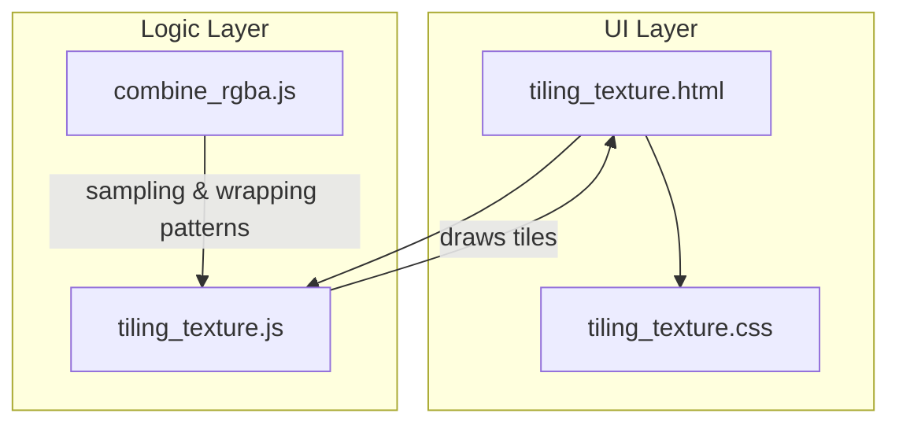
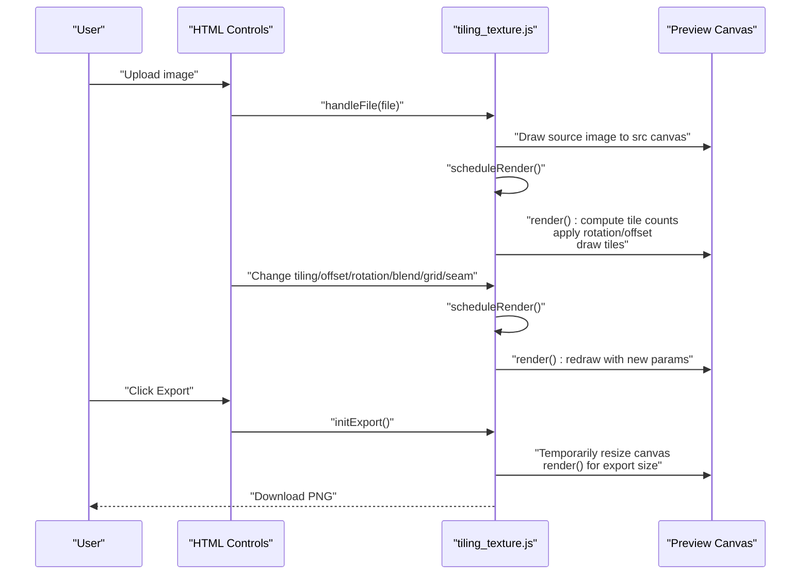
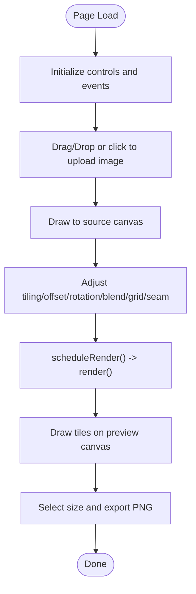
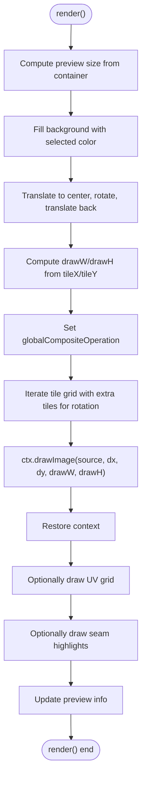
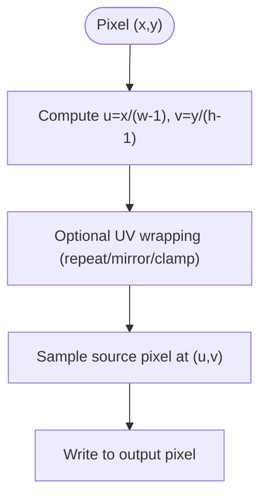
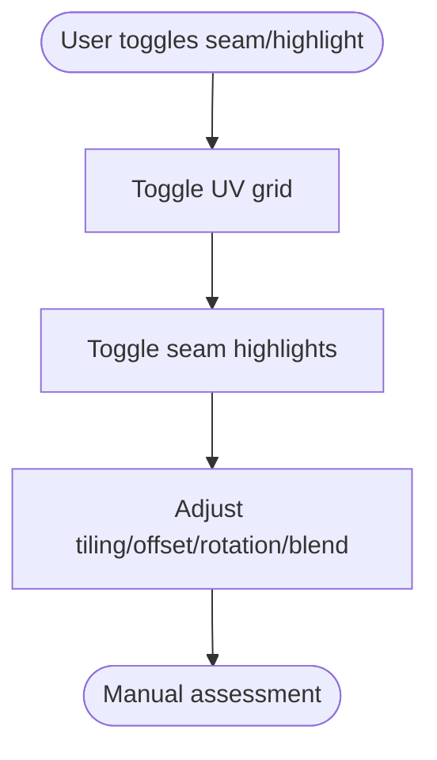
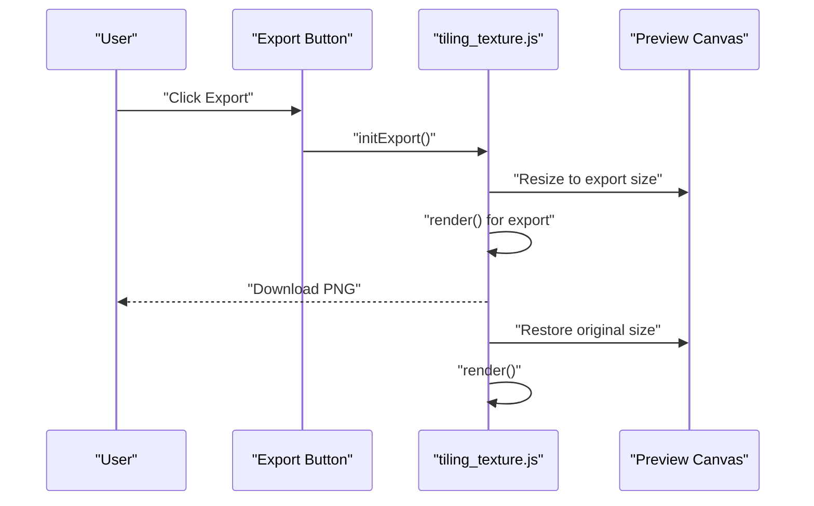
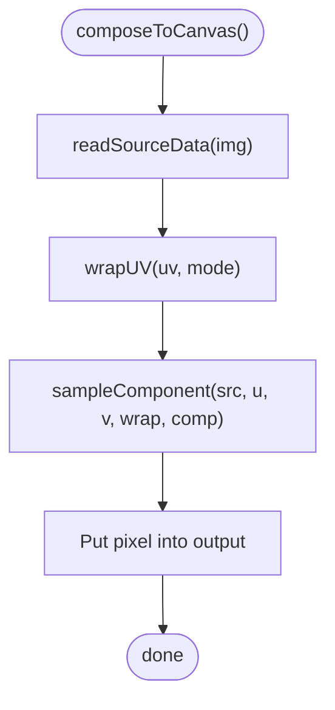
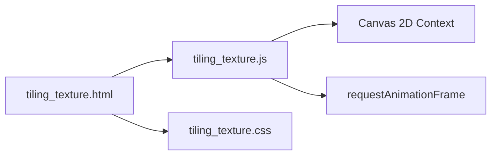

# Tiling Texture Preview

<cite>
**Referenced Files in This Document**
- [tiling_texture.html](file://tools_html/tiling_texture.html)
- [tiling_texture.js](file://js/tiling_texture.js)
- [tiling_texture.css](file://css/tiling_texture.css)
- [combine_rgba.js](file://js/combine_rgba.js)
</cite>

## Table of Contents
1. [Introduction](#introduction)
2. [Project Structure](#project-structure)
3. [Core Components](#core-components)
4. [Architecture Overview](#architecture-overview)
5. [Detailed Component Analysis](#detailed-component-analysis)
6. [Dependency Analysis](#dependency-analysis)
7. [Performance Considerations](#performance-considerations)
8. [Troubleshooting Guide](#troubleshooting-guide)
9. [Conclusion](#conclusion)
10. [Appendices](#appendices)

## Introduction
This document describes the Tiling Texture Preview tool, a browser-based utility for creating and visualizing seamless tiled textures. It focuses on:
- Real-time preview rendering with tiling, rotation, UV offset, and blending modes
- Canvas-based texture wrapping and UV grid overlays
- Seam highlighting for identifying visible seams
- Export pipeline for generating tiled preview images
- Practical workflows for seamless texture creation and quality assessment

It does not implement automatic seam detection or correction algorithms; instead, it provides visual aids (UV grid and seam highlights) to help users manually assess and adjust tiling parameters for seamless appearance.

## Project Structure
The tool is organized into a minimal HTML page, a JavaScript controller, and a stylesheet. A related utility (RGBA Channel Compositor) demonstrates advanced sampling and wrapping techniques that complement the tiling tool’s capabilities.

**Diagram sources**
- [tiling_texture.html:1-116](file://tools_html/tiling_texture.html#L1-L116)
- [tiling_texture.js:1-208](file://js/tiling_texture.js#L1-L208)
- [tiling_texture.css:1-216](file://css/tiling_texture.css#L1-L216)
- [combine_rgba.js:1-335](file://js/combine_rgba.js#L1-L335)

**Section sources**
- [tiling_texture.html:1-116](file://tools_html/tiling_texture.html#L1-L116)
- [tiling_texture.js:1-208](file://js/tiling_texture.js#L1-L208)
- [tiling_texture.css:1-216](file://css/tiling_texture.css#L1-L216)
- [combine_rgba.js:1-335](file://js/combine_rgba.js#L1-L335)

## Core Components
- HTML layout defines the controls panel (upload zone, tiling settings, display options, export) and the preview canvas area.
- JavaScript handles drag-and-drop upload, real-time rendering, and export.
- CSS styles the UI and preview container.

Key responsibilities:
- Upload and preview source image
- Compute tile counts and draw positions
- Apply rotation and UV offsets
- Render UV grid and seam highlights
- Export tiled preview at configurable sizes

**Section sources**
- [tiling_texture.html:20-110](file://tools_html/tiling_texture.html#L20-L110)
- [tiling_texture.js:24-149](file://js/tiling_texture.js#L24-L149)
- [tiling_texture.css:21-216](file://css/tiling_texture.css#L21-L216)

## Architecture Overview
The tool follows a straightforward event-driven architecture:
- DOMContentLoaded initializes UI and event listeners
- User actions trigger re-render via requestAnimationFrame
- Rendering draws the source image multiple times across the canvas with computed transforms
- Export temporarily resizes the preview canvas and downloads the result

**Diagram sources**
- [tiling_texture.js:24-199](file://js/tiling_texture.js#L24-L199)
- [tiling_texture.html:30-100](file://tools_html/tiling_texture.html#L30-L100)

## Detailed Component Analysis

### HTML Layout and Controls
- Input section: Drop zone for images, hidden file input, source preview canvas, and info label
- Tiling settings: Tile X/Y sliders, UV offset X/Y sliders, rotation slider
- Display options: Blend mode selector, background color picker, toggle for UV grid and seam highlights
- Export section: Output size selection and export button

**Diagram sources**
- [tiling_texture.html:25-110](file://tools_html/tiling_texture.html#L25-L110)
- [tiling_texture.js:24-199](file://js/tiling_texture.js#L24-L199)

**Section sources**
- [tiling_texture.html:25-110](file://tools_html/tiling_texture.html#L25-L110)

### Rendering Pipeline
The renderer computes tile counts and draws the source image across the canvas with rotation and UV offsets. It supports multiple blend modes and overlays UV grid and seam highlights.

**Diagram sources**
- [tiling_texture.js:49-149](file://js/tiling_texture.js#L49-L149)

**Section sources**
- [tiling_texture.js:49-149](file://js/tiling_texture.js#L49-L149)

### Canvas-Based Texture Wrapping and UV Mapping
- UV coordinates are derived from pixel positions normalized by output size minus one.
- The tiling tool uses direct drawing with computed offsets; it does not implement explicit UV wrapping modes (repeat/mirror/clamp) in the tiling loop.
- The related RGBA Channel Compositor demonstrates UV wrapping and sampling patterns that could inspire future enhancements to the tiling tool.

**Diagram sources**
- [combine_rgba.js:254-267](file://js/combine_rgba.js#L254-L267)
- [combine_rgba.js:63-87](file://js/combine_rgba.js#L63-L87)

**Section sources**
- [combine_rgba.js:63-87](file://js/combine_rgba.js#L63-L87)
- [combine_rgba.js:254-267](file://js/combine_rgba.js#L254-L267)

### Seam Detection and Highlighting
- The tool does not implement automatic seam detection or correction.
- It provides visual aids:
  - UV grid overlay to visualize tile boundaries
  - Seam highlight overlay to outline vertical and horizontal seams
- Users can adjust tiling, UV offsets, rotation, and blend modes to minimize visible seams.

**Diagram sources**
- [tiling_texture.js:104-142](file://js/tiling_texture.js#L104-L142)

**Section sources**
- [tiling_texture.js:104-142](file://js/tiling_texture.js#L104-L142)

### Export Workflow
- Export button triggers a temporary resize of the preview canvas to the selected output size, renders the scene, and downloads a PNG.
- After download, the preview canvas is restored to its previous size and re-rendered.

**Diagram sources**
- [tiling_texture.js:174-199](file://js/tiling_texture.js#L174-L199)

**Section sources**
- [tiling_texture.js:174-199](file://js/tiling_texture.js#L174-L199)

### Related Sampling Patterns (RGBA Channel Compositor)
While the tiling tool uses direct drawing, the RGBA Channel Compositor demonstrates:
- UV wrapping modes (repeat, mirror, clamp)
- Component sampling (R/G/B/A or luminance)
- Iterative pixel composition across a full-resolution output

These patterns illustrate advanced sampling and wrapping techniques that could inform future enhancements to the tiling tool.

**Diagram sources**
- [combine_rgba.js:54-87](file://js/combine_rgba.js#L54-L87)
- [combine_rgba.js:240-268](file://js/combine_rgba.js#L240-L268)

**Section sources**
- [combine_rgba.js:54-87](file://js/combine_rgba.js#L54-L87)
- [combine_rgba.js:240-268](file://js/combine_rgba.js#L240-L268)

## Dependency Analysis
- The tiling tool depends on:
  - HTML controls for user input
  - Canvas 2D context for rendering
  - requestAnimationFrame for smooth updates
- No external libraries are used; all rendering is performed with native browser APIs.

**Diagram sources**
- [tiling_texture.html:1-116](file://tools_html/tiling_texture.html#L1-L116)
- [tiling_texture.js:1-208](file://js/tiling_texture.js#L1-L208)
- [tiling_texture.css:1-216](file://css/tiling_texture.css#L1-L216)

**Section sources**
- [tiling_texture.html:1-116](file://tools_html/tiling_texture.html#L1-L116)
- [tiling_texture.js:1-208](file://js/tiling_texture.js#L1-L208)
- [tiling_texture.css:1-216](file://css/tiling_texture.css#L1-L216)

## Performance Considerations
- Rendering strategy:
  - Uses requestAnimationFrame to batch UI updates and reduce jank
  - Draws tiles in a grid around the viewport, with extra tiles to account for rotation
- Canvas sizing:
  - Resizes preview canvas to fit the container while maintaining a minimum size
- Export sizing:
  - Temporarily resizes the canvas to the export dimension to produce higher-resolution previews
- Recommendations:
  - Prefer smaller source images to reduce draw time
  - Limit tile counts to reasonable values to avoid excessive draw calls
  - Disable seam highlights and grid overlays during heavy editing sessions
  - Use lower export sizes for quick iterations, then increase for final exports

[No sources needed since this section provides general guidance]

## Troubleshooting Guide
- No image appears after upload:
  - Ensure the file is an image type accepted by the upload zone
  - Check console for errors during file reading
- Preview not updating:
  - Verify that controls are bound and scheduleRender is triggered on input changes
- Export fails:
  - Confirm the export button is enabled after uploading an image
  - Try a different output size if the export canvas becomes too large

**Section sources**
- [tiling_texture.js:24-42](file://js/tiling_texture.js#L24-L42)
- [tiling_texture.js:151-172](file://js/tiling_texture.js#L151-L172)
- [tiling_texture.js:174-199](file://js/tiling_texture.js#L174-L199)

## Conclusion
The Tiling Texture Preview tool provides a lightweight, real-time solution for visualizing tiled textures in the browser. It offers:
- Immediate feedback on tiling, rotation, and UV offset
- Visual aids for seam detection
- Efficient export pipeline for high-resolution previews

Future enhancements could incorporate automatic seam detection and correction, advanced sampling and filtering, and improved performance for large textures.

[No sources needed since this section summarizes without analyzing specific files]

## Appendices

### Practical Workflows
- Seamless texture creation:
  - Upload a candidate texture
  - Adjust Tile X/Y to match desired tiling ratio
  - Use UV Offset X/Y to fine-tune alignment
  - Rotate to align patterns
  - Toggle Seam Highlights and UV Grid to identify misalignments
  - Iterate until seams are visually acceptable
- Pattern repetition analysis:
  - Observe UV grid lines to confirm periodicity
  - Compare seams across tile boundaries
- Quality assessment:
  - Export at larger sizes for closer inspection
  - Test in target engine or viewer to validate seamless appearance

[No sources needed since this section provides general guidance]

### Browser and Engine Export Notes
- Export format: PNG is generated for tiled previews
- Resolution scaling: Export size is configurable; larger sizes improve quality but increase memory usage
- Engine compatibility: Use exported PNGs as-is for most engines; adjust tiling parameters according to engine texture settings

[No sources needed since this section provides general guidance]