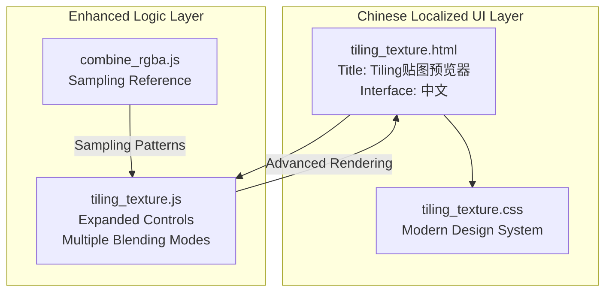
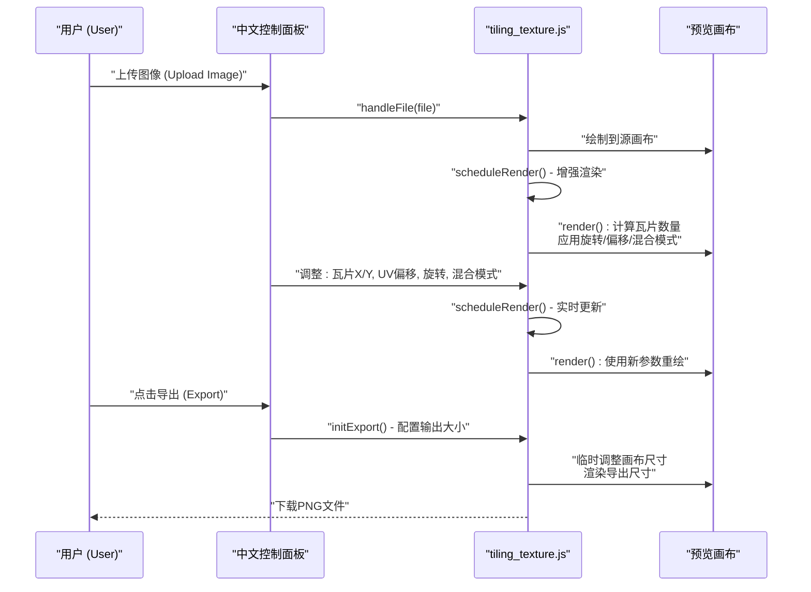
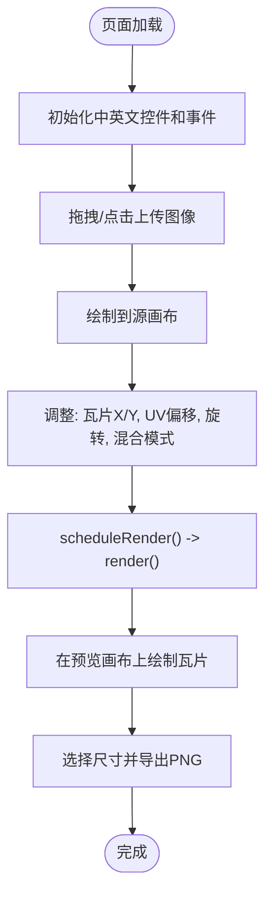
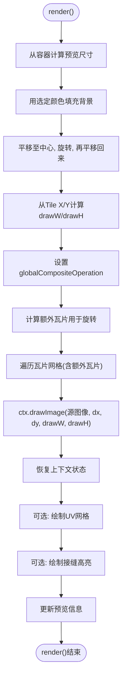
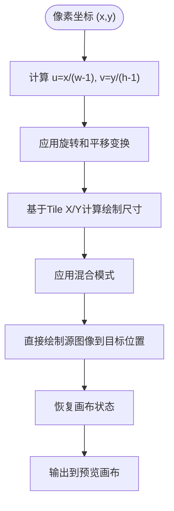
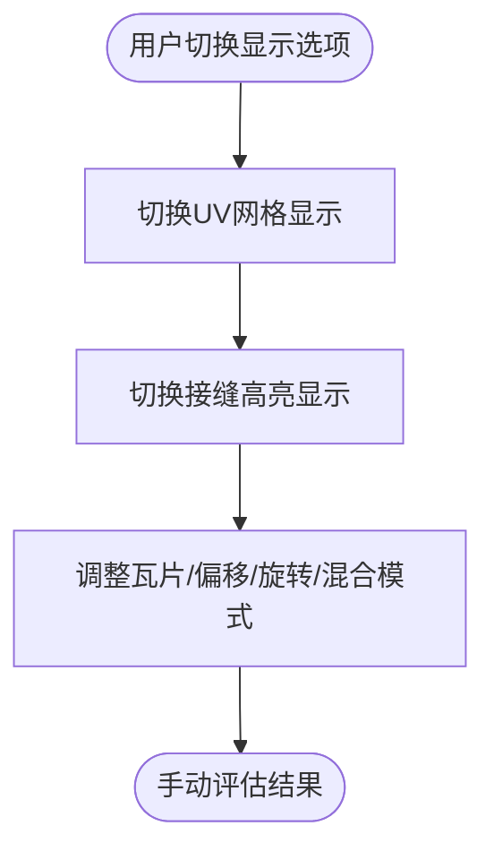
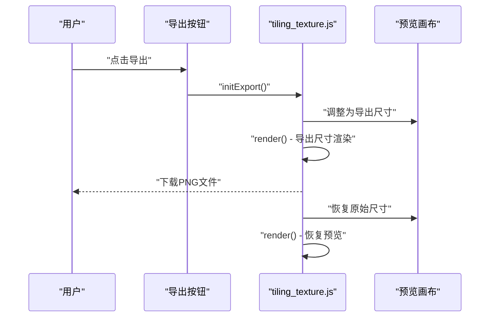
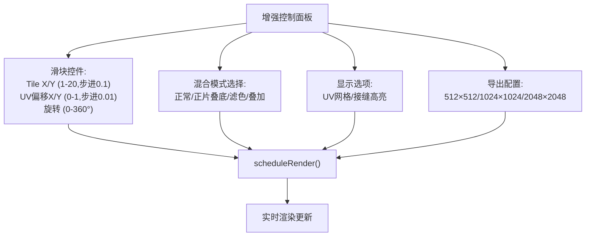
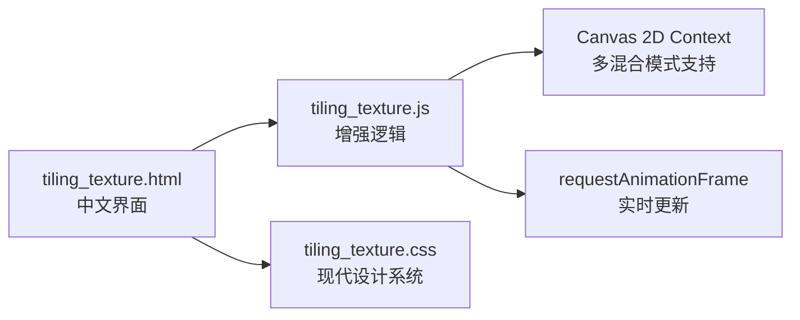

# Tiling Texture Preview

<cite>
**Referenced Files in This Document**
- [tiling_texture.html](file://tools_html/tiling_texture.html)
- [tiling_texture.js](file://js/tiling_texture.js)
- [tiling_texture.css](file://css/tiling_texture.css)
- [combine_rgba.js](file://js/combine_rgba.js)
</cite>

## Update Summary
**Changes Made**
- Updated title to reflect Chinese localization: "Tiling贴图预览器" (Tiling Texture Previewer)
- Enhanced functionality with adjustable tile counts (Tile X/Y), UV controls (UV Offset X/Y), rotation, and multiple blending modes
- Added Chinese interface elements and localized control labels
- Expanded display options with background color picker and visual aids
- Improved export workflow with configurable output sizes

## Table of Contents
1. [Introduction](#introduction)
2. [Project Structure](#project-structure)
3. [Core Components](#core-components)
4. [Architecture Overview](#architecture-overview)
5. [Detailed Component Analysis](#detailed-component-analysis)
6. [Dependency Analysis](#dependency-analysis)
7. [Performance Considerations](#performance-considerations)
8. [Troubleshooting Guide](#troubleshooting-guide)
9. [Conclusion](#conclusion)
10. [Appendices](#appendices)

## Introduction
This document describes the Tiling Texture Preview tool, a browser-based utility for creating and visualizing seamless tiled textures with enhanced Chinese localization. The tool provides comprehensive real-time preview capabilities with:
- Real-time preview rendering with adjustable tile counts, UV offsets, rotation, and blending modes
- Canvas-based texture wrapping and UV grid overlays for precise alignment
- Seam highlighting for identifying visible seams and misalignments
- Export pipeline for generating high-resolution tiled preview images
- Chinese interface with localized control labels and descriptions
- Practical workflows for seamless texture creation and quality assessment

The tool maintains its focus on visual seam detection through UV grid overlays and seam highlights, providing manual assessment capabilities for optimal texture tiling results.

## Project Structure
The tool is organized into a Chinese-localized HTML page, a JavaScript controller, and a modern CSS stylesheet. The structure supports both English and Chinese interface elements while maintaining consistent functionality across all components.

**Diagram sources**
- [tiling_texture.html:1-117](file://tools_html/tiling_texture.html#L1-L117)
- [tiling_texture.js:1-208](file://js/tiling_texture.js#L1-L208)
- [tiling_texture.css:1-216](file://css/tiling_texture.css#L1-L216)
- [combine_rgba.js:1-335](file://js/combine_rgba.js#L1-L335)

**Section sources**
- [tiling_texture.html:1-117](file://tools_html/tiling_texture.html#L1-L117)
- [tiling_texture.js:1-208](file://js/tiling_texture.js#L1-L208)
- [tiling_texture.css:1-216](file://css/tiling_texture.css#L1-L216)
- [combine_rgba.js:1-335](file://js/combine_rgba.js#L1-L335)

## Core Components
The enhanced tiling tool consists of several key components with expanded functionality:

- **Chinese-Localized HTML Interface**: Features bilingual support with Chinese titles and control labels alongside English descriptions
- **Advanced JavaScript Controller**: Handles enhanced user interactions including tile adjustments, UV controls, rotation, and blending modes
- **Modern CSS Styling**: Implements a sophisticated design system with gradient backgrounds, glass-morphism effects, and responsive layouts
- **Complementary Sampling Reference**: Related RGBA Channel Compositor demonstrates advanced sampling techniques that could inspire future enhancements

Key responsibilities include:
- Managing Chinese interface elements and localized control labels
- Processing enhanced tiling parameters (tile counts, UV offsets, rotation)
- Applying multiple blending modes for different visual effects
- Providing visual aids for seam detection and alignment assessment
- Supporting high-resolution export with configurable output sizes

**Section sources**
- [tiling_texture.html:20-110](file://tools_html/tiling_texture.html#L20-L110)
- [tiling_texture.js:24-149](file://js/tiling_texture.js#L24-L149)
- [tiling_texture.css:21-216](file://css/tiling_texture.css#L21-L216)

## Architecture Overview
The tool follows an enhanced event-driven architecture with expanded control systems:
- DOMContentLoaded initializes both English and Chinese UI elements with event listeners
- User interactions trigger re-rendering via requestAnimationFrame with enhanced parameter processing
- Advanced rendering applies multiple transformations including rotation, UV offsets, and blending modes
- Export workflow supports configurable output resolutions with temporary canvas resizing

**Diagram sources**
- [tiling_texture.js:24-199](file://js/tiling_texture.js#L24-L199)
- [tiling_texture.html:30-100](file://tools_html/tiling_texture.html#L30-L100)

## Detailed Component Analysis

### Enhanced Chinese-Localized HTML Interface
The HTML structure now features comprehensive Chinese localization while maintaining English descriptions:
- Main title: "Tiling贴图预览器" (Tiling Texture Previewer)
- Control sections with Chinese labels: "输入贴图" (Input Texture), "Tiling设置" (Tiling Settings), "显示选项" (Display Options), "导出" (Export)
- Localized control labels: "Tile X/Y", "UV偏移X/Y", "旋转角度", "混合模式", "背景色"
- Bilingual descriptions explaining tool functionality in both languages

**Diagram sources**
- [tiling_texture.html:25-110](file://tools_html/tiling_texture.html#L25-L110)
- [tiling_texture.js:24-199](file://js/tiling_texture.js#L24-L199)

**Section sources**
- [tiling_texture.html:25-110](file://tools_html/tiling_texture.html#L25-L110)

### Advanced Rendering Pipeline with Multiple Blending Modes
The enhanced renderer supports sophisticated visual effects through multiple blending modes and advanced parameter processing:

**Diagram sources**
- [tiling_texture.js:49-149](file://js/tiling_texture.js#L49-L149)

**Section sources**
- [tiling_texture.js:49-149](file://js/tiling_texture.js#L49-L149)

### Enhanced Canvas-Based Texture Wrapping and UV Mapping
The tool implements sophisticated UV coordinate handling and tiling mathematics:
- UV coordinates calculated from pixel positions normalized by output dimensions
- Direct drawing approach with computed offsets for efficient rendering
- Support for multiple blending modes beyond basic alpha compositing
- Integration with canvas transformation matrices for precise rotation and positioning

**Diagram sources**
- [combine_rgba.js:254-267](file://js/combine_rgba.js#L254-L267)
- [combine_rgba.js:63-87](file://js/combine_rgba.js#L63-L87)

**Section sources**
- [combine_rgba.js:63-87](file://js/combine_rgba.js#L63-L87)
- [combine_rgba.js:254-267](file://js/combine_rgba.js#L254-L267)

### Enhanced Seam Detection and Highlighting System
The tool provides comprehensive visual assistance for seam identification and correction:
- UV grid overlay with yellow semi-transparent lines showing tile boundaries
- Seam highlight overlay with red semi-transparent lines outlining connection points
- Configurable visibility through checkbox controls
- Real-time updates as tiling parameters change

**Diagram sources**
- [tiling_texture.js:104-142](file://js/tiling_texture.js#L104-L142)

**Section sources**
- [tiling_texture.js:104-142](file://js/tiling_texture.js#L104-L142)

### Enhanced Export Workflow with Multiple Output Sizes
The export system now supports configurable resolution levels with improved user experience:

**Diagram sources**
- [tiling_texture.js:174-199](file://js/tiling_texture.js#L174-L199)

**Section sources**
- [tiling_texture.js:174-199](file://js/tiling_texture.js#L174-L199)

### Enhanced Control Systems and Parameter Management
The tool features sophisticated control management with real-time parameter updates:

**Diagram sources**
- [tiling_texture.js:151-172](file://js/tiling_texture.js#L151-L172)

**Section sources**
- [tiling_texture.js:151-172](file://js/tiling_texture.js#L151-L172)

## Dependency Analysis
The enhanced tiling tool maintains its lightweight architecture while adding sophisticated control systems:
- **HTML Structure**: Supports bilingual interface with Chinese localization
- **JavaScript Logic**: Enhanced parameter processing with multiple blending modes
- **CSS Styling**: Modern design system with gradient backgrounds and glass-morphism effects
- **Canvas Operations**: Native browser APIs for all rendering operations

**Diagram sources**
- [tiling_texture.html:1-117](file://tools_html/tiling_texture.html#L1-L117)
- [tiling_texture.js:1-208](file://js/tiling_texture.js#L1-L208)
- [tiling_texture.css:1-216](file://css/tiling_texture.css#L1-L216)

**Section sources**
- [tiling_texture.html:1-117](file://tools_html/tiling_texture.html#L1-L117)
- [tiling_texture.js:1-208](file://js/tiling_texture.js#L1-L208)
- [tiling_texture.css:1-216](file://css/tiling_texture.css#L1-L216)

## Performance Considerations
The enhanced tool maintains optimal performance through several optimizations:
- **Rendering Strategy**: Uses requestAnimationFrame for smooth updates with enhanced parameter batching
- **Canvas Management**: Intelligent resizing with minimum size constraints and responsive layout
- **Memory Optimization**: Temporary canvas resizing during export with automatic restoration
- **Visual Effects**: Efficient overlay rendering with configurable visibility controls
- **Export Efficiency**: Optimized export process with configurable resolution levels

**Recommendations for Best Performance**:
- Use appropriately sized source images to balance quality and performance
- Limit tile counts to reasonable values for complex scenes
- Disable seam highlights and grid overlays during intensive editing sessions
- Choose appropriate export sizes based on intended usage (512×512 for quick previews, 2048×2048 for final exports)
- Leverage the responsive design for optimal performance across different screen sizes

## Troubleshooting Guide
Common issues and solutions for the enhanced tiling tool:

**No image appears after upload**:
- Verify file format compatibility (JPG/PNG/WEBP/BMP)
- Check browser console for file reading errors
- Ensure sufficient storage space for image processing

**Preview not updating with new parameters**:
- Confirm all control elements are properly bound
- Verify scheduleRender is triggered on input changes
- Check for JavaScript errors in the browser console

**Export fails or produces low-quality results**:
- Ensure export button is enabled after image upload
- Try different output sizes if canvas becomes too large
- Verify sufficient memory availability for high-resolution exports

**Chinese interface display issues**:
- Confirm proper character encoding (UTF-8)
- Check font support for Chinese characters
- Verify CSS styling is loading correctly

**Section sources**
- [tiling_texture.js:24-42](file://js/tiling_texture.js#L24-L42)
- [tiling_texture.js:151-172](file://js/tiling_texture.js#L151-L172)
- [tiling_texture.js:174-199](file://js/tiling_texture.js#L174-L199)

## Conclusion
The enhanced Tiling Texture Preview tool provides a comprehensive, Chinese-localized solution for seamless texture creation with sophisticated visual assistance. Key improvements include:

**Enhanced Capabilities**:
- Comprehensive Chinese interface with bilingual descriptions
- Advanced tiling controls with adjustable tile counts and UV offsets
- Multiple blending modes for diverse visual effects
- Sophisticated seam detection through UV grids and highlight overlays
- High-resolution export with configurable output sizes

**Technical Excellence**:
- Lightweight architecture using native browser APIs
- Responsive design supporting various screen sizes
- Efficient rendering with real-time parameter updates
- Memory-conscious export workflow with automatic cleanup

**Practical Value**:
- Streamlined workflow for seamless texture creation
- Visual aids for precise alignment and seam identification
- Flexible export options for different use cases
- Chinese localization for broader accessibility

Future enhancements could include automatic seam detection algorithms, advanced sampling techniques, and expanded export format support.

## Appendices

### Enhanced Practical Workflows

**Seamless Texture Creation Process**:
1. Upload candidate texture with supported formats
2. Adjust Tile X/Y to achieve desired tiling ratio and coverage
3. Fine-tune UV Offset X/Y for precise pattern alignment
4. Apply rotation to align repeating patterns optimally
5. Enable UV Grid and Seam Highlights for visual assessment
6. Experiment with different blending modes for desired effects
7. Iterate until seams are visually acceptable across all directions

**Pattern Repetition Analysis**:
- Use UV Grid to verify periodicity and alignment consistency
- Analyze seam highlights to identify misalignment patterns
- Test different tile counts to optimize pattern reproduction
- Evaluate rotation angles for optimal pattern orientation

**Quality Assessment Methodology**:
- Export at multiple resolutions for comprehensive evaluation
- Test in target game engine or material preview system
- Compare seams across different viewing angles and distances
- Validate texture scaling behavior at various magnifications

### Enhanced Browser and Engine Export Considerations

**Export Configuration**:
- **Output Formats**: PNG export with transparency support
- **Resolution Options**: 512×512 (quick previews), 1024×1024 (standard), 2048×2048 (high quality)
- **Performance Impact**: Higher resolutions consume more memory and processing time
- **Storage Requirements**: Large exports require adequate disk space

**Engine Compatibility Guidelines**:
- **Game Engines**: Exported PNGs work with most modern engines
- **Texture Settings**: Adjust engine-specific tiling parameters as needed
- **Performance Optimization**: Consider texture compression formats for production
- **Quality Trade-offs**: Balance visual quality against memory usage requirements

**Browser Performance Optimization**:
- **Memory Management**: Tool automatically cleans up temporary canvases
- **Responsive Design**: Adapts to various screen sizes and orientations
- **Loading Performance**: Minimal dependencies for fast startup
- **Accessibility**: Chinese localization improves usability for Chinese-speaking users