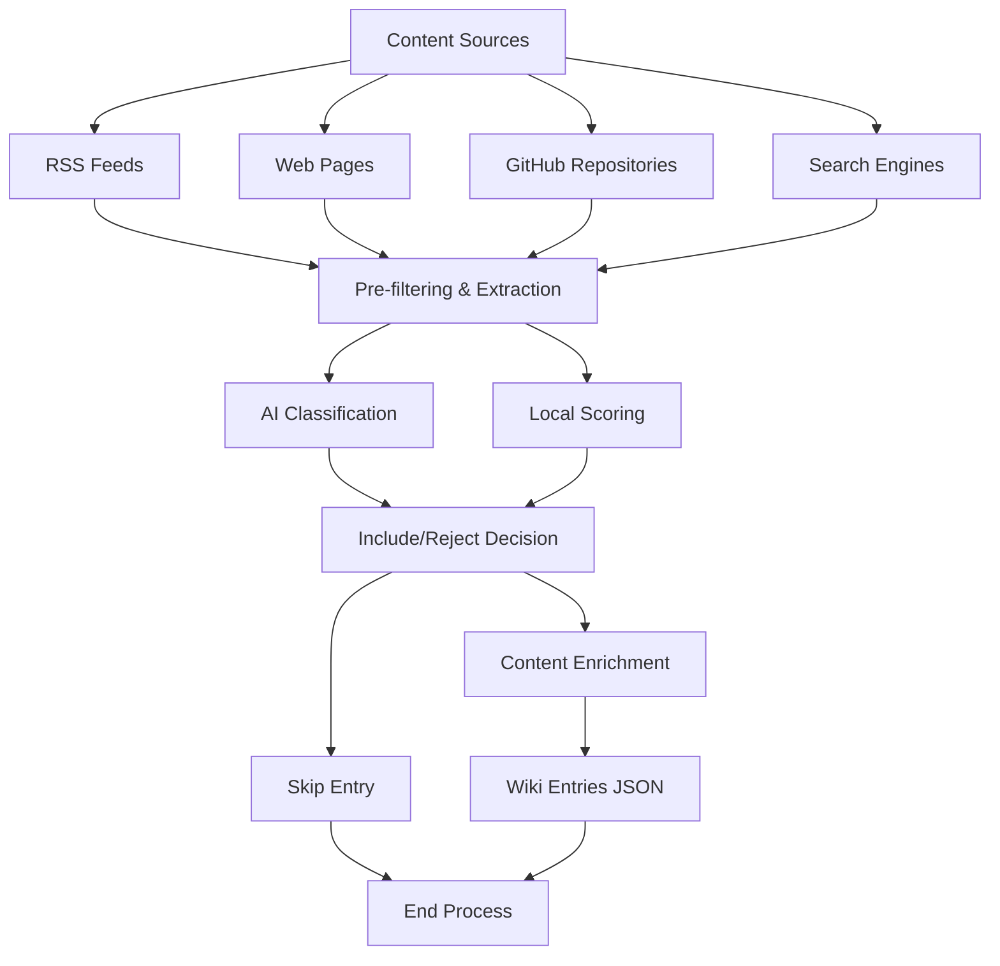
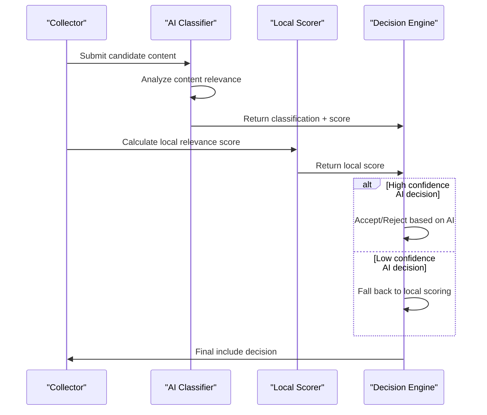
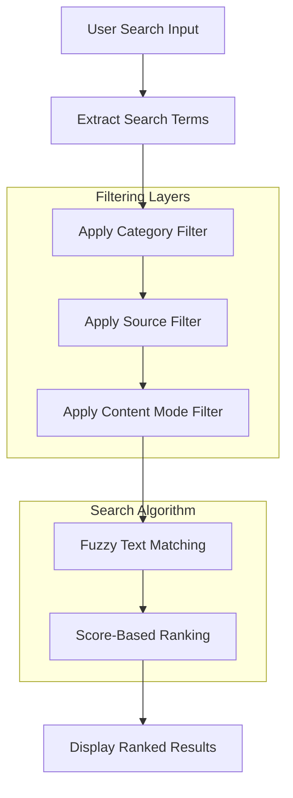
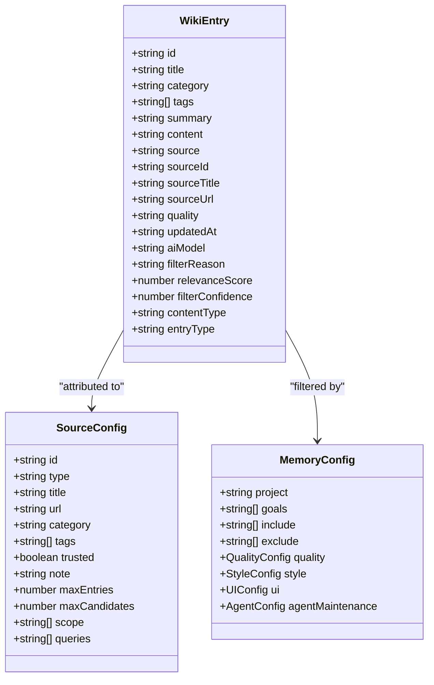
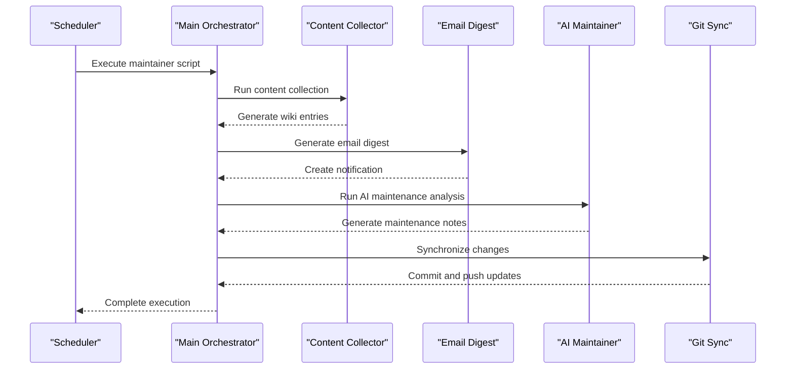

# Knowledge Base System

<cite>
**Referenced Files in This Document**
- [TA_wiki.html](file://tools_html/TA_wiki.html)
- [ta_wiki.js](file://js/ta_wiki.js)
- [ta_wiki_data.js](file://js/ta_wiki_data.js)
- [TA_wiki.css](file://css/TA_wiki.css)
- [menu.js](file://js/menu.js)
- [wiki_collect.mjs](file://scripts/wiki_collect.mjs)
- [run_wiki_collect.sh](file://scripts/run_wiki_collect.sh)
- [opencode_wiki_maintainer.sh](file://scripts/opencode_wiki_maintainer.sh)
- [wiki_email_digest.mjs](file://scripts/wiki_email_digest.mjs)
- [ta_wiki_entries.json](file://data/ta_wiki_entries.json)
- [wiki_sources.json](file://data/wiki_sources.json)
- [wiki_memory.json](file://data/wiki_memory.json)
</cite>

## Update Summary
**Changes Made**
- Replaced manual administration with automated content collection pipeline
- Added AI-powered summarization and content classification system
- Redesigned data structure to support automated processing workflows
- Implemented server-side automation scripts for content scraping and enrichment
- Updated frontend to display AI-enhanced content with quality indicators
- Added email digest generation for change notifications

## Table of Contents
1. [Introduction](#introduction)
2. [Automated Content Collection Pipeline](#automated-content-collection-pipeline)
3. [AI-Powered Content Processing](#ai-powered-content-processing)
4. [Frontend Search Interface](#frontend-search-interface)
5. [Data Structure and Organization](#data-structure-and-organization)
6. [Server Automation and Deployment](#server-automation-and-deployment)
7. [Content Quality and Moderation](#content-quality-and-moderation)
8. [Performance Considerations](#performance-considerations)
9. [Troubleshooting Guide](#troubleshooting-guide)
10. [Conclusion](#conclusion)

## Introduction
The TA Wiki knowledge base system has undergone a major architectural overhaul, transitioning from manual administration to an automated content collection and processing pipeline. The new system automatically scrapes technical content from various sources, applies AI-powered summarization and classification, and maintains a curated knowledge base focused on technical art, graphics programming, and rendering optimization. The frontend provides a sophisticated search interface with enhanced filtering capabilities and displays both human-curated and AI-processed content with clear quality indicators.

## Automated Content Collection Pipeline

### Multi-Source Content Aggregation
The system collects content from diverse sources including RSS feeds, web pages, GitHub repositories, and search engines. Each source type has specialized collection logic optimized for its format and content characteristics.

**Diagram sources**
- [wiki_collect.mjs:574-619](file://scripts/wiki_collect.mjs#L574-L619)
- [wiki_collect.mjs:621-670](file://scripts/wiki_collect.mjs#L621-L670)
- [wiki_collect.mjs:672-719](file://scripts/wiki_collect.mjs#L672-L719)
- [wiki_collect.mjs:760-800](file://scripts/wiki_collect.mjs#L760-L800)

### Source Configuration Management
Sources are defined in a structured JSON configuration file that supports different collection types and metadata specifications. The configuration includes RSS feeds, trusted technical sources, and search queries tailored for graphics and technical art content.

**Section sources**
- [wiki_sources.json:1-125](file://data/wiki_sources.json#L1-L125)
- [wiki_collect.mjs:562-572](file://scripts/wiki_collect.mjs#L562-L572)

### Content Extraction and Normalization
The collection pipeline extracts readable text from HTML content, strips unnecessary markup, and normalizes entries into a consistent format. It handles various HTML structures and content formats while maintaining source attribution and metadata.

**Section sources**
- [wiki_collect.mjs:159-166](file://scripts/wiki_collect.mjs#L159-L166)
- [wiki_collect.mjs:120-140](file://scripts/wiki_collect.mjs#L120-L140)

## AI-Powered Content Processing

### Intelligent Content Classification
The system uses AI to classify incoming content, determining relevance to technical art topics, assigning appropriate categories and tags, and making inclusion decisions based on quality thresholds.

**Diagram sources**
- [wiki_collect.mjs:493-560](file://scripts/wiki_collect.mjs#L493-L560)
- [wiki_collect.mjs:210-223](file://scripts/wiki_collect.mjs#L210-L223)

### Content Enrichment and Summarization
AI enhances collected content by generating Chinese summaries, article explanations, and practical technical artist perspectives. The enrichment process transforms raw scraped content into structured, actionable knowledge entries.

**Section sources**
- [wiki_collect.mjs:418-466](file://scripts/wiki_collect.mjs#L418-L466)
- [wiki_collect.mjs:287-327](file://scripts/wiki_collect.mjs#L287-L327)

### Quality Assessment and Filtering
The system implements multi-layered quality assessment combining AI confidence scores, local relevance scoring, and configurable thresholds to ensure only high-value content enters the knowledge base.

**Section sources**
- [wiki_collect.mjs:493-560](file://scripts/wiki_collect.mjs#L493-L560)
- [wiki_memory.json:30-36](file://data/wiki_memory.json#L30-L36)

## Frontend Search Interface

### Enhanced Search and Filtering
The frontend provides sophisticated search capabilities with fuzzy matching across titles, summaries, content, tags, and categories. Users can filter by content type (knowledge, articles, AI-processed), source origin, and specific categories.

**Diagram sources**
- [ta_wiki.js:204-233](file://js/ta_wiki.js#L204-L233)
- [ta_wiki.js:189-202](file://js/ta_wiki.js#L189-L202)

### Content Type Indicators
The interface clearly distinguishes between different content types: built-in verified knowledge, externally sourced articles, and AI-processed content. Each type displays appropriate badges and quality indicators to help users understand content provenance and reliability.

**Section sources**
- [ta_wiki.js:72-76](file://js/ta_wiki.js#L72-L76)
- [ta_wiki.js:113-118](file://js/ta_wiki.js#L113-L118)

### Rich Content Display
The frontend renders markdown content with syntax highlighting, code blocks, and structured sections. It includes table of contents generation, related content suggestions, and source attribution links for enhanced navigation and context.

**Section sources**
- [ta_wiki.js:264-349](file://js/ta_wiki.js#L264-L349)
- [ta_wiki.js:371-379](file://js/ta_wiki.js#L371-L379)

## Data Structure and Organization

### Enhanced Entry Schema
The data structure has been redesigned to support automated processing workflows, including quality metrics, AI model information, filtering reasons, and source attribution. Each entry now contains comprehensive metadata about its origin and processing history.

**Diagram sources**
- [ta_wiki_entries.json:1-30](file://data/ta_wiki_entries.json#L1-L30)
- [wiki_sources.json:1-20](file://data/wiki_sources.json#L1-L20)
- [wiki_memory.json:1-20](file://data/wiki_memory.json#L1-L20)

### Built-in Knowledge Base
The system maintains a comprehensive set of pre-curated technical art knowledge covering PBR parameters, shader templates, performance optimization techniques, and asset pipeline guidelines. These entries serve as foundational knowledge and reference material.

**Section sources**
- [ta_wiki_data.js:1-739](file://js/ta_wiki_data.js#L1-L739)

### Content Categorization Strategy
Content is organized using a hierarchical categorization system with automatic tag inference based on content analysis. Categories include rendering fundamentals, shader development, performance optimization, asset pipelines, and graphics APIs.

**Section sources**
- [wiki_collect.mjs:249-258](file://scripts/wiki_collect.mjs#L249-L258)
- [wiki_collect.mjs:194-203](file://scripts/wiki_collect.mjs#L194-L203)

## Server Automation and Deployment

### Scheduled Collection Pipeline
The system runs on a scheduled basis using shell scripts that orchestrate the entire collection, processing, and deployment workflow. The main orchestrator script manages multiple stages including content collection, email digest generation, AI maintenance notes, and Git synchronization.

**Diagram sources**
- [opencode_wiki_maintainer.sh:86-153](file://scripts/opencode_wiki_maintainer.sh#L86-L153)
- [run_wiki_collect.sh:24-46](file://scripts/run_wiki_collect.sh#L24-L46)

### Environment Configuration
The system uses environment variables for configuration management, supporting API keys, model selection, filtering thresholds, and notification settings. Configuration files provide persistent settings for sources, memory, and quality standards.

**Section sources**
- [wiki_collect.mjs:15-23](file://scripts/wiki_collect.mjs#L15-L23)
- [run_wiki_collect.sh:19-22](file://scripts/run_wiki_collect.sh#L19-L22)

### Email Notification System
An intelligent email digest system generates human-readable notifications about content updates, highlighting newly added entries, quality improvements, and AI-enriched content. The system can use AI to compose professional email summaries or fall back to structured text formats.

**Section sources**
- [wiki_email_digest.mjs:164-223](file://scripts/wiki_email_digest.mjs#L164-L223)
- [wiki_email_digest.mjs:129-162](file://scripts/wiki_email_digest.mjs#L129-L162)

## Content Quality and Moderation

### Multi-Layer Quality Assessment
The system implements comprehensive quality assessment through AI confidence scoring, local relevance evaluation, and configurable quality thresholds. Each entry receives detailed quality metrics and filtering rationale for transparency and auditability.

**Section sources**
- [wiki_collect.mjs:493-560](file://scripts/wiki_collect.mjs#L493-L560)
- [wiki_memory.json:30-36](file://data/wiki_memory.json#L30-L36)

### Trusted Source Handling
The system supports trusted sources that bypass certain filtering criteria, allowing high-confidence technical content to be included even with lower AI confidence scores. This enables reliable technical documentation and conference presentations to be prioritized.

**Section sources**
- [wiki_collect.mjs:637-642](file://scripts/wiki_collect.mjs#L637-L642)
- [wiki_sources.json:51-53](file://data/wiki_sources.json#L51-L53)

### AI Maintenance and Review
An AI-powered maintenance system analyzes collected content patterns, identifies quality issues, and suggests improvements to the knowledge base. It can recommend UI enhancements, content curation strategies, and pipeline optimizations.

**Section sources**
- [opencode_wiki_maintainer.sh:110-131](file://scripts/opencode_wiki_maintainer.sh#L110-L131)
- [wiki_memory.json:59-75](file://data/wiki_memory.json#L59-L75)

## Performance Considerations

### Efficient Content Processing
The collection pipeline implements several performance optimizations including parallel processing, intelligent caching, and incremental updates. Large content items are processed in chunks, and AI calls are rate-limited to prevent API throttling.

**Section sources**
- [wiki_collect.mjs:468-491](file://scripts/wiki_collect.mjs#L468-L491)
- [wiki_collect.mjs:760-800](file://scripts/wiki_collect.mjs#L760-L800)

### Frontend Optimization
The frontend uses efficient DOM manipulation, lazy loading of content, and optimized search algorithms to handle large knowledge bases. Content is loaded incrementally, and search operations are debounced to maintain responsive user experience.

**Section sources**
- [ta_wiki.js:474-522](file://js/ta_wiki.js#L474-L522)
- [ta_wiki.js:204-233](file://js/ta_wiki.js#L204-L233)

### Storage and Caching Strategies
The system uses JSON files for persistent storage with minimal overhead. Browser caching is configured appropriately for static assets, and the frontend implements client-side caching strategies for improved performance.

**Section sources**
- [ta_wiki.js:34-44](file://js/ta_wiki.js#L34-L44)

## Troubleshooting Guide

### Common Issues and Resolutions
- **Collection failures**: Check network connectivity, API keys, and source availability
- **AI processing errors**: Verify API key configuration and model availability
- **Email delivery issues**: Ensure mail server configuration and recipient addresses
- **Git sync problems**: Validate repository access and branch permissions
- **Performance degradation**: Monitor collection logs and adjust filtering thresholds

**Section sources**
- [run_wiki_collect.sh:24-46](file://scripts/run_wiki_collect.sh#L24-L46)
- [opencode_wiki_maintainer.sh:86-153](file://scripts/opencode_wiki_maintainer.sh#L86-L153)

### Monitoring and Logging
The system generates comprehensive logs for all operations, including collection results, AI processing status, and error details. Logs are stored locally and can be reviewed for troubleshooting and performance analysis.

**Section sources**
- [opencode_wiki_maintainer.sh:6-14](file://scripts/opencode_wiki_maintainer.sh#L6-L14)
- [wiki_collect.mjs:468-491](file://scripts/wiki_collect.mjs#L468-L491)

## Conclusion
The TA Wiki knowledge base system has evolved into a sophisticated, automated platform that continuously curates and enriches technical art knowledge. The combination of intelligent content collection, AI-powered processing, and user-friendly interfaces creates a sustainable ecosystem for technical knowledge sharing. The system's modular architecture allows for easy extension and customization while maintaining high standards for content quality and relevance.