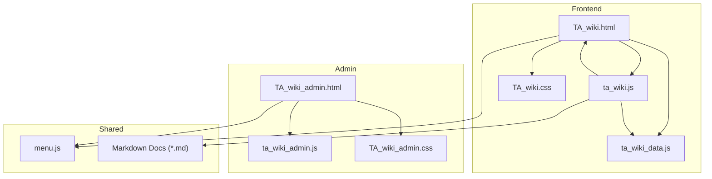
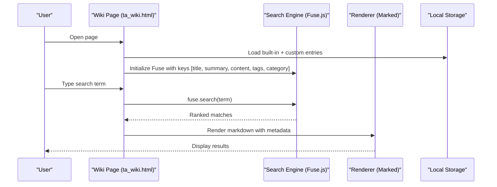
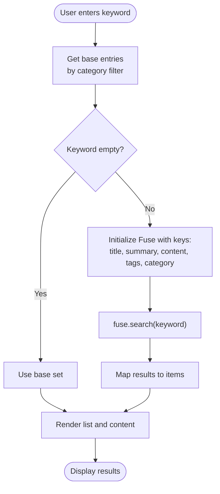
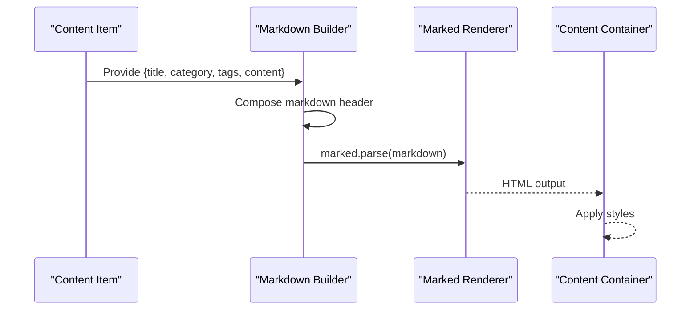
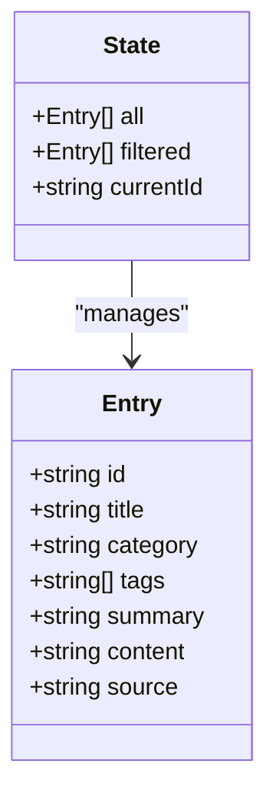
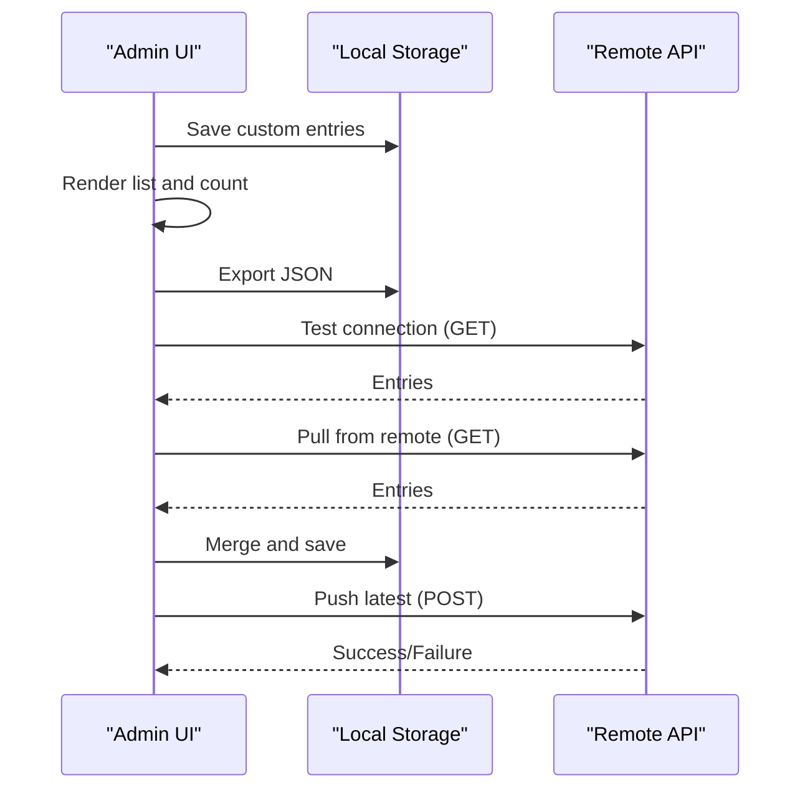
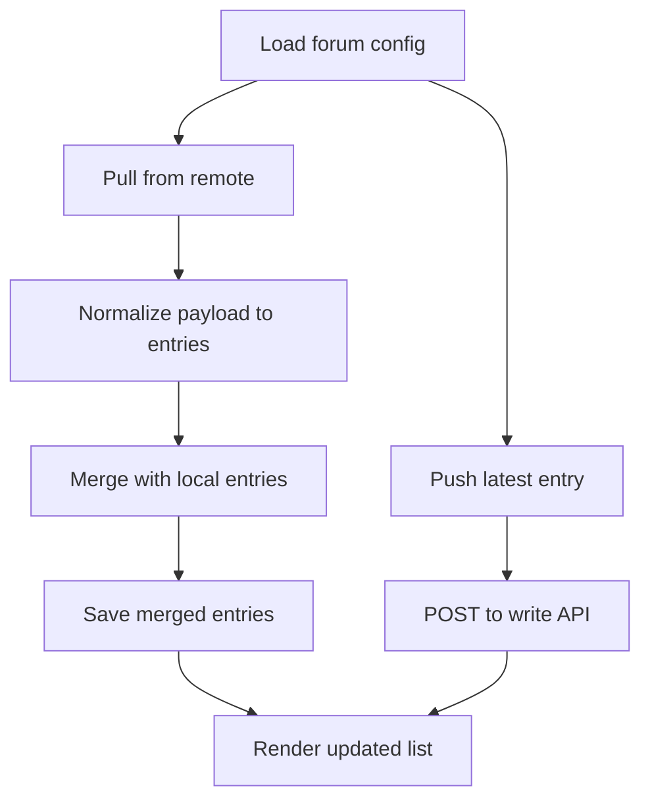
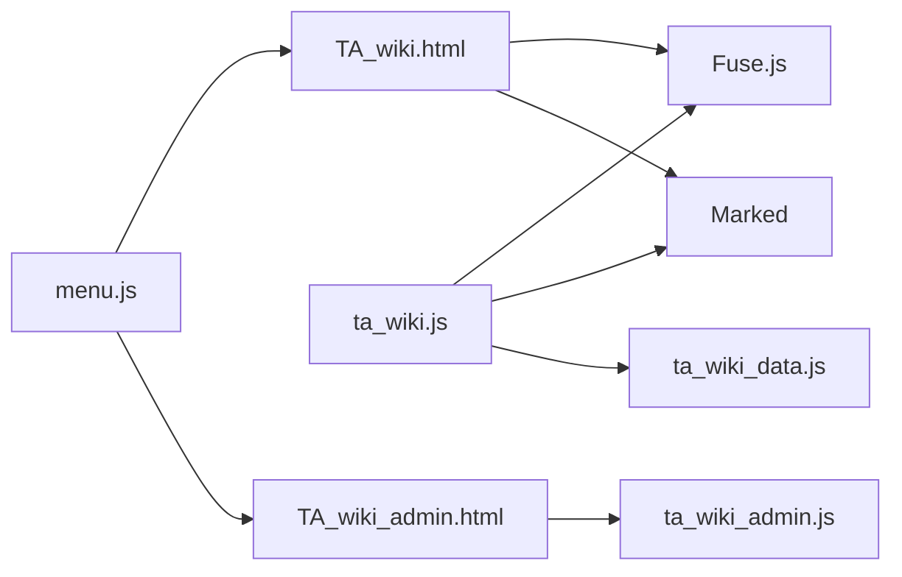

# Knowledge Base System

<cite>
**Referenced Files in This Document**
- [TA_wiki.html](file://tools_html/TA_wiki.html)
- [TA_wiki_admin.html](file://tools_html/TA_wiki_admin.html)
- [ta_wiki.js](file://js/ta_wiki.js)
- [ta_wiki_admin.js](file://js/ta_wiki_admin.js)
- [ta_wiki_data.js](file://js/ta_wiki_data.js)
- [TA_wiki.css](file://css/TA_wiki.css)
- [TA_wiki_admin.css](file://css/TA_wiki_admin.css)
- [menu.js](file://js/menu.js)
- [AI图片超分辨率技术实现文档.md](file://doc/AI图片超分辨率技术实现文档.md)
- [视频剪辑工具使用说明.md](file://doc/视频剪辑工具使用说明.md)
- [视频剪辑_CDN跨域解决方案.md](file://doc/视频剪辑_CDN跨域解决方案.md)
</cite>

## Table of Contents
1. [Introduction](#introduction)
2. [Project Structure](#project-structure)
3. [Core Components](#core-components)
4. [Architecture Overview](#architecture-overview)
5. [Detailed Component Analysis](#detailed-component-analysis)
6. [Dependency Analysis](#dependency-analysis)
7. [Performance Considerations](#performance-considerations)
8. [Troubleshooting Guide](#troubleshooting-guide)
9. [Conclusion](#conclusion)
10. [Appendices](#appendices)

## Introduction
This document describes the TA Wiki knowledge base system, focusing on the frontend search and administration interfaces. It explains the Fuse.js-based search implementation, markdown rendering with Marked, content organization strategies, the admin interface for content management, remote synchronization capabilities, and API configuration options. It also covers data structures, caching strategies, performance optimization for large knowledge bases, content moderation, version control, and collaborative editing features.

## Project Structure
The knowledge base is organized around two primary pages:
- Frontend search interface: tools_html/TA_wiki.html with js/ta_wiki.js and js/ta_wiki_data.js
- Administration interface: tools_html/TA_wiki_admin.html with js/ta_wiki_admin.js

Additional assets include CSS stylesheets for both views and shared navigation logic via js/menu.js. Sample markdown documents demonstrate content formats and rendering expectations.

**Diagram sources**
- [TA_wiki.html:1-47](file://tools_html/TA_wiki.html#L1-L47)
- [ta_wiki.js:1-176](file://js/ta_wiki.js#L1-L176)
- [ta_wiki_data.js:1-48](file://js/ta_wiki_data.js#L1-L48)
- [TA_wiki.css:1-188](file://css/TA_wiki.css#L1-L188)
- [TA_wiki_admin.html:1-98](file://tools_html/TA_wiki_admin.html#L1-L98)
- [ta_wiki_admin.js:1-301](file://js/ta_wiki_admin.js#L1-L301)
- [TA_wiki_admin.css:1-206](file://css/TA_wiki_admin.css#L1-L206)
- [menu.js:1-273](file://js/menu.js#L1-L273)
- [AI图片超分辨率技术实现文档.md:1-538](file://doc/AI图片超分辨率技术实现文档.md#L1-L538)

**Section sources**
- [TA_wiki.html:1-47](file://tools_html/TA_wiki.html#L1-L47)
- [TA_wiki_admin.html:1-98](file://tools_html/TA_wiki_admin.html#L1-L98)
- [ta_wiki.js:1-176](file://js/ta_wiki.js#L1-L176)
- [ta_wiki_admin.js:1-301](file://js/ta_wiki_admin.js#L1-L301)
- [ta_wiki_data.js:1-48](file://js/ta_wiki_data.js#L1-L48)
- [TA_wiki.css:1-188](file://css/TA_wiki.css#L1-L188)
- [TA_wiki_admin.css:1-206](file://css/TA_wiki_admin.css#L1-L206)
- [menu.js:1-273](file://js/menu.js#L1-L273)

## Core Components
- Fuse.js-powered search engine for fuzzy matching across titles, summaries, content, tags, and categories
- Marked-based markdown renderer for rich content display
- Local storage-backed content lifecycle (built-in entries + user-generated entries)
- Admin interface for CRUD operations, export/import, and remote synchronization
- External wiki integration modes (external-only mode and banner)

Key responsibilities:
- Search filtering and result ranking
- Category filtering and result hinting
- Content rendering with markdown and metadata
- Local persistence and merging with remote entries
- Remote API configuration and bidirectional sync

**Section sources**
- [ta_wiki.js:130-152](file://js/ta_wiki.js#L130-L152)
- [ta_wiki.js:116-128](file://js/ta_wiki.js#L116-L128)
- [ta_wiki_admin.js:32-41](file://js/ta_wiki_admin.js#L32-L41)
- [ta_wiki_admin.js:127-143](file://js/ta_wiki_admin.js#L127-L143)
- [ta_wiki_admin.js:103-125](file://js/ta_wiki_admin.js#L103-L125)

## Architecture Overview
The system consists of:
- Static HTML pages with embedded script tags
- Client-side JavaScript modules for search, admin, and data
- Local storage for persistence
- Optional remote APIs for synchronization
- Fuse.js for fuzzy search and Marked for markdown rendering

**Diagram sources**
- [TA_wiki.html:39-42](file://tools_html/TA_wiki.html#L39-L42)
- [ta_wiki.js:143-151](file://js/ta_wiki.js#L143-L151)
- [ta_wiki.js:116-128](file://js/ta_wiki.js#L116-L128)
- [ta_wiki_data.js:1-48](file://js/ta_wiki_data.js#L1-L48)

## Detailed Component Analysis

### Search Engine (Fuse.js)
- Initialization: Creates a Fuse instance with configurable keys and thresholds
- Filtering: Applies category filter first, then fuzzy search on the filtered set
- Ranking: Uses Fuse’s internal scoring to order results
- Threshold tuning: Configured to balance precision and recall

**Diagram sources**
- [ta_wiki.js:130-152](file://js/ta_wiki.js#L130-L152)

**Section sources**
- [ta_wiki.js:143-151](file://js/ta_wiki.js#L143-L151)

### Content Rendering (Marked)
- Metadata injection: Prepend title, category, and tags to markdown content
- Rendering: Marked parses markdown into HTML
- Output: Safe, styled HTML rendered inside the content area

**Diagram sources**
- [ta_wiki.js:116-128](file://js/ta_wiki.js#L116-L128)

**Section sources**
- [ta_wiki.js:116-128](file://js/ta_wiki.js#L116-L128)

### Content Organization Strategies
- Built-in entries: Predefined knowledge items loaded into memory
- Custom entries: User-created entries stored in local storage
- Categories: Derived from entries and presented as a filter dropdown
- Tags: Optional metadata for fine-grained grouping
- Summaries: Short previews shown in the list view

**Diagram sources**
- [ta_wiki_data.js:2-44](file://js/ta_wiki_data.js#L2-L44)
- [ta_wiki.js:5-9](file://js/ta_wiki.js#L5-L9)

**Section sources**
- [ta_wiki_data.js:2-44](file://js/ta_wiki_data.js#L2-L44)
- [ta_wiki.js:84-90](file://js/ta_wiki.js#L84-L90)

### Admin Interface for Content Management
- Form submission: Validates required fields and persists new entries
- List management: Displays, counts, and allows deletion of custom entries
- Export: Downloads custom entries as JSON
- Clear all: Removes all custom entries from local storage
- Forum configuration: Stores API endpoints, token, and external wiki settings
- Sync operations: Pull from remote and push latest entry to remote

**Diagram sources**
- [ta_wiki_admin.js:196-225](file://js/ta_wiki_admin.js#L196-L225)
- [ta_wiki_admin.js:261-268](file://js/ta_wiki_admin.js#L261-L268)
- [ta_wiki_admin.js:270-281](file://js/ta_wiki_admin.js#L270-L281)
- [ta_wiki_admin.js:283-296](file://js/ta_wiki_admin.js#L283-L296)

**Section sources**
- [ta_wiki_admin.js:32-41](file://js/ta_wiki_admin.js#L32-L41)
- [ta_wiki_admin.js:168-184](file://js/ta_wiki_admin.js#L168-L184)
- [ta_wiki_admin.js:242-246](file://js/ta_wiki_admin.js#L242-L246)
- [ta_wiki_admin.js:248-259](file://js/ta_wiki_admin.js#L248-L259)
- [ta_wiki_admin.js:261-268](file://js/ta_wiki_admin.js#L261-L268)
- [ta_wiki_admin.js:270-281](file://js/ta_wiki_admin.js#L270-L281)
- [ta_wiki_admin.js:283-296](file://js/ta_wiki_admin.js#L283-L296)

### Remote Synchronization Capabilities
- Configuration: Store read/write API URLs, token, and external wiki settings
- Pull: Fetches remote entries, normalizes them, merges with local entries, and saves
- Push: Posts the latest local entry to the remote API
- Headers: Adds Authorization header when token is present
- Conflict handling: Merges by title+category+content and remoteId uniqueness

**Diagram sources**
- [ta_wiki_admin.js:43-58](file://js/ta_wiki_admin.js#L43-L58)
- [ta_wiki_admin.js:82-101](file://js/ta_wiki_admin.js#L82-L101)
- [ta_wiki_admin.js:103-125](file://js/ta_wiki_admin.js#L103-L125)
- [ta_wiki_admin.js:127-143](file://js/ta_wiki_admin.js#L127-L143)
- [ta_wiki_admin.js:145-166](file://js/ta_wiki_admin.js#L145-L166)

**Section sources**
- [ta_wiki_admin.js:75-80](file://js/ta_wiki_admin.js#L75-L80)
- [ta_wiki_admin.js:82-101](file://js/ta_wiki_admin.js#L82-L101)
- [ta_wiki_admin.js:103-125](file://js/ta_wiki_admin.js#L103-L125)
- [ta_wiki_admin.js:127-143](file://js/ta_wiki_admin.js#L127-L143)
- [ta_wiki_admin.js:145-166](file://js/ta_wiki_admin.js#L145-L166)

### API Configuration Options
- Read API URL (GET): Endpoint to fetch remote entries
- Write API URL (POST): Endpoint to submit new entries
- Token: Bearer token for protected endpoints
- External wiki URL: Link to external knowledge base
- External link enabled: Toggle to show external link banner
- External only mode: Hide local content and show external entry only

**Section sources**
- [ta_wiki_admin.js:43-58](file://js/ta_wiki_admin.js#L43-L58)
- [ta_wiki_admin.js:186-194](file://js/ta_wiki_admin.js#L186-L194)
- [ta_wiki.js:27-35](file://js/ta_wiki.js#L27-L35)
- [ta_wiki.js:37-69](file://js/ta_wiki.js#L37-L69)

### Data Structure for Wiki Content
Each entry includes:
- id: Unique identifier (auto-generated for local/custom entries)
- title: Display title
- category: Classification for filtering
- tags: Optional metadata list
- summary: Short preview text
- content: Markdown body
- source: Origin marker (local or remote)
- remoteId: Optional remote identifier for deduplication

Built-in entries are loaded into a global array and merged with custom entries.

**Section sources**
- [ta_wiki_data.js:2-44](file://js/ta_wiki_data.js#L2-L44)
- [ta_wiki.js:71-82](file://js/ta_wiki.js#L71-L82)
- [ta_wiki_admin.js:82-101](file://js/ta_wiki_admin.js#L82-L101)

### Caching Strategies
- Local storage: Persists custom entries and forum configuration
- Browser cache: CDN-hosted libraries (Fuse.js, Marked) are cached by the browser
- No server-side cache: Entire system runs client-side with local storage

**Section sources**
- [ta_wiki.js:2-4](file://js/ta_wiki.js#L2-L4)
- [ta_wiki_admin.js:2-4](file://js/ta_wiki_admin.js#L2-L4)
- [TA_wiki.html:39-42](file://tools_html/TA_wiki.html#L39-L42)

### Performance Optimization for Large Knowledge Bases
- Fuse.js threshold tuning: Adjusted to balance precision and recall
- Incremental filtering: Category filter reduces dataset before fuzzy search
- Efficient DOM updates: Minimal re-rendering by updating only the list and content areas
- Lazy initialization: Search engine initialized on page load
- Markdown rendering: Single pass parse and insert

Recommendations:
- Increase Fuse threshold for broader recall in large corpora
- Consider pagination for very large lists
- Debounce search input to reduce frequent re-renders
- Precompute category options to avoid repeated DOM manipulation

**Section sources**
- [ta_wiki.js:143-151](file://js/ta_wiki.js#L143-L151)
- [ta_wiki.js:130-152](file://js/ta_wiki.js#L130-L152)

### Content Moderation, Version Control, and Collaborative Editing
- Moderation: Admin interface controls who can edit and publish content
- Version control: Not implemented; entries are stored as flat JSON in local storage
- Collaborative editing: Not implemented; entries are stored locally

Recommendations:
- Add entry timestamps and authors
- Implement conflict resolution during merge
- Add approval workflow for submissions
- Introduce server-side versioning and audit logs

**Section sources**
- [ta_wiki_admin.js:32-41](file://js/ta_wiki_admin.js#L32-L41)
- [ta_wiki_admin.js:103-125](file://js/ta_wiki_admin.js#L103-L125)

## Dependency Analysis
- TA_wiki.html depends on Fuse.js and Marked for search and rendering
- ta_wiki.js depends on ta_wiki_data.js for built-in entries and uses Fuse.js and Marked
- ta_wiki_admin.js manages local storage and remote APIs
- menu.js provides shared navigation and global search across tools

**Diagram sources**
- [TA_wiki.html:39-42](file://tools_html/TA_wiki.html#L39-L42)
- [ta_wiki.js:1-176](file://js/ta_wiki.js#L1-L176)
- [ta_wiki_data.js:1-48](file://js/ta_wiki_data.js#L1-L48)
- [TA_wiki_admin.html:93-93](file://tools_html/TA_wiki_admin.html#L93-L93)
- [ta_wiki_admin.js:1-301](file://js/ta_wiki_admin.js#L1-L301)
- [menu.js:1-273](file://js/menu.js#L1-L273)

**Section sources**
- [TA_wiki.html:39-42](file://tools_html/TA_wiki.html#L39-L42)
- [ta_wiki.js:1-176](file://js/ta_wiki.js#L1-L176)
- [ta_wiki_admin.js:1-301](file://js/ta_wiki_admin.js#L1-L301)
- [menu.js:1-273](file://js/menu.js#L1-L273)

## Performance Considerations
- Search latency: Tune Fuse threshold and consider indexing strategies for very large datasets
- Rendering cost: Minimize DOM updates; batch renders when possible
- Memory usage: Avoid storing unnecessary copies of entries
- Network requests: Cache remote responses and handle errors gracefully
- UI responsiveness: Debounce search input and avoid long-running synchronous operations

[No sources needed since this section provides general guidance]

## Troubleshooting Guide
Common issues and resolutions:
- External wiki banner not appearing: Verify external link enabled and URL are configured
- External-only mode hides local content: Disable external-only mode or remove external URL
- Search returns no results: Check Fuse threshold and ensure entries have searchable fields
- Remote pull fails: Confirm API endpoints, token, and CORS configuration
- Push fails: Validate write API endpoint and token permissions

**Section sources**
- [ta_wiki.js:27-69](file://js/ta_wiki.js#L27-L69)
- [ta_wiki_admin.js:261-268](file://js/ta_wiki_admin.js#L261-L268)
- [ta_wiki_admin.js:270-281](file://js/ta_wiki_admin.js#L270-L281)
- [ta_wiki_admin.js:283-296](file://js/ta_wiki_admin.js#L283-L296)

## Conclusion
The TA Wiki knowledge base system provides a lightweight, client-side solution for organizing and searching technical documentation. It leverages Fuse.js for robust search and Marked for markdown rendering, while offering an admin interface for content creation and remote synchronization. For large-scale deployments, consider adding server-side versioning, moderation workflows, and improved caching strategies.

[No sources needed since this section summarizes without analyzing specific files]

## Appendices

### Search Query Syntax Examples
- Basic keyword search: “roughness”
- Multi-term search: “post process”
- Category filter: Select category from dropdown
- Tag-based refinement: Use tags in content to improve discoverability

**Section sources**
- [TA_wiki.html:27-31](file://tools_html/TA_wiki.html#L27-L31)
- [ta_wiki.js:130-152](file://js/ta_wiki.js#L130-L152)

### Content Categorization and Tagging
- Categories: Used for filtering and discovery
- Tags: Optional metadata to enhance searchability
- Summaries: Concise previews for list view

**Section sources**
- [ta_wiki_data.js:2-44](file://js/ta_wiki_data.js#L2-L44)
- [ta_wiki.js:84-90](file://js/ta_wiki.js#L84-L90)

### User Contribution Workflows
- Create entry: Fill form with title, category, tags, summary, and content
- Review: Preview appears immediately after saving
- Export: Download custom entries as JSON for backup or migration
- Clear all: Remove all custom entries from local storage

**Section sources**
- [ta_wiki_admin.js:196-225](file://js/ta_wiki_admin.js#L196-L225)
- [ta_wiki_admin.js:242-246](file://js/ta_wiki_admin.js#L242-L246)
- [ta_wiki_admin.js:236-240](file://js/ta_wiki_admin.js#L236-L240)

### Example Content Formats
- Markdown documents demonstrate rendering of code blocks, headers, and lists
- Use these as templates for consistent formatting across the knowledge base

**Section sources**
- [AI图片超分辨率技术实现文档.md:1-538](file://doc/AI图片超分辨率技术实现文档.md#L1-L538)
- [视频剪辑工具使用说明.md:1-299](file://doc/视频剪辑工具使用说明.md#L1-L299)
- [视频剪辑_CDN跨域解决方案.md:1-305](file://doc/视频剪辑_CDN跨域解决方案.md#L1-L305)