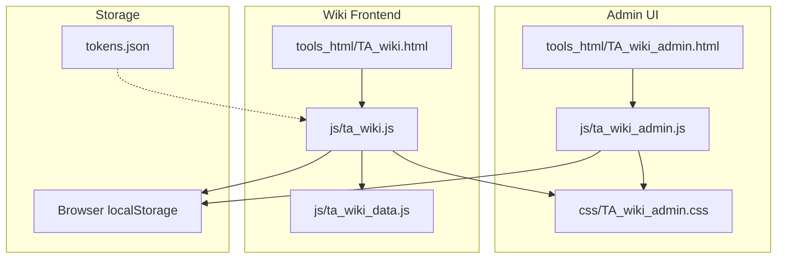
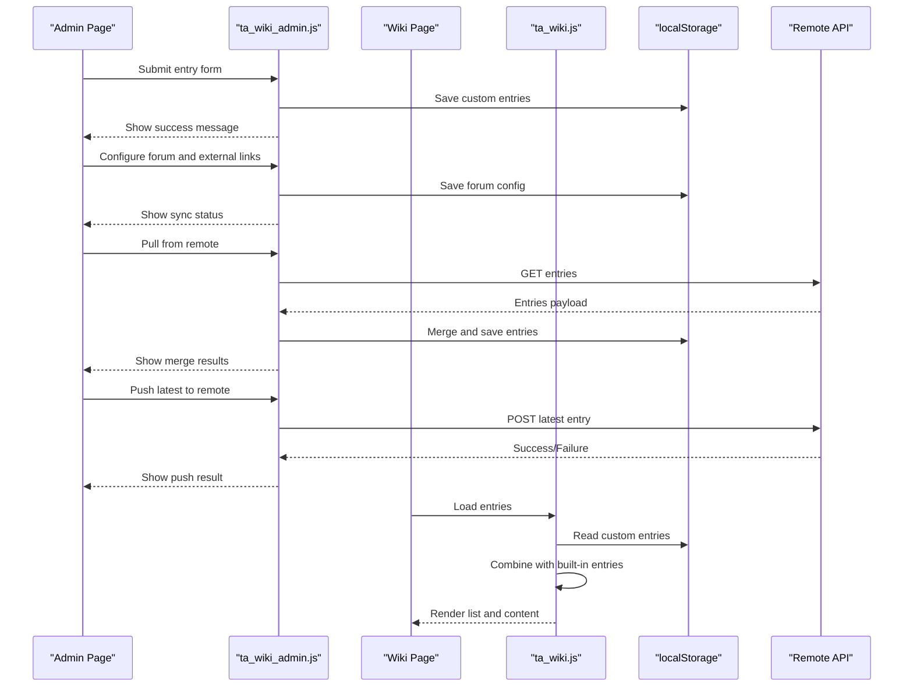
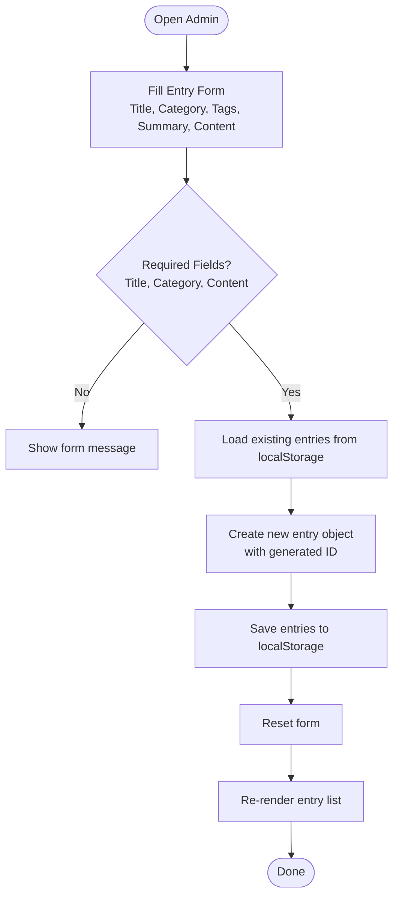
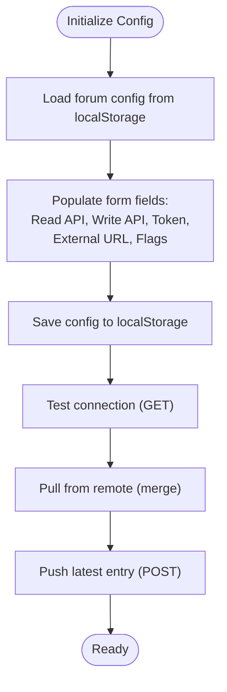
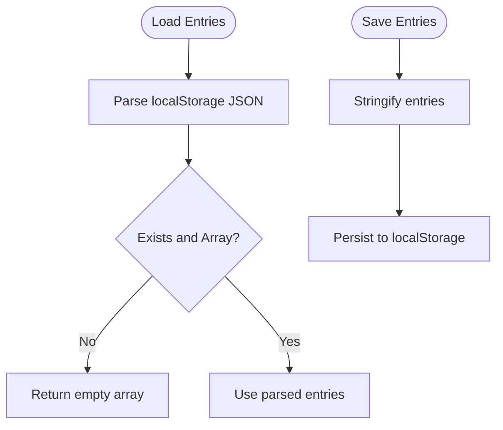
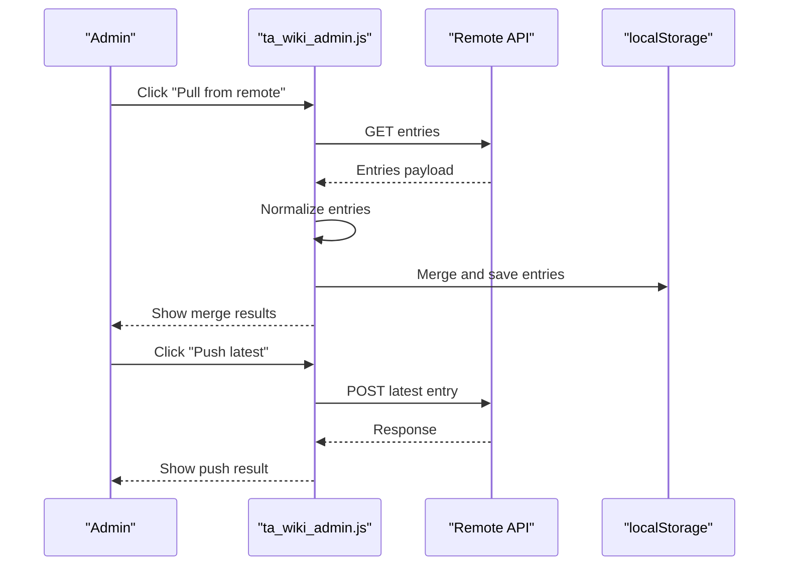
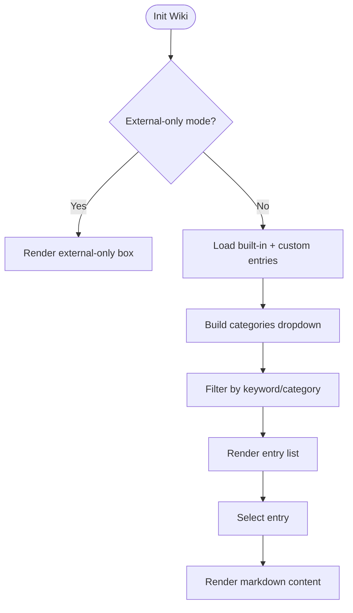
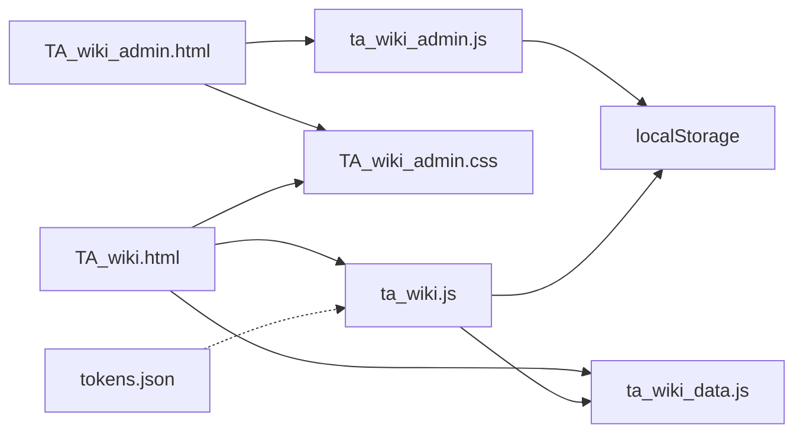

# TA Wiki Administration

<cite>
**Referenced Files in This Document**
- [TA_wiki_admin.html](file://tools_html/TA_wiki_admin.html)
- [TA_wiki.html](file://tools_html/TA_wiki.html)
- [ta_wiki_admin.js](file://js/ta_wiki_admin.js)
- [ta_wiki.js](file://js/ta_wiki.js)
- [ta_wiki_data.js](file://js/ta_wiki_data.js)
- [TA_wiki_admin.css](file://css/TA_wiki_admin.css)
- [tokens.json](file://tokens.json)
</cite>

## Table of Contents
1. [Introduction](#introduction)
2. [Project Structure](#project-structure)
3. [Core Components](#core-components)
4. [Architecture Overview](#architecture-overview)
5. [Detailed Component Analysis](#detailed-component-analysis)
6. [Dependency Analysis](#dependency-analysis)
7. [Performance Considerations](#performance-considerations)
8. [Troubleshooting Guide](#troubleshooting-guide)
9. [Conclusion](#conclusion)

## Introduction
This document describes the TA Wiki administration interface, focusing on content management and configuration features. It covers:
- Custom entry creation and editing workflow (markdown authoring, categories, tags)
- Forum configuration for external wiki integration (URL setup, link enabling, external-only mode)
- Local storage management for custom entries, data persistence, and backup strategies
- API configuration interface, remote synchronization capabilities, and content moderation features
- User permission systems, content approval workflows, and collaborative editing patterns
- Troubleshooting guidance for common administrative tasks and data management issues

## Project Structure
The administration interface consists of:
- HTML pages for admin and frontend wiki views
- JavaScript modules for admin UI, wiki rendering, and built-in content
- CSS for admin panel styling
- Tokens configuration for third-party integrations

**Diagram sources**
- [TA_wiki_admin.html:1-98](file://tools_html/TA_wiki_admin.html#L1-L98)
- [ta_wiki_admin.js:1-301](file://js/ta_wiki_admin.js#L1-L301)
- [TA_wiki_admin.css:1-206](file://css/TA_wiki_admin.css#L1-L206)
- [TA_wiki.html:1-47](file://tools_html/TA_wiki.html#L1-L47)
- [ta_wiki.js:1-176](file://js/ta_wiki.js#L1-L176)
- [ta_wiki_data.js:1-48](file://js/ta_wiki_data.js#L1-L48)
- [tokens.json:1-5](file://tokens.json#L1-L5)

**Section sources**
- [TA_wiki_admin.html:1-98](file://tools_html/TA_wiki_admin.html#L1-L98)
- [TA_wiki.html:1-47](file://tools_html/TA_wiki.html#L1-L47)
- [ta_wiki_admin.js:1-301](file://js/ta_wiki_admin.js#L1-L301)
- [ta_wiki.js:1-176](file://js/ta_wiki.js#L1-L176)
- [ta_wiki_data.js:1-48](file://js/ta_wiki_data.js#L1-L48)
- [TA_wiki_admin.css:1-206](file://css/TA_wiki_admin.css#L1-L206)
- [tokens.json:1-5](file://tokens.json#L1-L5)

## Core Components
- Admin page (TA_wiki_admin.html): Provides forms for creating/editing custom entries, listing existing entries, exporting data, and configuring remote synchronization and external links.
- Admin script (ta_wiki_admin.js): Implements entry CRUD, local storage persistence, remote synchronization, and configuration management.
- Wiki frontend (TA_wiki.html): Renders searchable wiki content and integrates with admin-managed entries.
- Wiki renderer (ta_wiki.js): Loads built-in and custom entries, builds categories, filters/searches, renders markdown content, and handles external wiki integration modes.
- Built-in data (ta_wiki_data.js): Supplies static knowledge entries loaded into the wiki.
- Styles (TA_wiki_admin.css): Admin panel layout and UI components.
- Tokens (tokens.json): Optional third-party service tokens referenced by other tools.

Key responsibilities:
- Content authoring: Title, category, tags, summary, and markdown content
- Storage: Local entries persisted in browser localStorage
- Remote sync: Pull from and push to remote APIs with token authentication
- External integration: Banner and external-only mode
- Moderation: Manual approval via admin actions (delete, export, clear)

**Section sources**
- [TA_wiki_admin.html:27-90](file://tools_html/TA_wiki_admin.html#L27-L90)
- [ta_wiki_admin.js:1-301](file://js/ta_wiki_admin.js#L1-L301)
- [TA_wiki.html:18-42](file://tools_html/TA_wiki.html#L18-L42)
- [ta_wiki.js:1-176](file://js/ta_wiki.js#L1-L176)
- [ta_wiki_data.js:1-48](file://js/ta_wiki_data.js#L1-L48)
- [TA_wiki_admin.css:1-206](file://css/TA_wiki_admin.css#L1-L206)
- [tokens.json:1-5](file://tokens.json#L1-L5)

## Architecture Overview
The admin interface is a client-side SPA with two primary modules:
- Admin module: Manages custom entries and remote configuration
- Wiki module: Renders searchable content and external integration

**Diagram sources**
- [ta_wiki_admin.js:127-166](file://js/ta_wiki_admin.js#L127-L166)
- [ta_wiki_admin.js:261-296](file://js/ta_wiki_admin.js#L261-L296)
- [ta_wiki.js:71-82](file://js/ta_wiki.js#L71-L82)

## Detailed Component Analysis

### Admin Entry Creation and Editing Workflow
The admin workflow centers around a form for creating custom entries and a list for managing them.

- Required fields: Title, Category, Content
- Optional fields: Tags (comma-separated), Summary
- Persistence: Entries stored under a dedicated localStorage key
- Export: Download all entries as JSON

Operational controls:
- Save entry
- Export JSON
- Clear all entries
- Delete individual entries via list buttons

**Diagram sources**
- [ta_wiki_admin.js:196-225](file://js/ta_wiki_admin.js#L196-L225)
- [ta_wiki_admin.js:227-234](file://js/ta_wiki_admin.js#L227-L234)
- [ta_wiki_admin.js:242-246](file://js/ta_wiki_admin.js#L242-L246)
- [ta_wiki_admin.js:236-240](file://js/ta_wiki_admin.js#L236-L240)

**Section sources**
- [TA_wiki_admin.html:28-43](file://tools_html/TA_wiki_admin.html#L28-L43)
- [ta_wiki_admin.js:196-246](file://js/ta_wiki_admin.js#L196-L246)

### Forum Configuration System for External Wiki Integration
The admin allows configuring remote APIs and external wiki links.

Key configuration fields:
- Read API URL (GET)
- Write API URL (POST)
- Authorization token (Bearer)
- External wiki URL
- Enable external link
- External-only mode

Behavior:
- Authorization header is added when token is present
- External-only mode hides local UI and shows a banner with a link to the external wiki
- External link banner appears when enabled and URL is configured

**Diagram sources**
- [ta_wiki_admin.js:43-58](file://js/ta_wiki_admin.js#L43-L58)
- [ta_wiki_admin.js:248-259](file://js/ta_wiki_admin.js#L248-L259)
- [ta_wiki_admin.js:261-268](file://js/ta_wiki_admin.js#L261-L268)
- [ta_wiki_admin.js:270-281](file://js/ta_wiki_admin.js#L270-L281)
- [ta_wiki_admin.js:283-296](file://js/ta_wiki_admin.js#L283-L296)
- [ta_wiki.js:37-69](file://js/ta_wiki.js#L37-L69)

**Section sources**
- [TA_wiki_admin.html:55-90](file://tools_html/TA_wiki_admin.html#L55-L90)
- [ta_wiki_admin.js:43-58](file://js/ta_wiki_admin.js#L43-L58)
- [ta_wiki_admin.js:248-296](file://js/ta_wiki_admin.js#L248-L296)
- [ta_wiki.js:27-69](file://js/ta_wiki.js#L27-L69)

### Local Storage Management and Backup Strategies
- Storage keys:
  - Custom entries: a dedicated key for entries
  - Forum configuration: a separate key for remote settings
- Data format:
  - Entries: array of objects with fields like id, title, category, tags, summary, content, source
  - Configuration: object with read/write URLs, token, external URL, flags
- Backup strategies:
  - Export JSON from admin UI
  - Manual copy of localStorage entries
  - Periodic downloads of exported JSON

**Diagram sources**
- [ta_wiki_admin.js:32-41](file://js/ta_wiki_admin.js#L32-L41)
- [ta_wiki.js:71-76](file://js/ta_wiki.js#L71-L76)

**Section sources**
- [ta_wiki_admin.js:2-3](file://js/ta_wiki_admin.js#L2-L3)
- [ta_wiki.js:2-3](file://js/ta_wiki.js#L2-L3)
- [ta_wiki_admin.js:32-41](file://js/ta_wiki_admin.js#L32-L41)
- [ta_wiki.js:71-76](file://js/ta_wiki.js#L71-L76)

### Remote Synchronization and Content Moderation
Remote synchronization supports:
- Pull: Fetch entries from remote API, normalize, merge with local entries, and persist
- Push: Send the latest local entry to remote API
- Test: Verify connectivity to remote API

Moderation features:
- Manual deletion of entries via admin UI
- Export entries for manual review
- Clear all entries to reset state

**Diagram sources**
- [ta_wiki_admin.js:127-166](file://js/ta_wiki_admin.js#L127-L166)
- [ta_wiki_admin.js:270-296](file://js/ta_wiki_admin.js#L270-L296)

**Section sources**
- [ta_wiki_admin.js:127-166](file://js/ta_wiki_admin.js#L127-L166)
- [ta_wiki_admin.js:270-296](file://js/ta_wiki_admin.js#L270-L296)

### Wiki Rendering and External Integration
The wiki frontend loads built-in entries and merges them with custom entries, then renders a searchable list with markdown content.

External integration:
- Banner appears when external link is enabled and URL is set
- External-only mode hides local UI and shows a dedicated external-only box

**Diagram sources**
- [ta_wiki.js:154-172](file://js/ta_wiki.js#L154-L172)
- [ta_wiki.js:37-69](file://js/ta_wiki.js#L37-L69)
- [ta_wiki.js:78-82](file://js/ta_wiki.js#L78-L82)
- [ta_wiki.js:130-152](file://js/ta_wiki.js#L130-L152)
- [ta_wiki.js:116-128](file://js/ta_wiki.js#L116-L128)

**Section sources**
- [TA_wiki.html:18-42](file://tools_html/TA_wiki.html#L18-L42)
- [ta_wiki.js:154-172](file://js/ta_wiki.js#L154-L172)
- [ta_wiki.js:37-69](file://js/ta_wiki.js#L37-L69)
- [ta_wiki.js:78-82](file://js/ta_wiki.js#L78-L82)
- [ta_wiki.js:130-152](file://js/ta_wiki.js#L130-L152)
- [ta_wiki.js:116-128](file://js/ta_wiki.js#L116-L128)

### UI Layout and Styling
The admin panel uses a responsive grid layout with cards for forms, lists, and sync operations. Buttons are styled with primary, secondary, and danger variants. Messages and tips provide feedback during operations.

**Section sources**
- [TA_wiki_admin.html:18-90](file://tools_html/TA_wiki_admin.html#L18-L90)
- [TA_wiki_admin.css:1-206](file://css/TA_wiki_admin.css#L1-L206)

## Dependency Analysis
- Admin page depends on admin script and CSS
- Wiki page depends on Fuse.js and Marked for search and markdown rendering, plus built-in data and admin script for configuration
- Both modules share localStorage keys for entries and configuration
- Tokens file is referenced by other tools and may influence integration scenarios

**Diagram sources**
- [TA_wiki_admin.html:1-98](file://tools_html/TA_wiki_admin.html#L1-L98)
- [ta_wiki_admin.js:1-301](file://js/ta_wiki_admin.js#L1-L301)
- [TA_wiki.html:1-47](file://tools_html/TA_wiki.html#L1-L47)
- [ta_wiki.js:1-176](file://js/ta_wiki.js#L1-L176)
- [ta_wiki_data.js:1-48](file://js/ta_wiki_data.js#L1-L48)
- [TA_wiki_admin.css:1-206](file://css/TA_wiki_admin.css#L1-L206)
- [tokens.json:1-5](file://tokens.json#L1-L5)

**Section sources**
- [TA_wiki_admin.html:1-98](file://tools_html/TA_wiki_admin.html#L1-L98)
- [TA_wiki.html:1-47](file://tools_html/TA_wiki.html#L1-L47)
- [ta_wiki_admin.js:1-301](file://js/ta_wiki_admin.js#L1-L301)
- [ta_wiki.js:1-176](file://js/ta_wiki.js#L1-L176)
- [ta_wiki_data.js:1-48](file://js/ta_wiki_data.js#L1-L48)
- [TA_wiki_admin.css:1-206](file://css/TA_wiki_admin.css#L1-L206)
- [tokens.json:1-5](file://tokens.json#L1-L5)

## Performance Considerations
- Local storage operations are synchronous and can block the UI for large datasets; keep entries count reasonable
- Fuse.js search performance scales with dataset size; categorization helps reduce search scope
- Markdown rendering occurs on the main thread; keep content sizes manageable
- Remote synchronization involves network requests; handle errors gracefully and provide user feedback

## Troubleshooting Guide
Common issues and resolutions:
- CORS failures when pulling/pushing: Ensure remote server allows the origin or proxy requests through a backend endpoint
- Authentication errors: Verify Bearer token format and permissions
- No results after pull: Confirm remote API returns entries in the expected array format
- External-only mode not appearing: Check that external link is enabled and URL is set
- Large entry lists slow down rendering: Reduce entry count or improve filtering
- Export/download issues: Use modern browsers and ensure sufficient free disk space

Administrative tasks:
- Clear all entries: Use the “Clear all custom entries” button
- Export entries: Use the “Export JSON” button
- Reconfigure remote: Update URLs and token, then test connection

**Section sources**
- [TA_wiki_admin.html:84-88](file://tools_html/TA_wiki_admin.html#L84-L88)
- [ta_wiki_admin.js:261-268](file://js/ta_wiki_admin.js#L261-L268)
- [ta_wiki_admin.js:236-240](file://js/ta_wiki_admin.js#L236-L240)
- [ta_wiki_admin.js:242-246](file://js/ta_wiki_admin.js#L242-L246)

## Conclusion
The TA Wiki administration interface provides a streamlined solution for managing custom knowledge entries, integrating with external wikis, and synchronizing content remotely. Its client-side design simplifies deployment while offering robust features for content creation, moderation, and collaboration. Administrators can efficiently create and curate knowledge, configure external integrations, and maintain backups through JSON exports.