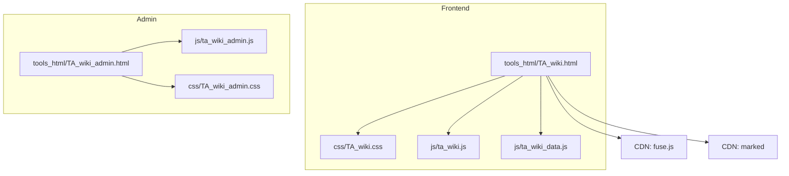
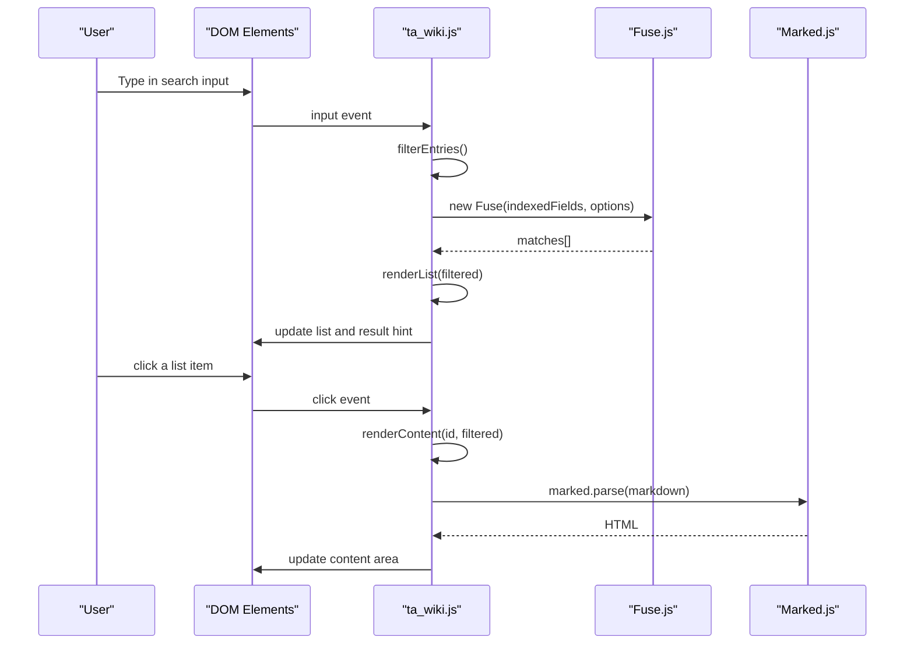
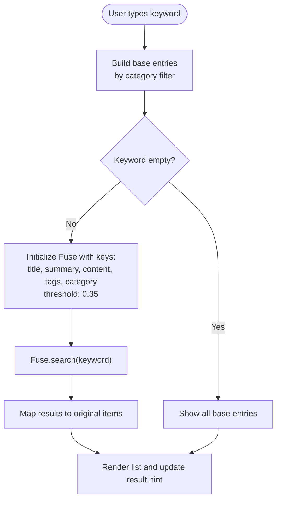
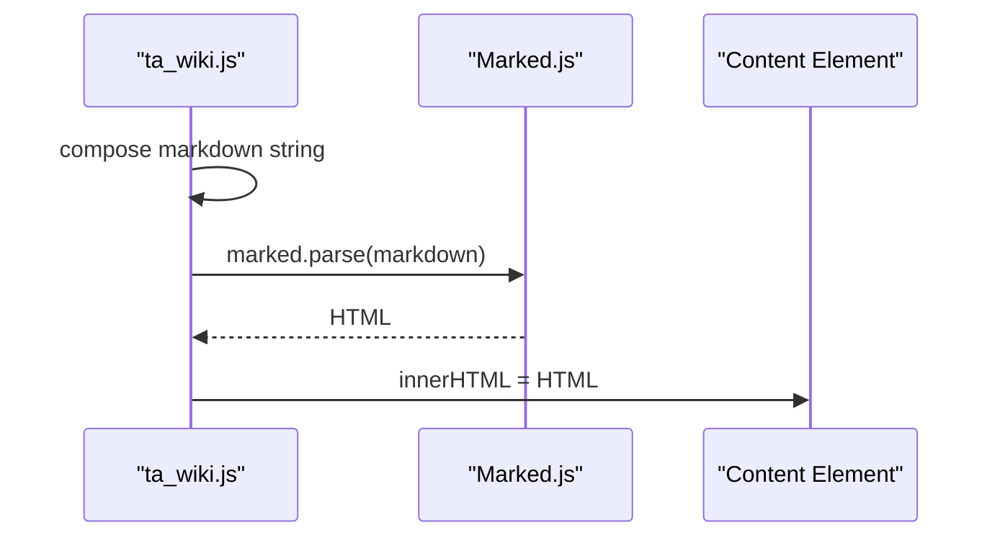
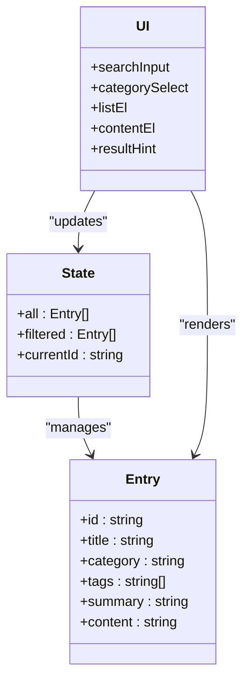
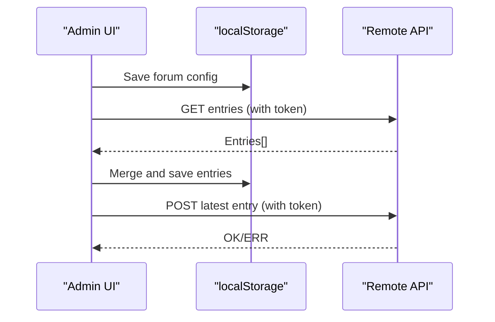
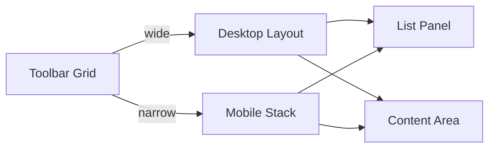
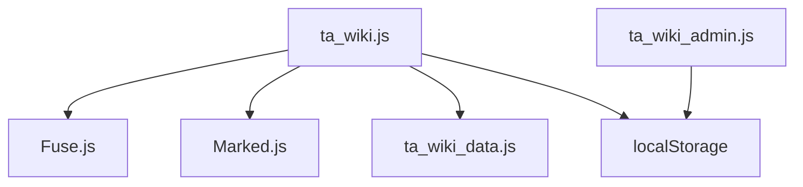

# TA Wiki Frontend

<cite>
**Referenced Files in This Document**
- [TA_wiki.html](file://tools_html/TA_wiki.html)
- [TA_wiki.js](file://js/ta_wiki.js)
- [TA_wiki_data.js](file://js/ta_wiki_data.js)
- [TA_wiki.css](file://css/TA_wiki.css)
- [TA_wiki_admin.html](file://tools_html/TA_wiki_admin.html)
- [TA_wiki_admin.js](file://js/ta_wiki_admin.js)
- [TA_wiki_admin.css](file://css/TA_wiki_admin.css)
</cite>

## Table of Contents
1. [Introduction](#introduction)
2. [Project Structure](#project-structure)
3. [Core Components](#core-components)
4. [Architecture Overview](#architecture-overview)
5. [Detailed Component Analysis](#detailed-component-analysis)
6. [Dependency Analysis](#dependency-analysis)
7. [Performance Considerations](#performance-considerations)
8. [Troubleshooting Guide](#troubleshooting-guide)
9. [Conclusion](#conclusion)

## Introduction
This document describes the TA Wiki frontend interface, focusing on the search and discovery system. It explains how Fuse.js powers fuzzy search across multiple fields, how Marked.js renders Markdown content, and how the interface organizes and presents knowledge entries. It also covers built-in and custom entries, category filtering, responsive layout, keyboard navigation, accessibility features, and performance optimization strategies for large content sets.

## Project Structure
The TA Wiki frontend consists of:
- A main page that displays the searchable knowledge base
- An admin page for adding/removing custom entries and syncing with a remote server
- JavaScript modules that implement search, filtering, rendering, and persistence
- CSS styles for responsive layout and content presentation

**Diagram sources**
- [TA_wiki.html:1-47](file://tools_html/TA_wiki.html#L1-L47)
- [TA_wiki.js:1-176](file://js/ta_wiki.js#L1-L176)
- [TA_wiki_data.js:1-48](file://js/ta_wiki_data.js#L1-L48)
- [TA_wiki.css:1-188](file://css/TA_wiki.css#L1-L188)
- [TA_wiki_admin.html:1-98](file://tools_html/TA_wiki_admin.html#L1-L98)
- [TA_wiki_admin.js:1-301](file://js/ta_wiki_admin.js#L1-L301)
- [TA_wiki_admin.css:1-206](file://css/TA_wiki_admin.css#L1-L206)

**Section sources**
- [TA_wiki.html:1-47](file://tools_html/TA_wiki.html#L1-L47)
- [TA_wiki_admin.html:1-98](file://tools_html/TA_wiki_admin.html#L1-L98)

## Core Components
- Search and filtering engine powered by Fuse.js with configurable threshold and multi-field indexing
- Markdown rendering pipeline using Marked.js with custom frontmatter-like metadata display
- Content organization with built-in entries and user-defined custom entries stored in browser storage
- Category filtering and result presentation in a responsive two-column layout
- Admin interface for adding entries, exporting data, and syncing with a remote server

**Section sources**
- [TA_wiki.js:130-152](file://js/ta_wiki.js#L130-L152)
- [TA_wiki.js:116-128](file://js/ta_wiki.js#L116-L128)
- [TA_wiki_data.js:1-48](file://js/ta_wiki_data.js#L1-L48)
- [TA_wiki_admin.js:32-41](file://js/ta_wiki_admin.js#L32-L41)
- [TA_wiki.css:61-105](file://css/TA_wiki.css#L61-L105)

## Architecture Overview
The frontend initializes the knowledge base from built-in entries and custom entries, builds categories, and renders a list and content area. Users can filter by keyword and category, and selection updates the rendered content.

**Diagram sources**
- [TA_wiki.html:27-36](file://tools_html/TA_wiki.html#L27-L36)
- [TA_wiki.js:130-171](file://js/ta_wiki.js#L130-L171)
- [TA_wiki.js:143-151](file://js/ta_wiki.js#L143-L151)
- [TA_wiki.js:116-128](file://js/ta_wiki.js#L116-L128)

## Detailed Component Analysis

### Search and Discovery System (Fuse.js)
- Multi-field indexing: title, summary, content, tags, category
- Threshold configuration: fuzziness controlled by a numeric threshold
- Behavior: incremental filtering on input change; category filter narrows the base set before fuzzy search
- Output: sorted by Fuse.js relevance; presented as a list with summary preview

**Diagram sources**
- [TA_wiki.js:130-152](file://js/ta_wiki.js#L130-L152)
- [TA_wiki.js:143-148](file://js/ta_wiki.js#L143-L148)

**Section sources**
- [TA_wiki.js:130-152](file://js/ta_wiki.js#L130-L152)
- [TA_wiki.js:143-148](file://js/ta_wiki.js#L143-L148)

### Markdown Rendering Pipeline (Marked.js)
- Content composition: a synthetic Markdown document is constructed with title and metadata (category and tags), followed by the raw content
- Rendering: Marked.js parses Markdown to HTML
- Presentation: rendered HTML is inserted into the content area; styles in the stylesheet define typography and code blocks

**Diagram sources**
- [TA_wiki.js:116-128](file://js/ta_wiki.js#L116-L128)

**Section sources**
- [TA_wiki.js:116-128](file://js/ta_wiki.js#L116-L128)
- [TA_wiki.css:99-126](file://css/TA_wiki.css#L99-L126)

### Content Organization and Presentation
- Built-in entries: loaded from a global array in the data module
- Custom entries: persisted in browser localStorage under a dedicated key
- Combined entries: built-in entries concatenated with custom entries
- Category building: derived from entries and populated into a select dropdown
- List rendering: each item shows title and summary; active item highlighted
- Content rendering: selected item’s content is rendered as Markdown

**Diagram sources**
- [TA_wiki.js:5-17](file://js/ta_wiki.js#L5-L17)
- [TA_wiki_data.js:2-44](file://js/ta_wiki_data.js#L2-L44)

**Section sources**
- [TA_wiki.js:71-82](file://js/ta_wiki.js#L71-L82)
- [TA_wiki.js:84-90](file://js/ta_wiki.js#L84-L90)
- [TA_wiki.js:92-114](file://js/ta_wiki.js#L92-L114)
- [TA_wiki_data.js:1-48](file://js/ta_wiki_data.js#L1-L48)

### Admin Interface and Remote Sync
- Local maintenance: add/remove custom entries, export to JSON, clear all
- Remote integration: configure read/write APIs and token; pull entries from remote and merge with local; push latest entry to remote
- External link mode: enable banner and optional “external-only” mode to redirect users to an external wiki

**Diagram sources**
- [TA_wiki_admin.html:55-90](file://tools_html/TA_wiki_admin.html#L55-L90)
- [TA_wiki_admin.js:43-58](file://js/ta_wiki_admin.js#L43-L58)
- [TA_wiki_admin.js:127-143](file://js/ta_wiki_admin.js#L127-L143)
- [TA_wiki_admin.js:283-296](file://js/ta_wiki_admin.js#L283-L296)

**Section sources**
- [TA_wiki_admin.js:32-41](file://js/ta_wiki_admin.js#L32-L41)
- [TA_wiki_admin.js:103-125](file://js/ta_wiki_admin.js#L103-L125)
- [TA_wiki_admin.js:127-143](file://js/ta_wiki_admin.js#L127-L143)
- [TA_wiki_admin.js:283-296](file://js/ta_wiki_admin.js#L283-L296)

### Responsive Layout and Accessibility
- Responsive grid layout: toolbar stacks on small screens; list becomes a top panel; content fills remaining space
- Accessible controls: search input and category select are standard form elements; list items are clickable; result count is announced
- Keyboard-friendly: focusable elements; no explicit keyboard shortcuts implemented in the current code

**Diagram sources**
- [TA_wiki.css:37-65](file://css/TA_wiki.css#L37-L65)
- [TA_wiki.css:168-187](file://css/TA_wiki.css#L168-L187)

**Section sources**
- [TA_wiki.css:37-65](file://css/TA_wiki.css#L37-L65)
- [TA_wiki.css:168-187](file://css/TA_wiki.css#L168-L187)

## Dependency Analysis
- External libraries: Fuse.js for fuzzy search; Marked.js for Markdown rendering
- Internal modules: data module supplies built-in entries; main module orchestrates search/filter/render; admin module manages persistence and remote sync
- Browser storage: entries persisted in localStorage; forum configuration stored separately

**Diagram sources**
- [TA_wiki.html:39-42](file://tools_html/TA_wiki.html#L39-L42)
- [TA_wiki.js:1-176](file://js/ta_wiki.js#L1-L176)
- [TA_wiki_data.js:1-48](file://js/ta_wiki_data.js#L1-L48)
- [TA_wiki_admin.js:1-301](file://js/ta_wiki_admin.js#L1-L301)

**Section sources**
- [TA_wiki.html:39-42](file://tools_html/TA_wiki.html#L39-L42)
- [TA_wiki.js:1-176](file://js/ta_wiki.js#L1-L176)
- [TA_wiki_admin.js:1-301](file://js/ta_wiki_admin.js#L1-L301)

## Performance Considerations
- Fuse.js configuration: threshold tuned for balanced precision/recall; minMatchCharLength avoids trivial matches; ignoreLocation reduces bias toward early matches
- Incremental filtering: search triggers on input events; consider debouncing for very large datasets to reduce re-renders
- Category pre-filtering: narrowing the base set before fuzzy search reduces search space
- Rendering cost: list rendering maps over filtered entries; content rendering uses a single Markdown parse per selection
- Caching strategies:
  - Persist combined entries in memory after first load to avoid repeated parsing
  - Debounce search input to limit Fuse instantiation frequency
  - Cache Fuse instance keyed by category to reuse when only keyword changes
  - Store last search results keyed by query to avoid recomputation for identical queries
- Large dataset tips:
  - Consider splitting content into smaller chunks or paginating results
  - Precompute lowercase keys or indices for faster filtering
  - Limit Fuse keys to frequently searched fields if tag/category usage is sparse

[No sources needed since this section provides general guidance]

## Troubleshooting Guide
- Search yields no results:
  - Verify category filter is not overly restrictive
  - Try shorter or different keywords
  - Confirm entries have content and tags populated
- External link mode:
  - If enabled, the main interface may hide local content and show a banner; disable external link mode to restore local entries
- Admin sync issues:
  - Ensure read/write URLs and token are configured
  - Test connection to confirm remote availability
  - Pull entries to merge with local; push latest to send a single entry

**Section sources**
- [TA_wiki.js:37-69](file://js/ta_wiki.js#L37-L69)
- [TA_wiki_admin.js:261-268](file://js/ta_wiki_admin.js#L261-L268)
- [TA_wiki_admin.js:270-281](file://js/ta_wiki_admin.js#L270-L281)

## Conclusion
The TA Wiki frontend delivers a practical, extensible knowledge discovery experience. Fuse.js enables robust fuzzy search across multiple fields, while Marked.js provides reliable Markdown rendering. The combination of built-in and custom entries, plus optional remote synchronization, supports both standalone and collaborative workflows. The responsive design and straightforward UI make it accessible across devices, and the modular architecture allows for incremental improvements such as debounced search and result caching.