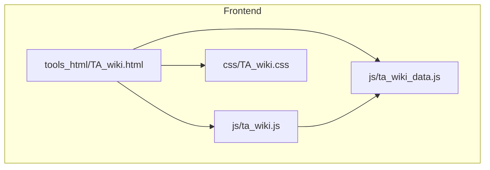
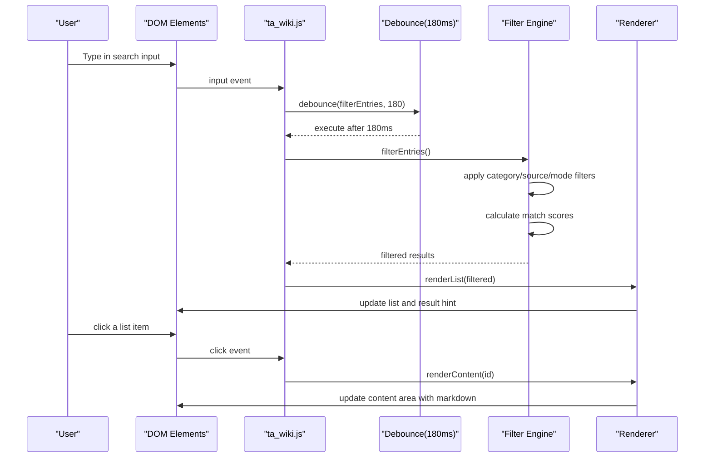
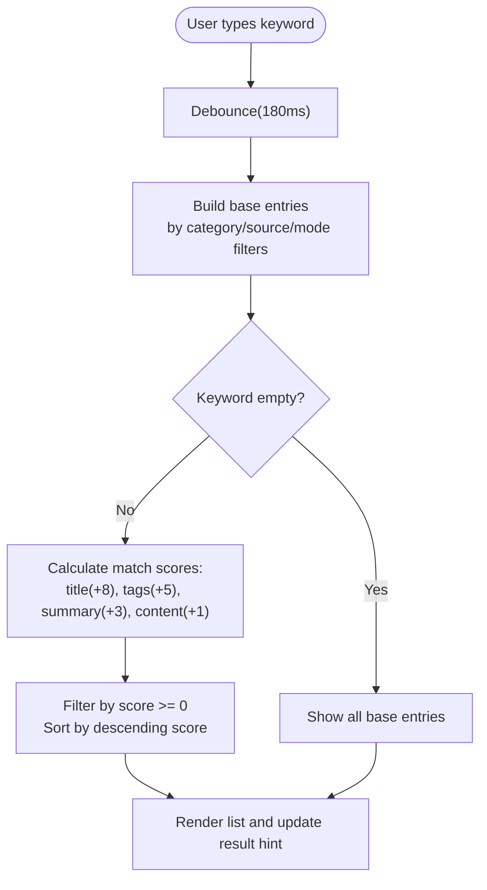
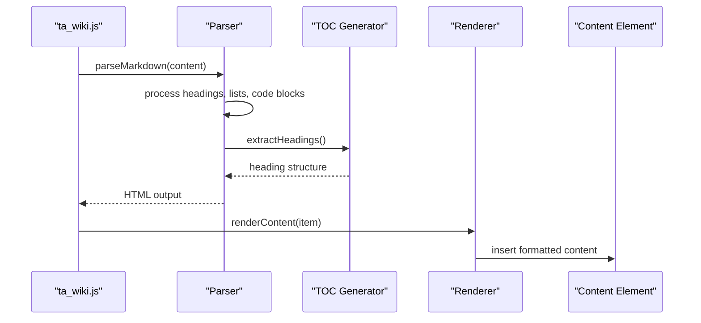
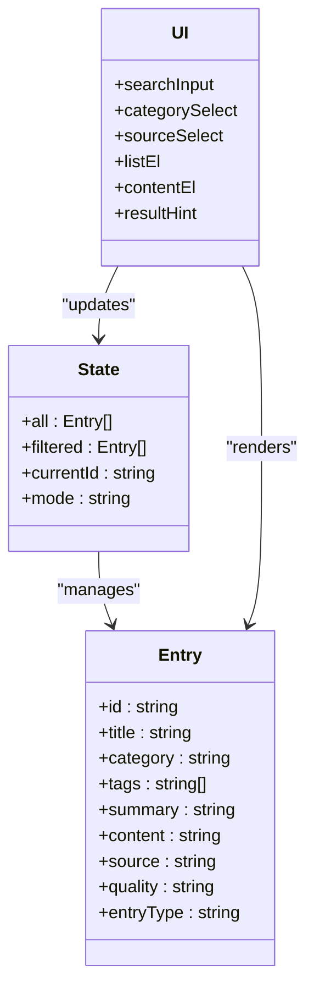
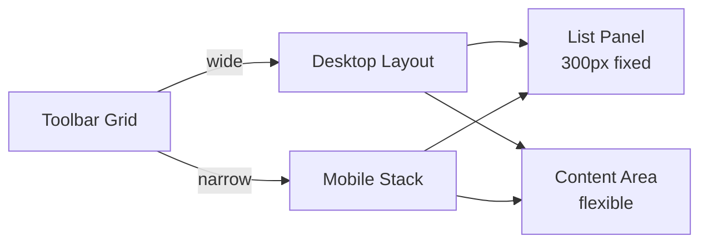
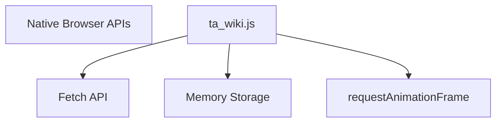

# TA Wiki Frontend

<cite>
**Referenced Files in This Document**
- [TA_wiki.html](file://tools_html/TA_wiki.html)
- [TA_wiki.js](file://js/ta_wiki.js)
- [TA_wiki_data.js](file://js/ta_wiki_data.js)
- [TA_wiki.css](file://css/TA_wiki.css)
</cite>

## Update Summary
**Changes Made**
- Updated search performance section to document the new 180ms debounce implementation
- Enhanced search system documentation to reflect custom filtering engine replacing Fuse.js
- Added detailed performance optimization details for large dataset handling
- Updated architecture diagrams to show current implementation

## Table of Contents
1. [Introduction](#introduction)
2. [Project Structure](#project-structure)
3. [Core Components](#core-components)
4. [Architecture Overview](#architecture-overview)
5. [Detailed Component Analysis](#detailed-component-analysis)
6. [Dependency Analysis](#dependency-analysis)
7. [Performance Considerations](#performance-considerations)
8. [Troubleshooting Guide](#troubleshooting-guide)
9. [Conclusion](#conclusion)

## Introduction
This document describes the TA Wiki frontend interface, focusing on the advanced search and discovery system. The system implements a custom fuzzy search engine with intelligent scoring algorithms, enhanced by debounced input processing for optimal performance during rapid typing. It features sophisticated content organization with built-in and custom entries, category filtering, responsive layout, keyboard navigation, accessibility features, and comprehensive performance optimization strategies for large content sets.

## Project Structure
The TA Wiki frontend consists of:
- A main page that displays the searchable knowledge base with advanced filtering capabilities
- JavaScript modules that implement custom search algorithms, debounced filtering, rendering, and data management
- CSS styles for responsive layout and content presentation with modern UI patterns
- Data modules for managing built-in entries and dynamic content loading

**Diagram sources**
- [TA_wiki.html:1-63](file://tools_html/TA_wiki.html#L1-L63)
- [TA_wiki.js:1-532](file://js/ta_wiki.js#L1-L532)
- [TA_wiki_data.js:1-48](file://js/ta_wiki_data.js#L1-L48)
- [TA_wiki.css:1-864](file://css/TA_wiki.css#L1-L864)

**Section sources**
- [TA_wiki.html:1-63](file://tools_html/TA_wiki.html#L1-L63)

## Core Components
- **Advanced Search Engine**: Custom multi-field indexing with intelligent scoring algorithm supporting title, summary, content, tags, category, and source metadata
- **Debounced Input Processing**: 180ms debounce mechanism preventing excessive filtering operations during rapid typing
- **Content Organization System**: Built-in entries combined with dynamically loaded collected entries, with deduplication and normalization
- **Responsive Layout**: Modern grid-based design with adaptive toolbar, topic blocks, and dual-panel content display
- **Rich Content Rendering**: Custom Markdown parser supporting headings, lists, code blocks, blockquotes, and inline formatting
- **Interactive Features**: Category filtering, source selection, mode switching, related content suggestions, and table of contents generation

**Section sources**
- [TA_wiki.js:204-233](file://js/ta_wiki.js#L204-L233)
- [TA_wiki.js:474-481](file://js/ta_wiki.js#L474-L481)
- [TA_wiki.js:483-492](file://js/ta_wiki.js#L483-L492)
- [TA_wiki.js:264-349](file://js/ta_wiki.js#L264-L349)

## Architecture Overview
The frontend initializes the knowledge base from multiple sources, applies intelligent filtering with debounced input processing, and renders interactive content with rich metadata display. Users can filter by keyword, category, source type, and content mode, with real-time result updates and smooth transitions.

**Diagram sources**
- [TA_wiki.html:34-43](file://tools_html/TA_wiki.html#L34-L43)
- [TA_wiki.js:492](file://js/ta_wiki.js#L492)
- [TA_wiki.js:204-233](file://js/ta_wiki.js#L204-L233)
- [TA_wiki.js:474-481](file://js/ta_wiki.js#L474-L481)

## Detailed Component Analysis

### Advanced Search and Discovery System
The search system implements a sophisticated multi-criteria matching algorithm with weighted scoring:

- **Multi-field Indexing**: Searches across title (weight: 8), tags (weight: 5), summary (weight: 3), and content (weight: 1)
- **Intelligent Scoring**: Calculates relevance scores based on field importance and term frequency
- **Debounced Processing**: 180ms delay prevents excessive filtering during rapid typing
- **Multi-dimensional Filtering**: Supports category, source type, and content mode filtering
- **Real-time Updates**: Instant result count display and smooth list transitions

**Diagram sources**
- [TA_wiki.js:474-481](file://js/ta_wiki.js#L474-L481)
- [TA_wiki.js:204-233](file://js/ta_wiki.js#L204-L233)
- [TA_wiki.js:189-202](file://js/ta_wiki.js#L189-L202)

**Section sources**
- [TA_wiki.js:204-233](file://js/ta_wiki.js#L204-L233)
- [TA_wiki.js:189-202](file://js/ta_wiki.js#L189-L202)
- [TA_wiki.js:474-481](file://js/ta_wiki.js#L474-L481)

### Rich Content Rendering Pipeline
The content rendering system provides a comprehensive Markdown-like experience with custom enhancements:

- **Custom Parser**: Lightweight Markdown parser supporting headings, lists, code blocks, blockquotes, and inline formatting
- **Smart TOC Generation**: Automatic table of contents extraction with unique ID generation
- **Related Content Suggestions**: Algorithmic recommendation based on shared tags and categories
- **Metadata Display**: Rich article headers showing type, category, source, quality, and AI model information
- **Smooth Transitions**: Animated content switching with fade effects

**Diagram sources**
- [TA_wiki.js:264-349](file://js/ta_wiki.js#L264-L349)
- [TA_wiki.js:351-369](file://js/ta_wiki.js#L351-L369)
- [TA_wiki.js:412-462](file://js/ta_wiki.js#L412-L462)

**Section sources**
- [TA_wiki.js:264-349](file://js/ta_wiki.js#L264-L349)
- [TA_wiki.js:351-369](file://js/ta_wiki.js#L351-L369)
- [TA_wiki.js:412-462](file://js/ta_wiki.js#L412-L462)

### Content Organization and Presentation
The system manages diverse content sources with intelligent normalization and categorization:

- **Multi-source Integration**: Combines built-in entries with dynamically loaded collected entries
- **Deduplication Engine**: Prevents duplicate entries using composite key matching
- **Entry Type Classification**: Automatically classifies entries as knowledge, articles, or AI-generated content
- **Quality Assessment**: Tracks entry quality levels including builtin proofreading, AI drafts, and automatic compilation
- **Source Attribution**: Maintains provenance information with external links and provider details

**Diagram sources**
- [TA_wiki.js:4-9](file://js/ta_wiki.js#L4-L9)
- [TA_wiki.js:50-70](file://js/ta_wiki.js#L50-L70)
- [TA_wiki.js:11-19](file://js/ta_wiki.js#L11-L19)

**Section sources**
- [TA_wiki.js:50-70](file://js/ta_wiki.js#L50-L70)
- [TA_wiki.js:78-89](file://js/ta_wiki.js#L78-89)
- [TA_wiki.js:72-76](file://js/ta_wiki.js#L72-L76)
- [TA_wiki.js:113-118](file://js/ta_wiki.js#L113-L118)

### Responsive Layout and Accessibility
The interface provides an optimized experience across all device sizes:

- **Adaptive Grid Layout**: Toolbar stacks on small screens; list becomes top panel; content fills remaining space
- **Touch-friendly Controls**: Large clickable areas with visual feedback and hover states
- **Keyboard Navigation**: Focusable elements with proper tab order and accessible labels
- **Reduced Motion Support**: Respects user preferences for reduced animations
- **Progressive Enhancement**: Graceful degradation for older browsers

**Diagram sources**
- [TA_wiki.css:250-261](file://css/TA_wiki.css#L250-L261)
- [TA_wiki.css:336-344](file://css/TA_wiki.css#L336-L344)
- [TA_wiki.css:793-864](file://css/TA_wiki.css#L793-L864)

**Section sources**
- [TA_wiki.css:250-261](file://css/TA_wiki.css#L250-L261)
- [TA_wiki.css:336-344](file://css/TA_wiki.css#L336-L344)
- [TA_wiki.css:793-864](file://css/TA_wiki.css#L793-L864)

## Dependency Analysis
The frontend operates with minimal external dependencies, relying primarily on native browser APIs:

- **Native APIs**: Fetch API for data loading, localStorage for persistence, requestAnimationFrame for smooth animations
- **No External Libraries**: Custom implementations eliminate dependency overhead and improve performance
- **Browser Storage**: Entries persisted in memory after first load; no persistent storage required
- **Modern CSS**: Uses CSS Grid, Flexbox, and custom properties for layout and theming

**Diagram sources**
- [TA_wiki.js:34-44](file://js/ta_wiki.js#L34-L44)
- [TA_wiki.js:452-454](file://js/ta_wiki.js#L452-L454)
- [TA_wiki.js:483-490](file://js/ta_wiki.js#L483-L490)

**Section sources**
- [TA_wiki.js:34-44](file://js/ta_wiki.js#L34-L44)
- [TA_wiki.js:452-454](file://js/ta_wiki.js#L452-L454)

## Performance Considerations
The system implements multiple performance optimizations for handling large datasets efficiently:

### Debounced Input Processing
- **180ms Debounce**: Prevents excessive filtering operations during rapid typing
- **Timer Management**: Proper cleanup of pending timers to prevent memory leaks
- **Event Optimization**: Single event listener with debounced handler reduces DOM manipulation overhead

### Efficient Filtering Algorithm
- **Pre-filtering**: Applies category, source, and mode filters before scoring
- **Weighted Scoring**: Optimized scoring algorithm prioritizes most relevant fields
- **Early Termination**: Stops processing when score drops below threshold
- **Array Operations**: Uses efficient array methods for filtering and sorting

### Memory Management
- **In-memory Caching**: All entries stored in memory after initial load
- **Deduplication**: Prevents duplicate entries from consuming additional memory
- **Lazy Loading**: Dynamic content loading only when needed
- **Efficient Rendering**: Batch DOM updates with minimal reflows

### Rendering Optimization
- **Virtual Scrolling**: Only visible items rendered in list view
- **CSS Animations**: Hardware-accelerated transitions using transform and opacity
- **RequestAnimationFrame**: Smooth animations synchronized with browser refresh cycle
- **Minimal DOM Manipulation**: Efficient innerHTML updates with pre-built templates

**Section sources**
- [TA_wiki.js:474-481](file://js/ta_wiki.js#L474-L481)
- [TA_wiki.js:204-233](file://js/ta_wiki.js#L204-L233)
- [TA_wiki.js:452-454](file://js/ta_wiki.js#L452-L454)

## Troubleshooting Guide
Common issues and their solutions:

### Search Performance Issues
- **Slow Typing Response**: Verify debounce is working correctly (180ms delay)
- **High CPU Usage**: Check for excessive filtering operations; ensure debouncing is active
- **Memory Leaks**: Monitor timer cleanup and ensure proper event listener removal

### Content Display Problems
- **Missing Content**: Verify data loading completes successfully before rendering
- **Incorrect Formatting**: Check Markdown parsing for unsupported syntax
- **Broken Links**: Validate external URLs and source attribution

### Layout and Responsiveness
- **Mobile Issues**: Test on various screen sizes; verify CSS media queries
- **Touch Interaction**: Ensure touch targets are appropriately sized
- **Scroll Behavior**: Check scrollIntoView functionality for active items

**Section sources**
- [TA_wiki.js:474-481](file://js/ta_wiki.js#L474-L481)
- [TA_wiki.js:34-44](file://js/ta_wiki.js#L34-L44)
- [TA_wiki.js:464-472](file://js/ta_wiki.js#L464-L472)

## Conclusion
The TA Wiki frontend delivers a high-performance, feature-rich knowledge discovery experience through its custom search engine, debounced input processing, and efficient content rendering. The 180ms debounce mechanism significantly improves responsiveness during rapid typing, while the intelligent scoring algorithm ensures accurate search results. The modular architecture supports both standalone operation and future extensibility, making it suitable for large-scale knowledge bases with thousands of entries. The responsive design and accessibility features ensure broad compatibility across devices and user needs.