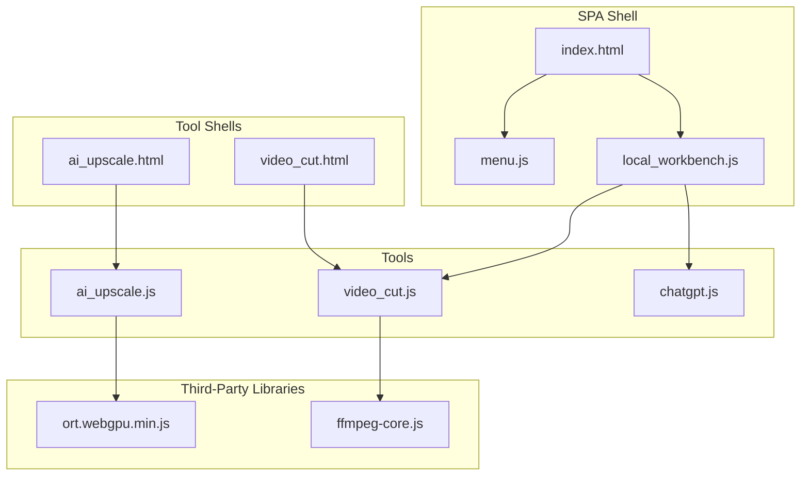
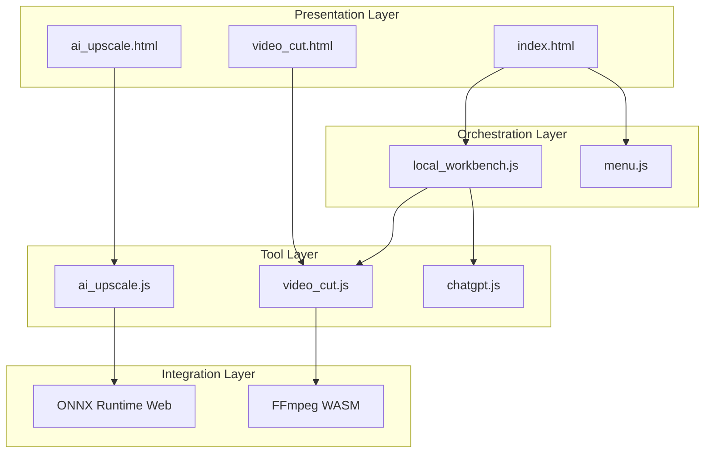
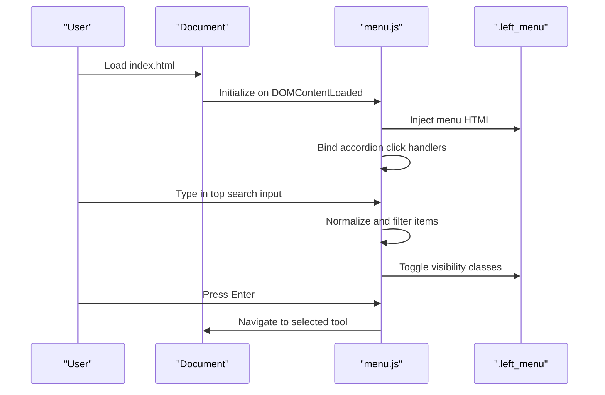
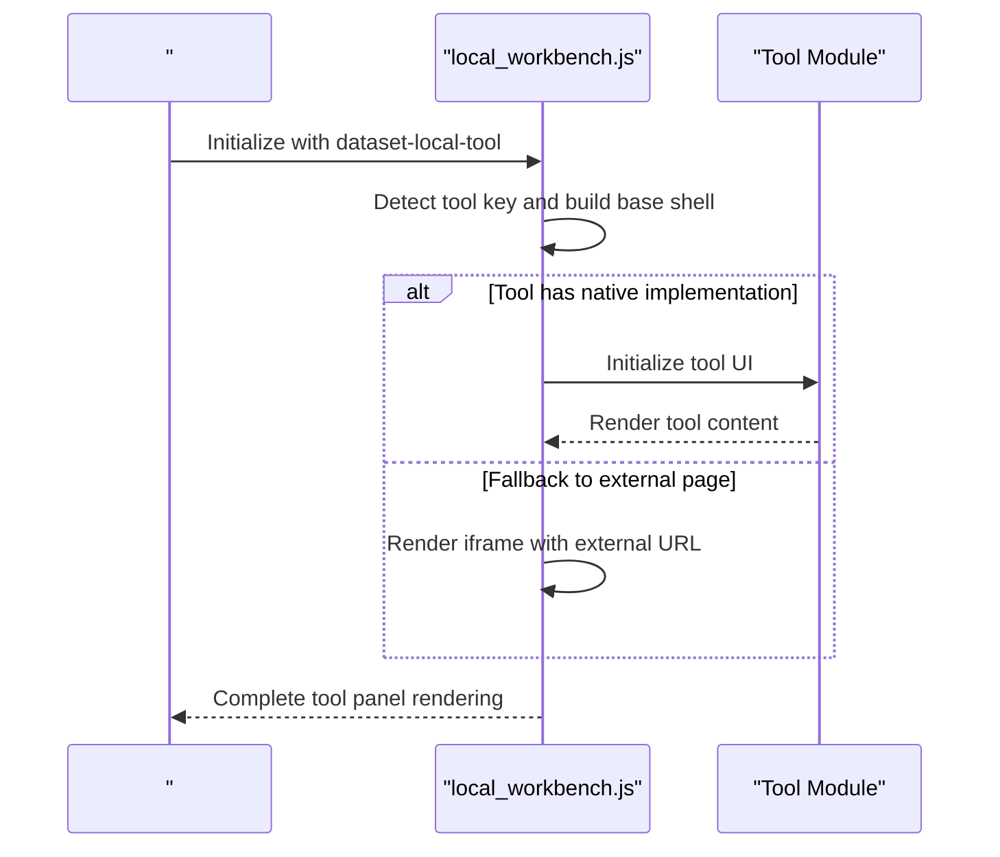
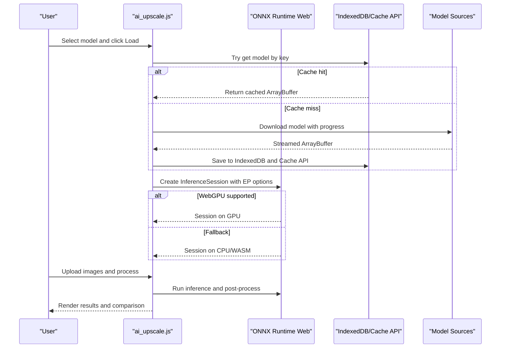
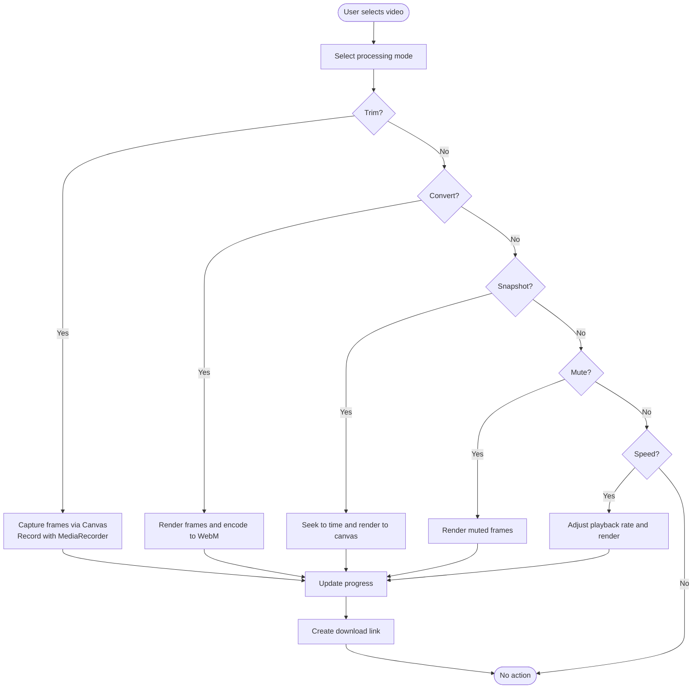
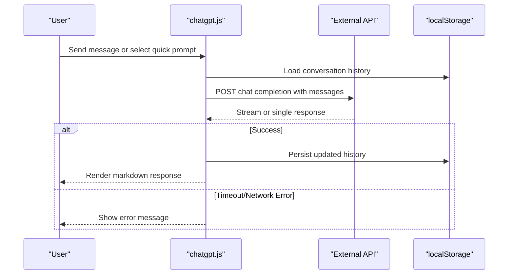
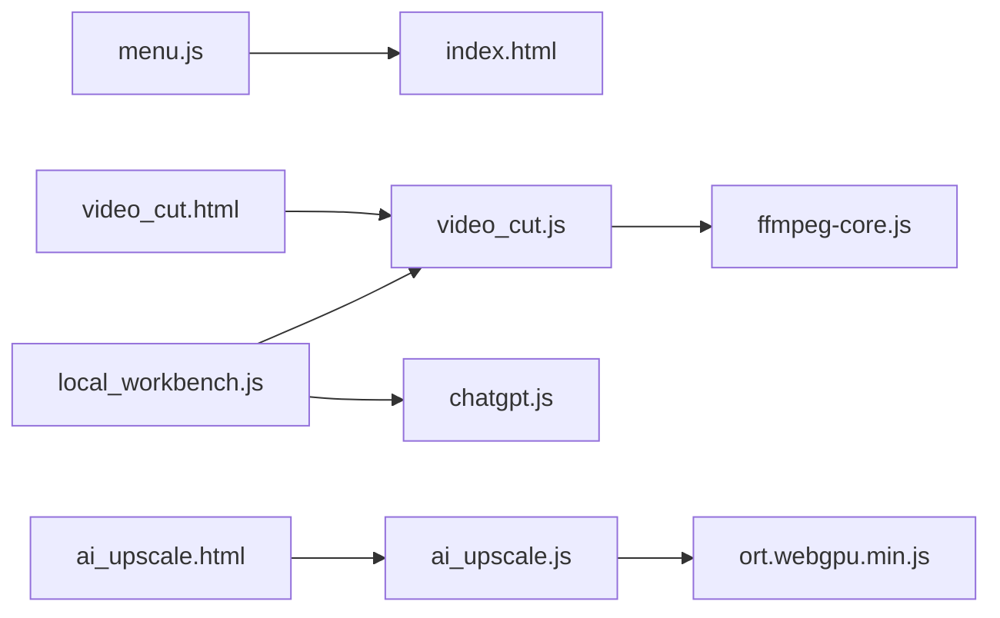

# Architecture Overview

<cite>
**Referenced Files in This Document**
- [index.html](file://index.html)
- [menu.js](file://js/menu.js)
- [local_workbench.js](file://js/local_workbench.js)
- [ai_upscale.js](file://js/ai_upscale.js)
- [video_cut.js](file://js/video_cut.js)
- [chatgpt.js](file://js/chatgpt.js)
- [ai_upscale.html](file://tools_html/ai_upscale.html)
- [video_cut.html](file://tools_html/video_cut.html)
- [ort.webgpu.min.js](file://third_part/onnxruntime-web/1.17.1/ort.webgpu.min.js)
- [ffmpeg-core.js](file://third_part/ffmpeg-wasm/ffmpeg-core.js)
</cite>

## Table of Contents
1. [Introduction](#introduction)
2. [Project Structure](#project-structure)
3. [Core Components](#core-components)
4. [Architecture Overview](#architecture-overview)
5. [Detailed Component Analysis](#detailed-component-analysis)
6. [Dependency Analysis](#dependency-analysis)
7. [Performance Considerations](#performance-considerations)
8. [Troubleshooting Guide](#troubleshooting-guide)
9. [Conclusion](#conclusion)

## Introduction
This document describes the TAWEBTOOL system architecture as a modular Single-Page Application (SPA) built around a component-based design. The platform centers on a shared navigation system, a reusable workbench framework, and tool-specific implementations. It integrates WebAssembly (WASM) and WebGPU for AI inference and video processing, while maintaining robust browser compatibility and graceful degradation strategies. The system emphasizes performance optimization, memory management, and user experience across diverse tool categories including AI image enhancement, video editing, and utility tools.

## Project Structure
The repository follows a clear separation of concerns:
- Shared SPA shell and navigation: index.html and js/menu.js
- Workbench framework: js/local_workbench.js orchestrating tool panels
- Tool implementations: js/*.js for specific tools
- Tool HTML shells: tools_html/*.html wiring tools into the SPA
- Third-party libraries: third_part/* for ONNX Runtime Web and FFmpeg WASM
- Stylesheets: css/* for theme and tool-specific UI

**Diagram sources**
- [index.html:1-25](file://index.html#L1-L25)
- [menu.js:1-273](file://js/menu.js#L1-L273)
- [local_workbench.js:1-197](file://js/local_workbench.js#L1-L197)
- [ai_upscale.js:1-800](file://js/ai_upscale.js#L1-L800)
- [video_cut.js:1-688](file://js/video_cut.js#L1-L688)
- [chatgpt.js:1-304](file://js/chatgpt.js#L1-L304)
- [ai_upscale.html:1-167](file://tools_html/ai_upscale.html#L1-L167)
- [video_cut.html:1-28](file://tools_html/video_cut.html#L1-L28)
- [ort.webgpu.min.js:1-2157](file://third_part/onnxruntime-web/1.17.1/ort.webgpu.min.js#L1-L2157)
- [ffmpeg-core.js:1-22](file://third_part/ffmpeg-wasm/ffmpeg-core.js#L1-L22)

**Section sources**
- [index.html:1-25](file://index.html#L1-L25)
- [menu.js:1-273](file://js/menu.js#L1-L273)
- [local_workbench.js:1-197](file://js/local_workbench.js#L1-L197)

## Core Components
- Central Navigation System: A single-source-of-truth menu data structure drives a collapsible sidebar with global search and filtering. It supports hierarchical categories and items, with dynamic injection into the DOM and keyboard-friendly interactions.
- Shared Workbench Framework: A lightweight orchestration layer that renders tool-specific panels, handles iframe fallbacks, and manages tool lifecycle for local tools.
- Tool-Specific Implementations: Each tool encapsulates its own UI, state, and processing logic. Examples include AI image upscaling with ONNX Runtime Web, pure-browser video editing, and a ChatGPT-like assistant.

Key implementation references:
- Navigation and search: [menu.js:1-273](file://js/menu.js#L1-L273)
- Workbench rendering and fallbacks: [local_workbench.js:1-197](file://js/local_workbench.js#L1-L197)
- AI upscaler with ONNX Runtime Web: [ai_upscale.js:1-800](file://js/ai_upscale.js#L1-L800)
- Pure-browser video editor: [video_cut.js:1-688](file://js/video_cut.js#L1-L688)
- ChatGPT assistant: [chatgpt.js:1-304](file://js/chatgpt.js#L1-L304)

**Section sources**
- [menu.js:1-273](file://js/menu.js#L1-L273)
- [local_workbench.js:1-197](file://js/local_workbench.js#L1-L197)
- [ai_upscale.js:1-800](file://js/ai_upscale.js#L1-L800)
- [video_cut.js:1-688](file://js/video_cut.js#L1-L688)
- [chatgpt.js:1-304](file://js/chatgpt.js#L1-L304)

## Architecture Overview
The system employs a layered SPA architecture:
- Presentation Layer: index.html and tools_html/*.html provide minimal shells that embed tool scripts.
- Orchestration Layer: local_workbench.js renders tool panels and delegates to tool-specific modules.
- Tool Layer: per-tool JavaScript modules manage UI, state, and processing.
- Integration Layer: third_party libraries (ONNX Runtime Web, FFmpeg WASM) provide compute and media capabilities.

**Diagram sources**
- [index.html:1-25](file://index.html#L1-L25)
- [ai_upscale.html:1-167](file://tools_html/ai_upscale.html#L1-L167)
- [video_cut.html:1-28](file://tools_html/video_cut.html#L1-L28)
- [local_workbench.js:1-197](file://js/local_workbench.js#L1-L197)
- [menu.js:1-273](file://js/menu.js#L1-L273)
- [ai_upscale.js:1-800](file://js/ai_upscale.js#L1-L800)
- [video_cut.js:1-688](file://js/video_cut.js#L1-L688)
- [ort.webgpu.min.js:1-2157](file://third_part/onnxruntime-web/1.17.1/ort.webgpu.min.js#L1-L2157)
- [ffmpeg-core.js:1-22](file://third_part/ffmpeg-wasm/ffmpeg-core.js#L1-L22)

## Detailed Component Analysis

### Navigation and Search System
The navigation system is driven by a centralized menu data structure and builds the sidebar dynamically. It supports:
- Hierarchical categories with accordion-style toggling
- Global top-level search across labels, categories, and keywords
- Keyboard shortcuts and accessibility attributes
- Dynamic injection of menu HTML into the DOM

**Diagram sources**
- [index.html:1-25](file://index.html#L1-L25)
- [menu.js:1-273](file://js/menu.js#L1-L273)

**Section sources**
- [menu.js:1-273](file://js/menu.js#L1-L273)
- [index.html:1-25](file://index.html#L1-L25)

### Local Workbench Framework
The workbench framework provides a standardized panel for tools:
- Creates a tool shell container
- Renders tool-specific content or iframe fallbacks
- Manages tool lifecycle and state
- Supports quick access to external resources

**Diagram sources**
- [local_workbench.js:1-197](file://js/local_workbench.js#L1-L197)
- [video_cut.html:1-28](file://tools_html/video_cut.html#L1-L28)

**Section sources**
- [local_workbench.js:1-197](file://js/local_workbench.js#L1-L197)
- [video_cut.html:1-28](file://tools_html/video_cut.html#L1-L28)

### AI Upscaler (ONNX Runtime Web + WebGPU)
The AI upscaler integrates ONNX Runtime Web with WebGPU acceleration:
- Model configuration and multiple sources with mirroring
- Automatic model caching via IndexedDB and Cache API
- Execution provider selection (WebGPU or WASM/CPU)
- Progress reporting and error handling
- Comparison slider for before/after visualization

**Diagram sources**
- [ai_upscale.js:1-800](file://js/ai_upscale.js#L1-L800)
- [ort.webgpu.min.js:1-2157](file://third_part/onnxruntime-web/1.17.1/ort.webgpu.min.js#L1-L2157)
- [ai_upscale.html:1-167](file://tools_html/ai_upscale.html#L1-L167)

**Section sources**
- [ai_upscale.js:1-800](file://js/ai_upscale.js#L1-L800)
- [ai_upscale.html:1-167](file://tools_html/ai_upscale.html#L1-L167)
- [ort.webgpu.min.js:1-2157](file://third_part/onnxruntime-web/1.17.1/ort.webgpu.min.js#L1-L2157)

### Video Editor (Pure Browser APIs)
The video editor avoids external dependencies by leveraging native browser APIs:
- Uses MediaRecorder for capture and encoding
- Canvas-based frame rendering for trimming and effects
- AudioContext for audio track extraction and manipulation
- Progress tracking and cancellation support

**Diagram sources**
- [video_cut.js:1-688](file://js/video_cut.js#L1-L688)
- [video_cut.html:1-28](file://tools_html/video_cut.html#L1-L28)

**Section sources**
- [video_cut.js:1-688](file://js/video_cut.js#L1-L688)
- [video_cut.html:1-28](file://tools_html/video_cut.html#L1-L28)

### Chat Assistant (External API Integration)
The chat assistant provides a Markdown-rendered interface backed by an external API:
- Local storage persistence for conversation history
- Markdown parsing with optional sanitization
- Quick prompts and continuous conversation
- Request timeout handling with retries

**Diagram sources**
- [chatgpt.js:1-304](file://js/chatgpt.js#L1-L304)

**Section sources**
- [chatgpt.js:1-304](file://js/chatgpt.js#L1-L304)

## Dependency Analysis
The system exhibits low coupling and high cohesion among components:
- menu.js depends on DOM and maintains a single source of truth for navigation.
- local_workbench.js depends on tool modules and the DOM to render panels.
- Tool modules depend on third-party libraries and browser APIs.
- HTML shells depend on their respective tool scripts and shared styles.

**Diagram sources**
- [menu.js:1-273](file://js/menu.js#L1-L273)
- [local_workbench.js:1-197](file://js/local_workbench.js#L1-L197)
- [ai_upscale.js:1-800](file://js/ai_upscale.js#L1-L800)
- [video_cut.js:1-688](file://js/video_cut.js#L1-L688)
- [chatgpt.js:1-304](file://js/chatgpt.js#L1-L304)
- [ai_upscale.html:1-167](file://tools_html/ai_upscale.html#L1-L167)
- [video_cut.html:1-28](file://tools_html/video_cut.html#L1-L28)
- [ort.webgpu.min.js:1-2157](file://third_part/onnxruntime-web/1.17.1/ort.webgpu.min.js#L1-L2157)
- [ffmpeg-core.js:1-22](file://third_part/ffmpeg-wasm/ffmpeg-core.js#L1-L22)

**Section sources**
- [menu.js:1-273](file://js/menu.js#L1-L273)
- [local_workbench.js:1-197](file://js/local_workbench.js#L1-L197)
- [ai_upscale.js:1-800](file://js/ai_upscale.js#L1-L800)
- [video_cut.js:1-688](file://js/video_cut.js#L1-L688)
- [chatgpt.js:1-304](file://js/chatgpt.js#L1-L304)
- [ai_upscale.html:1-167](file://tools_html/ai_upscale.html#L1-L167)
- [video_cut.html:1-28](file://tools_html/video_cut.html#L1-L28)
- [ort.webgpu.min.js:1-2157](file://third_part/onnxruntime-web/1.17.1/ort.webgpu.min.js#L1-L2157)
- [ffmpeg-core.js:1-22](file://third_part/ffmpeg-wasm/ffmpeg-core.js#L1-L22)

## Performance Considerations
- WebGPU Acceleration: AI upscaling prioritizes WebGPU when available, with conservative execution provider configuration to maximize compatibility.
- Model Caching: Dual-layer caching (IndexedDB and Cache API) reduces repeated downloads and accelerates startup.
- Browser APIs for Video: Native MediaRecorder and Canvas avoid heavy external dependencies, minimizing bundle size and latency.
- Memory Management: Tools dispose of canvases, revoke object URLs, and clean up event listeners to prevent leaks.
- Graceful Degradation: Tools detect feature support (e.g., showDirectoryPicker) and adjust UI accordingly; fallbacks (iframe) preserve usability.

[No sources needed since this section provides general guidance]

## Troubleshooting Guide
Common issues and resolutions:
- ONNX Runtime not loaded: Verify script inclusion and CDN availability; check console for errors.
- WebGPU unsupported: Switch to CPU mode; ensure latest Chromium-based browser.
- Model download failures: Retry with mirror sources; confirm network connectivity and CORS policies.
- Video export fails: Confirm MediaRecorder MIME type support; try alternative browsers.
- IndexedDB quota exceeded: Clear browser cache or IndexedDB entries; reduce model sizes.

**Section sources**
- [ai_upscale.js:1-800](file://js/ai_upscale.js#L1-L800)
- [video_cut.js:1-688](file://js/video_cut.js#L1-L688)

## Conclusion
TAWEBTOOL demonstrates a scalable SPA architecture with a strong focus on modularity, performance, and user experience. The shared navigation and workbench frameworks enable rapid tool development, while WebAssembly and WebGPU integrations deliver high-performance AI inference. The system’s design choices—such as dual caching, pure-browser video processing, and graceful degradation—ensure broad compatibility and reliability across diverse environments.