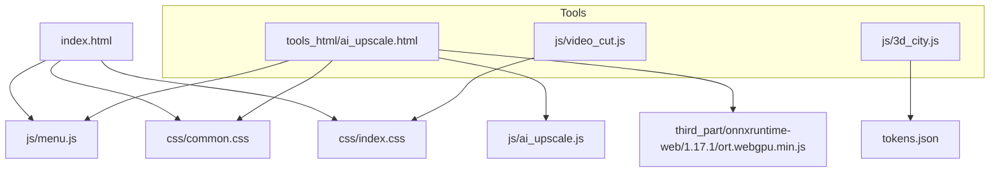
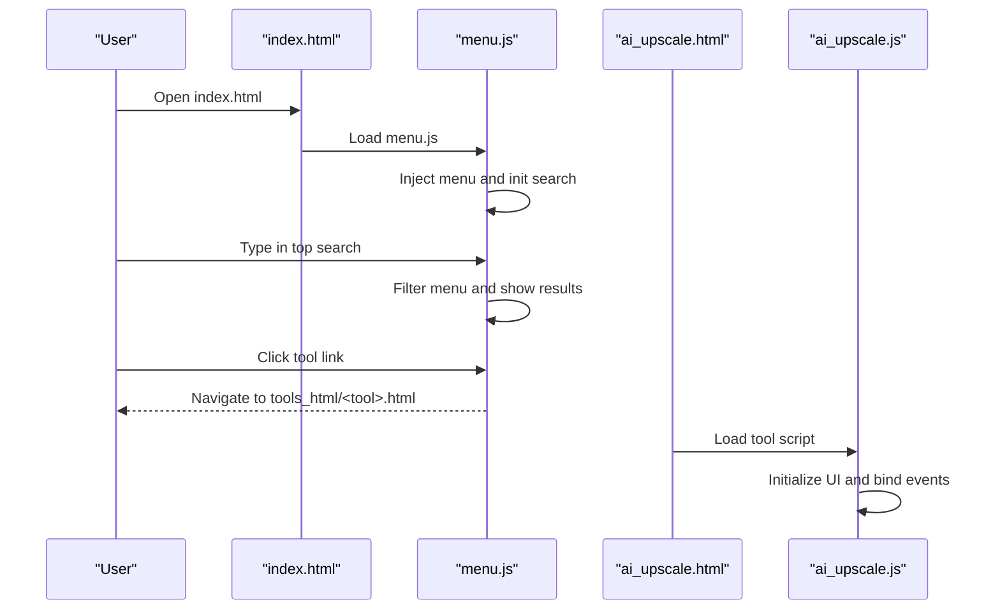
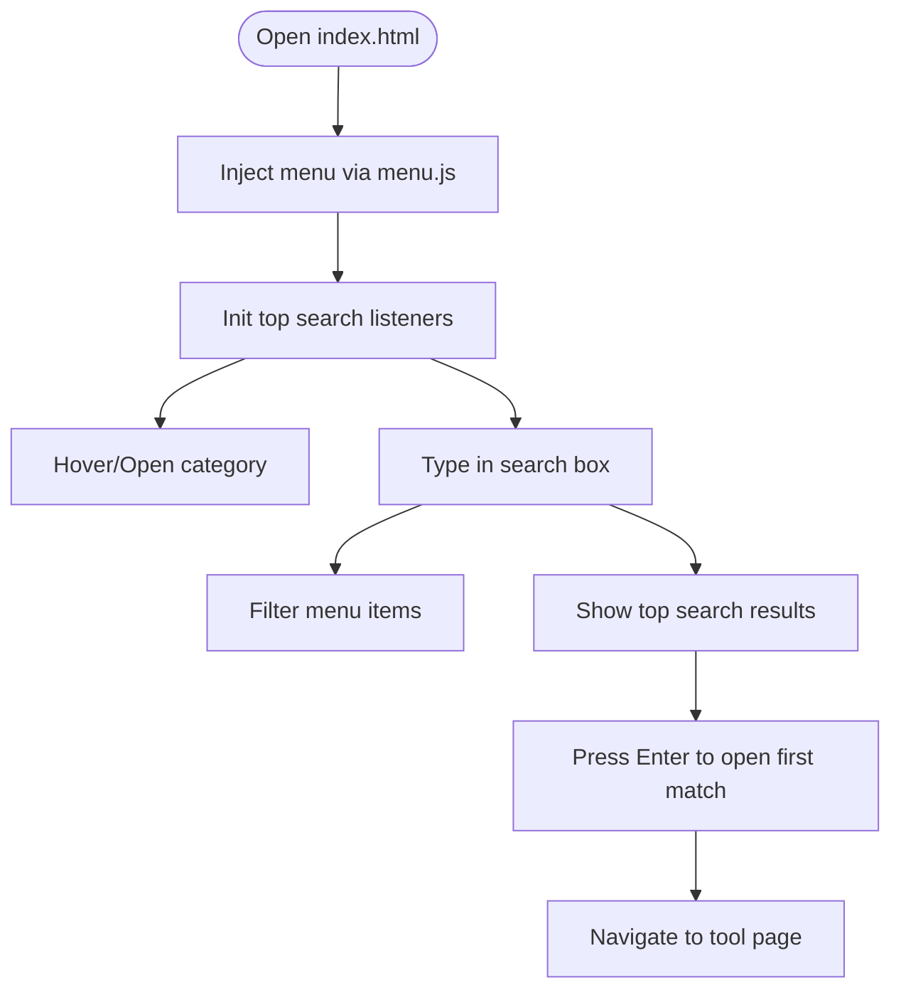
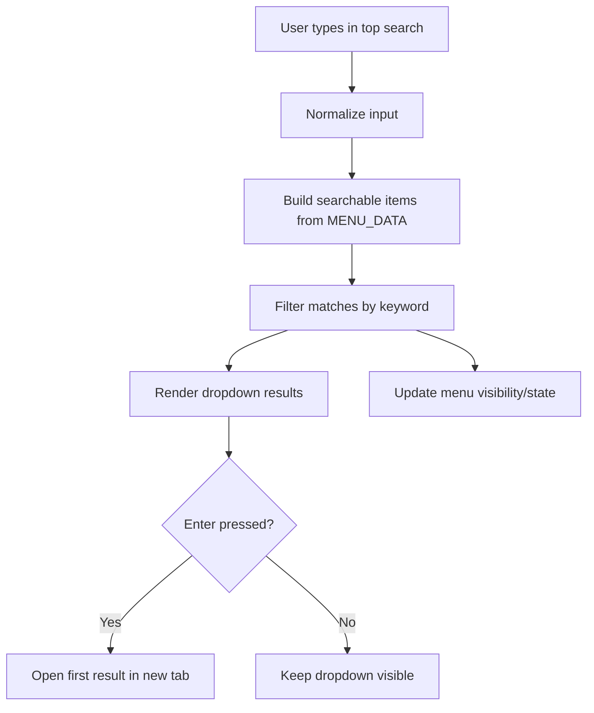
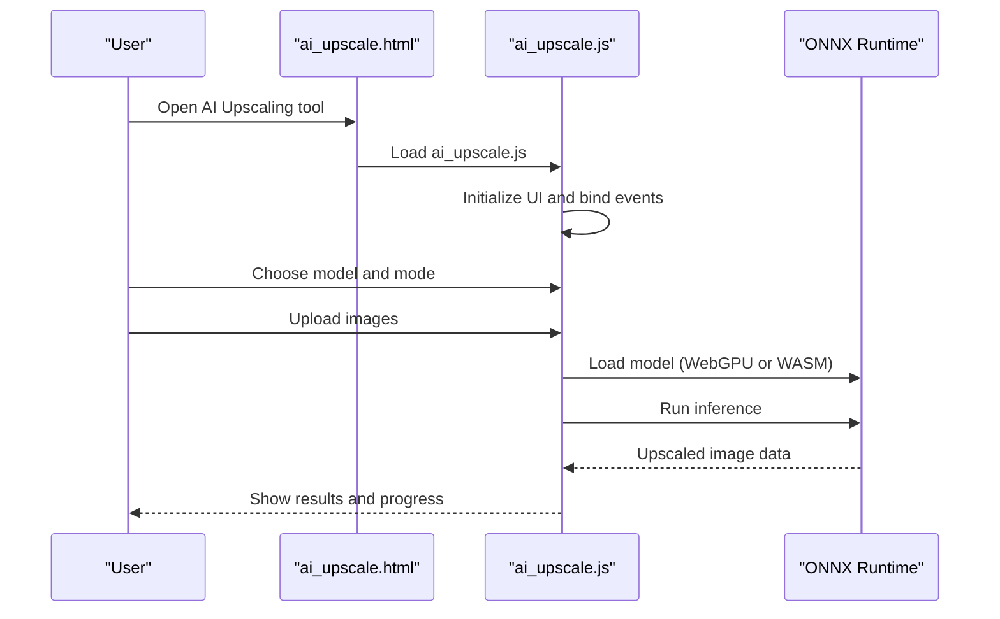
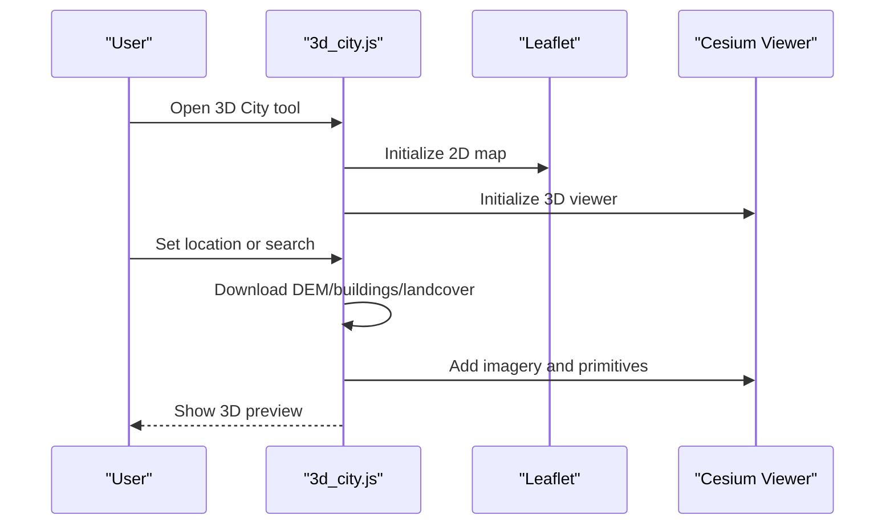
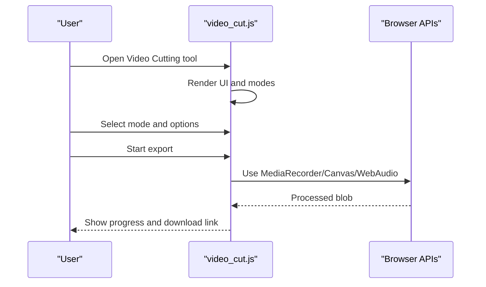
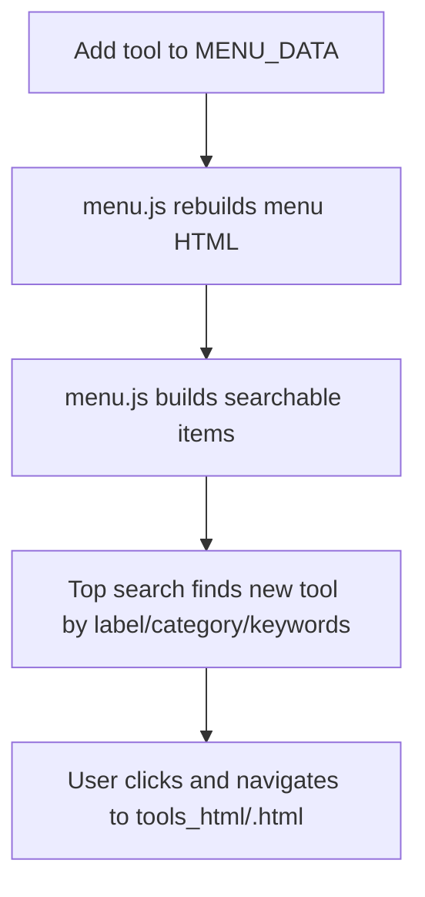
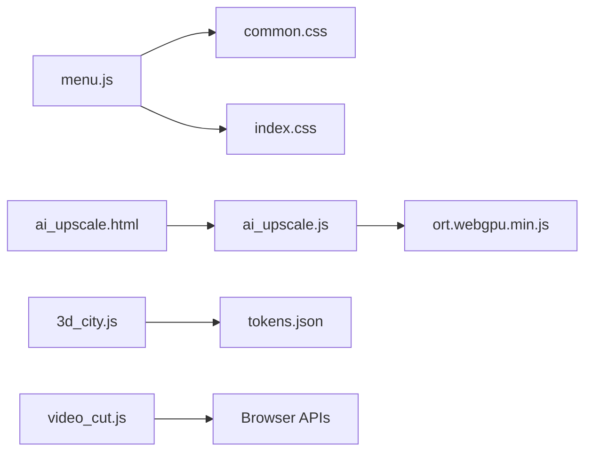

# Getting Started

<cite>
**Referenced Files in This Document**
- [index.html](file://index.html)
- [common.css](file://css/common.css)
- [index.css](file://css/index.css)
- [menu.js](file://js/menu.js)
- [ai_upscale.html](file://tools_html/ai_upscale.html)
- [ai_upscale.js](file://js/ai_upscale.js)
- [3d_city.js](file://js/3d_city.js)
- [tokens.json](file://tokens.json)
- [video_cut.js](file://js/video_cut.js)
- [AI图片超分辨率技术实现文档.md](file://doc/AI图片超分辨率技术实现文档.md)
- [AI视频补帧功能说明.md](file://doc/AI视频补帧功能说明.md)
- [视频剪辑工具使用说明.md](file://doc/视频剪辑工具使用说明.md)
</cite>

## Table of Contents
1. [Introduction](#introduction)
2. [Project Structure](#project-structure)
3. [Core Components](#core-components)
4. [Architecture Overview](#architecture-overview)
5. [Detailed Component Analysis](#detailed-component-analysis)
6. [Dependency Analysis](#dependency-analysis)
7. [Performance Considerations](#performance-considerations)
8. [Troubleshooting Guide](#troubleshooting-guide)
9. [Conclusion](#conclusion)
10. [Appendices](#appendices)

## Introduction
Welcome to TAWEBTOOL, a collection of creative and productivity tools that run entirely in your browser. This Getting Started guide helps first-time users install, navigate, and use the platform effectively. It covers browser requirements, initial setup, the main interface, tool discovery via the search function, and common workflows for different user types. Practical examples include enhancing images with AI upscaling, generating a 3D city scene, and processing video content. You will also learn how new tools integrate with the menu, troubleshoot common issues, optimize performance, and understand security and privacy considerations for browser-based processing.

## Project Structure
TAWEBTOOL is organized around a central index page and a modular tool system:
- The index page sets up the global layout, menu, and search bar.
- Tools are implemented as separate HTML pages under tools_html/, each with its own JavaScript and CSS.
- Shared UI and menu logic live in js/menu.js, while individual tools load their own scripts.
- Assets and styles are under css/ and third_party libraries under third_part/.

**Diagram sources**
- [index.html:1-25](file://index.html#L1-L25)
- [common.css:1-200](file://css/common.css#L1-L200)
- [index.css:1-57](file://css/index.css#L1-L57)
- [menu.js:1-273](file://js/menu.js#L1-L273)
- [ai_upscale.html:1-167](file://tools_html/ai_upscale.html#L1-L167)
- [ai_upscale.js:1-200](file://js/ai_upscale.js#L1-L200)
- [3d_city.js:1-200](file://js/3d_city.js#L1-L200)
- [tokens.json:1-5](file://tokens.json#L1-L5)
- [video_cut.js:1-200](file://js/video_cut.js#L1-L200)

**Section sources**
- [index.html:1-25](file://index.html#L1-L25)
- [common.css:1-200](file://css/common.css#L1-L200)
- [index.css:1-57](file://css/index.css#L1-L57)
- [menu.js:1-273](file://js/menu.js#L1-L273)

## Core Components
- Global menu and search: The left sidebar organizes tools by category, and the top search bar lets you quickly find tools by name, category, or keywords.
- Tool panels: Each tool’s HTML page defines its UI and loads its script to implement functionality.
- Shared styles: common.css and index.css define the layout, menu, and global look-and-feel.

Key capabilities:
- Left menu accordion toggles categories open/closed.
- Top search filters both the menu and results dynamically.
- Tools load their own scripts and initialize their UI.

**Section sources**
- [menu.js:46-104](file://js/menu.js#L46-L104)
- [menu.js:107-272](file://js/menu.js#L107-L272)
- [common.css:34-200](file://css/common.css#L34-L200)
- [index.css:13-57](file://css/index.css#L13-L57)

## Architecture Overview
The application follows a modular single-page-like architecture:
- index.html initializes the global layout and injects the menu and search.
- menu.js builds the left menu from a centralized data structure, handles clicks, and powers the global search.
- Tool pages (e.g., ai_upscale.html) embed their own scripts (e.g., ai_upscale.js) to manage UI and processing.
- Some tools rely on third-party libraries (e.g., ONNX Runtime for AI upscaling).

**Diagram sources**
- [index.html:12-22](file://index.html#L12-L22)
- [menu.js:268-272](file://js/menu.js#L268-L272)
- [ai_upscale.html:158-161](file://tools_html/ai_upscale.html#L158-L161)
- [ai_upscale.js:55-101](file://js/ai_upscale.js#L55-L101)

## Detailed Component Analysis

### Main Interface Layout and Navigation
- Left menu: Categories with icons and collapsible submenus. Clicking a category toggles its submenu; clicking outside closes others.
- Top search: Input field with placeholder and keyboard handling. Press Enter to open the first matching result; Escape clears the input.
- Welcome text: Centered glass-text effect on the landing page.

**Diagram sources**
- [menu.js:70-104](file://js/menu.js#L70-L104)
- [menu.js:223-266](file://js/menu.js#L223-L266)
- [index.html:12-22](file://index.html#L12-L22)
- [index.css:14-57](file://css/index.css#L14-L57)

**Section sources**
- [menu.js:70-104](file://js/menu.js#L70-L104)
- [menu.js:223-266](file://js/menu.js#L223-L266)
- [common.css:34-200](file://css/common.css#L34-L200)
- [index.css:14-57](file://css/index.css#L14-L57)

### Tool Discovery Through Search
- Search normalization trims whitespace and converts to lowercase.
- Search items are built from the centralized menu data, combining label, category, href, and keywords.
- Results are limited to a small number and highlighted; pressing Enter opens the first result.
- The search also updates the left menu to reveal matching categories and items.

**Diagram sources**
- [menu.js:108-151](file://js/menu.js#L108-L151)
- [menu.js:117-135](file://js/menu.js#L117-L135)
- [menu.js:238-266](file://js/menu.js#L238-L266)

**Section sources**
- [menu.js:108-151](file://js/menu.js#L108-L151)
- [menu.js:117-135](file://js/menu.js#L117-L135)
- [menu.js:238-266](file://js/menu.js#L238-L266)

### Practical Workflows

#### Enhance an Image with AI Upscaling
- Open the AI HD Upscaling tool page.
- Choose a model and execution mode (GPU/WebGPU preferred; falls back to CPU if needed).
- Select images to process; configure output mode (download, ZIP, or folder).
- Start processing and review results; compare original vs upscaled in the slider modal.

**Diagram sources**
- [ai_upscale.html:18-118](file://tools_html/ai_upscale.html#L18-L118)
- [ai_upscale.js:55-101](file://js/ai_upscale.js#L55-L101)
- [ai_upscale.js:422-446](file://js/ai_upscale.js#L422-L446)

**Section sources**
- [ai_upscale.html:18-118](file://tools_html/ai_upscale.html#L18-L118)
- [ai_upscale.js:55-101](file://js/ai_upscale.js#L55-L101)
- [ai_upscale.js:422-446](file://js/ai_upscale.js#L422-L446)

#### Generate a 3D City Scene
- Open the 3D City tool page.
- Use the search box to locate the tool if needed.
- Enter a location or click the map to set coordinates.
- Download terrain, buildings, and land cover data; preview in the 3D viewer.

**Diagram sources**
- [3d_city.js:32-85](file://js/3d_city.js#L32-L85)
- [3d_city.js:114-187](file://js/3d_city.js#L114-L187)

**Section sources**
- [3d_city.js:32-85](file://js/3d_city.js#L32-L85)
- [3d_city.js:114-187](file://js/3d_city.js#L114-L187)
- [tokens.json:1-5](file://tokens.json#L1-L5)

#### Process Video Content
- Open the Video Cutting tool page.
- Import a video/audio file; choose a processing mode (trim, convert, snapshot, extract audio, mute, speed).
- Configure options (e.g., bitrate, snapshot format, speed rate).
- Start processing; monitor progress and download results.

**Diagram sources**
- [video_cut.js:5-75](file://js/video_cut.js#L5-L75)
- [video_cut.js:131-198](file://js/video_cut.js#L131-L198)

**Section sources**
- [video_cut.js:5-75](file://js/video_cut.js#L5-L75)
- [video_cut.js:131-198](file://js/video_cut.js#L131-L198)

### Tool Registration and Menu Integration
- Centralized menu data: Add a new tool by extending the MENU_DATA array with a category, label, href, and optional keywords.
- The menu builder generates the left sidebar and populates the top search index automatically.
- New tools appear immediately in both the menu and search results.

**Diagram sources**
- [menu.js:2-43](file://js/menu.js#L2-L43)
- [menu.js:46-68](file://js/menu.js#L46-L68)
- [menu.js:117-135](file://js/menu.js#L117-L135)

**Section sources**
- [menu.js:2-43](file://js/menu.js#L2-L43)
- [menu.js:46-68](file://js/menu.js#L46-L68)
- [menu.js:117-135](file://js/menu.js#L117-L135)

## Dependency Analysis
- Global dependencies: menu.js depends on common.css for layout and index.css for welcome text.
- AI Upscaling: Requires ONNX Runtime (ort.webgpu.min.js) and optionally IndexedDB caching.
- 3D City: Uses Leaflet for 2D map and Cesium for 3D preview; reads tokens from tokens.json.
- Video Cutting: Uses native browser APIs (MediaRecorder, Canvas, Web Audio) without external libraries.

**Diagram sources**
- [menu.js:1-273](file://js/menu.js#L1-L273)
- [common.css:1-200](file://css/common.css#L1-L200)
- [index.css:1-57](file://css/index.css#L1-L57)
- [ai_upscale.html:158-161](file://tools_html/ai_upscale.html#L158-L161)
- [ai_upscale.js:84-101](file://js/ai_upscale.js#L84-L101)
- [3d_city.js:21-27](file://js/3d_city.js#L21-L27)
- [tokens.json:1-5](file://tokens.json#L1-L5)
- [video_cut.js:1-200](file://js/video_cut.js#L1-L200)

**Section sources**
- [menu.js:1-273](file://js/menu.js#L1-L273)
- [ai_upscale.js:84-101](file://js/ai_upscale.js#L84-L101)
- [3d_city.js:21-27](file://js/3d_city.js#L21-L27)
- [tokens.json:1-5](file://tokens.json#L1-L5)
- [video_cut.js:1-200](file://js/video_cut.js#L1-L200)

## Performance Considerations
- AI Upscaling:
  - Prefer GPU/WebGPU acceleration when available; the tool detects support and falls back to CPU if needed.
  - Disable graph optimizations for WebGPU compatibility to avoid inference issues.
  - Use smaller batches and appropriate model choices for memory-constrained environments.
- 3D City:
  - Terrain and imagery downloads can be large; choose regions carefully and limit layers.
- Video Cutting:
  - Keep time ranges short and reduce bitrate for faster processing.
  - Use modern browsers for best performance.

[No sources needed since this section provides general guidance]

## Troubleshooting Guide
- Model loading failures (AI Upscaling):
  - If GPU acceleration fails, switch to CPU mode; the tool will attempt a fallback.
  - Verify the model cache and re-download if corrupted.
  - Check browser support for WebGPU; upgrade to recommended versions.
- Performance issues:
  - Close other tabs to free memory.
  - Reduce resolution or shorten video segments.
  - Use a modern browser (Chrome/Edge recommended).
- Browser compatibility:
  - WebGPU requires Chrome/Edge 113+; Firefox Nightly is supported for WebGPU testing.
  - Video cutting relies on MediaRecorder and Canvas APIs; ensure your browser supports them.
- Security and privacy:
  - All processing happens locally in your browser; no uploads occur by default.
  - Token files are loaded locally; ensure they are not exposed publicly.

**Section sources**
- [AI图片超分辨率技术实现文档.md:378-451](file://doc/AI图片超分辨率技术实现文档.md#L378-L451)
- [AI图片超分辨率技术实现文档.md:397-418](file://doc/AI图片超分辨率技术实现文档.md#L397-L418)
- [AI视频补帧功能说明.md:178-184](file://doc/AI视频补帧功能说明.md#L178-L184)
- [视频剪辑工具使用说明.md:170-189](file://doc/视频剪辑工具使用说明.md#L170-L189)

## Conclusion
You are now ready to explore TAWEBTOOL. Use the top search to discover tools quickly, navigate via the left menu, and leverage the practical workflows described here. For advanced needs, integrate new tools by adding entries to the menu data, and consult the troubleshooting and performance sections for smooth operation.

[No sources needed since this section summarizes without analyzing specific files]

## Appendices

### Quick Reference: Keyboard Shortcuts
- Top search:
  - Press Enter to open the first search result.
  - Press Escape to clear the search and hide suggestions.

**Section sources**
- [menu.js:249-258](file://js/menu.js#L249-L258)

### Quick Reference: File Format Support
- AI Upscaling:
  - Input formats: JPG, PNG, JPEG, WEBP.
  - Output formats: PNG (via canvas data URL).
- Video Cutting:
  - Inputs: Video/Audio files.
  - Outputs: WebM (browser-native), with optional conversion to MP4 externally.

**Section sources**
- [ai_upscale.html:43-43](file://tools_html/ai_upscale.html#L43-L43)
- [视频剪辑工具使用说明.md:148-166](file://doc/视频剪辑工具使用说明.md#L148-L166)

### Quick Reference: Basic Configuration Options
- AI Upscaling:
  - Execution mode: GPU/WebGPU or CPU.
  - Output mode: Download per file, ZIP, or folder (requires Chrome/Edge).
  - Naming mode: suffix or automatic scale suffix.
- 3D City:
  - Location search or map click to set coordinates.
  - Download DEM, buildings, and land cover layers.
- Video Cutting:
  - Modes: Trim, Convert, Snapshot, Extract Audio, Mute, Speed.
  - Options: Bitrates, snapshot format/quality, speed multiplier.

**Section sources**
- [ai_upscale.html:68-102](file://tools_html/ai_upscale.html#L68-L102)
- [3d_city.js:39-65](file://js/3d_city.js#L39-L65)
- [video_cut.js:68-107](file://js/video_cut.js#L68-L107)

### Browser Requirements
- AI Upscaling:
  - Chrome/Edge 113+ for WebGPU.
  - Firefox Nightly for WebGPU testing.
- Video Cutting:
  - Modern browsers with MediaRecorder and Canvas support.

**Section sources**
- [AI图片超分辨率技术实现文档.md:446-451](file://doc/AI图片超分辨率技术实现文档.md#L446-L451)
- [视频剪辑工具使用说明.md:170-180](file://doc/视频剪辑工具使用说明.md#L170-L180)

### Security and Privacy Notes
- All processing runs client-side; no server upload occurs by default.
- Tokens are loaded locally; keep tokens.json secure and private.

**Section sources**
- [tokens.json:1-5](file://tokens.json#L1-L5)