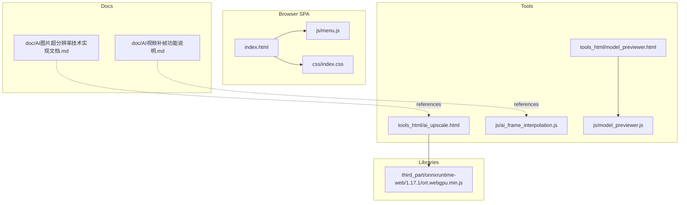
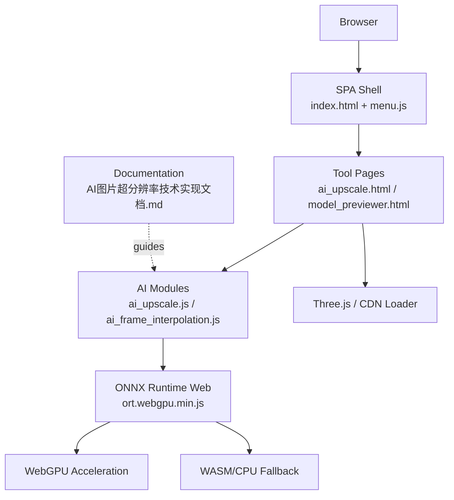
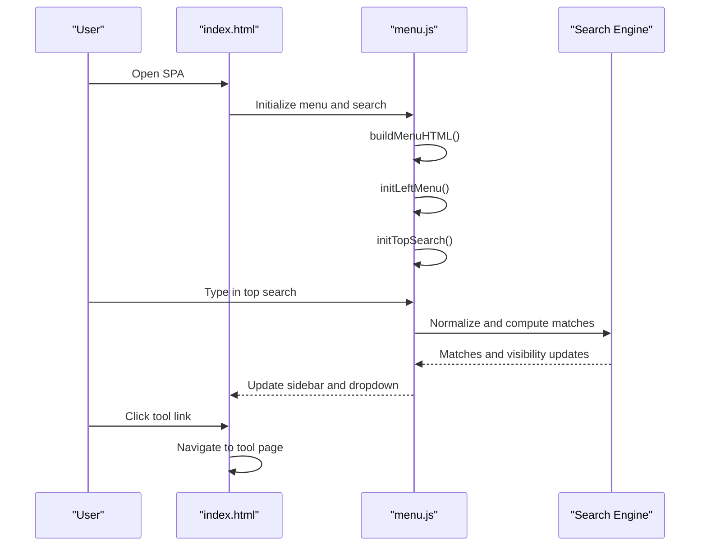
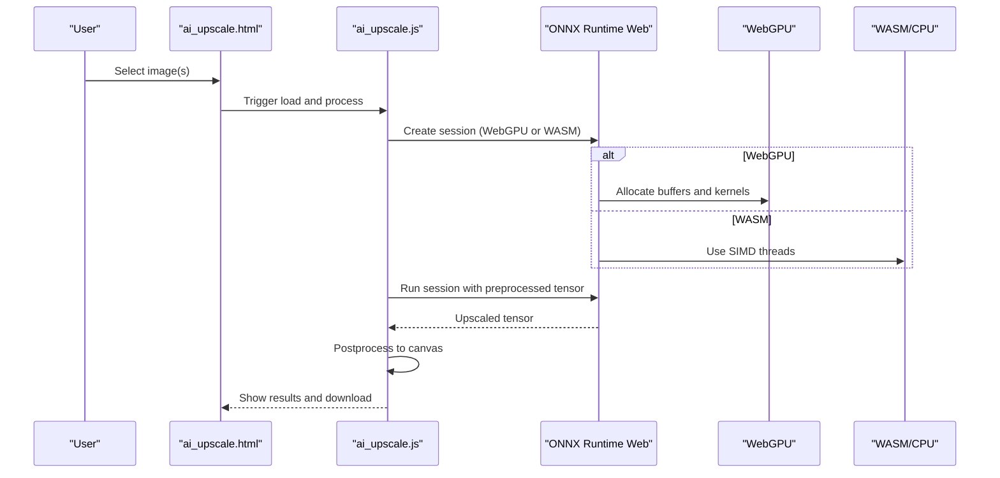
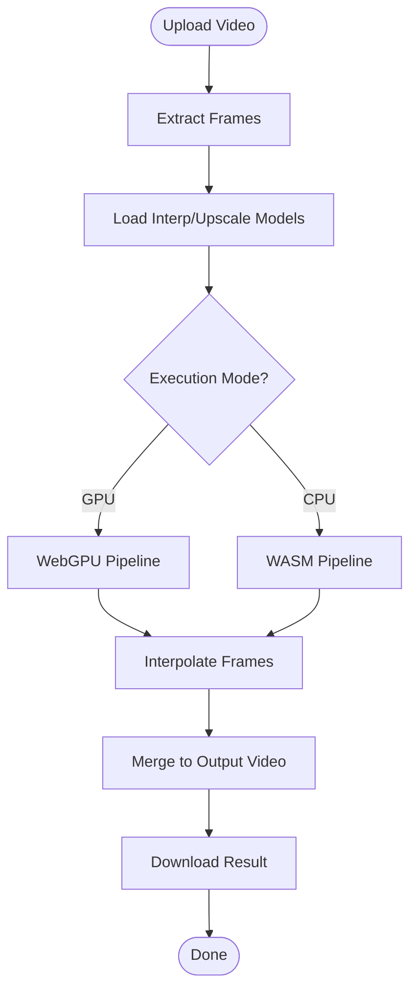
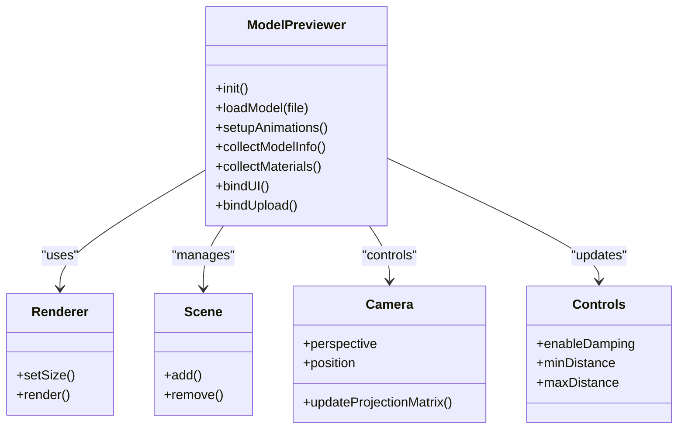
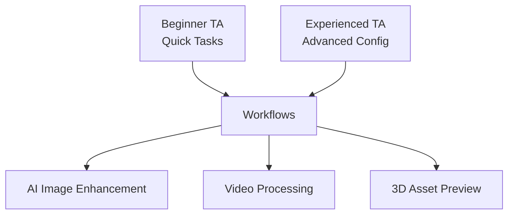
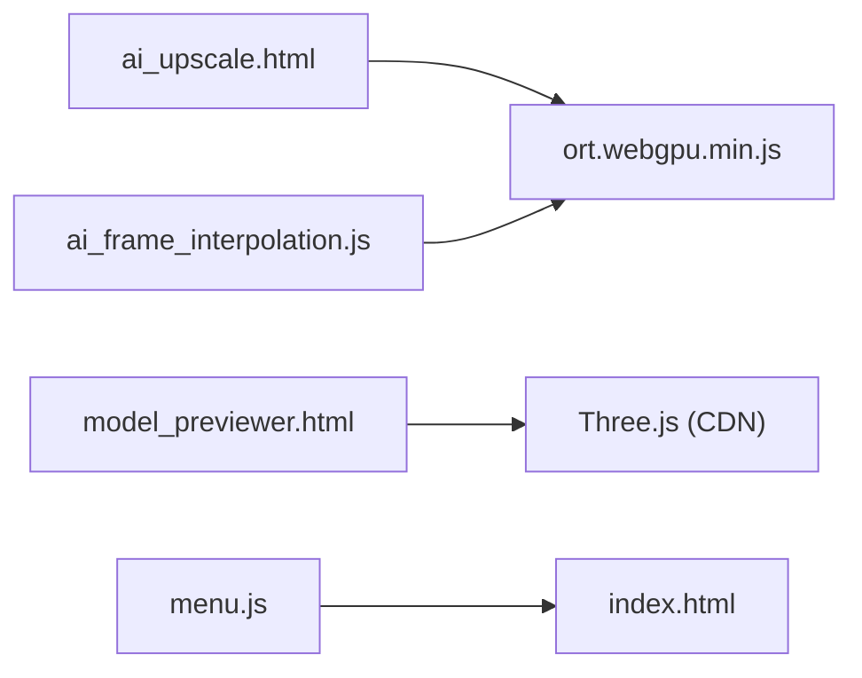

# Project Overview

<cite>
**Referenced Files in This Document**
- [index.html](file://index.html)
- [menu.js](file://js/menu.js)
- [index.css](file://css/index.css)
- [ai_upscale.html](file://tools_html/ai_upscale.html)
- [ai_upscale.js](file://js/ai_upscale.js)
- [ai_frame_interpolation.js](file://js/ai_frame_interpolation.js)
- [model_previewer.html](file://tools_html/model_previewer.html)
- [model_previewer.js](file://js/model_previewer.js)
- [ort.webgpu.min.js](file://third_part/onnxruntime-web/1.17.1/ort.webgpu.min.js)
- [AI图片超分辨率技术实现文档.md](file://doc/AI图片超分辨率技术实现文档.md)
- [AI视频补帧功能说明.md](file://doc/AI视频补帧功能说明.md)
- [fetch_models.sh](file://scripts/fetch_models.sh)
- [tokens.json](file://tokens.json)
</cite>

## Table of Contents
1. [Introduction](#introduction)
2. [Project Structure](#project-structure)
3. [Core Components](#core-components)
4. [Architecture Overview](#architecture-overview)
5. [Detailed Component Analysis](#detailed-component-analysis)
6. [Dependency Analysis](#dependency-analysis)
7. [Performance Considerations](#performance-considerations)
8. [Troubleshooting Guide](#troubleshooting-guide)
9. [Conclusion](#conclusion)
10. [Appendices](#appendices)

## Introduction
TAWEBTOOL is a browser-based toolkit designed for game artists and technical artists (TA). It provides a centralized single-page application (SPA) experience that runs entirely in the browser, enabling AI-powered workflows, 3D asset previewing, and media processing without requiring server-side infrastructure. The platform integrates modern web technologies including ONNX Runtime Web with WebGPU acceleration, Three.js for 3D rendering, and a modular toolset organized under a unified navigation and search system.

The toolkit supports:
- AI image enhancement via Real-ESRGAN (WebGPU/CPU)
- Video frame interpolation and processing (RIFE and related pipelines)
- 3D model previewing and inspection (GLB/GLTF/FBX/OBJ)
- General-purpose image/video/media utilities (compression, metadata inspection, etc.)

It targets both beginners entering game development and experienced practitioners who need efficient, offline-capable tools for iteration and prototyping.

## Project Structure
The project follows a static web architecture with:
- A central SPA entry (index.html) that loads the global menu and search
- Tool-specific pages under tools_html/ (e.g., ai_upscale.html, model_previewer.html)
- Per-tool JavaScript modules (e.g., ai_upscale.js, model_previewer.js)
- Shared UI and stylesheets under css/
- Third-party libraries under third_part/
- Documentation under doc/

**Diagram sources**
- [index.html:1-25](file://index.html#L1-L25)
- [menu.js:1-273](file://js/menu.js#L1-L273)
- [index.css:1-57](file://css/index.css#L1-L57)
- [ai_upscale.html:1-167](file://tools_html/ai_upscale.html#L1-L167)
- [ai_frame_interpolation.js:1-200](file://js/ai_frame_interpolation.js#L1-L200)
- [model_previewer.html:1-200](file://tools_html/model_previewer.html#L1-L200)
- [model_previewer.js:1-200](file://js/model_previewer.js#L1-L200)
- [ort.webgpu.min.js:1-12](file://third_part/onnxruntime-web/1.17.1/ort.webgpu.min.js#L1-L12)
- [AI图片超分辨率技术实现文档.md:1-538](file://doc/AI图片超分辨率技术实现文档.md#L1-L538)
- [AI视频补帧功能说明.md:1-197](file://doc/AI视频补帧功能说明.md#L1-L197)

**Section sources**
- [index.html:1-25](file://index.html#L1-L25)
- [menu.js:1-273](file://js/menu.js#L1-L273)
- [index.css:1-57](file://css/index.css#L1-L57)
- [ai_upscale.html:1-167](file://tools_html/ai_upscale.html#L1-L167)
- [ai_frame_interpolation.js:1-200](file://js/ai_frame_interpolation.js#L1-L200)
- [model_previewer.html:1-200](file://tools_html/model_previewer.html#L1-L200)
- [model_previewer.js:1-200](file://js/model_previewer.js#L1-L200)
- [ort.webgpu.min.js:1-12](file://third_part/onnxruntime-web/1.17.1/ort.webgpu.min.js#L1-L12)
- [AI图片超分辨率技术实现文档.md:1-538](file://doc/AI图片超分辨率技术实现文档.md#L1-L538)
- [AI视频补帧功能说明.md:1-197](file://doc/AI视频补帧功能说明.md#L1-L197)

## Core Components
- Central SPA shell: index.html with a left sidebar menu and top search bar, plus a welcome banner.
- Navigation and search: js/menu.js defines the menu tree, builds the sidebar, and powers the global search across tools.
- AI image enhancement: tools_html/ai_upscale.html + js/ai_upscale.js integrate ONNX Runtime Web with Real-ESRGAN for browser-based upscaling.
- Video frame interpolation: js/ai_frame_interpolation.js implements a framework for video processing, including RIFE-like interpolation and model caching.
- 3D model previewer: tools_html/model_previewer.html + js/model_previewer.js use Three.js to preview and inspect 3D assets.
- WebGPU runtime: third_part/onnxruntime-web/1.17.1/ort.webgpu.min.js provides the ONNX Runtime Web backend with WebGPU acceleration.
- Documentation: doc/AI图片超分辨率技术实现文档.md and doc/AI视频补帧功能说明.md explain AI workflows and technical decisions.

**Section sources**
- [index.html:12-21](file://index.html#L12-L21)
- [menu.js:2-43](file://js/menu.js#L2-L43)
- [ai_upscale.html:18-118](file://tools_html/ai_upscale.html#L18-L118)
- [ai_upscale.js:1-200](file://js/ai_upscale.js#L1-L200)
- [ai_frame_interpolation.js:1-200](file://js/ai_frame_interpolation.js#L1-L200)
- [model_previewer.html:19-198](file://tools_html/model_previewer.html#L19-L198)
- [model_previewer.js:1-200](file://js/model_previewer.js#L1-L200)
- [ort.webgpu.min.js:1-12](file://third_part/onnxruntime-web/1.17.1/ort.webgpu.min.js#L1-L12)
- [AI图片超分辨率技术实现文档.md:1-538](file://doc/AI图片超分辨率技术实现文档.md#L1-L538)
- [AI视频补帧功能说明.md:1-197](file://doc/AI视频补帧功能说明.md#L1-L197)

## Architecture Overview
TAWEBTOOL is a client-centric architecture:
- SPA entry initializes the menu and search, then routes to tool pages.
- Tools are self-contained HTML pages with dedicated JS modules.
- AI inference uses ONNX Runtime Web with WebGPU acceleration when available; falls back to WASM/CPU otherwise.
- 3D previewing relies on Three.js loaded dynamically with CDN fallbacks.
- Models and assets are fetched from remote sources or local storage (IndexedDB/Cache API) for offline capability.

**Diagram sources**
- [index.html:1-25](file://index.html#L1-L25)
- [menu.js:1-273](file://js/menu.js#L1-L273)
- [ai_upscale.html:158-161](file://tools_html/ai_upscale.html#L158-L161)
- [ai_upscale.js:1-200](file://js/ai_upscale.js#L1-L200)
- [ai_frame_interpolation.js:1-200](file://js/ai_frame_interpolation.js#L1-L200)
- [model_previewer.html:13-14](file://tools_html/model_previewer.html#L13-L14)
- [model_previewer.js:1-200](file://js/model_previewer.js#L1-L200)
- [ort.webgpu.min.js:1-12](file://third_part/onnxruntime-web/1.17.1/ort.webgpu.min.js#L1-L12)
- [AI图片超分辨率技术实现文档.md:1-538](file://doc/AI图片超分辨率技术实现文档.md#L1-L538)

## Detailed Component Analysis

### Navigation and Search System
- Menu data: A single-source-of-truth menu definition organizes tools by categories (AI tools, image processing, 3D tools, video processing, game tools, TA tools, music, about).
- Sidebar building: Generates nested lists with accordion behavior and category toggles.
- Top search: Provides live filtering across categories and tool labels, with keyboard shortcuts and dropdown results.
- Path resolution: Handles both root and subdirectory contexts for tool URLs.

**Diagram sources**
- [index.html:12-21](file://index.html#L12-L21)
- [menu.js:46-273](file://js/menu.js#L46-L273)

**Section sources**
- [menu.js:2-43](file://js/menu.js#L2-L43)
- [menu.js:107-273](file://js/menu.js#L107-L273)
- [index.html:12-21](file://index.html#L12-L21)

### AI Image Enhancement (Real-ESRGAN)
- Tool page: tools_html/ai_upscale.html provides upload area, queue, settings, and progress UI.
- Implementation: js/ai_upscale.js manages model loading, preprocessing, inference, and postprocessing.
- Execution providers: WebGPU preferred; WASM fallback with single-threaded SIMD and explicit wasmPaths.
- Model caching: IndexedDB and Cache API for offline availability.
- Workflow highlights:
  - Detect WebGPU support and configure session options (graphOptimizationLevel disabled for WebGPU correctness).
  - Preprocess images to CHW tensors with normalization and padding to multiples of 128.
  - Run inference and postprocess to RGBA canvases.
  - Compare original vs. upscaled with a slider.

**Diagram sources**
- [ai_upscale.html:18-118](file://tools_html/ai_upscale.html#L18-L118)
- [ai_upscale.js:55-135](file://js/ai_upscale.js#L55-L135)
- [AI图片超分辨率技术实现文档.md:86-109](file://doc/AI图片超分辨率技术实现文档.md#L86-L109)
- [AI图片超分辨率技术实现文档.md:165-221](file://doc/AI图片超分辨率技术实现文档.md#L165-L221)

**Section sources**
- [ai_upscale.html:18-118](file://tools_html/ai_upscale.html#L18-L118)
- [ai_upscale.js:1-200](file://js/ai_upscale.js#L1-L200)
- [AI图片超分辨率技术实现文档.md:1-538](file://doc/AI图片超分辨率技术实现文档.md#L1-L538)

### Video Frame Interpolation (RIFE and Related)
- Framework: js/ai_frame_interpolation.js implements a pipeline for video processing, including frame extraction, interpolation, and merging.
- Model management: Supports verified model URLs (including mirrors), caching, and switching between interpolation and upscaling models.
- Execution modes: GPU/WebGPU with fallback to CPU/WASM.
- UI: Drag-and-drop upload, queue management, parameter panels, and progress indicators.

**Diagram sources**
- [ai_frame_interpolation.js:50-98](file://js/ai_frame_interpolation.js#L50-L98)
- [AI视频补帧功能说明.md:96-115](file://doc/AI视频补帧功能说明.md#L96-L115)

**Section sources**
- [ai_frame_interpolation.js:1-200](file://js/ai_frame_interpolation.js#L1-L200)
- [AI视频补帧功能说明.md:1-197](file://doc/AI视频补帧功能说明.md#L1-L197)

### 3D Model Previewer (Three.js)
- Page: tools_html/model_previewer.html provides a three-column layout with controls, viewport, and materials panel.
- JS: js/model_previewer.js loads Three.js and optional loaders from multiple CDNs, sets up renderer, lighting, and controls, and handles model loading and animation playback.
- Features: wireframe toggle, skeleton display, environment presets, HDR background, animation timeline, material inspection, and screenshot export.

**Diagram sources**
- [model_previewer.html:19-198](file://tools_html/model_previewer.html#L19-L198)
- [model_previewer.js:56-170](file://js/model_previewer.js#L56-L170)

**Section sources**
- [model_previewer.html:19-198](file://tools_html/model_previewer.html#L19-L198)
- [model_previewer.js:1-200](file://js/model_previewer.js#L1-L200)

### Conceptual Overview
- Beginner-friendly: Clean UI, guided workflows, and immediate feedback for tasks like image upscaling and 3D previewing.
- Developer-focused: Extensive configuration for execution providers, model caching, and performance tuning; documented pitfalls and solutions for WebGPU compatibility.

[No sources needed since this diagram shows conceptual workflow, not actual code structure]

## Dependency Analysis
- ONNX Runtime Web: Provides inference sessions with configurable execution providers (WebGPU, WASM, CPU).
- Three.js: Dynamically imported from multiple CDNs with fallbacks; includes loaders for GLTF, FBX, OBJ, and DRACO compression.
- Local storage: IndexedDB and Cache API used for model caching to reduce network usage and enable offline operation.
- Tool pages depend on shared menu/search and per-tool scripts; ORT is included on demand in specific tool pages.

**Diagram sources**
- [ai_upscale.html:158-161](file://tools_html/ai_upscale.html#L158-L161)
- [ai_frame_interpolation.js:1-200](file://js/ai_frame_interpolation.js#L1-L200)
- [model_previewer.html:13-14](file://tools_html/model_previewer.html#L13-L14)
- [menu.js:1-273](file://js/menu.js#L1-L273)
- [index.html:12-21](file://index.html#L12-L21)

**Section sources**
- [ai_upscale.html:158-161](file://tools_html/ai_upscale.html#L158-L161)
- [ai_frame_interpolation.js:1-200](file://js/ai_frame_interpolation.js#L1-L200)
- [model_previewer.html:13-14](file://tools_html/model_previewer.html#L13-L14)
- [menu.js:1-273](file://js/menu.js#L1-L273)
- [index.html:12-21](file://index.html#L12-L21)

## Performance Considerations
- WebGPU vs CPU: WebGPU delivers significant speedup for AI inference; CPU mode ensures broad compatibility.
- Graph optimization: For WebGPU, disable graph optimization to avoid incorrect outputs caused by unsupported fused operators.
- Memory footprint: Large images/videos require careful chunking and progressive processing to keep UI responsive.
- Model caching: Use IndexedDB and Cache API to minimize repeated downloads and improve startup times.
- UI responsiveness: Yield control between chunks using idle callbacks or short timeouts to maintain interactivity.

[No sources needed since this section provides general guidance]

## Troubleshooting Guide
- WebGPU inference produces zeros:
  - Cause: Certain graph optimizations are incompatible with WebGPU backend.
  - Fix: Set graphOptimizationLevel to disabled for WebGPU sessions.
- Tensor data appears empty:
  - Cause: Direct access to GPU tensors returns empty data until downloaded.
  - Fix: Use getData() for GPU tensors; access data directly for CPU tensors.
- Browser compatibility:
  - WebGPU requires modern browsers (Chrome/Edge 113+, Firefox Nightly, Safari Technology Preview).
  - Provide CPU mode as fallback when WebGPU is unavailable.
- Long videos or large images:
  - Use chunked processing and progressive UI updates to avoid freezing the browser.

**Section sources**
- [AI图片超分辨率技术实现文档.md:225-271](file://doc/AI图片超分辨率技术实现文档.md#L225-L271)
- [AI图片超分辨率技术实现文档.md:272-294](file://doc/AI图片超分辨率技术实现文档.md#L272-L294)
- [AI视频补帧功能说明.md:178-184](file://doc/AI视频补帧功能说明.md#L178-L184)

## Conclusion
TAWEBTOOL delivers a comprehensive, browser-native toolkit for game artists and technical artists. Its centralized SPA design, robust AI workflows with WebGPU acceleration, and powerful 3D previewing capabilities make it suitable for rapid iteration and offline-first production. By combining modern web APIs with pragmatic fallbacks and extensive documentation, it lowers the barrier to entry while offering advanced control for experienced users.

[No sources needed since this section summarizes without analyzing specific files]

## Appendices

### Deployment Scenarios and Configuration
- Static hosting: Serve the entire repository from any static host (GitHub Pages, Netlify, Vercel).
- Local model assets: Use scripts/fetch_models.sh to download recommended ONNX models into ./models for offline use.
- Tokens: tokens.json holds service tokens for optional integrations (e.g., Cesium Ion, OpenTopography).

**Section sources**
- [fetch_models.sh:1-18](file://scripts/fetch_models.sh#L1-L18)
- [tokens.json:1-5](file://tokens.json#L1-L5)

### Practical Workflows
- AI image enhancement:
  - Upload images, select Real-ESRGAN model, choose WebGPU or CPU, and process in batches.
- 3D asset previewing:
  - Drag-and-drop GLB/GLTF/FBX/OBJ, adjust lighting and environment, inspect materials, and export screenshots.
- Video processing:
  - Upload video, configure interpolation/upscaling parameters, and download the processed output.

**Section sources**
- [ai_upscale.html:18-118](file://tools_html/ai_upscale.html#L18-L118)
- [model_previewer.html:19-198](file://tools_html/model_previewer.html#L19-L198)
- [AI视频补帧功能说明.md:116-141](file://doc/AI视频补帧功能说明.md#L116-L141)