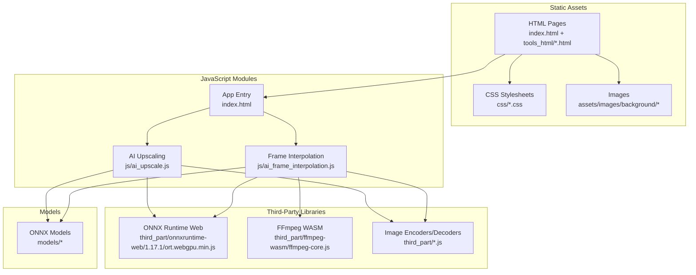
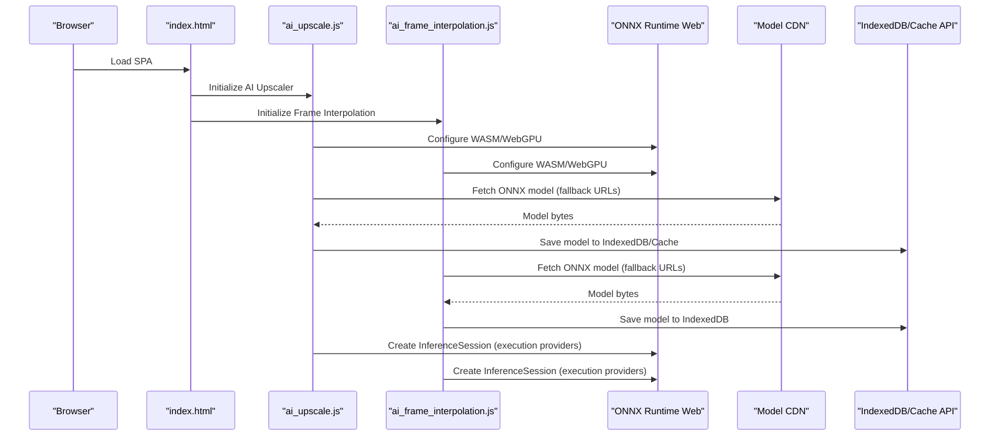
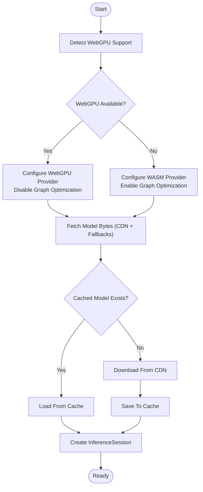
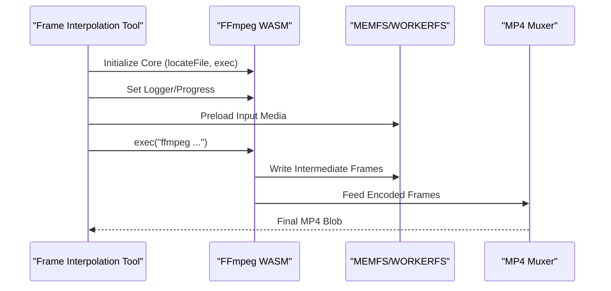
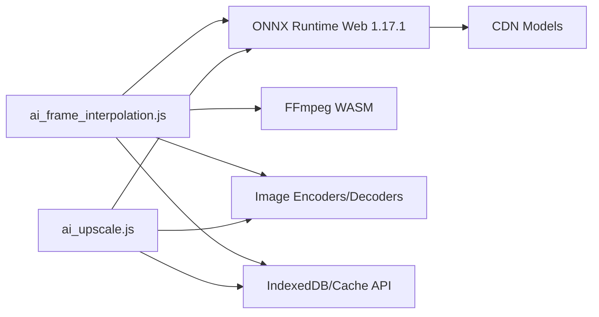

# Technology Stack

<cite>
**Referenced Files in This Document**
- [index.html](file://index.html)
- [ai_upscale.js](file://js/ai_upscale.js)
- [ai_frame_interpolation.js](file://js/ai_frame_interpolation.js)
- [ffmpeg-core.js](file://third_part/ffmpeg-wasm/ffmpeg-core.js)
- [ort.webgpu.min.js](file://third_part/onnxruntime-web/1.17.1/ort.webgpu.min.js)
- [bmp-encoder.js](file://third_part/bmp-encoder.js)
- [dds-encoder.js](file://third_part/dds-encoder.js)
- [mp4-muxer.umd.js](file://third_part/mp4-muxer.umd.js)
- [tga-decoder.js](file://third_part/tga-decoder.js)
- [tga-encoder.js](file://third_part/tga-encoder.js)
</cite>

## Table of Contents
1. [Introduction](#introduction)
2. [Project Structure](#project-structure)
3. [Core Components](#core-components)
4. [Architecture Overview](#architecture-overview)
5. [Detailed Component Analysis](#detailed-component-analysis)
6. [Dependency Analysis](#dependency-analysis)
7. [Performance Considerations](#performance-considerations)
8. [Troubleshooting Guide](#troubleshooting-guide)
9. [Conclusion](#conclusion)
10. [Appendices](#appendices)

## Introduction
This document describes the TAWEBTOOL technology stack used to deliver a modern Single Page Application (SPA) with AI-powered media processing capabilities. The stack combines HTML5, CSS3, and JavaScript ES6+ for the frontend, with a robust machine learning pipeline powered by ONNX Runtime Web (1.17.1), optional WebGPU acceleration, and WebAssembly fallbacks. Multimedia operations leverage FFmpeg WASM for video processing and a suite of image format encoders/decoders. Third-party libraries include Fuse.js for search, Live2D Widget for interactive elements, and Marked for markdown rendering. The document also covers browser compatibility, feature detection, polyfills, and deployment considerations such as static hosting, CORS, and CDN usage for model delivery.

## Project Structure
The application follows a modular SPA structure:
- Static assets: HTML pages per tool, CSS stylesheets, and images
- JavaScript modules: Tool-specific logic (AI upscaling, frame interpolation, etc.)
- Third-party libraries: ONNX Runtime Web, FFmpeg WASM, and image format helpers
- Models: ONNX models organized by task (e.g., esrgan, rife)

**Diagram sources**
- [index.html:1-25](file://index.html#L1-L25)
- [ai_upscale.js:1-120](file://js/ai_upscale.js#L1-L120)
- [ai_frame_interpolation.js:1-120](file://js/ai_frame_interpolation.js#L1-L120)
- [ffmpeg-core.js:1-22](file://third_part/ffmpeg-wasm/ffmpeg-core.js#L1-L22)
- [ort.webgpu.min.js:1-20](file://third_part/onnxruntime-web/1.17.1/ort.webgpu.min.js#L1-L20)
- [bmp-encoder.js](file://third_part/bmp-encoder.js)
- [dds-encoder.js](file://third_part/dds-encoder.js)
- [mp4-muxer.umd.js](file://third_part/mp4-muxer.umd.js)
- [tga-decoder.js](file://third_part/tga-decoder.js)
- [tga-encoder.js](file://third_part/tga-encoder.js)

**Section sources**
- [index.html:1-25](file://index.html#L1-L25)

## Core Components
- Frontend framework: HTML5, CSS3, and JavaScript ES6+ for SPA architecture
- Machine learning: ONNX Runtime Web 1.17.1 with WebGPU execution provider and WASM fallback
- Multimedia: FFmpeg WASM for video operations; image format encoders/decoders
- Search and interactivity: Fuse.js, Live2D Widget, Marked
- Model delivery: CDN-hosted ONNX models with fallbacks and caching

**Section sources**
- [ai_upscale.js:83-101](file://js/ai_upscale.js#L83-L101)
- [ai_frame_interpolation.js:315-336](file://js/ai_frame_interpolation.js#L315-L336)
- [ffmpeg-core.js:1-22](file://third_part/ffmpeg-wasm/ffmpeg-core.js#L1-L22)
- [ort.webgpu.min.js:1-20](file://third_part/onnxruntime-web/1.17.1/ort.webgpu.min.js#L1-L20)

## Architecture Overview
The application initializes the SPA via index.html, loads tool-specific JavaScript modules, and orchestrates AI and multimedia processing through ONNX Runtime Web and FFmpeg WASM. Models are fetched from CDNs with fallbacks and cached locally for performance. Feature detection determines whether to use WebGPU or WASM execution providers.

**Diagram sources**
- [index.html:12-22](file://index.html#L12-L22)
- [ai_upscale.js:83-101](file://js/ai_upscale.js#L83-L101)
- [ai_upscale.js:295-378](file://js/ai_upscale.js#L295-L378)
- [ai_upscale.js:420-497](file://js/ai_upscale.js#L420-L497)
- [ai_frame_interpolation.js:315-336](file://js/ai_frame_interpolation.js#L315-L336)
- [ai_frame_interpolation.js:479-495](file://js/ai_frame_interpolation.js#L479-L495)
- [ai_frame_interpolation.js:473-477](file://js/ai_frame_interpolation.js#L473-L477)

## Detailed Component Analysis

### ONNX Runtime Web Pipeline
- Execution providers: WebGPU (preferred), WASM (fallback)
- Configuration: SIMD enabled, single-threaded WASM for compatibility
- Model loading: Multi-source fallback, progress reporting, caching via IndexedDB and Cache API
- Session creation: Graph optimization disabled for WebGPU stability

**Diagram sources**
- [ai_upscale.js:420-497](file://js/ai_upscale.js#L420-L497)
- [ai_upscale.js:295-378](file://js/ai_upscale.js#L295-L378)
- [ai_upscale.js:190-293](file://js/ai_upscale.js#L190-L293)
- [ai_frame_interpolation.js:367-375](file://js/ai_frame_interpolation.js#L367-L375)
- [ai_frame_interpolation.js:452-495](file://js/ai_frame_interpolation.js#L452-L495)
- [ai_frame_interpolation.js:377-420](file://js/ai_frame_interpolation.js#L377-L420)

**Section sources**
- [ai_upscale.js:83-101](file://js/ai_upscale.js#L83-L101)
- [ai_upscale.js:420-497](file://js/ai_upscale.js#L420-L497)
- [ai_upscale.js:295-378](file://js/ai_upscale.js#L295-L378)
- [ai_upscale.js:190-293](file://js/ai_upscale.js#L190-L293)
- [ai_frame_interpolation.js:315-336](file://js/ai_frame_interpolation.js#L315-L336)
- [ai_frame_interpolation.js:367-375](file://js/ai_frame_interpolation.js#L367-L375)
- [ai_frame_interpolation.js:452-495](file://js/ai_frame_interpolation.js#L452-L495)
- [ai_frame_interpolation.js:377-420](file://js/ai_frame_interpolation.js#L377-L420)

### FFmpeg WASM Multimedia Processing
- Core initialization: Emscripten-based WASM module with streaming fetch and worker support
- Progress tracking: Reader-based streaming with progress callbacks
- File system: MEMFS/WORKERFS for in-browser file handling
- Output: MP4 muxing via mp4-muxer.umd.js

**Diagram sources**
- [ffmpeg-core.js:1-22](file://third_part/ffmpeg-wasm/ffmpeg-core.js#L1-L22)
- [ffmpeg-core.js:2000-2100](file://third_part/ffmpeg-wasm/ffmpeg-core.js#L2000-L2100)
- [mp4-muxer.umd.js](file://third_part/mp4-muxer.umd.js)

**Section sources**
- [ffmpeg-core.js:1-22](file://third_part/ffmpeg-wasm/ffmpeg-core.js#L1-L22)
- [ffmpeg-core.js:2000-2100](file://third_part/ffmpeg-wasm/ffmpeg-core.js#L2000-L2100)
- [ai_frame_interpolation.js:743-799](file://js/ai_frame_interpolation.js#L743-L799)

### Image Format Encoders/Decoders
- Supported formats: BMP, DDS, TGA (encode/decode)
- Integration: Used alongside ONNX processing for preprocessing/postprocessing

**Section sources**
- [bmp-encoder.js](file://third_part/bmp-encoder.js)
- [dds-encoder.js](file://third_part/dds-encoder.js)
- [tga-decoder.js](file://third_part/tga-decoder.js)
- [tga-encoder.js](file://third_part/tga-encoder.js)

### Search, Interactive Elements, and Markdown Rendering
- Search: Fuse.js for client-side indexing and fuzzy search
- Interactive elements: Live2D Widget for animated overlays
- Markdown: Marked for rendering markdown content

[No sources needed since this section provides general guidance]

## Dependency Analysis
- ONNX Runtime Web 1.17.1: Provides inference sessions with WebGPU/WASM execution providers
- FFmpeg WASM: Enables video encoding/decoding and frame manipulation
- Image format libraries: Extend support for BMP, DDS, TGA
- CDN delivery: Models hosted on multiple CDNs with fallback URLs
- Local caching: IndexedDB and Cache API for offline reuse

**Diagram sources**
- [ai_upscale.js:83-101](file://js/ai_upscale.js#L83-L101)
- [ai_upscale.js:295-378](file://js/ai_upscale.js#L295-L378)
- [ai_frame_interpolation.js:315-336](file://js/ai_frame_interpolation.js#L315-L336)
- [ai_frame_interpolation.js:452-495](file://js/ai_frame_interpolation.js#L452-L495)
- [ffmpeg-core.js:1-22](file://third_part/ffmpeg-wasm/ffmpeg-core.js#L1-L22)
- [bmp-encoder.js](file://third_part/bmp-encoder.js)
- [dds-encoder.js](file://third_part/dds-encoder.js)
- [tga-decoder.js](file://third_part/tga-decoder.js)
- [tga-encoder.js](file://third_part/tga-encoder.js)

**Section sources**
- [ai_upscale.js:83-101](file://js/ai_upscale.js#L83-L101)
- [ai_upscale.js:295-378](file://js/ai_upscale.js#L295-L378)
- [ai_frame_interpolation.js:315-336](file://js/ai_frame_interpolation.js#L315-L336)
- [ai_frame_interpolation.js:452-495](file://js/ai_frame_interpolation.js#L452-L495)
- [ffmpeg-core.js:1-22](file://third_part/ffmpeg-wasm/ffmpeg-core.js#L1-L22)

## Performance Considerations
- WebGPU vs WASM: Prefer WebGPU for GPU acceleration; fall back to WASM with SIMD and single-threaded configuration for compatibility
- Model caching: Use IndexedDB and Cache API to avoid repeated downloads
- Streaming fetch: Progressively download models and media to improve perceived performance
- Canvas optimization: Reuse canvases and contexts to minimize allocations during image/video processing
- Encoder choice: MP4 muxing via mp4-muxer.umd.js for efficient output generation

[No sources needed since this section provides general guidance]

## Troubleshooting Guide
- ONNX Runtime not loaded: Verify CDN availability and CORS configuration for model URLs
- WebGPU unavailable: Switch to CPU mode or update browser; ensure single-threaded WASM configuration
- Model loading failures: Check network connectivity, CORS headers, and fallback URLs
- FFmpeg errors: Confirm media metadata readiness and worker availability; validate output format support
- Cache issues: Clear IndexedDB/Cache API entries if stale models cause errors

**Section sources**
- [ai_upscale.js:97-100](file://js/ai_upscale.js#L97-L100)
- [ai_upscale.js:486-495](file://js/ai_upscale.js#L486-L495)
- [ai_frame_interpolation.js:315-336](file://js/ai_frame_interpolation.js#L315-L336)
- [ai_frame_interpolation.js:479-495](file://js/ai_frame_interpolation.js#L479-L495)

## Conclusion
TAWEBTOOL leverages a modern SPA architecture with ES6+, HTML5, and CSS3, augmented by ONNX Runtime Web for AI inference and FFmpeg WASM for multimedia processing. The stack emphasizes performance and reliability through WebGPU acceleration, robust fallbacks, and intelligent caching. Deployment relies on static hosting with CDN-delivered models and careful CORS configuration to ensure smooth operation across browsers.

[No sources needed since this section summarizes without analyzing specific files]

## Appendices

### Browser Compatibility and Feature Detection
- WebGPU: Detect via navigator.gpu; fallback to WASM when unavailable
- Cross-origin isolation: Required for multi-threaded WASM; otherwise use single-threaded WASM
- File handling: showSaveFilePicker/showDirectoryPicker for modern browsers; degrade gracefully

**Section sources**
- [ai_upscale.js:147-175](file://js/ai_upscale.js#L147-L175)
- [ai_upscale.js:86-88](file://js/ai_upscale.js#L86-L88)

### Deployment and CDN Considerations
- Static hosting: Serve HTML/CSS/JS from a static host; ensure CORS for model fetches
- CDN usage: Host ONNX models on multiple CDNs with fallback URLs; configure wasmPaths for ONNX Runtime
- CORS configuration: Allow origin for model domains; verify preflight responses

**Section sources**
- [ai_upscale.js:89-89](file://js/ai_upscale.js#L89-L89)
- [ai_upscale.js:20-22](file://js/ai_upscale.js#L20-L22)
- [ai_frame_interpolation.js:333-333](file://js/ai_frame_interpolation.js#L333-L333)
- [ai_frame_interpolation.js:30-34](file://js/ai_frame_interpolation.js#L30-L34)

### Version Compatibility Matrix
- ONNX Runtime Web: 1.17.1 (WebGPU minified build)
- FFmpeg WASM: ffmpeg-core.js (Emscripten-based)
- Image formats: bmp-encoder.js, dds-encoder.js, tga-decoder.js, tga-encoder.js
- MP4 muxer: mp4-muxer.umd.js

**Section sources**
- [ort.webgpu.min.js:1-5](file://third_part/onnxruntime-web/1.17.1/ort.webgpu.min.js#L1-L5)
- [ffmpeg-core.js:1-22](file://third_part/ffmpeg-wasm/ffmpeg-core.js#L1-L22)
- [bmp-encoder.js](file://third_part/bmp-encoder.js)
- [dds-encoder.js](file://third_part/dds-encoder.js)
- [tga-decoder.js](file://third_part/tga-decoder.js)
- [tga-encoder.js](file://third_part/tga-encoder.js)
- [mp4-muxer.umd.js](file://third_part/mp4-muxer.umd.js)