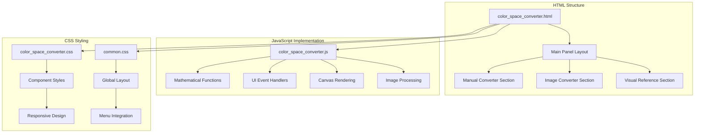
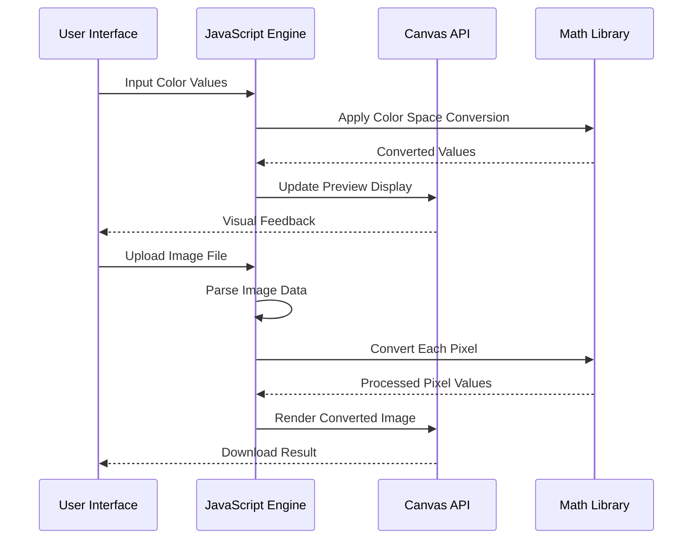
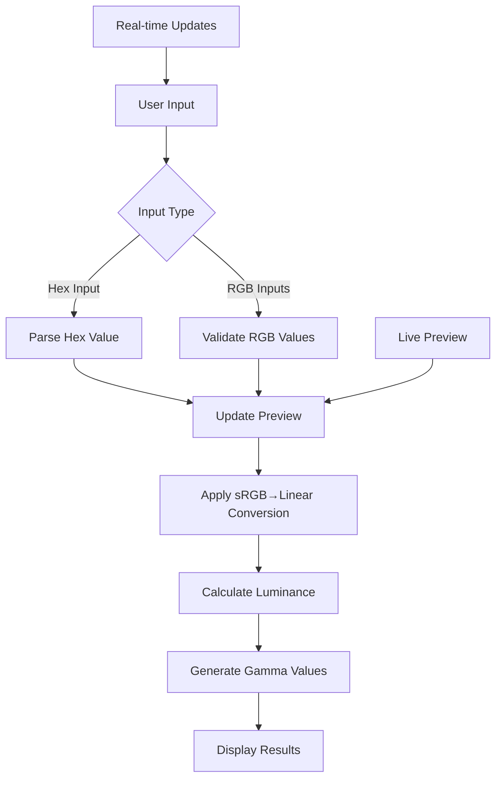
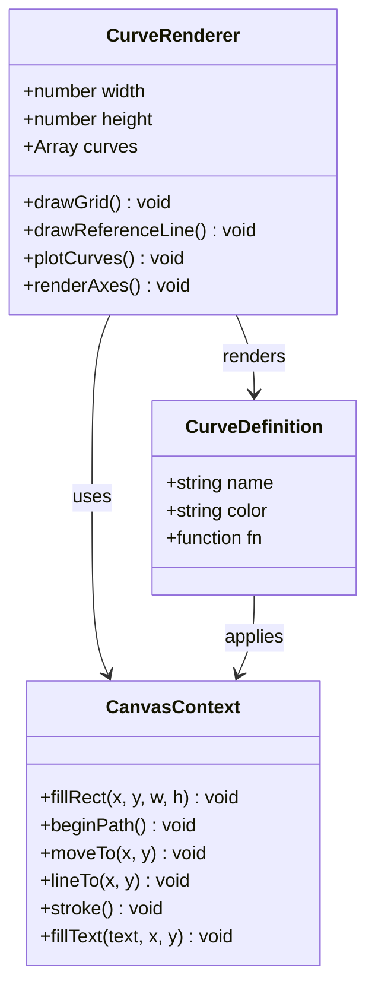
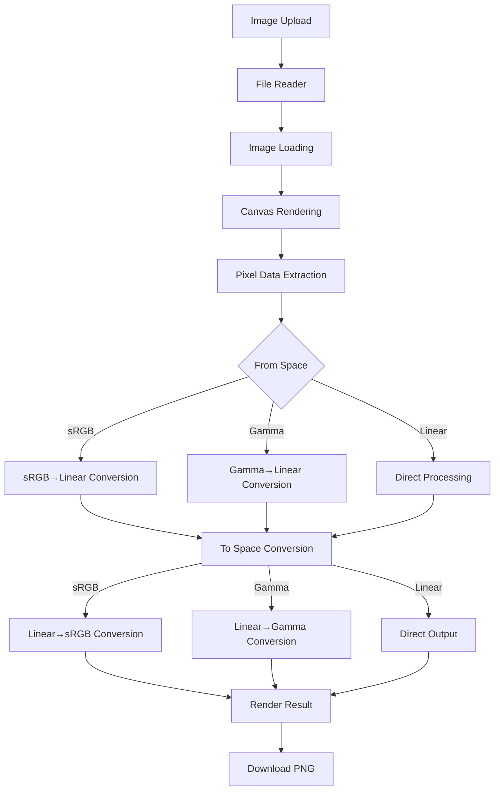
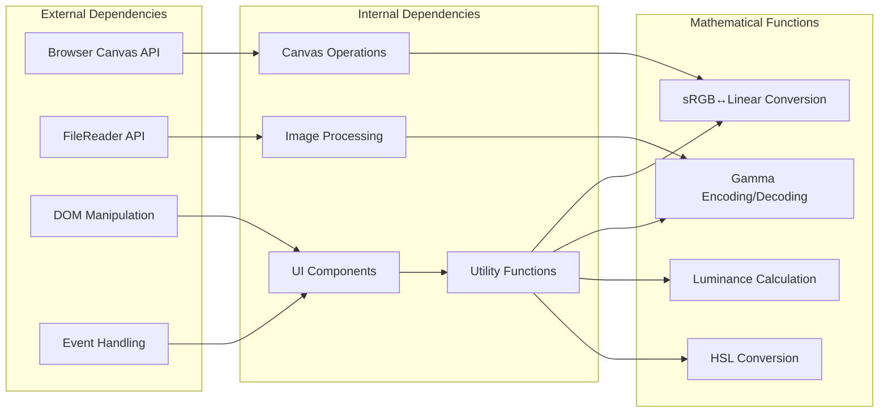

# Color Space Converter

<cite>
**Referenced Files in This Document**
- [color_space_converter.html](file://tools_html/color_space_converter.html)
- [color_space_converter.js](file://js/color_space_converter.js)
- [color_space_converter.css](file://css/color_space_converter.css)
- [common.css](file://css/common.css)
</cite>

## Table of Contents
1. [Introduction](#introduction)
2. [Project Structure](#project-structure)
3. [Core Components](#core-components)
4. [Architecture Overview](#architecture-overview)
5. [Detailed Component Analysis](#detailed-component-analysis)
6. [Dependency Analysis](#dependency-analysis)
7. [Performance Considerations](#performance-considerations)
8. [Troubleshooting Guide](#troubleshooting-guide)
9. [Conclusion](#conclusion)

## Introduction
The Color Space Converter is a specialized web-based tool designed for game artists and developers to work with color spaces and gamma encoding. This utility provides two primary functions: manual color value conversion and batch image color space transformation. It supports the three major color spaces used in game development: Linear, sRGB, and Gamma (with configurable gamma values of 1.8 and 2.2).

The tool serves as an essential resource for understanding and converting between different color representation systems commonly encountered in game engines and digital art workflows. It bridges the gap between artistic creation and engine rendering by providing precise mathematical conversions and visual demonstrations of color space transformations.

## Project Structure
The Color Space Converter follows a modular HTML/CSS/JavaScript architecture with clear separation of concerns:

**Diagram sources**
- [color_space_converter.html:19-133](file://tools_html/color_space_converter.html#L19-L133)
- [color_space_converter.js:1-329](file://js/color_space_converter.js#L1-L329)
- [color_space_converter.css:1-321](file://css/color_space_converter.css#L1-L321)

The project consists of three main components:
- **HTML Template**: Defines the user interface structure with responsive layout
- **JavaScript Logic**: Implements color space mathematics and interactive features
- **CSS Styling**: Provides visual design and responsive behavior

**Section sources**
- [color_space_converter.html:1-139](file://tools_html/color_space_converter.html#L1-L139)
- [color_space_converter.js:1-329](file://js/color_space_converter.js#L1-L329)
- [color_space_converter.css:1-321](file://css/color_space_converter.css#L1-L321)

## Core Components

### Mathematical Foundation
The converter implements precise color space conversion algorithms based on industry-standard formulas:

**Linear to sRGB Conversion:**
- Uses piecewise function with threshold at 0.04045
- Applies gamma correction with exponent 2.4 for values above threshold
- Handles the linear segment below threshold with factor 12.92

**sRGB to Linear Conversion:**
- Reverses the linear-to-sRGB process
- Applies inverse gamma function with exponent 1/2.4
- Maintains precision through careful floating-point arithmetic

**Gamma Encoding/Decoding:**
- Configurable gamma values (1.8, 2.2)
- Supports arbitrary gamma values through parameterized functions
- Essential for legacy engine compatibility

### Interactive Features
The tool provides multiple modes of operation:

**Manual Color Value Converter:**
- Real-time Hex color input with live preview
- Individual R, G, B channel adjustment
- Comprehensive conversion results display
- Luminance calculation and HSL conversion

**Transfer Curve Visualization:**
- Interactive canvas-based curve plotting
- Comparison of Linear, sRGB, and Gamma curves
- Dynamic legend and axis labeling
- Real-time curve updates

**Image Color Space Converter:**
- Drag-and-drop image upload
- Batch processing of pixel data
- Real-time preview of original and converted images
- Downloadable PNG results

**Section sources**
- [color_space_converter.js:6-43](file://js/color_space_converter.js#L6-L43)
- [color_space_converter.js:117-176](file://js/color_space_converter.js#L117-L176)
- [color_space_converter.js:218-311](file://js/color_space_converter.js#L218-L311)

## Architecture Overview

**Diagram sources**
- [color_space_converter.js:117-176](file://js/color_space_converter.js#L117-L176)
- [color_space_converter.js:218-311](file://js/color_space_converter.js#L218-L311)

The architecture employs a clean separation between presentation logic and computational algorithms:

1. **Event-Driven UI Layer**: Handles user interactions and updates visual feedback
2. **Mathematical Processing Layer**: Contains precise color space conversion algorithms
3. **Canvas Rendering Layer**: Manages visual output and image manipulation
4. **File Processing Layer**: Handles image loading and data extraction

**Section sources**
- [color_space_converter.js:321-327](file://js/color_space_converter.js#L321-L327)

## Detailed Component Analysis

### Manual Color Converter Component

**Diagram sources**
- [color_space_converter.js:117-159](file://js/color_space_converter.js#L117-L159)
- [color_space_converter.js:161-176](file://js/color_space_converter.js#L161-L176)

The manual converter provides immediate feedback through several interconnected processes:

**Input Validation and Normalization:**
- Hex color parsing with automatic format detection
- RGB value range validation (0-255)
- Real-time coordinate system updates

**Conversion Pipeline:**
- sRGB to Linear conversion using industry-standard formulas
- Luminance calculation using standard coefficients
- Gamma encoding for various gamma values
- HSL conversion for color theory applications

**Result Presentation:**
- Grid-based result display with categorized values
- Real-time color preview updates
- Comprehensive conversion metrics

### Transfer Curve Visualization Component

**Diagram sources**
- [color_space_converter.js:46-114](file://js/color_space_converter.js#L46-L114)

The curve visualization component creates an educational tool for understanding color space relationships:

**Rendering Architecture:**
- Dark-themed canvas with grid overlay
- Multi-colored curve plotting with precise mathematical functions
- Interactive legend with color-coded curve identification
- Axis labeling with scientific notation

**Mathematical Accuracy:**
- Linear curve as identity function
- sRGB curve using piecewise gamma transformation
- Gamma curves with configurable exponents
- Precise coordinate mapping for visual accuracy

### Image Processing Component

**Diagram sources**
- [color_space_converter.js:242-311](file://js/color_space_converter.js#L242-L311)

The image processing pipeline handles large-scale color space transformations efficiently:

**File Handling:**
- Drag-and-drop interface with visual feedback
- MIME type validation for supported formats
- Asynchronous file reading with error handling

**Pixel Processing:**
- Direct pixel manipulation using ImageData API
- Optimized loop structure for performance
- Preserved alpha channel during conversions
- Real-time progress indication

**Quality Assurance:**
- Input validation for gamma values
- Range clamping to prevent overflow
- Progressive enhancement for browser compatibility

**Section sources**
- [color_space_converter.js:218-311](file://js/color_space_converter.js#L218-L311)

### Visual Design System

The color space converter employs a cohesive design language that enhances usability:

**Color Scheme:**
- Primary accent color (#2fa888) for interactive elements
- Dark theme (#0f172a) for canvas areas
- Semi-transparent backgrounds for depth perception
- Consistent typography with Japanese Gothic UI font

**Layout Architecture:**
- Responsive two-column layout for desktop
- Single-column adaptation for mobile devices
- Card-based sections with subtle borders
- Consistent spacing and alignment

**Interactive Elements:**
- Gradient buttons with hover effects
- Animated transitions for state changes
- Visual feedback for drag-and-drop operations
- Disabled state indicators for inactive controls

**Section sources**
- [color_space_converter.css:1-321](file://css/color_space_converter.css#L1-L321)
- [common.css:1-386](file://css/common.css#L1-L386)

## Dependency Analysis

**Diagram sources**
- [color_space_converter.js:1-329](file://js/color_space_converter.js#L1-L329)

The tool maintains minimal external dependencies while leveraging modern browser capabilities:

**Core Browser APIs:**
- Canvas 2D context for rendering and image processing
- FileReader API for asynchronous file handling
- DOM manipulation for dynamic UI updates
- Event system for user interaction handling

**Internal Module Organization:**
- Utility functions encapsulated in closure scope
- Component initialization separated from event handlers
- Mathematical functions isolated from UI logic
- Canvas operations abstracted behind rendering functions

**Cross-Component Communication:**
- Event-driven architecture prevents tight coupling
- Shared utility functions reduce code duplication
- Modular initialization allows independent testing
- Clear separation enables easy maintenance

**Section sources**
- [color_space_converter.js:1-329](file://js/color_space_converter.js#L1-L329)

## Performance Considerations

### Memory Management
The converter implements several strategies to minimize memory usage:

**Image Processing Optimization:**
- Single-pass pixel manipulation reduces memory overhead
- Direct ImageData manipulation avoids intermediate arrays
- Canvas reuse prevents memory leaks from multiple canvases
- Efficient loop structures minimize garbage collection pressure

**DOM Manipulation Efficiency:**
- Batch DOM updates to reduce reflow operations
- Event delegation for dynamic elements
- CSS transforms for animations instead of layout changes
- Lazy initialization of heavy components

### Computational Efficiency
**Mathematical Optimizations:**
- Pre-computed constants eliminate repeated calculations
- Early termination conditions in validation logic
- Vectorized operations where possible
- Approximation methods for frequently used calculations

**Rendering Performance:**
- Canvas drawing optimized with efficient path construction
- Minimal redraw operations through selective updates
- Hardware acceleration leverage through canvas usage
- Debounced input handling for real-time updates

### Scalability Factors
**Large Image Handling:**
- Progressive loading for large images
- Memory-aware processing limits
- Background processing for heavy operations
- User feedback during long computations

**Browser Compatibility:**
- Feature detection for modern APIs
- Graceful degradation for older browsers
- Polyfills for missing functionality
- Performance monitoring across different environments

## Troubleshooting Guide

### Common Issues and Solutions

**Image Conversion Problems:**
- **Issue**: Images not converting or displaying incorrectly
  - **Solution**: Verify image format support (JPG, PNG, BMP, WEBP)
  - **Solution**: Check browser console for CORS-related errors
  - **Solution**: Ensure image dimensions are within browser limits

**Performance Issues:**
- **Issue**: Slow conversion of large images
  - **Solution**: Reduce image resolution before processing
  - **Solution**: Close other tabs to free up memory
  - **Solution**: Use browser with better canvas performance

**UI Responsiveness Problems:**
- **Issue**: Interface becomes unresponsive during operations
  - **Solution**: Wait for processing to complete before new actions
  - **Solution**: Refresh page if stuck in loading state
  - **Solution**: Clear browser cache and cookies

**Visual Display Issues:**
- **Issue**: Incorrect color appearance in previews
  - **Solution**: Calibrate monitor color settings
  - **Solution**: Check browser color management settings
  - **Solution**: Verify gamma settings match display calibration

### Error Prevention Strategies

**Input Validation:**
- Always validate numeric inputs within expected ranges
- Check file types before attempting to process
- Monitor for null or undefined values in calculations
- Implement bounds checking for all mathematical operations

**Resource Management:**
- Clean up event listeners when components are destroyed
- Release canvas resources when no longer needed
- Monitor memory usage for large image processing
- Implement timeout mechanisms for long operations

**Cross-Browser Compatibility:**
- Test functionality across supported browser versions
- Verify canvas API availability before use
- Check for FileReader API support in target browsers
- Validate CSS property support across different engines

**Section sources**
- [color_space_converter.js:242-311](file://js/color_space_converter.js#L242-L311)

## Conclusion

The Color Space Converter represents a sophisticated yet accessible solution for game artists and developers working with color space conversions. Its modular architecture, precise mathematical implementations, and intuitive user interface combine to create a powerful tool for both learning and practical application.

The tool's strength lies in its comprehensive coverage of color space fundamentals while maintaining simplicity of use. Through real-time visual feedback, educational curve displays, and practical batch processing capabilities, it serves as both a learning resource and a production utility.

Key achievements include:
- **Educational Value**: Clear visualization of color space relationships
- **Practical Utility**: Efficient batch processing for professional workflows  
- **Technical Precision**: Industry-standard mathematical implementations
- **User Experience**: Intuitive interface with immediate feedback
- **Performance**: Optimized algorithms for smooth operation

Future enhancements could include additional color space support, export format options, and advanced color theory features. However, the current implementation provides a solid foundation for color space conversion needs in game development workflows.