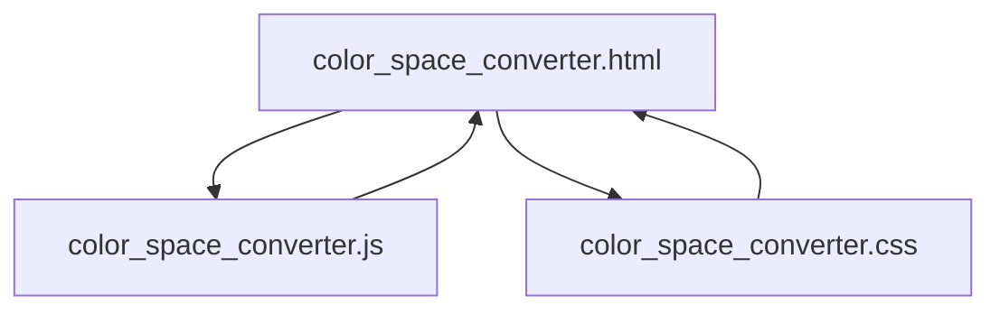
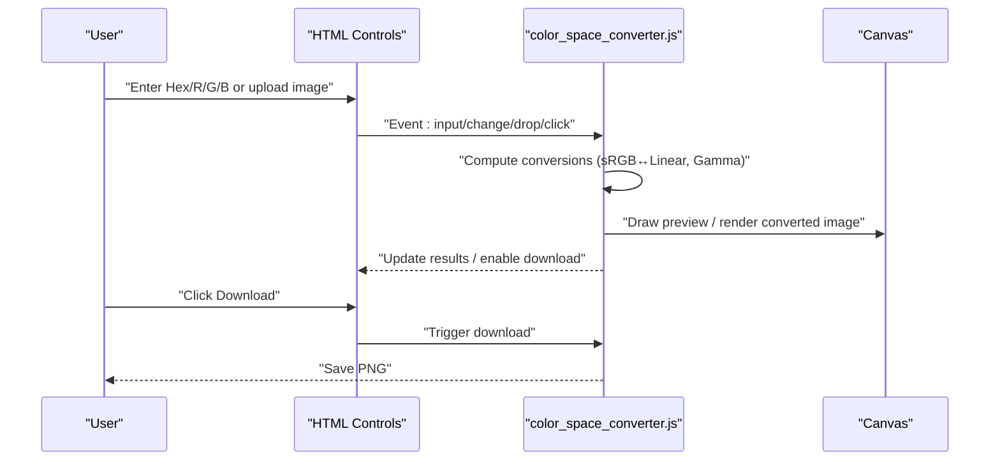
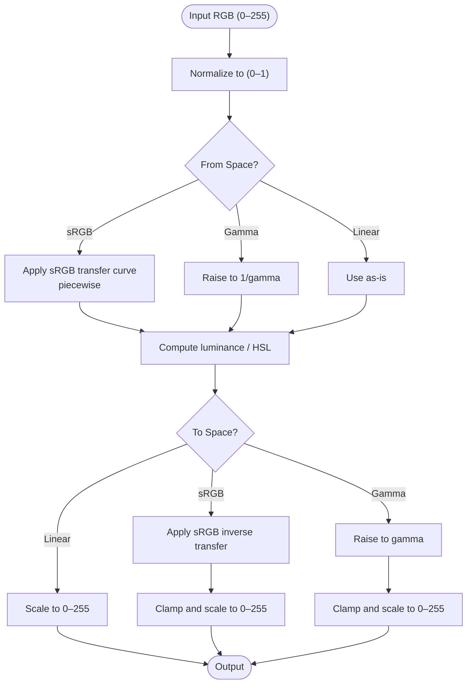
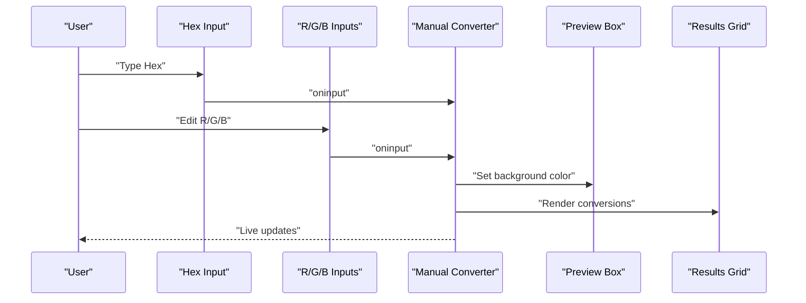
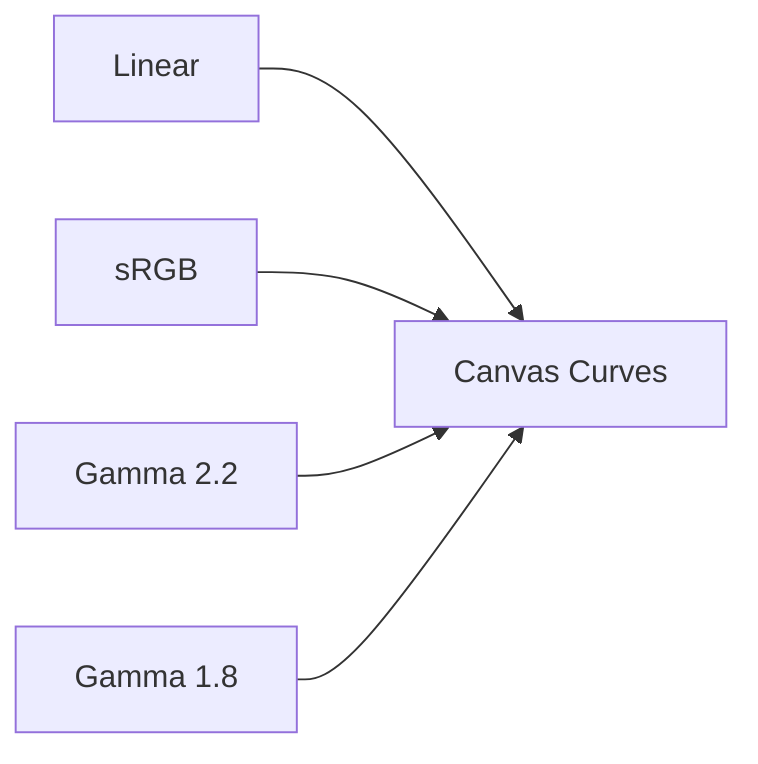
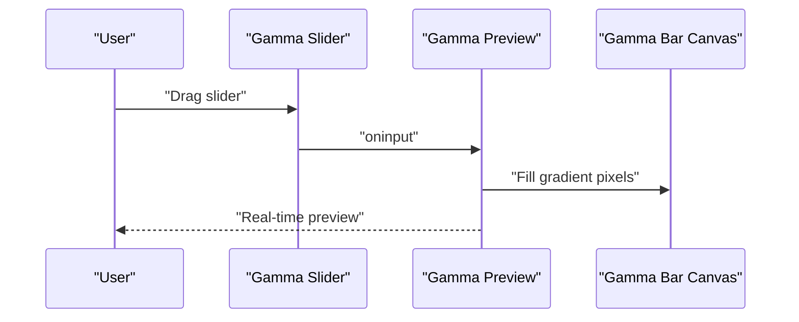
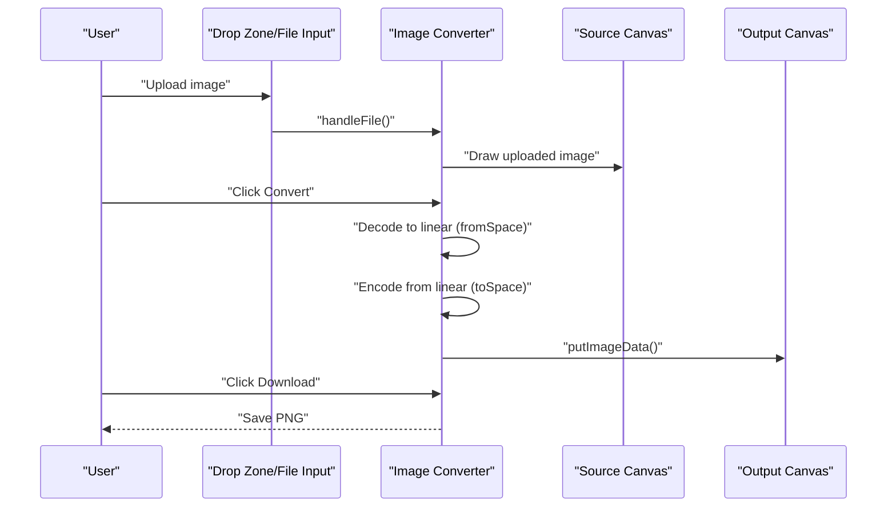
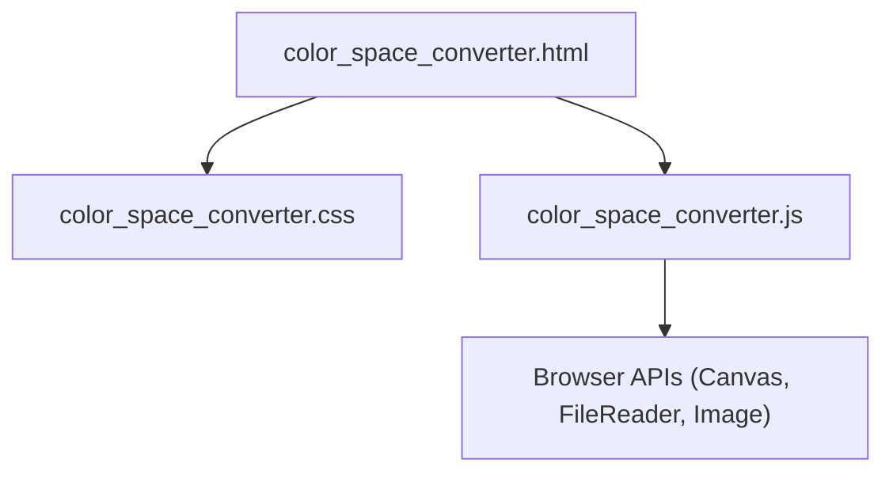

# Color Space Converter

<cite>
**Referenced Files in This Document**
- [color_space_converter.js](file://js/color_space_converter.js)
- [color_space_converter.css](file://css/color_space_converter.css)
- [color_space_converter.html](file://tools_html/color_space_converter.html)
</cite>

## Table of Contents
1. [Introduction](#introduction)
2. [Project Structure](#project-structure)
3. [Core Components](#core-components)
4. [Architecture Overview](#architecture-overview)
5. [Detailed Component Analysis](#detailed-component-analysis)
6. [Dependency Analysis](#dependency-analysis)
7. [Performance Considerations](#performance-considerations)
8. [Troubleshooting Guide](#troubleshooting-guide)
9. [Conclusion](#conclusion)
10. [Appendices](#appendices)

## Introduction
This document explains the Color Space Converter tool that transforms colors between RGB color spaces commonly used in games, film, and digital imaging. It covers the underlying mathematics of gamma correction and sRGB-to-linear conversions, the workflow for converting textures and images, and practical guidance for choosing color spaces across engines and devices. It also provides examples for texture preparation, HDR workflows, and display calibration, along with best practices for visual quality, performance, and cross-platform compatibility.

## Project Structure
The Color Space Converter is a self-contained web tool composed of:
- A single HTML page that defines the UI layout and controls
- A JavaScript module that implements color math, UI event handlers, and image processing
- A CSS module that styles the interface and responsive layout

**Diagram sources**
- [color_space_converter.html:1-138](file://tools_html/color_space_converter.html#L1-L138)
- [color_space_converter.js:1-328](file://js/color_space_converter.js#L1-L328)
- [color_space_converter.css:1-320](file://css/color_space_converter.css#L1-L320)

**Section sources**
- [color_space_converter.html:1-138](file://tools_html/color_space_converter.html#L1-L138)
- [color_space_converter.js:1-328](file://js/color_space_converter.js#L1-L328)
- [color_space_converter.css:1-320](file://css/color_space_converter.css#L1-L320)

## Core Components
- Color math utilities:
  - sRGB to linear conversion
  - Linear to sRGB conversion
  - Gamma encoding/decoding helpers
  - Hex-to-RGB and RGB-to-Hex conversions
  - Luminance calculation
- UI components:
  - Manual color converter (Hex/R/G/B inputs, live preview, computed results)
  - Transfer curve visualization (Linear, sRGB, Gamma 2.2, Gamma 1.8)
  - Gamma gradient preview slider
  - Image converter (drag-and-drop upload, batch conversion, download)
- Engine compatibility quick reference (Unreal Engine and Unity)

Key implementation references:
- Color math functions and luminance: [color_space_converter.js:7-43](file://js/color_space_converter.js#L7-L43)
- Manual converter UI and results rendering: [color_space_converter.js:117-176](file://js/color_space_converter.js#L117-L176), [color_space_converter.html:28-42](file://tools_html/color_space_converter.html#L28-L42)
- Transfer curve chart drawing: [color_space_converter.js:46-114](file://js/color_space_converter.js#L46-L114)
- Gamma preview slider: [color_space_converter.js:191-216](file://js/color_space_converter.js#L191-L216), [color_space_converter.html:52-66](file://tools_html/color_space_converter.html#L52-L66)
- Image converter pipeline: [color_space_converter.js:218-319](file://js/color_space_converter.js#L218-L319), [color_space_converter.html:71-112](file://tools_html/color_space_converter.html#L71-L112)
- Engine quick reference: [color_space_converter.html:114-129](file://tools_html/color_space_converter.html#L114-L129)

**Section sources**
- [color_space_converter.js:7-43](file://js/color_space_converter.js#L7-L43)
- [color_space_converter.js:117-176](file://js/color_space_converter.js#L117-L176)
- [color_space_converter.js:46-114](file://js/color_space_converter.js#L46-L114)
- [color_space_converter.js:191-216](file://js/color_space_converter.js#L191-L216)
- [color_space_converter.js:218-319](file://js/color_space_converter.js#L218-L319)
- [color_space_converter.html:28-42](file://tools_html/color_space_converter.html#L28-L42)
- [color_space_converter.html:52-66](file://tools_html/color_space_converter.html#L52-L66)
- [color_space_converter.html:71-112](file://tools_html/color_space_converter.html#L71-L112)
- [color_space_converter.html:114-129](file://tools_html/color_space_converter.html#L114-L129)

## Architecture Overview
The tool follows a modular client-side architecture:
- UI is declarative in HTML with interactive controls
- Event-driven logic updates previews and results
- Canvas-based image processing performs pixel-wise color space conversions
- Mathematical functions encapsulate gamma and sRGB transfer curves

**Diagram sources**
- [color_space_converter.js:117-176](file://js/color_space_converter.js#L117-L176)
- [color_space_converter.js:218-319](file://js/color_space_converter.js#L218-L319)
- [color_space_converter.html:28-42](file://tools_html/color_space_converter.html#L28-L42)
- [color_space_converter.html:71-112](file://tools_html/color_space_converter.html#L71-L112)

## Detailed Component Analysis

### Color Math Utilities
The core of the tool is a set of precise color-space conversion functions:
- sRGB to linear: applies the standard piecewise sRGB transfer curve
- Linear to sRGB: inverse of the above
- Gamma encode/decode: raises values to power for gamma encoding/decoding
- Hex/RGB conversions: convenience utilities for UI
- Luminance: weighted sum for perceived brightness

Implementation references:
- sRGB ↔ linear conversions: [color_space_converter.js:7-15](file://js/color_space_converter.js#L7-L15)
- Gamma encode/decode: [color_space_converter.js:17-23](file://js/color_space_converter.js#L17-L23)
- Hex/RGB conversions: [color_space_converter.js:25-39](file://js/color_space_converter.js#L25-L39)
- Luminance: [color_space_converter.js:41-43](file://js/color_space_converter.js#L41-L43)

**Diagram sources**
- [color_space_converter.js:7-15](file://js/color_space_converter.js#L7-L15)
- [color_space_converter.js:17-23](file://js/color_space_converter.js#L17-L23)
- [color_space_converter.js:41-43](file://js/color_space_converter.js#L41-L43)

**Section sources**
- [color_space_converter.js:7-15](file://js/color_space_converter.js#L7-L15)
- [color_space_converter.js:17-23](file://js/color_space_converter.js#L17-L23)
- [color_space_converter.js:25-39](file://js/color_space_converter.js#L25-L39)
- [color_space_converter.js:41-43](file://js/color_space_converter.js#L41-L43)

### Manual Color Converter
This component allows real-time conversion of a single color:
- Inputs: Hex (#RRGGBB) or separate R/G/B channels
- Live preview: background color updates instantly
- Results: sRGB (0–255), Hex, Linear (0–1 and 0–255), luminance, gamma 2.2, normalized sRGB, HSL

Implementation references:
- UI inputs and preview: [color_space_converter.html:28-42](file://tools_html/color_space_converter.html#L28-L42)
- Update logic and results rendering: [color_space_converter.js:117-176](file://js/color_space_converter.js#L117-L176)

**Diagram sources**
- [color_space_converter.html:28-42](file://tools_html/color_space_converter.html#L28-L42)
- [color_space_converter.js:117-176](file://js/color_space_converter.js#L117-L176)

**Section sources**
- [color_space_converter.html:28-42](file://tools_html/color_space_converter.html#L28-L42)
- [color_space_converter.js:117-176](file://js/color_space_converter.js#L117-L176)

### Transfer Curve Visualization
This feature draws and compares transfer curves for Linear, sRGB, Gamma 2.2, and Gamma 1.8, aiding understanding of how values map under different color spaces.

Implementation references:
- Chart drawing and legend: [color_space_converter.js:46-114](file://js/color_space_converter.js#L46-L114), [color_space_converter.html:44-50](file://tools_html/color_space_converter.html#L44-L50)

**Diagram sources**
- [color_space_converter.js:46-114](file://js/color_space_converter.js#L46-L114)
- [color_space_converter.html:44-50](file://tools_html/color_space_converter.html#L44-L50)

**Section sources**
- [color_space_converter.js:46-114](file://js/color_space_converter.js#L46-L114)
- [color_space_converter.html:44-50](file://tools_html/color_space_converter.html#L44-L50)

### Gamma Gradient Preview
A slider adjusts gamma dynamically and renders a grayscale gradient to visualize the effect.

Implementation references:
- Slider and canvas drawing: [color_space_converter.js:191-216](file://js/color_space_converter.js#L191-L216), [color_space_converter.html:52-66](file://tools_html/color_space_converter.html#L52-L66)

**Diagram sources**
- [color_space_converter.js:191-216](file://js/color_space_converter.js#L191-L216)
- [color_space_converter.html:52-66](file://tools_html/color_space_converter.html#L52-L66)

**Section sources**
- [color_space_converter.js:191-216](file://js/color_space_converter.js#L191-L216)
- [color_space_converter.html:52-66](file://tools_html/color_space_converter.html#L52-L66)

### Image Color Space Converter
Batch converts uploaded images between color spaces:
- Drag-and-drop or click-to-upload
- Select source and target color spaces (sRGB, Linear, Gamma)
- Adjust gamma for Gamma conversions
- Renders original and converted canvases
- Downloads converted PNG

Implementation references:
- Upload and drag events: [color_space_converter.js:221-259](file://js/color_space_converter.js#L221-L259)
- Conversion loop and pixel processing: [color_space_converter.js:261-311](file://js/color_space_converter.js#L261-L311)
- Download handler: [color_space_converter.js:313-319](file://js/color_space_converter.js#L313-L319)
- UI controls: [color_space_converter.html:71-112](file://tools_html/color_space_converter.html#L71-L112)

**Diagram sources**
- [color_space_converter.js:221-259](file://js/color_space_converter.js#L221-L259)
- [color_space_converter.js:261-311](file://js/color_space_converter.js#L261-L311)
- [color_space_converter.js:313-319](file://js/color_space_converter.js#L313-L319)
- [color_space_converter.html:71-112](file://tools_html/color_space_converter.html#L71-L112)

**Section sources**
- [color_space_converter.js:221-259](file://js/color_space_converter.js#L221-L259)
- [color_space_converter.js:261-311](file://js/color_space_converter.js#L261-L311)
- [color_space_converter.js:313-319](file://js/color_space_converter.js#L313-L319)
- [color_space_converter.html:71-112](file://tools_html/color_space_converter.html#L71-L112)

### Engine Compatibility Quick Reference
The tool includes a quick reference for Unreal Engine and Unity color space workflows, including common pitfalls.

References:
- [color_space_converter.html:114-129](file://tools_html/color_space_converter.html#L114-L129)

**Section sources**
- [color_space_converter.html:114-129](file://tools_html/color_space_converter.html#L114-L129)

## Dependency Analysis
- HTML depends on CSS and JS for presentation and behavior
- JS depends on browser APIs (Canvas, FileReader, Image) and DOM APIs
- No external libraries are used; all logic is self-contained

**Diagram sources**
- [color_space_converter.html:1-138](file://tools_html/color_space_converter.html#L1-L138)
- [color_space_converter.js:1-328](file://js/color_space_converter.js#L1-L328)
- [color_space_converter.css:1-320](file://css/color_space_converter.css#L1-L320)

**Section sources**
- [color_space_converter.html:1-138](file://tools_html/color_space_converter.html#L1-L138)
- [color_space_converter.js:1-328](file://js/color_space_converter.js#L1-L328)
- [color_space_converter.css:1-320](file://css/color_space_converter.css#L1-L320)

## Performance Considerations
- Pixel loop complexity: O(N) over all pixels; typical images process quickly in modern browsers
- Canvas operations: getImageData/putImageData are synchronous and can block the UI thread for large images
- Recommendations:
  - Prefer smaller images for interactive previews
  - Consider worker threads for very large images
  - Limit frequent re-conversion during user interaction (debounce inputs)
  - Use nearest-neighbor scaling if resampling is needed to avoid extra color shifts

[No sources needed since this section provides general guidance]

## Troubleshooting Guide
Common issues and resolutions:
- Unexpected dark or washed-out results:
  - Verify the source color space selection matches the image’s storage format
  - Ensure gamma values are correct for the target engine
- Incorrect luminance/HSL:
  - Confirm conversions are performed in the intended space (sRGB vs Linear)
- UI not updating:
  - Check that inputs are valid numeric ranges and Hex format
- Download button disabled:
  - Ensure an image was uploaded and conversion completed

References:
- Manual converter update and validation: [color_space_converter.js:117-176](file://js/color_space_converter.js#L117-L176)
- Image conversion logic: [color_space_converter.js:261-311](file://js/color_space_converter.js#L261-L311)
- Engine quick reference for common pitfalls: [color_space_converter.html:114-129](file://tools_html/color_space_converter.html#L114-L129)

**Section sources**
- [color_space_converter.js:117-176](file://js/color_space_converter.js#L117-L176)
- [color_space_converter.js:261-311](file://js/color_space_converter.js#L261-L311)
- [color_space_converter.html:114-129](file://tools_html/color_space_converter.html#L114-L129)

## Conclusion
The Color Space Converter provides a practical, mathematically sound toolkit for converting between sRGB, Linear, and Gamma color spaces. It supports both single-color calculations and batch image conversions, with visual aids to help understand transfer curves and gamma effects. By selecting the correct color space and adhering to engine-specific workflows, artists and developers can achieve consistent visual quality across platforms while minimizing artifacts.

[No sources needed since this section summarizes without analyzing specific files]

## Appendices

### Mathematical Principles and Practical Guidance
- sRGB transfer curve:
  - Nonlinear mapping designed for CRT displays; used widely for storage and transmission
  - Apply piecewise sRGB forward/inverse transforms when moving to/from linear
- Linear color space:
  - Physically meaningful for lighting computations; preferred in modern engines
  - Use for PBR materials, HDR workflows, and compositing
- Gamma encoding:
  - Approximates sRGB; historically used in older pipelines
  - Ensure consistent gamma across tools and engines to avoid mismatches
- Luminance:
  - Perceived brightness using standard coefficients; useful for quick checks
- HSL:
  - Good for hue-based adjustments; keep in mind that saturation/lightness can appear differently in Linear vs sRGB

References:
- sRGB ↔ linear conversions: [color_space_converter.js:7-15](file://js/color_space_converter.js#L7-L15)
- Luminance: [color_space_converter.js:41-43](file://js/color_space_converter.js#L41-L43)
- HSL computation: [color_space_converter.js:161-176](file://js/color_space_converter.js#L161-L176)

**Section sources**
- [color_space_converter.js:7-15](file://js/color_space_converter.js#L7-L15)
- [color_space_converter.js:41-43](file://js/color_space_converter.js#L41-L43)
- [color_space_converter.js:161-176](file://js/color_space_converter.js#L161-L176)

### Example Workflows
- Texture preparation:
  - Store base/metallic/roughness/normal AO textures as Linear (or disable sRGB in importers)
  - Keep emissive/specular maps in Linear
  - UI/overlay textures: keep sRGB enabled so they appear correctly on screen
- HDR workflows:
  - Work in Linear for lighting and compositing
  - Tone map to sRGB for display
- Display calibration:
  - Match monitor gamma to 2.2 or 2.4 for sRGB-like appearance
  - Use transfer curve visualization to confirm perceptual uniformity

[No sources needed since this section provides general guidance]

### Choosing Color Spaces by Use Case
- Game engines:
  - Unreal Engine: default sRGB for textures; engine converts to Linear for lighting; output to sRGB for display
  - Unity: choose Linear workflow; ensure non-color data (ORM/AO) disables sRGB
- Film/Digital Imaging:
  - Use Linear for internal processing; apply appropriate display primaries/transfers for output
- Cross-engine portability:
  - Standardize on sRGB for interchange; adjust gamma consistently across tools

References:
- Engine quick reference: [color_space_converter.html:114-129](file://tools_html/color_space_converter.html#L114-L129)

**Section sources**
- [color_space_converter.html:114-129](file://tools_html/color_space_converter.html#L114-L129)