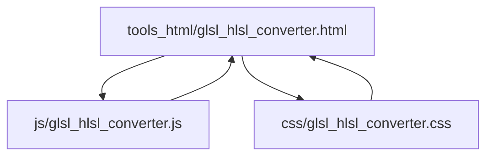
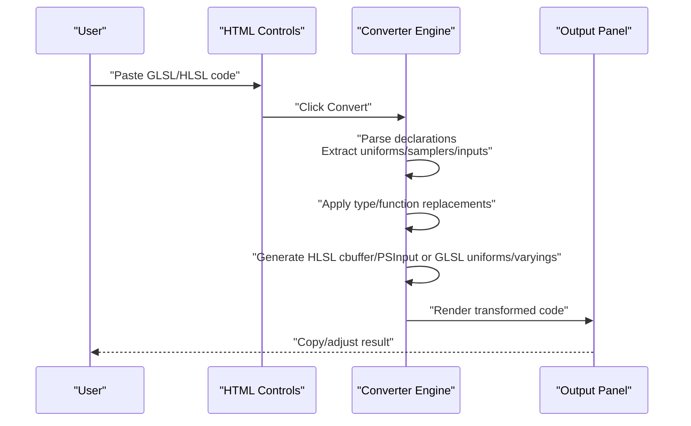
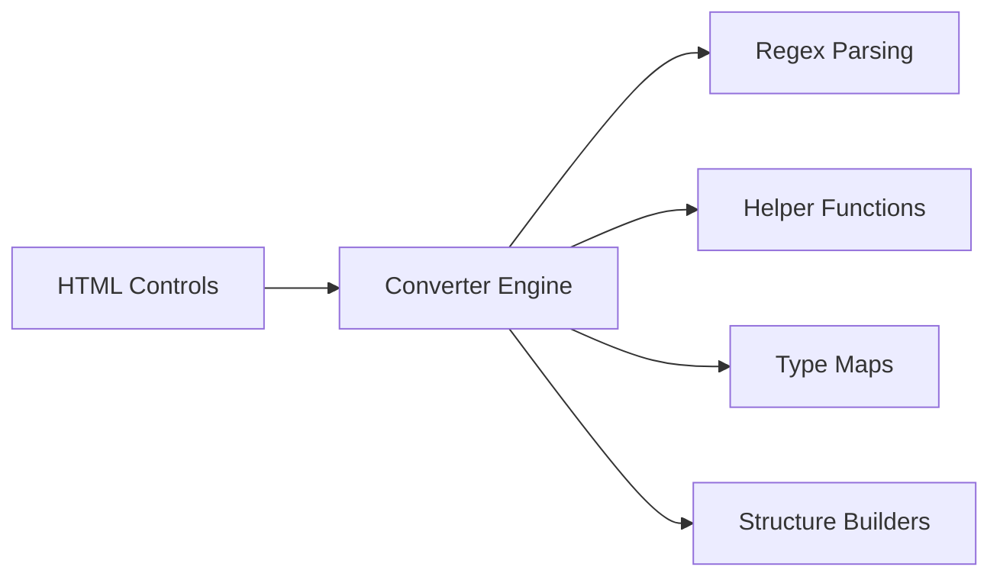

# GLSL/HLSL Converter

<cite>
**Referenced Files in This Document**
- [glsl_hlsl_converter.js](file://js/glsl_hlsl_converter.js)
- [glsl_hlsl_converter.html](file://tools_html/glsl_hlsl_converter.html)
- [glsl_hlsl_converter.css](file://css/glsl_hlsl_converter.css)
</cite>

## Table of Contents
1. [Introduction](#introduction)
2. [Project Structure](#project-structure)
3. [Core Components](#core-components)
4. [Architecture Overview](#architecture-overview)
5. [Detailed Component Analysis](#detailed-component-analysis)
6. [Dependency Analysis](#dependency-analysis)
7. [Performance Considerations](#performance-considerations)
8. [Troubleshooting Guide](#troubleshooting-guide)
9. [Conclusion](#conclusion)
10. [Appendices](#appendices)

## Introduction
This document describes the GLSL/HLSL Converter tool that translates shader code between OpenGL Shading Language (GLSL) and High-Level Shading Language (HLSL). It explains the syntax conversion rules, data type mappings, function name translations, and the workflow for converting shaders between WebGL/GLSL and DirectX/HLSL contexts. It also covers platform-specific differences, precision qualifiers, built-in function variations, and provides troubleshooting guidance for common conversion errors.

## Project Structure
The GLSL/HLSL Converter is a self-contained web tool with a minimal UI and a focused conversion engine:
- A static HTML page defines the layout and controls.
- A CSS stylesheet styles the interface.
- A JavaScript module performs the conversion logic and manages UI interactions.

**Diagram sources**
- [glsl_hlsl_converter.html:12-95](file://tools_html/glsl_hlsl_converter.html#L12-L95)
- [glsl_hlsl_converter.js:108-252](file://js/glsl_hlsl_converter.js#L108-L252)
- [glsl_hlsl_converter.css:12-354](file://css/glsl_hlsl_converter.css#L12-L354)

**Section sources**
- [glsl_hlsl_converter.html:12-95](file://tools_html/glsl_hlsl_converter.html#L12-L95)
- [glsl_hlsl_converter.js:108-252](file://js/glsl_hlsl_converter.js#L108-L252)
- [glsl_hlsl_converter.css:12-354](file://css/glsl_hlsl_converter.css#L12-L354)

## Core Components
- Directional conversion modes:
  - GLSL → HLSL: Converts fragment shaders commonly used in WebGL to HLSL for DirectX.
  - HLSL → GLSL: Restores typical HLSL fragment shaders to GLSL for WebGL.
- Type mapping tables:
  - GLSL_TO_HLSL_TYPES: Maps GLSL vector/matrix types to HLSL equivalents.
  - HLSL_TO_GLSL_TYPES: Maps HLSL types back to GLSL equivalents.
- Conversion functions:
  - convertGlslToHlsl: Performs GLSL-to-HLSL translation.
  - convertHlslToGlsl: Performs HLSL-to-GLSL translation.
- Utility helpers:
  - buildUniformBlock, buildInputStruct, buildGlslInputDecl, attachInputReferences, rewriteMainToHlsl, replaceTextureCallsGlslToHlsl, mapType, replaceToken, cleanupCode.

Key behaviors:
- Removes GLSL version directives and precision qualifiers.
- Extracts uniforms, varying/in/out, and sampler declarations.
- Generates HLSL cbuffer and PSInput structures.
- Replaces GLSL built-ins with HLSL equivalents and vice versa.
- Handles texture sampling conversions between GLSL texture()/textureLod() and HLSL Texture2D.Sample()/SampleLevel().
- Provides conversion notes and warnings for manual follow-up.

**Section sources**
- [glsl_hlsl_converter.js:39-76](file://js/glsl_hlsl_converter.js#L39-L76)
- [glsl_hlsl_converter.js:78-106](file://js/glsl_hlsl_converter.js#L78-L106)
- [glsl_hlsl_converter.js:254-338](file://js/glsl_hlsl_converter.js#L254-L338)
- [glsl_hlsl_converter.js:340-476](file://js/glsl_hlsl_converter.js#L340-L476)
- [glsl_hlsl_converter.js:478-579](file://js/glsl_hlsl_converter.js#L478-L579)

## Architecture Overview
The converter operates as a client-side transformation pipeline. The UI captures user input, triggers conversion, and displays results with contextual notes.

**Diagram sources**
- [glsl_hlsl_converter.html:34-95](file://tools_html/glsl_hlsl_converter.html#L34-L95)
- [glsl_hlsl_converter.js:181-199](file://js/glsl_hlsl_converter.js#L181-L199)
- [glsl_hlsl_converter.js:254-338](file://js/glsl_hlsl_converter.js#L254-L338)
- [glsl_hlsl_converter.js:340-476](file://js/glsl_hlsl_converter.js#L340-L476)

## Detailed Component Analysis

### Conversion Modes and Rules
- GLSL → HLSL:
  - Focuses on fragment shaders.
  - Notes: Prefer converting fragment shaders; complex macros, structs, multiple render targets, and custom bindings require manual review.
  - Rules:
    - Vector/matrix types mapped to floatN/intN/boolN series.
    - Common functions replaced with HLSL equivalents (e.g., mix→lerp, fract→frac, mod→fmod, inversesqrt→rsqrt, dFdx/dFdy→ddx/ddy, atan(a,b)→atan2).
    - sampler2D/samplerCube split into Texture2D/TextureCube plus SamplerState.
    - uniforms grouped into cbuffer Globals when possible.
    - gl_FragColor rewritten to return statements.
- HLSL → GLSL:
  - Targets typical HLSL fragment shaders using Texture2D/SamplerState and PSInput.
  - Notes: HLSL semantics, register bindings, and complex cbuffer layouts may require manual adjustment after conversion.
  - Rules:
    - floatN/intN/boolN mapped back to vec/ivec/bvec.
    - Texture2D.Sample/SampleLevel restored to texture()/textureLod().
    - cbuffer Globals members converted back to uniform declarations.
    - SV_Position mapped to gl_FragCoord or varying/in inputs.
    - return statements converted to gl_FragColor assignments.

**Section sources**
- [glsl_hlsl_converter.js:39-76](file://js/glsl_hlsl_converter.js#L39-L76)

### Data Type Mappings
- GLSL to HLSL:
  - vec2/vec3/vec4 → float2/float3/float4
  - ivec2/ivec3/ivec4 → int2/int3/int4
  - bvec2/bvec3/bvec4 → bool2/bool3/bool4
  - mat2/mat3/mat4 → float2x2/float3x3/float4x4
- HLSL to GLSL:
  - float2/float3/float4 → vec2/vec3/vec4
  - int2/int3/int4 → ivec2/ivec3/ivec4
  - bool2/bool3/bool4 → bvec2/bvec3/bvec4
  - float2x2/float3x3/float4x4 → mat2/mat3/mat4

These mappings are applied globally during conversion.

**Section sources**
- [glsl_hlsl_converter.js:78-106](file://js/glsl_hlsl_converter.js#L78-L106)

### Built-in Function Translations
- GLSL → HLSL:
  - mix → lerp
  - fract → frac
  - mod → fmod
  - inversesqrt → rsqrt
  - dFdx → ddx
  - dFdy → ddy
  - atan(a,b) → atan2(a,b)
- HLSL → GLSL:
  - lerp → mix
  - frac → fract
  - fmod → mod
  - rsqrt → inversesqrt
  - ddx → dFdx
  - ddy → dFdy
  - atan2 → atan

Additionally, textureCube usage requires manual correction to TextureCube.Sample in HLSL.

**Section sources**
- [glsl_hlsl_converter.js:310-317](file://js/glsl_hlsl_converter.js#L310-L317)
- [glsl_hlsl_converter.js:409-416](file://js/glsl_hlsl_converter.js#L409-L416)
- [glsl_hlsl_converter.js:319-321](file://js/glsl_hlsl_converter.js#L319-L321)

### Uniform and Sampler Handling
- GLSL → HLSL:
  - sampler2D/samplerCube declarations are extracted and split into separate Texture2D/TextureCube and SamplerState declarations.
  - Other uniforms are collected and placed into a cbuffer Globals block.
  - gl_FragCoord references are mapped to input.position.
  - gl_FragColor is replaced with a return statement.
- HLSL → GLSL:
  - cbuffer blocks are parsed to reconstruct uniform declarations.
  - Texture2D/SamplerState pairs are converted back to GLSL sampler2D declarations.
  - PSInput structure fields are mapped to GLSL varying/in declarations, except SV_Position which maps to gl_FragCoord.

**Section sources**
- [glsl_hlsl_converter.js:271-289](file://js/glsl_hlsl_converter.js#L271-L289)
- [glsl_hlsl_converter.js:348-364](file://js/glsl_hlsl_converter.js#L348-L364)
- [glsl_hlsl_converter.js:366-374](file://js/glsl_hlsl_converter.js#L366-L374)
- [glsl_hlsl_converter.js:376-393](file://js/glsl_hlsl_converter.js#L376-L393)
- [glsl_hlsl_converter.js:425-438](file://js/glsl_hlsl_converter.js#L425-L438)

### Input/Output Structures
- GLSL → HLSL:
  - PSInput structure is generated with SV_Position and TEXCOORDN fields for varying inputs.
  - Main function signature is rewritten to float4 main(PSInput input) : SV_Target.
  - Output assignment is converted to return statements.
- HLSL → GLSL:
  - PSInput structure is parsed to restore GLSL varying/in declarations.
  - Main signature is rewritten to void main().
  - Return statements are converted to gl_FragColor assignments.

**Section sources**
- [glsl_hlsl_converter.js:494-501](file://js/glsl_hlsl_converter.js#L494-L501)
- [glsl_hlsl_converter.js:518-548](file://js/glsl_hlsl_converter.js#L518-L548)
- [glsl_hlsl_converter.js:405-407](file://js/glsl_hlsl_converter.js#L405-L407)

### Texture Sampling Conversions
- GLSL → HLSL:
  - Calls to texture(sampler, uv) and textureLod(sampler, uv, level) are replaced with Texture2D.Sample(Texture2D, SamplerState, uv) and SampleLevel respectively.
  - If a sampler name cannot be matched, a note is added for manual verification.
- HLSL → GLSL:
  - Texture2D.Sample(...) and Texture2D.SampleLevel(...) are replaced with texture() and textureLod() respectively.

**Section sources**
- [glsl_hlsl_converter.js:304-304](file://js/glsl_hlsl_converter.js#L304-L304)
- [glsl_hlsl_converter.js:418-423](file://js/glsl_hlsl_converter.js#L418-L423)
- [glsl_hlsl_converter.js:551-563](file://js/glsl_hlsl_converter.js#L551-L563)

### Precision Qualifiers and Layout Directives
- Precision qualifiers (lowp/mediump/highp) are removed from GLSL code and noted.
- GLSL layout qualifiers are stripped from the code.

**Section sources**
- [glsl_hlsl_converter.js:262-267](file://js/glsl_hlsl_converter.js#L262-L267)
- [glsl_hlsl_converter.js:269-269](file://js/glsl_hlsl_converter.js#L269-L269)

### Example Conversion Scenarios
- Fragment shader with texture sampling and UV blending:
  - GLSL → HLSL: sampler2D becomes Texture2D + SamplerState; texture() becomes Texture2D.Sample(); varying inputs become PSInput TEXCOORD fields; gl_FragColor becomes return.
  - HLSL → GLSL: Texture2D/SamplerState pair becomes sampler2D; Texture2D.Sample() becomes texture(); PSInput fields become varying; return becomes gl_FragColor.
- Vertex position transformations:
  - GLSL: gl_FragCoord is mapped to PSInput.position.
  - HLSL: PSInput.position maps to gl_FragCoord.
- Uniform variable declarations:
  - GLSL uniforms are grouped into cbuffer Globals.
  - HLSL cbuffer fields are converted back to uniform declarations.

**Section sources**
- [glsl_hlsl_converter.js:1-37](file://js/glsl_hlsl_converter.js#L1-L37)
- [glsl_hlsl_converter.js:327-328](file://js/glsl_hlsl_converter.js#L327-L328)
- [glsl_hlsl_converter.js:431-431](file://js/glsl_hlsl_converter.js#L431-L431)

## Dependency Analysis
The converter’s JavaScript module depends on:
- DOM APIs for UI updates and event handling.
- Regular expressions for parsing and replacing shader constructs.
- Helper functions for building HLSL/GLSL structures and applying global replacements.

**Diagram sources**
- [glsl_hlsl_converter.js:108-252](file://js/glsl_hlsl_converter.js#L108-L252)
- [glsl_hlsl_converter.js:254-338](file://js/glsl_hlsl_converter.js#L254-L338)
- [glsl_hlsl_converter.js:340-476](file://js/glsl_hlsl_converter.js#L340-L476)
- [glsl_hlsl_converter.js:478-579](file://js/glsl_hlsl_converter.js#L478-L579)

**Section sources**
- [glsl_hlsl_converter.js:108-252](file://js/glsl_hlsl_converter.js#L108-L252)
- [glsl_hlsl_converter.js:254-338](file://js/glsl_hlsl_converter.js#L254-L338)
- [glsl_hlsl_converter.js:340-476](file://js/glsl_hlsl_converter.js#L340-L476)
- [glsl_hlsl_converter.js:478-579](file://js/glsl_hlsl_converter.js#L478-L579)

## Performance Considerations
- The converter uses linear-time regex replacements and simple string manipulations. For typical shader sizes, performance is negligible.
- Global type and function replacements are O(N) over the code length.
- Structure generation and attachment operations are efficient for small to medium shader code.

[No sources needed since this section provides general guidance]

## Troubleshooting Guide
Common issues and resolutions:
- Missing precision qualifiers:
  - Symptom: Precision statements removed without replacement.
  - Resolution: Add appropriate precision qualifiers manually if needed for GLSL targets.
- Layout qualifiers:
  - Symptom: layout(...) directives stripped.
  - Resolution: Recreate binding semantics manually if required by your pipeline.
- Multiple render targets:
  - Symptom: Only single output handled.
  - Resolution: Manually adjust outputs to SV_Target0/SV_Target1 as needed.
- Complex macros and structures:
  - Symptom: Macros and advanced struct layouts not preserved.
  - Resolution: Review and re-implement macro expansions and struct layouts manually.
- TextureCube usage:
  - Symptom: textureCube calls remain unchanged.
  - Resolution: Replace with TextureCube.Sample manually in HLSL.
- Mixed input/output naming:
  - Symptom: References not consistently prefixed.
  - Resolution: Ensure all varying inputs are accessed via PSInput.field in HLSL or restored varying names in GLSL.

**Section sources**
- [glsl_hlsl_converter.js:264-267](file://js/glsl_hlsl_converter.js#L264-L267)
- [glsl_hlsl_converter.js:269-269](file://js/glsl_hlsl_converter.js#L269-L269)
- [glsl_hlsl_converter.js:330-332](file://js/glsl_hlsl_converter.js#L330-L332)
- [glsl_hlsl_converter.js:319-321](file://js/glsl_hlsl_converter.js#L319-L321)
- [glsl_hlsl_converter.js:518-548](file://js/glsl_hlsl_converter.js#L518-L548)

## Conclusion
The GLSL/HLSL Converter provides a practical, client-side solution for translating fragment shaders between WebGL/GLSL and DirectX/HLSL. It automates type and function mappings, uniform and sampler handling, and structure generation while offering clear notes and warnings for manual adjustments. For advanced scenarios involving macros, complex structures, multiple render targets, or platform-specific bindings, expect to refine the output manually.

[No sources needed since this section summarizes without analyzing specific files]

## Appendices

### Workflow for Converting Between WebGL/GLSL and DirectX/HLSL
- Prepare source code:
  - Paste GLSL into the left panel and select GLSL → HLSL, or paste HLSL and select HLSL → GLSL.
- Run conversion:
  - Click “Execute conversion” to process the code.
- Review results:
  - Inspect the notes list for suggestions and warnings.
  - Copy the transformed code and paste into your target platform’s shader pipeline.
- Manual adjustments:
  - Fix precision/layout, macros, structures, and multiple render targets as needed.

**Section sources**
- [glsl_hlsl_converter.html:34-95](file://tools_html/glsl_hlsl_converter.html#L34-L95)
- [glsl_hlsl_converter.js:181-199](file://js/glsl_hlsl_converter.js#L181-L199)