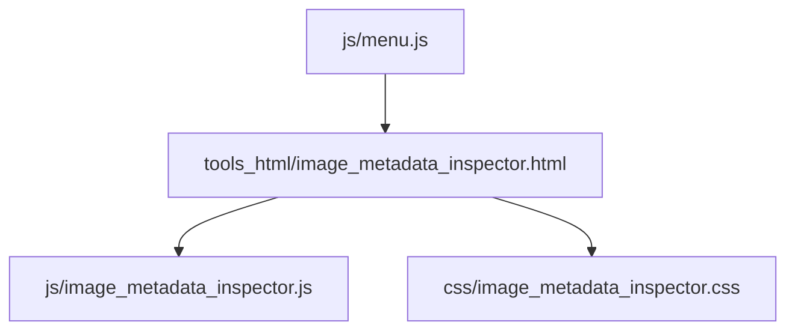
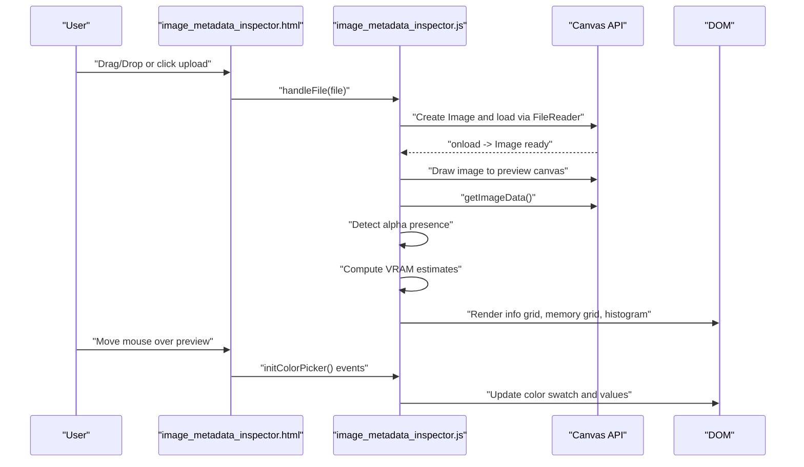
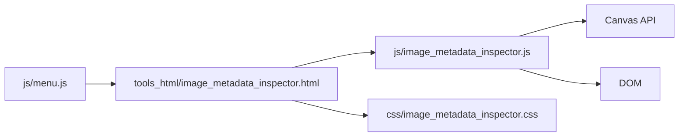

# Image Metadata Inspector

<cite>
**Referenced Files in This Document**
- [image_metadata_inspector.html](file://tools_html/image_metadata_inspector.html)
- [image_metadata_inspector.js](file://js/image_metadata_inspector.js)
- [image_metadata_inspector.css](file://css/image_metadata_inspector.css)
- [menu.js](file://js/menu.js)
</cite>

## Table of Contents
1. [Introduction](#introduction)
2. [Project Structure](#project-structure)
3. [Core Components](#core-components)
4. [Architecture Overview](#architecture-overview)
5. [Detailed Component Analysis](#detailed-component-analysis)
6. [Dependency Analysis](#dependency-analysis)
7. [Performance Considerations](#performance-considerations)
8. [Troubleshooting Guide](#troubleshooting-guide)
9. [Conclusion](#conclusion)
10. [Appendices](#appendices)

## Introduction
The Image Metadata Inspector is a browser-based tool designed to analyze image assets for game development workflows. It extracts and interprets image metadata, performs basic format analysis, estimates VRAM usage under various GPU texture formats, and provides visual diagnostics such as histograms and color picking. The tool focuses on practical asset preparation tasks including:
- Identifying POT/NPOT dimensions
- Detecting transparency channels
- Estimating memory footprint across common GPU texture formats
- Analyzing color distribution and luminance
- Providing quick color sampling for quality assessment

It is integrated into the larger toolkit as a dedicated utility accessible from the main navigation menu.

## Project Structure
The tool consists of a minimal HTML page, a JavaScript controller, and a stylesheet. It is self-contained and does not rely on external libraries beyond the browser’s built-in APIs.

**Diagram sources**
- [image_metadata_inspector.html:1-95](file://tools_html/image_metadata_inspector.html#L1-L95)
- [image_metadata_inspector.js:1-237](file://js/image_metadata_inspector.js#L1-L237)
- [image_metadata_inspector.css:1-251](file://css/image_metadata_inspector.css#L1-L251)
- [menu.js:30-40](file://js/menu.js#L30-L40)

**Section sources**
- [image_metadata_inspector.html:1-95](file://tools_html/image_metadata_inspector.html#L1-L95)
- [image_metadata_inspector.js:1-237](file://js/image_metadata_inspector.js#L1-L237)
- [image_metadata_inspector.css:1-251](file://css/image_metadata_inspector.css#L1-L251)
- [menu.js:30-40](file://js/menu.js#L30-L40)

## Core Components
- Input and Drag-and-Drop Zone: Provides a labeled drop zone and hidden file input to accept images.
- Preview Canvas: Renders the uploaded image and enables interactive color sampling.
- Information Grid: Displays file metadata such as filename, MIME type, dimensions, aspect ratio, megapixels, alpha presence, and modification date.
- Memory Estimate Grid: Shows estimated VRAM usage for several GPU texture formats.
- Histogram Canvas: Computes and renders per-channel and luminance histograms.
- Color Picker: Allows mouse movement over the preview to sample pixel color values and display RGBA and linear RGB components.

Key capabilities:
- File format support: JPG, PNG, BMP, WEBP, GIF (as accepted by the file input).
- Dimension checks: POT/NPOT detection and aspect ratio labeling against common ratios.
- Transparency detection: Scans pixel alpha channel to determine if the image contains translucent pixels.
- VRAM estimation: Computes memory usage for RGBA32 (raw), RGB565, DXT1/BC1, DXT5/BC3, ASTC 4×4, and ETC2 formats.
- Histogram analysis: Builds red, green, blue, and luminance histograms for exposure and contrast insights.
- Color sampling: Real-time crosshair cursor over the preview to show pixel color values.

**Section sources**
- [image_metadata_inspector.html:25-88](file://tools_html/image_metadata_inspector.html#L25-L88)
- [image_metadata_inspector.js:9-89](file://js/image_metadata_inspector.js#L9-L89)
- [image_metadata_inspector.js:91-139](file://js/image_metadata_inspector.js#L91-L139)
- [image_metadata_inspector.js:141-190](file://js/image_metadata_inspector.js#L141-L190)
- [image_metadata_inspector.js:192-231](file://js/image_metadata_inspector.js#L192-L231)
- [image_metadata_inspector.css:69-251](file://css/image_metadata_inspector.css#L69-L251)

## Architecture Overview
The tool follows a straightforward client-side architecture:
- HTML defines the layout and placeholders for dynamic content.
- JavaScript handles file selection, image loading, pixel data extraction, histogram computation, and VRAM estimation.
- CSS styles the UI and ensures responsive layout.

**Diagram sources**
- [image_metadata_inspector.html:25-88](file://tools_html/image_metadata_inspector.html#L25-L88)
- [image_metadata_inspector.js:41-89](file://js/image_metadata_inspector.js#L41-L89)
- [image_metadata_inspector.js:141-190](file://js/image_metadata_inspector.js#L141-L190)
- [image_metadata_inspector.js:192-231](file://js/image_metadata_inspector.js#L192-L231)

## Detailed Component Analysis

### Input and Drop Zone
- Purpose: Accepts image uploads via drag-and-drop or file input.
- Behavior: Adds visual feedback during drag-over, triggers file selection, and delegates to the handler.

Implementation highlights:
- Event listeners for dragover/dragleave/drop and change.
- Uses FileReader to convert the selected file to a data URL for immediate rendering.

**Section sources**
- [image_metadata_inspector.js:9-24](file://js/image_metadata_inspector.js#L9-L24)
- [image_metadata_inspector.html:28-35](file://tools_html/image_metadata_inspector.html#L28-L35)

### File Handling and Image Loading
- Extracts file metadata (name, size, type, lastModified).
- Loads the image into an Image element and draws it onto a preview canvas.
- Captures pixel data for subsequent analysis.

Processing logic:
- On image load, computes width, height, and megapixels.
- Draws the image to a canvas and retrieves ImageData for analysis.

**Section sources**
- [image_metadata_inspector.js:41-89](file://js/image_metadata_inspector.js#L41-L89)
- [image_metadata_inspector.html:38-46](file://tools_html/image_metadata_inspector.html#L38-L46)

### Alpha Channel Detection
- Scans the alpha channel of the captured ImageData to determine if any translucent pixels exist.
- Updates the info grid with a simple “has alpha” indicator.

Algorithm:
- Iterates through every fourth pixel (alpha channel) and sets a flag upon finding any alpha below full opacity.

**Section sources**
- [image_metadata_inspector.js:67-73](file://js/image_metadata_inspector.js#L67-L73)
- [image_metadata_inspector.js:107](file://js/image_metadata_inspector.js#L107)

### VRAM Memory Estimation
- Computes memory usage for multiple GPU texture formats:
  - RGBA32 (raw): width × height × 4 bytes
  - RGB565: width × height × 2 bytes (rounded up)
  - DXT1/BC1: width × height ÷ 2 bytes (rounded up)
  - DXT5/BC3: width × height bytes
  - ASTC 4×4: width × height × 0.89 bytes (rounded up)
  - ETC2: width × height ÷ 2 bytes (rounded up)
- Displays formatted sizes in the memory grid.

Notes:
- These estimates reflect GPU texture memory usage and are useful for asset pipeline decisions.
- Formats like ASTC and ETC2 are approximated; actual compression ratios depend on content and encoder settings.

**Section sources**
- [image_metadata_inspector.js:75-81](file://js/image_metadata_inspector.js#L75-L81)
- [image_metadata_inspector.js:119-129](file://js/image_metadata_inspector.js#L119-L129)

### Aspect Ratio and POT/NPOT Checks
- Calculates GCD to reduce width/height to simplest form and displays the aspect ratio.
- Flags whether width and height are powers-of-two (POT) or not (NPOT).
- Highlights common aspect ratios (1:1, 4:3, 3:2, 16:9, 16:10, 21:9, 2:1, 3:1) against the detected ratio.

**Section sources**
- [image_metadata_inspector.js:32-39](file://js/image_metadata_inspector.js#L32-L39)
- [image_metadata_inspector.js:92-109](file://js/image_metadata_inspector.js#L92-L109)
- [image_metadata_inspector.js:131-139](file://js/image_metadata_inspector.js#L131-L139)

### Histogram Analysis
- Builds four histograms: R, G, B, and Luminance.
- Luminance computed using standard luminance weights.
- Renders a dark-themed chart with semi-transparent overlays for each channel.

Algorithm:
- Initialize arrays for counts per intensity level.
- Iterate through ImageData, incrementing counts for each channel and luminance.
- Normalize by the maximum bin to scale bars proportionally.
- Draw filled polygons for each channel.

**Section sources**
- [image_metadata_inspector.js:141-190](file://js/image_metadata_inspector.js#L141-L190)

### Color Picker and Pixel Sampling
- Enables crosshair cursor over the preview canvas.
- On mousemove, reads the pixel at the cursor position and displays:
  - Position coordinates
  - Hex color
  - RGB values
  - Alpha value and percentage
  - Linear RGB approximation

**Section sources**
- [image_metadata_inspector.js:192-231](file://js/image_metadata_inspector.js#L192-L231)
- [image_metadata_inspector.html:42-46](file://tools_html/image_metadata_inspector.html#L42-L46)

### UI Rendering and Formatting
- Formats file sizes into human-readable units (bytes, KB, MB).
- Renders info grid items and memory grid items dynamically.
- Applies POT/NPOT badges and highlights matching aspect ratios.

**Section sources**
- [image_metadata_inspector.js:26-30](file://js/image_metadata_inspector.js#L26-L30)
- [image_metadata_inspector.js:91-139](file://js/image_metadata_inspector.js#L91-L139)
- [image_metadata_inspector.css:216-251](file://css/image_metadata_inspector.css#L216-L251)

## Dependency Analysis
- Internal dependencies:
  - HTML depends on JS for behavior and CSS for styling.
  - JS relies on the browser’s Canvas API and FileReader.
- External dependencies:
  - None; the tool is self-contained.
- Navigation integration:
  - The tool is linked from the main menu, enabling discovery alongside other utilities.

**Diagram sources**
- [menu.js:30-40](file://js/menu.js#L30-L40)
- [image_metadata_inspector.html:1-95](file://tools_html/image_metadata_inspector.html#L1-L95)
- [image_metadata_inspector.js:1-237](file://js/image_metadata_inspector.js#L1-L237)
- [image_metadata_inspector.css:1-251](file://css/image_metadata_inspector.css#L1-L251)

**Section sources**
- [menu.js:30-40](file://js/menu.js#L30-L40)
- [image_metadata_inspector.html:1-95](file://tools_html/image_metadata_inspector.html#L1-L95)
- [image_metadata_inspector.js:1-237](file://js/image_metadata_inspector.js#L1-L237)
- [image_metadata_inspector.css:1-251](file://css/image_metadata_inspector.css#L1-L251)

## Performance Considerations
- Image decoding and rendering:
  - Large images can cause significant memory usage during decoding and drawing. Consider pre-scaling or warning users about very large files.
- Pixel data scanning:
  - Alpha detection and histogram computation iterate over all pixels. For very large images, these operations may be slow. Consider downsampling for performance-sensitive scenarios.
- Canvas rendering:
  - Drawing large images to a canvas and computing ImageData can be expensive. The preview canvas is sized to the original image; consider limiting preview size for responsiveness.
- VRAM estimation:
  - Estimates are constant-time calculations based on resolution and format assumptions. They are fast but approximate.

[No sources needed since this section provides general guidance]

## Troubleshooting Guide
- No preview appears after upload:
  - Ensure the file is a valid image and not corrupted. Verify the file input accepts the chosen format.
- Alpha detection shows unexpected results:
  - Some images may have premultiplied alpha or unusual alpha patterns. Confirm the image’s transparency mode in an editor.
- Histogram looks flat or empty:
  - Very low-resolution or grayscale images may produce sparse histograms. Try a different image or zoom into a region.
- Color picker shows incorrect values:
  - Ensure the mouse is over the preview canvas and not the swatch area. The swatch itself does not sample pixels.
- POT/NPOT badge is incorrect:
  - Verify the reported width and height in the info grid. Non-standard resolutions may appear as NPOT even if they are powers of two.

**Section sources**
- [image_metadata_inspector.js:41-89](file://js/image_metadata_inspector.js#L41-L89)
- [image_metadata_inspector.js:67-73](file://js/image_metadata_inspector.js#L67-L73)
- [image_metadata_inspector.js:141-190](file://js/image_metadata_inspector.js#L141-L190)
- [image_metadata_inspector.js:192-231](file://js/image_metadata_inspector.js#L192-L231)

## Conclusion
The Image Metadata Inspector provides a focused set of capabilities for analyzing image assets in a browser environment. It excels at quickly assessing dimensions, transparency, and GPU memory implications, and offers visual diagnostics like histograms and color sampling. While it does not extract EXIF metadata or GPS coordinates, it serves as a practical tool for texture optimization, asset validation, and format compatibility checks in game development workflows.

[No sources needed since this section summarizes without analyzing specific files]

## Appendices

### Workflow Examples
- Texture optimization:
  - Upload a diffuse/albedo texture and review VRAM estimates for target platforms. Choose formats accordingly (e.g., ASTC/ETC2 for mobile, DXT/BC for PC).
  - Use the histogram to assess exposure and contrast; adjust source images before compression.
- Asset validation:
  - Check POT/NPOT flags and common aspect ratios to ensure compatibility with target engines and pipelines.
  - Confirm alpha presence for materials requiring translucency.
- Format compatibility:
  - Compare raw vs. compressed memory estimates to balance quality and memory budgets.
  - Use the color picker to verify critical colors and alpha thresholds for masks.

[No sources needed since this section provides general guidance]