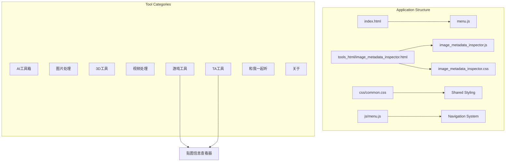
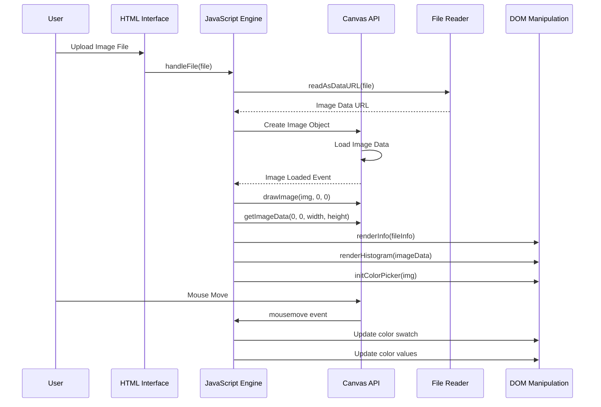
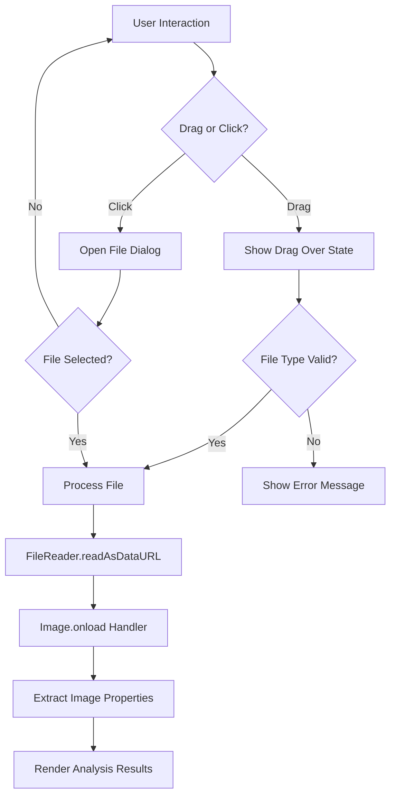
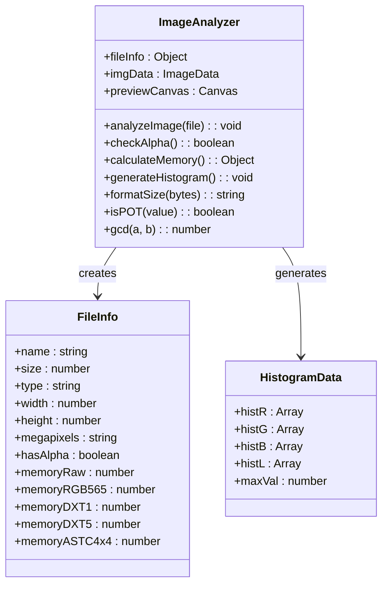
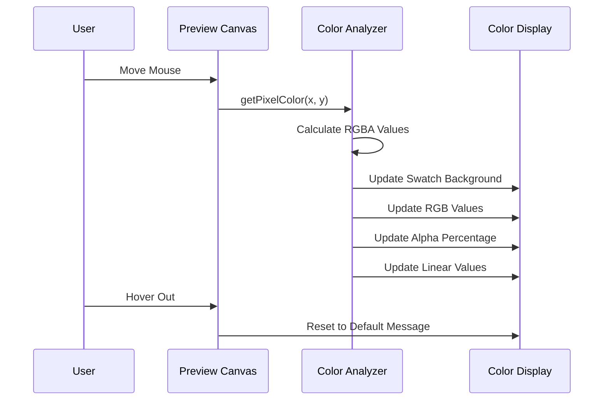
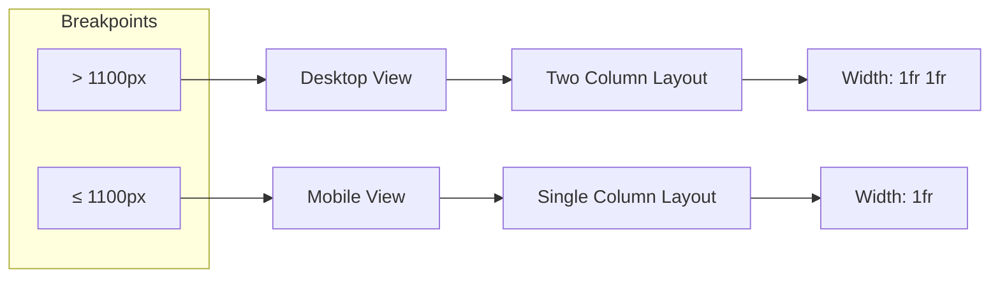
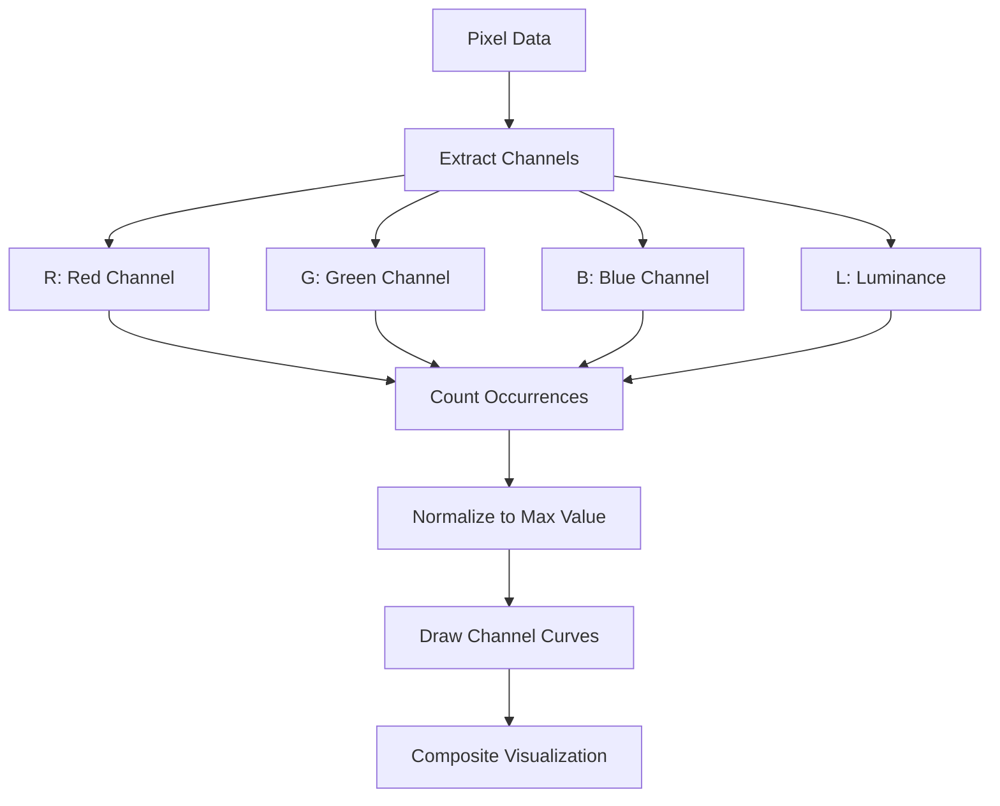
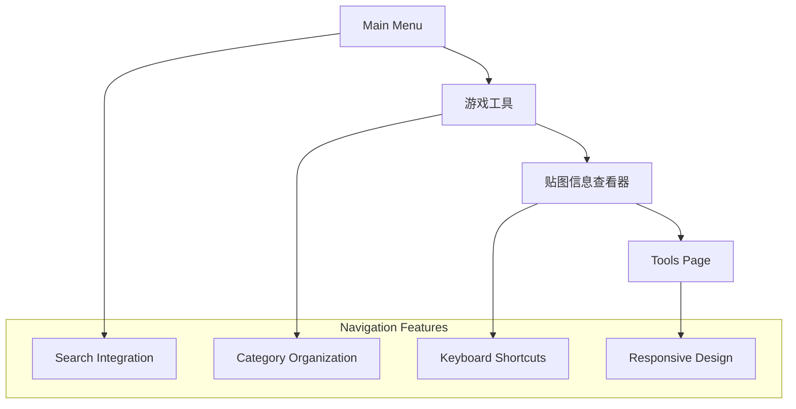
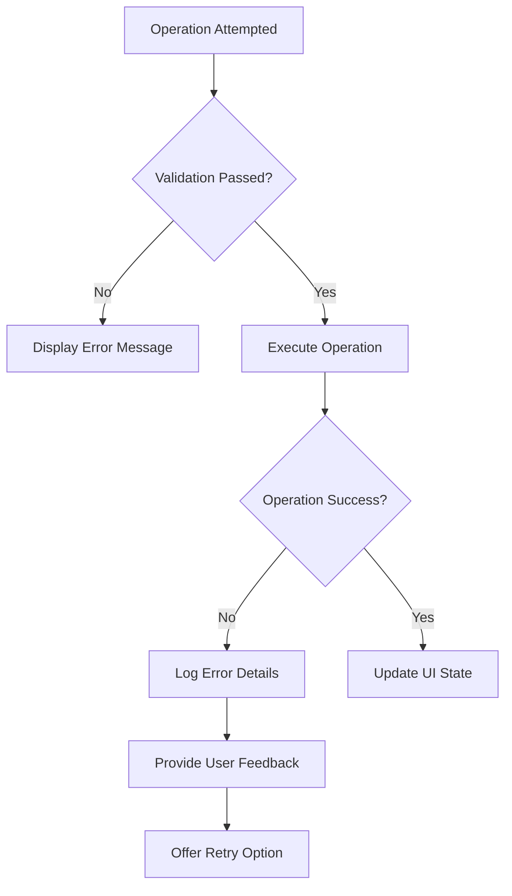

# Image Metadata Inspector

<cite>
**Referenced Files in This Document**
- [image_metadata_inspector.js](file://js/image_metadata_inspector.js)
- [image_metadata_inspector.css](file://css/image_metadata_inspector.css)
- [image_metadata_inspector.html](file://tools_html/image_metadata_inspector.html)
- [common.css](file://css/common.css)
- [menu.js](file://js/menu.js)
- [index.html](file://index.html)
</cite>

## Table of Contents
1. [Introduction](#introduction)
2. [Project Structure](#project-structure)
3. [Core Components](#core-components)
4. [Architecture Overview](#architecture-overview)
5. [Detailed Component Analysis](#detailed-component-analysis)
6. [Feature Implementation](#feature-implementation)
7. [Performance Considerations](#performance-considerations)
8. [User Interface Design](#user-interface-design)
9. [Integration with Tool Ecosystem](#integration-with-tool-ecosystem)
10. [Troubleshooting Guide](#troubleshooting-guide)
11. [Conclusion](#conclusion)

## Introduction

The Image Metadata Inspector is a specialized web-based tool designed for game developers and technical artists to analyze image metadata and properties. This utility provides comprehensive analysis of image files including dimensions, aspect ratios, memory usage estimation, histogram analysis, and real-time color picking capabilities.

The tool serves as part of the larger TA Tool Box ecosystem, specifically targeting the "贴图信息查看器" (Texture Information Inspector) functionality within the "游戏工具" (Game Tools) category. It offers essential insights for texture optimization and asset preparation workflows in game development environments.

## Project Structure

The Image Metadata Inspector follows a modular architecture with clear separation between presentation, logic, and styling components:

**Diagram sources**
- [image_metadata_inspector.html:1-95](file://tools_html/image_metadata_inspector.html#L1-L95)
- [menu.js:2-43](file://js/menu.js#L2-L43)

The tool is organized as a standalone HTML page with embedded JavaScript and CSS, designed to integrate seamlessly with the broader TA Tool Box navigation system.

**Section sources**
- [image_metadata_inspector.html:1-95](file://tools_html/image_metadata_inspector.html#L1-L95)
- [menu.js:2-43](file://js/menu.js#L2-L43)

## Core Components

The Image Metadata Inspector consists of several interconnected components that work together to provide comprehensive image analysis:

### Main Application Container
The primary HTML structure establishes the layout with responsive two-column design, featuring input area on the left and analysis results on the right.

### Interactive Canvas System
A sophisticated canvas-based rendering system handles image preview, histogram generation, and real-time color sampling with crosshair cursor functionality.

### Data Processing Engine
JavaScript-based image analysis engine performs pixel-level operations, memory calculations, and statistical analysis without external dependencies.

### Styling Framework
Custom CSS framework provides consistent theming with gradient backgrounds, glass-morphism cards, and responsive design for various screen sizes.

**Section sources**
- [image_metadata_inspector.html:25-88](file://tools_html/image_metadata_inspector.html#L25-L88)
- [image_metadata_inspector.js:1-237](file://js/image_metadata_inspector.js#L1-L237)

## Architecture Overview

The application follows a client-side architecture pattern with clear separation of concerns:

**Diagram sources**
- [image_metadata_inspector.js:41-89](file://js/image_metadata_inspector.js#L41-L89)
- [image_metadata_inspector.js:192-231](file://js/image_metadata_inspector.js#L192-L231)

The architecture emphasizes client-side processing, eliminating server dependencies while maintaining responsive performance through efficient canvas operations.

**Section sources**
- [image_metadata_inspector.js:1-237](file://js/image_metadata_inspector.js#L1-L237)

## Detailed Component Analysis

### File Upload and Drag-and-Drop System

The upload mechanism implements modern web APIs for seamless file handling:

**Diagram sources**
- [image_metadata_inspector.js:9-24](file://js/image_metadata_inspector.js#L9-L24)
- [image_metadata_inspector.js:41-89](file://js/image_metadata_inspector.js#L41-L89)

The system supports multiple image formats including JPG, PNG, BMP, WEBP, and GIF through the accept attribute configuration.

### Image Analysis Engine

The core analysis engine performs comprehensive pixel-level operations:

**Diagram sources**
- [image_metadata_inspector.js:41-89](file://js/image_metadata_inspector.js#L41-L89)
- [image_metadata_inspector.js:141-190](file://js/image_metadata_inspector.js#L141-L190)

The analyzer extracts metadata including file properties, dimension analysis, aspect ratio calculation, and comprehensive memory footprint estimation across multiple compression formats.

### Real-time Color Picker System

The interactive color picker provides precise pixel-level color analysis:

**Diagram sources**
- [image_metadata_inspector.js:192-231](file://js/image_metadata_inspector.js#L192-L231)

The system calculates color values in multiple formats including hexadecimal, RGB, alpha channel percentage, and linear color space representation.

### Memory Estimation and Compression Analysis

The tool provides comprehensive memory usage analysis across multiple compression formats:

| Format | Description | Memory Calculation |
|--------|-------------|-------------------|
| RGBA32 (原始) | Uncompressed 32-bit RGBA | Width × Height × 4 bytes |
| RGB565 | 16-bit RGB format | Width × Height × 2 bytes |
| DXT1/BC1 | Block compression 1:8 | Width × Height ÷ 8 bytes |
| DXT5/BC3 | Block compression 1:4 | Width × Height bytes |
| ASTC 4×4 | Advanced compression | Width × Height × 0.89 bytes |

**Section sources**
- [image_metadata_inspector.js:75-81](file://js/image_metadata_inspector.js#L75-L81)
- [image_metadata_inspector.js:119-129](file://js/image_metadata_inspector.js#L119-L129)

## Feature Implementation

### Responsive Layout System

The application implements a flexible grid-based layout that adapts to different screen sizes:

**Diagram sources**
- [image_metadata_inspector.css:34-44](file://css/image_metadata_inspector.css#L34-L44)

### Visual Design System

The interface employs a cohesive design language with:

- **Glass-morphism cards**: Semi-transparent backgrounds with blur effects
- **Gradient accents**: Consistent color scheme using CSS custom properties
- **Responsive typography**: Adaptive font sizing and spacing
- **Interactive states**: Hover effects and transition animations

### Color Analysis Visualization

The histogram visualization provides multi-channel analysis:

**Diagram sources**
- [image_metadata_inspector.js:141-190](file://js/image_metadata_inspector.js#L141-L190)

**Section sources**
- [image_metadata_inspector.css:146-191](file://css/image_metadata_inspector.css#L146-L191)
- [image_metadata_inspector.js:141-190](file://js/image_metadata_inspector.js#L141-L190)

## Performance Considerations

### Canvas Optimization Strategies

The application implements several performance optimizations:

- **Efficient pixel access**: Direct array manipulation for optimal speed
- **Memory-efficient histograms**: Pre-allocated arrays with minimal garbage collection
- **Lazy initialization**: Components initialized only when needed
- **Event throttling**: Mouse move events processed efficiently

### Memory Management

Key considerations for large image files:

- **ImageData caching**: Single pixel data extraction reused across analyses
- **Canvas cleanup**: Proper resource management for preview canvases
- **Format detection**: Early exit for unsupported formats
- **Progressive loading**: Asynchronous processing prevents UI blocking

### Browser Compatibility

The implementation targets modern browsers with fallback support for:

- **Canvas API**: Essential for image processing operations
- **FileReader API**: Modern file upload handling
- **CSS Grid**: Flexible layout system with graceful degradation
- **ES5 compatibility**: Robust JavaScript execution across browsers

## User Interface Design

### Navigation Integration

The tool integrates seamlessly with the TA Tool Box navigation system:

**Diagram sources**
- [menu.js:36-36](file://js/menu.js#L36-L36)
- [index.html:12-24](file://index.html#L12-L24)

### Accessibility Features

The interface includes several accessibility enhancements:

- **Keyboard navigation**: Full keyboard support for all interactive elements
- **Screen reader compatibility**: Proper ARIA attributes and semantic markup
- **High contrast mode**: CSS custom properties support theme variations
- **Focus management**: Logical tab order and focus indicators

### Mobile Responsiveness

The design adapts to mobile devices through:

- **Flexible grid system**: Single column layout on smaller screens
- **Touch-friendly controls**: Sufficient touch target sizes
- **Adaptive typography**: Readable text across device sizes
- **Optimized canvas scaling**: Maintains quality on high-DPI displays

**Section sources**
- [image_metadata_inspector.css:22-67](file://css/image_metadata_inspector.css#L22-L67)
- [image_metadata_inspector.html:20-23](file://tools_html/image_metadata_inspector.html#L20-L23)

## Integration with Tool Ecosystem

### Menu System Integration

The Image Metadata Inspector participates in the broader TA Tool Box ecosystem:

| Tool Category | Tool Name | Purpose |
|---------------|-----------|---------|
| Game Tools | 贴图信息查看器 | Texture metadata analysis |
| TA Tools | Shader函数库 | Shader function library |
| TA Tools | GLSL/HLSL转换器 | Shader language conversion |
| TA Tools | UE材质库 | Unreal Engine material reference |
| TA Tools | 物理光照计算器 | Lighting and exposure calculations |
| TA Tools | 色彩空间转换器 | Color space conversions |

### Shared Infrastructure

The tool leverages common infrastructure components:

- **Navigation system**: Consistent menu structure and behavior
- **Search functionality**: Integrated tool discovery across categories
- **Styling framework**: Unified visual design language
- **Responsive layout**: Consistent adaptation across tools

**Section sources**
- [menu.js:2-43](file://js/menu.js#L2-L43)
- [common.css:1-386](file://css/common.css#L1-L386)

## Troubleshooting Guide

### Common Issues and Solutions

#### File Upload Problems
- **Issue**: Images not loading after selection
- **Solution**: Verify browser supports FileReader API and image format is supported
- **Prevention**: Test with JPG, PNG, BMP, WEBP, GIF formats

#### Canvas Rendering Issues
- **Issue**: Blank canvas or distorted images
- **Solution**: Check CORS restrictions and ensure images are properly loaded
- **Debugging**: Verify canvas dimensions and context availability

#### Performance Issues
- **Issue**: Slow analysis on large images
- **Solution**: Consider image resizing or processing limitations
- **Optimization**: Implement progressive loading for very large files

#### Memory Constraints
- **Issue**: Browser crashes with large images
- **Solution**: Limit maximum image size or implement streaming processing
- **Monitoring**: Track memory usage during analysis operations

### Error Handling Patterns

The application implements robust error handling:

**Diagram sources**
- [image_metadata_inspector.js:41-89](file://js/image_metadata_inspector.js#L41-L89)

**Section sources**
- [image_metadata_inspector.js:41-89](file://js/image_metadata_inspector.js#L41-L89)

## Conclusion

The Image Metadata Inspector represents a comprehensive solution for texture analysis in game development workflows. Its modular architecture, responsive design, and extensive feature set make it an invaluable tool for technical artists and developers.

Key strengths include:

- **Comprehensive Analysis**: Multi-faceted image inspection covering metadata, memory usage, and visual characteristics
- **Real-time Interactions**: Live color picking and dynamic visual feedback
- **Performance Optimization**: Efficient canvas-based processing with memory-conscious design
- **Integration Capabilities**: Seamless incorporation into the broader TA Tool Box ecosystem
- **Accessibility Focus**: Thoughtful design considerations for diverse user needs

The tool's client-side architecture ensures privacy and offline functionality while maintaining professional-grade analysis capabilities. Its clean separation of concerns and extensible design provide a solid foundation for future enhancements and additional analysis features.