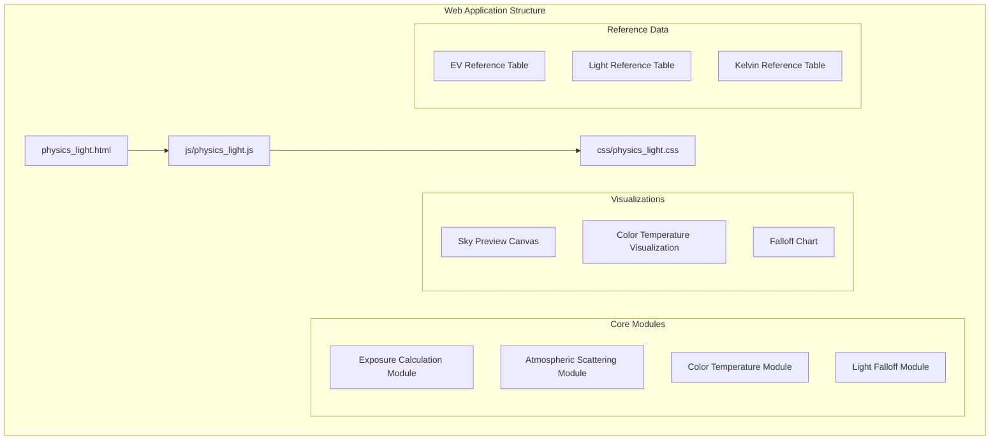
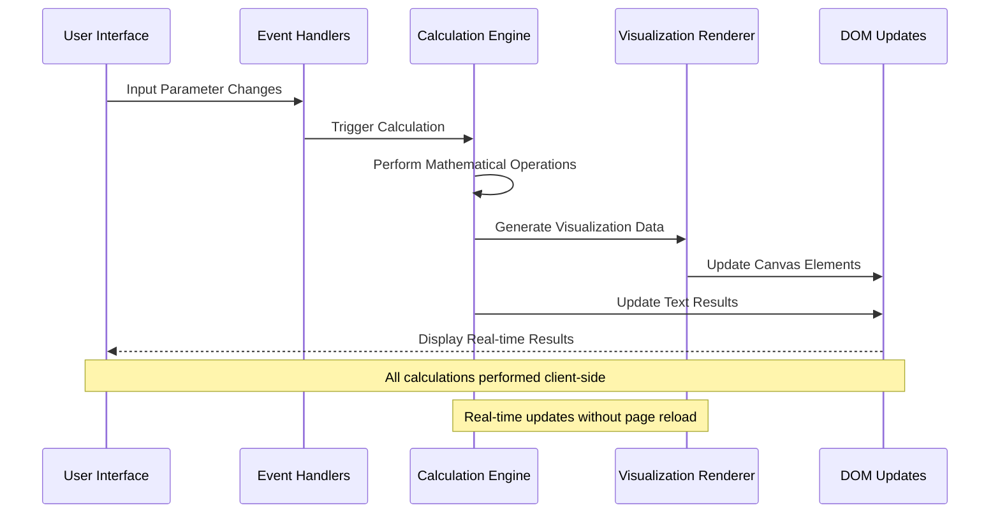
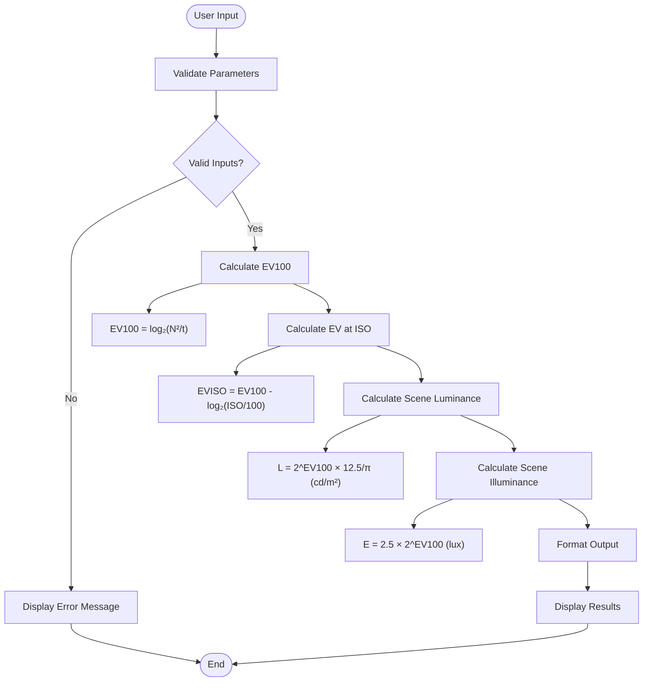
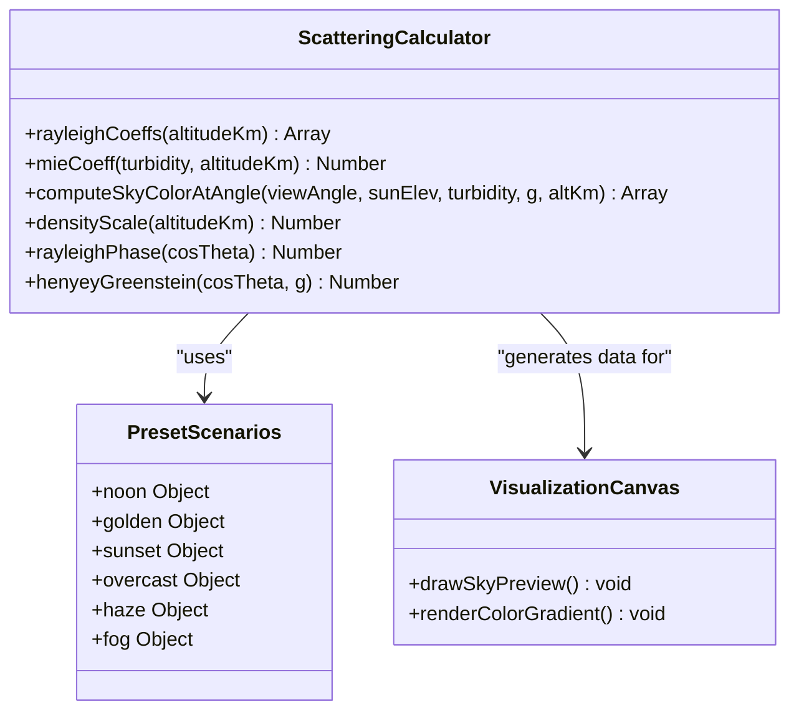
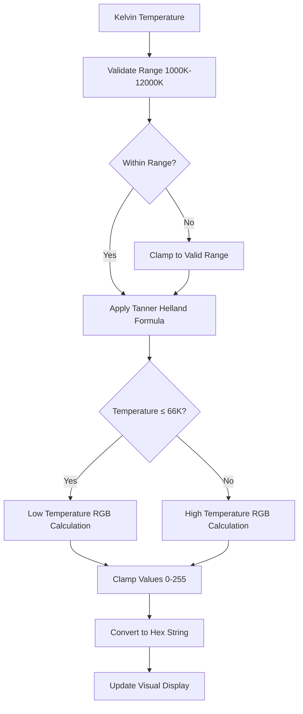
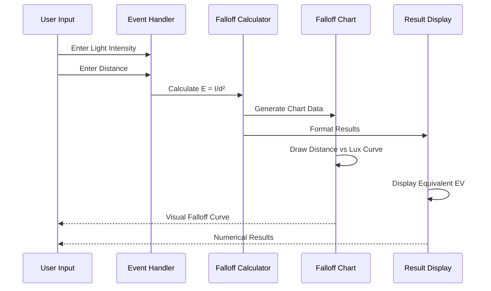
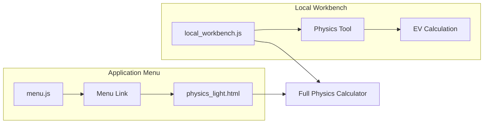

# Physics Lighting Calculator

<cite>
**Referenced Files in This Document**
- [physics_light.js](file://js/physics_light.js)
- [physics_light.html](file://tools_html/physics_light.html)
- [physics_light.css](file://css/physics_light.css)
- [local_workbench.js](file://js/local_workbench.js)
- [menu.js](file://js/menu.js)
</cite>

## Table of Contents
1. [Introduction](#introduction)
2. [Project Structure](#project-structure)
3. [Core Components](#core-components)
4. [Architecture Overview](#architecture-overview)
5. [Detailed Component Analysis](#detailed-component-analysis)
6. [Calculation Methods](#calculation-methods)
7. [Lighting Scenarios and Workflows](#lighting-scenarios-and-workflows)
8. [Integration Points](#integration-points)
9. [Performance Considerations](#performance-considerations)
10. [Troubleshooting Guide](#troubleshooting-guide)
11. [Conclusion](#conclusion)

## Introduction

The Physics Lighting Calculator is a comprehensive web-based tool designed for photographers and cinematographers to calculate exposure values and lighting measurements using real physics principles. This tool provides accurate calculations for EV (Exposure Value) numbers, lux measurements, and f-stop relationships while offering visualizations of atmospheric scattering, color temperature conversion, and light falloff patterns.

The calculator implements fundamental photometric formulas and atmospheric physics models to help professionals achieve consistent exposure across different shooting environments and equipment configurations. It serves as both an educational resource and practical tool for lighting professionals who need precise calculations for various photographic scenarios.

## Project Structure

The Physics Lighting Calculator follows a modular architecture with clear separation between presentation, logic, and styling:



**Diagram sources**
- [physics_light.html:1-151](file://tools_html/physics_light.html#L1-L151)
- [physics_light.js:1-480](file://js/physics_light.js#L1-L480)

**Section sources**
- [physics_light.html:1-151](file://tools_html/physics_light.html#L1-L151)
- [physics_light.css:1-229](file://css/physics_light.css#L1-L229)

## Core Components

The Physics Lighting Calculator consists of four primary calculation modules, each serving specific photometric and lighting purposes:

### Exposure Calculation Module
Computes exposure values using the fundamental exposure triangle relationship between aperture, shutter speed, and ISO sensitivity.

### Atmospheric Scattering Module  
Simulates realistic sky colors based on Rayleigh and Mie scattering physics with customizable parameters for sun angle, turbidity, and altitude.

### Color Temperature Module
Converts between Kelvin color temperatures and RGB color values using accurate approximations for realistic color rendering.

### Light Falloff Module
Calculates light intensity reduction using the inverse square law for point light sources at various distances.

**Section sources**
- [physics_light.js:70-90](file://js/physics_light.js#L70-L90)
- [physics_light.js:92-214](file://js/physics_light.js#L92-L214)
- [physics_light.js:216-275](file://js/physics_light.js#L216-L275)
- [physics_light.js:277-378](file://js/physics_light.js#L277-L378)

## Architecture Overview

The tool employs a client-side JavaScript architecture with real-time visual feedback:



**Diagram sources**
- [physics_light.js:418-472](file://js/physics_light.js#L418-L472)
- [physics_light.html:25-144](file://tools_html/physics_light.html#L25-L144)

The architecture ensures responsive calculations with immediate visual feedback, making it ideal for real-time lighting adjustments and educational purposes.

**Section sources**
- [physics_light.js:464-478](file://js/physics_light.js#L464-L478)
- [physics_light.html:19-145](file://tools_html/physics_light.html#L19-L145)

## Detailed Component Analysis

### Exposure Calculation System

The exposure calculation module implements the fundamental photometric relationships:



**Diagram sources**
- [physics_light.js:71-90](file://js/physics_light.js#L71-L90)

The system calculates four key metrics:
- **EV100**: Base exposure value at ISO 100
- **EV at ISO**: Exposure value adjusted for actual ISO setting
- **Scene Luminance**: Brightness in candelas per square meter
- **Scene Illuminance**: Light intensity in lux

**Section sources**
- [physics_light.js:70-90](file://js/physics_light.js#L70-L90)

### Atmospheric Scattering Simulation

The scattering module implements realistic sky color computation using advanced atmospheric physics:



**Diagram sources**
- [physics_light.js:92-214](file://js/physics_light.js#L92-L214)

The simulation considers:
- **Rayleigh Scattering**: Dominant effect causing blue sky color
- **Mie Scattering**: Caused by larger particles affecting overall brightness
- **Atmospheric Altitude**: Density decreases exponentially with height
- **Sun Angle**: Affects scattering geometry and intensity
- **Turbidity**: Measures atmospheric particle concentration

**Section sources**
- [physics_light.js:92-214](file://js/physics_light.js#L92-L214)

### Color Temperature Conversion

The color temperature module provides accurate RGB conversions:



**Diagram sources**
- [physics_light.js:216-247](file://js/physics_light.js#L216-L247)

**Section sources**
- [physics_light.js:216-275](file://js/physics_light.js#L216-L275)

### Light Falloff Calculation

The falloff module implements the inverse square law for point light sources:



**Diagram sources**
- [physics_light.js:277-378](file://js/physics_light.js#L277-L378)

**Section sources**
- [physics_light.js:277-378](file://js/physics_light.js#L277-L378)

## Calculation Methods

### Exposure Value Formulas

The calculator implements several fundamental photometric equations:

**Basic Exposure Value (EV100)**:
```
EV100 = log₂(N²/t)
```

Where:
- N = f-number (f-stop)
- t = shutter speed in seconds

**ISO-Adjusted Exposure Value**:
```
EVISO = EV100 - log₂(ISO/100)
```

**Scene Luminance Calculation**:
```
L = 2^EV100 × 12.5/π (cd/m²)
```

**Scene Illuminance Calculation**:
```
E = 2.5 × 2^EV100 (lux)
```

### Atmospheric Scattering Physics

The sky color simulation uses:

**Rayleigh Scattering Coefficients**:
```
β_R(altitude) = β_R₀ × exp(-altitude/H_R)
```

**Mie Scattering Coefficient**:
```
β_M = β_M₀ × turbidity × exp(-altitude/H_M)
```

**Phase Functions**:
- Rayleigh phase: P_R(θ) = 3/4(1 + cos²θ)
- Henyey-Greenstein phase: P_HG(θ,g) = (1-g²)/[4π(1+g²-2gcosθ)^(3/2)]

### Color Temperature Conversion

Uses Tanner Helland's approximation for accurate RGB conversion across the visible spectrum.

**Section sources**
- [physics_light.js:70-90](file://js/physics_light.js#L70-L90)
- [physics_light.js:92-214](file://js/physics_light.js#L92-L214)
- [physics_light.js:216-275](file://js/physics_light.js#L216-L275)

## Lighting Scenarios and Workflows

### Portrait Photography Workflow

For indoor portrait photography with soft lighting:

1. **Determine Target Exposure**: Use the EV reference table to identify desired scene EV
2. **Set Aperture**: Choose f/2.8-f/5.6 for background blur vs sharpness balance
3. **Adjust ISO**: Start at ISO 800-1600 for indoor conditions
4. **Calculate Shutter Speed**: Use the exposure calculator to find optimal shutter speed
5. **Verify Lighting Ratio**: Ensure proper subject-to-background ratio

### Product Photography Setup

For commercial product shots requiring maximum detail:

1. **Control Light Falloff**: Position lights at calculated distances using the falloff chart
2. **Achieve Even Illumination**: Use diffusers to reduce shadows while maintaining contrast
3. **Set Camera Parameters**: Use f/8-11 for maximum sharpness across the frame
4. **Monitor Exposure**: Adjust ISO to prevent clipping highlights on reflective surfaces

### Exterior Scene Management

For challenging outdoor conditions:

1. **Evaluate Atmospheric Conditions**: Use preset scenarios for different weather conditions
2. **Calculate Proper Exposure**: Account for sun angle and turbidity effects
3. **Manage Dynamic Range**: Use graduated neutral density filters when needed
4. **Verify Color Temperature**: Ensure proper white balance for the given lighting conditions

**Section sources**
- [physics_light.js:17-24](file://js/physics_light.js#L17-L24)
- [physics_light.js:26-38](file://js/physics_light.js#L26-L38)
- [physics_light.js:52-68](file://js/physics_light.js#L52-L68)

## Integration Points

### Menu Integration

The tool integrates seamlessly with the main application menu system:



**Diagram sources**
- [menu.js:33](file://js/menu.js#L33)
- [local_workbench.js:65-84](file://js/local_workbench.js#L65-L84)

### Cross-Platform Compatibility

The tool maintains compatibility with:
- **Mobile Devices**: Responsive design adapts to smaller screens
- **Desktop Browsers**: Full feature support with keyboard shortcuts
- **Touch Interfaces**: Optimized touch controls for tablets and mobile devices
- **Accessibility**: Screen reader support and keyboard navigation

**Section sources**
- [physics_light.css:224-229](file://css/physics_light.css#L224-L229)
- [menu.js:33](file://js/menu.js#L33)
- [local_workbench.js:65-84](file://js/local_workbench.js#L65-L84)

## Performance Considerations

### Client-Side Optimization

The calculator is optimized for real-time performance:

- **Efficient Mathematical Operations**: Uses native JavaScript math functions
- **Canvas Rendering**: Optimized drawing routines for smooth animations
- **Event Debouncing**: Prevents excessive recalculations during rapid input changes
- **Memory Management**: Minimal memory footprint with efficient variable reuse

### Computational Complexity

- **Exposure Calculations**: O(1) operations with constant time complexity
- **Sky Rendering**: O(h) where h is canvas height (typically ~240 pixels)
- **Color Conversions**: O(1) operations for temperature to RGB conversion
- **Chart Generation**: O(n) where n is number of plotted points (typically ~600)

### Browser Compatibility

The tool maintains compatibility across modern browsers while avoiding heavy dependencies that could impact performance.

## Troubleshooting Guide

### Common Calculation Issues

**Invalid Parameter Errors**: Occur when input values are negative or zero
- Verify all inputs are positive numbers
- Check that f-stop values are within acceptable ranges (1-64)
- Ensure shutter speeds are reasonable (0.00001-30 seconds)
- Confirm ISO values are within supported range (50-102400)

**Unexpected Results**: May indicate incorrect assumptions about lighting conditions
- Review atmospheric preset selections
- Verify color temperature inputs match intended light sources
- Check distance measurements for light falloff calculations

### Visual Display Problems

**Canvas Rendering Issues**: 
- Ensure browser supports HTML5 Canvas API
- Check for WebGL compatibility if experiencing performance issues
- Verify adequate system resources for real-time rendering

**Layout Problems**:
- Confirm responsive breakpoints are functioning correctly
- Check CSS loading order and specificity conflicts
- Verify viewport meta tag is properly configured

### Performance Optimization

**Slow Calculations**:
- Reduce canvas resolution for older devices
- Disable unnecessary visualizations during intensive calculations
- Close other browser tabs to free up system resources

**Memory Leaks**:
- Monitor for event listener accumulation
- Ensure proper cleanup of canvas contexts
- Verify timer and interval cleanup

**Section sources**
- [physics_light.js:75-78](file://js/physics_light.js#L75-L78)
- [physics_light.js:279-283](file://js/physics_light.js#L279-L283)

## Conclusion

The Physics Lighting Calculator provides a comprehensive solution for professional lighting calculations, combining mathematical precision with intuitive visual feedback. Its modular architecture allows users to understand the relationships between exposure parameters while providing practical tools for real-world photography and cinematography applications.

The tool's strength lies in its ability to bridge theoretical photometry with practical application, enabling users to make informed decisions about camera settings, lighting ratios, and exposure compensation across diverse shooting conditions. The real-time visualizations enhance understanding of complex lighting phenomena while maintaining the computational efficiency necessary for responsive user interaction.

Through its extensive reference tables and scenario presets, the calculator serves both as an educational resource for learning photometric principles and as a practical tool for professional workflow optimization.