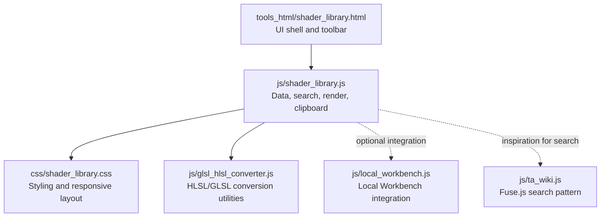
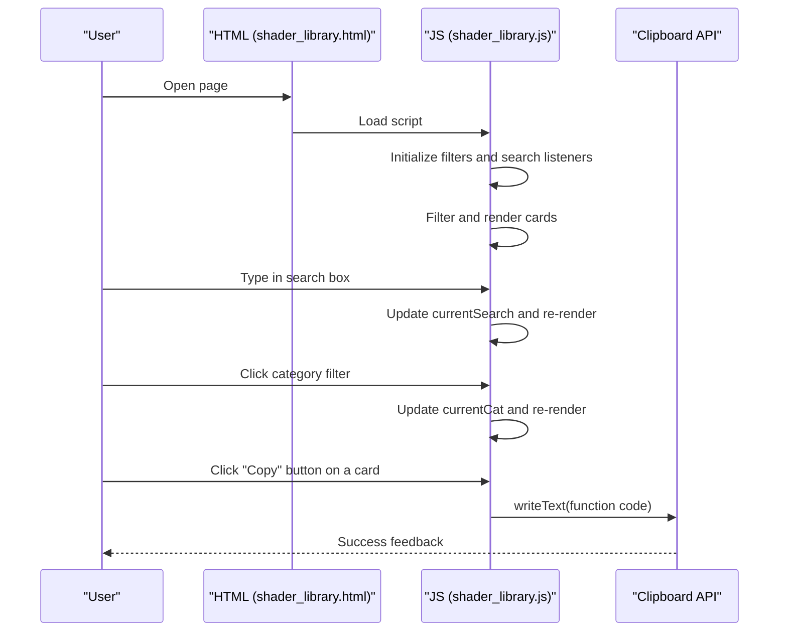
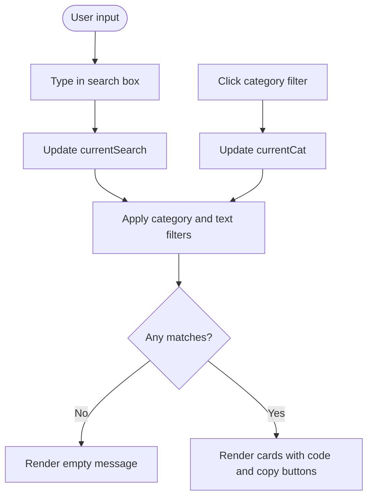
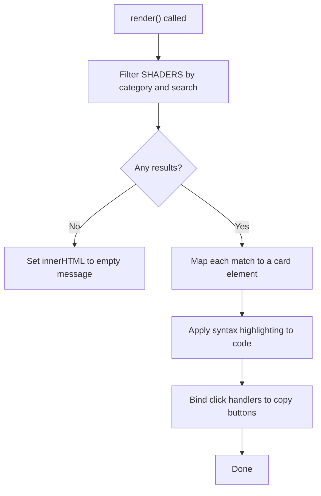
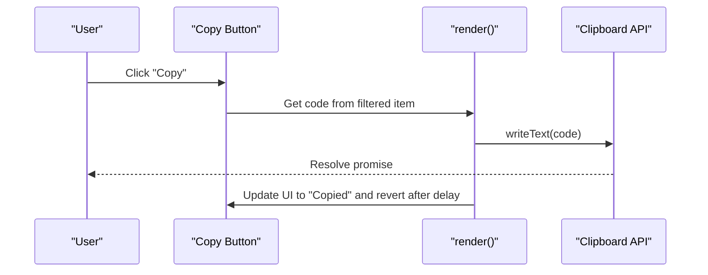
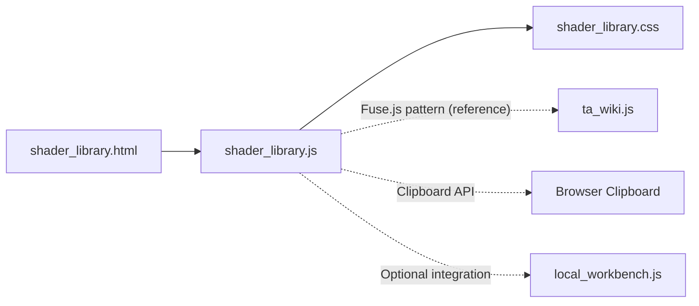

# Shader Function Library

<cite>
**Referenced Files in This Document**
- [shader_library.html](file://tools_html/shader_library.html)
- [shader_library.js](file://js/shader_library.js)
- [shader_library.css](file://css/shader_library.css)
- [glsl_hlsl_converter.js](file://js/glsl_hlsl_converter.js)
- [local_workbench.js](file://js/local_workbench.js)
- [ta_wiki.js](file://js/ta_wiki.js)
</cite>

## Table of Contents
1. [Introduction](#introduction)
2. [Project Structure](#project-structure)
3. [Core Components](#core-components)
4. [Architecture Overview](#architecture-overview)
5. [Detailed Component Analysis](#detailed-component-analysis)
6. [Dependency Analysis](#dependency-analysis)
7. [Performance Considerations](#performance-considerations)
8. [Troubleshooting Guide](#troubleshooting-guide)
9. [Conclusion](#conclusion)
10. [Appendices](#appendices)

## Introduction
The Shader Function Library is a searchable, categorized collection of GLSL fragment and HLSL vertex functions designed for quick discovery and reuse in shader development. It provides:
- A curated set of functions grouped by categories such as color adjustment, math utilities, lighting calculations, and UV/world transformations.
- A fast in-page search and filtering interface.
- Syntax highlighting tailored for HLSL-like shader code.
- One-click copy-to-clipboard functionality for rapid integration into projects.

This document explains how to find relevant functions, adapt them across GLSL/HLSL, and integrate them into game engine shader pipelines. It also covers selection criteria, performance considerations, and extension guidelines.

## Project Structure
The Shader Function Library is implemented as a self-contained web tool with minimal dependencies:
- A single HTML page that hosts the UI and initializes the JavaScript runtime.
- A JavaScript module that defines the function database, rendering logic, search/filtering, and clipboard integration.
- A CSS stylesheet that styles the UI, cards, and syntax-highlighted code blocks.

**Diagram sources**
- [shader_library.html:19-41](file://tools_html/shader_library.html#L19-L41)
- [shader_library.js:629-746](file://js/shader_library.js#L629-L746)
- [shader_library.css:13-221](file://css/shader_library.css#L13-L221)
- [glsl_hlsl_converter.js:220-252](file://js/glsl_hlsl_converter.js#L220-L252)
- [local_workbench.js:95-107](file://js/local_workbench.js#L95-L107)
- [ta_wiki.js:143-151](file://js/ta_wiki.js#L143-L151)

**Section sources**
- [shader_library.html:1-47](file://tools_html/shader_library.html#L1-L47)
- [shader_library.js:1-747](file://js/shader_library.js#L1-L747)
- [shader_library.css:1-221](file://css/shader_library.css#L1-L221)

## Core Components
- Function database: An array of function records containing metadata (name, category, description) and source code.
- Search and filtering: Real-time filtering by category and free-text search across name and description.
- Rendering: Dynamic card generation with syntax-highlighted code blocks and copy buttons.
- Clipboard integration: One-click copying of selected function code via the Clipboard API.

Key implementation references:
- Function database definition and categories: [shader_library.js:6-628](file://js/shader_library.js#L6-L628)
- Search/filter/render loop: [shader_library.js:669-712](file://js/shader_library.js#L669-L712)
- Syntax highlighting rules: [shader_library.js:635-662](file://js/shader_library.js#L635-L662)
- Copy-to-clipboard binding: [shader_library.js:697-711](file://js/shader_library.js#L697-L711)
- UI scaffolding and toolbar: [shader_library.html:19-41](file://tools_html/shader_library.html#L19-L41)
- Styling and responsive layout: [shader_library.css:13-221](file://css/shader_library.css#L13-L221)

**Section sources**
- [shader_library.js:6-712](file://js/shader_library.js#L6-L712)
- [shader_library.html:19-41](file://tools_html/shader_library.html#L19-L41)
- [shader_library.css:13-221](file://css/shader_library.css#L13-L221)

## Architecture Overview
The tool follows a client-side architecture:
- HTML provides the DOM structure and toolbar.
- JavaScript initializes state, binds events, renders cards, and handles clipboard operations.
- CSS provides styling and responsive behavior.

**Diagram sources**
- [shader_library.html:25-41](file://tools_html/shader_library.html#L25-L41)
- [shader_library.js:721-739](file://js/shader_library.js#L721-L739)
- [shader_library.js:697-711](file://js/shader_library.js#L697-L711)

## Detailed Component Analysis

### Function Database and Categories
The function database is a flat array of records. Each record includes:
- name: Human-readable function identifier.
- category: One of color, math, lighting, uv.
- desc: Short description of purpose and parameters.
- code: Complete function signature and body.

Categories and representative functions:
- Color: Desaturate, AdjustSaturation, AdjustContrast, AdjustBrightness, RGBToHSV, HSVToRGB, RGBToLinear, LinearToRGB, HueShift, WhiteBalance, BlendOverlay, BlendSoftLight, ACESToneMapping, Uncharted2ToneMapping, Luminance.
- Math: Remap, InverseLerp, SmootherstepCustom, RotateVector2D, RotationMatrix3D, Hash21, Hash31, ValueNoise2D, GradientNoise2D, VoronoiNoise, FBM, SphereSDF, BoxSDF, CapsuleSDF, EaseInOutCubic.
- Lighting: FresnelSchlick, FresnelSchlickRoughness, LambertDiffuse, BlinnPhong, DistributionGGX, GeometrySchlickGGX, GeometrySmith, CookTorranceBRDF, SubsurfaceScattering, HalfLambert.
- UV and Position: RotateUV, TilingOffset, ParallaxMapping, TriplanarMapping, ReconstructWorldPos, ScreenToUV, PolarCoordinates, SphericalUV, FlowMapUV.

Selection criteria:
- Choose by category to narrow scope.
- Use search to locate functions by name or intent described in the summary.
- Review the function’s description for parameter semantics and typical usage.

Integration tips:
- Many functions are written in HLSL-like syntax and can be adapted to GLSL by adjusting types and built-ins (see HLSL/GLSL adaptation section).

**Section sources**
- [shader_library.js:6-628](file://js/shader_library.js#L6-L628)

### Search and Filtering
The search and filtering mechanism:
- Maintains currentCat and currentSearch state.
- Filters by category when a filter button is clicked.
- Filters by substring match against name and description (case-insensitive).
- Updates the count and renders matching cards.

**Diagram sources**
- [shader_library.js:669-712](file://js/shader_library.js#L669-L712)
- [shader_library.js:729-736](file://js/shader_library.js#L729-L736)

**Section sources**
- [shader_library.js:669-739](file://js/shader_library.js#L669-L739)

### Rendering and Syntax Highlighting
Rendering pipeline:
- Build filtered list from SHADERS.
- For each match, create a card with name, category tag, description, and a syntax-highlighted code block.
- Attach click handlers to “Copy” buttons.

Syntax highlighting rules target HLSL-like constructs:
- Types: float, half, int, uint, bool, vector/matrix types, textures, samplers.
- Keywords: control flow, storage qualifiers, and common HLSL keywords.
- Built-ins: common math and texture sampling functions.

**Diagram sources**
- [shader_library.js:669-712](file://js/shader_library.js#L669-L712)
- [shader_library.js:635-662](file://js/shader_library.js#L635-L662)

**Section sources**
- [shader_library.js:635-712](file://js/shader_library.js#L635-L712)
- [shader_library.css:178-203](file://css/shader_library.css#L178-L203)

### Copy-to-Clipboard Workflow
Each card displays a “Copy” button. On click:
- Retrieve the function code from the filtered list.
- Write to clipboard using the Clipboard API.
- Temporarily change button text and style to indicate success.

**Diagram sources**
- [shader_library.js:697-711](file://js/shader_library.js#L697-L711)

**Section sources**
- [shader_library.js:697-711](file://js/shader_library.js#L697-L711)

### HLSL/GLSL Adaptation Guidelines
While most functions are written in HLSL-like syntax, they can be adapted to GLSL with attention to:
- Types: float2/3/4 vs vec2/3/4; sampler2D vs sampler2D; matrix types differ.
- Built-ins: mix vs lerp; fract vs frac; fmod vs mod; inversesqrt vs inversesqrt; atan vs atan2; dFdx/dFdy vs dFdx/dFdy; texture vs texture2D; gl_FragCoord vs gl_FragCoord.
- Semantics: varyings/in/out qualifiers and interpolation vary by platform.

Reference implementation patterns:
- HLSL to GLSL conversion logic and notes are handled in the GLSL-HLSL Converter tool, which demonstrates how to map types, uniforms, and built-ins consistently.

Practical tips:
- Replace HLSL-specific types and built-ins with GLSL equivalents.
- Split Texture+SamplerState pairs into separate Texture and SamplerState declarations in HLSL; in GLSL, use sampler2D.
- Verify semantics for varyings and interpolation when porting between platforms.

**Section sources**
- [glsl_hlsl_converter.js:254-338](file://js/glsl_hlsl_converter.js#L254-L338)
- [glsl_hlsl_converter.js:340-419](file://js/glsl_hlsl_converter.js#L340-L419)

### Common Shader Patterns and Examples
Below are typical patterns present in the library and how to use them:

- Noise functions
  - ValueNoise2D, GradientNoise2D, VoronoiNoise, FBM
  - Use for procedural textures, animation, or masking
  - Consider octave count and amplitude for desired roughness

- Lighting calculations
  - LambertDiffuse, BlinnPhong, FresnelSchlick, DistributionGGX, GeometrySchlickGGX, GeometrySmith, CookTorranceBRDF
  - Combine diffuse and specular terms; adjust roughness and metallic parameters
  - For energy conservation, ensure proper weighting of dielectric vs metallic contributions

- Texture sampling and UV manipulation
  - TilingOffset, RotateUV, PolarCoordinates, SphericalUV, TriplanarMapping, ParallaxMapping
  - Use triplanar mapping for large-scale terrain or non-axis-aligned geometry
  - Use polar coordinates for radial effects or rotation-based animations

Adaptation tips:
- For GLSL, replace HLSL types/built-ins and ensure sampler semantics are correct.
- For vertex shaders, translate fragment-centric functions to vertex attributes and matrices.

**Section sources**
- [shader_library.js:282-357](file://js/shader_library.js#L282-L357)
- [shader_library.js:420-516](file://js/shader_library.js#L420-L516)
- [shader_library.js:542-627](file://js/shader_library.js#L542-L627)

### Integration with Game Engine Shader Pipelines
- Copy the function code from the library and paste into your shader editor or asset pipeline.
- Ensure the function signature matches your engine’s shader model and target platform.
- Integrate supporting uniforms, textures, and samplers as needed.
- For engines that require explicit input/output structures (e.g., HLSL), split Texture+SamplerState pairs and declare appropriate structures.

Optional integration points:
- Local Workbench supports similar copy-to-clipboard behavior for snippets, demonstrating a consistent UX for rapid integration.

**Section sources**
- [local_workbench.js:95-107](file://js/local_workbench.js#L95-L107)

## Dependency Analysis
The Shader Function Library is largely self-contained with no external runtime dependencies. It does not directly import Fuse.js; however, the Fuse.js pattern used elsewhere in the project (e.g., TA Wiki) demonstrates a robust client-side search strategy that could inspire future enhancements.

**Diagram sources**
- [shader_library.html:19-41](file://tools_html/shader_library.html#L19-L41)
- [shader_library.js:629-746](file://js/shader_library.js#L629-L746)
- [shader_library.css:13-221](file://css/shader_library.css#L13-L221)
- [ta_wiki.js:143-151](file://js/ta_wiki.js#L143-L151)
- [local_workbench.js:95-107](file://js/local_workbench.js#L95-L107)

**Section sources**
- [shader_library.js:629-746](file://js/shader_library.js#L629-L746)
- [ta_wiki.js:143-151](file://js/ta_wiki.js#L143-L151)

## Performance Considerations
- Client-side filtering: The current implementation filters a small, curated dataset; performance remains excellent.
- Rendering cost: Each render rebuilds the grid DOM. For larger datasets, consider virtualization or pagination.
- Clipboard operations: Batch operations (e.g., copying multiple functions) may trigger browser permission prompts; keep interactions user-initiated.
- Syntax highlighting: Regex-based highlighting is lightweight but can be optimized by caching compiled patterns or limiting scope.

[No sources needed since this section provides general guidance]

## Troubleshooting Guide
Common issues and resolutions:
- Clipboard permission denied
  - Symptom: Copy action fails silently.
  - Resolution: Ensure the page is served over HTTPS and the user grants clipboard permissions when prompted.
  - Reference: Similar handling exists in the GLSL-HLSL Converter tool.
- No results found
  - Symptom: Empty state appears after filtering.
  - Resolution: Try broader search terms or reset filters.
- Function not suitable for target platform
  - Symptom: Compilation errors due to type or built-in mismatches.
  - Resolution: Adapt types and built-ins to the target shading language (see HLSL/GLSL adaptation section).

**Section sources**
- [glsl_hlsl_converter.js:222-227](file://js/glsl_hlsl_converter.js#L222-L227)
- [shader_library.js:678-683](file://js/shader_library.js#L678-L683)

## Conclusion
The Shader Function Library offers a practical, searchable catalog of shader functions with a clean UI and efficient copy-to-clipboard workflow. By leveraging categories and free-text search, developers can quickly locate reusable patterns for color, math, lighting, and UV manipulations. With careful adaptation to HLSL/GLSL conventions and platform-specific semantics, these functions integrate smoothly into modern shader pipelines.

[No sources needed since this section summarizes without analyzing specific files]

## Appendices

### A. Function Selection Criteria
- Purpose-first: Select by category to focus on domain (color, math, lighting, UV).
- Intent-driven: Use search to find functions by name or description keywords.
- Parameter awareness: Review descriptions for parameter ranges and expected inputs.
- Platform fit: Confirm types and built-ins match the target shading language.

**Section sources**
- [shader_library.js:669-712](file://js/shader_library.js#L669-L712)

### B. Extending the Library with Custom Functions
Steps to add new functions:
- Define a new record in the SHADERS array with name, category, desc, and code.
- Choose an appropriate category (color, math, lighting, uv).
- Keep code concise and well-commented; include parameter semantics in desc.
- Test rendering and copy behavior by opening the page locally.
- Optionally add syntax highlighting tokens if introducing new HLSL-like constructs.

Guidelines:
- Prefer HLSL-like syntax for consistency with existing entries.
- Include short, descriptive summaries to aid searchability.
- Avoid platform-specific assumptions; keep adaptations explicit during integration.

**Section sources**
- [shader_library.js:6-628](file://js/shader_library.js#L6-L628)
- [shader_library.js:635-662](file://js/shader_library.js#L635-L662)