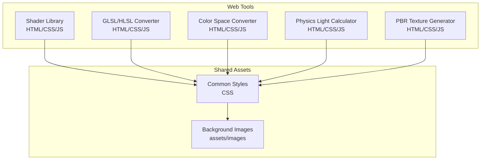
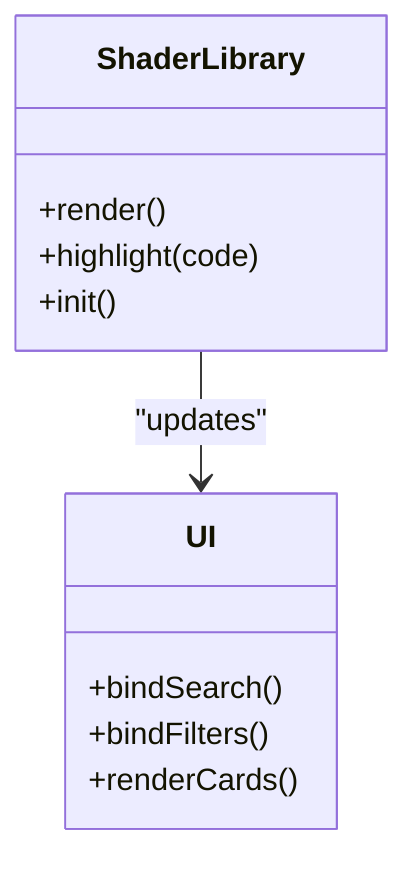
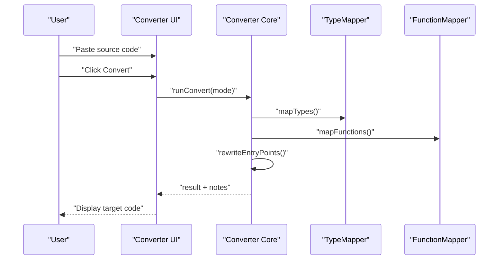
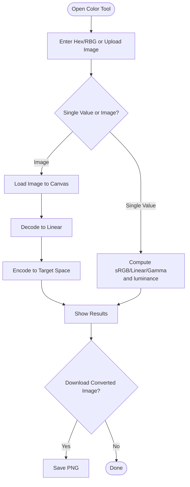
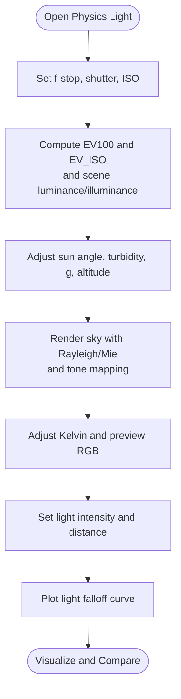
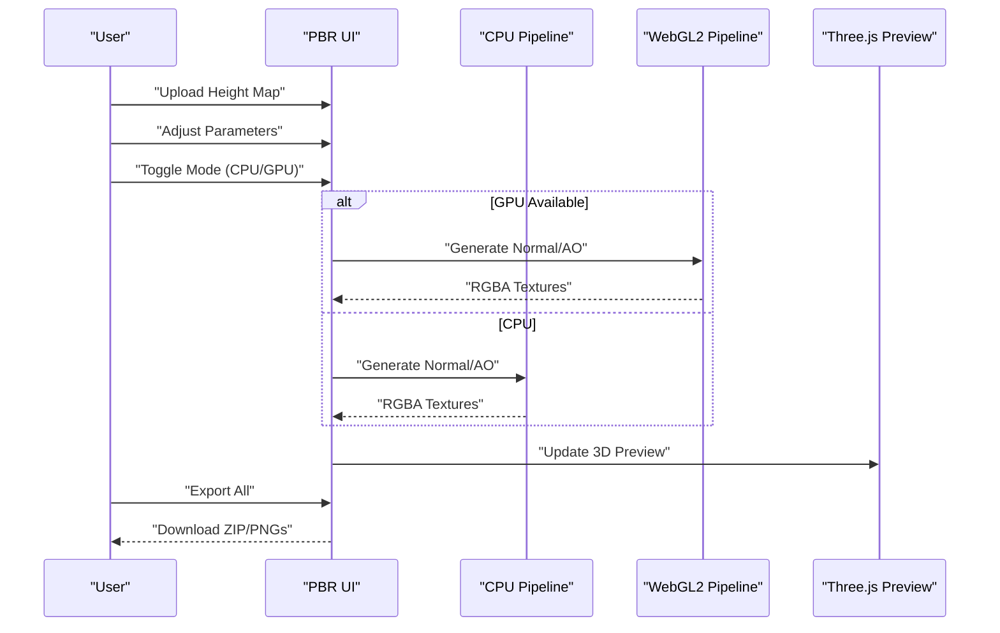
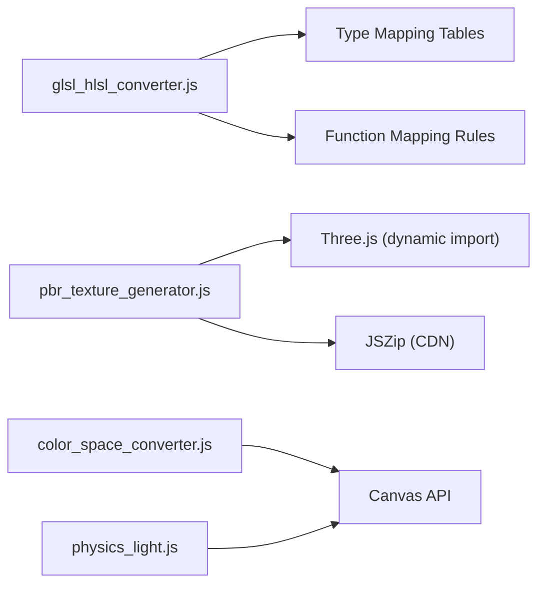

# Technical Artist Utilities

<cite>
**Referenced Files in This Document**
- [shader_library.js](file://js/shader_library.js)
- [shader_library.html](file://tools_html/shader_library.html)
- [shader_library.css](file://css/shader_library.css)
- [glsl_hlsl_converter.js](file://js/glsl_hlsl_converter.js)
- [glsl_hlsl_converter.html](file://tools_html/glsl_hlsl_converter.html)
- [glsl_hlsl_converter.css](file://css/glsl_hlsl_converter.css)
- [color_space_converter.js](file://js/color_space_converter.js)
- [color_space_converter.html](file://tools_html/color_space_converter.html)
- [color_space_converter.css](file://css/color_space_converter.css)
- [physics_light.js](file://js/physics_light.js)
- [physics_light.html](file://tools_html/physics_light.html)
- [physics_light.css](file://css/physics_light.css)
- [pbr_texture_generator.js](file://js/pbr_texture_generator.js)
- [pbr_texture_generator.html](file://tools_html/pbr_texture_generator.html)
- [pbr_texture_generator.css](file://css/pbr_texture_generator.css)
</cite>

## Table of Contents
1. [Introduction](#introduction)
2. [Project Structure](#project-structure)
3. [Core Components](#core-components)
4. [Architecture Overview](#architecture-overview)
5. [Detailed Component Analysis](#detailed-component-analysis)
6. [Dependency Analysis](#dependency-analysis)
7. [Performance Considerations](#performance-considerations)
8. [Troubleshooting Guide](#troubleshooting-guide)
9. [Conclusion](#conclusion)
10. [Appendices](#appendices)

## Introduction
This document describes a suite of technical artist utilities designed to accelerate shader development, color management, and lighting calculations. It covers:
- A searchable shader function library with GLSL/HLSL fragments and mathematical/lighting primitives
- A bidirectional GLSL/HLSL converter with automated declarations and function mapping
- Color space conversion utilities for sRGB, linear, and gamma workflows
- Physics-based lighting calculators for exposure, atmospheric scattering, color temperature, and light falloff
- PBR texture generation pipeline supporting CPU/GPU processing, 3D preview, and batch export

These tools integrate seamlessly into web-based workflows and are optimized for quick iteration in game art pipelines.

## Project Structure
The project organizes functionality into modular HTML pages backed by JavaScript utilities and shared CSS styles. Each tool is self-contained with its own UI shell and logic.

**Diagram sources**
- [shader_library.html:1-47](file://tools_html/shader_library.html#L1-L47)
- [glsl_hlsl_converter.html:1-96](file://tools_html/glsl_hlsl_converter.html#L1-L96)
- [color_space_converter.html:1-139](file://tools_html/color_space_converter.html#L1-L139)
- [physics_light.html:1-151](file://tools_html/physics_light.html#L1-L151)
- [pbr_texture_generator.html:1-226](file://tools_html/pbr_texture_generator.html#L1-L226)

**Section sources**
- [shader_library.html:1-47](file://tools_html/shader_library.html#L1-L47)
- [glsl_hlsl_converter.html:1-96](file://tools_html/glsl_hlsl_converter.html#L1-L96)
- [color_space_converter.html:1-139](file://tools_html/color_space_converter.html#L1-L139)
- [physics_light.html:1-151](file://tools_html/physics_light.html#L1-L151)
- [pbr_texture_generator.html:1-226](file://tools_html/pbr_texture_generator.html#L1-L226)

## Core Components
- Shader Function Library: A categorized, searchable catalog of GLSL/HLSL utility functions for color manipulation, math, lighting, and UV transforms. Includes syntax-highlighted cards and one-click copying.
- GLSL/HLSL Converter: Bidirectional translator that maps types, functions, samplers, and entry points between GLSL and HLSL, with notes and statistics.
- Color Space Converter: Interactive single-value and image conversion between sRGB, linear, and gamma spaces, plus visual transfer curves and gamma previews.
- Physics Light Calculator: Exposure triangle, atmospheric scattering (Rayleigh/Mie), color temperature conversion, and light falloff visualization.
- PBR Texture Generator: CPU/GPU pipeline to produce grayscale, normals, displacement, AO, reflection, and glossiness maps; includes 3D preview and ZIP export.

**Section sources**
- [shader_library.js:6-628](file://js/shader_library.js#L6-L628)
- [glsl_hlsl_converter.js:1-579](file://js/glsl_hlsl_converter.js#L1-L579)
- [color_space_converter.js:1-329](file://js/color_space_converter.js#L1-L329)
- [physics_light.js:1-480](file://js/physics_light.js#L1-L480)
- [pbr_texture_generator.js:1-1047](file://js/pbr_texture_generator.js#L1-L1047)

## Architecture Overview
Each tool follows a consistent pattern: HTML page defines layout and controls, CSS provides styling, and JS implements logic and DOM updates. The converter and color tools rely on lightweight client-side computations, while the PBR generator optionally leverages WebGL2 for acceleration.

**Diagram sources**
- [shader_library.html:1-47](file://tools_html/shader_library.html#L1-L47)
- [shader_library.js:1-747](file://js/shader_library.js#L1-L747)
- [shader_library.css:1-221](file://css/shader_library.css#L1-L221)
- [glsl_hlsl_converter.html:1-96](file://tools_html/glsl_hlsl_converter.html#L1-L96)
- [glsl_hlsl_converter.js:1-579](file://js/glsl_hlsl_converter.js#L1-L579)
- [glsl_hlsl_converter.css:1-354](file://css/glsl_hlsl_converter.css#L1-L354)
- [color_space_converter.html:1-139](file://tools_html/color_space_converter.html#L1-L139)
- [color_space_converter.js:1-329](file://js/color_space_converter.js#L1-L329)
- [color_space_converter.css:1-320](file://css/color_space_converter.css#L1-L320)
- [physics_light.html:1-151](file://tools_html/physics_light.html#L1-L151)
- [physics_light.js:1-480](file://js/physics_light.js#L1-L480)
- [physics_light.css:1-229](file://css/physics_light.css#L1-L229)
- [pbr_texture_generator.html:1-226](file://tools_html/pbr_texture_generator.html#L1-L226)
- [pbr_texture_generator.js:1-1047](file://js/pbr_texture_generator.js#L1-L1047)
- [pbr_texture_generator.css:1-488](file://css/pbr_texture_generator.css#L1-L488)

## Detailed Component Analysis

### Shader Function Library
- Purpose: Provide a searchable, categorized catalog of GLSL/HLSL utility functions for color, math, lighting, and UV operations.
- Features:
  - Categories: color adjustments, math utilities, lighting models, UV transforms
  - Search and filter by category
  - Syntax highlighting tailored to HLSL/GLSL
  - One-click copy-to-clipboard for functions
- Implementation highlights:
  - Centralized function database with concise code blocks
  - Client-side filtering and rendering
  - Lightweight DOM manipulation and clipboard API usage

**Diagram sources**
- [shader_library.js:634-747](file://js/shader_library.js#L634-L747)

**Section sources**
- [shader_library.js:6-628](file://js/shader_library.js#L6-L628)
- [shader_library.js:634-747](file://js/shader_library.js#L634-L747)
- [shader_library.html:1-47](file://tools_html/shader_library.html#L1-L47)
- [shader_library.css:1-221](file://css/shader_library.css#L1-L221)

### GLSL/HLSL Converter
- Purpose: Automate bidirectional translation between GLSL and HLSL for common shader patterns.
- Features:
  - Direction toggle: GLSL → HLSL and HLSL → GLSL
  - Type mapping (vec/mat ↔ float series)
  - Function mapping (mix/fract/mod/dFdx/ddx/etc.)
  - Sampler decomposition (Texture2D + SamplerState)
  - Uniform aggregation (cbuffer Globals)
  - Entry-point rewriting and semantic mapping
  - Notes and statistics for each conversion
- Implementation highlights:
  - Regex-based parsing and replacement
  - Structured code generation for HLSL entry/signature
  - Robust fallbacks and warnings for unsupported constructs

**Diagram sources**
- [glsl_hlsl_converter.js:108-252](file://js/glsl_hlsl_converter.js#L108-L252)
- [glsl_hlsl_converter.js:254-579](file://js/glsl_hlsl_converter.js#L254-L579)

**Section sources**
- [glsl_hlsl_converter.js:1-579](file://js/glsl_hlsl_converter.js#L1-L579)
- [glsl_hlsl_converter.html:1-96](file://tools_html/glsl_hlsl_converter.html#L1-L96)
- [glsl_hlsl_converter.css:1-354](file://css/glsl_hlsl_converter.css#L1-L354)

### Color Space Converter
- Purpose: Enable accurate color space conversions and visual comparisons for linear, sRGB, and gamma workflows.
- Features:
  - Single-value conversion (RGB/Hex ↔ sRGB/Linear/Gamma)
  - Transfer curve visualization
  - Gamma preview bar
  - Batch image conversion with selectable source/target spaces and gamma
- Implementation highlights:
  - Accurate sRGB↔linear transforms and luminance computation
  - Canvas-based curve drawing and gamma visualization
  - Pixel-level processing for image conversion

**Diagram sources**
- [color_space_converter.js:117-329](file://js/color_space_converter.js#L117-L329)
- [color_space_converter.html:1-139](file://tools_html/color_space_converter.html#L1-L139)
- [color_space_converter.css:1-320](file://css/color_space_converter.css#L1-L320)

**Section sources**
- [color_space_converter.js:1-329](file://js/color_space_converter.js#L1-L329)
- [color_space_converter.html:1-139](file://tools_html/color_space_converter.html#L1-L139)
- [color_space_converter.css:1-320](file://css/color_space_converter.css#L1-L320)

### Physics Light Calculator
- Purpose: Provide physical lighting parameters and visualizations for realistic scenes.
- Features:
  - Exposure triangle calculation (f-stop, shutter, ISO)
  - Atmospheric scattering (Rayleigh/Mie) with presets and sliders
  - Color temperature to RGB conversion with visual band
  - Light falloff visualization (square inverse law)
- Implementation highlights:
  - Realistic scattering model with optical depth and phase functions
  - Tone mapping and gamma correction for sky preview
  - Interactive charts and reference tables

**Diagram sources**
- [physics_light.js:71-480](file://js/physics_light.js#L71-L480)
- [physics_light.html:1-151](file://tools_html/physics_light.html#L1-L151)
- [physics_light.css:1-229](file://css/physics_light.css#L1-L229)

**Section sources**
- [physics_light.js:1-480](file://js/physics_light.js#L1-L480)
- [physics_light.html:1-151](file://tools_html/physics_light.html#L1-L151)
- [physics_light.css:1-229](file://css/physics_light.css#L1-L229)

### PBR Texture Generator
- Purpose: Generate PBR-ready textures from a grayscale height map using CPU/GPU pipelines.
- Features:
  - CPU and GPU modes (WebGL2)
  - Normal map generation with Sobel/Scharr operators and optional blur
  - AO estimation via box blur difference
  - Displacement map generation via contrast adjustment
  - Reflection and glossiness maps derived from height
  - 3D preview with Three.js and interactive controls
  - Batch export as PNGs or ZIP
- Implementation highlights:
  - WebGL2 shaders for normal and AO passes
  - Float texture support and precise sampling
  - Optional Poisson reconstruction for reverse engineering height from normals

**Diagram sources**
- [pbr_texture_generator.js:261-426](file://js/pbr_texture_generator.js#L261-L426)
- [pbr_texture_generator.js:505-655](file://js/pbr_texture_generator.js#L505-L655)
- [pbr_texture_generator.html:1-226](file://tools_html/pbr_texture_generator.html#L1-L226)
- [pbr_texture_generator.css:1-488](file://css/pbr_texture_generator.css#L1-L488)

**Section sources**
- [pbr_texture_generator.js:1-1047](file://js/pbr_texture_generator.js#L1-L1047)
- [pbr_texture_generator.html:1-226](file://tools_html/pbr_texture_generator.html#L1-L226)
- [pbr_texture_generator.css:1-488](file://css/pbr_texture_generator.css#L1-L488)

## Dependency Analysis
- Internal dependencies:
  - Each tool’s JS module depends on its HTML page and CSS for UI and styling.
  - Converter relies on type and function mapping tables and regex transformations.
  - PBR generator conditionally uses WebGL2 when available; otherwise falls back to CPU.
- External dependencies:
  - PBR generator dynamically loads Three.js and JSZip for 3D preview and export.
- Coupling and cohesion:
  - Tools are loosely coupled; each maintains its own state and UI lifecycle.
  - Shared CSS promotes consistent look-and-feel across tools.

**Diagram sources**
- [glsl_hlsl_converter.js:78-106](file://js/glsl_hlsl_converter.js#L78-L106)
- [pbr_texture_generator.js:505-517](file://js/pbr_texture_generator.js#L505-L517)
- [pbr_texture_generator.js:214-222](file://js/pbr_texture_generator.js#L214-L222)
- [color_space_converter.js:46-114](file://js/color_space_converter.js#L46-L114)
- [physics_light.js:154-214](file://js/physics_light.js#L154-L214)

**Section sources**
- [glsl_hlsl_converter.js:1-579](file://js/glsl_hlsl_converter.js#L1-L579)
- [pbr_texture_generator.js:1-1047](file://js/pbr_texture_generator.js#L1-L1047)
- [color_space_converter.js:1-329](file://js/color_space_converter.js#L1-L329)
- [physics_light.js:1-480](file://js/physics_light.js#L1-L480)

## Performance Considerations
- Converter:
  - Regex-based transformations are efficient for typical shader sizes; very large shaders may benefit from streaming or chunked processing.
- Color Space Converter:
  - Image conversion loops operate per-pixel; large images may impact responsiveness; consider worker threads for heavy workloads.
- Physics Light Calculator:
  - Sky rendering and light falloff charts are computed per pixel/point; caching results for identical inputs can reduce recomputation.
- PBR Texture Generator:
  - GPU mode accelerates normal and AO generation; ensure device supports float textures and WebGL2.
  - CPU mode offers higher quality operators (Scharr) but is slower; adjust blur and contrast parameters to balance speed and fidelity.

[No sources needed since this section provides general guidance]

## Troubleshooting Guide
- Converter:
  - If unexpected output appears, check for unsupported macros or complex semantics; review notes and adjust manually.
  - For multi-render-target outputs, add SV_TargetN semantics after conversion.
- Color Space Converter:
  - If gamma previews appear incorrect, verify gamma value and ensure consistent interpretation across engines.
  - For image conversion artifacts, confirm source color space selection and gamma setting.
- Physics Light Calculator:
  - If sky preview looks unrealistic, adjust sun angle, turbidity, and altitude; verify unit consistency.
  - For light falloff confusion, note that lux and EV scales differ; use the reference table for context.
- PBR Texture Generator:
  - If GPU mode fails, the device lacks WebGL2 or float texture support; switch to CPU mode.
  - For 3D preview issues, reload the page; ensure browser allows dynamic imports.

**Section sources**
- [glsl_hlsl_converter.js:181-252](file://js/glsl_hlsl_converter.js#L181-L252)
- [color_space_converter.js:261-320](file://js/color_space_converter.js#L261-L320)
- [physics_light.js:419-479](file://js/physics_light.js#L419-L479)
- [pbr_texture_generator.js:261-317](file://js/pbr_texture_generator.js#L261-L317)

## Conclusion
These utilities streamline shader authoring, color management, and lighting simulation for technical artists. They emphasize practical workflows—searchable shader libraries, robust language translation, precise color conversions, physically grounded lighting, and efficient PBR texture generation—while remaining portable and engine-agnostic.

[No sources needed since this section summarizes without analyzing specific files]

## Appendices

### Common Shader Patterns and Workflows
- Shader Library:
  - Use color adjustment functions for quick tonal tweaks; blend modes for artistic effects.
  - Apply lighting models (Lambert/Blinn-Phong/IBL) consistently across materials.
  - Utilize UV transforms for procedural tiling and parallax mapping.
- GLSL/HLSL Converter:
  - Prefer fragment-first conversion; verify sampler declarations and cbuffer layout.
  - Manually adjust semantics and register bindings for advanced scenarios.
- Color Management:
  - Store textures in sRGB for display; decode to linear for lighting; encode back for output.
  - Use gamma workflows sparingly; prefer linear for modern engines.
- Lighting Calculations:
  - Compute exposure and scene luminance to guide tone mapping.
  - Tune atmospheric parameters to match desired mood and time-of-day.
- PBR Generation:
  - Choose GPU for speed, CPU for quality; validate normal orientation and AO placement.
  - Export maps with correct channel assignments for target engine.

[No sources needed since this section provides general guidance]