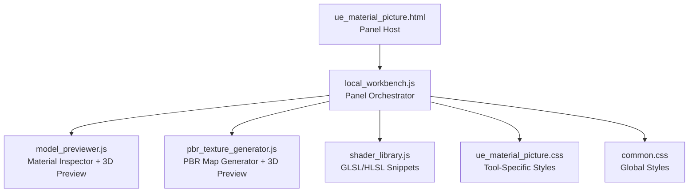
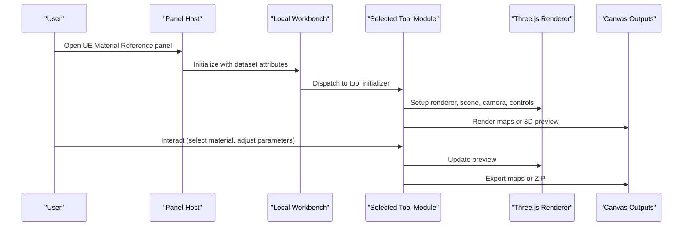
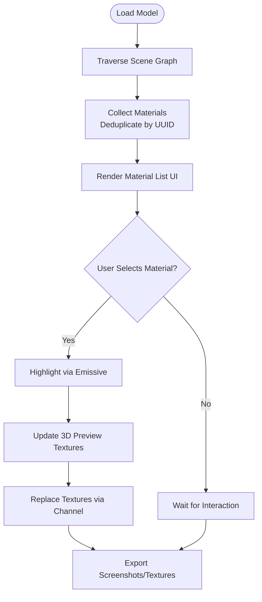
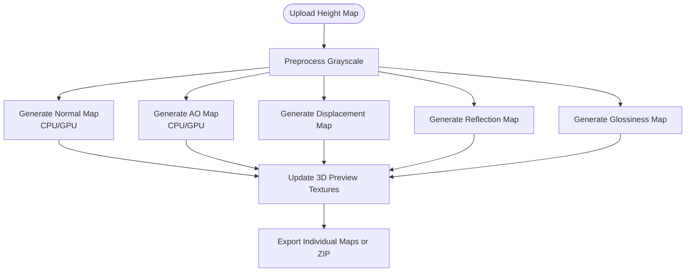
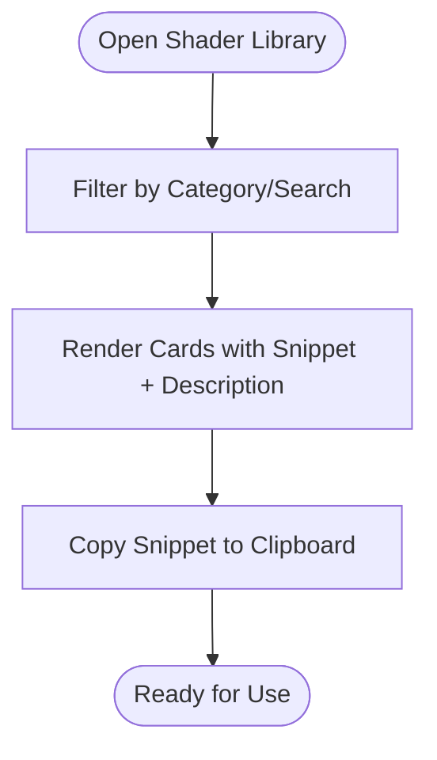
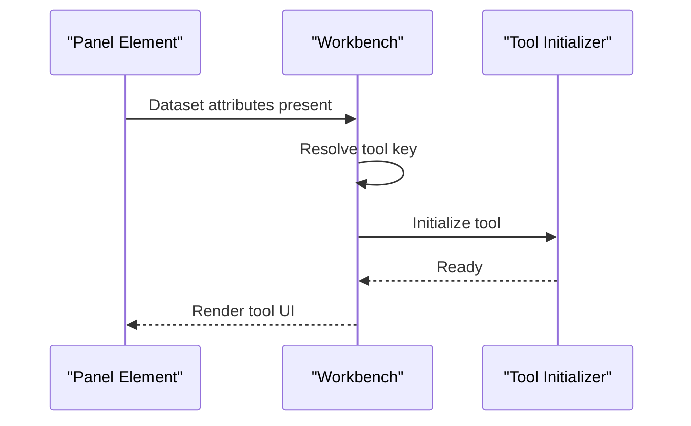
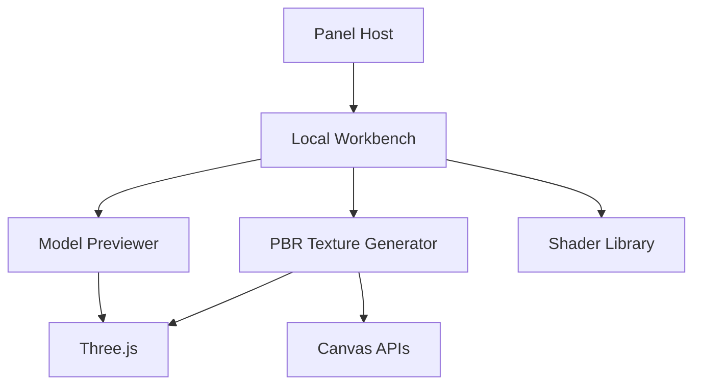

# Unreal Engine Material Reference

<cite>
**Referenced Files in This Document**
- [ue_material_picture.html](file://tools_html/ue_material_picture.html)
- [local_workbench.js](file://js/local_workbench.js)
- [model_previewer.js](file://js/model_previewer.js)
- [pbr_texture_generator.js](file://js/pbr_texture_generator.js)
- [shader_library.js](file://js/shader_library.js)
- [common.css](file://css/common.css)
- [ue_material_picture.css](file://css/ue_material_picture.css)
</cite>

## Table of Contents
1. [Introduction](#introduction)
2. [Project Structure](#project-structure)
3. [Core Components](#core-components)
4. [Architecture Overview](#architecture-overview)
5. [Detailed Component Analysis](#detailed-component-analysis)
6. [Dependency Analysis](#dependency-analysis)
7. [Performance Considerations](#performance-considerations)
8. [Troubleshooting Guide](#troubleshooting-guide)
9. [Conclusion](#conclusion)
10. [Appendices](#appendices)

## Introduction
This document describes the Unreal Engine Material Reference tool integrated into the TA Toolbox. It focuses on the interactive visualization of material node hierarchies, node properties, and connections, and provides a practical workflow for understanding material graph structures, node functionality, and data flow patterns. The toolset includes:
- A model previewer that exposes material properties and enables interactive selection and highlighting.
- A PBR texture generator that produces grayscale, normal, displacement, ambient occlusion, reflection, and glossiness maps, with live 3D preview updates.
- A shader library containing reusable GLSL/HLSL snippets categorized by function families (color, math, lighting, UV/position).
- A local workbench framework that orchestrates tool panels and integrates external resources.

The goal is to help artists and developers quickly grasp material concepts, translate them across engines, and optimize material performance.

## Project Structure
The Unreal Engine Material Reference is implemented as part of the TA Toolbox. The relevant files are organized as follows:
- HTML entry for the UE material tool panel.
- Local workbench script that initializes tool panels and routes to specific tools.
- Model previewer that loads 3D models, enumerates materials, and allows interactive inspection and replacement.
- PBR texture generator that converts grayscale height maps into multiple PBR texture maps and updates a live 3D preview.
- Shader library that catalogs GLSL/HLSL functions and supports search and copy.
- Shared UI styles and a dedicated stylesheet for the UE material tool.

**Diagram sources**
- [ue_material_picture.html:1-27](file://tools_html/ue_material_picture.html#L1-L27)
- [local_workbench.js:170-196](file://js/local_workbench.js#L170-L196)
- [model_previewer.js:56-91](file://js/model_previewer.js#L56-L91)
- [pbr_texture_generator.js:505-617](file://js/pbr_texture_generator.js#L505-L617)
- [shader_library.js:669-746](file://js/shader_library.js#L669-L746)
- [common.css:1-386](file://css/common.css#L1-L386)
- [ue_material_picture.css:1-1](file://css/ue_material_picture.css#L1-L1)

**Section sources**
- [ue_material_picture.html:1-27](file://tools_html/ue_material_picture.html#L1-L27)
- [local_workbench.js:170-196](file://js/local_workbench.js#L170-L196)
- [common.css:1-386](file://css/common.css#L1-L386)

## Core Components
- Panel Host and Workbench
  - The UE material tool is hosted inside a panel element and initialized by the local workbench. The workbench builds a base shell and delegates to tool-specific initializers.
  - The workbench also handles fallback rendering for tools that rely on external pages.

- Model Previewer and Material Inspector
  - Loads 3D models via supported loaders and traverses the scene to collect materials.
  - Builds a material list with swatch color and key properties (metalness, roughness).
  - Highlights selected materials by temporarily adjusting emissive properties.
  - Supports animation playback, wireframe toggles, skeleton helpers, environment presets, and texture replacement.

- PBR Texture Generator
  - Converts grayscale height maps into normal, displacement, AO, reflection, and glossiness maps.
  - Provides CPU and GPU (WebGL2) processing paths for normal and AO generation.
  - Updates a live Three.js preview with generated maps and allows exporting individual canvases or a ZIP bundle.

- Shader Library
  - Maintains a curated catalog of GLSL/HLSL snippets grouped by categories (color, math, lighting, UV/position).
  - Offers search, filtering, syntax-highlighted display, and clipboard copy functionality.

**Section sources**
- [local_workbench.js:32-40](file://js/local_workbench.js#L32-L40)
- [local_workbench.js:170-196](file://js/local_workbench.js#L170-L196)
- [model_previewer.js:349-436](file://js/model_previewer.js#L349-L436)
- [pbr_texture_generator.js:383-426](file://js/pbr_texture_generator.js#L383-L426)
- [pbr_texture_generator.js:505-655](file://js/pbr_texture_generator.js#L505-L655)
- [shader_library.js:669-746](file://js/shader_library.js#L669-L746)

## Architecture Overview
The UE Material Reference tool is composed of a panel-driven architecture:
- The panel host sets the tool identity.
- The workbench resolves the tool and initializes the appropriate module.
- Modules interact with Three.js for 3D visualization and canvas-based rendering for texture maps.
- The shader library provides reusable code snippets for lighting and material computations.

**Diagram sources**
- [ue_material_picture.html:22-22](file://tools_html/ue_material_picture.html#L22-L22)
- [local_workbench.js:170-196](file://js/local_workbench.js#L170-L196)
- [model_previewer.js:56-91](file://js/model_previewer.js#L56-L91)
- [pbr_texture_generator.js:505-655](file://js/pbr_texture_generator.js#L505-L655)

## Detailed Component Analysis

### Model Previewer and Material Inspector
The model previewer provides:
- Model loading and placement with automatic scaling and centering.
- Material enumeration across meshes, deduplicating shared materials by UUID.
- Interactive material list with color swatches and key properties (metalness, roughness).
- Selection highlighting via emissive adjustments.
- Environment presets and HDR loading for realistic viewing.
- Texture replacement pipeline with proper color spaces and flip handling.

**Diagram sources**
- [model_previewer.js:349-436](file://js/model_previewer.js#L349-L436)
- [model_previewer.js:641-656](file://js/model_previewer.js#L641-L656)

**Section sources**
- [model_previewer.js:349-436](file://js/model_previewer.js#L349-L436)
- [model_previewer.js:641-656](file://js/model_previewer.js#L641-L656)

### PBR Texture Generator
The PBR generator:
- Accepts a grayscale height map and generates grayscale, normal, displacement, AO, reflection, and glossiness maps.
- Uses CPU routines for general-purpose operations and WebGL2 shaders for normal and AO computation.
- Updates a live Three.js preview with generated maps and supports export per map or as a ZIP bundle.
- Includes procedural sample generators for common surface types.

**Diagram sources**
- [pbr_texture_generator.js:383-426](file://js/pbr_texture_generator.js#L383-L426)
- [pbr_texture_generator.js:505-655](file://js/pbr_texture_generator.js#L505-L655)
- [pbr_texture_generator.js:658-696](file://js/pbr_texture_generator.js#L658-L696)

**Section sources**
- [pbr_texture_generator.js:383-426](file://js/pbr_texture_generator.js#L383-L426)
- [pbr_texture_generator.js:505-655](file://js/pbr_texture_generator.js#L505-L655)
- [pbr_texture_generator.js:658-696](file://js/pbr_texture_generator.js#L658-L696)

### Shader Library
The shader library:
- Stores categorized GLSL/HLSL snippets (color, math, lighting, UV/position).
- Provides search and filter capabilities with syntax highlighting.
- Copies selected snippets to the clipboard for reuse.

**Diagram sources**
- [shader_library.js:669-746](file://js/shader_library.js#L669-L746)

**Section sources**
- [shader_library.js:669-746](file://js/shader_library.js#L669-L746)

### Local Workbench Integration
The workbench:
- Initializes the panel and selects the tool based on dataset attributes.
- Delegates to tool-specific initializers and falls back to external pages when necessary.
- Manages base DOM construction and tool actions.

**Diagram sources**
- [local_workbench.js:170-196](file://js/local_workbench.js#L170-L196)
- [local_workbench.js:32-40](file://js/local_workbench.js#L32-L40)

**Section sources**
- [local_workbench.js:170-196](file://js/local_workbench.js#L170-L196)
- [local_workbench.js:32-40](file://js/local_workbench.js#L32-L40)

## Dependency Analysis
Key dependencies and relationships:
- The panel host relies on the workbench to initialize tool modules.
- The model previewer depends on Three.js for rendering and material introspection.
- The PBR generator depends on Three.js for 3D preview updates and canvas exports.
- The shader library is self-contained and provides reusable snippets for lighting and material computations.

**Diagram sources**
- [ue_material_picture.html:22-22](file://tools_html/ue_material_picture.html#L22-L22)
- [local_workbench.js:170-196](file://js/local_workbench.js#L170-L196)
- [model_previewer.js:56-91](file://js/model_previewer.js#L56-L91)
- [pbr_texture_generator.js:505-655](file://js/pbr_texture_generator.js#L505-L655)
- [shader_library.js:669-746](file://js/shader_library.js#L669-L746)

**Section sources**
- [local_workbench.js:170-196](file://js/local_workbench.js#L170-L196)
- [model_previewer.js:56-91](file://js/model_previewer.js#L56-L91)
- [pbr_texture_generator.js:505-655](file://js/pbr_texture_generator.js#L505-L655)
- [shader_library.js:669-746](file://js/shader_library.js#L669-L746)

## Performance Considerations
- GPU vs CPU processing:
  - The PBR generator offers GPU acceleration for normal and AO maps using WebGL2 shaders, which can significantly reduce processing time for large images compared to CPU routines.
  - CPU routines remain useful for environments without WebGL2 support or for fine-grained control over algorithms.
- Rendering pipeline:
  - Three.js renderer is configured with sRGB color space and tone mapping suitable for material visualization.
  - PMREM environment generation improves reflection quality under realistic lighting conditions.
- Export optimization:
  - Canvas exports use efficient blob creation and download mechanisms.
  - Batch export as ZIP consolidates multiple maps for streamlined distribution.

[No sources needed since this section provides general guidance]

## Troubleshooting Guide
- WebGL2 initialization failures:
  - The PBR generator checks for WebGL2 availability and float texture support; if unavailable, it falls back to CPU processing paths.
- Missing external resources:
  - The workbench renders a hint when a tool’s script is not loaded, suggesting to refresh the page or check file presence.
- Model loading errors:
  - Unsupported formats produce explicit status messages; supported formats include GLB/GLTF, FBX, and OBJ.
- Environment and background:
  - When using HDR environments, ensure the RGBE loader is available; otherwise, default environment presets are applied.

**Section sources**
- [pbr_texture_generator.js:261-317](file://js/pbr_texture_generator.js#L261-L317)
- [local_workbench.js:52-61](file://js/local_workbench.js#L52-L61)
- [model_previewer.js:196-213](file://js/model_previewer.js#L196-L213)
- [model_previewer.js:476-538](file://js/model_previewer.js#L476-L538)

## Conclusion
The Unreal Engine Material Reference tool integrates a model previewer, a PBR texture generator, and a shader library within a unified panel-driven architecture. It enables interactive exploration of material node hierarchies, real-time property updates, and practical workflows for generating PBR maps and reusing shader snippets. By leveraging Three.js for visualization and canvas-based rendering for texture generation, the tool supports both learning and production tasks in material authoring.

[No sources needed since this section summarizes without analyzing specific files]

## Appendices

### Workflow Examples
- Understanding material graph structures:
  - Load a model, inspect the material list, and click a material to highlight it. Observe how changing metalness and roughness affects the 3D preview.
- Node functionality and data flow:
  - Use the shader library to locate lighting and UV manipulation snippets. Apply them conceptually to Unreal material nodes (e.g., multiply roughness with a scalar node).
- Common setups:
  - PBR materials: Generate grayscale, normal, AO, and metallic/roughness maps; assign them to corresponding material inputs.
  - Procedural textures: Use math and noise snippets to drive UV coordinates or scalars in Unreal material graphs.
  - Post-processing effects: Utilize color and tone-mapping snippets as references for equivalent operations in post-processing materials.

[No sources needed since this section provides general guidance]

### Material Property Mappings and Sampling Modes
- Property mappings:
  - Albedo/Color maps correspond to diffuse/base color inputs.
  - Metallic/Roughness maps map to metallic and roughness channels.
  - Normal maps define surface orientation for lighting calculations.
  - Ambient Occlusion maps modulate indirect lighting intensity.
  - Displacement maps alter geometry for parallax and tessellation-like effects.
  - Emission maps provide self-illumination.
- Texture sampling modes:
  - Clamp vs. Repeat: Choose Repeat for seamless procedural patterns; Clamp for edge softening.
  - Trilinear vs. Anisotropic: Prefer Anisotropic for high-quality detail at distance.
  - Mipmaps: Enable for distance-based quality and performance balance.

[No sources needed since this section provides general guidance]

### Performance Optimization Techniques
- Minimize draw calls by batching materials and merging meshes where feasible.
- Use lower resolution maps for distance objects and higher resolutions for close-ups.
- Prefer GPU-accelerated operations for heavy computations (e.g., normal and AO generation).
- Optimize shader complexity by avoiding redundant operations and using lookup tables for repeated computations.

[No sources needed since this section provides general guidance]

### Translating Concepts Across Engines and Shader Languages
- HLSL/GLSL equivalents:
  - Interpolate and clamp functions map directly between HLSL and GLSL.
  - Vector swizzles and component access are engine-agnostic.
- Node-based graphs:
  - Translate Unreal material nodes to GLSL/HLSL by following the data flow: inputs → math operations → texture sampling → outputs.
- Shader libraries:
  - Use the shader library as a reference for implementing lighting models, UV manipulations, and color transforms consistently across engines.

[No sources needed since this section provides general guidance]