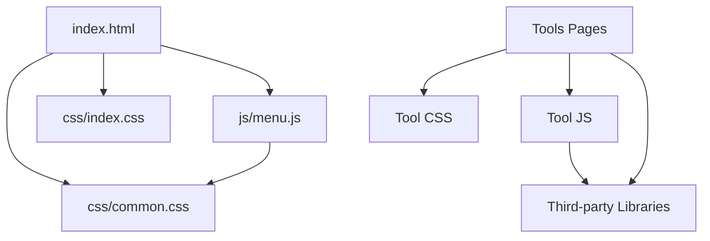
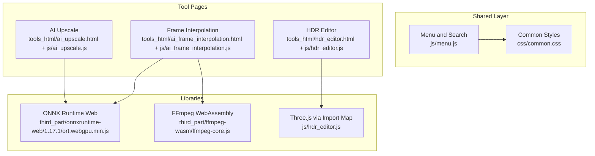
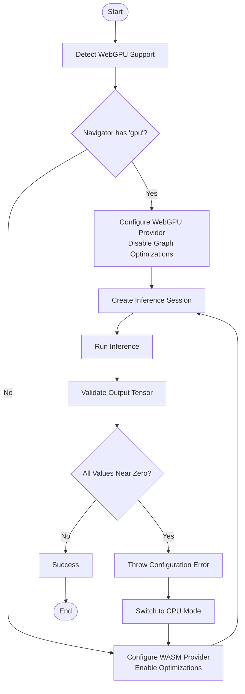
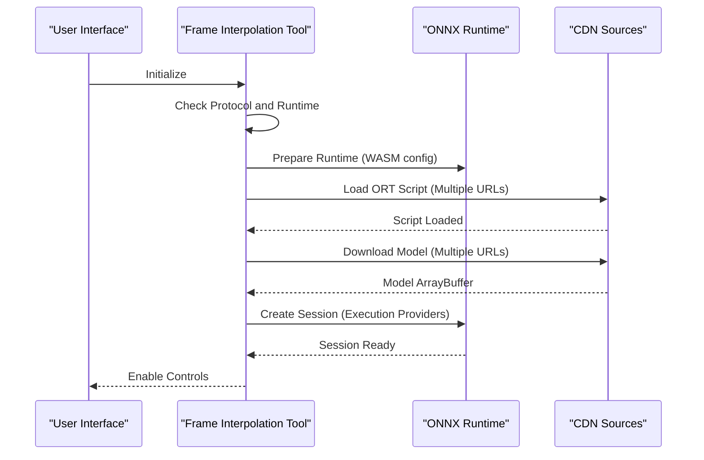
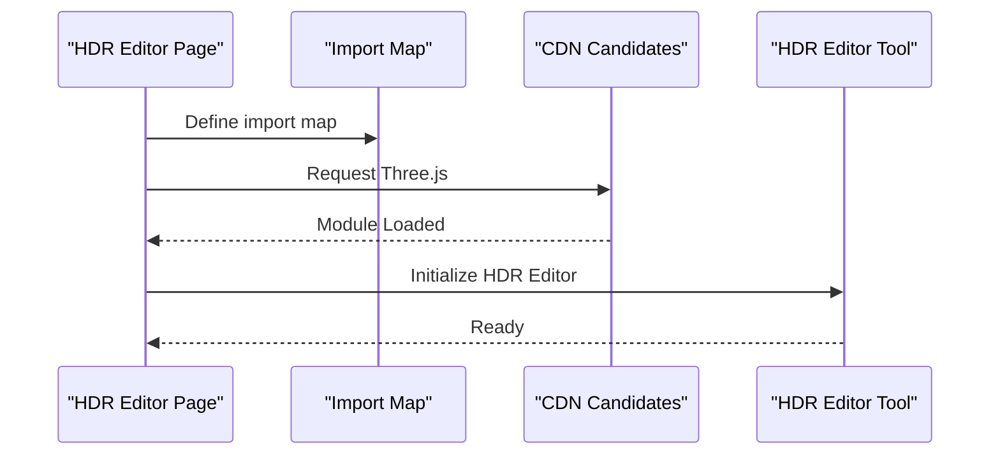
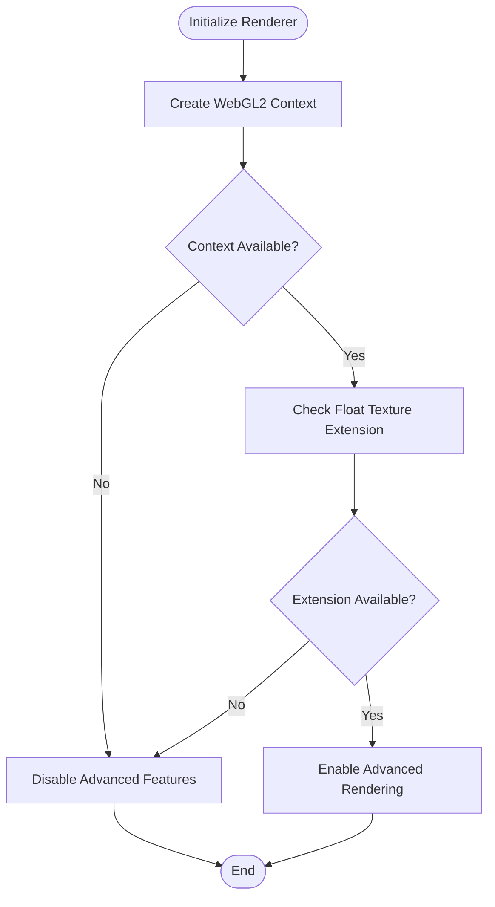
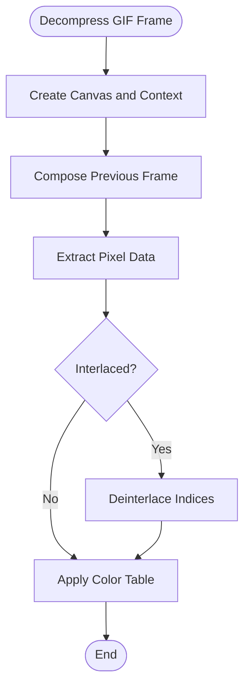
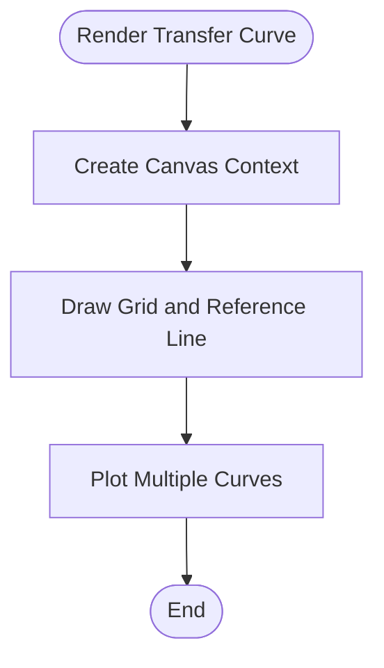
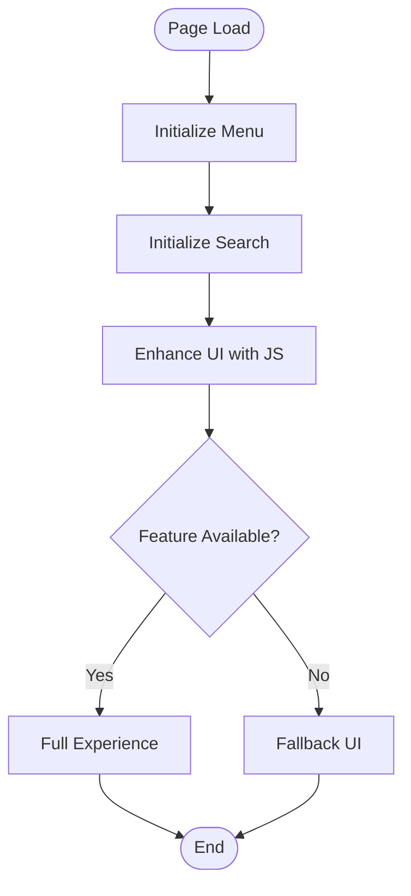
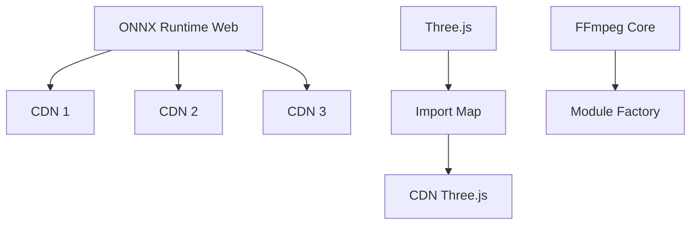

# Browser Compatibility

<cite>
**Referenced Files in This Document**
- [index.html](file://index.html)
- [common.css](file://css/common.css)
- [index.css](file://css/index.css)
- [menu.js](file://js/menu.js)
- [local_workbench.js](file://js/local_workbench.js)
- [ai_upscale.html](file://tools_html/ai_upscale.html)
- [ai_upscale.js](file://js/ai_upscale.js)
- [ai_frame_interpolation.html](file://tools_html/ai_frame_interpolation.html)
- [ai_frame_interpolation.js](file://js/ai_frame_interpolation.js)
- [hdr_editor.html](file://tools_html/hdr_editor.html)
- [hdr_editor.js](file://js/hdr_editor.js)
- [model_previewer.js](file://js/model_previewer.js)
- [pbr_texture_generator.js](file://js/pbr_texture_generator.js)
- [gif_compress.js](file://js/gif_compress.js)
- [color_space_converter.js](file://js/color_space_converter.js)
- [ort.webgpu.min.js](file://third_part/onnxruntime-web/1.17.1/ort.webgpu.min.js)
- [ffmpeg-core.js](file://third_part/ffmpeg-wasm/ffmpeg-core.js)
</cite>

## Table of Contents
1. [Introduction](#introduction)
2. [Project Structure](#project-structure)
3. [Core Components](#core-components)
4. [Architecture Overview](#architecture-overview)
5. [Detailed Component Analysis](#detailed-component-analysis)
6. [Dependency Analysis](#dependency-analysis)
7. [Performance Considerations](#performance-considerations)
8. [Troubleshooting Guide](#troubleshooting-guide)
9. [Conclusion](#conclusion)
10. [Appendices](#appendices)

## Introduction
This document provides comprehensive browser compatibility guidance for the web application. It covers feature detection, polyfill strategies, graceful degradation, fallback to CPU processing, and alternative execution paths for unsupported browsers. It also documents CSS fallback strategies, JavaScript feature detection patterns, progressive enhancement approaches, CORS and cross-origin considerations, and mobile responsiveness.

## Project Structure
The application is organized around a central index page and modular tool pages. Each tool page embeds its own JavaScript and CSS resources, enabling independent compatibility handling per tool. The shared UI elements (menu, search, and layout) are implemented via common CSS and JavaScript modules.

**Diagram sources**
- [index.html:1-25](file://index.html#L1-L25)
- [common.css:1-386](file://css/common.css#L1-L386)
- [index.css:1-57](file://css/index.css#L1-L57)
- [menu.js:1-273](file://js/menu.js#L1-L273)

**Section sources**
- [index.html:1-25](file://index.html#L1-L25)
- [common.css:1-386](file://css/common.css#L1-L386)
- [index.css:1-57](file://css/index.css#L1-L57)
- [menu.js:1-273](file://js/menu.js#L1-L273)

## Core Components
- Central navigation and search: Implemented in a reusable module with progressive enhancement for search and accordion menus.
- Tool panels: Each tool initializes its own DOM structure and feature detection logic.
- Feature detection and fallback: Tools detect WebGPU availability and gracefully fall back to CPU (WASM) processing.
- Cross-origin and caching: Tools implement robust model loading with multiple sources and IndexedDB/Cache API fallbacks.
- Responsive design: CSS media queries adapt layouts for different screen sizes.

**Section sources**
- [menu.js:1-273](file://js/menu.js#L1-L273)
- [local_workbench.js:1-197](file://js/local_workbench.js#L1-L197)

## Architecture Overview
The application follows a modular architecture where each tool page loads its own JavaScript and CSS. Feature detection and fallback logic are encapsulated within each tool’s initialization routine. Third-party libraries (e.g., ONNX Runtime Web, Three.js) are loaded conditionally or via CDNs with fallback strategies.

**Diagram sources**
- [ai_upscale.html:1-167](file://tools_html/ai_upscale.html#L1-L167)
- [ai_upscale.js:1-800](file://js/ai_upscale.js#L1-L800)
- [ai_frame_interpolation.html:1-185](file://tools_html/ai_frame_interpolation.html#L1-L185)
- [ai_frame_interpolation.js:1-800](file://js/ai_frame_interpolation.js#L1-L800)
- [hdr_editor.html:1-65](file://tools_html/hdr_editor.html#L1-L65)
- [hdr_editor.js:1-708](file://js/hdr_editor.js#L1-L708)
- [ort.webgpu.min.js:1-12](file://third_part/onnxruntime-web/1.17.1/ort.webgpu.min.js#L1-L12)
- [ffmpeg-core.js:1-21](file://third_part/ffmpeg-wasm/ffmpeg-core.js#L1-L21)

## Detailed Component Analysis

### WebGPU Capability Detection and Fallback
- Detection: Uses the presence of the WebGPU namespace on the navigator object to decide execution providers.
- Fallback: If WebGPU is unavailable, switches to WASM execution provider with optimized settings.
- Validation: After inference, validates output tensors to detect zero-data scenarios indicative of WebGPU configuration issues.

**Diagram sources**
- [ai_upscale.js:427-470](file://js/ai_upscale.js#L427-L470)
- [ai_upscale.js:1408-1427](file://js/ai_upscale.js#L1408-L1427)

**Section sources**
- [ai_upscale.js:427-470](file://js/ai_upscale.js#L427-L470)
- [ai_upscale.js:1408-1427](file://js/ai_upscale.js#L1408-L1427)

### Frame Interpolation Execution Providers and Model Loading
- Execution providers: Supports strict GPU mode (WebGPU) and flexible mode (WebGPU/WASM).
- Model loading: Attempts multiple CDN sources and caches models via IndexedDB and Cache API.
- Environment checks: Validates protocol and runtime readiness before loading scripts.

**Diagram sources**
- [ai_frame_interpolation.js:315-354](file://js/ai_frame_interpolation.js#L315-L354)
- [ai_frame_interpolation.js:452-477](file://js/ai_frame_interpolation.js#L452-L477)
- [ai_frame_interpolation.js:479-495](file://js/ai_frame_interpolation.js#L479-L495)

**Section sources**
- [ai_frame_interpolation.js:315-354](file://js/ai_frame_interpolation.js#L315-L354)
- [ai_frame_interpolation.js:452-477](file://js/ai_frame_interpolation.js#L452-L477)
- [ai_frame_interpolation.js:479-495](file://js/ai_frame_interpolation.js#L479-L495)

### HDR Editor and Model Previewer Dependencies
- HDR Editor: Uses an import map to load Three.js from a CDN with fallback logic.
- Model Previewer: Dynamically attempts multiple CDN candidates for Three.js modules.

**Diagram sources**
- [hdr_editor.html:33-39](file://tools_html/hdr_editor.html#L33-L39)
- [hdr_editor.html:40-60](file://tools_html/hdr_editor.html#L40-L60)
- [model_previewer.js:1-38](file://js/model_previewer.js#L1-L38)

**Section sources**
- [hdr_editor.html:33-39](file://tools_html/hdr_editor.html#L33-L39)
- [hdr_editor.html:40-60](file://tools_html/hdr_editor.html#L40-L60)
- [model_previewer.js:1-38](file://js/model_previewer.js#L1-L38)

### Canvas and WebGL Feature Detection
- WebGL2 detection: Ensures WebGL2 context and float texture extension support before enabling advanced rendering.
- Fallback: Disables advanced features if WebGL2 is unavailable.

**Diagram sources**
- [pbr_texture_generator.js:261-267](file://js/pbr_texture_generator.js#L261-L267)

**Section sources**
- [pbr_texture_generator.js:261-267](file://js/pbr_texture_generator.js#L261-L267)

### GIF Decompression and Canvas Usage
- Canvas-based decoding: Uses a canvas to composite frames and extract pixel data for GIF processing.
- Fallback: Handles missing color tables and interlacing gracefully.

**Diagram sources**
- [gif_compress.js:548-578](file://js/gif_compress.js#L548-L578)

**Section sources**
- [gif_compress.js:548-578](file://js/gif_compress.js#L548-L578)

### Color Space Converter Chart Rendering
- Canvas-based plotting: Renders transfer curves and grids using 2D canvas APIs.
- Fallback: Uses canvas fallbacks for environments without WebGL.

**Diagram sources**
- [color_space_converter.js:46-84](file://js/color_space_converter.js#L46-L84)

**Section sources**
- [color_space_converter.js:46-84](file://js/color_space_converter.js#L46-L84)

### Progressive Enhancement and Graceful Degradation
- Menu and search: Enhance static lists with dynamic filtering and search highlighting.
- Tool panels: Provide fallback UIs when external scripts fail to load.
- File handling: Gracefully degrade file picker APIs and show alerts for unsupported browsers.

**Diagram sources**
- [menu.js:268-273](file://js/menu.js#L268-L273)
- [local_workbench.js:42-50](file://js/local_workbench.js#L42-L50)
- [local_workbench.js:123-125](file://js/local_workbench.js#L123-L125)

**Section sources**
- [menu.js:268-273](file://js/menu.js#L268-L273)
- [local_workbench.js:42-50](file://js/local_workbench.js#L42-L50)
- [local_workbench.js:123-125](file://js/local_workbench.js#L123-L125)

## Dependency Analysis
- ONNX Runtime Web: Loaded via multiple CDN URLs with fallbacks and configured for single-threaded WASM execution to avoid cross-origin isolation restrictions.
- Three.js: Loaded via import map with CDN fallback logic in HDR editor and model previewer.
- FFmpeg WebAssembly: Dynamically loaded via a factory function with module exports.

**Diagram sources**
- [ai_upscale.js:84-94](file://js/ai_upscale.js#L84-L94)
- [ai_frame_interpolation.js:338-354](file://js/ai_frame_interpolation.js#L338-L354)
- [hdr_editor.html:33-39](file://tools_html/hdr_editor.html#L33-L39)
- [model_previewer.js:13-28](file://js/model_previewer.js#L13-L28)
- [ffmpeg-core.js:1-21](file://third_part/ffmpeg-wasm/ffmpeg-core.js#L1-L21)

**Section sources**
- [ai_upscale.js:84-94](file://js/ai_upscale.js#L84-L94)
- [ai_frame_interpolation.js:338-354](file://js/ai_frame_interpolation.js#L338-L354)
- [hdr_editor.html:33-39](file://tools_html/hdr_editor.html#L33-L39)
- [model_previewer.js:13-28](file://js/model_previewer.js#L13-L28)
- [ffmpeg-core.js:1-21](file://third_part/ffmpeg-wasm/ffmpeg-core.js#L1-L21)

## Performance Considerations
- WebGPU vs WASM: Prefer WebGPU when available; disable graph optimizations for stability. Fall back to WASM with optimizations enabled.
- Multi-source downloads: Try multiple CDN URLs for models and libraries to improve reliability.
- Caching: Use IndexedDB and Cache API to reduce network overhead and improve load times.
- Canvas rendering: Use WebGL2 when available; otherwise, degrade to 2D canvas rendering.

[No sources needed since this section provides general guidance]

## Troubleshooting Guide
- WebGPU not supported: Switch to CPU mode and adjust execution provider settings.
- Model loading failures: Verify CDN accessibility and retry with different sources; check IndexedDB/Cache API availability.
- File picker limitations: Some browsers lack directory picker; provide alerts and guide users to compatible browsers.
- Protocol errors: Certain features require HTTPS or localhost; ensure proper protocol before loading WebAssembly or WebGPU modules.

**Section sources**
- [ai_upscale.js:446-454](file://js/ai_upscale.js#L446-L454)
- [ai_frame_interpolation.js:315-325](file://js/ai_frame_interpolation.js#L315-L325)
- [local_workbench.js:148-153](file://js/local_workbench.js#L148-L153)

## Conclusion
The application employs robust feature detection, polyfills, and graceful degradation strategies to maintain functionality across diverse browsers. WebGPU is prioritized with a reliable WASM fallback, models are cached and loaded from multiple sources, and responsive design ensures usability on various devices. Adhering to these patterns helps sustain compatibility and performance.

[No sources needed since this section summarizes without analyzing specific files]

## Appendices

### CSS Fallback Strategies
- Use modern layout features (Flexbox/Grid) with sensible defaults for older browsers.
- Provide fallback styles for unsupported pseudo-elements and properties.
- Utilize media queries to adapt layouts for smaller screens and different orientations.

**Section sources**
- [common.css:1-386](file://css/common.css#L1-L386)
- [index.css:1-57](file://css/index.css#L1-L57)

### JavaScript Feature Detection Patterns
- Detect APIs via existence checks (e.g., WebGPU on navigator).
- Validate environment conditions (e.g., protocol, runtime readiness).
- Provide user feedback and alternative controls when features are unavailable.

**Section sources**
- [ai_upscale.js:427-431](file://js/ai_upscale.js#L427-L431)
- [ai_frame_interpolation.js:315-325](file://js/ai_frame_interpolation.js#L315-L325)
- [menu.js:147-156](file://js/menu.js#L147-L156)

### Mobile Browser Considerations
- Touch interactions: Implement drag-and-drop and gesture-based controls with touch event handlers.
- Responsive layouts: Adjust grid templates and component sizing for portrait and landscape modes.
- File handling: Gracefully handle file pickers and directory pickers with appropriate browser hints.

**Section sources**
- [ai_upscale.js:524-561](file://js/ai_upscale.js#L524-L561)
- [ai_upscale.js:147-175](file://js/ai_upscale.js#L147-L175)
- [common.css:261-292](file://css/common.css#L261-L292)

### CORS and Cross-Origin Resource Sharing
- CDN usage: Ensure third-party libraries are loaded from trusted, cross-origin-friendly CDNs.
- Model hosting: Host ONNX models on same-origin or configure appropriate CORS headers for cross-origin requests.
- Security policies: Avoid mixed content and enforce HTTPS for features requiring secure contexts.

**Section sources**
- [ai_frame_interpolation.js:26-45](file://js/ai_frame_interpolation.js#L26-L45)
- [ai_upscale.js:190-240](file://js/ai_upscale.js#L190-L240)