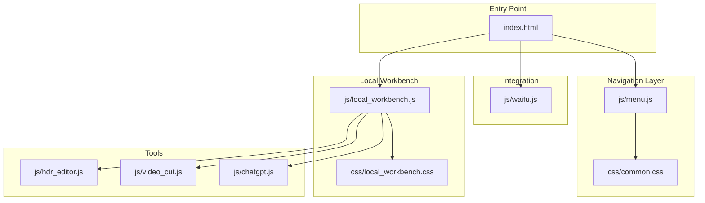
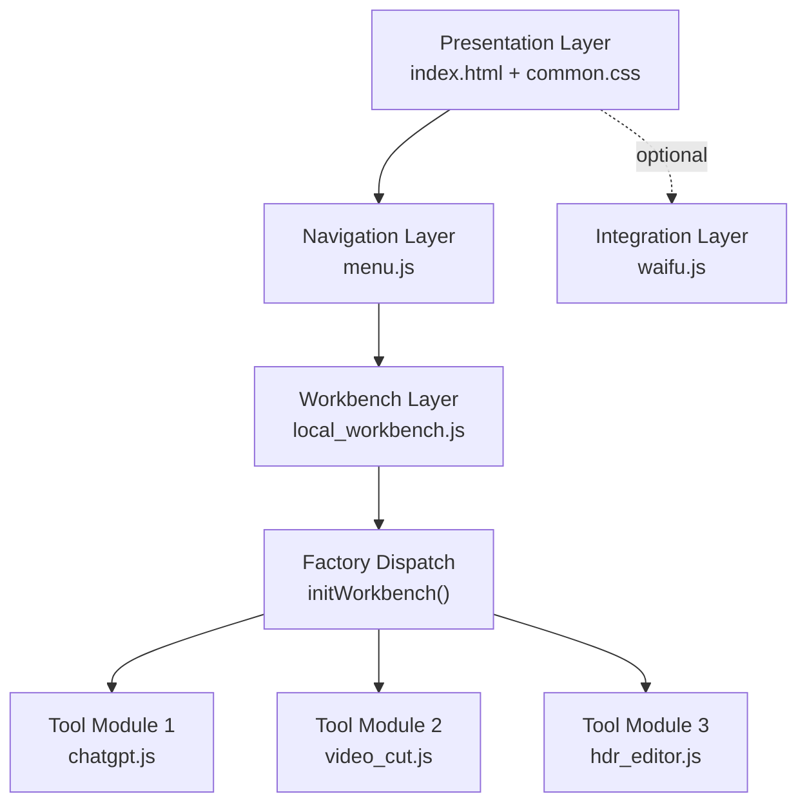
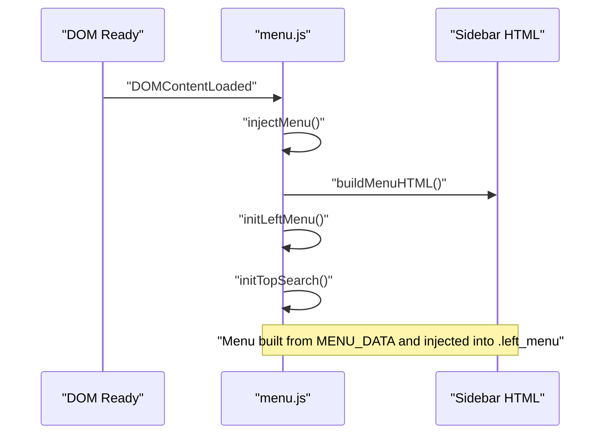
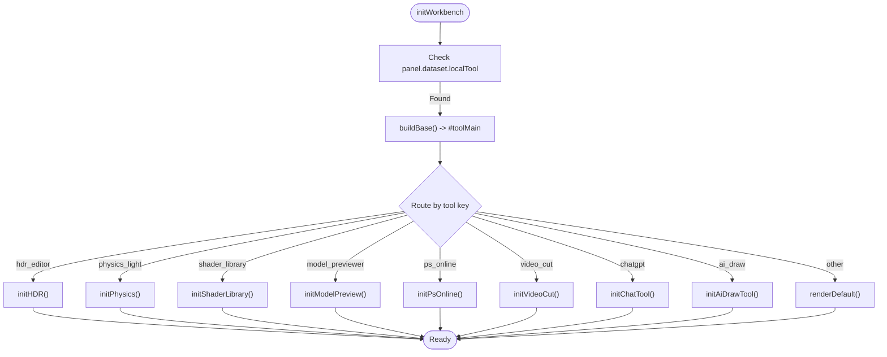
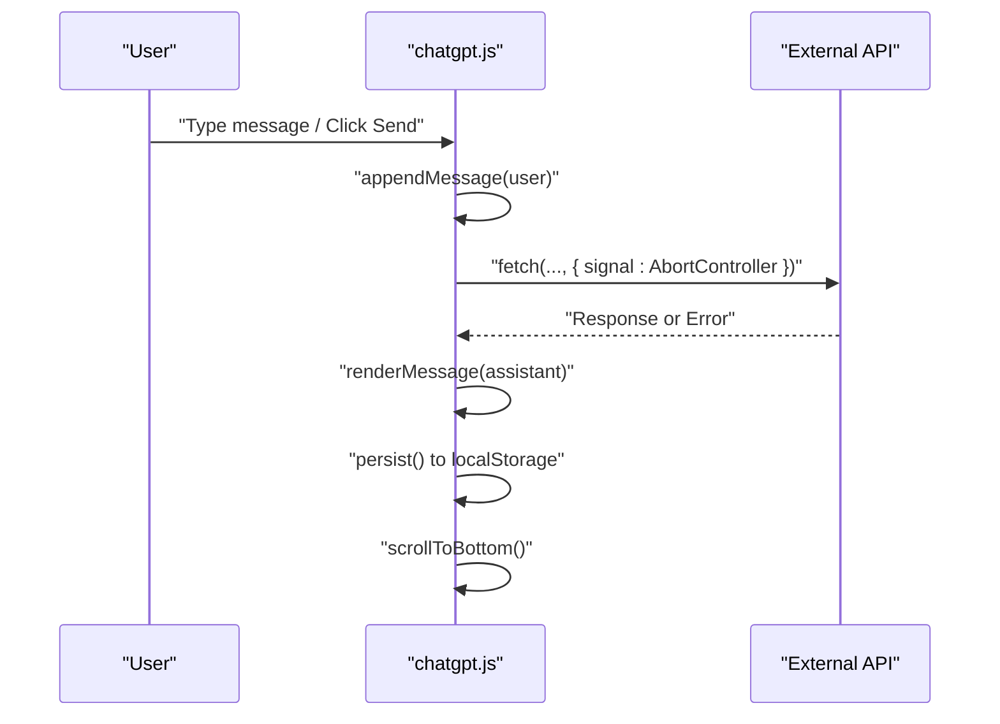
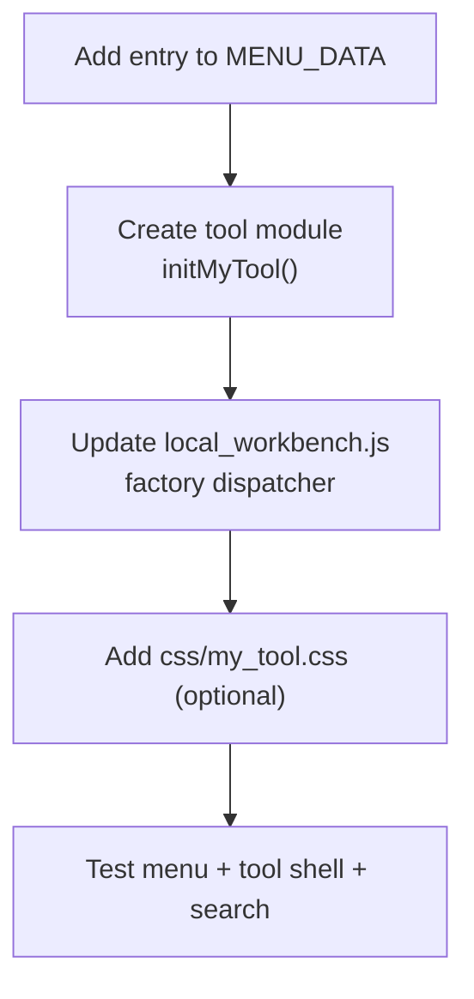
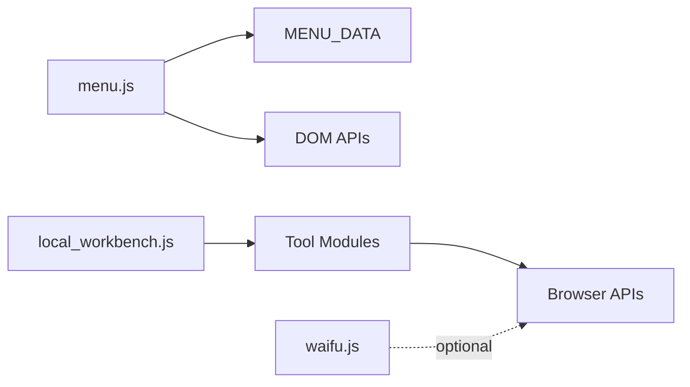

# Framework Architecture

<cite>
**Referenced Files in This Document**
- [menu.js](file://js/menu.js)
- [local_workbench.js](file://js/local_workbench.js)
- [index.html](file://index.html)
- [common.css](file://css/common.css)
- [local_workbench.css](file://css/local_workbench.css)
- [chatgpt.js](file://js/chatgpt.js)
- [video_cut.js](file://js/video_cut.js)
- [hdr_editor.js](file://js/hdr_editor.js)
- [waifu.js](file://js/waifu.js)
</cite>

## Table of Contents
1. [Introduction](#introduction)
2. [Project Structure](#project-structure)
3. [Core Components](#core-components)
4. [Architecture Overview](#architecture-overview)
5. [Detailed Component Analysis](#detailed-component-analysis)
6. [Dependency Analysis](#dependency-analysis)
7. [Performance Considerations](#performance-considerations)
8. [Troubleshooting Guide](#troubleshooting-guide)
9. [Conclusion](#conclusion)

## Introduction
This document describes the framework architecture of the web-based tool platform, focusing on the local workbench system, shared tool framework, and navigation components. It explains how the menu system acts as a single source of truth, how tools are initialized via a factory-like pattern, and how UI state is managed through event-driven interactions. The document also covers the MVC-like separation of concerns, the modular component design, and the cross-tool functionality enabled by shared utilities and the tool registration system.

## Project Structure
The application follows a modular, HTML/CSS/JS structure with:
- A central navigation menu built from a single data source
- A local workbench that dynamically initializes tools based on the current page context
- Tool-specific JavaScript modules that expose initialization functions for the workbench
- Shared styles for layout, menu, and tool shells
- Optional live2d widget integration

**Diagram sources**
- [index.html:1-25](file://index.html#L1-L25)
- [menu.js:1-273](file://js/menu.js#L1-L273)
- [local_workbench.js:1-197](file://js/local_workbench.js#L1-L197)
- [common.css:1-386](file://css/common.css#L1-L386)
- [local_workbench.css:1-33](file://css/local_workbench.css#L1-L33)
- [chatgpt.js:1-304](file://js/chatgpt.js#L1-L304)
- [video_cut.js:1-688](file://js/video_cut.js#L1-L688)
- [hdr_editor.js:1-800](file://js/hdr_editor.js#L1-L800)
- [waifu.js:1-24](file://js/waifu.js#L1-L24)

**Section sources**
- [index.html:1-25](file://index.html#L1-L25)
- [menu.js:1-273](file://js/menu.js#L1-L273)
- [local_workbench.js:1-197](file://js/local_workbench.js#L1-L197)
- [common.css:1-386](file://css/common.css#L1-L386)
- [local_workbench.css:1-33](file://css/local_workbench.css#L1-L33)
- [chatgpt.js:1-304](file://js/chatgpt.js#L1-L304)
- [video_cut.js:1-688](file://js/video_cut.js#L1-L688)
- [hdr_editor.js:1-800](file://js/hdr_editor.js#L1-L800)
- [waifu.js:1-24](file://js/waifu.js#L1-L24)

## Core Components
- Menu system (MENU_DATA): Centralized tool registry and navigation builder
- Local workbench: Factory-driven tool initializer and shell manager
- Tool modules: Self-contained initialization functions for each tool
- Shared UI: Navigation styles and tool shell styles
- Live2d integration: Optional decorative widget loader

Key characteristics:
- Single source of truth for menu entries
- Event-driven UI interactions for menu toggling and global search
- Factory-like dispatch in the workbench based on page context
- Modular tool initialization with graceful fallbacks

**Section sources**
- [menu.js:1-43](file://js/menu.js#L1-L43)
- [menu.js:46-103](file://js/menu.js#L46-L103)
- [menu.js:107-272](file://js/menu.js#L107-L272)
- [local_workbench.js:4-19](file://js/local_workbench.js#L4-L19)
- [local_workbench.js:170-189](file://js/local_workbench.js#L170-L189)
- [common.css:34-199](file://css/common.css#L34-L199)
- [local_workbench.css:1-33](file://css/local_workbench.css#L1-L33)
- [waifu.js:1-24](file://js/waifu.js#L1-L24)

## Architecture Overview
The system implements a layered architecture:
- Presentation layer: HTML templates and CSS for layout and navigation
- Navigation layer: Menu builder and global search
- Workbench layer: Tool shell and factory dispatcher
- Tool layer: Feature-specific modules exposing initialization APIs
- Integration layer: Optional widgets and external resources

**Diagram sources**
- [index.html:1-25](file://index.html#L1-L25)
- [common.css:1-386](file://css/common.css#L1-L386)
- [menu.js:1-273](file://js/menu.js#L1-L273)
- [local_workbench.js:1-197](file://js/local_workbench.js#L1-L197)
- [chatgpt.js:1-304](file://js/chatgpt.js#L1-L304)
- [video_cut.js:1-688](file://js/video_cut.js#L1-L688)
- [hdr_editor.js:1-800](file://js/hdr_editor.js#L1-L800)
- [waifu.js:1-24](file://js/waifu.js#L1-L24)

## Detailed Component Analysis

### Menu System (Singleton Pattern)
The menu system uses a centralized data structure as the single source of truth and builds the navigation UI at runtime. It exposes:
- MENU_DATA: Hierarchical tool registry
- buildMenuHTML(): Renders the sidebar from MENU_DATA
- injectMenu(): Injects the menu into the DOM
- initLeftMenu(): Binds accordion behavior
- Global search utilities: normalizeSearchText, getSearchItems, highlightMatch, updateMenuSearchState, initTopSearch()

Implementation highlights:
- Singleton-like behavior through a single module exporting functions and constants
- Event delegation for menu item clicks and sub-menu toggling
- Search indexing built from label, category, href, and keywords
- Dynamic path prefixing for root vs nested deployment contexts

**Diagram sources**
- [menu.js:268-272](file://js/menu.js#L268-L272)
- [menu.js:46-68](file://js/menu.js#L46-L68)
- [menu.js:70-77](file://js/menu.js#L70-L77)
- [menu.js:80-84](file://js/menu.js#L80-L84)
- [menu.js:223-266](file://js/menu.js#L223-L266)

**Section sources**
- [menu.js:1-43](file://js/menu.js#L1-L43)
- [menu.js:46-103](file://js/menu.js#L46-L103)
- [menu.js:107-272](file://js/menu.js#L107-L272)
- [common.css:34-199](file://css/common.css#L34-L199)

### Local Workbench (Factory Pattern)
The workbench implements a factory-like dispatcher that:
- Reads the current tool context from the panel dataset
- Builds a standardized tool shell
- Delegates to tool-specific initialization functions
- Provides fallback rendering for missing tool scripts

Key behaviors:
- Tool metadata and design tool links
- Shell construction and tool area injection
- Tool-specific initializers: HDR editor, physics calculator, shader library, model previewer, online PS, video cut, chat tool, AI draw tool
- Fallback rendering and error messaging

**Diagram sources**
- [local_workbench.js:170-189](file://js/local_workbench.js#L170-L189)
- [local_workbench.js:32-40](file://js/local_workbench.js#L32-L40)
- [local_workbench.js:52-61](file://js/local_workbench.js#L52-L61)
- [local_workbench.js:65-84](file://js/local_workbench.js#L65-L84)
- [local_workbench.js:86-107](file://js/local_workbench.js#L86-L107)
- [local_workbench.js:109-121](file://js/local_workbench.js#L109-L121)
- [local_workbench.js:123-125](file://js/local_workbench.js#L123-L125)
- [local_workbench.js:128-143](file://js/local_workbench.js#L128-L143)
- [local_workbench.js:147-153](file://js/local_workbench.js#L147-L153)
- [local_workbench.js:155-161](file://js/local_workbench.js#L155-L161)
- [local_workbench.js:163-168](file://js/local_workbench.js#L163-L168)

**Section sources**
- [local_workbench.js:4-20](file://js/local_workbench.js#L4-L20)
- [local_workbench.js:32-40](file://js/local_workbench.js#L32-L40)
- [local_workbench.js:52-168](file://js/local_workbench.js#L52-L168)
- [local_workbench.js:170-189](file://js/local_workbench.js#L170-L189)
- [local_workbench.css:1-33](file://css/local_workbench.css#L1-L33)

### Tool Modules (Event-Driven UI State Management)
Each tool module encapsulates its UI state and event handling:
- ChatGPT: Markdown rendering, message persistence, quick prompts, retry logic, scroll management
- Video Cut: Mode selection, time range controls, export pipeline, progress reporting, cancellation
- HDR Editor: Three.js-based environment editing, lighting controls, canvas filters, export actions

Patterns observed:
- Encapsulated state via closures and local variables
- Event-driven updates (input handlers, click handlers, keyboard shortcuts)
- Asynchronous operations with timeouts and error handling
- DOM manipulation with structured templates and dynamic content updates

**Diagram sources**
- [chatgpt.js:205-267](file://js/chatgpt.js#L205-L267)
- [chatgpt.js:115-194](file://js/chatgpt.js#L115-L194)
- [chatgpt.js:135-160](file://js/chatgpt.js#L135-L160)
- [chatgpt.js:269-299](file://js/chatgpt.js#L269-L299)

**Section sources**
- [chatgpt.js:1-304](file://js/chatgpt.js#L1-L304)
- [video_cut.js:5-687](file://js/video_cut.js#L5-L687)
- [hdr_editor.js:84-369](file://js/hdr_editor.js#L84-L369)

### MVC-like Separation of Concerns
- Model: Tool state and data (e.g., chat history, video processing state, HDR parameters)
- View: Templates and DOM structures (e.g., tool shells, menus, panels)
- Controller: Event handlers and orchestration (e.g., menu toggles, tool initialization, UI updates)

Evidence:
- Menu system builds views from a data model (MENU_DATA)
- Workbench constructs tool shells and delegates to tool controllers
- Tools manage their own state and render updates

**Section sources**
- [menu.js:1-43](file://js/menu.js#L1-L43)
- [menu.js:46-68](file://js/menu.js#L46-L68)
- [local_workbench.js:32-40](file://js/local_workbench.js#L32-L40)
- [chatgpt.js:115-194](file://js/chatgpt.js#L115-L194)
- [video_cut.js:59-687](file://js/video_cut.js#L59-L687)
- [hdr_editor.js:456-471](file://js/hdr_editor.js#L456-L471)

### Cross-Tool Functionality and Shared Utilities
- Shared shell and layout: local_workbench.css provides consistent spacing, cards, and responsive grids
- Global search: Unified search across categories and tools via menu.js
- CDN-based tooling: HDR editor loads Three.js and loaders dynamically
- Fallback mechanisms: Workbench gracefully handles missing tool scripts

**Section sources**
- [local_workbench.css:1-33](file://css/local_workbench.css#L1-L33)
- [menu.js:107-135](file://js/menu.js#L107-L135)
- [hdr_editor.js:37-63](file://js/hdr_editor.js#L37-L63)
- [local_workbench.js:52-61](file://js/local_workbench.js#L52-L61)
- [local_workbench.js:128-143](file://js/local_workbench.js#L128-L143)

### Extending the Framework
Steps to add a new tool while maintaining architectural consistency:
1. Register the tool in MENU_DATA with appropriate category, label, href, and keywords
2. Create a tool-specific JS module that exposes an initialization function (e.g., initMyTool)
3. Add a case in the workbench’s factory dispatcher to route to the new tool
4. Optionally add tool-specific CSS under css/<tool_name>.css
5. Test menu search, accordion behavior, and tool shell integration

**Diagram sources**
- [menu.js:2-43](file://js/menu.js#L2-L43)
- [local_workbench.js:170-189](file://js/local_workbench.js#L170-L189)
- [local_workbench.css:1-33](file://css/local_workbench.css#L1-L33)

**Section sources**
- [menu.js:1-43](file://js/menu.js#L1-L43)
- [local_workbench.js:170-189](file://js/local_workbench.js#L170-L189)
- [local_workbench.css:1-33](file://css/local_workbench.css#L1-L33)

## Dependency Analysis
The framework exhibits low coupling and high cohesion:
- menu.js depends on MENU_DATA and DOM APIs
- local_workbench.js depends on tool modules via exported initialization functions
- Tools depend on their own internal state and browser APIs
- Optional integration via waifu.js does not affect core functionality

**Diagram sources**
- [menu.js:1-43](file://js/menu.js#L1-L43)
- [local_workbench.js:1-197](file://js/local_workbench.js#L1-L197)
- [waifu.js:1-24](file://js/waifu.js#L1-L24)

**Section sources**
- [menu.js:1-273](file://js/menu.js#L1-L273)
- [local_workbench.js:1-197](file://js/local_workbench.js#L1-L197)
- [waifu.js:1-24](file://js/waifu.js#L1-L24)

## Performance Considerations
- Lazy loading: Tools are initialized only when the workbench detects the relevant context
- Minimal DOM manipulation: Tools update only changed nodes and use efficient templates
- CDN fallbacks: HDR editor attempts multiple CDNs and reports failures
- Graceful degradation: Workbench displays hints when tool scripts are missing
- CSS transitions: Smooth animations for menu open/close and search results

[No sources needed since this section provides general guidance]

## Troubleshooting Guide
Common issues and resolutions:
- Menu not appearing: Verify .left_menu exists and menu.js is loaded
- Tool not initializing: Confirm the panel has dataset.localTool and the tool module exports its init function
- Global search not working: Ensure top search wrapper exists and menu.js initTopSearch is called
- HDR editor errors: Check network access to CDN and confirm initHdrEditorTool is available
- Video cut stuck: Cancel current task or reload page; verify AbortController usage

**Section sources**
- [menu.js:70-77](file://js/menu.js#L70-L77)
- [menu.js:268-272](file://js/menu.js#L268-L272)
- [local_workbench.js:170-189](file://js/local_workbench.js#L170-L189)
- [hdr_editor.js:37-63](file://js/hdr_editor.js#L37-L63)
- [video_cut.js:656-677](file://js/video_cut.js#L656-L677)

## Conclusion
The framework combines a centralized menu system, a factory-driven workbench, and modular tool modules to deliver a cohesive, extensible tool platform. The singleton-like menu, factory dispatch, and event-driven UI state management enable maintainable, scalable development. By adhering to the established patterns—registering tools in MENU_DATA, exporting initialization functions, and leveraging the workbench shell—developers can consistently extend the platform while preserving architectural integrity.