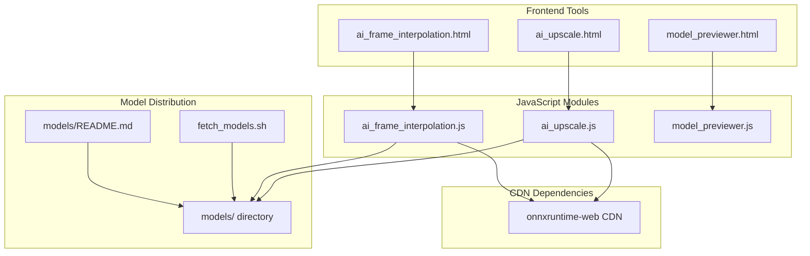
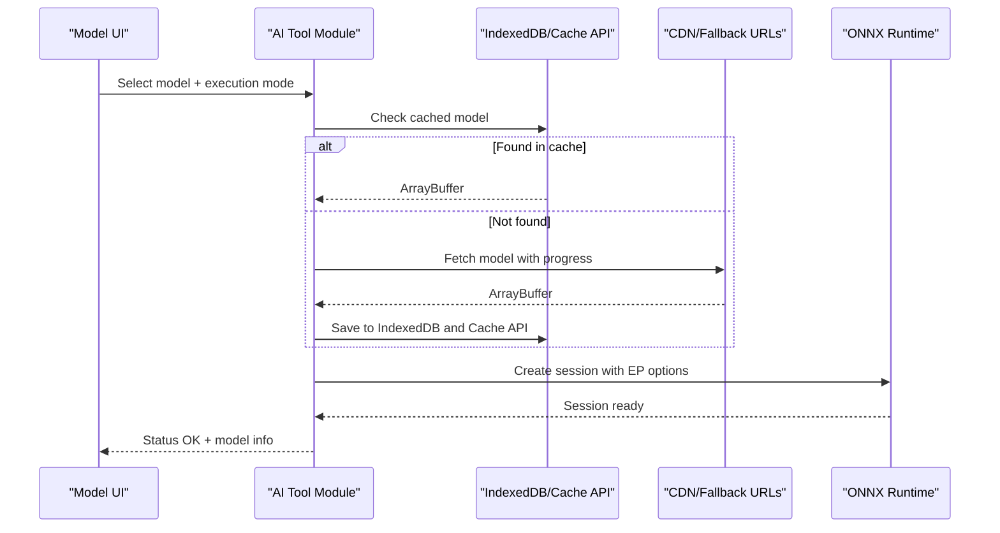
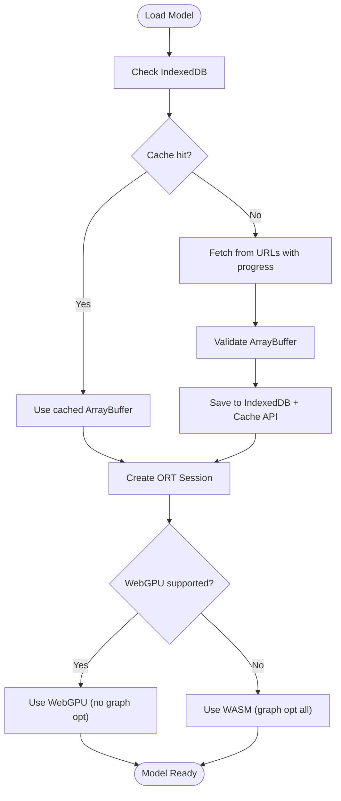
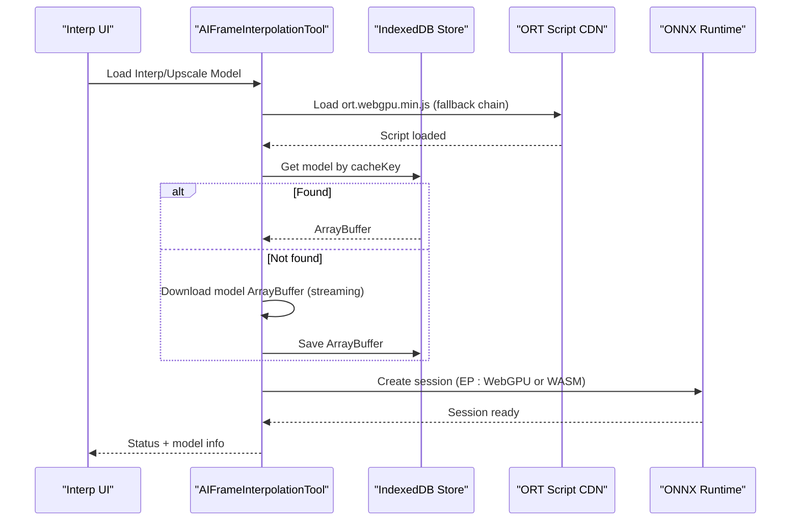
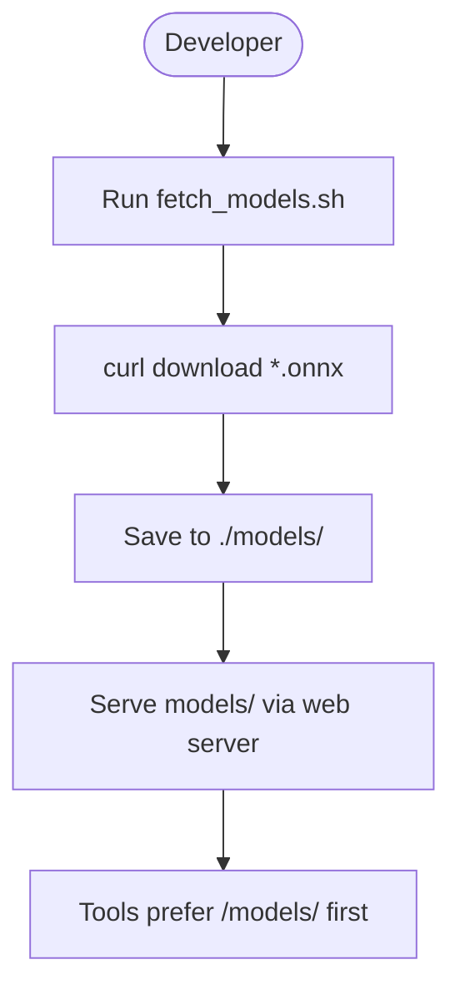
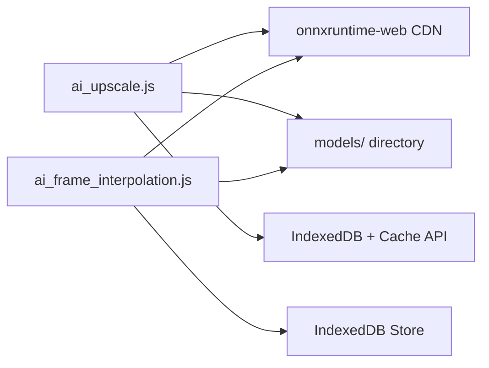

# Model Management System

<cite>
**Referenced Files in This Document**
- [ai_upscale.js](file://js/ai_upscale.js)
- [ai_frame_interpolation.js](file://js/ai_frame_interpolation.js)
- [ai_upscale.html](file://tools_html/ai_upscale.html)
- [ai_frame_interpolation.html](file://tools_html/ai_frame_interpolation.html)
- [fetch_models.sh](file://scripts/fetch_models.sh)
- [models/README.md](file://models/README.md)
- [model_previewer.js](file://js/model_previewer.js)
</cite>

## Table of Contents
1. [Introduction](#introduction)
2. [Project Structure](#project-structure)
3. [Core Components](#core-components)
4. [Architecture Overview](#architecture-overview)
5. [Detailed Component Analysis](#detailed-component-analysis)
6. [Dependency Analysis](#dependency-analysis)
7. [Performance Considerations](#performance-considerations)
8. [Troubleshooting Guide](#troubleshooting-guide)
9. [Conclusion](#conclusion)
10. [Appendices](#appendices)

## Introduction
This document describes the ONNX model management system used by the web application, focusing on model loading, caching strategies, fallback mechanisms, CDN-based distribution, and local storage management. It covers the model configuration system, version management, automatic updates, model selection interfaces, performance optimization based on hardware capabilities, graceful degradation when models fail to load, and practical guidance for adding new AI models, configuring parameters, handling errors, memory management for large models, and validation processes.

## Project Structure
The model management system spans several modules:
- Frontend tools pages that expose model selection and processing controls
- JavaScript modules implementing ONNX runtime integration, model caching, and fallback logic
- Scripts and documentation for model distribution and hosting
- Preview tool for 3D models (complementary asset management)

**Diagram sources**
- [ai_upscale.html](file://tools_html/ai_upscale.html)
- [ai_frame_interpolation.html](file://tools_html/ai_frame_interpolation.html)
- [ai_upscale.js](file://js/ai_upscale.js)
- [ai_frame_interpolation.js](file://js/ai_frame_interpolation.js)
- [model_previewer.js](file://js/model_previewer.js)
- [fetch_models.sh](file://scripts/fetch_models.sh)
- [models/README.md](file://models/README.md)

**Section sources**
- [ai_upscale.html](file://tools_html/ai_upscale.html)
- [ai_frame_interpolation.html](file://tools_html/ai_frame_interpolation.html)
- [ai_upscale.js](file://js/ai_upscale.js)
- [ai_frame_interpolation.js](file://js/ai_frame_interpolation.js)
- [fetch_models.sh](file://scripts/fetch_models.sh)
- [models/README.md](file://models/README.md)

## Core Components
- ONNX Runtime integration with configurable execution providers (WebGPU for acceleration, WASM fallback)
- Dual-cache strategy using IndexedDB and Cache API for robust offline availability
- Multi-source fallback for model downloads with progress reporting
- Model configuration registry per tool with metadata (name, description, size, scale)
- Hardware-aware execution mode selection with graceful degradation
- Validation and diagnostics for tensor shapes and output sanity checks
- Local model hosting via the models/ directory with same-origin preference

**Section sources**
- [ai_upscale.js](file://js/ai_upscale.js)
- [ai_frame_interpolation.js](file://js/ai_frame_interpolation.js)
- [models/README.md](file://models/README.md)

## Architecture Overview
The system integrates three major flows:
- Model selection UI: users choose models and execution modes
- Download and caching: models are fetched from multiple sources, validated, and cached
- Inference execution: tensors are prepared, executed, and post-processed

**Diagram sources**
- [ai_upscale.js](file://js/ai_upscale.js)
- [ai_frame_interpolation.js](file://js/ai_frame_interpolation.js)

## Detailed Component Analysis

### Real-ESRGAN Upscaling Tool (ai_upscale.js)
- Model configuration registry defines multiple models with authoritative URLs and mirrors
- Execution provider selection:
  - WebGPU when supported; otherwise WASM CPU mode
  - Graph optimization disabled for WebGPU stability
- Dual caching:
  - IndexedDB primary store supporting file:// protocol
  - Cache API secondary store synchronized with IndexedDB
- Download pipeline:
  - Attempts multiple URLs in order
  - Streams with progress reporting
  - Validates content length and merges chunks
- Runtime diagnostics:
  - Logs input/output tensor shapes
  - Sanity-checks output data to detect WebGPU configuration issues
- Graceful degradation:
  - On GPU failure, prompts switching to CPU mode

**Diagram sources**
- [ai_upscale.js](file://js/ai_upscale.js)

**Section sources**
- [ai_upscale.js](file://js/ai_upscale.js)
- [ai_upscale.html](file://tools_html/ai_upscale.html)

### Frame Interpolation and Upscaling Tool (ai_frame_interpolation.js)
- Centralized model cache database with IndexedDB
- Robust model URL candidates per model family (RIFE, ESRGAN)
- CDN-first loading of ONNX Runtime with multiple fallbacks
- Stable execution providers selection with optional strict GPU mode
- Download streaming with progress callbacks and cache persistence
- Signature detection for interpolation and upscale models
- Tiled inference support for variable-sized inputs

**Diagram sources**
- [ai_frame_interpolation.js](file://js/ai_frame_interpolation.js)

**Section sources**
- [ai_frame_interpolation.js](file://js/ai_frame_interpolation.js)
- [ai_frame_interpolation.html](file://tools_html/ai_frame_interpolation.html)

### Model Distribution and Hosting (scripts and models/)
- Shell script automates downloading recommended ONNX models into the models/ directory
- README documents recommended models, hosting notes, and runtime hints
- models/ directory serves as the first-priority local source for tools

**Diagram sources**
- [fetch_models.sh](file://scripts/fetch_models.sh)
- [models/README.md](file://models/README.md)

**Section sources**
- [fetch_models.sh](file://scripts/fetch_models.sh)
- [models/README.md](file://models/README.md)

### Model Previewer (model_previewer.js)
- Demonstrates CDN-based dependency loading pattern (Three.js and loaders)
- Provides a reference for robust CDN fallback strategies
- Useful for understanding asset loading patterns applicable to model assets

**Section sources**
- [model_previewer.js](file://js/model_previewer.js)

## Dependency Analysis
- ONNX Runtime is loaded from multiple CDNs with a fallback chain
- Tools depend on ort.webgpu.min.js for WebGPU acceleration
- Both tools implement IndexedDB-backed caching for models
- models/ directory acts as a same-origin model host to avoid CORS issues

**Diagram sources**
- [ai_upscale.js](file://js/ai_upscale.js)
- [ai_frame_interpolation.js](file://js/ai_frame_interpolation.js)

**Section sources**
- [ai_upscale.js](file://js/ai_upscale.js)
- [ai_frame_interpolation.js](file://js/ai_frame_interpolation.js)

## Performance Considerations
- Execution Provider Selection
  - Prefer WebGPU for acceleration when available; disable graph optimizations for stability
  - Fallback to WASM with SIMD enabled and single-threaded mode for compatibility
- Streaming Downloads
  - Use fetch streams with getReader() to avoid blocking UI and reduce peak memory
- Caching Strategy
  - IndexedDB ensures persistence across sessions and supports file:// protocol
  - Cache API provides fast retrieval for subsequent loads
- Memory Management
  - Dispose of textures and geometries after preview or processing
  - Avoid retaining large buffers unnecessarily; revoke object URLs promptly
- Validation
  - Verify tensor shapes and output sanity to detect configuration mismatches early

[No sources needed since this section provides general guidance]

## Troubleshooting Guide
Common issues and resolutions:
- ONNX Runtime not found
  - Ensure the ort.webgpu.min.js script is loaded from a reliable CDN
  - Confirm the fallback chain is intact and network requests succeed
- GPU Acceleration Failure
  - Switch to CPU mode; the system will automatically configure WASM with appropriate options
  - Update browser to latest version or use Chrome/Edge for WebGPU support
- Model Download Failures
  - Try alternate URLs; the system attempts multiple sources in order
  - Check network connectivity and CORS policies
  - Verify models/ directory is served with correct MIME types
- Cache Issues
  - Clear IndexedDB entries for stale models
  - Re-fetch models to repopulate cache stores
- Output Data Problems
  - If output tensors appear all zeros, reconfigure WebGPU options or switch to CPU mode
  - Validate tensor shapes and input preprocessing steps

**Section sources**
- [ai_upscale.js](file://js/ai_upscale.js)
- [ai_frame_interpolation.js](file://js/ai_frame_interpolation.js)
- [models/README.md](file://models/README.md)

## Conclusion
The model management system combines robust caching, multi-source fallbacks, and hardware-aware execution to deliver a resilient ONNX inference experience. By leveraging IndexedDB and Cache API, prioritizing same-origin models, and providing clear fallback paths, the system maintains reliability across diverse environments. The configuration registries and validation routines simplify adding new models and diagnosing issues.

[No sources needed since this section summarizes without analyzing specific files]

## Appendices

### Adding New AI Models
Steps to integrate a new ONNX model:
- Place the model in the models/ directory or ensure a reliable remote URL is available
- Register the model in the tool’s configuration registry with:
  - Unique key
  - Name, description, and approximate size
  - Supported scales and execution hints
  - Primary and fallback URLs
- Implement or reuse the download and caching pipeline to persist the model
- Test loading with both WebGPU and CPU modes
- Add UI controls to select the model and reflect status messages

**Section sources**
- [ai_upscale.js](file://js/ai_upscale.js)
- [ai_frame_interpolation.js](file://js/ai_frame_interpolation.js)
- [models/README.md](file://models/README.md)

### Configuring Model Parameters
- Execution Mode
  - Choose GPU/WebGPU when available; fallback to CPU/WASM automatically
- Model Presets
  - Use built-in presets for quality/performance trade-offs
- Input/Output Constraints
  - Respect model-specific input sizes and tensor layouts
  - Apply preprocessing normalization and padding as required

**Section sources**
- [ai_upscale.js](file://js/ai_upscale.js)
- [ai_frame_interpolation.js](file://js/ai_frame_interpolation.js)

### Handling Model-Related Errors
- Network errors: retry with next URL; notify user and suggest refresh
- ORT initialization failures: switch to CPU mode and adjust options
- Cache errors: clear stale entries and re-download
- Validation failures: log tensor metadata and prompt corrective actions

**Section sources**
- [ai_upscale.js](file://js/ai_upscale.js)
- [ai_frame_interpolation.js](file://js/ai_frame_interpolation.js)

### Memory Management for Large Models
- Stream downloads to reduce peak memory usage
- Dispose of temporary canvases and tensors after processing
- Revoke object URLs immediately after use
- Monitor cache sizes and periodically prune unused models

**Section sources**
- [ai_upscale.js](file://js/ai_upscale.js)
- [ai_frame_interpolation.js](file://js/ai_frame_interpolation.js)

### Model Validation Processes
- Preprocessing validation: ensure tensor shapes match expectations
- Post-processing validation: check output range and non-zero data
- Signature detection: infer model families from input/output names
- Dimension inference: adapt tiled inference when fixed input sizes are detected

**Section sources**
- [ai_upscale.js](file://js/ai_upscale.js)
- [ai_frame_interpolation.js](file://js/ai_frame_interpolation.js)