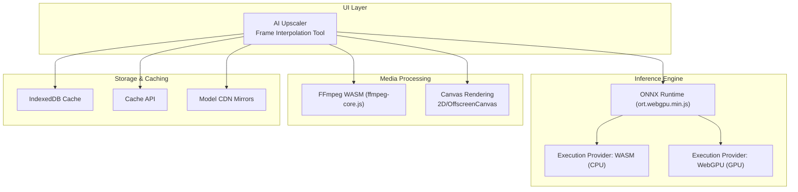
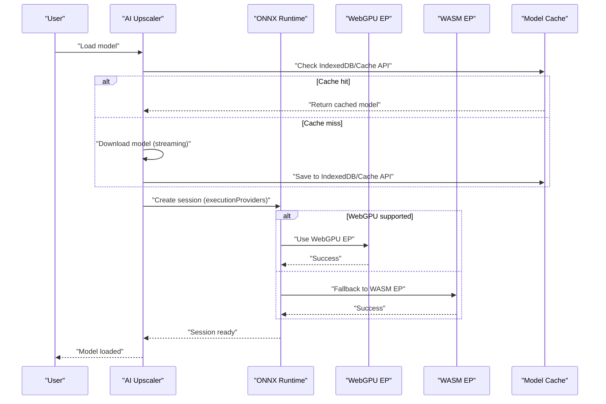
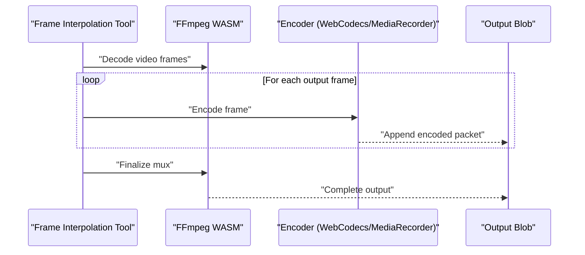
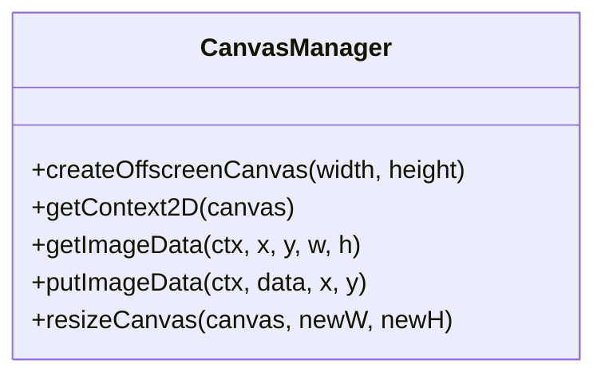
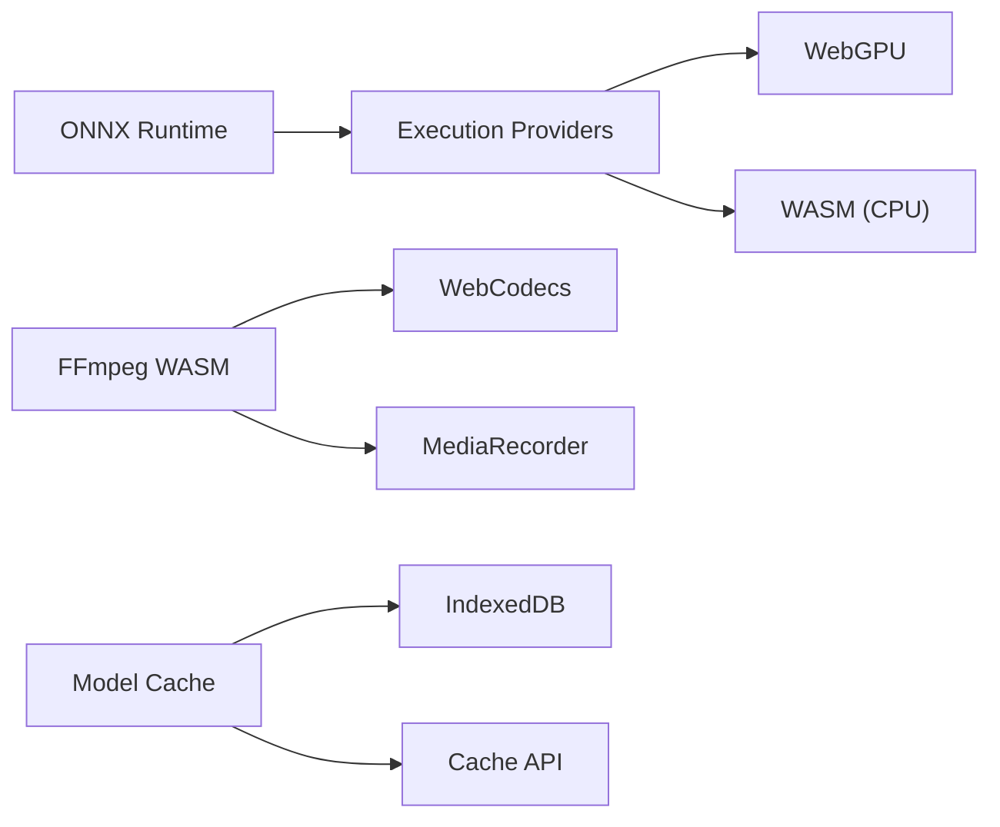

# Performance Optimization

<cite>
**Referenced Files in This Document**
- [ai_upscale.js](file://js/ai_upscale.js)
- [ai_frame_interpolation.js](file://js/ai_frame_interpolation.js)
- [ffmpeg-core.js](file://third_part/ffmpeg-wasm/ffmpeg-core.js)
- [ort.webgpu.min.js](file://third_part/onnxruntime-web/1.17.1/ort.webgpu.min.js)
</cite>

## Table of Contents
1. [Introduction](#introduction)
2. [Project Structure](#project-structure)
3. [Core Components](#core-components)
4. [Architecture Overview](#architecture-overview)
5. [Detailed Component Analysis](#detailed-component-analysis)
6. [Dependency Analysis](#dependency-analysis)
7. [Performance Considerations](#performance-considerations)
8. [Troubleshooting Guide](#troubleshooting-guide)
9. [Conclusion](#conclusion)

## Introduction
This document provides a comprehensive performance optimization guide for a Web-based multimedia toolkit leveraging WebAssembly (WASM), WebGPU acceleration, and ONNX Runtime inference. It covers execution provider patterns (CPU/GPU/WebGPU), hardware acceleration detection, fallback mechanisms, FFmpeg WASM integration, canvas optimization, and efficient image/video processing pipelines. It also includes performance monitoring, profiling techniques, bottleneck identification, and practical strategies for large file processing, memory footprint reduction, and improved user experience across devices.

## Project Structure
The performance-critical modules are organized around:
- ONNX Runtime integration via onnxruntime-web (WebGPU/CPU/WASM)
- FFmpeg WASM pipeline for video processing
- Canvas-based image manipulation and rendering
- Model caching and download strategies to reduce latency and bandwidth

**Diagram sources**
- [ai_upscale.js](file://js/ai_upscale.js)
- [ai_frame_interpolation.js](file://js/ai_frame_interpolation.js)
- [ort.webgpu.min.js](file://third_part/onnxruntime-web/1.17.1/ort.webgpu.min.js)
- [ffmpeg-core.js](file://third_part/ffmpeg-wasm/ffmpeg-core.js)

**Section sources**
- [ai_upscale.js](file://js/ai_upscale.js)
- [ai_frame_interpolation.js](file://js/ai_frame_interpolation.js)
- [ort.webgpu.min.js](file://third_part/onnxruntime-web/1.17.1/ort.webgpu.min.js)
- [ffmpeg-core.js](file://third_part/ffmpeg-wasm/ffmpeg-core.js)

## Core Components
- ONNX Runtime with WebGPU/CPU/WASM execution providers and configurable graph optimization
- FFmpeg WASM for video decoding, filtering, and encoding
- Canvas-based image processing with OffscreenCanvas for background computation
- Model caching via IndexedDB and Cache API with multi-source fallback
- Progressive enhancement and fallback strategies for diverse environments

**Section sources**
- [ai_upscale.js](file://js/ai_upscale.js)
- [ai_frame_interpolation.js](file://js/ai_frame_interpolation.js)
- [ort.webgpu.min.js](file://third_part/onnxruntime-web/1.17.1/ort.webgpu.min.js)
- [ffmpeg-core.js](file://third_part/ffmpeg-wasm/ffmpeg-core.js)

## Architecture Overview
The system orchestrates inference and media processing with performance-sensitive paths:
- Execution provider selection prioritizes WebGPU for GPU acceleration, with WASM fallback for CPU
- Model downloads use streaming with progress reporting and multi-source redundancy
- Media processing leverages canvas for pixel manipulation and FFmpeg WASM for container/codec operations
- Caching reduces repeated network overhead and accelerates subsequent runs

**Diagram sources**
- [ai_upscale.js](file://js/ai_upscale.js)
- [ai_frame_interpolation.js](file://js/ai_frame_interpolation.js)
- [ort.webgpu.min.js](file://third_part/onnxruntime-web/1.17.1/ort.webgpu.min.js)

## Detailed Component Analysis

### ONNX Runtime Execution Providers and Hardware Acceleration Detection
- Execution provider selection:
  - Preferred order: WebGPU → WASM (CPU)
  - Strict GPU mode option forces WebGPU-only sessions
- Environment configuration:
  - Single-threaded WASM for compatibility
  - SIMD enabled for WASM acceleration
  - CDN-hosted WASM binaries for reduced latency
- Graph optimization:
  - Disabled optimization for WebGPU to avoid compatibility issues
  - Full optimization for CPU mode to maximize throughput

**Diagram sources**
- [ai_upscale.js](file://js/ai_upscale.js)
- [ai_frame_interpolation.js](file://js/ai_frame_interpolation.js)
- [ort.webgpu.min.js](file://third_part/onnxruntime-web/1.17.1/ort.webgpu.min.js)

**Section sources**
- [ai_upscale.js](file://js/ai_upscale.js)
- [ai_frame_interpolation.js](file://js/ai_frame_interpolation.js)
- [ort.webgpu.min.js](file://third_part/onnxruntime-web/1.17.1/ort.webgpu.min.js)

### Model Download, Caching, and Fallback Strategies
- Multi-source model URLs with automatic fallback
- Streaming downloads with progress updates
- Dual caching: IndexedDB (primary) and Cache API (secondary)
- Automatic cache migration and staleness handling

**Diagram sources**
- [ai_upscale.js](file://js/ai_upscale.js)
- [ai_frame_interpolation.js](file://js/ai_frame_interpolation.js)

**Section sources**
- [ai_upscale.js](file://js/ai_upscale.js)
- [ai_frame_interpolation.js](file://js/ai_frame_interpolation.js)

### FFmpeg WASM Integration and Encoding Pipelines
- FFmpeg WASM core with streaming download and progress callbacks
- Two encoding paths:
  - WebCodecs/Mp4Muxer for modern browsers
  - MediaRecorder fallback for broader compatibility
- Canvas frames fed into encoder with configurable FPS and resolution

**Diagram sources**
- [ai_frame_interpolation.js](file://js/ai_frame_interpolation.js)
- [ffmpeg-core.js](file://third_part/ffmpeg-wasm/ffmpeg-core.js)

**Section sources**
- [ai_frame_interpolation.js](file://js/ai_frame_interpolation.js)
- [ffmpeg-core.js](file://third_part/ffmpeg-wasm/ffmpeg-core.js)

### Canvas Optimization Techniques
- OffscreenCanvas for background processing to prevent UI blocking
- willReadFrequently contexts for frequent getImageData/putImageData
- Reuse canvases and contexts to minimize allocations
- Efficient pixel manipulation via ImageData and 2D context

**Diagram sources**
- [ai_frame_interpolation.js](file://js/ai_frame_interpolation.js)

**Section sources**
- [ai_frame_interpolation.js](file://js/ai_frame_interpolation.js)

### Memory Management Strategies
- Canvas reuse and explicit clearing to avoid leaks
- Temporary buffers and typed arrays managed carefully
- Large object URL revocation after download completion
- Motion cache with bounded size to reduce recomputation

**Section sources**
- [ai_frame_interpolation.js](file://js/ai_frame_interpolation.js)

## Dependency Analysis
- ONNX Runtime depends on WebGPU availability; falls back to WASM when unsupported
- FFmpeg WASM depends on browser APIs (WebCodecs or MediaRecorder) and Canvas
- Model caching depends on IndexedDB and Cache API availability

**Diagram sources**
- [ai_upscale.js](file://js/ai_upscale.js)
- [ai_frame_interpolation.js](file://js/ai_frame_interpolation.js)
- [ort.webgpu.min.js](file://third_part/onnxruntime-web/1.17.1/ort.webgpu.min.js)
- [ffmpeg-core.js](file://third_part/ffmpeg-wasm/ffmpeg-core.js)

**Section sources**
- [ai_upscale.js](file://js/ai_upscale.js)
- [ai_frame_interpolation.js](file://js/ai_frame_interpolation.js)
- [ort.webgpu.min.js](file://third_part/onnxruntime-web/1.17.1/ort.webgpu.min.js)
- [ffmpeg-core.js](file://third_part/ffmpeg-wasm/ffmpeg-core.js)

## Performance Considerations
- Execution provider selection:
  - Prefer WebGPU for GPU acceleration; disable graph optimizations to avoid compatibility issues
  - Use WASM with full optimizations for CPU-bound scenarios
- Model loading:
  - Stream model downloads with progress; cache aggressively
  - Use multiple CDN mirrors for resilience
- Canvas processing:
  - Use OffscreenCanvas for heavy computations
  - Minimize context switches and allocations
- Video encoding:
  - Prefer WebCodecs/Mp4Muxer when available; otherwise fall back to MediaRecorder
  - Tune FPS and resolution to balance quality and throughput
- Memory:
  - Reuse canvases and typed arrays
  - Dispose of temporary object URLs promptly
  - Monitor memory growth and trigger GC-friendly pauses for large files

[No sources needed since this section provides general guidance]

## Troubleshooting Guide
- WebGPU not available:
  - Switch to CPU mode; verify browser support and update browser
- Model load failures:
  - Check network connectivity and CDN fallbacks
  - Clear cache and retry
- Slow processing:
  - Reduce resolution or FPS
  - Use CPU mode for stability if GPU mode is unstable
- Canvas artifacts:
  - Ensure proper sizing and coordinate alignment
  - Avoid excessive context switching

**Section sources**
- [ai_upscale.js](file://js/ai_upscale.js)
- [ai_frame_interpolation.js](file://js/ai_frame_interpolation.js)

## Conclusion
By combining WebGPU acceleration with robust CPU fallbacks, efficient model caching, and optimized canvas/FFmpeg WASM pipelines, the system achieves strong performance across diverse environments. Prioritize WebGPU for speed, maintain WASM for compatibility, and apply memory-conscious patterns to handle large files gracefully. Use progressive enhancement and performance monitoring to continuously improve user experience.

[No sources needed since this section summarizes without analyzing specific files]