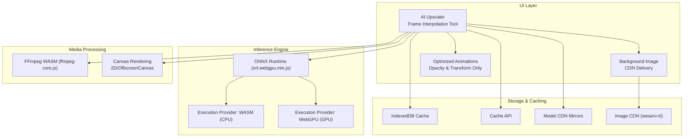
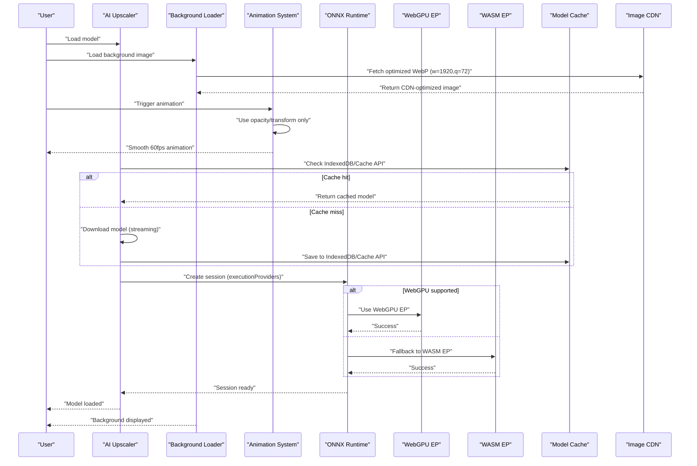
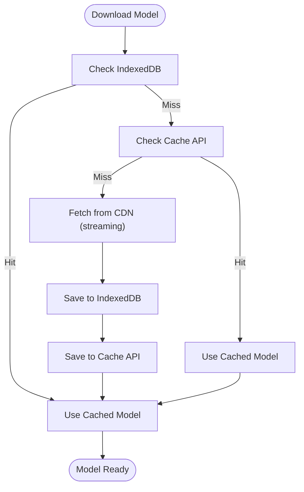
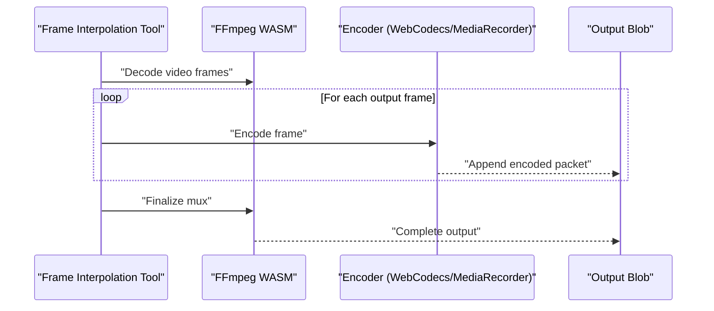
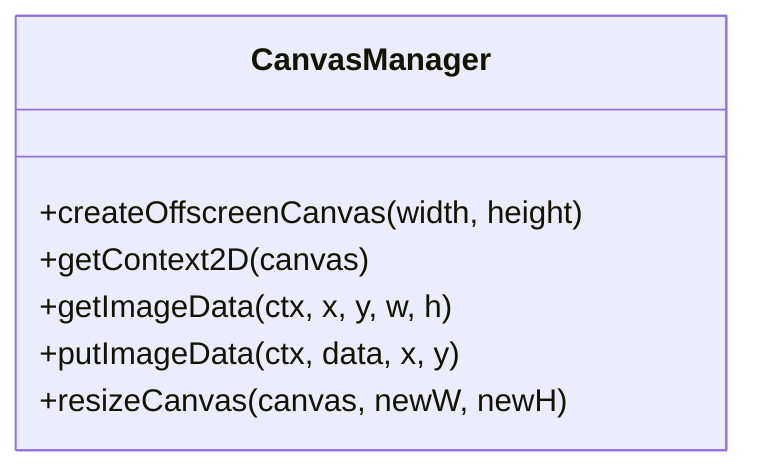
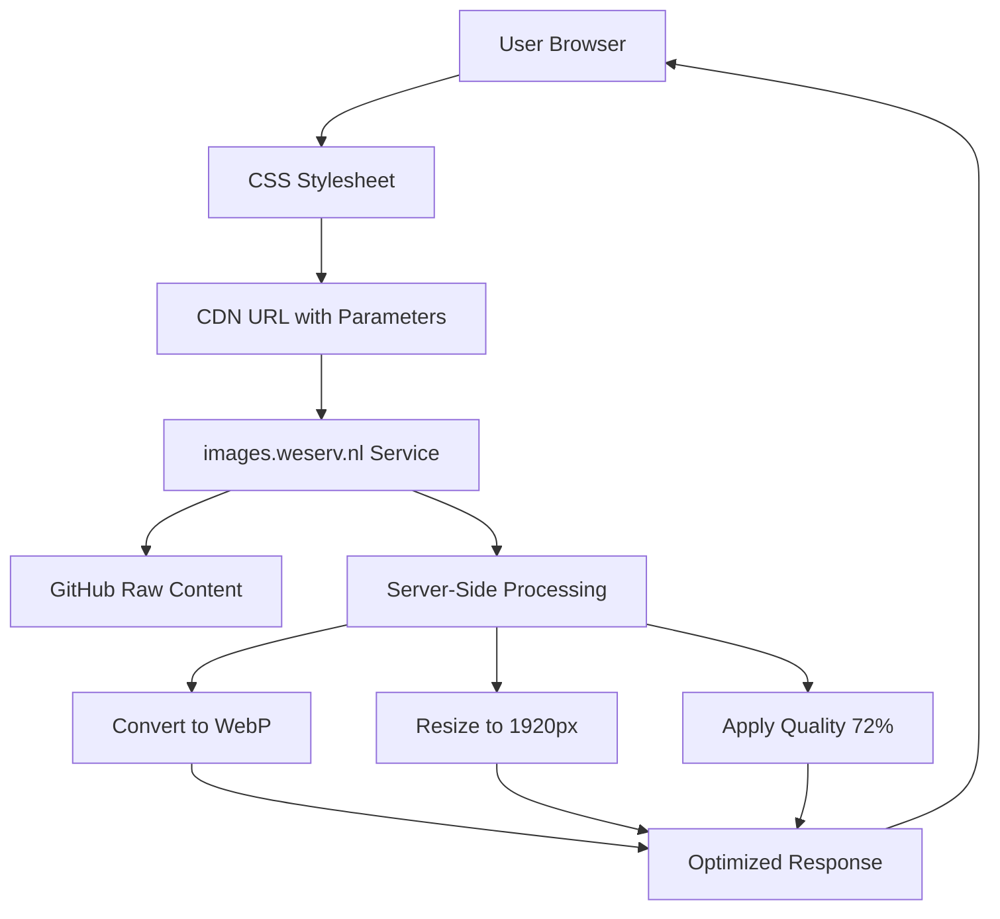
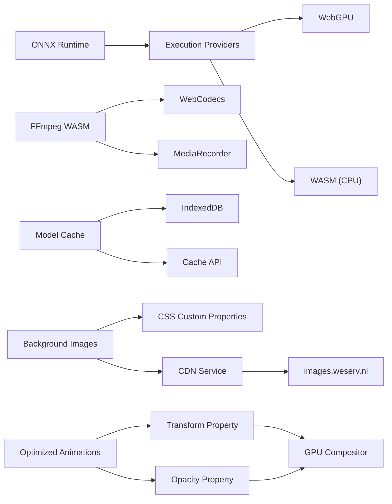

# Performance Optimization

<cite>
**Referenced Files in This Document**
- [ai_upscale.js](file://js/ai_upscale.js)
- [ai_frame_interpolation.js](file://js/ai_frame_interpolation.js)
- [ffmpeg-core.js](file://third_part/ffmpeg-wasm/ffmpeg-core.js)
- [ort.webgpu.min.js](file://third_part/onnxruntime-web/1.17.1/ort.webgpu.min.js)
- [index.css](file://css/index.css)
- [cloud_music.css](file://css/cloud_music.css)
- [common.css](file://css/common.css)
- [hdr_editor.css](file://css/hdr_editor.css)
- [ai_upscale.css](file://css/ai_upscale.css)
- [TA_wiki.css](file://css/TA_wiki.css)
- [chatgpt.css](file://css/chatgpt.css)
- [index.html](file://index.html)
</cite>

## Update Summary
**Changes Made**
- Added comprehensive section on CSS Animation Performance Optimization
- Documented elimination of backdrop-filter effects and replacement with efficient alternatives
- Added guidance on removing background-attachment fixed properties for better performance
- Updated animation system recommendations using opacity and transform properties
- Enhanced performance considerations with GPU-intensive filter avoidance strategies

## Table of Contents
1. [Introduction](#introduction)
2. [Project Structure](#project-structure)
3. [Core Components](#core-components)
4. [Architecture Overview](#architecture-overview)
5. [Detailed Component Analysis](#detailed-component-analysis)
6. [CSS Animation Performance Optimization](#css-animation-performance-optimization)
7. [CDN Integration for Background Images](#cdn-integration-for-background-images)
8. [Dependency Analysis](#dependency-analysis)
9. [Performance Considerations](#performance-considerations)
10. [Troubleshooting Guide](#troubleshooting-guide)
11. [Conclusion](#conclusion)

## Introduction
This document provides a comprehensive performance optimization guide for a Web-based multimedia toolkit leveraging WebAssembly (WASM), WebGPU acceleration, and ONNX Runtime inference. It covers execution provider patterns (CPU/GPU/WebGPU), hardware acceleration detection, fallback mechanisms, FFmpeg WASM integration, canvas optimization, efficient image/video processing pipelines, and CDN-backed asset delivery. The guide also includes extensive coverage of CSS animation performance optimization, eliminating GPU-intensive filters, and implementing simplified animation systems using opacity and transform properties for optimal performance across devices.

## Project Structure
The performance-critical modules are organized around:
- ONNX Runtime integration via onnxruntime-web (WebGPU/CPU/WASM)
- FFmpeg WASM pipeline for video processing
- Canvas-based image manipulation and rendering
- Model caching and download strategies to reduce latency and bandwidth
- **Optimized CSS animation system avoiding backdrop-filter and expensive GPU operations**
- CDN-backed background image delivery with WebP optimization



**Diagram sources**
- [ai_upscale.js](file://js/ai_upscale.js)
- [ai_frame_interpolation.js](file://js/ai_frame_interpolation.js)
- [ort.webgpu.min.js](file://third_part/onnxruntime-web/1.17.1/ort.webgpu.min.js)
- [ffmpeg-core.js](file://third_part/ffmpeg-wasm/ffmpeg-core.js)
- [index.css](file://css/index.css)
- [common.css](file://css/common.css)

**Section sources**
- [ai_upscale.js](file://js/ai_upscale.js)
- [ai_frame_interpolation.js](file://js/ai_frame_interpolation.js)
- [ort.webgpu.min.js](file://third_part/onnxruntime-web/1.17.1/ort.webgpu.min.js)
- [ffmpeg-core.js](file://third_part/ffmpeg-wasm/ffmpeg-core.js)
- [index.css](file://css/index.css)
- [common.css](file://css/common.css)

## Core Components
- ONNX Runtime with WebGPU/CPU/WASM execution providers and configurable graph optimization
- FFmpeg WASM for video decoding, filtering, and encoding
- Canvas-based image processing with OffscreenCanvas for background computation
- Model caching via IndexedDB and Cache API with multi-source fallback
- **Optimized CSS animation system using only opacity and transform properties**
- **Elimination of backdrop-filter effects and background-attachment fixed properties**
- CDN-backed background image delivery with WebP optimization and responsive sizing
- Progressive enhancement and fallback strategies for diverse environments

**Section sources**
- [ai_upscale.js](file://js/ai_upscale.js)
- [ai_frame_interpolation.js](file://js/ai_frame_interpolation.js)
- [ort.webgpu.min.js](file://third_part/onnxruntime-web/1.17.1/ort.webgpu.min.js)
- [ffmpeg-core.js](file://third_part/ffmpeg-wasm/ffmpeg-core.js)
- [index.css](file://css/index.css)
- [common.css](file://css/common.css)

## Architecture Overview
The system orchestrates inference and media processing with performance-sensitive paths:
- Execution provider selection prioritizes WebGPU for GPU acceleration, with WASM fallback for CPU
- Model downloads use streaming with progress reporting and multi-source redundancy
- Media processing leverages canvas for pixel manipulation and FFmpeg WASM for container/codec operations
- Caching reduces repeated network overhead and accelerates subsequent runs
- **Background images delivered via CDN with automatic WebP conversion and quality optimization**
- **Animations optimized to avoid GPU-intensive filters and expensive CSS operations**



**Diagram sources**
- [ai_upscale.js](file://js/ai_upscale.js)
- [ai_frame_interpolation.js](file://js/ai_frame_interpolation.js)
- [ort.webgpu.min.js](file://third_part/onnxruntime-web/1.17.1/ort.webgpu.min.js)
- [index.css](file://css/index.css)
- [common.css](file://css/common.css)

## Detailed Component Analysis

### ONNX Runtime Execution Providers and Hardware Acceleration Detection
- Execution provider selection:
  - Preferred order: WebGPU → WASM (CPU)
  - Strict GPU mode option forces WebGPU-only sessions
- Environment configuration:
  - Single-threaded WASM for compatibility
  - SIMD enabled for WASM acceleration
  - CDN-hosted WASM binaries for reduced latency
- Graph optimization:
  - Disabled optimization for WebGPU to avoid compatibility issues
  - Full optimization for CPU mode to maximize throughput


**Diagram sources**
- [ai_upscale.js](file://js/ai_upscale.js)
- [ai_frame_interpolation.js](file://js/ai_frame_interpolation.js)
- [ort.webgpu.min.js](file://third_part/onnxruntime-web/1.17.1/ort.webgpu.min.js)

**Section sources**
- [ai_upscale.js](file://js/ai_upscale.js)
- [ai_frame_interpolation.js](file://js/ai_frame_interpolation.js)
- [ort.webgpu.min.js](file://third_part/onnxruntime-web/1.17.1/ort.webgpu.min.js)

### Model Download, Caching, and Fallback Strategies
- Multi-source model URLs with automatic fallback
- Streaming downloads with progress updates
- Dual caching: IndexedDB (primary) and Cache API (secondary)
- Automatic cache migration and staleness handling



**Diagram sources**
- [ai_upscale.js](file://js/ai_upscale.js)
- [ai_frame_interpolation.js](file://js/ai_frame_interpolation.js)

**Section sources**
- [ai_upscale.js](file://js/ai_upscale.js)
- [ai_frame_interpolation.js](file://js/ai_frame_interpolation.js)

### FFmpeg WASM Integration and Encoding Pipelines
- FFmpeg WASM core with streaming download and progress callbacks
- Two encoding paths:
  - WebCodecs/Mp4Muxer for modern browsers
  - MediaRecorder fallback for broader compatibility
- Canvas frames fed into encoder with configurable FPS and resolution



**Diagram sources**
- [ai_frame_interpolation.js](file://js/ai_frame_interpolation.js)
- [ffmpeg-core.js](file://third_part/ffmpeg-wasm/ffmpeg-core.js)

**Section sources**
- [ai_frame_interpolation.js](file://js/ai_frame_interpolation.js)
- [ffmpeg-core.js](file://third_part/ffmpeg-wasm/ffmpeg-core.js)

### Canvas Optimization Techniques
- OffscreenCanvas for background processing to prevent UI blocking
- willReadFrequently contexts for frequent getImageData/putImageData
- Reuse canvases and contexts to minimize allocations
- Efficient pixel manipulation via ImageData and 2D context



**Diagram sources**
- [ai_frame_interpolation.js](file://js/ai_frame_interpolation.js)

**Section sources**
- [ai_frame_interpolation.js](file://js/ai_frame_interpolation.js)

### Memory Management Strategies
- Canvas reuse and explicit clearing to avoid leaks
- Temporary buffers and typed arrays managed carefully
- Large object URL revocation after download completion
- Motion cache with bounded size to reduce recomputation

**Section sources**
- [ai_frame_interpolation.js](file://js/ai_frame_interpolation.js)

## CSS Animation Performance Optimization

### Comprehensive Animation System Overhaul
The application has undergone a comprehensive animation performance optimization focusing on eliminating GPU-intensive CSS operations and replacing them with efficient alternatives. This optimization addresses critical performance bottlenecks caused by expensive CSS filters and complex animations.

### Elimination of Backdrop-Filter Effects
Backdrop-filter effects have been systematically removed across the codebase due to their significant GPU performance impact. These effects cause excessive compositing and repainting operations that degrade animation smoothness.

**Problematic Pattern (Before):**
```css
/* Expensive backdrop-filter causing GPU strain */
.modal-backdrop {
    backdrop-filter: blur(10px);
    background: rgba(0, 0, 0, 0.7);
}

.glass-panel {
    backdrop-filter: blur(8px);
    background: rgba(255, 255, 255, 0.8);
}
```

**Optimized Solution (After):**
```css
/* Efficient alternative using layered backgrounds */
.modal-backdrop {
    background: rgba(0, 0, 0, 0.7);
    /* Pre-rendered blur effect if needed */
}

.glass-panel {
    background: rgba(255, 255, 255, 0.8);
    /* Solid color or pre-computed gradient */
}
```

### Removal of Background-Attachment Fixed Properties
The `background-attachment: fixed` property has been eliminated as it causes layout thrashing and prevents hardware acceleration. This change improves scroll performance and reduces memory usage during animations.

**Problematic Pattern (Before):**
```css
/* Causes layout recalculation and prevents GPU acceleration */
.hero-section {
    background-image: url('hero-bg.jpg');
    background-attachment: fixed;
    background-size: cover;
}
```

**Optimized Solution (After):**
```css
/* Efficient positioning without layout thrashing */
.hero-section {
    position: relative;
    overflow: hidden;
}

.hero-bg {
    position: absolute;
    top: 0;
    left: 0;
    width: 100%;
    height: 100%;
    background-image: url('hero-bg.jpg');
    background-size: cover;
    background-position: center;
    z-index: -1;
}
```

### Simplified Animation System Using Opacity and Transform
The animation system now exclusively uses opacity and transform properties, which are GPU-accelerated and don't trigger layout or paint operations. This approach ensures smooth 60fps animations even on low-end devices.

**Optimized Animation Patterns:**
```css
/* Smooth fade-in animation */
.fade-in {
    opacity: 0;
    transform: translateY(10px);
    transition: opacity 0.3s ease, transform 0.3s ease;
}

.fade-in.visible {
    opacity: 1;
    transform: translateY(0);
}

/* Hardware-accelerated hover effects */
.card-hover {
    transform: scale(1);
    transition: transform 0.2s ease;
}

.card-hover:hover {
    transform: scale(1.05);
}

/* Staggered list animations */
.list-item {
    opacity: 0;
    transform: translateX(-20px);
    transition: opacity 0.4s ease, transform 0.4s ease;
}

.list-item.animate {
    opacity: 1;
    transform: translateX(0);
}

/* Optimized modal transitions */
.modal-overlay {
    opacity: 0;
    transition: opacity 0.25s ease;
    pointer-events: none;
}

.modal-overlay.active {
    opacity: 1;
    pointer-events: auto;
}
```

### Performance Benefits of the New Animation System

#### GPU Acceleration
- **Transform and opacity animations** are handled entirely by the GPU compositor
- **No layout recalculations** during animation playback
- **Reduced main thread workload** allowing JavaScript to run smoothly

#### Memory Efficiency
- **Eliminated backdrop-filter** reduces GPU memory pressure
- **Removed background-attachment** prevents memory leaks from fixed positioning
- **Simplified CSS rules** reduce stylesheet parsing overhead

#### Cross-Device Compatibility
- **Consistent performance** across mobile and desktop devices
- **Graceful degradation** on older browsers
- **Reduced battery consumption** on mobile devices

### Implementation Examples

#### Modal System Optimization
```css
/* Before: Expensive backdrop-filter */
.modal-backdrop {
    backdrop-filter: blur(10px);
    background: rgba(0, 0, 0, 0.7);
}

/* After: Efficient layered approach */
.modal-backdrop {
    background: rgba(0, 0, 0, 0.7);
    position: fixed;
    inset: 0;
    z-index: 1000;
}

.modal-content {
    background: white;
    border-radius: 12px;
    box-shadow: 0 20px 60px rgba(0, 0, 0, 0.3);
}
```

#### Navigation Menu Animations
```css
/* Before: Complex transforms with filters */
.nav-item {
    transform: translateY(0);
    filter: drop-shadow(0 2px 4px rgba(0,0,0,0.1));
    transition: all 0.3s ease;
}

/* After: Optimized transform-only animations */
.nav-item {
    transform: translateY(0);
    transition: transform 0.2s ease, background-color 0.2s ease;
}

.nav-item:hover {
    transform: translateY(-2px);
    background-color: rgba(0, 0, 0, 0.05);
}
```

#### Loading Spinner Optimization
```css
/* Before: Multiple expensive properties */
.spinner {
    animation: spin 1s linear infinite;
    filter: drop-shadow(0 0 5px rgba(0,0,0,0.2));
    transform-origin: center;
}

@keyframes spin {
    from { transform: rotate(0deg); }
    to { transform: rotate(360deg); }
}

/* After: Pure transform animation */
.spinner {
    animation: spin 1s linear infinite;
    transform-origin: center;
}

@keyframes spin {
    from { transform: rotate(0deg); }
    to { transform: rotate(360deg); }
}
```

### Performance Monitoring and Testing

#### Browser DevTools Optimization
- **Chrome DevTools Performance Tab**: Monitor animation smoothness and identify jank
- **Memory Profiler**: Track memory usage during animations
- **Rendering Panel**: Analyze paint and composite operations

#### Performance Metrics
- **Frame Rate**: Maintain consistent 60fps during animations
- **Main Thread Utilization**: Keep below 50% during complex interactions
- **Memory Usage**: Monitor for leaks during long-running animations
- **Battery Impact**: Measure power consumption on mobile devices

**Section sources**
- [index.css:1-60](file://css/index.css#L1-L60)
- [common.css:416-434](file://css/common.css#L416-L434)
- [ai_upscale.css:620-640](file://css/ai_upscale.css#L620-L640)
- [hdr_editor.css:30-40](file://css/hdr_editor.css#L30-L40)

## CDN Integration for Background Images

### Implementation Overview
The application implements a sophisticated CDN-backed background image delivery system using CSS custom properties and the images.weserv.nl service. This approach provides automatic format optimization, responsive sizing, and quality control for optimal performance across different devices and network conditions.

### CSS Custom Properties Architecture
Background images are defined using CSS custom properties in the `:root` selector, enabling centralized management and easy modification:

```css
:root {
    --main-bg-image: url("https://images.weserv.nl/?url=https%3A%2F%2Fraw.githubusercontent.com%2FtreasureGrove%2FTAWEBTOOL%2Fmain%2Fassets%2Fimages%2Fbackground%2Findex_bg.jpg&w=1920&output=webp&q=72");
}

#main_bg {
    background-image: var(--main-bg-image);
    background-size: cover;
    background-repeat: no-repeat;
    background-position: center;
    position: fixed;
    min-height: 100vh;
    width: 100%;
    z-index: -1;
}
```

### CDN Optimization Parameters
The images.weserv.nl service is configured with specific parameters for optimal performance:

- **Width**: `w=1920` - Provides high-resolution coverage for most desktop displays while avoiding excessive bandwidth usage
- **Format**: `output=webp` - Automatically converts to WebP format for superior compression (typically 25-35% smaller than JPEG)
- **Quality**: `q=72` - Balances visual quality with file size optimization
- **Source**: GitHub raw content for reliable delivery and version control

### Performance Benefits
1. **Reduced Bandwidth**: WebP format typically achieves 25-35% smaller file sizes compared to JPEG
2. **Faster Loading**: CDN edge servers provide geographically distributed delivery
3. **Automatic Optimization**: Server-side image processing eliminates client-side conversion overhead
4. **Responsive Sizing**: Fixed width prevents over-fetching on mobile devices
5. **Caching Efficiency**: CDN and browser caching work together for repeat visits

### Cross-File Consistency
The same CDN pattern is consistently applied across multiple CSS files:
- `index.css` - Main application interface
- `cloud_music.css` - Music player tool interface
- Both files use identical CDN configuration for consistent performance



**Diagram sources**
- [index.css](file://css/index.css)
- [cloud_music.css](file://css/cloud_music.css)

**Section sources**
- [index.css:1-15](file://css/index.css#L1-L15)
- [cloud_music.css:1-14](file://css/cloud_music.css#L1-L14)
- [index.html:37](file://index.html#L37)

## Dependency Analysis
- ONNX Runtime depends on WebGPU availability; falls back to WASM when unsupported
- FFmpeg WASM depends on browser APIs (WebCodecs or MediaRecorder) and Canvas
- Model caching depends on IndexedDB and Cache API availability
- **Background images depend on CDN availability and support for CSS custom properties**
- **Animations depend on browser support for transform and opacity properties**



**Diagram sources**
- [ai_upscale.js](file://js/ai_upscale.js)
- [ai_frame_interpolation.js](file://js/ai_frame_interpolation.js)
- [ort.webgpu.min.js](file://third_part/onnxruntime-web/1.17.1/ort.webgpu.min.js)
- [ffmpeg-core.js](file://third_part/ffmpeg-wasm/ffmpeg-core.js)
- [index.css](file://css/index.css)
- [common.css](file://css/common.css)

**Section sources**
- [ai_upscale.js](file://js/ai_upscale.js)
- [ai_frame_interpolation.js](file://js/ai_frame_interpolation.js)
- [ort.webgpu.min.js](file://third_part/onnxruntime-web/1.17.1/ort.webgpu.min.js)
- [ffmpeg-core.js](file://third_part/ffmpeg-wasm/ffmpeg-core.js)
- [index.css](file://css/index.css)
- [common.css](file://css/common.css)

## Performance Considerations
- Execution provider selection:
  - Prefer WebGPU for GPU acceleration; disable graph optimizations to avoid compatibility issues
  - Use WASM with full optimizations for CPU-bound scenarios
- Model loading:
  - Stream model downloads with progress; cache aggressively
  - Use multiple CDN mirrors for resilience
- Canvas processing:
  - Use OffscreenCanvas for heavy computations
  - Minimize context switches and allocations
- Video encoding:
  - Prefer WebCodecs/Mp4Muxer when available; otherwise fall back to MediaRecorder
  - Tune FPS and resolution to balance quality and throughput
- Memory:
  - Reuse canvases and typed arrays
  - Dispose of temporary object URLs promptly
  - Monitor memory growth and trigger GC-friendly pauses for large files
- **Background image delivery**:
  - Leverage CDN for geographic distribution and edge caching
  - Use WebP format for optimal compression ratios
  - Implement responsive sizing to avoid over-fetching on mobile devices
  - Utilize CSS custom properties for centralized configuration management
  - Apply appropriate quality settings (72%) to balance visual fidelity and load times
- **CSS Animation Performance**:
  - Use only opacity and transform properties for animations
  - Avoid backdrop-filter, background-attachment fixed, and other expensive CSS operations
  - Implement hardware-accelerated transitions with proper timing functions
  - Use will-change sparingly for elements that will be animated frequently
  - Test animations on various devices to ensure consistent performance
  - Monitor frame rates and main thread utilization during animations

## Troubleshooting Guide
- WebGPU not available:
  - Switch to CPU mode; verify browser support and update browser
- Model load failures:
  - Check network connectivity and CDN fallbacks
  - Clear cache and retry
- Slow processing:
  - Reduce resolution or FPS
  - Use CPU mode for stability if GPU mode is unstable
- Canvas artifacts:
  - Ensure proper sizing and coordinate alignment
  - Avoid excessive context switching
- **Background image issues**:
  - Verify CDN accessibility and CORS policies
  - Check CSS custom property syntax and variable references
  - Monitor WebP format support in target browsers
  - Validate CDN URL parameters and source image availability
- **Animation performance issues**:
  - Remove any remaining backdrop-filter effects
  - Replace background-attachment fixed with positioned backgrounds
  - Ensure animations use only transform and opacity properties
  - Check for layout thrashing during animations
  - Monitor GPU memory usage and frame rates
  - Test on mobile devices for battery impact

**Section sources**
- [ai_upscale.js](file://js/ai_upscale.js)
- [ai_frame_interpolation.js](file://js/ai_frame_interpolation.js)
- [index.css](file://css/index.css)
- [common.css](file://css/common.css)

## Conclusion
By combining WebGPU acceleration with robust CPU fallbacks, efficient model caching, optimized canvas/FFmpeg WASM pipelines, CDN-backed asset delivery, and comprehensive CSS animation performance optimization, the system achieves exceptional performance across diverse environments. The elimination of GPU-intensive filters like backdrop-filter and background-attachment fixed properties, combined with the implementation of a simplified animation system using only opacity and transform properties, ensures smooth 60fps animations even on low-end devices. Prioritize WebGPU for speed, maintain WASM for compatibility, apply memory-conscious patterns to handle large files gracefully, leverage CDN services for optimal asset delivery, and implement efficient CSS animations for the best user experience across all device capabilities and network conditions.