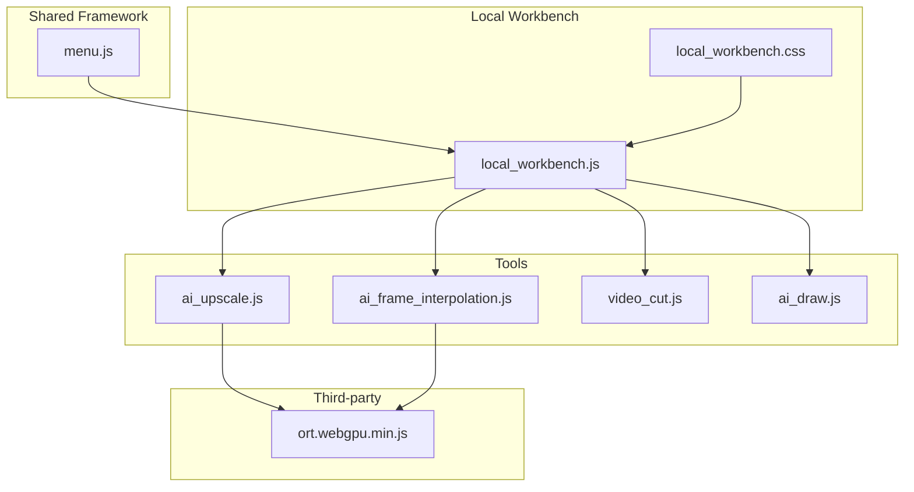
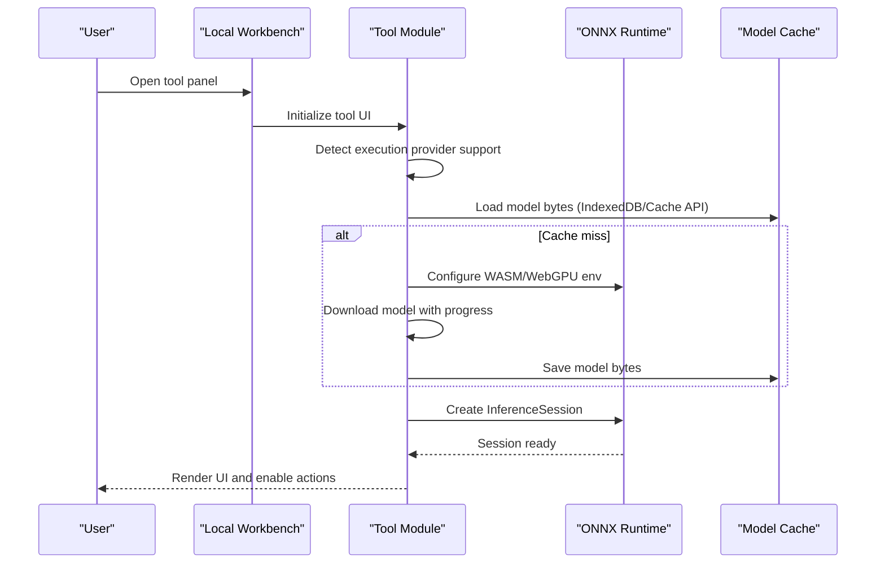
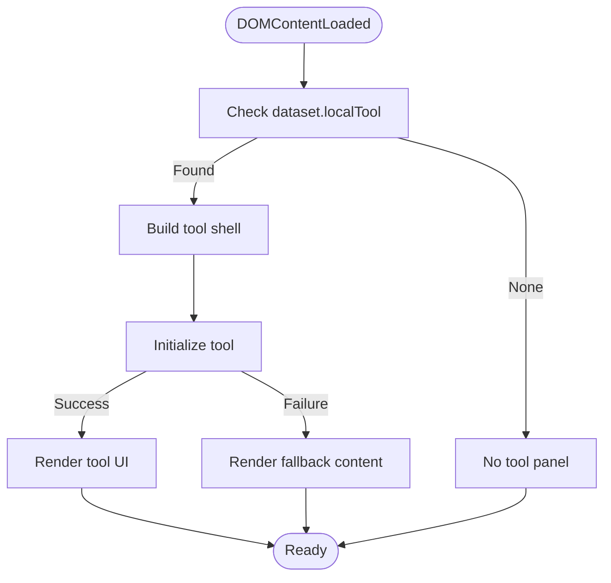
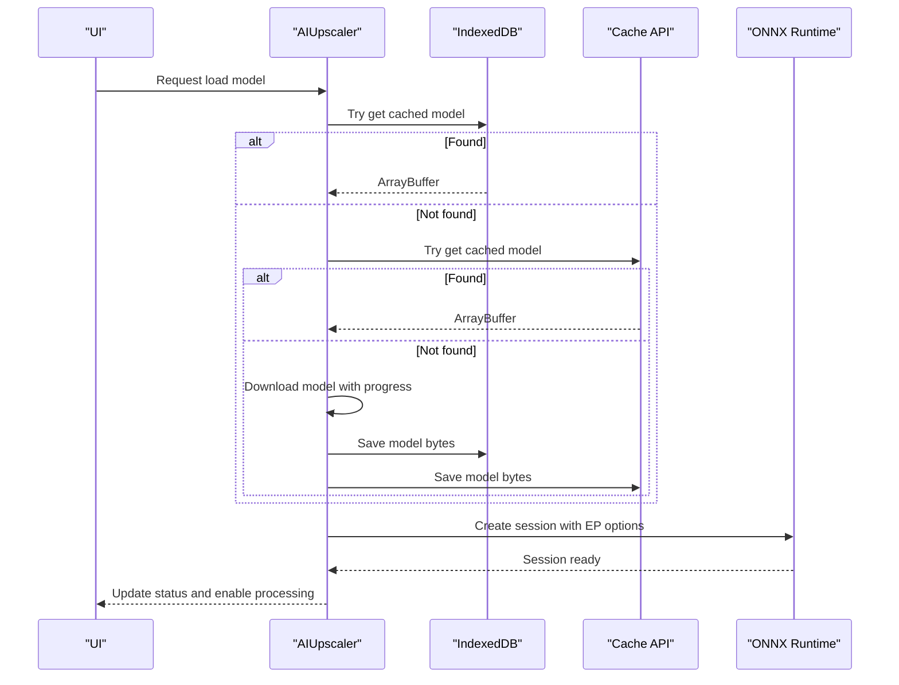
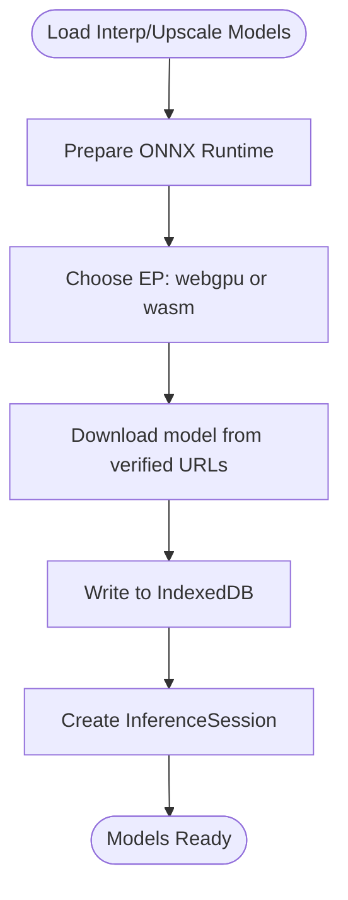
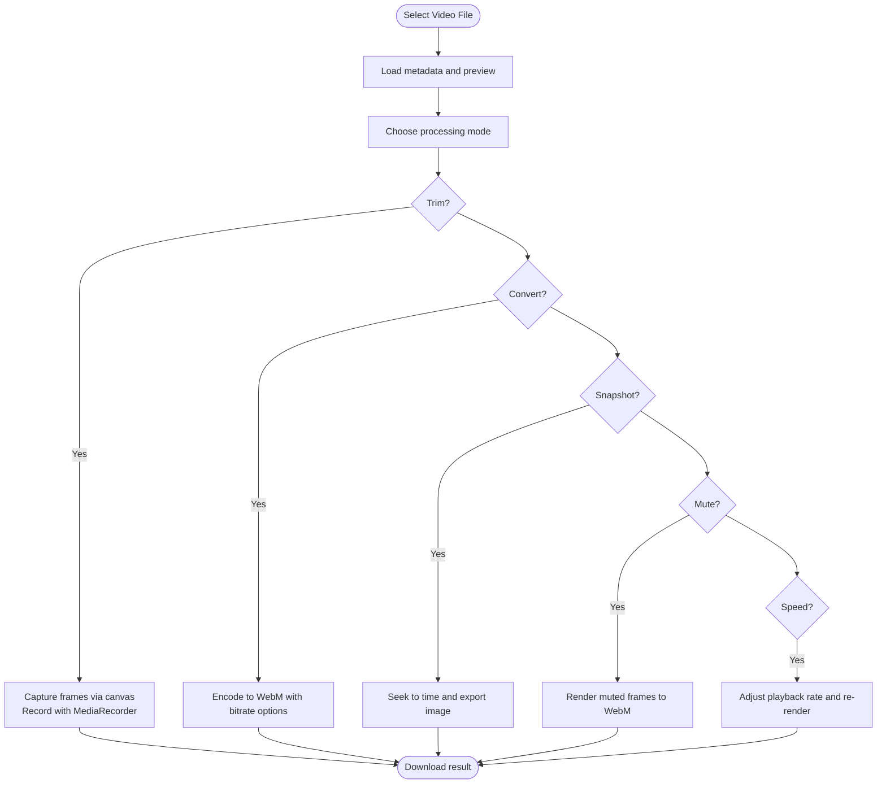
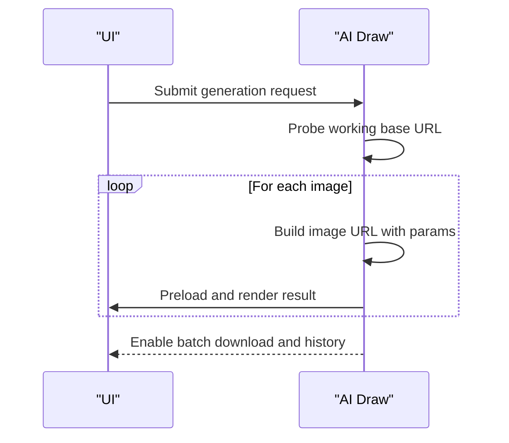
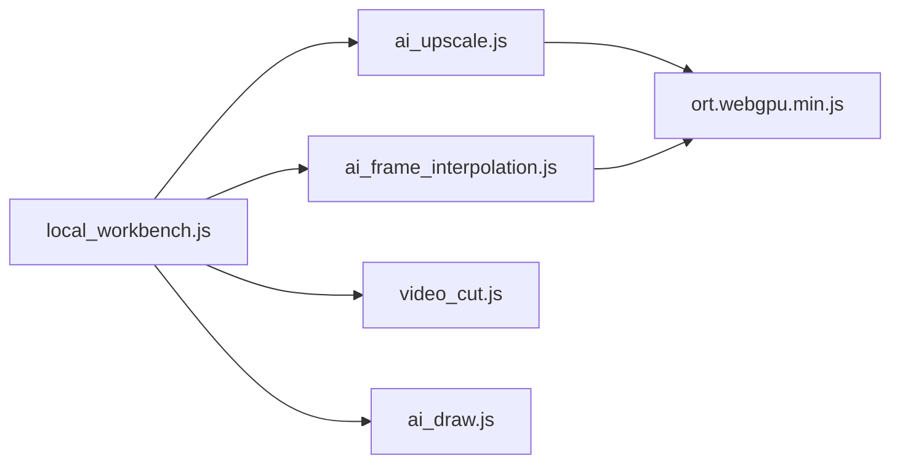

# Technical Implementation

<cite>
**Referenced Files in This Document**
- [local_workbench.js](file://js/local_workbench.js)
- [local_workbench.css](file://css/local_workbench.css)
- [ai_upscale.js](file://js/ai_upscale.js)
- [ai_frame_interpolation.js](file://js/ai_frame_interpolation.js)
- [video_cut.js](file://js/video_cut.js)
- [ai_draw.js](file://js/ai_draw.js)
- [menu.js](file://js/menu.js)
- [ort.webgpu.min.js](file://third_part/onnxruntime-web/1.17.1/ort.webgpu.min.js)
</cite>

## Table of Contents
1. [Introduction](#introduction)
2. [Project Structure](#project-structure)
3. [Core Components](#core-components)
4. [Architecture Overview](#architecture-overview)
5. [Detailed Component Analysis](#detailed-component-analysis)
6. [Dependency Analysis](#dependency-analysis)
7. [Performance Considerations](#performance-considerations)
8. [Troubleshooting Guide](#troubleshooting-guide)
9. [Conclusion](#conclusion)
10. [Appendices](#appendices)

## Introduction
This document explains the technical implementation of the TAWEBTOOL platform, focusing on the local workbench architecture, shared tool framework, and execution provider patterns for CPU/GPU/WebGPU acceleration. It covers ONNX model loading, caching strategies, fallback mechanisms, WebAssembly configuration, WebGPU acceleration setup, and browser compatibility detection. Practical guidance is included for extending the framework, adding new tools, and optimizing performance, along with memory management, error handling, and debugging techniques for complex workflows.

## Project Structure
The project organizes functionality by feature areas:
- Tools: individual capabilities such as AI upscaling, frame interpolation, video editing, and drawing.
- Local Workbench: a unified shell that hosts tools and manages their lifecycle.
- Shared Framework: common UI patterns, menu navigation, and tool initialization.
- Third-party Libraries: ONNX Runtime Web for inference and FFmpeg WASM for media processing.

**Diagram sources**
- [local_workbench.js:170-195](file://js/local_workbench.js#L170-L195)
- [local_workbench.css:1-33](file://css/local_workbench.css#L1-L33)
- [ai_upscale.js:83-101](file://js/ai_upscale.js#L83-L101)
- [ai_frame_interpolation.js:315-336](file://js/ai_frame_interpolation.js#L315-L336)
- [video_cut.js:5-57](file://js/video_cut.js#L5-L57)
- [ai_draw.js:23-152](file://js/ai_draw.js#L23-L152)
- [menu.js:1-43](file://js/menu.js#L1-L43)
- [ort.webgpu.min.js:1-12](file://third_part/onnxruntime-web/1.17.1/ort.webgpu.min.js#L1-L12)

**Section sources**
- [local_workbench.js:1-197](file://js/local_workbench.js#L1-L197)
- [local_workbench.css:1-33](file://css/local_workbench.css#L1-L33)
- [menu.js:1-43](file://js/menu.js#L1-L43)

## Core Components
- Local Workbench Shell: initializes tool panels, renders tool-specific UI, and handles fallbacks for external tools.
- Tool Framework: standardized DOM construction, event binding, and status reporting across tools.
- ONNX Runtime Integration: centralized configuration of WASM and WebGPU execution providers, model caching, and fallback logic.
- Media Processing: pure-browser video editing leveraging native APIs and optional FFmpeg WASM for advanced workflows.

Key implementation highlights:
- Tool registration and routing via dataset attributes and dynamic initialization.
- Unified UI shell with responsive cards and action buttons.
- Robust model loading with IndexedDB and Cache API fallbacks.
- Execution provider selection with explicit browser capability checks.

**Section sources**
- [local_workbench.js:4-195](file://js/local_workbench.js#L4-L195)
- [local_workbench.css:1-33](file://css/local_workbench.css#L1-L33)
- [ai_upscale.js:1-175](file://js/ai_upscale.js#L1-L175)
- [ai_frame_interpolation.js:1-98](file://js/ai_frame_interpolation.js#L1-L98)
- [video_cut.js:1-688](file://js/video_cut.js#L1-L688)

## Architecture Overview
The system follows a modular, tool-centric architecture:
- The Local Workbench loads a tool panel based on a dataset identifier and delegates rendering to tool-specific modules.
- Tools integrate ONNX Runtime for inference with configurable execution providers (WASM/CPU or WebGPU).
- Model caching ensures fast reuse across sessions using IndexedDB and Cache API.
- Media tools rely on native browser APIs for local processing, avoiding external dependencies.

**Diagram sources**
- [local_workbench.js:170-195](file://js/local_workbench.js#L170-L195)
- [ai_upscale.js:380-517](file://js/ai_upscale.js#L380-L517)
- [ai_frame_interpolation.js:377-495](file://js/ai_frame_interpolation.js#L377-L495)
- [ort.webgpu.min.js:1-12](file://third_part/onnxruntime-web/1.17.1/ort.webgpu.min.js#L1-L12)

## Detailed Component Analysis

### Local Workbench Shell
Responsibilities:
- Resolve tool panel identity from dataset attributes.
- Build a standardized card-based UI shell.
- Initialize tool-specific modules and handle fallbacks for external pages.
- Provide a unified CSS theme for consistent presentation.

Implementation patterns:
- Dynamic tool selection and conditional rendering.
- Fallback iframe rendering for external tools when local scripts are unavailable.
- Event-driven initialization with DOMContentLoaded guard.

**Diagram sources**
- [local_workbench.js:170-195](file://js/local_workbench.js#L170-L195)

**Section sources**
- [local_workbench.js:32-195](file://js/local_workbench.js#L32-L195)
- [local_workbench.css:1-33](file://css/local_workbench.css#L1-L33)

### AI Upscaler (ONNX)
Key features:
- Multi-model configuration with authoritative sources and mirrors.
- Automatic model caching using IndexedDB and Cache API.
- Execution provider selection with WebGPU-first strategy and CPU fallback.
- Progress reporting and status updates during download and inference.

Execution provider configuration:
- WebGPU mode: disables graph optimizations to maximize compatibility.
- CPU mode: enables optimizations and memory arena for performance.

**Diagram sources**
- [ai_upscale.js:190-293](file://js/ai_upscale.js#L190-L293)
- [ai_upscale.js:380-517](file://js/ai_upscale.js#L380-L517)

**Section sources**
- [ai_upscale.js:1-175](file://js/ai_upscale.js#L1-L175)
- [ai_upscale.js:190-293](file://js/ai_upscale.js#L190-L293)
- [ai_upscale.js:380-517](file://js/ai_upscale.js#L380-L517)

### AI Frame Interpolation (ONNX)
Highlights:
- Strict GPU mode enforcement for WebGPU stability.
- Multi-source model downloads with robust error reporting.
- IndexedDB-backed model cache with transactional writes.
- Signature detection for model compatibility and time-step inputs.

**Diagram sources**
- [ai_frame_interpolation.js:315-336](file://js/ai_frame_interpolation.js#L315-L336)
- [ai_frame_interpolation.js:367-375](file://js/ai_frame_interpolation.js#L367-L375)
- [ai_frame_interpolation.js:377-495](file://js/ai_frame_interpolation.js#L377-L495)

**Section sources**
- [ai_frame_interpolation.js:1-98](file://js/ai_frame_interpolation.js#L1-L98)
- [ai_frame_interpolation.js:315-394](file://js/ai_frame_interpolation.js#L315-L394)
- [ai_frame_interpolation.js:479-596](file://js/ai_frame_interpolation.js#L479-L596)

### Video Cut (Pure Browser)
Capabilities:
- Uses native browser APIs for trimming, conversion, snapshots, audio extraction, muting, and speed adjustment.
- Progress tracking and cancellation via AbortController.
- Canvas-based rendering pipeline for frame capture and encoding.

**Diagram sources**
- [video_cut.js:131-198](file://js/video_cut.js#L131-L198)
- [video_cut.js:200-258](file://js/video_cut.js#L200-L258)
- [video_cut.js:260-350](file://js/video_cut.js#L260-L350)
- [video_cut.js:351-486](file://js/video_cut.js#L351-L486)

**Section sources**
- [video_cut.js:1-688](file://js/video_cut.js#L1-L688)

### AI Draw (External API)
Features:
- Free Pollinations API integration with automatic base URL probing.
- Preset styles and quality profiles.
- History persistence and batch download.

**Diagram sources**
- [ai_draw.js:224-272](file://js/ai_draw.js#L224-L272)
- [ai_draw.js:312-352](file://js/ai_draw.js#L312-L352)

**Section sources**
- [ai_draw.js:1-438](file://js/ai_draw.js#L1-L438)

### Menu and Navigation
- Centralized menu data defines categories and items with searchable keywords.
- Dynamic sidebar generation and top-level search with highlighting and filtering.

**Section sources**
- [menu.js:1-273](file://js/menu.js#L1-L273)

## Dependency Analysis
- Tool-to-Tool Dependencies: None; tools are independent modules invoked by the workbench.
- Tool-to-Shared Dependencies: All tools depend on the workbench shell for initialization and UI scaffolding.
- Tool-to-External Dependencies: AI tools depend on ONNX Runtime; video tool depends on browser APIs; draw tool depends on external API endpoints.
- ONNX Runtime Integration: Both CPU (WASM) and GPU (WebGPU) execution providers are configured dynamically based on browser support.

**Diagram sources**
- [local_workbench.js:170-195](file://js/local_workbench.js#L170-L195)
- [ai_upscale.js:83-101](file://js/ai_upscale.js#L83-L101)
- [ai_frame_interpolation.js:315-336](file://js/ai_frame_interpolation.js#L315-L336)
- [ort.webgpu.min.js:1-12](file://third_part/onnxruntime-web/1.17.1/ort.webgpu.min.js#L1-L12)

**Section sources**
- [local_workbench.js:170-195](file://js/local_workbench.js#L170-L195)
- [ai_upscale.js:83-101](file://js/ai_upscale.js#L83-L101)
- [ai_frame_interpolation.js:315-336](file://js/ai_frame_interpolation.js#L315-L336)

## Performance Considerations
- Execution Provider Selection:
  - Prefer WebGPU for modern browsers; disable graph optimizations to avoid compatibility issues.
  - Fall back to WASM with optimizations enabled for broad compatibility.
- Model Loading:
  - Use IndexedDB for reliable caching; Cache API as secondary backup.
  - Stream downloads with progress reporting to improve perceived performance.
- Memory Management:
  - Revoke object URLs after use to prevent memory leaks.
  - Dispose of tensors and sessions when switching models or navigating away.
- Browser Compatibility:
  - Detect WebGPU availability before enabling GPU mode.
  - Warn users and suggest alternatives when unsupported.

[No sources needed since this section provides general guidance]

## Troubleshooting Guide
Common issues and resolutions:
- ONNX Runtime not found:
  - Ensure the runtime script is loaded before creating sessions.
  - Verify CDN availability and CORS policies.
- GPU Mode Failures:
  - Switch to CPU mode and retry.
  - Confirm browser supports WebGPU and is up to date.
- Model Loading Failures:
  - Clear cache and retry download.
  - Use verified model URLs and mirrors.
- Video Processing Errors:
  - Check file types and sizes; ensure origin allows cross-origin.
  - Use AbortController to cancel long-running tasks.

**Section sources**
- [ai_upscale.js:485-509](file://js/ai_upscale.js#L485-L509)
- [ai_frame_interpolation.js:338-354](file://js/ai_frame_interpolation.js#L338-L354)
- [video_cut.js:640-643](file://js/video_cut.js#L640-L643)

## Conclusion
The TAWEBTOOL framework combines a flexible local workbench with robust tool modules, centralized ONNX Runtime integration, and browser-native media processing. By leveraging execution provider selection, comprehensive caching, and graceful fallbacks, it delivers a reliable, high-performance environment for AI-powered and media workflows in the browser.

[No sources needed since this section summarizes without analyzing specific files]

## Appendices

### Extending the Framework
- Add a new tool:
  - Create a new HTML page and JS module following the existing tool pattern.
  - Register the tool in the workbench initializer and add a menu entry.
- Add a new execution provider:
  - Extend the provider selection logic to include new backends.
  - Update session creation options and fallback strategies.

**Section sources**
- [local_workbench.js:170-195](file://js/local_workbench.js#L170-L195)
- [menu.js:1-43](file://js/menu.js#L1-L43)

### WebAssembly and WebGPU Configuration
- WASM:
  - Single-threaded mode for compatibility.
  - SIMD enabled; proxy disabled to avoid worker permission issues.
- WebGPU:
  - Disable graph optimizations for compatibility.
  - Strict GPU mode enforced in frame interpolation.

**Section sources**
- [ai_upscale.js:83-101](file://js/ai_upscale.js#L83-L101)
- [ai_upscale.js:427-463](file://js/ai_upscale.js#L427-L463)
- [ai_frame_interpolation.js:326-335](file://js/ai_frame_interpolation.js#L326-L335)
- [ai_frame_interpolation.js:367-375](file://js/ai_frame_interpolation.js#L367-L375)

### Browser Compatibility Detection
- WebGPU availability check before enabling GPU mode.
- Feature detection for directory picker and save file picker for output modes.

**Section sources**
- [ai_upscale.js:147-175](file://js/ai_upscale.js#L147-L175)
- [ai_upscale.js:428-454](file://js/ai_upscale.js#L428-L454)