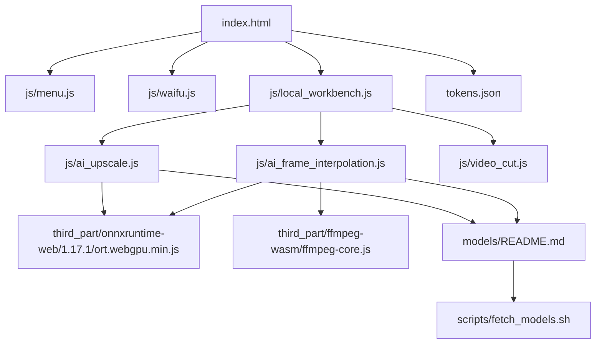
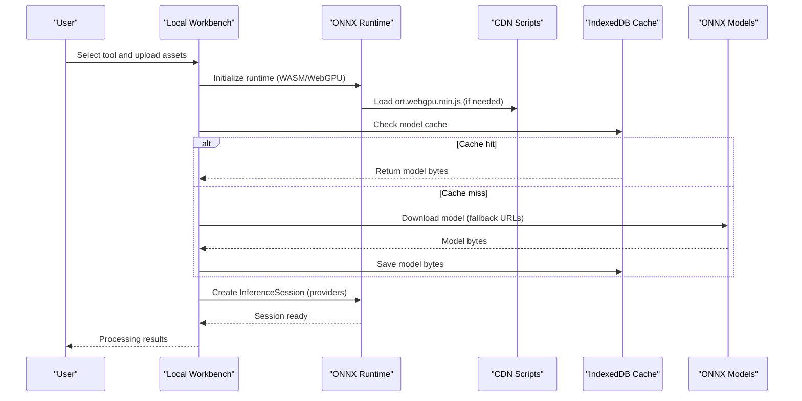
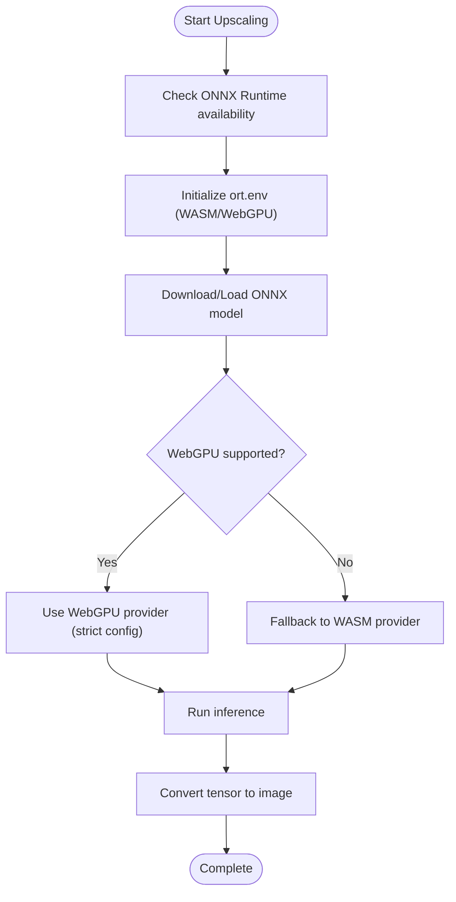
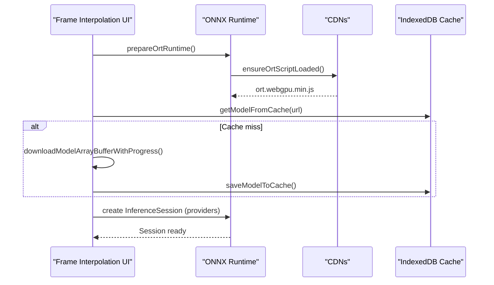
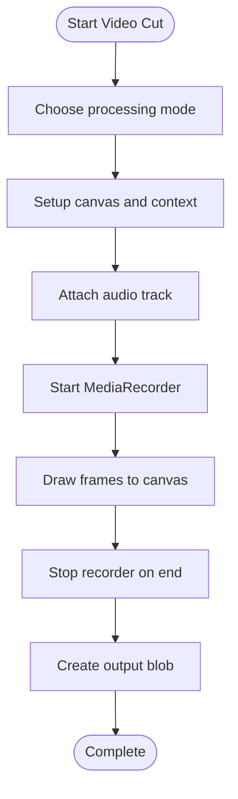
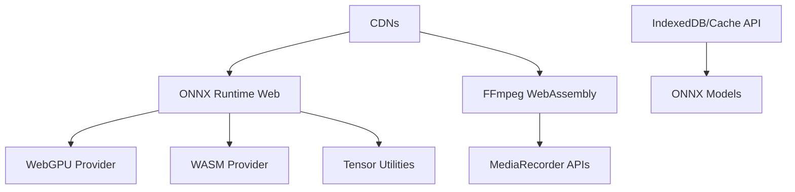

# Troubleshooting and FAQ

<cite>
**Referenced Files in This Document**
- [index.html](file://index.html)
- [menu.js](file://js/menu.js)
- [waifu.js](file://js/waifu.js)
- [local_workbench.js](file://js/local_workbench.js)
- [ai_upscale.js](file://js/ai_upscale.js)
- [ai_frame_interpolation.js](file://js/ai_frame_interpolation.js)
- [video_cut.js](file://js/video_cut.js)
- [onnxruntime-web/1.17.1/ort.webgpu.min.js](file://third_part/onnxruntime-web/1.17.1/ort.webgpu.min.js)
- [ffmpeg-wasm/ffmpeg-core.js](file://third_part/ffmpeg-wasm/ffmpeg-core.js)
- [models/README.md](file://models/README.md)
- [scripts/fetch_models.sh](file://scripts/fetch_models.sh)
- [tokens.json](file://tokens.json)
</cite>

## Table of Contents
1. [Introduction](#introduction)
2. [Project Structure](#project-structure)
3. [Core Components](#core-components)
4. [Architecture Overview](#architecture-overview)
5. [Detailed Component Analysis](#detailed-component-analysis)
6. [Dependency Analysis](#dependency-analysis)
7. [Performance Considerations](#performance-considerations)
8. [Troubleshooting Guide](#troubleshooting-guide)
9. [Conclusion](#conclusion)
10. [Appendices](#appendices)

## Introduction
This document provides comprehensive troubleshooting guidance for the TAWEBTOOL project, focusing on WebGPU/WebAssembly loading failures, model download errors, memory-related crashes, and performance optimization. It also includes diagnostic steps for browser compatibility issues, network connectivity problems, and practical FAQ answers for tool usage, system requirements, and feature limitations. The goal is to help users quickly identify and resolve common issues while maintaining optimal performance.

## Project Structure
The project is organized around modular JavaScript tools integrated into HTML pages. Key areas relevant to troubleshooting include:
- Tool entry points and navigation: [index.html](file://index.html), [menu.js](file://js/menu.js)
- Optional live2d widget: [waifu.js](file://js/waifu.js)
- Local workbench integration: [local_workbench.js](file://js/local_workbench.js)
- AI tools with ONNX Runtime: [ai_upscale.js](file://js/ai_upscale.js), [ai_frame_interpolation.js](file://js/ai_frame_interpolation.js)
- Pure-browser video editing: [video_cut.js](file://js/video_cut.js)
- Third-party libraries: [onnxruntime-web/1.17.1/ort.webgpu.min.js](file://third_part/onnxruntime-web/1.17.1/ort.webgpu.min.js), [ffmpeg-wasm/ffmpeg-core.js](file://third_part/ffmpeg-wasm/ffmpeg-core.js)
- Model hosting and fetching: [models/README.md](file://models/README.md), [scripts/fetch_models.sh](file://scripts/fetch_models.sh)
- Token configuration: [tokens.json](file://tokens.json)

**Diagram sources**
- [index.html](file://index.html)
- [menu.js](file://js/menu.js)
- [waifu.js](file://js/waifu.js)
- [local_workbench.js](file://js/local_workbench.js)
- [ai_upscale.js](file://js/ai_upscale.js)
- [ai_frame_interpolation.js](file://js/ai_frame_interpolation.js)
- [video_cut.js](file://js/video_cut.js)
- [onnxruntime-web/1.17.1/ort.webgpu.min.js](file://third_part/onnxruntime-web/1.17.1/ort.webgpu.min.js)
- [ffmpeg-wasm/ffmpeg-core.js](file://third_part/ffmpeg-wasm/ffmpeg-core.js)
- [models/README.md](file://models/README.md)
- [scripts/fetch_models.sh](file://scripts/fetch_models.sh)
- [tokens.json](file://tokens.json)

**Section sources**
- [index.html](file://index.html)
- [menu.js](file://js/menu.js)
- [waifu.js](file://js/waifu.js)
- [local_workbench.js](file://js/local_workbench.js)
- [ai_upscale.js](file://js/ai_upscale.js)
- [ai_frame_interpolation.js](file://js/ai_frame_interpolation.js)
- [video_cut.js](file://js/video_cut.js)
- [onnxruntime-web/1.17.1/ort.webgpu.min.js](file://third_part/onnxruntime-web/1.17.1/ort.webgpu.min.js)
- [ffmpeg-wasm/ffmpeg-core.js](file://third_part/ffmpeg-wasm/ffmpeg-core.js)
- [models/README.md](file://models/README.md)
- [scripts/fetch_models.sh](file://scripts/fetch_models.sh)
- [tokens.json](file://tokens.json)

## Core Components
- Navigation and search: [menu.js](file://js/menu.js) manages tool categories, search, and accordion behavior.
- Live2D widget: [waifu.js](file://js/waifu.js) dynamically loads a widget from a CDN with basic error handling.
- Local workbench: [local_workbench.js](file://js/local_workbench.js) embeds external tools via iframe and handles fallbacks.
- AI Upscaling: [ai_upscale.js](file://js/ai_upscale.js) integrates ONNX Runtime with WebGPU/CPU fallbacks, caching, and model download with progress.
- Frame Interpolation: [ai_frame_interpolation.js](file://js/ai_frame_interpolation.js) loads RIFE/ESRGAN models, supports multiple providers, and uses WebCodecs/MediaRecorder.
- Video Cutting: [video_cut.js](file://js/video_cut.js) performs pure-browser cutting, conversion, snapshots, audio extraction, muting, and speed changes using MediaRecorder APIs.
- ONNX Runtime: [onnxruntime-web/1.17.1/ort.webgpu.min.js](file://third_part/onnxruntime-web/1.17.1/ort.webgpu.min.js) provides WebGPU/CPU execution providers and tensor utilities.
- FFmpeg WebAssembly: [ffmpeg-wasm/ffmpeg-core.js](file://third_part/ffmpeg-wasm/ffmpeg-core.js) wraps ffmpeg for browser-based processing.
- Models and scripts: [models/README.md](file://models/README.md) and [scripts/fetch_models.sh](file://scripts/fetch_models.sh) manage model placement and automated fetching.
- Tokens: [tokens.json](file://tokens.json) stores service tokens for optional integrations.

**Section sources**
- [menu.js](file://js/menu.js)
- [waifu.js](file://js/waifu.js)
- [local_workbench.js](file://js/local_workbench.js)
- [ai_upscale.js](file://js/ai_upscale.js)
- [ai_frame_interpolation.js](file://js/ai_frame_interpolation.js)
- [video_cut.js](file://js/video_cut.js)
- [onnxruntime-web/1.17.1/ort.webgpu.min.js](file://third_part/onnxruntime-web/1.17.1/ort.webgpu.min.js)
- [ffmpeg-wasm/ffmpeg-core.js](file://third_part/ffmpeg-wasm/ffmpeg-core.js)
- [models/README.md](file://models/README.md)
- [scripts/fetch_models.sh](file://scripts/fetch_models.sh)
- [tokens.json](file://tokens.json)

## Architecture Overview
The system relies on:
- Browser-native APIs for video processing (MediaRecorder, Canvas, WebCodecs).
- ONNX Runtime Web for AI inference with WebGPU/CPU providers.
- Optional CDN-hosted libraries and local model storage.
- IndexedDB and Cache API for model caching.

**Diagram sources**
- [local_workbench.js](file://js/local_workbench.js)
- [ai_upscale.js](file://js/ai_upscale.js)
- [ai_frame_interpolation.js](file://js/ai_frame_interpolation.js)
- [onnxruntime-web/1.17.1/ort.webgpu.min.js](file://third_part/onnxruntime-web/1.17.1/ort.webgpu.min.js)
- [models/README.md](file://models/README.md)

## Detailed Component Analysis

### AI Upscaling Troubleshooting
Common issues:
- WebGPU/CPU provider selection and fallback.
- Model download progress and caching.
- Tensor data retrieval and validation.

Diagnostic steps:
- Verify ONNX Runtime initialization and provider selection.
- Monitor model download progress and fallback URLs.
- Inspect tensor location and data validity during output handling.

**Diagram sources**
- [ai_upscale.js](file://js/ai_upscale.js)
- [onnxruntime-web/1.17.1/ort.webgpu.min.js](file://third_part/onnxruntime-web/1.17.1/ort.webgpu.min.js)

**Section sources**
- [ai_upscale.js](file://js/ai_upscale.js)
- [onnxruntime-web/1.17.1/ort.webgpu.min.js](file://third_part/onnxruntime-web/1.17.1/ort.webgpu.min.js)

### Frame Interpolation Troubleshooting
Common issues:
- ONNX Runtime script loading from multiple CDNs.
- Strict GPU mode and provider stability.
- Model signature detection and caching.

Diagnostic steps:
- Confirm runtime preparation and provider configuration.
- Validate model URLs and cache hits.
- Inspect session signatures and input metadata.

**Diagram sources**
- [ai_frame_interpolation.js](file://js/ai_frame_interpolation.js)
- [onnxruntime-web/1.17.1/ort.webgpu.min.js](file://third_part/onnxruntime-web/1.17.1/ort.webgpu.min.js)

**Section sources**
- [ai_frame_interpolation.js](file://js/ai_frame_interpolation.js)
- [onnxruntime-web/1.17.1/ort.webgpu.min.js](file://third_part/onnxruntime-web/1.17.1/ort.webgpu.min.js)

### Video Cutting Troubleshooting
Common issues:
- MediaRecorder availability and MIME type support.
- Canvas capture and stream composition.
- Progress reporting and cancellation.

Diagnostic steps:
- Verify MediaRecorder support and MIME type.
- Ensure canvas drawing and stream tracks are properly attached.
- Monitor progress updates and handle errors gracefully.

**Diagram sources**
- [video_cut.js](file://js/video_cut.js)

**Section sources**
- [video_cut.js](file://js/video_cut.js)

### Live2D Widget Troubleshooting
Common issues:
- CDN script loading failure.
- Cross-origin restrictions.

Diagnostic steps:
- Check console for load errors.
- Verify network connectivity and CORS policies.

**Section sources**
- [waifu.js](file://js/waifu.js)

## Dependency Analysis
Key dependencies and their roles:
- ONNX Runtime Web: Provides WebGPU/CPU execution providers and tensor utilities.
- FFmpeg WebAssembly: Enables browser-based video processing when needed.
- IndexedDB and Cache API: Used for model caching to reduce network overhead.
- CDN-hosted scripts: ort.webgpu.min.js and related assets.

**Diagram sources**
- [onnxruntime-web/1.17.1/ort.webgpu.min.js](file://third_part/onnxruntime-web/1.17.1/ort.webgpu.min.js)
- [ffmpeg-wasm/ffmpeg-core.js](file://third_part/ffmpeg-wasm/ffmpeg-core.js)
- [ai_upscale.js](file://js/ai_upscale.js)
- [ai_frame_interpolation.js](file://js/ai_frame_interpolation.js)

**Section sources**
- [onnxruntime-web/1.17.1/ort.webgpu.min.js](file://third_part/onnxruntime-web/1.17.1/ort.webgpu.min.js)
- [ffmpeg-wasm/ffmpeg-core.js](file://third_part/ffmpeg-wasm/ffmpeg-core.js)
- [ai_upscale.js](file://js/ai_upscale.js)
- [ai_frame_interpolation.js](file://js/ai_frame_interpolation.js)

## Performance Considerations
- Prefer WebGPU when available for AI inference; otherwise use WASM with single-threaded configuration for compatibility.
- Cache models locally using IndexedDB and Cache API to avoid repeated downloads.
- Use efficient canvas capture and MediaRecorder configurations for video operations.
- Minimize memory allocations by reusing canvases and streams.
- Validate tensor data after inference to prevent downstream processing errors.

[No sources needed since this section provides general guidance]

## Troubleshooting Guide

### WebGPU/WebAssembly Loading Failures
Symptoms:
- ONNX Runtime fails to initialize or throws provider errors.
- Scripts fail to load from CDNs.

Resolution steps:
- Ensure the page is served over HTTPS and not file:// protocol.
- Verify ort.webgpu.min.js loads from a reliable CDN.
- Check browser support for WebGPU and enable appropriate flags if necessary.
- Fall back to WASM provider when WebGPU is unavailable.

**Section sources**
- [ai_upscale.js](file://js/ai_upscale.js)
- [ai_frame_interpolation.js](file://js/ai_frame_interpolation.js)
- [onnxruntime-web/1.17.1/ort.webgpu.min.js](file://third_part/onnxruntime-web/1.17.1/ort.webgpu.min.js)

### Model Download Errors
Symptoms:
- Model download progress stalls or fails.
- Cache reads return null despite previous saves.

Resolution steps:
- Confirm model URLs are reachable and return valid ONNX files.
- Check IndexedDB and Cache API availability.
- Retry with alternative URLs listed in the tool configuration.
- Verify model directory accessibility if hosting locally.

**Section sources**
- [ai_upscale.js](file://js/ai_upscale.js)
- [ai_frame_interpolation.js](file://js/ai_frame_interpolation.js)
- [models/README.md](file://models/README.md)
- [scripts/fetch_models.sh](file://scripts/fetch_models.sh)

### Memory-Related Crashes
Symptoms:
- Browser tab becomes unresponsive or crashes during processing.
- Large images or videos cause excessive memory usage.

Resolution steps:
- Reduce input resolution or frame counts.
- Use smaller batch sizes or process sequentially.
- Clear unused canvases and revoke object URLs.
- Monitor memory usage and terminate long-running tasks.

**Section sources**
- [ai_upscale.js](file://js/ai_upscale.js)
- [ai_frame_interpolation.js](file://js/ai_frame_interpolation.js)
- [video_cut.js](file://js/video_cut.js)

### Browser Compatibility Problems
Symptoms:
- Certain tools do not load or function correctly.
- WebGPU or MediaRecorder APIs are unavailable.

Resolution steps:
- Use supported browsers (Chrome/Edge) with latest versions.
- Enable WebGPU support if required.
- Verify MediaRecorder and Canvas APIs support for video operations.
- Check CORS policies for local file:// access.

**Section sources**
- [ai_upscale.js](file://js/ai_upscale.js)
- [ai_frame_interpolation.js](file://js/ai_frame_interpolation.js)
- [video_cut.js](file://js/video_cut.js)

### Network Connectivity Problems
Symptoms:
- Slow or failing model downloads.
- CDN timeouts or blocked requests.

Resolution steps:
- Switch to alternative CDN URLs.
- Host models locally under the site root for reliable access.
- Configure proper MIME types and large file download settings.

**Section sources**
- [ai_upscale.js](file://js/ai_upscale.js)
- [ai_frame_interpolation.js](file://js/ai_frame_interpolation.js)
- [models/README.md](file://models/README.md)

### Error Messages, Log Interpretation, and Recovery
Common patterns:
- ONNX Runtime errors indicate provider misconfiguration or incompatible models.
- MediaRecorder errors often relate to MIME type or unsupported codecs.
- Tensor data validation failures suggest WebGPU configuration issues.

Recovery procedures:
- Reinitialize runtime with compatible providers.
- Clear caches and retry model downloads.
- Validate tensor shapes and data ranges.
- Revoke object URLs and restart processing.

**Section sources**
- [ai_upscale.js](file://js/ai_upscale.js)
- [ai_frame_interpolation.js](file://js/ai_frame_interpolation.js)
- [video_cut.js](file://js/video_cut.js)

### Preventive Measures and Best Practices
- Keep models cached to minimize network overhead.
- Use HTTPS and proper CORS for local hosting.
- Monitor and cap memory usage during intensive operations.
- Test with multiple providers and fallbacks.
- Validate inputs and outputs at each stage.

**Section sources**
- [ai_upscale.js](file://js/ai_upscale.js)
- [ai_frame_interpolation.js](file://js/ai_frame_interpolation.js)
- [models/README.md](file://models/README.md)

## Conclusion
By following the diagnostic steps and best practices outlined above, most WebGPU/WebAssembly loading failures, model download errors, and performance issues can be resolved efficiently. Ensuring proper provider configuration, robust caching, and careful memory management are key to delivering a smooth user experience.

[No sources needed since this section summarizes without analyzing specific files]

## Appendices

### FAQ

Q: Which browsers are supported?
A: Chrome and Edge with WebGPU enabled are recommended. Some features require the latest versions.

Q: How do I host models locally?
A: Place ONNX files in the models directory and serve it from your web server so /models/*.onnx is accessible. Ensure correct MIME types.

Q: Why does my browser show WebGPU errors?
A: Enable WebGPU support or use CPU mode. Some devices or drivers may not support WebGPU.

Q: How can I improve performance?
A: Use WebGPU when available, cache models, reduce input sizes, and avoid unnecessary conversions.

Q: What should I do if a tool fails to load?
A: Check the console for errors, verify CDN access, and ensure HTTPS is used.

**Section sources**
- [models/README.md](file://models/README.md)
- [ai_upscale.js](file://js/ai_upscale.js)
- [ai_frame_interpolation.js](file://js/ai_frame_interpolation.js)
- [video_cut.js](file://js/video_cut.js)