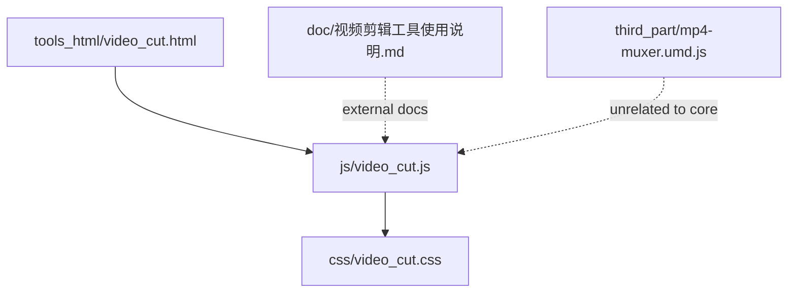
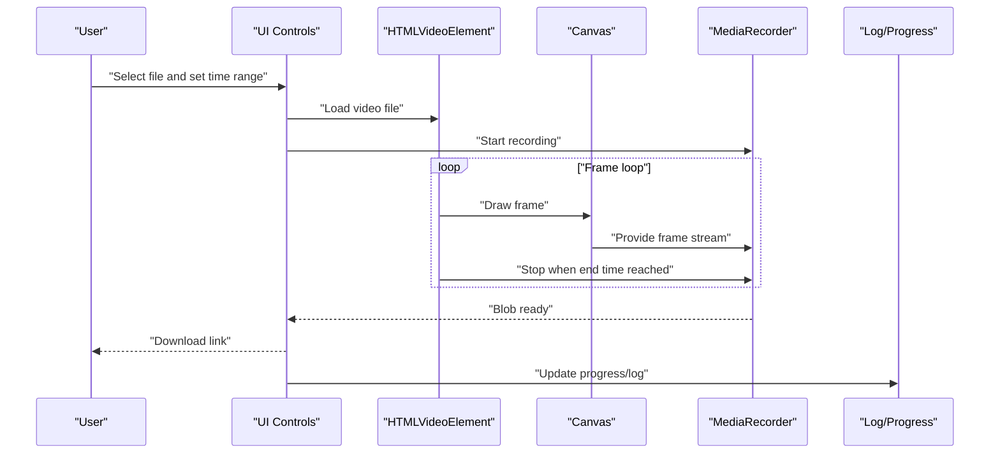
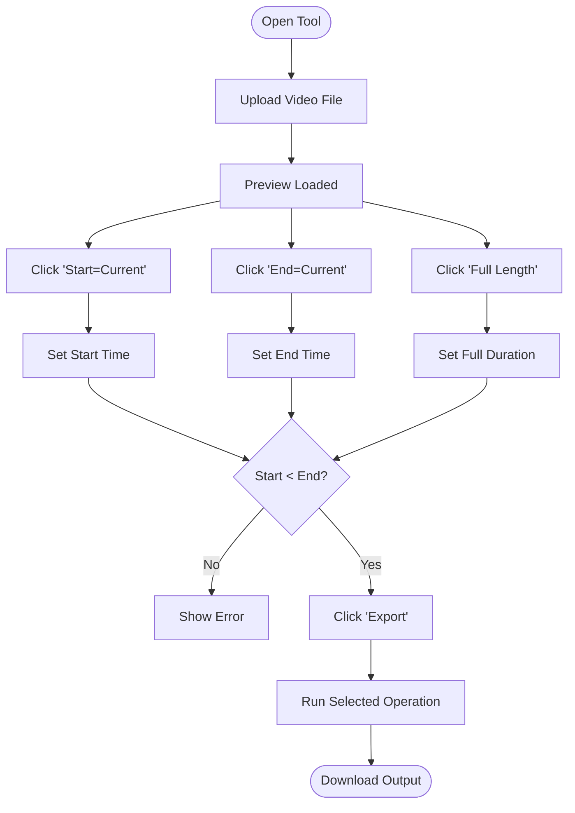
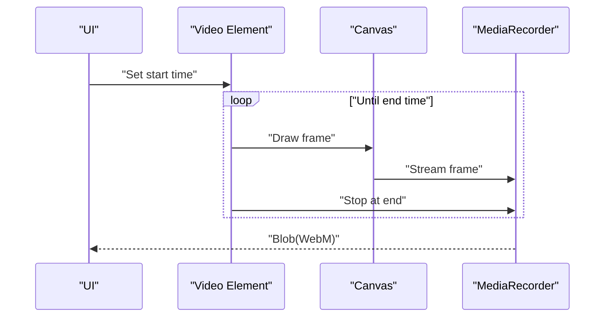
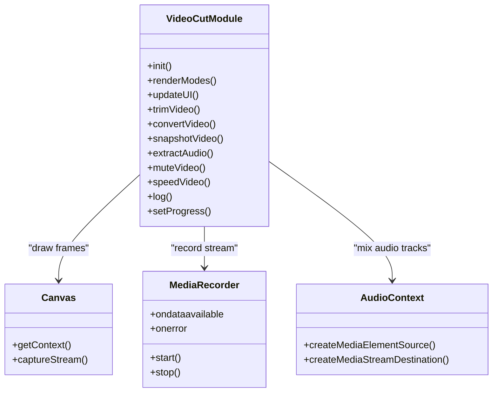
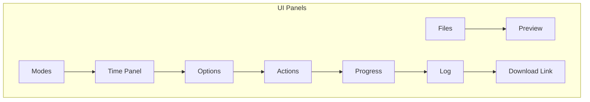
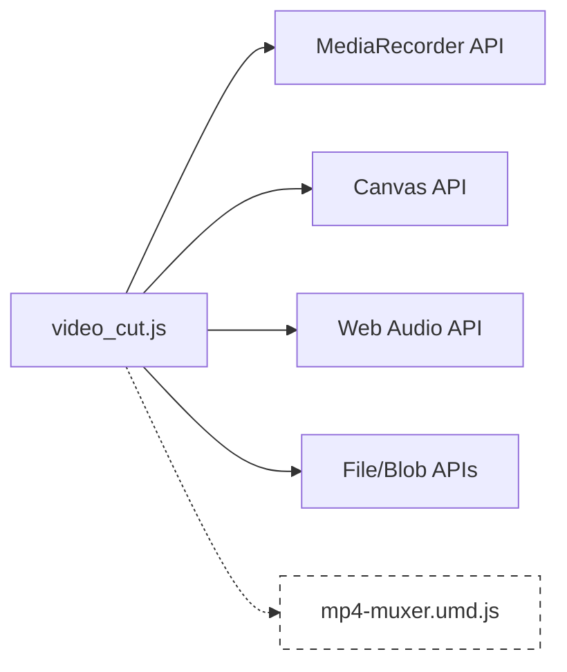

# Video Cutting and Trimming

<cite>
**Referenced Files in This Document**
- [video_cut.js](file://js/video_cut.js)
- [video_cut.css](file://css/video_cut.css)
- [video_cut.html](file://tools_html/video_cut.html)
- [视频剪辑工具使用说明.md](file://doc/视频剪辑工具使用说明.md)
- [mp4-muxer.umd.js](file://third_part/mp4-muxer.umd.js)
</cite>

## Table of Contents
1. [Introduction](#introduction)
2. [Project Structure](#project-structure)
3. [Core Components](#core-components)
4. [Architecture Overview](#architecture-overview)
5. [Detailed Component Analysis](#detailed-component-analysis)
6. [Dependency Analysis](#dependency-analysis)
7. [Performance Considerations](#performance-considerations)
8. [Troubleshooting Guide](#troubleshooting-guide)
9. [Conclusion](#conclusion)
10. [Appendices](#appendices)

## Introduction
This document explains the browser-native video cutting and trimming functionality implemented in the project. It focuses on how the application uses MediaRecorder API and Canvas capture to process video in real time, the timeline editing workflow, supported operations, and the UI components for file upload, preview controls, and export. It also covers browser compatibility, performance characteristics, and memory management considerations.

## Project Structure
The video cutting tool is organized as a self-contained module with HTML scaffolding, JavaScript logic, and CSS styling. The primary runtime is a single JavaScript file that initializes the UI, manages state, and performs video processing using browser APIs.

**Diagram sources**
- [video_cut.html:1-28](file://tools_html/video_cut.html#L1-L28)
- [video_cut.js:1-688](file://js/video_cut.js#L1-L688)
- [video_cut.css:1-253](file://css/video_cut.css#L1-L253)
- [视频剪辑工具使用说明.md:1-299](file://doc/视频剪辑工具使用说明.md#L1-L299)
- [mp4-muxer.umd.js:1-8](file://third_part/mp4-muxer.umd.js#L1-L8)

**Section sources**
- [video_cut.html:1-28](file://tools_html/video_cut.html#L1-L28)
- [video_cut.js:1-688](file://js/video_cut.js#L1-L688)
- [video_cut.css:1-253](file://css/video_cut.css#L1-L253)
- [视频剪辑工具使用说明.md:1-299](file://doc/视频剪辑工具使用说明.md#L1-L299)

## Core Components
- UI initialization and layout: The module renders a structured panel with file upload, preview, time controls, mode selection, options, progress, logs, and download link.
- Mode selection: Supports trimming, format conversion to WebM, snapshot extraction, audio extraction, mute, and speed adjustment.
- Real-time processing pipeline: Uses Canvas to draw frames and MediaRecorder to capture streams for encoding.
- Progress tracking and logging: Updates a progress bar and scrollable log box during operations.
- Export: Creates a downloadable Blob URL for the processed output.

Key implementation references:
- UI rendering and event wiring: [video_cut.js:5-687](file://js/video_cut.js#L5-L687)
- Mode definitions and options: [video_cut.js:68-107](file://js/video_cut.js#L68-L107)
- Processing functions: [video_cut.js:131-486](file://js/video_cut.js#L131-L486)
- Event handlers: [video_cut.js:526-677](file://js/video_cut.js#L526-L677)

**Section sources**
- [video_cut.js:5-687](file://js/video_cut.js#L5-L687)

## Architecture Overview
The tool is a pure client-side solution leveraging browser APIs:
- MediaRecorder captures encoded streams from Canvas and/or Web Audio tracks.
- Canvas draws video frames at a fixed frame rate to simulate real-time processing.
- Web Audio API extracts or mixes audio tracks for audio-related operations.
- File API handles local uploads and Blob creation for downloads.

**Diagram sources**
- [video_cut.js:131-198](file://js/video_cut.js#L131-L198)
- [video_cut.js:200-258](file://js/video_cut.js#L200-L258)
- [video_cut.js:294-349](file://js/video_cut.js#L294-L349)
- [video_cut.js:351-408](file://js/video_cut.js#L351-L408)
- [video_cut.js:410-486](file://js/video_cut.js#L410-L486)

## Detailed Component Analysis

### Timeline Editing Workflow
- Time range selection: Users can set start and end times in seconds, or use buttons to mark current playback position or apply full length.
- Playback markers: “Start=Current” and “End=Current” capture the current video time.
- Full length: Applies the entire video duration as the time range.
- Validation: Ensures start < end before processing.

**Diagram sources**
- [video_cut.js:545-563](file://js/video_cut.js#L545-L563)
- [video_cut.js:566-654](file://js/video_cut.js#L566-L654)

**Section sources**
- [video_cut.js:545-563](file://js/video_cut.js#L545-L563)
- [video_cut.js:566-654](file://js/video_cut.js#L566-L654)

### Supported Operations and Implementation Details

#### Trim Video
- Purpose: Extract a time-range segment preserving audio.
- Implementation: Draws frames to Canvas, captures stream, records with MediaRecorder using WebM with VP9 and Opus codecs.
- Progress: Linearly updates based on elapsed time within the selected range.
- Notes: Audio is mixed from the original video element’s audio track.

**Diagram sources**
- [video_cut.js:131-198](file://js/video_cut.js#L131-L198)

**Section sources**
- [video_cut.js:131-198](file://js/video_cut.js#L131-L198)

#### Convert to WebM
- Purpose: Re-encode the entire video to WebM with configurable video/audio bitrates.
- Implementation: Captures Canvas stream and records with MediaRecorder; selects codec based on browser support.
- Options: Video bitrate (Mbps) and audio bitrate (kbps).

**Section sources**
- [video_cut.js:200-258](file://js/video_cut.js#L200-L258)
- [video_cut.js:77-84](file://js/video_cut.js#L77-L84)

#### Snapshot (Still Image)
- Purpose: Extract a still image at a given time.
- Implementation: Seeks to the specified time, draws to Canvas, converts to Blob using chosen format and quality.

**Section sources**
- [video_cut.js:260-292](file://js/video_cut.js#L260-L292)
- [video_cut.js:85-99](file://js/video_cut.js#L85-L99)

#### Extract Audio
- Purpose: Export the audio track within a time range.
- Implementation: Creates a MediaStreamDestination from the video element’s audio source and records to WebM audio (Opus).

**Section sources**
- [video_cut.js:294-349](file://js/video_cut.js#L294-L349)

#### Mute Video
- Purpose: Produce a video without audio (remove audio track).
- Implementation: Similar to trim but with muted playback; records only video frames.

**Section sources**
- [video_cut.js:351-408](file://js/video_cut.js#L351-L408)

#### Speed Adjustment
- Purpose: Change playback speed within a time range.
- Implementation: Adjusts playbackRate on the video element; draws frames at the target FPS; records with MediaRecorder.
- Limitation: Changing playbackRate affects pitch; maintaining pitch would require advanced DSP beyond this tool.

**Section sources**
- [video_cut.js:410-486](file://js/video_cut.js#L410-L486)
- [视频剪辑工具使用说明.md:236-238](file://doc/视频剪辑工具使用说明.md#L236-L238)

### Real-Time Processing Using Canvas and MediaRecorder
- Frame capture: Canvas captures frames at a fixed frame rate; draw operations occur on each timeupdate until the end time.
- Stream composition: Canvas capture stream is combined with audio tracks (when applicable) before recording.
- Recording: MediaRecorder writes encoded chunks to an array; on stop, a Blob is constructed and made available for download.
- Progress: Progress percentage is computed based on elapsed time within the selected range.

**Diagram sources**
- [video_cut.js:131-486](file://js/video_cut.js#L131-L486)

**Section sources**
- [video_cut.js:131-486](file://js/video_cut.js#L131-L486)

### UI Components and Controls
- File upload: Single-file selector for video/audio.
- Preview: HTMLVideoElement with controls and playsinline.
- Modes: Radio-based selection among trim, convert, snapshot, audio, mute, speed.
- Time panel: Inputs for start and end times, quick-set buttons, and full-length button.
- Options panel: Mode-specific settings (bitrates, snapshot format/quality, speed rate).
- Actions: Export and Cancel buttons.
- Progress: Progress bar and percentage indicator.
- Log: Scrollable text area for operation messages.
- Download: Link to the generated output file.

**Diagram sources**
- [video_cut.js:5-57](file://js/video_cut.js#L5-L57)
- [video_cut.js:488-677](file://js/video_cut.js#L488-L677)

**Section sources**
- [video_cut.js:5-57](file://js/video_cut.js#L5-L57)
- [video_cut.js:488-677](file://js/video_cut.js#L488-L677)

## Dependency Analysis
- Internal dependencies:
  - UI and state management depend on DOM selectors and event handlers.
  - Processing functions depend on Canvas, MediaRecorder, and Web Audio APIs.
- External resources:
  - No external CDN or WASM dependencies; relies solely on browser APIs.
  - The mp4-muxer library exists in the repository but is not used by the video cutting module.

**Diagram sources**
- [video_cut.js:131-486](file://js/video_cut.js#L131-L486)
- [mp4-muxer.umd.js:1-8](file://third_part/mp4-muxer.umd.js#L1-L8)

**Section sources**
- [video_cut.js:131-486](file://js/video_cut.js#L131-L486)
- [mp4-muxer.umd.js:1-8](file://third_part/mp4-muxer.umd.js#L1-L8)

## Performance Considerations
- Processing speed: Operations run at real-time speed; processing a 10-minute clip takes approximately 10 minutes.
- Browser performance: Modern browsers (Chrome/Edge/Firefox/Opera) offer better performance; Safari support is partial.
- Memory usage: Large files and high resolutions increase memory pressure; consider splitting large clips or lowering resolution.
- Codec choice: WebM with VP9 and Opus is used; browser support varies; older devices may not support it.
- Recommendations: Reduce time range, lower bitrates, close other tabs, and use modern browsers.

**Section sources**
- [视频剪辑工具使用说明.md:191-202](file://doc/视频剪辑工具使用说明.md#L191-L202)
- [视频剪辑工具使用说明.md:170-187](file://doc/视频剪辑工具使用说明.md#L170-L187)
- [视频剪辑工具使用说明.md:228-234](file://doc/视频剪辑工具使用说明.md#L228-L234)

## Troubleshooting Guide
- Output is WebM: The tool uses WebM by design; MP4 requires external tools.
- Browser compatibility issues: Ensure the browser meets minimum version requirements; MediaRecorder availability differs by platform.
- Large file crashes: Close other tabs, split the file, or reduce resolution.
- Pitch change with speed: playbackRate affects both speed and pitch; maintaining pitch requires advanced DSP.
- Mobile device limitations: Safari on iOS/iPadOS has limited MediaRecorder support; avoid large files on mobile.

**Section sources**
- [视频剪辑工具使用说明.md:208-213](file://doc/视频剪辑工具使用说明.md#L208-L213)
- [视频剪辑工具使用说明.md:242-251](file://doc/视频剪辑工具使用说明.md#L242-L251)
- [视频剪辑工具使用说明.md:236-238](file://doc/视频剪辑工具使用说明.md#L236-L238)

## Conclusion
The video cutting tool provides a fully client-side solution for common video editing tasks using native browser APIs. It offers intuitive timeline controls, real-time processing, and a clean UI for exporting results. While it prioritizes simplicity and privacy, users should be aware of browser limitations, performance constraints, and the WebM-centric output format.

## Appendices

### Browser Compatibility and Requirements
- MediaRecorder API: Required for all operations.
- Canvas API: Required for frame drawing.
- Web Audio API: Required for audio operations.
- File API: Required for local file handling.

**Section sources**
- [视频剪辑工具使用说明.md:170-187](file://doc/视频剪辑工具使用说明.md#L170-L187)

### Export Formats and Notes
- WebM is the primary output format; MP4 requires external tools.
- Snapshot exports use selected image format and quality settings.

**Section sources**
- [video_cut.js:596-624](file://js/video_cut.js#L596-L624)
- [video_cut.js:85-99](file://js/video_cut.js#L85-L99)