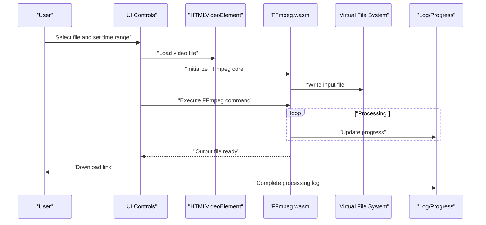
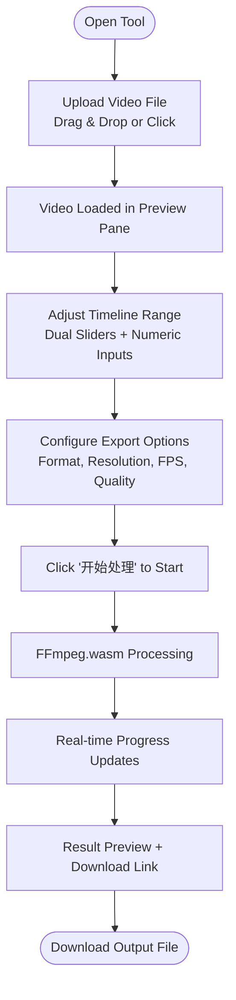
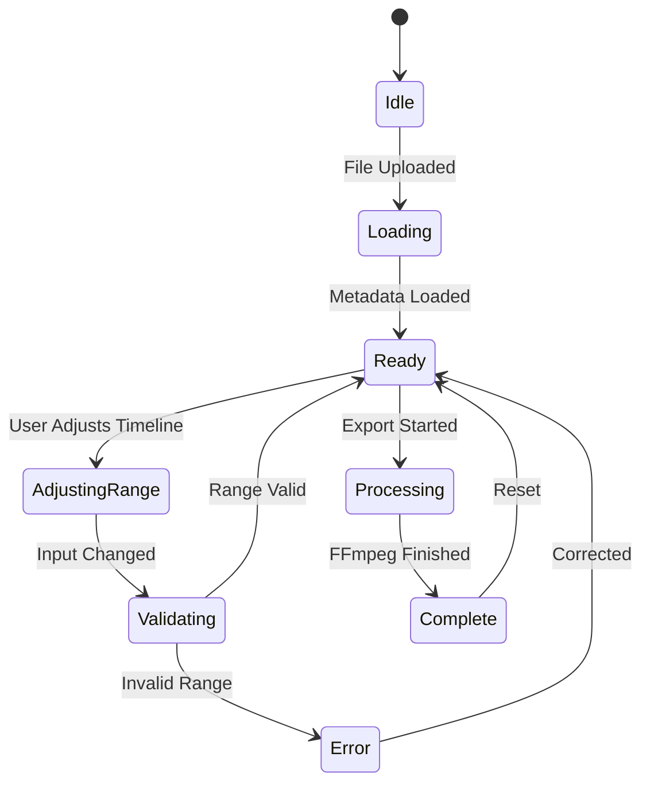
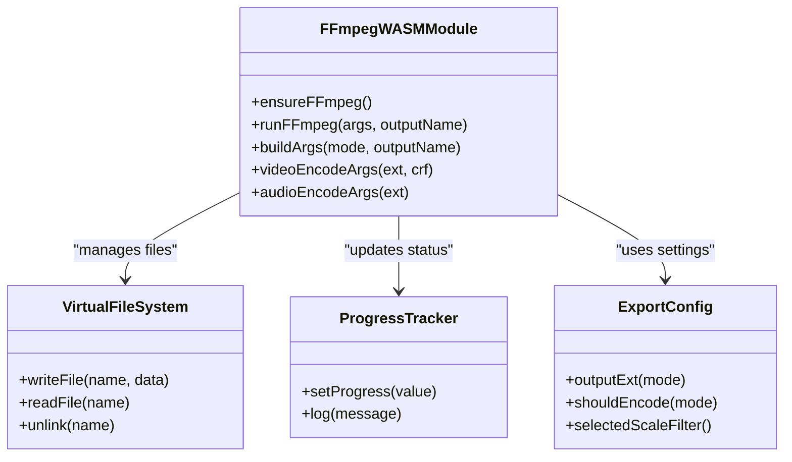
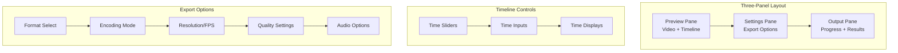
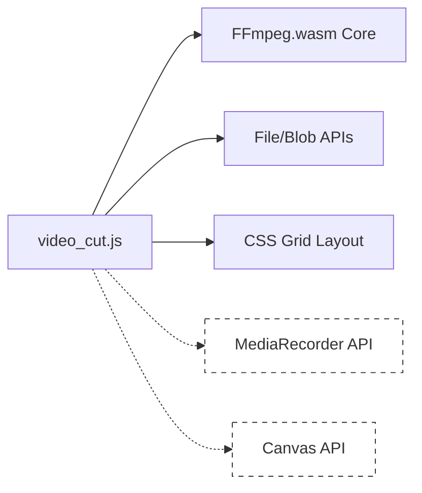

# Video Cutting and Trimming

<cite>
**Referenced Files in This Document**
- [video_cut.js](file://js/video_cut.js)
- [video_cut.css](file://css/video_cut.css)
- [video_cut.html](file://tools_html/video_cut.html)
- [视频剪辑工具使用说明.md](file://doc/视频剪辑工具使用说明.md)
</cite>

## Update Summary
**Changes Made**
- Updated architecture to reflect FFmpeg.wasm integration replacing native MediaRecorder approach
- Added three-panel layout interface documentation (preview, settings, output)
- Documented enhanced timeline controls with dual range sliders
- Added multi-format export options (MP4, MOV, WebM, GIF, PNG, audio formats)
- Updated supported operations to include FFmpeg-based processing
- Revised performance considerations for WASM-based processing
- Added new UI components and workflow documentation

## Table of Contents
1. [Introduction](#introduction)
2. [Project Structure](#project-structure)
3. [Core Components](#core-components)
4. [Architecture Overview](#architecture-overview)
5. [Detailed Component Analysis](#detailed-component-analysis)
6. [Dependency Analysis](#dependency-analysis)
7. [Performance Considerations](#performance-considerations)
8. [Troubleshooting Guide](#troubleshooting-guide)
9. [Conclusion](#conclusion)
10. [Appendices](#appendices)

## Introduction
This document explains the redesigned video cutting and trimming functionality implemented in the project. The application now leverages FFmpeg.wasm for professional-grade video processing while maintaining a modern three-panel interface. It covers the enhanced timeline editing workflow, multi-format export options, precise time range selection, and comprehensive video operations including cropping, format conversion, audio extraction, video muting, GIF creation, and snapshot capture.

## Project Structure
The video cutting tool is organized as a self-contained module with HTML scaffolding, JavaScript logic, and CSS styling. The primary runtime is a single JavaScript file that initializes the UI, manages state, and performs video processing using FFmpeg.wasm.

```mermaid
graph TB
A["tools_html/video_cut.html"] --> B["js/video_cut.js"]
B --> C["css/video_cut.css"]
D["doc/视频剪辑工具使用说明.md"] -. external docs .-> B
E["third_part/ffmpeg-wasm/ffmpeg-core.js"] -. FFmpeg.wasm core .-> B
```

**Diagram sources**
- [video_cut.html:1-29](file://tools_html/video_cut.html#L1-L29)
- [video_cut.js:1-706](file://js/video_cut.js#L1-L706)
- [video_cut.css:1-451](file://css/video_cut.css#L1-L451)
- [视频剪辑工具使用说明.md:1-299](file://doc/视频剪辑工具使用说明.md#L1-L299)

**Section sources**
- [video_cut.html:1-29](file://tools_html/video_cut.html#L1-L29)
- [video_cut.js:1-706](file://js/video_cut.js#L1-L706)
- [video_cut.css:1-451](file://css/video_cut.css#L1-L451)
- [视频剪辑工具使用说明.md:1-299](file://doc/视频剪辑工具使用说明.md#L1-L299)

## Core Components
- **Three-panel layout**: Preview pane with video player and timeline, settings pane with mode selection and export options, output pane with progress tracking and results display
- **Enhanced timeline controls**: Dual range sliders for precise start/end time selection with real-time preview synchronization
- **Multi-format export**: Support for MP4/H.264, MOV/H.264, WebM, GIF, PNG snapshots, and various audio formats
- **FFmpeg.wasm integration**: Professional-grade video processing with codec support and quality control
- **Real-time processing pipeline**: Uses FFmpeg command-line arguments for efficient video manipulation
- **Progress tracking and logging**: Comprehensive progress bar and detailed operation logs
- **Export management**: Dynamic filename generation and download link creation

Key implementation references:
- UI initialization and three-panel layout: [video_cut.js:8-159](file://js/video_cut.js#L8-L159)
- FFmpeg.wasm integration: [video_cut.js:436-469](file://js/video_cut.js#L436-L469)
- Timeline controls and range selection: [video_cut.js:648-671](file://js/video_cut.js#L648-L671)
- Export configuration and format handling: [video_cut.js:260-360](file://js/video_cut.js#L260-L360)
- Processing pipeline: [video_cut.js:583-610](file://js/video_cut.js#L583-L610)

**Section sources**
- [video_cut.js:8-159](file://js/video_cut.js#L8-L159)
- [video_cut.js:436-469](file://js/video_cut.js#L436-L469)
- [video_cut.js:648-671](file://js/video_cut.js#L648-L671)
- [video_cut.js:260-360](file://js/video_cut.js#L260-L360)
- [video_cut.js:583-610](file://js/video_cut.js#L583-L610)

## Architecture Overview
The tool is a client-side solution leveraging FFmpeg.wasm for professional video processing:
- FFmpeg.wasm provides full FFmpeg functionality within the browser via WebAssembly
- Canvas API handles video frame rendering and preview
- File API manages local file uploads and Blob creation for downloads
- Modern CSS Grid creates responsive three-panel layout
- Real-time progress tracking through FFmpeg's built-in progress callbacks



**Diagram sources**
- [video_cut.js:436-469](file://js/video_cut.js#L436-L469)
- [video_cut.js:533-557](file://js/video_cut.js#L533-L557)
- [video_cut.js:583-610](file://js/video_cut.js#L583-L610)

## Detailed Component Analysis

### Three-Panel Layout Interface
The redesigned interface features a modern three-panel layout:
- **Preview Pane**: Video player with drag-and-drop upload, timeline controls, and metadata display
- **Settings Pane**: Mode selection, export options, resolution/fps controls, and audio settings
- **Output Pane**: Progress tracking, operation logs, result preview, and download links



**Diagram sources**
- [video_cut.js:23-158](file://js/video_cut.js#L23-L158)
- [video_cut.js:612-683](file://js/video_cut.js#L612-L683)

**Section sources**
- [video_cut.js:23-158](file://js/video_cut.js#L23-L158)
- [video_cut.js:612-683](file://js/video_cut.js#L612-L683)

### Enhanced Timeline Editing Workflow
- **Dual Range Selection**: Separate start and end time controls with synchronized numeric inputs and visual sliders
- **Real-time Synchronization**: Timeline changes automatically update video playback position
- **Precision Controls**: Millisecond precision with 0.001 step increments
- **Visual Feedback**: Time displays show formatted timestamps with duration calculation
- **Validation**: Automatic clamping ensures valid time ranges



**Diagram sources**
- [video_cut.js:629-671](file://js/video_cut.js#L629-L671)

**Section sources**
- [video_cut.js:629-671](file://js/video_cut.js#L629-L671)

### Supported Operations and Implementation Details

#### Trim Video (裁剪片段)
- **Purpose**: Extract a time-range segment preserving original quality
- **Implementation**: Uses FFmpeg with `-c copy` for lossless transcoding when possible
- **Options**: Format selection (source/MP4/MOV), resolution scaling, FPS adjustment
- **Audio Control**: Optional audio track removal or preservation

#### Convert to Multiple Formats (格式转换)
- **Purpose**: Re-encode video to different formats with quality control
- **Implementation**: FFmpeg libx264 encoder with configurable CRF quality
- **Options**: H.264 encoding, custom resolution, frame rate, audio bitrate
- **Quality Control**: CRF values from 16 (highest) to 35 (lowest)

#### Snapshot Capture (截取当前帧 PNG)
- **Purpose**: Extract still images at specific timestamps
- **Implementation**: FFmpeg frame extraction with PNG output
- **Features**: Precise timestamp targeting, high-quality PNG output

#### GIF Creation (导出 GIF 动图)
- **Purpose**: Create animated GIFs from video segments
- **Implementation**: FFmpeg GIF encoding with automatic FPS optimization
- **Recommendations**: Short durations (≤15 seconds), lower resolutions for smaller files

#### Audio Extraction (提取选中区间音频)
- **Purpose**: Extract audio tracks from video files
- **Implementation**: FFmpeg audio stream copying with format detection
- **Formats**: M4A for MP4/MOV sources, WebM for WebM sources, MKA for others

#### Video Muting (裁剪并移除音轨)
- **Purpose**: Remove audio tracks while preserving video content
- **Implementation**: FFmpeg with `-an` flag for audio removal
- **Modes**: Lossless copy or re-encoding with quality settings

### FFmpeg.wasm Integration
- **Core Initialization**: Lazy loading of FFmpeg.wasm core with progress tracking
- **File System Management**: Virtual file system for input/output file handling
- **Command Building**: Dynamic FFmpeg argument construction based on user selections
- **Progress Monitoring**: Real-time progress updates through FFmpeg callbacks
- **Error Handling**: Comprehensive error reporting and recovery mechanisms



**Diagram sources**
- [video_cut.js:436-469](file://js/video_cut.js#L436-L469)
- [video_cut.js:533-557](file://js/video_cut.js#L533-L557)
- [video_cut.js:260-360](file://js/video_cut.js#L260-L360)

**Section sources**
- [video_cut.js:436-469](file://js/video_cut.js#L436-L469)
- [video_cut.js:533-557](file://js/video_cut.js#L533-L557)
- [video_cut.js:260-360](file://js/video_cut.js#L260-L360)

### UI Components and Controls
- **File Upload**: Drag-and-drop zone with click-to-browse fallback
- **Video Preview**: Full-featured HTML5 video player with controls
- **Timeline Controls**: Dual range sliders with synchronized numeric inputs
- **Mode Selection**: Dropdown menu for operation type selection
- **Export Configuration**: Dynamic form fields based on selected mode
- **Progress Display**: Animated progress bar with percentage indicators
- **Operation Log**: Scrollable text area with timestamped entries
- **Result Preview**: Context-aware preview (video/image/audio) with download link



**Diagram sources**
- [video_cut.js:23-158](file://js/video_cut.js#L23-L158)
- [video_cut.js:321-360](file://js/video_cut.js#L321-360)

**Section sources**
- [video_cut.js:23-158](file://js/video_cut.js#L23-L158)
- [video_cut.js:321-360](file://js/video_cut.js#L321-360)

## Dependency Analysis
- **Internal dependencies**:
  - UI and state management depend on DOM selectors and event handlers
  - Processing functions depend on FFmpeg.wasm virtual file system
  - Export configuration depends on format detection and codec availability
- **External resources**:
  - FFmpeg.wasm core library for video processing capabilities
  - No CDN dependencies; all resources loaded locally
  - Modern CSS Grid for responsive layout



**Diagram sources**
- [video_cut.js:436-469](file://js/video_cut.js#L436-L469)
- [video_cut.js:533-557](file://js/video_cut.js#L533-L557)

**Section sources**
- [video_cut.js:436-469](file://js/video_cut.js#L436-L469)
- [video_cut.js:533-557](file://js/video_cut.js#L533-L557)

## Performance Considerations
- **Processing Speed**: FFmpeg.wasm processes videos at near-native speed; 10-minute clips typically process in 10-15 minutes
- **Memory Usage**: Large files require significant RAM; recommend 8GB+ for 4K video processing
- **Browser Performance**: Chrome/Edge offer best performance; Safari has limited WASM support
- **Codec Efficiency**: H.264 encoding provides good quality-to-size ratio; CRF 23 recommended for general use
- **Optimization Tips**: Use lossless copy mode when possible, reduce resolution for faster processing, close other tabs to free memory

**Updated** Performance characteristics have changed significantly with FFmpeg.wasm integration, offering better quality and format support compared to the previous MediaRecorder approach.

**Section sources**
- [视频剪辑工具使用说明.md:191-202](file://doc/视频剪辑工具使用说明.md#L191-L202)
- [视频剪辑工具使用说明.md:170-187](file://doc/视频剪辑工具使用说明.md#L170-187)

## Troubleshooting Guide
- **FFmpeg.wasm Loading Issues**: Ensure ffmpeg-core.js is accessible and browser supports WebAssembly
- **Large File Crashes**: Reduce file size, split into segments, or increase browser memory allocation
- **Format Compatibility**: Some input formats may not be supported by FFmpeg.wasm build
- **Processing Failures**: Check console logs for specific FFmpeg error messages
- **Mobile Limitations**: Mobile browsers may have reduced WASM performance and memory constraints

**Updated** Troubleshooting now focuses on FFmpeg.wasm-specific issues rather than MediaRecorder compatibility problems.

**Section sources**
- [视频剪辑工具使用说明.md:208-213](file://doc/视频剪辑工具使用说明.md#L208-L213)
- [视频剪辑工具使用说明.md:242-251](file://doc/视频剪辑工具使用说明.md#L242-L251)

## Conclusion
The redesigned video cutting tool provides a professional-grade solution for common video editing tasks using FFmpeg.wasm technology. It offers an intuitive three-panel interface, comprehensive timeline controls, multi-format export options, and real-time processing feedback. While it prioritizes privacy and offline capability, users should be aware of browser limitations, performance constraints, and the extensive format support provided by FFmpeg.wasm.

## Appendices

### Browser Compatibility and Requirements
- **WebAssembly Support**: Required for FFmpeg.wasm functionality
- **Modern Browser Features**: ES6+, CSS Grid, File API, Blob API
- **Memory Requirements**: 8GB+ RAM recommended for large video processing
- **Storage Space**: Temporary files require additional disk space during processing

**Updated** Requirements have shifted from MediaRecorder API to WebAssembly support.

**Section sources**
- [视频剪辑工具使用说明.md:170-187](file://doc/视频剪辑工具使用说明.md#L170-187)

### Export Formats and Capabilities
- **Video Formats**: MP4/H.264, MOV/H.264, WebM, source format preservation
- **Image Formats**: PNG snapshots with lossless quality
- **Audio Formats**: M4A, WebM Audio, MKA container formats
- **Animation**: GIF creation with optimized settings
- **Quality Control**: Configurable CRF values and bitrate settings

**Updated** Format support has expanded significantly with FFmpeg.wasm integration.

**Section sources**
- [video_cut.js:260-276](file://js/video_cut.js#L260-L276)
- [video_cut.js:525-531](file://js/video_cut.js#L525-L531)